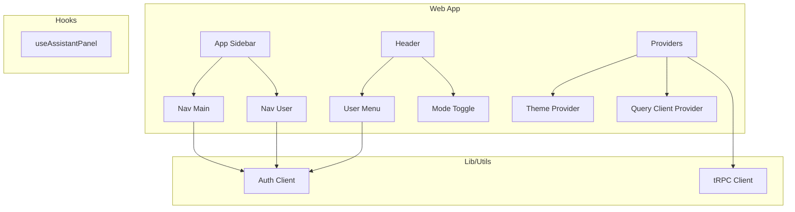
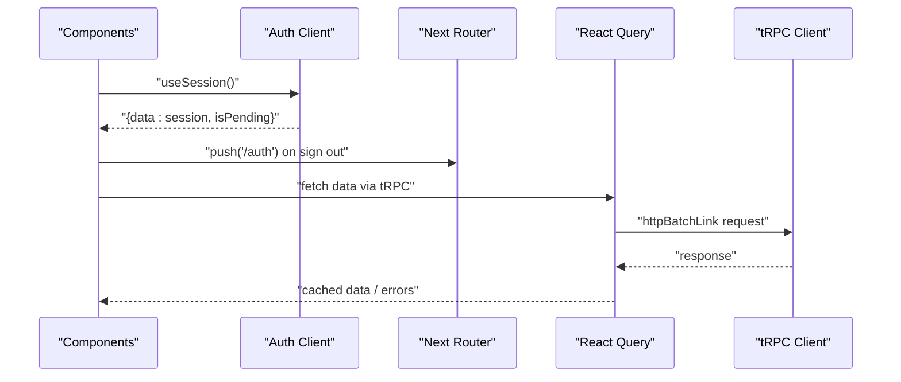
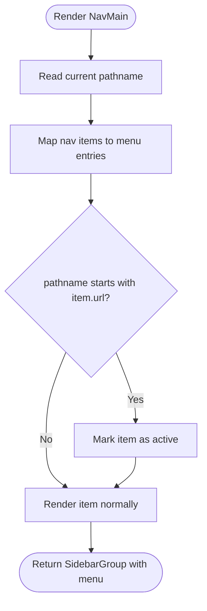
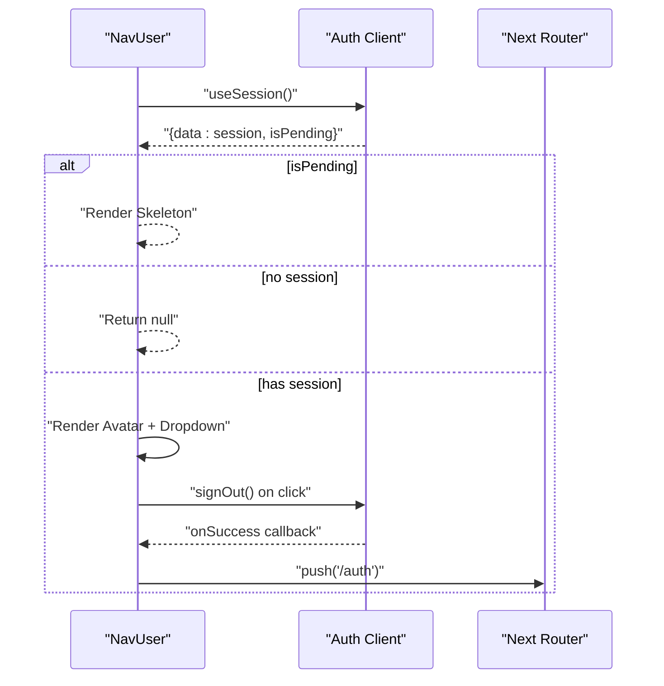
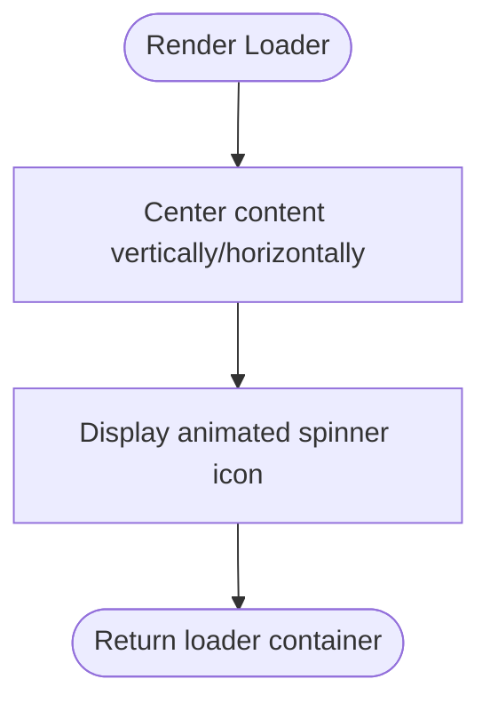
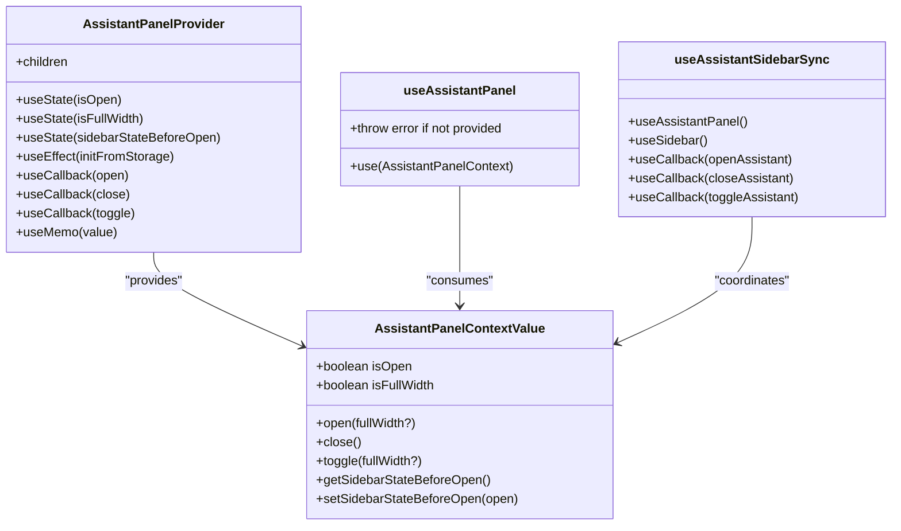
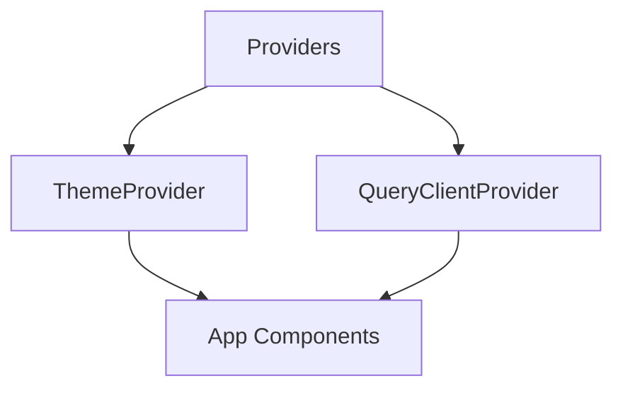
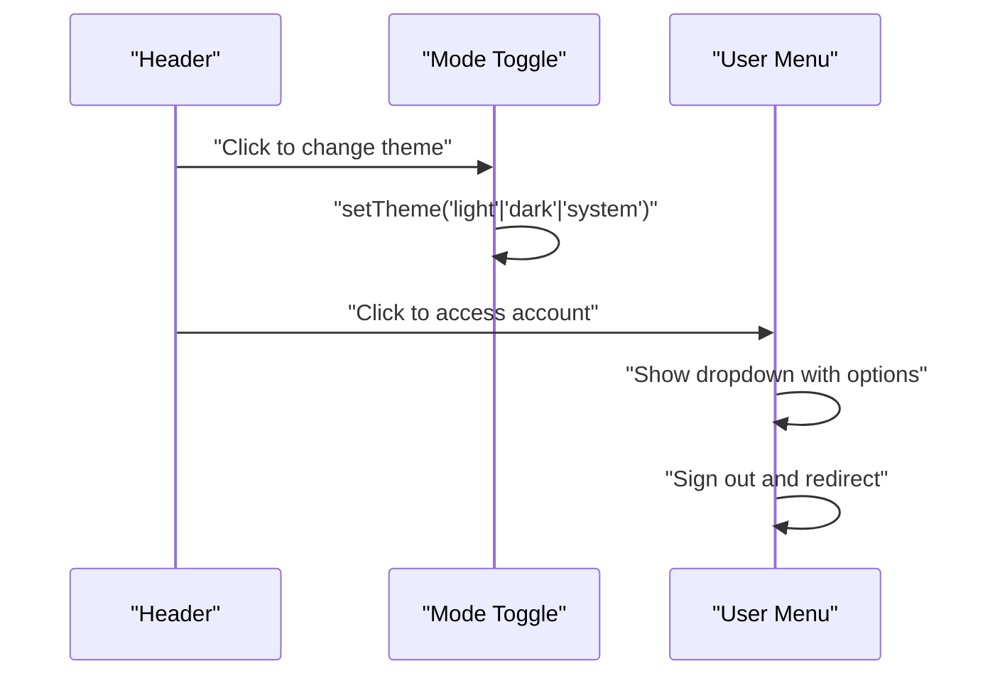
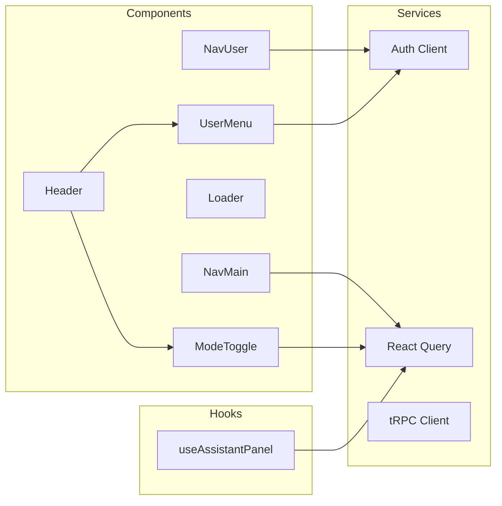

# Component Patterns

<cite>
**Referenced Files in This Document**
- [nav-main.tsx](file://apps/web/src/components/nav-main.tsx)
- [nav-user.tsx](file://apps/web/src/components/nav-user.tsx)
- [loader.tsx](file://apps/web/src/components/loader.tsx)
- [use-assistant-panel.tsx](file://apps/web/src/hooks/use-assistant-panel.tsx)
- [providers.tsx](file://apps/web/src/components/providers.tsx)
- [theme-provider.tsx](file://apps/web/src/components/theme-provider.tsx)
- [app-sidebar.tsx](file://apps/web/src/components/app-sidebar.tsx)
- [header.tsx](file://apps/web/src/components/header.tsx)
- [user-menu.tsx](file://apps/web/src/components/user-menu.tsx)
- [mode-toggle.tsx](file://apps/web/src/components/mode-toggle.tsx)
- [auth-client.ts](file://apps/web/src/lib/auth-client.ts)
- [trpc.ts](file://apps/web/src/utils/trpc.ts)
</cite>

## Table of Contents

1. [Introduction](#introduction)
2. [Project Structure](#project-structure)
3. [Core Components](#core-components)
4. [Architecture Overview](#architecture-overview)
5. [Detailed Component Analysis](#detailed-component-analysis)
6. [Dependency Analysis](#dependency-analysis)
7. [Performance Considerations](#performance-considerations)
8. [Troubleshooting Guide](#troubleshooting-guide)
9. [Conclusion](#conclusion)

## Introduction

This document explains the component design patterns and architectural principles used across the application, focusing on:

- Navigation patterns in NavMain and NavUser
- Loading states management in Loader and related UI
- Common patterns for prop validation, event handling, and state management
- Component composition strategies, reusability, and performance optimization
- Custom hooks usage, context integration, and best practices for maintainable architecture

The goal is to make these patterns accessible to both technical and non-technical readers while providing code-level references for deeper understanding.

## Project Structure

At a high level, the web app organizes features under apps/web/src with:

- components: UI building blocks (navigation, layout, user controls, loaders)
- hooks: reusable logic encapsulated as custom hooks (e.g., assistant panel state)
- lib: client integrations (e.g., auth client)
- utils: shared utilities (e.g., tRPC client configuration)

**Diagram sources**

- [app-sidebar.tsx:13-24](file://apps/web/src/components/app-sidebar.tsx#L13-L24)
- [nav-main.tsx:39-63](file://apps/web/src/components/nav-main.tsx#L39-L63)
- [nav-user.tsx:26-110](file://apps/web/src/components/nav-user.tsx#L26-L110)
- [header.tsx:7-31](file://apps/web/src/components/header.tsx#L7-L31)
- [user-menu.tsx:17-61](file://apps/web/src/components/user-menu.tsx#L17-L61)
- [mode-toggle.tsx:13-36](file://apps/web/src/components/mode-toggle.tsx#L13-L36)
- [providers.tsx:11-26](file://apps/web/src/components/providers.tsx#L11-L26)
- [theme-provider.tsx:6-11](file://apps/web/src/components/theme-provider.tsx#L6-L11)
- [auth-client.ts:5-7](file://apps/web/src/lib/auth-client.ts#L5-L7)
- [trpc.ts:7-39](file://apps/web/src/utils/trpc.ts#L7-L39)

**Section sources**

- [app-sidebar.tsx:13-24](file://apps/web/src/components/app-sidebar.tsx#L13-L24)
- [providers.tsx:11-26](file://apps/web/src/components/providers.tsx#L11-L26)

## Core Components

Key components that demonstrate navigation, loading, and state patterns:

- NavMain: Renders sidebar navigation with active route detection
- NavUser: Displays user avatar and dropdown menu; handles sign-out flow
- Loader: Simple spinner for loading states
- Providers: Wraps app with theme and query clients
- ThemeProvider: Encapsulates theme behavior
- Header/UserMenu/ModeToggle: Top-level UI interactions
- useAssistantPanel: Context-based state for assistant panel and sidebar coordination

These components follow consistent patterns:

- Composition over props proliferation
- Clear separation of concerns (UI vs state)
- Use of React Query for data fetching and caching
- Centralized providers for cross-cutting concerns

**Section sources**

- [nav-main.tsx:39-63](file://apps/web/src/components/nav-main.tsx#L39-L63)
- [nav-user.tsx:26-110](file://apps/web/src/components/nav-user.tsx#L26-L110)
- [loader.tsx:3-9](file://apps/web/src/components/loader.tsx#L3-L9)
- [providers.tsx:11-26](file://apps/web/src/components/providers.tsx#L11-L26)
- [theme-provider.tsx:6-11](file://apps/web/src/components/theme-provider.tsx#L6-L11)
- [header.tsx:7-31](file://apps/web/src/components/header.tsx#L7-L31)
- [user-menu.tsx:17-61](file://apps/web/src/components/user-menu.tsx#L17-L61)
- [mode-toggle.tsx:13-36](file://apps/web/src/components/mode-toggle.tsx#L13-L36)
- [use-assistant-panel.tsx:67-161](file://apps/web/src/hooks/use-assistant-panel.tsx#L67-L161)

## Architecture Overview

The application uses a provider-driven architecture:

- Providers wrap the app to inject global services (theme, queries)
- Components consume context via hooks or library-provided hooks
- Data fetching is centralized through React Query and tRPC
- Authentication state is managed by an auth client hook

**Diagram sources**

- [nav-user.tsx:26-110](file://apps/web/src/components/nav-user.tsx#L26-L110)
- [user-menu.tsx:17-61](file://apps/web/src/components/user-menu.tsx#L17-L61)
- [providers.tsx:11-26](file://apps/web/src/components/providers.tsx#L11-L26)
- [auth-client.ts:5-7](file://apps/web/src/lib/auth-client.ts#L5-L7)
- [trpc.ts:22-39](file://apps/web/src/utils/trpc.ts#L22-L39)

## Detailed Component Analysis

### NavMain Navigation Pattern

NavMain renders a list of navigation items using a data-driven approach. It determines the active route based on the current pathname and highlights the corresponding item.

Key patterns:

- Data-driven rendering: navigation items are defined as structured data
- Active state derived from router: uses pathname to compute isActive
- Composition with UI primitives: composes icons, links, and buttons

**Diagram sources**

- [nav-main.tsx:14-37](file://apps/web/src/components/nav-main.tsx#L14-L37)
- [nav-main.tsx:39-63](file://apps/web/src/components/nav-main.tsx#L39-L63)

**Section sources**

- [nav-main.tsx:14-63](file://apps/web/src/components/nav-main.tsx#L14-L63)

### NavUser Authentication and Dropdown Pattern

NavUser manages user session display and sign-out actions. It shows a skeleton during pending authentication, hides itself when no session exists, and renders a dropdown menu with user details and logout option.

Key patterns:

- Conditional rendering based on session state
- Skeleton placeholders for loading states
- Event handling for sign-out with routing after success
- Responsive dropdown positioning based on sidebar mode

**Diagram sources**

- [nav-user.tsx:26-110](file://apps/web/src/components/nav-user.tsx#L26-L110)
- [auth-client.ts:5-7](file://apps/web/src/lib/auth-client.ts#L5-L7)

**Section sources**

- [nav-user.tsx:26-110](file://apps/web/src/components/nav-user.tsx#L26-L110)

### Loader Loading State Pattern

Loader provides a minimal spinner component for indicating loading states. It’s designed to be composable and can be used wherever a simple loading indicator is needed.

Key patterns:

- Stateless presentation component
- Centered layout with animation class
- Reusable across different contexts

**Diagram sources**

- [loader.tsx:3-9](file://apps/web/src/components/loader.tsx#L3-L9)

**Section sources**

- [loader.tsx:3-9](file://apps/web/src/components/loader.tsx#L3-L9)

### Assistant Panel Context and State Management

The assistant panel demonstrates advanced state management using React Context and localStorage persistence. It coordinates panel open/close states, full-width mode, and sidebar synchronization.

Key patterns:

- Context-based state sharing across components
- LocalStorage persistence for UI preferences
- Memoization for performance optimization
- Error handling for storage unavailability
- Hook composition for complex behaviors

**Diagram sources**

- [use-assistant-panel.tsx:20-28](file://apps/web/src/hooks/use-assistant-panel.tsx#L20-L28)
- [use-assistant-panel.tsx:67-161](file://apps/web/src/hooks/use-assistant-panel.tsx#L67-L161)
- [use-assistant-panel.tsx:169-235](file://apps/web/src/hooks/use-assistant-panel.tsx#L169-L235)

**Section sources**

- [use-assistant-panel.tsx:67-161](file://apps/web/src/hooks/use-assistant-panel.tsx#L67-L161)
- [use-assistant-panel.tsx:169-235](file://apps/web/src/hooks/use-assistant-panel.tsx#L169-L235)

### Provider Architecture and Global State

Providers establish the application-wide context for theming and data fetching. They wrap child components to provide consistent behavior across the app.

Key patterns:

- Single source of truth for global services
- Separation of concerns between UI and infrastructure
- Error boundaries and toast notifications for user feedback

**Diagram sources**

- [providers.tsx:11-26](file://apps/web/src/components/providers.tsx#L11-L26)
- [theme-provider.tsx:6-11](file://apps/web/src/components/theme-provider.tsx#L6-L11)

**Section sources**

- [providers.tsx:11-26](file://apps/web/src/components/providers.tsx#L11-L26)
- [theme-provider.tsx:6-11](file://apps/web/src/components/theme-provider.tsx#L6-L11)

### Header and User Interaction Patterns

The header demonstrates top-level navigation and user interaction patterns, including mode toggling and user menu access.

Key patterns:

- Composed navigation links
- Theme switching via dropdown menu
- User account management with conditional rendering

**Diagram sources**

- [header.tsx:7-31](file://apps/web/src/components/header.tsx#L7-L31)
- [mode-toggle.tsx:13-36](file://apps/web/src/components/mode-toggle.tsx#L13-L36)
- [user-menu.tsx:17-61](file://apps/web/src/components/user-menu.tsx#L17-L61)

**Section sources**

- [header.tsx:7-31](file://apps/web/src/components/header.tsx#L7-L31)
- [mode-toggle.tsx:13-36](file://apps/web/src/components/mode-toggle.tsx#L13-L36)
- [user-menu.tsx:17-61](file://apps/web/src/components/user-menu.tsx#L17-L61)

## Dependency Analysis

The application follows clear dependency boundaries:

- Components depend on UI libraries and internal hooks
- Hooks depend on React APIs and external services
- Providers orchestrate global dependencies
- Data layer abstracts network communication

**Diagram sources**

- [nav-main.tsx:39-63](file://apps/web/src/components/nav-main.tsx#L39-L63)
- [nav-user.tsx:26-110](file://apps/web/src/components/nav-user.tsx#L26-L110)
- [user-menu.tsx:17-61](file://apps/web/src/components/user-menu.tsx#L17-L61)
- [mode-toggle.tsx:13-36](file://apps/web/src/components/mode-toggle.tsx#L13-L36)
- [use-assistant-panel.tsx:67-161](file://apps/web/src/hooks/use-assistant-panel.tsx#L67-L161)
- [auth-client.ts:5-7](file://apps/web/src/lib/auth-client.ts#L5-L7)
- [trpc.ts:22-39](file://apps/web/src/utils/trpc.ts#L22-L39)

**Section sources**

- [nav-main.tsx:39-63](file://apps/web/src/components/nav-main.tsx#L39-L63)
- [nav-user.tsx:26-110](file://apps/web/src/components/nav-user.tsx#L26-L110)
- [use-assistant-panel.tsx:67-161](file://apps/web/src/hooks/use-assistant-panel.tsx#L67-L161)

## Performance Considerations

Several performance optimizations are implemented throughout the application:

- **Memoization**: Context values are memoized to prevent unnecessary re-renders
- **Conditional Rendering**: Components render only what's necessary based on state
- **Skeleton Loading**: Provides better perceived performance during data fetching
- **Efficient Navigation**: Uses Next.js routing for optimal page transitions
- **Caching**: React Query caches API responses to reduce network requests
- **Storage Optimization**: LocalStorage operations are wrapped in try-catch blocks

Best practices demonstrated:

- Use `useMemo` for expensive computations
- Implement proper loading states with skeletons
- Avoid unnecessary re-renders through proper state management
- Leverage browser APIs efficiently (localStorage, requestAnimationFrame)

[No sources needed since this section provides general guidance]

## Troubleshooting Guide

Common issues and their solutions:

### Authentication Issues

- **Problem**: Session not loading properly
- **Solution**: Check auth client configuration and ensure proper error handling
- **Pattern**: Use `isPending` state to show loading indicators

### Storage Errors

- **Problem**: LocalStorage unavailable in private browsing mode
- **Solution**: Wrap storage operations in try-catch blocks with fallback behavior
- **Pattern**: Graceful degradation when storage is unavailable

### Navigation Problems

- **Problem**: Active route not highlighting correctly
- **Solution**: Ensure pathname matching logic accounts for URL variations
- **Pattern**: Use `startsWith` for flexible route matching

### Context Errors

- **Problem**: Using hooks outside provider context
- **Solution**: Ensure proper provider wrapping and add error checking
- **Pattern**: Throw descriptive errors when context is missing

**Section sources**

- [use-assistant-panel.tsx:153-161](file://apps/web/src/hooks/use-assistant-panel.tsx#L153-L161)
- [use-assistant-panel.tsx:46-61](file://apps/web/src/hooks/use-assistant-panel.tsx#L46-L61)
- [nav-main.tsx:40-50](file://apps/web/src/components/nav-main.tsx#L40-L50)

## Conclusion

The application demonstrates modern React patterns with a focus on:

- Clean component composition and separation of concerns
- Robust state management through context and hooks
- Efficient data fetching with React Query and tRPC
- User-friendly loading states and error handling
- Maintainable architecture with clear dependency boundaries

These patterns create a scalable foundation that supports feature growth while maintaining code quality and performance. The modular design allows for easy testing, debugging, and future enhancements.

[No sources needed since this section summarizes without analyzing specific files]
