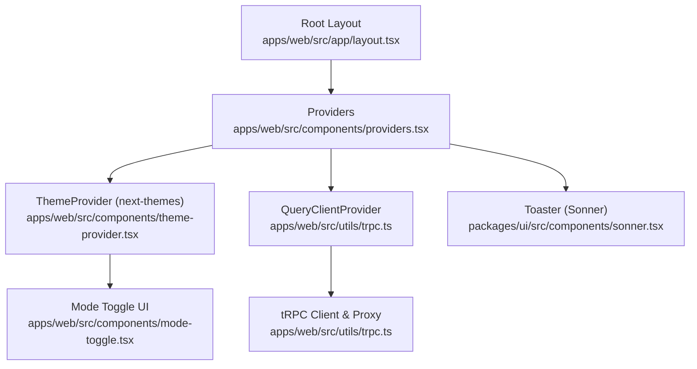
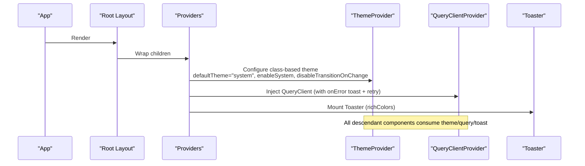
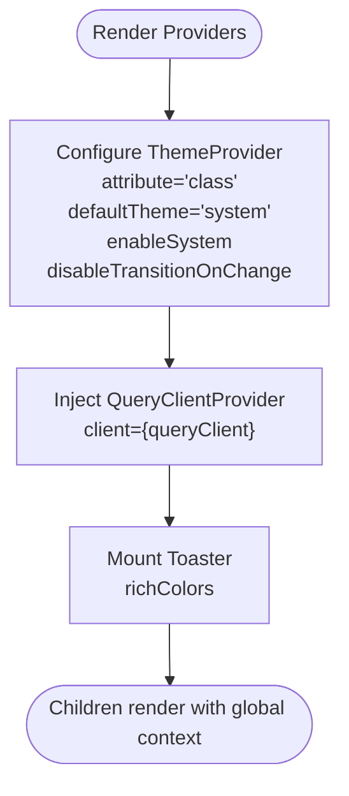
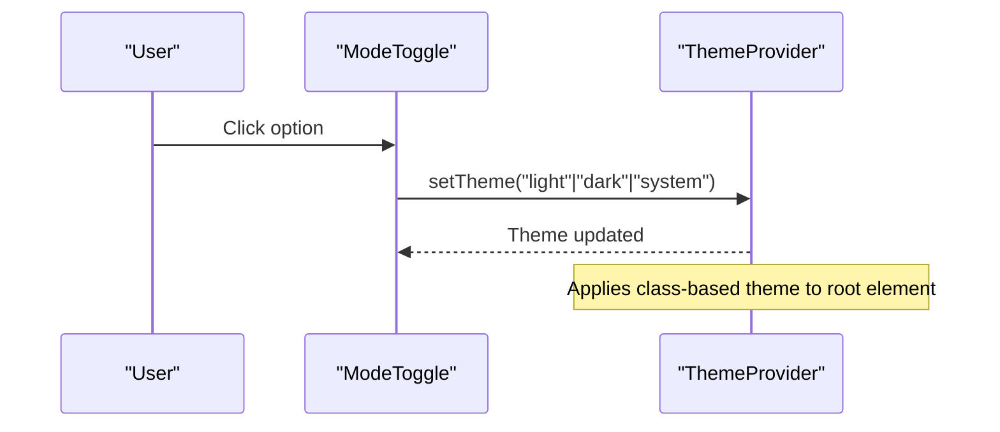
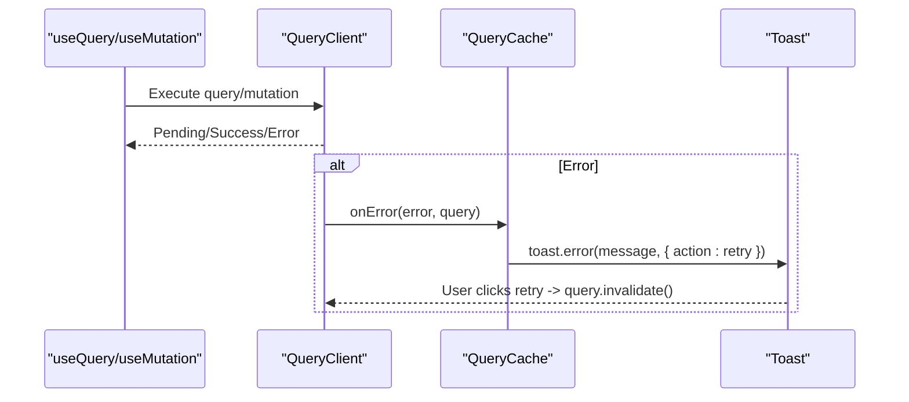
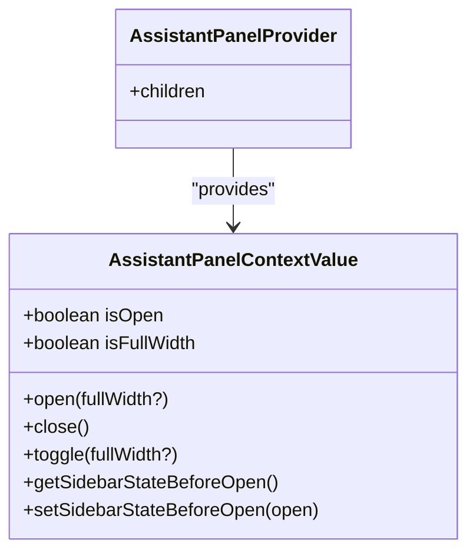
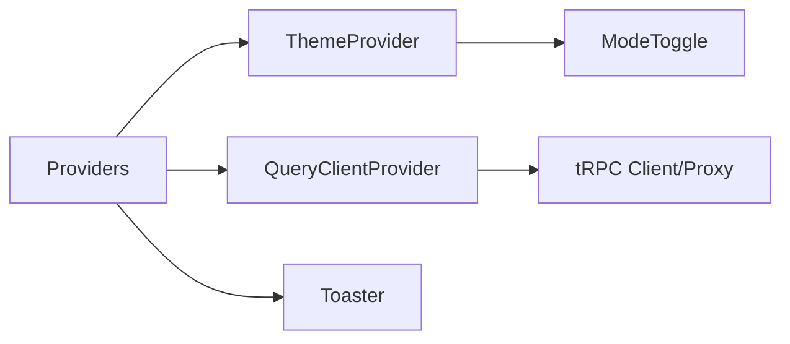

# Provider System

<cite>
**Referenced Files in This Document**
- [providers.tsx](file://apps/web/src/components/providers.tsx)
- [theme-provider.tsx](file://apps/web/src/components/theme-provider.tsx)
- [layout.tsx](file://apps/web/src/app/layout.tsx)
- [trpc.ts](file://apps/web/src/utils/trpc.ts)
- [sonner.tsx](file://packages/ui/src/components/sonner.tsx)
- [mode-toggle.tsx](file://apps/web/src/components/mode-toggle.tsx)
- [use-assistant-panel.tsx](file://apps/web/src/hooks/use-assistant-panel.tsx)
</cite>

## Table of Contents

1. [Introduction](#introduction)
2. [Project Structure](#project-structure)
3. [Core Components](#core-components)
4. [Architecture Overview](#architecture-overview)
5. [Detailed Component Analysis](#detailed-component-analysis)
6. [Dependency Analysis](#dependency-analysis)
7. [Performance Considerations](#performance-considerations)
8. [Troubleshooting Guide](#troubleshooting-guide)
9. [Conclusion](#conclusion)
10. [Appendices](#appendices)

## Introduction

This document explains the React provider system that powers global state and application-wide concerns in the web app. It focuses on:

- The Providers component that wraps the entire application with ThemeProvider, QueryClientProvider, and Toast notifications.
- Theme configuration using next-themes with system theme detection, class-based theming, and transition controls.
- TanStack Query client setup and integration patterns via tRPC.
- How to extend the provider system with additional contexts and best practices for performance optimization.

## Project Structure

The provider system is anchored at the root layout and composed into a single Providers component that injects theme, data fetching, and toast capabilities across the app.



**Diagram sources**

- [layout.tsx:26-46](file://apps/web/src/app/layout.tsx#L26-L46)
- [providers.tsx:11-26](file://apps/web/src/components/providers.tsx#L11-L26)
- [theme-provider.tsx:6-11](file://apps/web/src/components/theme-provider.tsx#L6-L11)
- [trpc.ts:7-39](file://apps/web/src/utils/trpc.ts#L7-L39)
- [sonner.tsx:15-77](file://packages/ui/src/components/sonner.tsx#L15-L77)
- [mode-toggle.tsx:13-35](file://apps/web/src/components/mode-toggle.tsx#L13-L35)

**Section sources**

- [layout.tsx:26-46](file://apps/web/src/app/layout.tsx#L26-L46)
- [providers.tsx:11-26](file://apps/web/src/components/providers.tsx#L11-L26)

## Core Components

- Providers: A client-side wrapper that composes ThemeProvider, QueryClientProvider, and Toaster. It sets up class-based theming, system theme detection, and disables transitions on theme changes for smoother UX.
- ThemeProvider: A thin wrapper around next-themes’ ThemeProvider that forwards props like attribute, defaultTheme, enableSystem, and disableTransitionOnChange.
- QueryClientProvider: Wraps the app with a configured TanStack Query client that integrates error handling with toast notifications and supports retry actions.
- Toaster: A Sonner-based toaster integrated with the theme system and styled with CSS variables from the design tokens.

Key responsibilities:

- Provide global theme context to all components.
- Provide global query cache and client to all data-fetching hooks.
- Provide global toast notifications for user feedback.

**Section sources**

- [providers.tsx:11-26](file://apps/web/src/components/providers.tsx#L11-L26)
- [theme-provider.tsx:6-11](file://apps/web/src/components/theme-provider.tsx#L6-L11)
- [trpc.ts:7-39](file://apps/web/src/utils/trpc.ts#L7-L39)
- [sonner.tsx:15-77](file://packages/ui/src/components/sonner.tsx#L15-L77)

## Architecture Overview

The Providers component is mounted once per page load inside the root layout. It establishes a consistent environment for all child components:

- Theming: next-themes manages light/dark/system themes by toggling classes on the HTML element.
- Data layer: TanStack Query caches server state and coordinates invalidation; errors are surfaced as toasts with a retry action.
- Notifications: Sonner’s Toaster renders globally accessible toast messages.



**Diagram sources**

- [layout.tsx:26-46](file://apps/web/src/app/layout.tsx#L26-L46)
- [providers.tsx:11-26](file://apps/web/src/components/providers.tsx#L11-L26)
- [trpc.ts:7-39](file://apps/web/src/utils/trpc.ts#L7-L39)
- [sonner.tsx:15-77](file://packages/ui/src/components/sonner.tsx#L15-L77)

## Detailed Component Analysis

### Providers Component

- Purpose: Central composition point for cross-cutting concerns (theming, data, notifications).
- Configuration highlights:
  - ThemeProvider: attribute="class", defaultTheme="system", enableSystem, disableTransitionOnChange.
  - QueryClientProvider: receives a shared QueryClient instance configured with error handling and toast integration.
  - Toaster: rendered outside QueryClientProvider but within ThemeProvider so it inherits theme styling.



**Diagram sources**

- [providers.tsx:11-26](file://apps/web/src/components/providers.tsx#L11-L26)

**Section sources**

- [providers.tsx:11-26](file://apps/web/src/components/providers.tsx#L11-L26)

### Theme Provider Configuration

- Implementation: A thin wrapper around next-themes’ ThemeProvider that forwards all props.
- Behavior:
  - Class-based theming: Uses attribute="class" to toggle theme classes on the root element.
  - System theme detection: defaultTheme="system" and enableSystem ensure the app respects OS preferences initially.
  - Transition control: disableTransitionOnChange prevents jarring visual transitions when switching themes.
- User interaction: ModeToggle uses useTheme to set "light", "dark", or "system".



**Diagram sources**

- [theme-provider.tsx:6-11](file://apps/web/src/components/theme-provider.tsx#L6-L11)
- [mode-toggle.tsx:13-35](file://apps/web/src/components/mode-toggle.tsx#L13-L35)

**Section sources**

- [theme-provider.tsx:6-11](file://apps/web/src/components/theme-provider.tsx#L6-L11)
- [mode-toggle.tsx:13-35](file://apps/web/src/components/mode-toggle.tsx#L13-L35)

### TanStack Query Client Setup and Integration

- Client creation: A shared QueryClient is created with a custom QueryCache.onError handler that shows a toast with a “retry” action to invalidate and refetch the failed query.
- tRPC integration: The same QueryClient is used to create a typed tRPC proxy, enabling type-safe queries and mutations that integrate seamlessly with caching and invalidation.
- Network behavior: httpBatchLink batches requests to /api/trpc with credentials included for authentication cookies.



**Diagram sources**

- [trpc.ts:7-39](file://apps/web/src/utils/trpc.ts#L7-L39)

**Section sources**

- [trpc.ts:7-39](file://apps/web/src/utils/trpc.ts#L7-L39)

### Toast Notifications

- Implementation: A themed Toaster built on Sonner, consuming next-themes to match the current theme. Icons are customized per toast type and styles are driven by CSS variables.
- Usage: Mounted once in Providers; any component can call toast functions to show messages.

```mermaid
classDiagram
class Toaster {
+props : ToasterProps
+theme : "light" | "dark" | "system"
+icons : { error, info, loading, success, warning }
+toastOptions.classNames
}
class NextThemes {
+useTheme()
}
Toaster --> NextThemes : "consumes theme"
```

**Diagram sources**

- [sonner.tsx:15-77](file://packages/ui/src/components/sonner.tsx#L15-L77)

**Section sources**

- [sonner.tsx:15-77](file://packages/ui/src/components/sonner.tsx#L15-L77)

### Extending the Provider System with Additional Contexts

- Example: AssistantPanelProvider demonstrates a feature-scoped context that persists open/full-width state to localStorage and coordinates with the sidebar.
- Pattern:
  - Define a typed context value interface.
  - Create a provider that holds state, exposes actions, and memoizes the context value.
  - Provide a hook that reads the context and throws if used outside the provider.
  - Persist critical state to storage to survive navigation.



**Diagram sources**

- [use-assistant-panel.tsx:20-161](file://apps/web/src/hooks/use-assistant-panel.tsx#L20-L161)

**Section sources**

- [use-assistant-panel.tsx:20-161](file://apps/web/src/hooks/use-assistant-panel.tsx#L20-L161)

## Dependency Analysis

- Providers depends on:
  - ThemeProvider (next-themes) for theming.
  - QueryClientProvider (TanStack Query) for data caching and lifecycle.
  - Toaster (Sonner) for notifications.
- QueryClient depends on:
  - QueryCache for error handling and retry actions.
  - tRPC client/proxy for type-safe API calls and integration with QueryClient.
- Theme-related components depend on:
  - next-themes’ useTheme for reading/writing theme state.
  - CSS variables and class toggles for visual updates.



**Diagram sources**

- [providers.tsx:11-26](file://apps/web/src/components/providers.tsx#L11-L26)
- [trpc.ts:7-39](file://apps/web/src/utils/trpc.ts#L7-L39)
- [theme-provider.tsx:6-11](file://apps/web/src/components/theme-provider.tsx#L6-L11)
- [mode-toggle.tsx:13-35](file://apps/web/src/components/mode-toggle.tsx#L13-L35)

**Section sources**

- [providers.tsx:11-26](file://apps/web/src/components/providers.tsx#L11-L26)
- [trpc.ts:7-39](file://apps/web/src/utils/trpc.ts#L7-L39)

## Performance Considerations

- Disable theme transitions: disableTransitionOnChange avoids unnecessary reflows during theme switches.
- Memoize context values: Use useMemo to stabilize context values and prevent unnecessary re-renders in consumers.
- Lazy initialization: For expensive initial state, initialize lazily to avoid repeated work.
- Functional setState: Prefer functional updates to avoid stale closures and reduce dependencies.
- Avoid over-memoization: Do not wrap simple expressions with useMemo unless necessary.
- Batch DOM operations: Prefer class toggles over inline style writes to minimize layout thrashing.
- Efficient persistence: Persist only essential state (e.g., panel open/full-width) to localStorage and handle storage errors gracefully.

[No sources needed since this section provides general guidance]

## Troubleshooting Guide

- Theme not applying:
  - Ensure ThemeProvider is mounted early in the tree and attribute="class" is set.
  - Verify that mode-toggle calls setTheme correctly and that CSS variables are defined for the active theme.
- Query errors not showing:
  - Confirm QueryClient.onError is configured and Toaster is mounted.
  - Check that toast library is available and styled.
- Retry action not working:
  - Ensure the toast action triggers query.invalidate() on the correct query key.
- Context usage outside provider:
  - If using custom contexts (e.g., AssistantPanel), ensure they are wrapped around the relevant subtree and that hooks throw descriptive errors when misused.

**Section sources**

- [providers.tsx:11-26](file://apps/web/src/components/providers.tsx#L11-L26)
- [trpc.ts:7-39](file://apps/web/src/utils/trpc.ts#L7-L39)
- [sonner.tsx:15-77](file://packages/ui/src/components/sonner.tsx#L15-L77)
- [use-assistant-panel.tsx:153-161](file://apps/web/src/hooks/use-assistant-panel.tsx#L153-L161)

## Conclusion

The provider system centralizes global concerns—theming, data caching, and notifications—into a clean, maintainable structure. By leveraging next-themes for class-based theming, TanStack Query for robust data management, and Sonner for user feedback, the app achieves consistent behavior and high performance. Custom contexts can be added following established patterns to keep feature-specific state isolated and performant.

[No sources needed since this section summarizes without analyzing specific files]

## Appendices

### Best Practices for Extending Providers

- Keep Providers focused on cross-cutting concerns; avoid business logic.
- Isolate feature contexts behind their own providers and hooks.
- Persist only necessary state and handle storage failures gracefully.
- Use stable references (useCallback/useMemo) for context values and actions.
- Integrate error handling at the provider level to provide consistent user feedback.

[No sources needed since this section provides general guidance]
