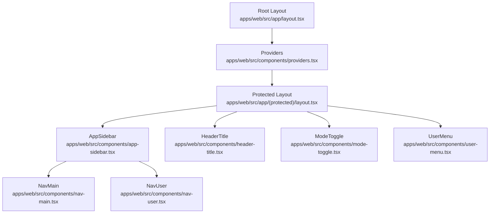
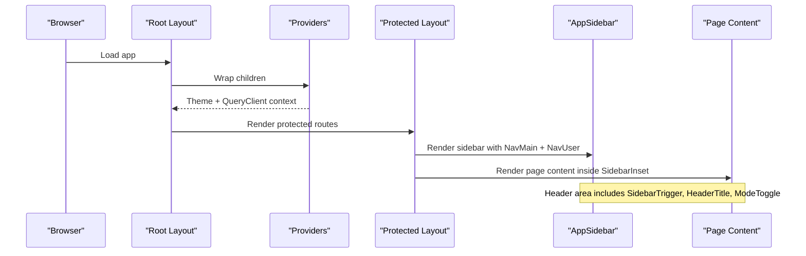
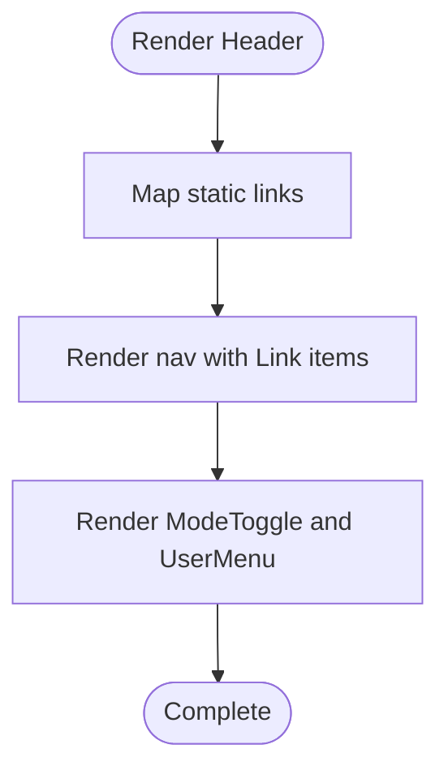
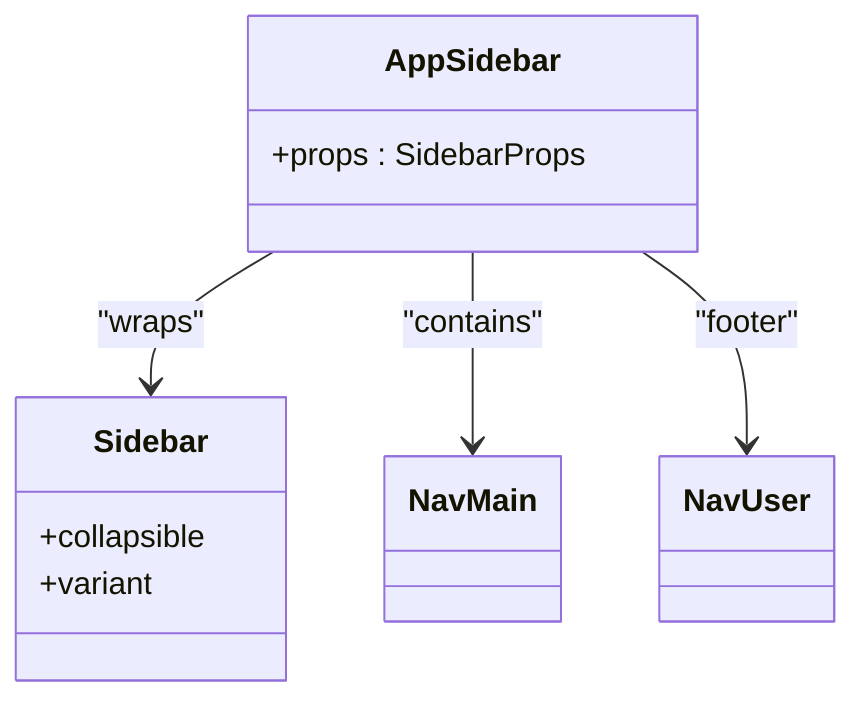
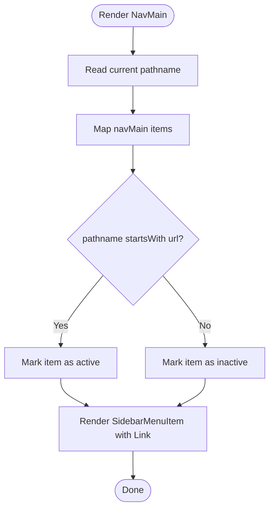
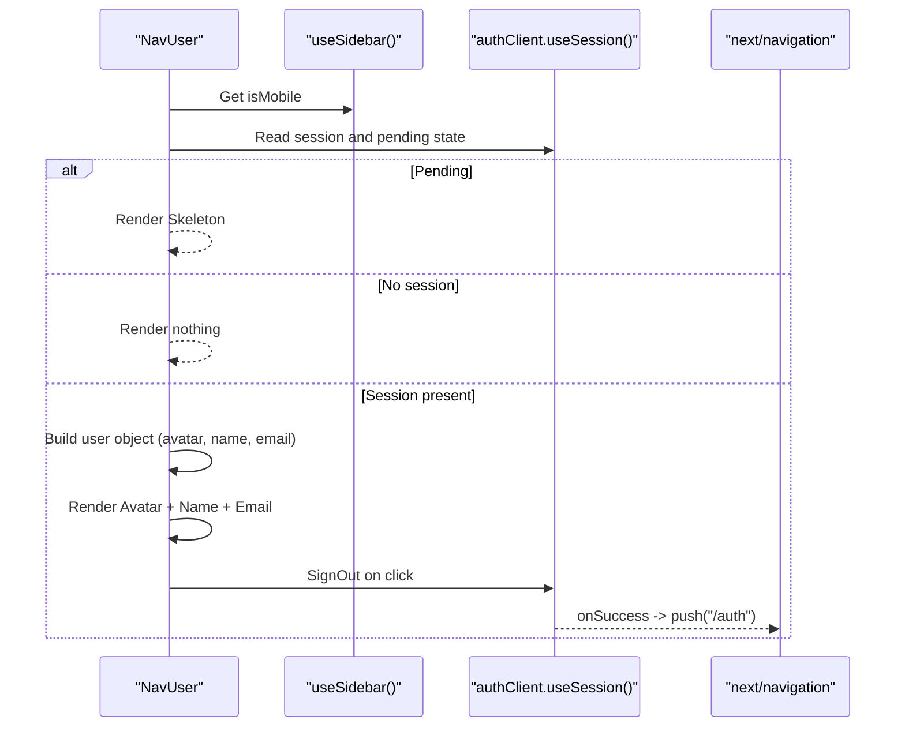
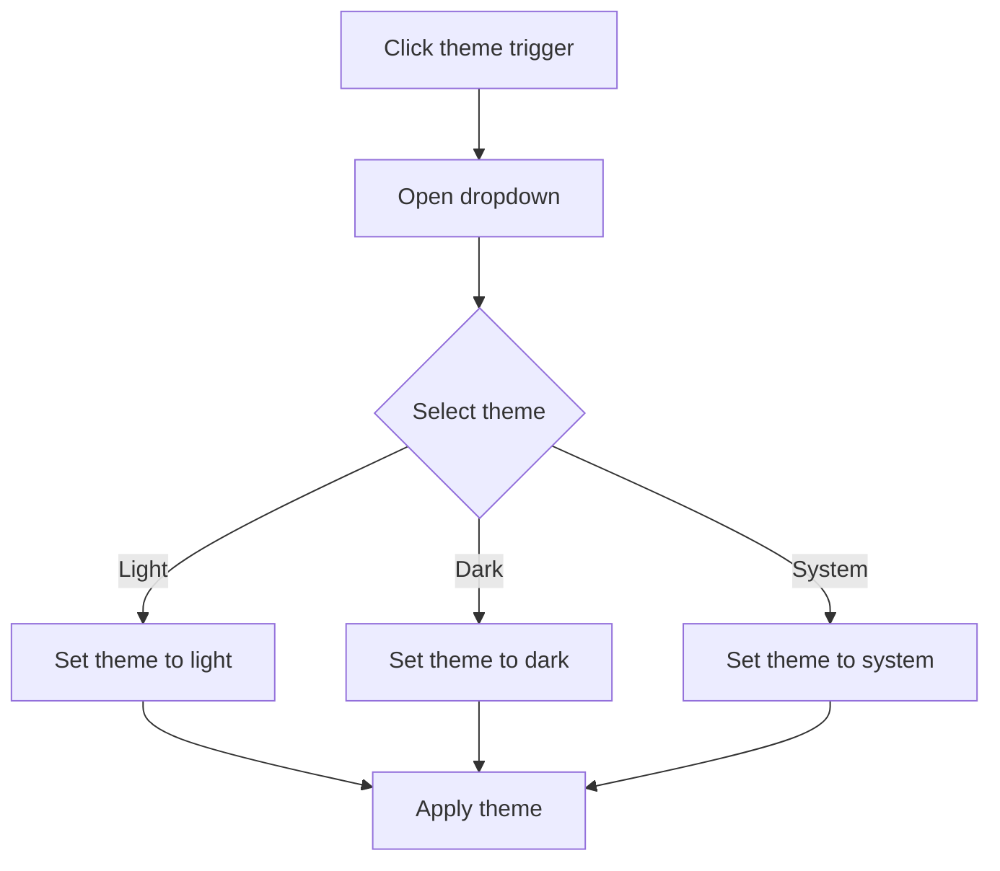
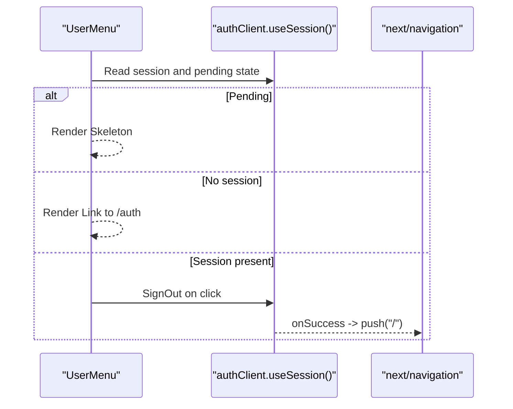
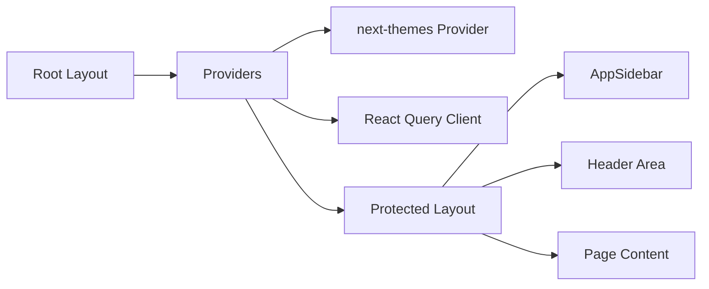
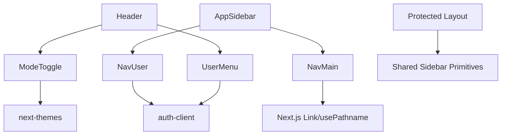

# UI Components

<cite>
**Referenced Files in This Document**
- [header.tsx](file://apps/web/src/components/header.tsx)
- [app-sidebar.tsx](file://apps/web/src/components/app-sidebar.tsx)
- [mode-toggle.tsx](file://apps/web/src/components/mode-toggle.tsx)
- [user-menu.tsx](file://apps/web/src/components/user-menu.tsx)
- [nav-main.tsx](file://apps/web/src/components/nav-main.tsx)
- [nav-user.tsx](file://apps/web/src/components/nav-user.tsx)
- [theme-provider.tsx](file://apps/web/src/components/theme-provider.tsx)
- [providers.tsx](file://apps/web/src/components/providers.tsx)
- [protected-layout.tsx](file://apps/web/src/app/(protected)/layout.tsx)
- [root-layout.tsx](file://apps/web/src/app/layout.tsx)
- [auth-client.ts](file://apps/web/src/lib/auth-client.ts)
</cite>

## Table of Contents

1. [Introduction](#introduction)
2. [Project Structure](#project-structure)
3. [Core Components](#core-components)
4. [Architecture Overview](#architecture-overview)
5. [Detailed Component Analysis](#detailed-component-analysis)
6. [Dependency Analysis](#dependency-analysis)
7. [Performance Considerations](#performance-considerations)
8. [Troubleshooting Guide](#troubleshooting-guide)
9. [Conclusion](#conclusion)

## Introduction

This document explains the reusable layout and navigation UI components used across the application. It focuses on:

- Header structure and top-level navigation
- Sidebar implementation with navigation items
- Theme mode toggle for light/dark/system themes
- User menu functionality including sign-in, sign-out, and session handling
- Component composition patterns, prop interfaces, and styling with Tailwind CSS
- Responsive design considerations, accessibility practices, and integration with Next.js routing

## Project Structure

The layout and navigation are composed from small, focused components that integrate with a shared UI library and Next.js routing. The protected layout wires together the sidebar, header area, and content region, while providers set up theming and data fetching context.

**Diagram sources**

- [root-layout.tsx:26-46](file://apps/web/src/app/layout.tsx#L26-L46)
- [providers.tsx:11-26](file://apps/web/src/components/providers.tsx#L11-L26)
- [protected-layout.tsx:22-65](<file://apps/web/src/app/(protected)/layout.tsx#L22-L65>)
- [app-sidebar.tsx:13-24](file://apps/web/src/components/app-sidebar.tsx#L13-L24)
- [nav-main.tsx:39-63](file://apps/web/src/components/nav-main.tsx#L39-L63)
- [nav-user.tsx:26-110](file://apps/web/src/components/nav-user.tsx#L26-L110)
- [header-title.tsx:5-12](file://apps/web/src/components/header-title.tsx#L5-L12)
- [mode-toggle.tsx:13-36](file://apps/web/src/components/mode-toggle.tsx#L13-L36)
- [user-menu.tsx:17-61](file://apps/web/src/components/user-menu.tsx#L17-L61)

**Section sources**

- [root-layout.tsx:26-46](file://apps/web/src/app/layout.tsx#L26-L46)
- [providers.tsx:11-26](file://apps/web/src/components/providers.tsx#L11-L26)
- [protected-layout.tsx:22-65](<file://apps/web/src/app/(protected)/layout.tsx#L22-L65>)

## Core Components

- Header: A simple client component that renders top-level links and integrates theme toggle and user menu.
- AppSidebar: Wraps the shared sidebar primitives to display main navigation and user controls at the footer.
- NavMain: Renders the primary navigation list with icons and active state based on current route.
- NavUser: Displays user avatar, name, email, and a dropdown to log out; includes loading skeletons and mobile-aware positioning.
- ModeToggle: Dropdown to switch between light, dark, and system themes using next-themes.
- UserMenu: Top-right user menu showing sign-in when unauthenticated or account actions when authenticated.

Key styling approach:

- Tailwind utility classes for layout, spacing, typography, and responsive behavior
- Shared UI primitives (buttons, dropdowns, sidebar, avatar, skeleton) from the internal UI library
- Semantic HTML elements (nav, h1, hr) for accessibility

Routing integration:

- Next.js Link for declarative navigation
- usePathname for active state in sidebar
- useRouter for programmatic navigation after sign-out

Accessibility highlights:

- Screen-reader-only text for icon buttons
- Proper semantic roles via shared primitives
- Keyboard-friendly dropdown menus

**Section sources**

- [header.tsx:7-31](file://apps/web/src/components/header.tsx#L7-L31)
- [app-sidebar.tsx:13-24](file://apps/web/src/components/app-sidebar.tsx#L13-L24)
- [nav-main.tsx:14-63](file://apps/web/src/components/nav-main.tsx#L14-L63)
- [nav-user.tsx:26-110](file://apps/web/src/components/nav-user.tsx#L26-L110)
- [mode-toggle.tsx:13-36](file://apps/web/src/components/mode-toggle.tsx#L13-L36)
- [user-menu.tsx:17-61](file://apps/web/src/components/user-menu.tsx#L17-L61)

## Architecture Overview

The protected layout composes the sidebar and header area. The sidebar contains the main navigation and user section. The header area shows a trigger to collapse/expand the sidebar, a dynamic page title, theme toggle, and optional assistant button. The root layout wraps everything in providers for theming and data fetching.

**Diagram sources**

- [root-layout.tsx:26-46](file://apps/web/src/app/layout.tsx#L26-L46)
- [providers.tsx:11-26](file://apps/web/src/components/providers.tsx#L11-L26)
- [protected-layout.tsx:22-65](<file://apps/web/src/app/(protected)/layout.tsx#L22-L65>)
- [app-sidebar.tsx:13-24](file://apps/web/src/components/app-sidebar.tsx#L13-L24)

## Detailed Component Analysis

### Header

- Purpose: Provides quick top-level navigation and integrates theme toggle and user menu.
- Composition: Uses Next.js Link for navigation; embeds ModeToggle and UserMenu.
- Styling: Flexbox row with centered items and spacing utilities.
- Routing: Declarative links to Home and Dashboard.

**Diagram sources**

- [header.tsx:7-31](file://apps/web/src/components/header.tsx#L7-L31)

**Section sources**

- [header.tsx:7-31](file://apps/web/src/components/header.tsx#L7-L31)

### AppSidebar

- Purpose: Container for the collapsible sidebar with main navigation and user controls.
- Composition: Wraps shared Sidebar primitives and composes NavMain and NavUser.
- Props: Inherits props from the shared Sidebar primitive; sets collapsible mode to icon.
- Styling: Uses variant inset for modern look; relies on shared primitives for consistent sizing and states.

**Diagram sources**

- [app-sidebar.tsx:13-24](file://apps/web/src/components/app-sidebar.tsx#L13-L24)

**Section sources**

- [app-sidebar.tsx:13-24](file://apps/web/src/components/app-sidebar.tsx#L13-L24)

### NavMain

- Purpose: Renders the primary navigation list with icons and titles.
- Active state: Highlights the current item by comparing pathname prefix with each URL.
- Data: Centralized array of navigation entries with icon, title, and URL.
- Routing: Each item is a Link to its respective route.

**Diagram sources**

- [nav-main.tsx:14-63](file://apps/web/src/components/nav-main.tsx#L14-L63)

**Section sources**

- [nav-main.tsx:14-63](file://apps/web/src/components/nav-main.tsx#L14-L63)

### NavUser

- Purpose: Displays user profile in the sidebar footer with a dropdown to log out.
- Loading state: Shows skeleton placeholders while session loads.
- Auth flow: Uses auth client hook to read session; signs out and redirects on action.
- Responsiveness: Adjusts dropdown position based on mobile detection from sidebar context.

**Diagram sources**

- [nav-user.tsx:26-110](file://apps/web/src/components/nav-user.tsx#L26-L110)
- [auth-client.ts:5-7](file://apps/web/src/lib/auth-client.ts#L5-L7)

**Section sources**

- [nav-user.tsx:26-110](file://apps/web/src/components/nav-user.tsx#L26-L110)
- [auth-client.ts:5-7](file://apps/web/src/lib/auth-client.ts#L5-L7)

### ModeToggle

- Purpose: Allows users to switch between light, dark, and system themes.
- Integration: Uses next-themes provider via useTheme hook; updates theme on selection.
- Accessibility: Includes screen-reader-only label for the trigger.
- Styling: Animated sun/moon icons with Tailwind transitions and dark variants.

**Diagram sources**

- [mode-toggle.tsx:13-36](file://apps/web/src/components/mode-toggle.tsx#L13-L36)

**Section sources**

- [mode-toggle.tsx:13-36](file://apps/web/src/components/mode-toggle.tsx#L13-L36)

### UserMenu

- Purpose: Top-right user menu for authentication actions.
- States:
  - Pending: Shows a skeleton placeholder.
  - Unauthenticated: Shows a Sign In link.
  - Authenticated: Shows user name and dropdown with account info and sign out.
- Routing: Redirects to home after sign out.

**Diagram sources**

- [user-menu.tsx:17-61](file://apps/web/src/components/user-menu.tsx#L17-L61)
- [auth-client.ts:5-7](file://apps/web/src/lib/auth-client.ts#L5-L7)

**Section sources**

- [user-menu.tsx:17-61](file://apps/web/src/components/user-menu.tsx#L17-L61)
- [auth-client.ts:5-7](file://apps/web/src/lib/auth-client.ts#L5-L7)

### Theme Provider and Application Context

- Providers wrap the app with next-themes and React Query, enabling global theme state and data caching.
- Root layout applies fonts and ensures proper HTML attributes for hydration.
- Protected layout enforces authentication before rendering dashboard content.

**Diagram sources**

- [root-layout.tsx:26-46](file://apps/web/src/app/layout.tsx#L26-L46)
- [providers.tsx:11-26](file://apps/web/src/components/providers.tsx#L11-L26)
- [protected-layout.tsx:22-65](<file://apps/web/src/app/(protected)/layout.tsx#L22-L65>)

**Section sources**

- [providers.tsx:11-26](file://apps/web/src/components/providers.tsx#L11-L26)
- [root-layout.tsx:26-46](file://apps/web/src/app/layout.tsx#L26-L46)
- [protected-layout.tsx:22-65](<file://apps/web/src/app/(protected)/layout.tsx#L22-L65>)

## Dependency Analysis

- Components depend on shared UI primitives for consistent styling and behavior.
- Navigation uses Next.js routing primitives for both declarative and programmatic navigation.
- Authentication state is consumed via a centralized auth client.
- Theming is provided globally through next-themes.

**Diagram sources**

- [header.tsx:7-31](file://apps/web/src/components/header.tsx#L7-L31)
- [app-sidebar.tsx:13-24](file://apps/web/src/components/app-sidebar.tsx#L13-L24)
- [nav-main.tsx:14-63](file://apps/web/src/components/nav-main.tsx#L14-L63)
- [nav-user.tsx:26-110](file://apps/web/src/components/nav-user.tsx#L26-L110)
- [mode-toggle.tsx:13-36](file://apps/web/src/components/mode-toggle.tsx#L13-L36)
- [user-menu.tsx:17-61](file://apps/web/src/components/user-menu.tsx#L17-L61)
- [protected-layout.tsx:22-65](<file://apps/web/src/app/(protected)/layout.tsx#L22-L65>)

**Section sources**

- [header.tsx:7-31](file://apps/web/src/components/header.tsx#L7-L31)
- [app-sidebar.tsx:13-24](file://apps/web/src/components/app-sidebar.tsx#L13-L24)
- [nav-main.tsx:14-63](file://apps/web/src/components/nav-main.tsx#L14-L63)
- [nav-user.tsx:26-110](file://apps/web/src/components/nav-user.tsx#L26-L110)
- [mode-toggle.tsx:13-36](file://apps/web/src/components/mode-toggle.tsx#L13-L36)
- [user-menu.tsx:17-61](file://apps/web/src/components/user-menu.tsx#L17-L61)
- [protected-layout.tsx:22-65](<file://apps/web/src/app/(protected)/layout.tsx#L22-L65>)

## Performance Considerations

- Prefer client components only where interactivity is required (e.g., theme toggle, user menu).
- Use skeletons during async session loading to avoid layout shifts.
- Keep navigation data local to NavMain to minimize re-renders.
- Leverage shared primitives for optimized rendering and consistent behavior.

[No sources needed since this section provides general guidance]

## Troubleshooting Guide

- Theme not applying: Ensure the root layout wraps content with the theme provider and that attribute is set correctly.
- Sidebar not collapsing: Verify the protected layout uses the sidebar provider and trigger components.
- Active state incorrect: Confirm pathname matching logic in NavMain aligns with route structure.
- Sign out not redirecting: Check that sign-out callbacks invoke router navigation and that auth client is properly configured.

**Section sources**

- [root-layout.tsx:26-46](file://apps/web/src/app/layout.tsx#L26-L46)
- [providers.tsx:11-26](file://apps/web/src/components/providers.tsx#L11-L26)
- [protected-layout.tsx:22-65](<file://apps/web/src/app/(protected)/layout.tsx#L22-L65>)
- [nav-main.tsx:14-63](file://apps/web/src/components/nav-main.tsx#L14-L63)
- [user-menu.tsx:17-61](file://apps/web/src/components/user-menu.tsx#L17-L61)
- [nav-user.tsx:26-110](file://apps/web/src/components/nav-user.tsx#L26-L110)

## Conclusion

The layout and navigation components are built from small, composable pieces that integrate seamlessly with Next.js routing, a shared UI library, and global theming. They provide a responsive, accessible, and maintainable foundation for the application’s interface. By following the composition patterns and styling approaches outlined here, you can extend or customize these components confidently while preserving consistency and performance.

[No sources needed since this section summarizes without analyzing specific files]
