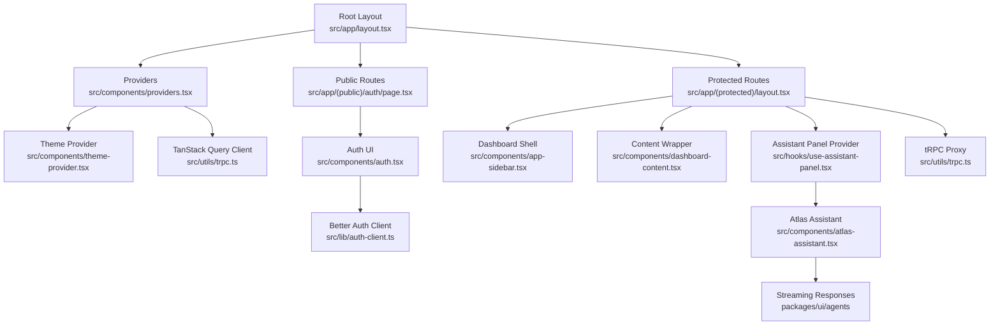
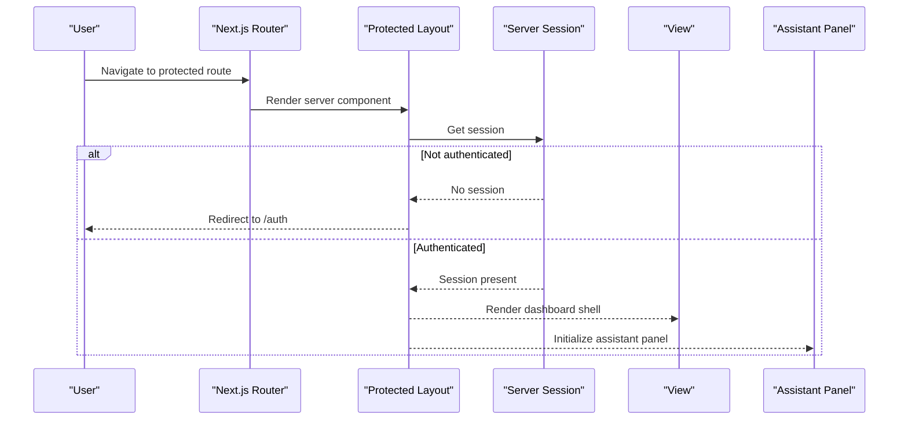
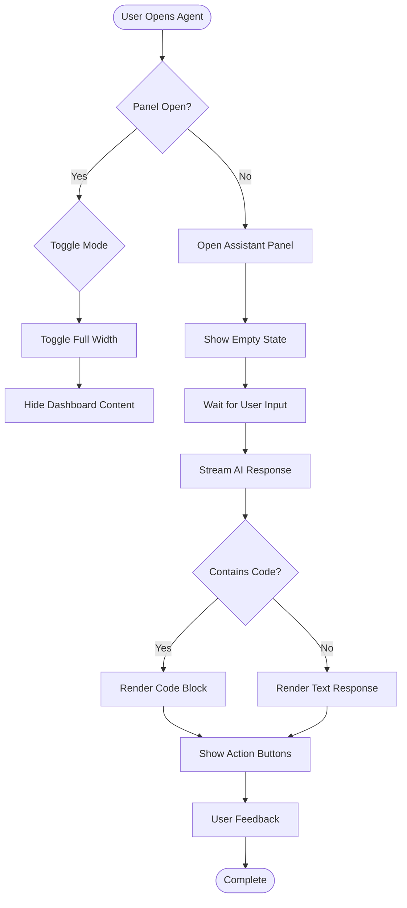
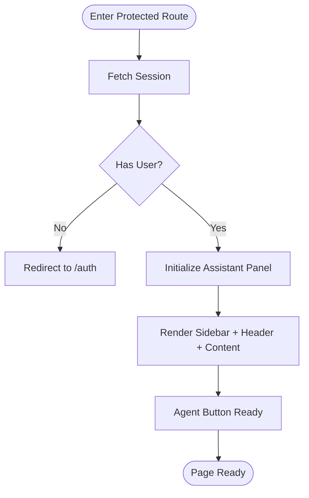
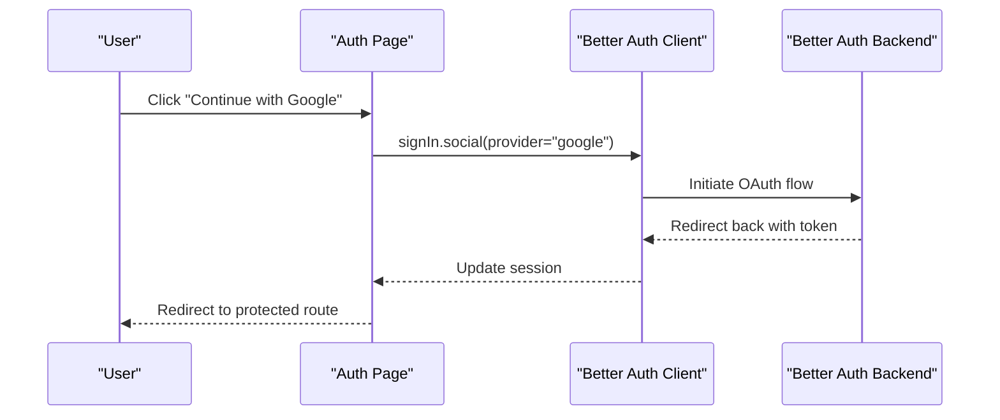
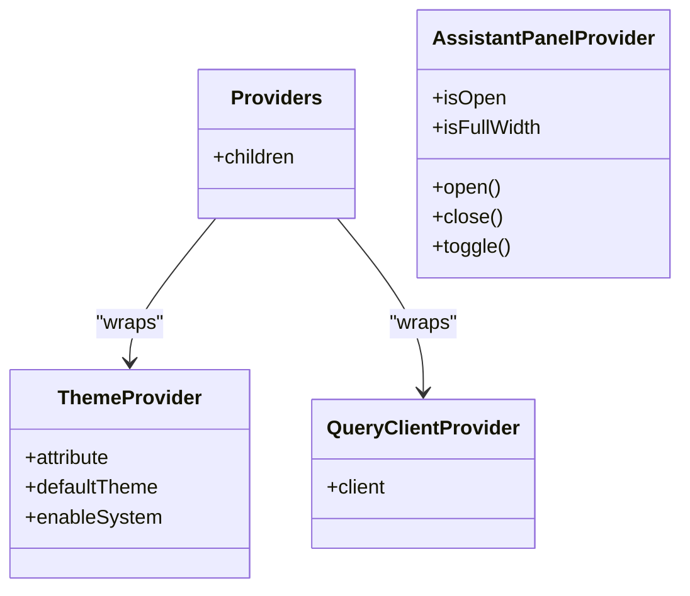
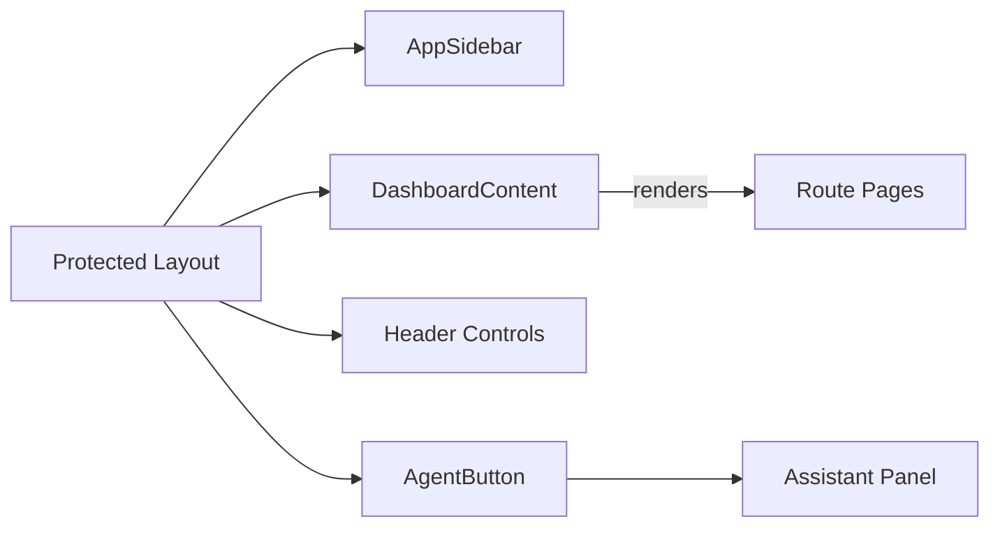
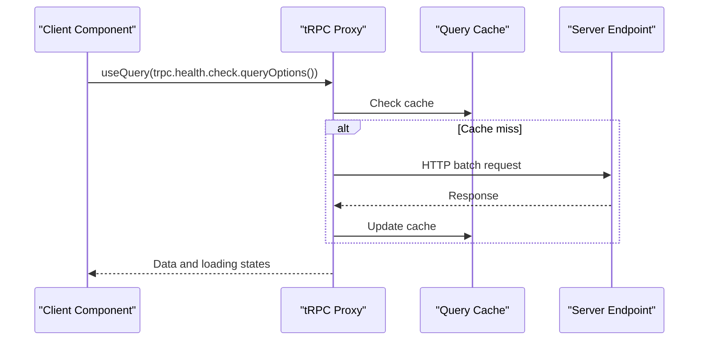
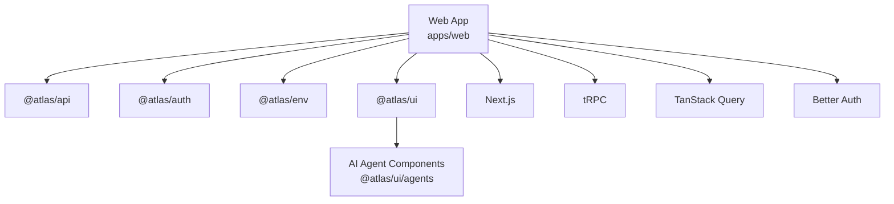

# Frontend Application

<cite>
**Referenced Files in This Document**
- [package.json](file://apps/web/package.json)
- [next.config.ts](file://apps/web/next.config.ts)
- [layout.tsx](file://apps/web/src/app/layout.tsx)
- [page.tsx](file://apps/web/src/app/page.tsx)
- [(protected)/layout.tsx](file://apps/web/src/app/(protected)/layout.tsx)
- [(public)/auth/page.tsx](file://apps/web/src/app/(public)/auth/page.tsx)
- [auth.tsx](file://apps/web/src/components/auth.tsx)
- [providers.tsx](file://apps/web/src/components/providers.tsx)
- [theme-provider.tsx](file://apps/web/src/components/theme-provider.tsx)
- [dashboard-content.tsx](file://apps/web/src/components/dashboard-content.tsx)
- [app-sidebar.tsx](file://apps/web/src/components/app-sidebar.tsx)
- [atlas-assistant.tsx](file://apps/web/src/components/atlas-assistant.tsx)
- [agent-button.tsx](file://apps/web/src/components/agent-button.tsx)
- [use-assistant-panel.tsx](file://apps/web/src/hooks/use-assistant-panel.tsx)
- [trpc.ts](file://apps/web/src/utils/trpc.ts)
- [auth-client.ts](file://apps/web/src/lib/auth-client.ts)
- [index.css](file://apps/web/src/index.css)
- [components.json](file://apps/web/components.json)
- [streaming-response.tsx](file://packages/ui/src/components/agents/streaming-response.tsx)
- [code-block.tsx](file://packages/ui/src/components/agents/code-block.tsx)
- [message.tsx](file://packages/ui/src/components/agents/message.tsx)
</cite>

## Update Summary

**Changes Made**

- Added comprehensive documentation for AI agent UI components integration
- Updated protected layout to include AssistantPanelProvider and AtlasAssistant component
- Documented new streaming response, code rendering, and interactive AI workflow capabilities
- Enhanced architecture overview to reflect AI agent panel integration
- Added new sections covering AI agent components and their usage patterns

## Table of Contents

1. [Introduction](#introduction)
2. [Project Structure](#project-structure)
3. [Core Components](#core-components)
4. [Architecture Overview](#architecture-overview)
5. [AI Agent Integration](#ai-agent-integration)
6. [Detailed Component Analysis](#detailed-component-analysis)
7. [Dependency Analysis](#dependency-analysis)
8. [Performance Considerations](#performance-considerations)
9. [Troubleshooting Guide](#troubleshooting-guide)
10. [Conclusion](#conclusion)
11. [Appendices](#appendices)

## Introduction

This document describes the Next.js frontend application that powers a modern React-based user interface with integrated AI agent capabilities. It explains how the App Router organizes protected and public routes, how shared UI components are consumed from the packages/ui library, and how providers manage theme and data state. The application now features sophisticated AI agent interactions through streaming responses, code rendering, and interactive workflows. It covers authentication with Better Auth, API communication via tRPC, styling with Tailwind CSS v4, accessibility considerations, development workflow, build optimizations for Next.js 16, and deployment configuration patterns. Practical examples include form handling, server-side data fetching, client-side interactivity, and AI agent conversations.

## Project Structure

The application is organized under apps/web using the Next.js App Router:

- Root layout sets up global fonts, CSS imports, and provider composition.
- Route groups separate public and protected areas:
  - (public)/auth handles sign-in flows.
  - (protected) wraps authenticated pages with a dashboard shell and enforces session checks on the server.
- Shared UI comes from @atlas/ui, configured via shadcn conventions and aliases.
- Data layer uses tRPC with TanStack Query for caching and error handling.
- Authentication integrates Better Auth with social providers and Telegram OIDC.
- AI agent panel provides real-time streaming responses and interactive workflows.



**Diagram sources**

- [layout.tsx:1-47](file://apps/web/src/app/layout.tsx#L1-L47)
- [providers.tsx:1-27](file://apps/web/src/components/providers.tsx#L1-L27)
- [theme-provider.tsx:1-12](file://apps/web/src/components/theme-provider.tsx#L1-L12)
- [trpc.ts:1-40](file://apps/web/src/utils/trpc.ts#L1-L40)
- [(protected)/layout.tsx:1-66](<file://apps/web/src/app/(protected)/layout.tsx#L1-L66>)
- [atlas-assistant.tsx:1-175](file://apps/web/src/components/atlas-assistant.tsx#L1-L175)
- [use-assistant-panel.tsx:1-235](file://apps/web/src/hooks/use-assistant-panel.tsx#L1-L235)

**Section sources**

- [layout.tsx:1-47](file://apps/web/src/app/layout.tsx#L1-L47)
- [components.json:1-26](file://apps/web/components.json#L1-L26)
- [index.css:1-2](file://apps/web/src/index.css#L1-L2)

## Core Components

- Providers compose ThemeProvider and TanStack Query's QueryClientProvider to supply theme context and global data caching.
- The root layout injects global CSS and font variables, then renders children inside Providers.
- Protected layout performs server-side session validation and renders a sidebar-based dashboard shell with header controls and assistant panel integration.
- Public auth page renders an authentication component that triggers social sign-in flows.
- Dashboard content wrapper coordinates visibility with the assistant panel.
- AI agent panel provides real-time streaming responses and interactive workflows through the @atlas/ui package.

Key responsibilities:

- Global setup: fonts, CSS, providers.
- Route protection: server-side session check and redirect.
- UI composition: sidebar, header, content area, assistant panel.
- Data layer: tRPC client and query cache with toast notifications.
- AI integration: streaming responses, code rendering, and conversation management.

**Section sources**

- [providers.tsx:1-27](file://apps/web/src/components/providers.tsx#L1-L27)
- [layout.tsx:1-47](file://apps/web/src/app/layout.tsx#L1-L47)
- [(protected)/layout.tsx:1-66](<file://apps/web/src/app/(protected)/layout.tsx#L1-L66>)
- [(public)/auth/page.tsx:1-8](<file://apps/web/src/app/(public)/auth/page.tsx#L1-L8>)
- [dashboard-content.tsx:1-18](file://apps/web/src/components/dashboard-content.tsx#L1-L18)
- [trpc.ts:1-40](file://apps/web/src/utils/trpc.ts#L1-L40)

## Architecture Overview

The application follows a layered architecture:

- Presentation: React components built with Tailwind CSS and shadcn-style primitives from @atlas/ui.
- Routing: Next.js App Router with route groups for public and protected areas.
- State and Data: TanStack Query for caching and background updates; tRPC for type-safe API calls.
- Authentication: Better Auth with social providers and Telegram OIDC; session enforcement on the server.
- Styling: Tailwind CSS v4 with CSS variables and global styles imported from the shared UI package.
- AI Agent Layer: Real-time streaming responses, code rendering, and interactive conversation workflows.



**Diagram sources**

- [(protected)/layout.tsx:1-66](<file://apps/web/src/app/(protected)/layout.tsx#L1-L66>)

## AI Agent Integration

The application now includes a sophisticated AI agent system powered by the @atlas/ui package components. The agent panel provides real-time streaming responses, code rendering capabilities, and interactive conversation workflows.

### Assistant Panel Architecture

- **AssistantPanelProvider**: Manages panel state, persistence, and sidebar synchronization
- **AtlasAssistant**: Main UI component with header, empty state, and composer
- **AgentButton**: Trigger button with keyboard shortcuts (⌘I/Ctrl+I)
- **StreamingResponse**: Handles real-time content streaming with feedback mechanisms
- **CodeBlock**: Syntax-highlighted code display with copy functionality
- **Message Components**: Complete conversation UI with typing indicators and animations

### Key Features

- **Real-time Streaming**: Live content updates with proper loading states
- **Code Rendering**: Syntax highlighting with language detection
- **Interactive Workflows**: User feedback, retry mechanisms, and source citations
- **Responsive Design**: Adapts between mobile overlay and desktop sidebar modes
- **Accessibility**: Full keyboard navigation and screen reader support
- **State Persistence**: Local storage for panel preferences and sidebar state



**Diagram sources**

- [atlas-assistant.tsx:1-175](file://apps/web/src/components/atlas-assistant.tsx#L1-L175)
- [use-assistant-panel.tsx:1-235](file://apps/web/src/hooks/use-assistant-panel.tsx#L1-L235)
- [streaming-response.tsx:1-265](file://packages/ui/src/components/agents/streaming-response.tsx#L1-L265)

**Section sources**

- [atlas-assistant.tsx:1-175](file://apps/web/src/components/atlas-assistant.tsx#L1-L175)
- [agent-button.tsx:1-28](file://apps/web/src/components/agent-button.tsx#L1-L28)
- [use-assistant-panel.tsx:1-235](file://apps/web/src/hooks/use-assistant-panel.tsx#L1-L235)
- [streaming-response.tsx:1-265](file://packages/ui/src/components/agents/streaming-response.tsx#L1-L265)
- [code-block.tsx:1-203](file://packages/ui/src/components/agents/code-block.tsx#L1-L203)
- [message.tsx:1-276](file://packages/ui/src/components/agents/message.tsx#L1-L276)

## Detailed Component Analysis

### Protected Route Group with AI Integration

- Server-side session retrieval ensures only authenticated users access protected pages.
- On missing session, redirects to the public auth page.
- Renders a responsive dashboard layout with collapsible sidebar, header controls (mode toggle, agent button), and assistant panel integration.
- Integrates AssistantPanelProvider for managing AI agent state and persistence.



**Diagram sources**

- [(protected)/layout.tsx:1-66](<file://apps/web/src/app/(protected)/layout.tsx#L1-L66>)

**Section sources**

- [(protected)/layout.tsx:1-66](<file://apps/web/src/app/(protected)/layout.tsx#L1-L66>)

### AI Agent Panel Components

- **AtlasAssistant**: Main panel component with header, empty state suggestions, and message composer
- **AgentButton**: Trigger button with visual feedback and keyboard shortcut hints
- **useAssistantSidebarSync**: Hook that manages panel state, sidebar coordination, and persistence
- **AssistantPanelProvider**: Context provider for sharing panel state across components

Key capabilities:

- Keyboard shortcuts (⌘I/Ctrl+I) for quick access
- Responsive design with mobile overlay support
- Local storage persistence for panel preferences
- Sidebar state synchronization to prevent conflicts
- Full-width mode for focused conversations

**Section sources**

- [atlas-assistant.tsx:1-175](file://apps/web/src/components/atlas-assistant.tsx#L1-L175)
- [agent-button.tsx:1-28](file://apps/web/src/components/agent-button.tsx#L1-L28)
- [use-assistant-panel.tsx:1-235](file://apps/web/src/hooks/use-assistant-panel.tsx#L1-L235)

### Streaming Response System

- **StreamingResponse**: Handles real-time content streaming with status management
- **CodeBlock**: Syntax-highlighted code display with streaming support
- **Message Components**: Complete conversation UI with typing indicators
- **Action System**: Copy, retry, feedback, and citation management

Features:

- Real-time content updates with proper loading states
- Syntax highlighting for multiple programming languages
- Copy-to-clipboard functionality with visual feedback
- User feedback system (helpful/not helpful)
- Source citation management with expandable lists
- Accessibility support with ARIA attributes and keyboard navigation

**Section sources**

- [streaming-response.tsx:1-265](file://packages/ui/src/components/agents/streaming-response.tsx#L1-L265)
- [code-block.tsx:1-203](file://packages/ui/src/components/agents/code-block.tsx#L1-L203)
- [message.tsx:1-276](file://packages/ui/src/components/agents/message.tsx#L1-L276)

### Public Auth Page and Authentication Flow

- The public auth page renders a simple UI to initiate sign-in with Google or Telegram.
- The Better Auth client is configured with plugins for Telegram and last login method tracking.
- After successful sign-in, users are redirected to a protected route.



**Diagram sources**

- [auth.tsx:1-69](file://apps/web/src/components/auth.tsx#L1-L69)
- [auth-client.ts:1-8](file://apps/web/src/lib/auth-client.ts#L1-L8)

**Section sources**

- [(public)/auth/page.tsx:1-8](<file://apps/web/src/app/(public)/auth/page.tsx#L1-L8>)
- [auth.tsx:1-69](file://apps/web/src/components/auth.tsx#L1-L69)
- [auth-client.ts:1-8](file://apps/web/src/lib/auth-client.ts#L1-L8)

### Providers and State Management

- Providers wrap the app with ThemeProvider (for system-aware themes) and QueryClientProvider (for global data caching).
- Toast notifications are provided by Sonner for consistent UX.
- The theme provider enables class-based theming and respects system preferences.
- AssistantPanelProvider manages AI agent panel state and persistence.



**Diagram sources**

- [providers.tsx:1-27](file://apps/web/src/components/providers.tsx#L1-L27)
- [theme-provider.tsx:1-12](file://apps/web/src/components/theme-provider.tsx#L1-L12)
- [use-assistant-panel.tsx:67-151](file://apps/web/src/hooks/use-assistant-panel.tsx#L67-L151)

**Section sources**

- [providers.tsx:1-27](file://apps/web/src/components/providers.tsx#L1-L27)
- [theme-provider.tsx:1-12](file://apps/web/src/components/theme-provider.tsx#L1-L12)
- [use-assistant-panel.tsx:1-235](file://apps/web/src/hooks/use-assistant-panel.tsx#L1-L235)

### Dashboard Shell and Content

- AppSidebar composes navigation and user menu sections within a collapsible sidebar.
- DashboardContent conditionally hides content when the assistant panel is open and full-width.
- The protected layout wires these together with header controls and assistant panel provider.
- AgentButton provides easy access to the AI agent panel with visual feedback.



**Diagram sources**

- [(protected)/layout.tsx:1-66](<file://apps/web/src/app/(protected)/layout.tsx#L1-L66>)
- [app-sidebar.tsx:1-25](file://apps/web/src/components/app-sidebar.tsx#L1-L25)
- [dashboard-content.tsx:1-18](file://apps/web/src/components/dashboard-content.tsx#L1-L18)
- [agent-button.tsx:1-28](file://apps/web/src/components/agent-button.tsx#L1-L28)

**Section sources**

- [app-sidebar.tsx:1-25](file://apps/web/src/components/app-sidebar.tsx#L1-L25)
- [dashboard-content.tsx:1-18](file://apps/web/src/components/dashboard-content.tsx#L1-L18)
- [(protected)/layout.tsx:1-66](<file://apps/web/src/app/(protected)/layout.tsx#L1-L66>)

### tRPC and Data Fetching Patterns

- The tRPC client is configured with httpBatchLink and credentials included for cookies-based auth.
- TanStack Query manages caching, retries, and error handling with toast notifications.
- Example usage demonstrates querying a health endpoint and rendering status indicators.



**Diagram sources**

- [trpc.ts:1-40](file://apps/web/src/utils/trpc.ts#L1-L40)
- [page.tsx:1-39](file://apps/web/src/app/page.tsx#L1-L39)

**Section sources**

- [trpc.ts:1-40](file://apps/web/src/utils/trpc.ts#L1-L40)
- [page.tsx:1-39](file://apps/web/src/app/page.tsx#L1-L39)

### Styling and Accessibility

- Styling uses Tailwind CSS v4 with CSS variables and global styles imported from the shared UI package.
- shadcn configuration defines aliases for components, utils, and libraries to streamline imports.
- Fonts are loaded via next/font and applied through CSS variables for consistent typography.
- Accessibility considerations include semantic HTML structure, keyboard-friendly controls, and theme switching that respects system preferences.
- AI agent components provide comprehensive accessibility support including ARIA attributes, keyboard navigation, and screen reader compatibility.

**Section sources**

- [index.css:1-2](file://apps/web/src/index.css#L1-L2)
- [components.json:1-26](file://apps/web/components.json#L1-L26)
- [layout.tsx:1-47](file://apps/web/src/app/layout.tsx#L1-L47)

## Dependency Analysis

The web app depends on workspace packages for API, auth, env, and UI, along with runtime dependencies for React, Next.js, tRPC, TanStack Query, and Better Auth. The AI agent functionality extends the UI package with specialized components for streaming responses and code rendering.



**Diagram sources**

- [package.json:1-47](file://apps/web/package.json#L1-L47)

**Section sources**

- [package.json:1-47](file://apps/web/package.json#L1-L47)

## Performance Considerations

- Build optimizations:
  - Component caching enabled for faster rebuilds.
  - Experimental package import optimization for icon libraries reduces bundle size.
  - Turbopack Rust React Compiler enabled for improved compilation performance.
  - Partial prefetching improves perceived performance.
  - React Compiler enabled for automatic optimizations.
- Runtime optimizations:
  - tRPC batching reduces network overhead.
  - TanStack Query caches responses and deduplicates requests.
  - Image remote patterns allow optimized delivery from trusted hosts.
  - AI agent streaming minimizes initial load by deferring heavy components.
  - Local storage persistence reduces re-renders and maintains state efficiently.

## Troubleshooting Guide

Common issues and resolutions:

- Authentication redirects loop:
  - Ensure server-side session retrieval succeeds and credentials are included in tRPC requests.
  - Verify environment variables for runtime URL rewrites and auth endpoints.
- tRPC errors not surfaced:
  - Confirm onError handler in QueryCache shows toast and offers retry actions.
  - Check that fetch includes credentials for cookie-based sessions.
- Theme flicker on load:
  - Use suppressHydrationWarning and ensure theme provider initializes consistently across server and client.
- Styles not applying:
  - Verify global CSS import chain and shadcn aliases point to correct paths.
- AI agent panel not opening:
  - Ensure AssistantPanelProvider is wrapping the protected layout.
  - Check that useAssistantSidebarSync hook is used within the provider context.
  - Verify localStorage is available for state persistence.
- Streaming responses not updating:
  - Confirm proper status management (streaming vs complete).
  - Check that streaming content is properly wrapped in StreamingResponse component.
  - Verify that code blocks have appropriate language specifications for syntax highlighting.

**Section sources**

- [trpc.ts:1-40](file://apps/web/src/utils/trpc.ts#L1-L40)
- [next.config.ts:1-31](file://apps/web/next.config.ts#L1-L31)
- [layout.tsx:1-47](file://apps/web/src/app/layout.tsx#L1-L47)
- [use-assistant-panel.tsx:1-235](file://apps/web/src/hooks/use-assistant-panel.tsx#L1-L235)

## Conclusion

The application leverages Next.js App Router to cleanly separate public and protected routes, integrates Better Auth for secure authentication, and uses tRPC with TanStack Query for robust data management. The enhanced AI agent integration provides sophisticated real-time interactions through streaming responses, code rendering, and interactive workflows. Shared UI components from @atlas/ui and Tailwind CSS v4 provide a consistent, accessible design system. Build-time and runtime optimizations ensure a performant experience, while clear provider patterns simplify state and theme management. The AI agent panel seamlessly integrates with the existing dashboard architecture, offering users powerful conversational capabilities alongside traditional navigation.

## Appendices

### Development Workflow

- Scripts:
  - dev: Starts the Next.js dev server on a dedicated port.
  - build: Produces optimized production assets.
  - start: Runs the production server.
- Tooling:
  - TypeScript for type safety.
  - PostCSS with Tailwind v4 for styling.
  - Workspace packages for shared code.
  - AI agent components for enhanced user interactions.

**Section sources**

- [package.json:1-47](file://apps/web/package.json#L1-L47)

### Deployment Configuration

- Environment-driven rewrites route internal APIs to the runtime service.
- Remote image domains are explicitly allowed for security and performance.
- Feature flags like partialPrefetching and compiler options can be tuned per environment.
- AI agent components are optimized for production with proper bundling and lazy loading.

**Section sources**

- [next.config.ts:1-31](file://apps/web/next.config.ts#L1-L31)

### Examples of Common Patterns

- Form handling:
  - Use TanStack Form for validated forms; integrate with tRPC mutations for submission.
- Data fetching with server components:
  - Fetch data directly in server components where possible; pass minimal props to client components.
- Client-side interactivity:
  - Use tRPC hooks for optimistic updates and real-time-like experiences with caching.
- AI agent conversations:
  - Implement streaming responses using StreamingResponse component for real-time updates.
  - Use CodeBlock for displaying generated code with syntax highlighting.
  - Manage conversation state with proper loading and error handling patterns.

### AI Agent Usage Examples

- **Basic Streaming Response**:

  ```tsx
  <StreamingResponse
    status={status}
    copyText={responseText}
    onRetry={handleRetry}
  >
    {renderedContent}
  </StreamingResponse>
  ```

- **Code Display with Syntax Highlighting**:

  ```tsx
  <CodeBlock
    code={generatedCode}
    language="typescript"
    filename="example.ts"
    status={isStreaming ? "streaming" : "complete"}
  />
  ```

- **Conversation Management**:
  ```tsx
  <Message from="assistant">
    <MessageContent>
      <StreamingResponse status={status}>{messageContent}</StreamingResponse>
    </MessageContent>
  </Message>
  ```

[No sources needed since this section provides general guidance]
