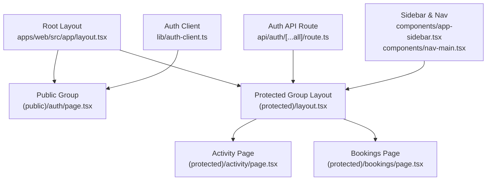
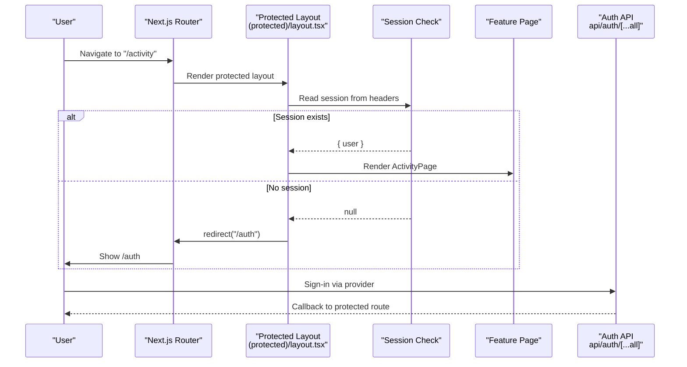
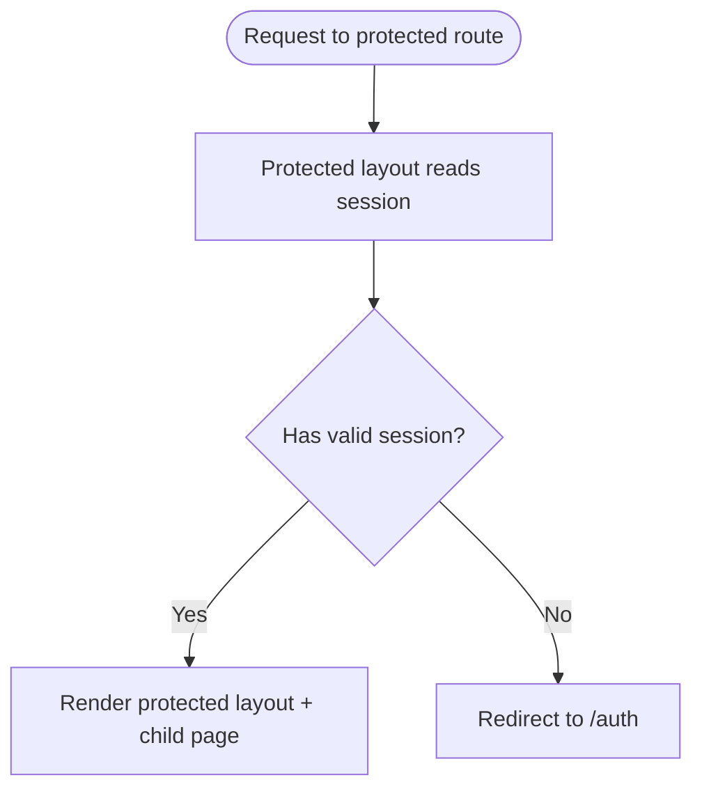
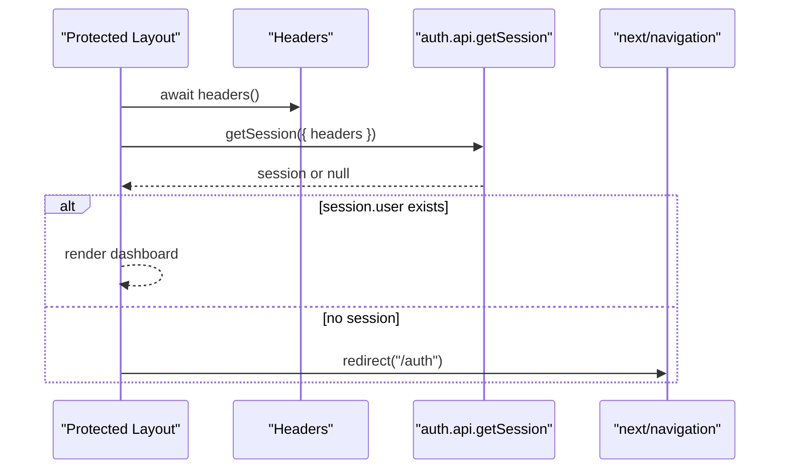
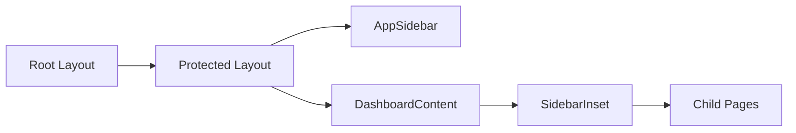
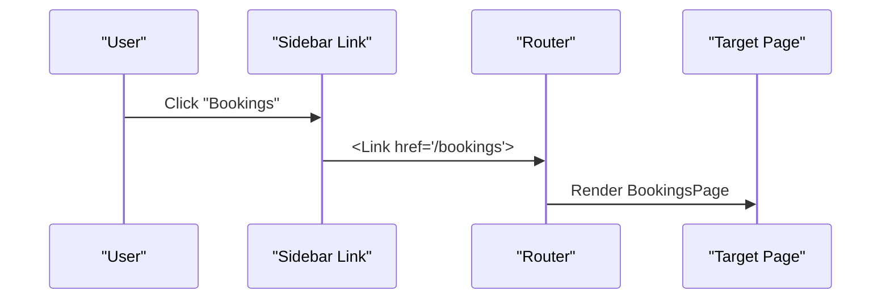
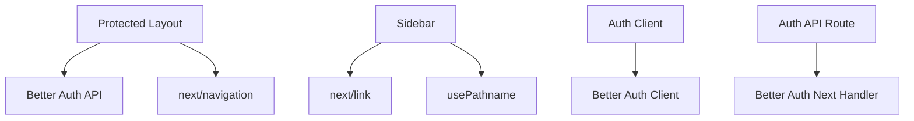

# Routing and Navigation

<cite>
**Referenced Files in This Document**
- [layout.tsx](file://apps/web/src/app/layout.tsx)
- [protected layout.tsx](file://apps/web/src/app/(protected)/layout.tsx)
- [page.tsx](file://apps/web/src/app/page.tsx)
- [auth page.tsx](file://apps/web/src/app/(public)/auth/page.tsx)
- [activity page.tsx](file://apps/web/src/app/(protected)/activity/page.tsx)
- [bookings page.tsx](file://apps/web/src/app/(protected)/bookings/page.tsx)
- [auth client.ts](file://apps/web/src/lib/auth-client.ts)
- [auth component.tsx](file://apps/web/src/components/auth.tsx)
- [auth route.ts](file://apps/web/src/app/api/auth/[...all]/route.ts)
- [nav-main.tsx](file://apps/web/src/components/nav-main.tsx)
- [app-sidebar.tsx](file://apps/web/src/components/app-sidebar.tsx)
</cite>

## Table of Contents

1. [Introduction](#introduction)
2. [Project Structure](#project-structure)
3. [Core Components](#core-components)
4. [Architecture Overview](#architecture-overview)
5. [Detailed Component Analysis](#detailed-component-analysis)
6. [Dependency Analysis](#dependency-analysis)
7. [Performance Considerations](#performance-considerations)
8. [Troubleshooting Guide](#troubleshooting-guide)
9. [Conclusion](#conclusion)

## Introduction

This document explains the Next.js App Router implementation with a focus on route groups, navigation patterns, and authentication guards. It covers:

- Protected vs public route groups and how they are composed
- Server-side session checks for route protection
- Client-side authentication flows using Better Auth
- Nested layouts and shared UI for protected routes
- Routing structure for activity tracking, bookings management, and user authentication
- Navigation patterns between pages, programmatic routing, and dynamic route handling
- Route-level data fetching patterns and SEO considerations

## Project Structure

The application uses Next.js App Router conventions:

- Root layout defines global providers and metadata
- Public routes under (public) include the auth entry point
- Protected routes under (protected) enforce server-side session checks and provide a shared dashboard layout
- Feature pages exist under each group (e.g., activity, bookings)
- API routes handle authentication endpoints and tRPC

**Diagram sources**

- [layout.tsx:21-46](file://apps/web/src/app/layout.tsx#L21-L46)
- [protected layout.tsx:22-65](<file://apps/web/src/app/(protected)/layout.tsx#L22-L65>)
- [auth page.tsx:1-8](<file://apps/web/src/app/(public)/auth/page.tsx#L1-L8>)
- [activity page.tsx:11-29](<file://apps/web/src/app/(protected)/activity/page.tsx#L11-L29>)
- [bookings page.tsx:11-29](<file://apps/web/src/app/(protected)/bookings/page.tsx#L11-L29>)
- [auth route.ts:1-5](file://apps/web/src/app/api/auth/[...all]/route.ts#L1-L5)
- [auth client.ts:1-8](file://apps/web/src/lib/auth-client.ts#L1-L8)
- [app-sidebar.tsx:13-24](file://apps/web/src/components/app-sidebar.tsx#L13-L24)
- [nav-main.tsx:14-63](file://apps/web/src/components/nav-main.tsx#L14-L63)

**Section sources**

- [layout.tsx:21-46](file://apps/web/src/app/layout.tsx#L21-L46)
- [protected layout.tsx:22-65](<file://apps/web/src/app/(protected)/layout.tsx#L22-L65>)
- [auth page.tsx:1-8](<file://apps/web/src/app/(public)/auth/page.tsx#L1-L8>)
- [activity page.tsx:11-29](<file://apps/web/src/app/(protected)/activity/page.tsx#L11-L29>)
- [bookings page.tsx:11-29](<file://apps/web/src/app/(protected)/bookings/page.tsx#L11-L29>)
- [auth route.ts:1-5](file://apps/web/src/app/api/auth/[...all]/route.ts#L1-L5)
- [auth client.ts:1-8](file://apps/web/src/lib/auth-client.ts#L1-L8)
- [app-sidebar.tsx:13-24](file://apps/web/src/components/app-sidebar.tsx#L13-L24)
- [nav-main.tsx:14-63](file://apps/web/src/components/nav-main.tsx#L14-L63)

## Core Components

- Root layout: Sets global fonts, providers, and metadata for the app.
- Protected layout: Performs server-side session validation and renders a sidebar-based dashboard shell. Redirects unauthenticated users to /auth.
- Public auth page: Renders a client component that initiates sign-in flows.
- Feature pages: Activity and Bookings are simple feature shells within the protected layout.
- Sidebar navigation: Centralized menu driving navigation across protected features.

Key responsibilities:

- Authentication guard at the protected layout level ensures only authenticated users can access protected features.
- Client-side auth components manage provider-specific sign-in flows and redirect to protected areas after success.
- Shared UI components compose the dashboard experience consistently across protected routes.

**Section sources**

- [layout.tsx:21-46](file://apps/web/src/app/layout.tsx#L21-L46)
- [protected layout.tsx:22-65](<file://apps/web/src/app/(protected)/layout.tsx#L22-L65>)
- [auth page.tsx:1-8](<file://apps/web/src/app/(public)/auth/page.tsx#L1-L8>)
- [activity page.tsx:11-29](<file://apps/web/src/app/(protected)/activity/page.tsx#L11-L29>)
- [bookings page.tsx:11-29](<file://apps/web/src/app/(protected)/bookings/page.tsx#L11-L29>)
- [nav-main.tsx:14-63](file://apps/web/src/components/nav-main.tsx#L14-L63)

## Architecture Overview

The routing architecture separates public and protected areas using route groups:

- Public area: Contains the authentication entry point (/auth).
- Protected area: Enforces server-side session checks and provides a consistent dashboard layout for all protected features.

**Diagram sources**

- [protected layout.tsx:22-33](<file://apps/web/src/app/(protected)/layout.tsx#L22-L33>)
- [auth route.ts:1-5](file://apps/web/src/app/api/auth/[...all]/route.ts#L1-L5)
- [activity page.tsx:11-29](<file://apps/web/src/app/(protected)/activity/page.tsx#L11-L29>)

## Detailed Component Analysis

### Protected vs Public Route Groups

- Public group:
  - Path: (public)/auth/page.tsx
  - Purpose: Entry point for authentication; renders a client component that triggers provider sign-in flows.
- Protected group:
  - Path: (protected)/layout.tsx
  - Purpose: Server-side session check; redirects to /auth if not authenticated; wraps children in a dashboard layout with sidebar and header.

Protection strategy:

- The protected layout reads the current session using server-side APIs and redirects unauthenticated users to the public auth page.
- All feature pages under (protected) inherit this protection automatically.

**Diagram sources**

- [protected layout.tsx:22-33](<file://apps/web/src/app/(protected)/layout.tsx#L22-L33>)

**Section sources**

- [auth page.tsx:1-8](<file://apps/web/src/app/(public)/auth/page.tsx#L1-L8>)
- [protected layout.tsx:22-33](<file://apps/web/src/app/(protected)/layout.tsx#L22-L33>)

### Middleware-Based Authentication Guards

Implementation approach:

- Instead of a separate middleware file, the protected layout acts as a server-side guard by checking the session before rendering any protected content.
- If no session is present, it performs an immediate redirect to the public auth page.

Benefits:

- Centralized protection for all routes under (protected).
- Consistent behavior without per-page checks.

**Diagram sources**

- [protected layout.tsx:22-33](<file://apps/web/src/app/(protected)/layout.tsx#L22-L33>)

**Section sources**

- [protected layout.tsx:22-33](<file://apps/web/src/app/(protected)/layout.tsx#L22-L33>)

### Nested Layout Compositions

- Root layout sets global providers and metadata.
- Protected layout composes:
  - SidebarProvider and DashboardContent
  - AppSidebar with collapsible mode
  - Header with trigger, separator, title, theme toggle, and agent button
  - Assistant panel provider and assistant component
- Child pages render inside the protected layout’s content area.

**Diagram sources**

- [layout.tsx:21-46](file://apps/web/src/app/layout.tsx#L21-L46)
- [protected layout.tsx:35-65](<file://apps/web/src/app/(protected)/layout.tsx#L35-L65>)
- [app-sidebar.tsx:13-24](file://apps/web/src/components/app-sidebar.tsx#L13-L24)

**Section sources**

- [layout.tsx:21-46](file://apps/web/src/app/layout.tsx#L21-L46)
- [protected layout.tsx:35-65](<file://apps/web/src/app/(protected)/layout.tsx#L35-L65>)
- [app-sidebar.tsx:13-24](file://apps/web/src/components/app-sidebar.tsx#L13-L24)

### Routing Structure for Feature Areas

- Activity tracking:
  - Route: (protected)/activity/page.tsx
  - Behavior: Displays an empty state placeholder within the protected layout.
- Bookings management:
  - Route: (protected)/bookings/page.tsx
  - Behavior: Displays an empty state placeholder within the protected layout.
- User authentication flows:
  - Route: (public)/auth/page.tsx
  - Behavior: Renders a client component that initiates Google or Telegram sign-in and redirects to protected routes upon success.

Navigation entries:

- Sidebar defines links to trips, activity, bookings, and integrations. These are rendered within the protected layout context.

**Section sources**

- [activity page.tsx:11-29](<file://apps/web/src/app/(protected)/activity/page.tsx#L11-L29>)
- [bookings page.tsx:11-29](<file://apps/web/src/app/(protected)/bookings/page.tsx#L11-L29>)
- [auth page.tsx:1-8](<file://apps/web/src/app/(public)/auth/page.tsx#L1-L8>)
- [nav-main.tsx:14-63](file://apps/web/src/components/nav-main.tsx#L14-L63)

### Navigation Patterns Between Pages

- Declarative navigation:
  - Uses next/link within the sidebar to navigate to feature pages. Active state is determined by pathname prefix matching.
- Programmatic navigation:
  - After successful sign-in, provider callbacks redirect to protected routes (e.g., /trips), leveraging the protected layout’s guard to ensure access.
- Dynamic route handling:
  - API routes use catch-all segments (e.g., api/auth/[...all]) to delegate requests to the authentication handler.

**Diagram sources**

- [nav-main.tsx:39-63](file://apps/web/src/components/nav-main.tsx#L39-L63)
- [bookings page.tsx:11-29](<file://apps/web/src/app/(protected)/bookings/page.tsx#L11-L29>)

**Section sources**

- [nav-main.tsx:39-63](file://apps/web/src/components/nav-main.tsx#L39-L63)
- [auth route.ts:1-5](file://apps/web/src/app/api/auth/[...all]/route.ts#L1-L5)

### Data Fetching at the Route Level

- Server-side session check:
  - The protected layout fetches the session using server-side APIs and headers before rendering protected content.
- Client-side health check:
  - The root page demonstrates client-side data fetching using React Query and tRPC to show API status.

Recommendations:

- For feature pages requiring data, prefer server components where possible to fetch data directly in the route component or layout.
- Use Suspense boundaries around async sections to improve perceived performance.

**Section sources**

- [protected layout.tsx:22-33](<file://apps/web/src/app/(protected)/layout.tsx#L22-L33>)
- [page.tsx:1-39](file://apps/web/src/app/page.tsx#L1-L39)

### SEO Considerations for Different Page Types

- Global metadata:
  - Root layout exports metadata for title and description applicable to all pages unless overridden.
- Page-specific metadata:
  - Add page-level metadata exports in feature pages to tailor titles and descriptions for SEO.
- Public vs protected:
  - Public pages (e.g., auth) may benefit from minimal metadata focused on branding and accessibility.
  - Protected pages should include descriptive metadata reflecting their purpose (e.g., “Activity” or “Bookings”).

**Section sources**

- [layout.tsx:21-24](file://apps/web/src/app/layout.tsx#L21-L24)

## Dependency Analysis

High-level dependencies among routing and navigation components:

- Protected layout depends on authentication APIs and Next.js navigation utilities.
- Sidebar navigation depends on Next.js navigation hooks and link components.
- Auth client depends on Better Auth client plugins and configuration.
- API routes depend on Better Auth handlers for Next.js.

**Diagram sources**

- [protected layout.tsx:22-33](<file://apps/web/src/app/(protected)/layout.tsx#L22-L33>)
- [nav-main.tsx:10-12](file://apps/web/src/components/nav-main.tsx#L10-L12)
- [auth client.ts:1-8](file://apps/web/src/lib/auth-client.ts#L1-L8)
- [auth route.ts:1-5](file://apps/web/src/app/api/auth/[...all]/route.ts#L1-L5)

**Section sources**

- [protected layout.tsx:22-33](<file://apps/web/src/app/(protected)/layout.tsx#L22-L33>)
- [nav-main.tsx:10-12](file://apps/web/src/components/nav-main.tsx#L10-L12)
- [auth client.ts:1-8](file://apps/web/src/lib/auth-client.ts#L1-L8)
- [auth route.ts:1-5](file://apps/web/src/app/api/auth/[...all]/route.ts#L1-L5)

## Performance Considerations

- Server-side session checks reduce unnecessary client-side logic and protect routes efficiently.
- Using Suspense around feature pages improves loading UX during data fetching.
- Prefer server components for data-heavy pages to minimize client bundle size.
- Avoid heavy computations in layouts; keep layouts lightweight and focused on composition.

[No sources needed since this section provides general guidance]

## Troubleshooting Guide

Common issues and resolutions:

- Unauthenticated redirect loops:
  - Ensure the protected layout correctly reads headers and session; verify that callback URLs after sign-in point to protected routes.
- Sidebar active state not updating:
  - Confirm pathname usage and URL paths match actual routes; ensure links use correct href values.
- API route errors:
  - Verify the auth API route delegates to the correct handler and environment variables are configured for providers.

**Section sources**

- [protected layout.tsx:22-33](<file://apps/web/src/app/(protected)/layout.tsx#L22-L33>)
- [nav-main.tsx:39-63](file://apps/web/src/components/nav-main.tsx#L39-L63)
- [auth route.ts:1-5](file://apps/web/src/app/api/auth/[...all]/route.ts#L1-L5)

## Conclusion

The application leverages Next.js App Router route groups to cleanly separate public and protected areas. Protection is enforced at the protected layout level through server-side session checks, while client-side authentication flows integrate seamlessly via Better Auth. Shared layouts and sidebar navigation provide a consistent user experience across features like activity tracking and bookings management. Following the patterns outlined here will help maintain secure, scalable, and performant routing and navigation throughout the application.

[No sources needed since this section summarizes without analyzing specific files]
