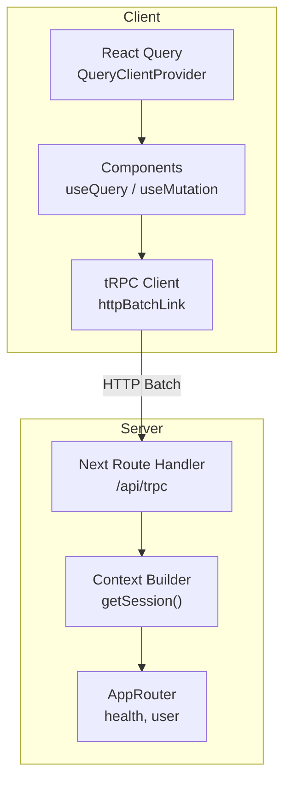
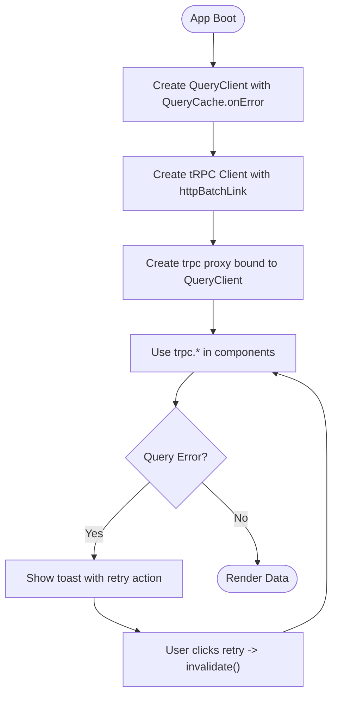
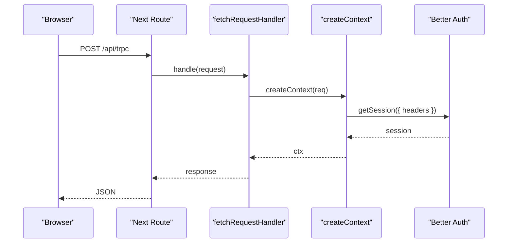
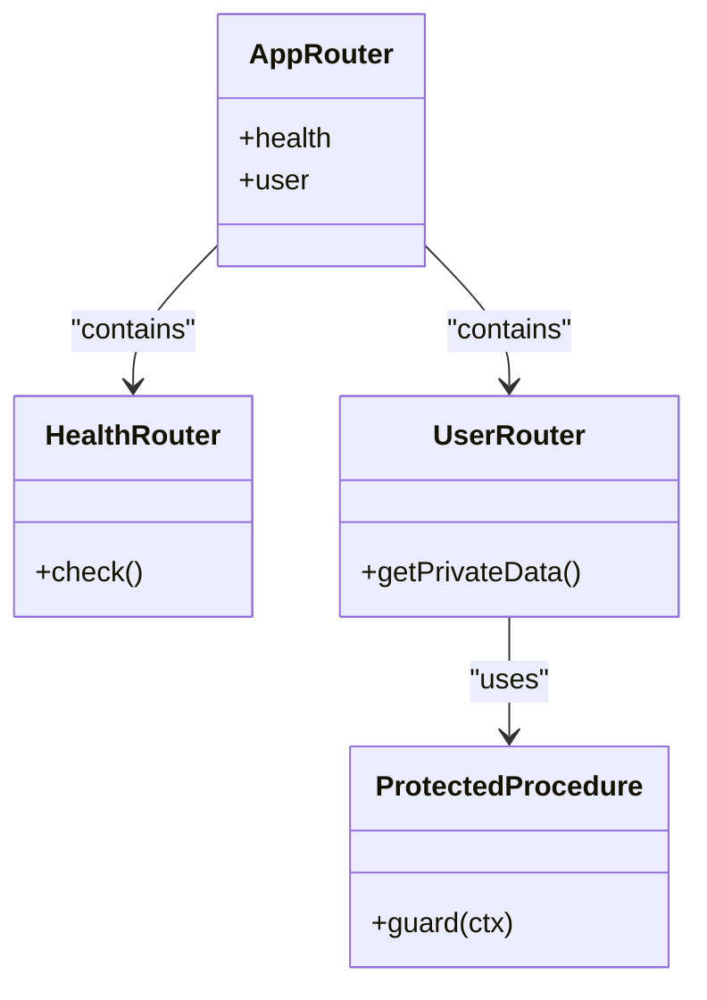
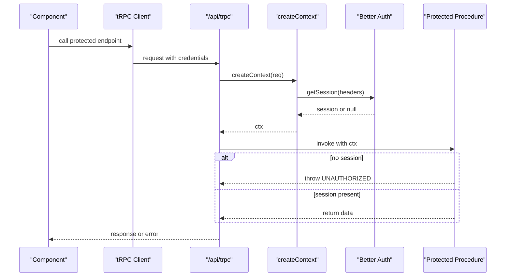
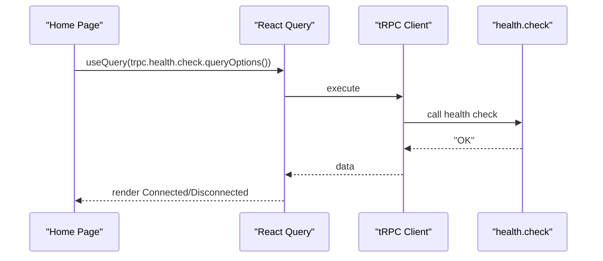
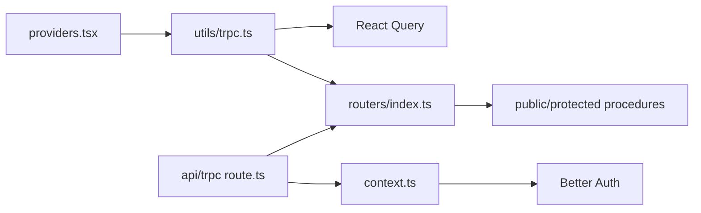

# API State with tRPC Client

<cite>
**Referenced Files in This Document**
- [trpc.ts](file://apps/web/src/utils/trpc.ts)
- [route.ts](file://apps/web/src/app/api/trpc/[trpc]/route.ts)
- [context.ts](file://packages/api/src/context.ts)
- [index.ts (API core)](file://packages/api/src/index.ts)
- [routers/index.ts](file://packages/api/src/routers/index.ts)
- [health.ts](file://packages/api/src/routers/health.ts)
- [user.ts](file://packages/api/src/routers/user.ts)
- [providers.tsx](file://apps/web/src/components/providers.tsx)
- [page.tsx](file://apps/web/src/app/page.tsx)
- [auth-client.ts](file://apps/web/src/lib/auth-client.ts)
</cite>

## Table of Contents

1. Introduction
2. Project Structure
3. Core Components
4. Architecture Overview
5. Detailed Component Analysis
6. Dependency Analysis
7. Performance Considerations
8. Troubleshooting Guide
9. Conclusion

## Introduction

This document explains how the application manages API state using tRPC with a React Query-backed client. It covers:

- HTTP batch link setup for efficient request bundling
- Credential handling to support authenticated requests
- Integration with React Query for caching, background updates, and optimistic UI patterns
- Type-safe client creation via shared AppRouter types
- Error handling strategies and request/response patterns
- Examples of queries and mutations
- Connection management, error recovery, and debugging techniques

## Project Structure

The tRPC stack spans both client and server layers:

- Client-side configuration and provider wiring
- Server-side route handler that builds context from incoming requests
- Shared router definitions exposing typed procedures



**Diagram sources**

- [trpc.ts:1-39](file://apps/web/src/utils/trpc.ts#L1-L39)
- [route.ts:1-13](file://apps/web/src/app/api/trpc/[trpc]/route.ts#L1-L13)
- [context.ts:1-15](file://packages/api/src/context.ts#L1-L15)
- [routers/index.ts:1-11](file://packages/api/src/routers/index.ts#L1-L11)
- [providers.tsx:1-26](file://apps/web/src/components/providers.tsx#L1-L26)

**Section sources**

- [trpc.ts:1-39](file://apps/web/src/utils/trpc.ts#L1-L39)
- [route.ts:1-13](file://apps/web/src/app/api/trpc/[trpc]/route.ts#L1-L13)
- [context.ts:1-15](file://packages/api/src/context.ts#L1-L15)
- [routers/index.ts:1-11](file://packages/api/src/routers/index.ts#L1-L11)
- [providers.tsx:1-26](file://apps/web/src/components/providers.tsx#L1-L26)

## Core Components

- tRPC client with httpBatchLink: Creates a type-safe client that batches multiple calls into a single HTTP request to reduce network overhead.
- React Query integration: A shared QueryClient is provided at app root; errors are surfaced via toast notifications with retry actions.
- Server route handler: Forwards Next.js requests to tRPC’s fetch adapter, building context per request.
- Context builder: Extracts session information from request headers using Better Auth.
- Router composition: Aggregates feature routers (health, user) into a single AppRouter used by both client and server for end-to-end types.

Key responsibilities:

- Client: batching, credentials, query cache, toast-based error feedback
- Server: context creation, session resolution, procedure guards
- Providers: global QueryClient injection

**Section sources**

- [trpc.ts:1-39](file://apps/web/src/utils/trpc.ts#L1-L39)
- [route.ts:1-13](file://apps/web/src/app/api/trpc/[trpc]/route.ts#L1-L13)
- [context.ts:1-15](file://packages/api/src/context.ts#L1-L15)
- [routers/index.ts:1-11](file://packages/api/src/routers/index.ts#L1-L11)
- [providers.tsx:1-26](file://apps/web/src/components/providers.tsx#L1-L26)

## Architecture Overview

End-to-end flow from component to server and back:

```mermaid
sequenceDiagram
participant Comp as "Component"
participant RQ as "React Query"
participant TRPC as "tRPC Client"
participant LINK as "httpBatchLink"
participant NEXT as "Next Route /api/trpc"
participant CTX as "Context Builder"
participant ROUTER as "AppRouter Procedures"
Comp->>RQ : useQuery(trpc.health.check.queryOptions())
RQ->>TRPC : execute query
TRPC->>LINK : build batched request
LINK->>NEXT : POST /api/trpc (credentials included)
NEXT->>CTX : createContext(req)
CTX-->>NEXT : { session }
NEXT->>ROUTER : invoke health.check
ROUTER-->>NEXT : response data
NEXT-->>LINK : JSON response
LINK-->>TRPC : parsed result
TRPC-->>RQ : update cache
RQ-->>Comp : render data
```

**Diagram sources**

- [trpc.ts:1-39](file://apps/web/src/utils/trpc.ts#L1-L39)
- [route.ts:1-13](file://apps/web/src/app/api/trpc/[trpc]/route.ts#L1-L13)
- [context.ts:1-15](file://packages/api/src/context.ts#L1-L15)
- [health.ts:1-5](file://packages/api/src/routers/health.ts#L1-L5)

## Detailed Component Analysis

### tRPC Client and React Query Integration

- The client uses httpBatchLink to bundle multiple tRPC calls into one HTTP request, reducing latency and bandwidth.
- Credentials are set to include so cookies/sessions are sent automatically on cross-origin or same-origin requests.
- A shared QueryClient is created with a custom QueryCache onError hook that shows a toast with a retry action to invalidate and refetch the failed query.
- The trpc proxy is created with createTRPCOptionsProxy to integrate seamlessly with React Query hooks and mutations.



**Diagram sources**

- [trpc.ts:7-39](file://apps/web/src/utils/trpc.ts#L7-L39)

**Section sources**

- [trpc.ts:1-39](file://apps/web/src/utils/trpc.ts#L1-L39)

### Server-Side Route Handler and Context

- The Next.js route at /api/trpc delegates to tRPC’s fetchRequestHandler.
- Context is built per request by extracting the session from request headers using Better Auth.
- The handler exposes GET and POST methods to accept tRPC requests.



**Diagram sources**

- [route.ts:1-13](file://apps/web/src/app/api/trpc/[trpc]/route.ts#L1-L13)
- [context.ts:1-15](file://packages/api/src/context.ts#L1-L15)

**Section sources**

- [route.ts:1-13](file://apps/web/src/app/api/trpc/[trpc]/route.ts#L1-L13)
- [context.ts:1-15](file://packages/api/src/context.ts#L1-L15)

### Router Composition and Procedure Guards

- The AppRouter composes feature routers (health, user).
- Public procedures are exposed directly; protected procedures enforce authentication by checking for a session in context and throwing a standardized UNAUTHORIZED error when missing.



**Diagram sources**

- [routers/index.ts:1-11](file://packages/api/src/routers/index.ts#L1-L11)
- [health.ts:1-5](file://packages/api/src/routers/health.ts#L1-L5)
- [user.ts:1-9](file://packages/api/src/routers/user.ts#L1-L9)
- [index.ts (API core):11-25](file://packages/api/src/index.ts#L11-L25)

**Section sources**

- [routers/index.ts:1-11](file://packages/api/src/routers/index.ts#L1-L11)
- [health.ts:1-5](file://packages/api/src/routers/health.ts#L1-L5)
- [user.ts:1-9](file://packages/api/src/routers/user.ts#L1-L9)
- [index.ts (API core):1-25](file://packages/api/src/index.ts#L1-L25)

### Authentication Flow and Credentials

- The client sets credentials to include so cookies are sent with every request.
- The server resolves the session from request headers using Better Auth and attaches it to tRPC context.
- Protected procedures validate the presence of a session and return a consistent UNAUTHORIZED error if absent.



**Diagram sources**

- [trpc.ts:22-33](file://apps/web/src/utils/trpc.ts#L22-L33)
- [route.ts:1-13](file://apps/web/src/app/api/trpc/[trpc]/route.ts#L1-L13)
- [context.ts:1-15](file://packages/api/src/context.ts#L1-L15)
- [index.ts (API core):11-25](file://packages/api/src/index.ts#L11-L25)

**Section sources**

- [trpc.ts:22-33](file://apps/web/src/utils/trpc.ts#L22-L33)
- [route.ts:1-13](file://apps/web/src/app/api/trpc/[trpc]/route.ts#L1-L13)
- [context.ts:1-15](file://packages/api/src/context.ts#L1-L15)
- [index.ts (API core):11-25](file://packages/api/src/index.ts#L11-L25)

### Example Usage Patterns

- Queries: Use React Query’s useQuery with trpc endpoints to fetch data and benefit from automatic caching and revalidation.
- Mutations: Use trpc mutation helpers to perform writes; they integrate with React Query cache for invalidation and optimistic updates.
- Status indicator: The home page demonstrates querying a health endpoint and rendering connection status based on loading/data states.



**Diagram sources**

- [page.tsx:1-38](file://apps/web/src/app/page.tsx#L1-L38)
- [health.ts:1-5](file://packages/api/src/routers/health.ts#L1-L5)

**Section sources**

- [page.tsx:1-38](file://apps/web/src/app/page.tsx#L1-L38)
- [health.ts:1-5](file://packages/api/src/routers/health.ts#L1-L5)

## Dependency Analysis

High-level dependencies between modules:



**Diagram sources**

- [providers.tsx:1-26](file://apps/web/src/components/providers.tsx#L1-L26)
- [trpc.ts:1-39](file://apps/web/src/utils/trpc.ts#L1-L39)
- [route.ts:1-13](file://apps/web/src/app/api/trpc/[trpc]/route.ts#L1-L13)
- [context.ts:1-15](file://packages/api/src/context.ts#L1-L15)
- [routers/index.ts:1-11](file://packages/api/src/routers/index.ts#L1-L11)

**Section sources**

- [providers.tsx:1-26](file://apps/web/src/components/providers.tsx#L1-L26)
- [trpc.ts:1-39](file://apps/web/src/utils/trpc.ts#L1-L39)
- [route.ts:1-13](file://apps/web/src/app/api/trpc/[trpc]/route.ts#L1-L13)
- [context.ts:1-15](file://packages/api/src/context.ts#L1-L15)
- [routers/index.ts:1-11](file://packages/api/src/routers/index.ts#L1-L11)

## Performance Considerations

- Batching: httpBatchLink reduces round trips by grouping multiple tRPC calls into a single HTTP request.
- Caching: React Query caches results and deduplicates concurrent requests; configure stale times and refetch policies per query as needed.
- Credentials: Using credentials: include ensures sessions persist across requests without manual cookie handling.
- Error UX: Centralized error handling surfaces actionable feedback and enables quick retries.

[No sources needed since this section provides general guidance]

## Troubleshooting Guide

Common issues and remedies:

- Unauthenticated requests: Ensure credentials are included and cookies are enabled in the browser. Verify that the server extracts the session correctly from headers.
- Unauthorized errors: Protected procedures will throw UNAUTHORIZED if no session exists. Confirm login flow and that auth cookies are being set.
- Network failures: The QueryCache onError hook displays a toast with a retry action; clicking retry invalidates and refetches the query.
- Debugging: Inspect network requests to /api/trpc to verify batching and payload structure. Check server logs for context/session extraction steps.

**Section sources**

- [trpc.ts:7-19](file://apps/web/src/utils/trpc.ts#L7-L19)
- [index.ts (API core):11-25](file://packages/api/src/index.ts#L11-L25)

## Conclusion

This setup delivers a robust, type-safe API layer powered by tRPC and React Query. The httpBatchLink optimizes network usage, while React Query provides powerful caching and synchronization. Authentication is handled consistently through context and procedure guards, and error handling offers clear user feedback with easy recovery paths.

[No sources needed since this section summarizes without analyzing specific files]
