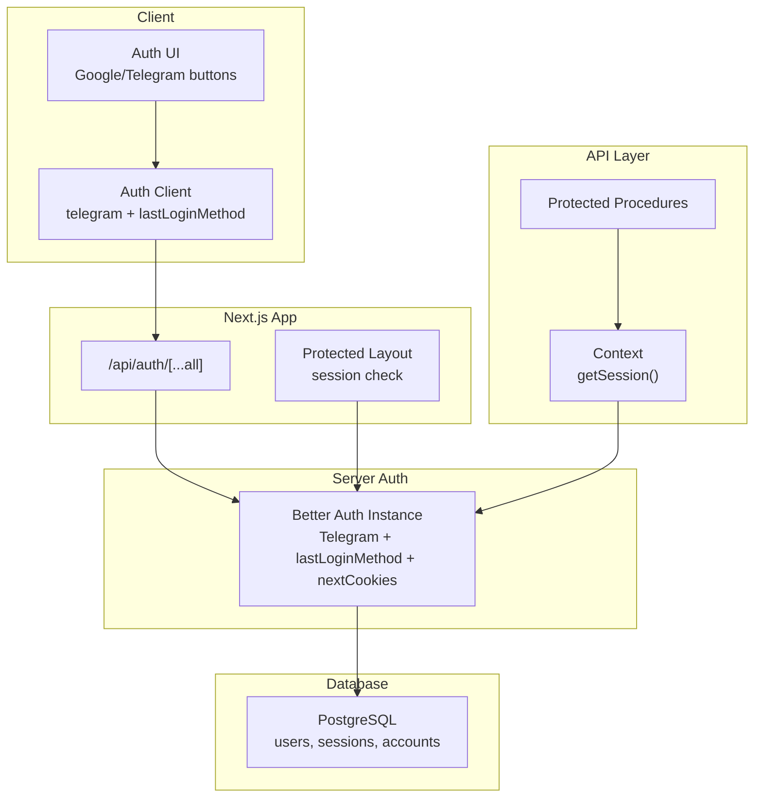
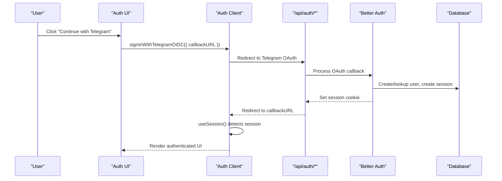
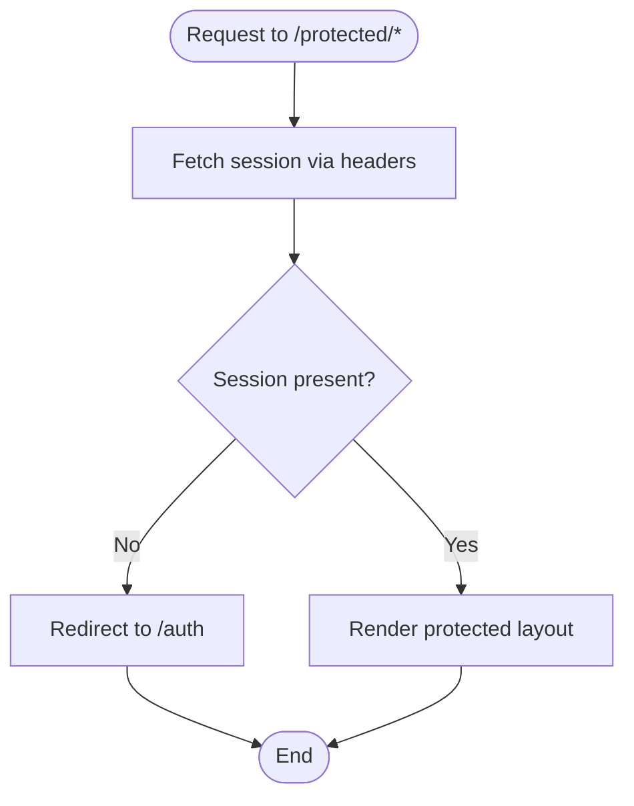
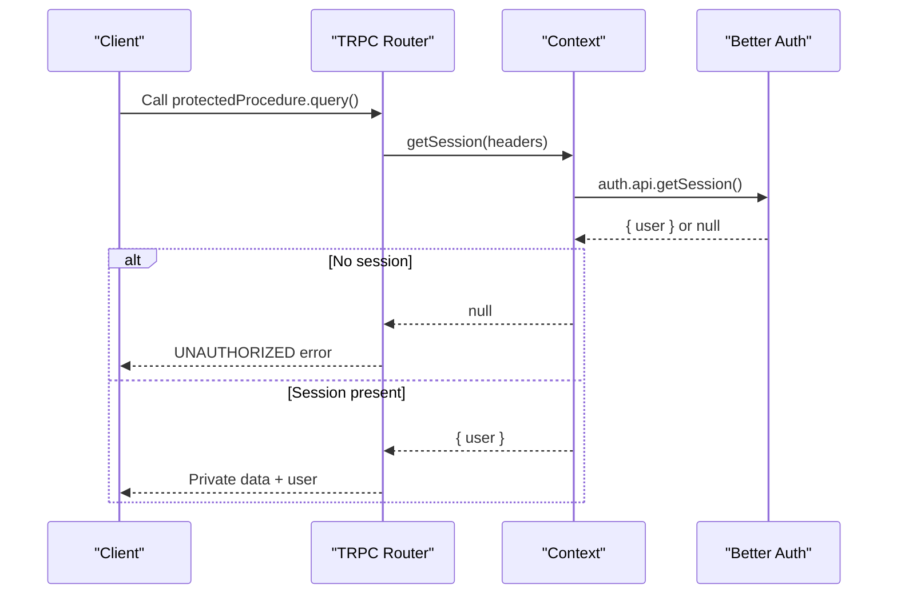
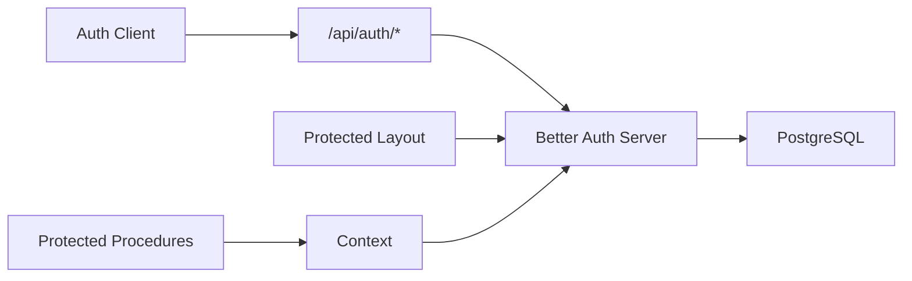

# Authentication State Management

<cite>
**Referenced Files in This Document**
- [auth-client.ts](file://apps/web/src/lib/auth-client.ts)
- [route.ts](file://apps/web/src/app/api/auth/[...all]/route.ts)
- [index.ts (server auth)](file://packages/auth/src/index.ts)
- [auth.tsx](file://apps/web/src/components/auth.tsx)
- [layout.tsx (protected layout)](file://apps/web/src/app/(protected)/layout.tsx)
- [page.tsx (public auth page)](file://apps/web/src/app/(public)/auth/page.tsx)
- [context.ts (API context)](file://packages/api/src/context.ts)
- [index.ts (API procedures)](file://packages/api/src/index.ts)
- [user.ts (TRPC router)](file://packages/api/src/routers/user.ts)
- [auth schema](file://packages/db/src/schema/auth.ts)
</cite>

## Table of Contents

1. [Introduction](#introduction)
2. [Project Structure](#project-structure)
3. [Core Components](#core-components)
4. [Architecture Overview](#architecture-overview)
5. [Detailed Component Analysis](#detailed-component-analysis)
6. [Dependency Analysis](#dependency-analysis)
7. [Performance Considerations](#performance-considerations)
8. [Troubleshooting Guide](#troubleshooting-guide)
9. [Conclusion](#conclusion)

## Introduction

This document explains how authentication state is managed using the Better Auth client with Telegram integration and last login method tracking. It covers client configuration, server-side setup, session management, protected routes, and state synchronization across the application. It also includes examples for user authentication flows, session validation, handling state changes, security considerations, token management, and integration with protected routes and API calls.

## Project Structure

The authentication system spans client, server, and API layers:

- Client: React-based Better Auth client with Telegram plugin and last login method plugin
- Server: Next.js route handler that proxies to Better Auth endpoints
- Protected routes: Server-side session checks before rendering protected layouts
- API layer: TRPC procedures guarded by session checks
- Database: Drizzle schema for users, sessions, accounts, and verifications

**Diagram sources**

- [auth-client.ts:1-7](file://apps/web/src/lib/auth-client.ts#L1-L7)
- [route.ts:1-5](file://apps/web/src/app/api/auth/[...all]/route.ts#L1-L5)
- [index.ts (server auth):10-42](file://packages/auth/src/index.ts#L10-L42)
- [layout.tsx (protected layout):22-33](<file://apps/web/src/app/(protected)/layout.tsx#L22-L33>)
- [context.ts:4-11](file://packages/api/src/context.ts#L4-L11)
- [auth schema:1-101](file://packages/db/src/schema/auth.ts#L1-L101)

**Section sources**

- [auth-client.ts:1-7](file://apps/web/src/lib/auth-client.ts#L1-L7)
- [route.ts:1-5](file://apps/web/src/app/api/auth/[...all]/route.ts#L1-L5)
- [index.ts (server auth):10-42](file://packages/auth/src/index.ts#L10-L42)
- [layout.tsx (protected layout):22-33](<file://apps/web/src/app/(protected)/layout.tsx#L22-L33>)
- [context.ts:4-11](file://packages/api/src/context.ts#L4-L11)
- [auth schema:1-101](file://packages/db/src/schema/auth.ts#L1-L101)

## Core Components

- Auth client: Initializes Better Auth client with Telegram OIDC and last login method plugins
- Server auth: Configures Better Auth with Telegram provider, last login method plugin, Next cookies, Google OAuth, database adapter, and trusted origins
- Protected layout: Validates session on the server and redirects unauthenticated users
- API context and procedures: Validate sessions for TRPC endpoints and expose protected data

Key responsibilities:

- Client: Trigger sign-in flows, read session, track last used login method
- Server: Handle auth endpoints, enforce session validity, persist sessions
- API: Guard procedures with session checks

**Section sources**

- [auth-client.ts:1-7](file://apps/web/src/lib/auth-client.ts#L1-L7)
- [index.ts (server auth):10-42](file://packages/auth/src/index.ts#L10-L42)
- [layout.tsx (protected layout):22-33](<file://apps/web/src/app/(protected)/layout.tsx#L22-L33>)
- [context.ts:4-11](file://packages/api/src/context.ts#L4-L11)
- [index.ts (API procedures):9-25](file://packages/api/src/index.ts#L9-L25)

## Architecture Overview

The authentication flow integrates client-side triggers, server-side handlers, and protected resources:

**Diagram sources**

- [auth.tsx:16-20](file://apps/web/src/components/auth.tsx#L16-L20)
- [route.ts:1-5](file://apps/web/src/app/api/auth/[...all]/route.ts#L1-L5)
- [index.ts (server auth):10-42](file://packages/auth/src/index.ts#L10-L42)
- [auth schema:21-39](file://packages/db/src/schema/auth.ts#L21-L39)

## Detailed Component Analysis

### Auth Client Configuration

- Creates a Better Auth client with two plugins:
  - Telegram client plugin for Telegram OIDC sign-in
  - Last login method client plugin to track the most recent login method
- Exposes hooks like useSession and methods like getLastUsedLoginMethod for UI state

Usage highlights:

- Use session hook to detect pending or authenticated states
- Use last login method to highlight the previously used provider in the UI

**Section sources**

- [auth-client.ts:1-7](file://apps/web/src/lib/auth-client.ts#L1-L7)
- [auth.tsx:22-28](file://apps/web/src/components/auth.tsx#L22-L28)
- [auth.tsx:24-63](file://apps/web/src/components/auth.tsx#L24-L63)

### Server-Side Auth Setup

- Initializes Better Auth with:
  - Telegram provider configured via environment variables
  - Last login method plugin to record the last used login method
  - Next.js cookies integration for session persistence
  - Google social provider
  - Drizzle adapter with PostgreSQL schema
  - Trusted origins for CORS

Security notes:

- Uses environment variables for secrets and credentials
- Configures trusted origins to restrict requests

**Section sources**

- [index.ts (server auth):10-42](file://packages/auth/src/index.ts#L10-L42)
- [auth schema:1-101](file://packages/db/src/schema/auth.ts#L1-L101)

### Protected Routes and Session Validation

- The protected layout fetches the session server-side using headers from the request
- If no session exists, it redirects to the public auth page
- This ensures that only authenticated users can access protected content

**Diagram sources**

- [layout.tsx (protected layout):22-33](<file://apps/web/src/app/(protected)/layout.tsx#L22-L33>)

**Section sources**

- [layout.tsx (protected layout):22-33](<file://apps/web/src/app/(protected)/layout.tsx#L22-L33>)

### API Layer Protection

- Context retrieves the session using request headers
- Protected procedures throw an unauthorized error if no session is present
- Example protected procedure returns private data along with the current user

**Diagram sources**

- [context.ts:4-11](file://packages/api/src/context.ts#L4-L11)
- [index.ts (API procedures):11-25](file://packages/api/src/index.ts#L11-L25)
- [user.ts:3-7](file://packages/api/src/routers/user.ts#L3-L7)

**Section sources**

- [context.ts:4-11](file://packages/api/src/context.ts#L4-L11)
- [index.ts (API procedures):11-25](file://packages/api/src/index.ts#L11-L25)
- [user.ts:3-7](file://packages/api/src/routers/user.ts#L3-L7)

### Authentication Flow Examples

- User authentication with Telegram:
  - UI triggers Telegram OIDC sign-in with a callback URL
  - Better Auth handles OAuth and sets session cookies
  - Client detects session and updates UI accordingly

- User authentication with Google:
  - UI triggers Google social sign-in with a callback URL
  - Same session establishment flow as Telegram

- Session validation:
  - Protected layout validates session server-side and redirects if missing
  - API procedures validate session and return errors when unauthorized

- Handling authentication state changes:
  - useSession hook reflects pending and authenticated states
  - Last login method displayed in UI to improve UX

**Section sources**

- [auth.tsx:9-20](file://apps/web/src/components/auth.tsx#L9-L20)
- [auth.tsx:22-28](file://apps/web/src/components/auth.tsx#L22-L28)
- [layout.tsx (protected layout):22-33](<file://apps/web/src/app/(protected)/layout.tsx#L22-L33>)
- [index.ts (API procedures):11-25](file://packages/api/src/index.ts#L11-L25)

## Dependency Analysis

- Client depends on:
  - Telegram client plugin
  - Last login method client plugin
  - Better Auth React hooks
- Server depends on:
  - Telegram provider
  - Last login method plugin
  - Next cookies integration
  - Drizzle adapter and Postgres schema
- Protected routes depend on:
  - Server auth instance to fetch session
- API layer depends on:
  - Context to fetch session
  - Protected procedures to enforce authorization

**Diagram sources**

- [auth-client.ts:1-7](file://apps/web/src/lib/auth-client.ts#L1-L7)
- [route.ts:1-5](file://apps/web/src/app/api/auth/[...all]/route.ts#L1-L5)
- [index.ts (server auth):10-42](file://packages/auth/src/index.ts#L10-L42)
- [layout.tsx (protected layout):22-33](<file://apps/web/src/app/(protected)/layout.tsx#L22-L33>)
- [context.ts:4-11](file://packages/api/src/context.ts#L4-L11)

**Section sources**

- [auth-client.ts:1-7](file://apps/web/src/lib/auth-client.ts#L1-L7)
- [route.ts:1-5](file://apps/web/src/app/api/auth/[...all]/route.ts#L1-L5)
- [index.ts (server auth):10-42](file://packages/auth/src/index.ts#L10-L42)
- [layout.tsx (protected layout):22-33](<file://apps/web/src/app/(protected)/layout.tsx#L22-L33>)
- [context.ts:4-11](file://packages/api/src/context.ts#L4-L11)

## Performance Considerations

- Server-side session checks in protected layouts prevent unnecessary client-side redirects and reduce re-renders
- Using Next cookies integration centralizes session storage and reduces redundant network calls
- TRPC protected procedures fail fast on missing sessions, avoiding expensive operations
- Consider enabling rate limiting and secure cookie settings in production for improved performance and security

[No sources needed since this section provides general guidance]

## Troubleshooting Guide

Common issues and resolutions:

- Unauthenticated access to protected routes:
  - Ensure session exists; protected layout redirects to /auth when missing
- API returns unauthorized:
  - Verify headers are passed to getSession in API context
  - Confirm session middleware or cookies are correctly set by the server
- Telegram sign-in not working:
  - Check environment variables for bot token and username
  - Ensure Telegram provider is enabled in server config
- Last login method not updating:
  - Confirm last login method plugin is enabled on both server and client
  - Verify UI reads the correct method after sign-in

**Section sources**

- [layout.tsx (protected layout):22-33](<file://apps/web/src/app/(protected)/layout.tsx#L22-L33>)
- [context.ts:4-11](file://packages/api/src/context.ts#L4-L11)
- [index.ts (server auth):10-42](file://packages/auth/src/index.ts#L10-L42)
- [auth.tsx:22-28](file://apps/web/src/components/auth.tsx#L22-L28)

## Conclusion

This implementation uses Better Auth to provide a robust authentication system with Telegram integration and last login method tracking. The client initializes plugins for seamless sign-in and UX enhancements, while the server enforces session validity and persists sessions securely. Protected routes and API procedures ensure that sensitive resources are only accessible to authenticated users. Following the patterns outlined here will help maintain consistent authentication behavior, strong security posture, and smooth user experiences across the application.

[No sources needed since this section summarizes without analyzing specific files]
