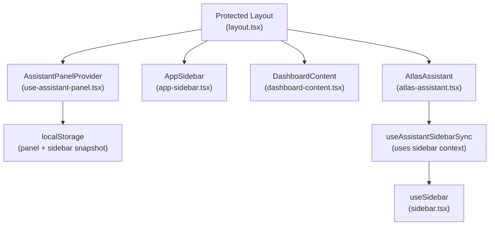
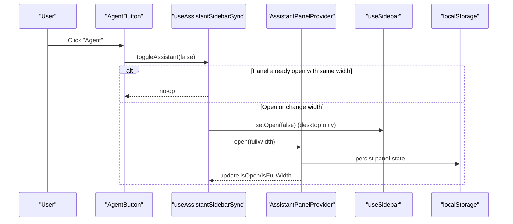
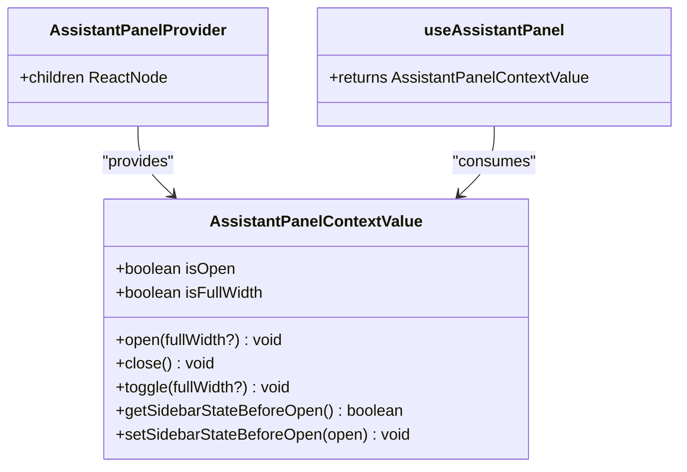
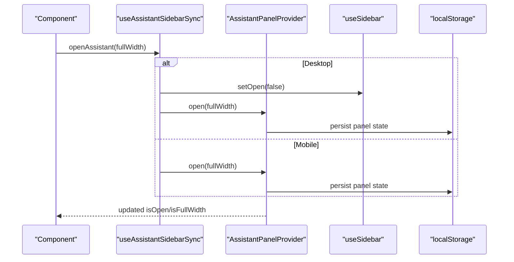
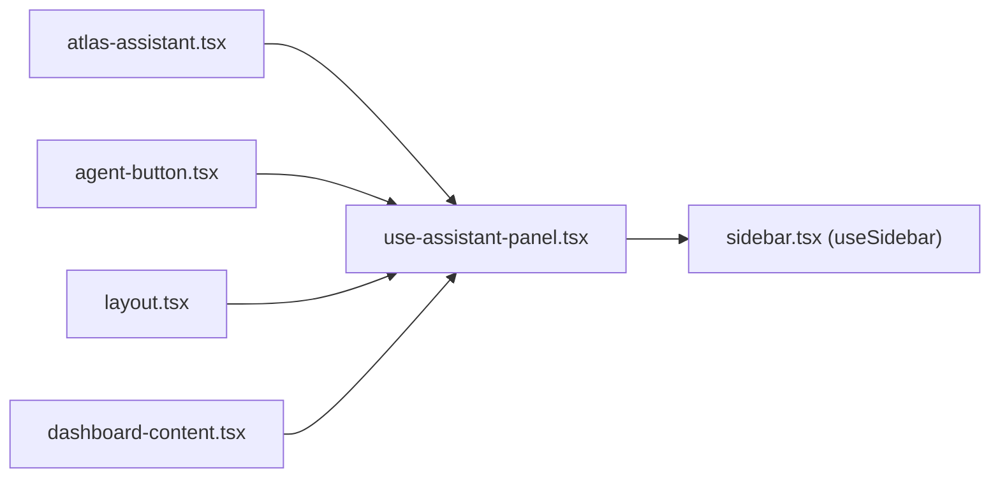
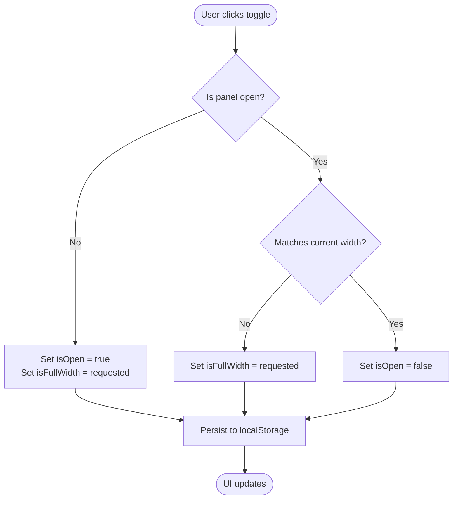

# Local State with Custom Hooks

<cite>
**Referenced Files in This Document**
- [use-assistant-panel.tsx](file://apps/web/src/hooks/use-assistant-panel.tsx)
- [atlas-assistant.tsx](file://apps/web/src/components/atlas-assistant.tsx)
- [app-sidebar.tsx](file://apps/web/src/components/app-sidebar.tsx)
- [layout.tsx](file://apps/web/src/app/(protected)/layout.tsx)
- [dashboard-content.tsx](file://apps/web/src/components/dashboard-content.tsx)
- [agent-button.tsx](file://apps/web/src/components/agent-button.tsx)
- [sidebar.tsx](file://packages/ui/src/components/sidebar.tsx)
</cite>

## Table of Contents

1. [Introduction](#introduction)
2. [Project Structure](#project-structure)
3. [Core Components](#core-components)
4. [Architecture Overview](#architecture-overview)
5. [Detailed Component Analysis](#detailed-component-analysis)
6. [Dependency Analysis](#dependency-analysis)
7. [Performance Considerations](#performance-considerations)
8. [Troubleshooting Guide](#troubleshooting-guide)
9. [Conclusion](#conclusion)
10. [Appendices](#appendices)

## Introduction

This document explains how local UI state for the AI assistant panel is managed using a custom React hook and context pattern. The AssistantPanel hook encapsulates open/close states, full-width mode, and synchronization with the application sidebar. It persists state to localStorage so that panel preferences survive navigation and browser sessions. You will learn the hook’s API (open, close, toggle), how it coordinates with the sidebar, how persistence works, and how to use it safely in components.

## Project Structure

The assistant panel feature spans a small set of focused files:

- Hook and context: apps/web/src/hooks/use-assistant-panel.tsx
- Panel UI: apps/web/src/components/atlas-assistant.tsx
- Sidebar integration: packages/ui/src/components/sidebar.tsx (used via useSidebar)
- App layout wiring providers: apps/web/src/app/(protected)/layout.tsx
- Dashboard content gating when panel is full-width: apps/web/src/components/dashboard-content.tsx
- Trigger button: apps/web/src/components/agent-button.tsx
- Sidebar component usage: apps/web/src/components/app-sidebar.tsx

**Diagram sources**

- [layout.tsx:35-63](<file://apps/web/src/app/(protected)/layout.tsx#L35-L63>)
- [use-assistant-panel.tsx:67-151](file://apps/web/src/hooks/use-assistant-panel.tsx#L67-L151)
- [atlas-assistant.tsx:122-174](file://apps/web/src/components/atlas-assistant.tsx#L122-L174)
- [sidebar.tsx:56-150](file://packages/ui/src/components/sidebar.tsx#L56-L150)

**Section sources**

- [layout.tsx:35-63](<file://apps/web/src/app/(protected)/layout.tsx#L35-L63>)
- [use-assistant-panel.tsx:67-151](file://apps/web/src/hooks/use-assistant-panel.tsx#L67-L151)
- [atlas-assistant.tsx:122-174](file://apps/web/src/components/atlas-assistant.tsx#L122-L174)
- [sidebar.tsx:56-150](file://packages/ui/src/components/sidebar.tsx#L56-L150)

## Core Components

- AssistantPanelContext and Provider: Centralizes panel state (isOpen, isFullWidth) and exposes actions (open, close, toggle). It also tracks the sidebar’s previous open state to restore it later.
- useAssistantPanel: Consumes the context and enforces correct usage by throwing if used outside the provider.
- useAssistantSidebarSync: Bridges the assistant panel with the app sidebar, collapsing the sidebar on desktop when opening the panel and restoring its prior state on close. On mobile, it leaves the overlay sidebar untouched.
- AtlasAssistant: Renders the panel UI, handles keyboard shortcuts, and uses the synced API to open/toggle/close.
- Protected Layout: Wires up AssistantPanelProvider around the protected routes so all child components can access panel state.

Key responsibilities:

- State management: open/close/full-width
- Persistence: localStorage keys for panel state and sidebar snapshot
- Coordination: sync with sidebar context from the shared UI library
- Error handling: graceful fallbacks when storage is unavailable

**Section sources**

- [use-assistant-panel.tsx:20-161](file://apps/web/src/hooks/use-assistant-panel.tsx#L20-L161)
- [atlas-assistant.tsx:122-174](file://apps/web/src/components/atlas-assistant.tsx#L122-L174)
- [layout.tsx:35-63](<file://apps/web/src/app/(protected)/layout.tsx#L35-L63>)

## Architecture Overview

The architecture follows a clear separation of concerns:

- Context-driven state: AssistantPanelProvider owns state and exposes methods via context.
- Sync layer: useAssistantSidebarSync composes panel state with sidebar state to deliver a single API for consumers.
- UI components: AtlasAssistant and AgentButton consume the sync hook to render and trigger behavior.
- Persistence: All state changes are persisted to localStorage with safe error handling.

**Diagram sources**

- [agent-button.tsx:9-27](file://apps/web/src/components/agent-button.tsx#L9-L27)
- [use-assistant-panel.tsx:169-234](file://apps/web/src/hooks/use-assistant-panel.tsx#L169-L234)
- [use-assistant-panel.tsx:92-115](file://apps/web/src/hooks/use-assistant-panel.tsx#L92-L115)
- [sidebar.tsx:76-89](file://packages/ui/src/components/sidebar.tsx#L76-L89)

## Detailed Component Analysis

### AssistantPanelProvider and Context

- State:
  - isOpen: whether the panel is visible
  - isFullWidth: whether the panel occupies the full content area on desktop
  - sidebarStateBeforeOpenValue: snapshot of sidebar open state before opening the panel
- Initialization:
  - Reads persisted values from localStorage on mount using requestAnimationFrame to avoid hydration issues.
- Actions:
  - open(fullWidth?): sets isOpen true and optionally isFullWidth; persists both
  - close(): sets isOpen false; persists current isFullWidth
  - toggle(fullWidth?): flips isOpen; updates isFullWidth when opening; persists accordingly
  - get/setSidebarStateBeforeOpen(): read/write the saved sidebar state snapshot; persisted
- Context value: memoized to prevent unnecessary re-renders.

Error handling:

- Storage reads/writes are wrapped in try/catch to handle private browsing or quota limits. If unavailable, state remains in memory only.

**Section sources**

- [use-assistant-panel.tsx:34-61](file://apps/web/src/hooks/use-assistant-panel.tsx#L34-L61)
- [use-assistant-panel.tsx:67-151](file://apps/web/src/hooks/use-assistant-panel.tsx#L67-L151)

#### Class-like structure

**Diagram sources**

- [use-assistant-panel.tsx:20-28](file://apps/web/src/hooks/use-assistant-panel.tsx#L20-L28)
- [use-assistant-panel.tsx:67-151](file://apps/web/src/hooks/use-assistant-panel.tsx#L67-L151)
- [use-assistant-panel.tsx:153-161](file://apps/web/src/hooks/use-assistant-panel.tsx#L153-L161)

### useAssistantSidebarSync

Purpose: Provide a unified API that opens/closes the assistant panel while coordinating with the app sidebar.

Behavior:

- openAssistant(fullWidth?):
  - If already open with the same width, no-op
  - On desktop, save current sidebar open state and collapse sidebar
  - Call panel open with desired width
- closeAssistant():
  - If not open, no-op
  - On desktop, restore sidebar to previously saved state
  - Close panel
- toggleAssistant(fullWidth?):
  - If open and width matches, close
  - Else open or switch width

Mobile handling:

- Leaves sidebar overlay untouched because mobile uses an overlay sidebar.

**Section sources**

- [use-assistant-panel.tsx:169-234](file://apps/web/src/hooks/use-assistant-panel.tsx#L169-L234)

#### Sequence diagram: Opening the panel

**Diagram sources**

- [use-assistant-panel.tsx:169-234](file://apps/web/src/hooks/use-assistant-panel.tsx#L169-L234)
- [use-assistant-panel.tsx:92-115](file://apps/web/src/hooks/use-assistant-panel.tsx#L92-L115)
- [sidebar.tsx:76-89](file://packages/ui/src/components/sidebar.tsx#L76-L89)

### AtlasAssistant Component

Responsibilities:

- Render the assistant panel UI
- Expose header controls to close or toggle full-width
- Handle keyboard shortcut (⌘/Ctrl + I) to toggle the panel
- Use useAssistantSidebarSync for consistent behavior across triggers

Layout behavior:

- On mobile: fixed overlay panel
- On desktop: sticky side panel that can be narrow or full-width

Accessibility:

- aria-hidden toggled based on open state
- aria-labels for buttons

**Section sources**

- [atlas-assistant.tsx:122-174](file://apps/web/src/components/atlas-assistant.tsx#L122-L174)

### Protected Layout Wiring

- Wraps the protected route tree with SidebarProvider and AssistantPanelProvider
- Places AtlasAssistant inside the provider so it can consume context
- Provides AgentButton and other UI elements within the same scope

**Section sources**

- [layout.tsx:35-63](<file://apps/web/src/app/(protected)/layout.tsx#L35-L63>)

### Dashboard Content Gating

When the assistant panel is open in full-width mode, dashboard content is hidden to give the panel focus.

**Section sources**

- [dashboard-content.tsx:1-17](file://apps/web/src/components/dashboard-content.tsx#L1-L17)

### Sidebar Integration

The assistant panel relies on the shared sidebar context to:

- Detect mobile vs desktop
- Collapse/restore sidebar state on desktop
- Avoid interfering with mobile overlay behavior

**Section sources**

- [sidebar.tsx:56-150](file://packages/ui/src/components/sidebar.tsx#L56-L150)

## Dependency Analysis

- use-assistant-panel.tsx depends on:
  - React hooks (useState, useEffect, useCallback, useMemo, createContext, use)
  - Shared sidebar context via useSidebar from @atlas/ui/components/sidebar
  - Browser APIs (window, localStorage)
- atlas-assistant.tsx depends on:
  - useAssistantSidebarSync
  - UI primitives and icons
- layout.tsx depends on:
  - AssistantPanelProvider and SidebarProvider
  - Child components that consume context

**Diagram sources**

- [use-assistant-panel.tsx:1-12](file://apps/web/src/hooks/use-assistant-panel.tsx#L1-L12)
- [atlas-assistant.tsx:1-11](file://apps/web/src/components/atlas-assistant.tsx#L1-L11)
- [agent-button.tsx:1-8](file://apps/web/src/components/agent-button.tsx#L1-L8)
- [layout.tsx:1-18](<file://apps/web/src/app/(protected)/layout.tsx#L1-L18>)
- [dashboard-content.tsx:1-4](file://apps/web/src/components/dashboard-content.tsx#L1-L4)
- [sidebar.tsx:45-54](file://packages/ui/src/components/sidebar.tsx#L45-L54)

**Section sources**

- [use-assistant-panel.tsx:1-12](file://apps/web/src/hooks/use-assistant-panel.tsx#L1-L12)
- [atlas-assistant.tsx:1-11](file://apps/web/src/components/atlas-assistant.tsx#L1-L11)
- [agent-button.tsx:1-8](file://apps/web/src/components/agent-button.tsx#L1-L8)
- [layout.tsx:1-18](<file://apps/web/src/app/(protected)/layout.tsx#L1-L18>)
- [dashboard-content.tsx:1-4](file://apps/web/src/components/dashboard-content.tsx#L1-L4)
- [sidebar.tsx:45-54](file://packages/ui/src/components/sidebar.tsx#L45-L54)

## Performance Considerations

- Memoization: Context value and callbacks are memoized to minimize re-renders.
- Hydration safety: Initial state is read inside requestAnimationFrame to avoid mismatch during SSR/hydration.
- Minimal DOM writes: localStorage writes occur only on state transitions.
- Conditional rendering: Dashboard content hides when panel is full-width to reduce layout thrash.

[No sources needed since this section provides general guidance]

## Troubleshooting Guide

Common issues and resolutions:

- Hook used outside provider:
  - Symptom: Error thrown when calling useAssistantPanel
  - Cause: Missing AssistantPanelProvider wrapper
  - Fix: Ensure your route/component tree is wrapped by AssistantPanelProvider
- Storage unavailable:
  - Symptom: Panel state resets on reload
  - Cause: Private browsing or quota exceeded
  - Behavior: State remains in memory only; no errors are thrown
- Sidebar not restored:
  - Symptom: Sidebar stays collapsed after closing panel
  - Cause: Snapshot not captured (e.g., opened on mobile where sidebar is overlay)
  - Behavior: On mobile, sidebar is intentionally left unchanged; on desktop, it restores to previous state
- Keyboard shortcut not working:
  - Symptom: ⌘/Ctrl + I does nothing
  - Cause: Event listener not attached or prevented elsewhere
  - Check: Ensure component is mounted and event listeners are registered

**Section sources**

- [use-assistant-panel.tsx:153-161](file://apps/web/src/hooks/use-assistant-panel.tsx#L153-L161)
- [use-assistant-panel.tsx:34-61](file://apps/web/src/hooks/use-assistant-panel.tsx#L34-L61)
- [atlas-assistant.tsx:126-136](file://apps/web/src/components/atlas-assistant.tsx#L126-L136)

## Conclusion

The AssistantPanel hook implements a robust, accessible, and persistent local state solution for the AI assistant panel. By combining React context, a sync hook, and localStorage, it delivers a seamless experience across navigation and devices. The design cleanly separates concerns, offers a simple API (open, close, toggle), and gracefully handles edge cases like unavailable storage and mobile layouts.

[No sources needed since this section summarizes without analyzing specific files]

## Appendices

### Hook API Reference

- open(fullWidth?: boolean): Opens the panel; optionally sets full-width mode
- close(): Closes the panel
- toggle(fullWidth?: boolean): Toggles panel visibility; switches full-width when opening
- getSidebarStateBeforeOpen(): Returns the sidebar’s open state before opening the panel
- setSidebarStateBeforeOpen(open: boolean): Saves the sidebar’s open state before opening the panel

Usage example paths:

- Using the synced API in a component: [atlas-assistant.tsx:122-174](file://apps/web/src/components/atlas-assistant.tsx#L122-L174)
- Triggering via a button: [agent-button.tsx:9-27](file://apps/web/src/components/agent-button.tsx#L9-L27)
- Provider setup in layout: [layout.tsx:35-63](<file://apps/web/src/app/(protected)/layout.tsx#L35-L63>)

**Section sources**

- [use-assistant-panel.tsx:92-125](file://apps/web/src/hooks/use-assistant-panel.tsx#L92-L125)
- [atlas-assistant.tsx:122-174](file://apps/web/src/components/atlas-assistant.tsx#L122-L174)
- [agent-button.tsx:9-27](file://apps/web/src/components/agent-button.tsx#L9-L27)
- [layout.tsx:35-63](<file://apps/web/src/app/(protected)/layout.tsx#L35-L63>)

### Data Flow: Full-Width Toggle

**Diagram sources**

- [use-assistant-panel.tsx:103-115](file://apps/web/src/hooks/use-assistant-panel.tsx#L103-L115)
- [use-assistant-panel.tsx:92-101](file://apps/web/src/hooks/use-assistant-panel.tsx#L92-L101)
