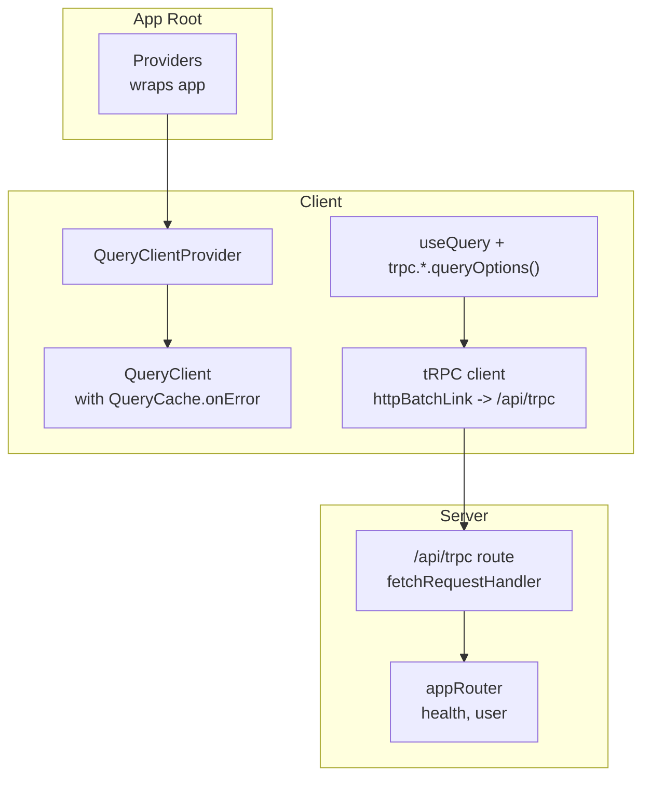
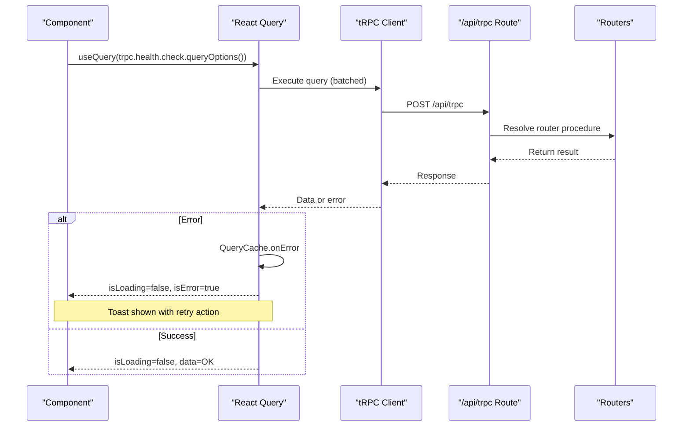
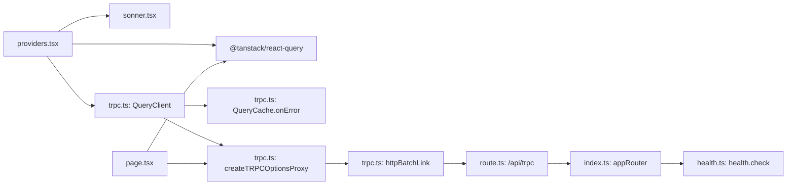

# Server State with React Query

<cite>
**Referenced Files in This Document**
- [providers.tsx](file://apps/web/src/components/providers.tsx)
- [trpc.ts](file://apps/web/src/utils/trpc.ts)
- [page.tsx](file://apps/web/src/app/page.tsx)
- [route.ts](file://apps/web/src/app/api/trpc/[trpc]/route.ts)
- [index.ts](file://packages/api/src/routers/index.ts)
- [health.ts](file://packages/api/src/routers/health.ts)
- [sonner.tsx](file://packages/ui/src/components/sonner.tsx)
</cite>

## Table of Contents

1. Introduction
2. Project Structure
3. Core Components
4. Architecture Overview
5. Detailed Component Analysis
6. Dependency Analysis
7. Performance Considerations
8. Troubleshooting Guide
9. Conclusion

## Introduction

This document explains how server state is managed using TanStack Query (React Query) integrated with tRPC for type-safe data fetching. It covers the QueryClient configuration, query cache setup with error handling and retry actions, provider wiring at the application root, global error notifications via toast, and caching strategies. It also includes examples of query optimization, automatic refetching, optimistic updates, loading states, and performance considerations such as deduplication, background refetching, and memory management.

## Project Structure

The client-side setup centers around:

- A shared QueryClient instance configured with a custom QueryCache that surfaces errors to users via toast notifications and provides a retry action.
- A tRPC client configured with an HTTP batch link pointing to the Next.js API route.
- A root Providers component that wraps the app with QueryClientProvider and a Toaster.
- Example usage of useQuery with tRPC-generated queryOptions to fetch typed data.

**Diagram sources**

- [providers.tsx:11-24](file://apps/web/src/components/providers.tsx#L11-L24)
- [trpc.ts:7-39](file://apps/web/src/utils/trpc.ts#L7-L39)
- [route.ts:6-13](file://apps/web/src/app/api/trpc/[trpc]/route.ts#L6-L13)
- [index.ts:5-10](file://packages/api/src/routers/index.ts#L5-L10)

**Section sources**

- [providers.tsx:11-24](file://apps/web/src/components/providers.tsx#L11-L24)
- [trpc.ts:7-39](file://apps/web/src/utils/trpc.ts#L7-L39)
- [route.ts:6-13](file://apps/web/src/app/api/trpc/[trpc]/route.ts#L6-L13)
- [index.ts:5-10](file://packages/api/src/routers/index.ts#L5-L10)

## Core Components

- QueryClient and QueryCache: Centralized configuration for caching behavior and global error handling. The onError handler displays a toast with a retry action that invalidates the failed query.
- tRPC client: Uses httpBatchLink to batch requests to /api/trpc with credentials included for session support.
- Providers: Wraps the application with QueryClientProvider and a Toaster so all components can consume queries and display notifications.
- Example query: Demonstrates useQuery with tRPC’s generated queryOptions for a health check endpoint.

Key responsibilities:

- Centralize caching and error handling in one place (QueryClient).
- Provide type-safe access to server procedures from the client (tRPC).
- Surface user-facing feedback via toast notifications.
- Keep UI responsive by leveraging built-in loading and error states from useQuery.

**Section sources**

- [trpc.ts:7-39](file://apps/web/src/utils/trpc.ts#L7-L39)
- [providers.tsx:11-24](file://apps/web/src/components/providers.tsx#L11-L24)
- [page.tsx:8-35](file://apps/web/src/app/page.tsx#L8-L35)

## Architecture Overview

The data flow uses React Query to manage server state and tRPC to call typed endpoints. Errors are handled globally through the QueryCache, while success paths benefit from automatic caching and refetching.

**Diagram sources**

- [page.tsx:8-35](file://apps/web/src/app/page.tsx#L8-L35)
- [trpc.ts:7-39](file://apps/web/src/utils/trpc.ts#L7-L39)
- [route.ts:6-13](file://apps/web/src/app/api/trpc/[trpc]/route.ts#L6-L13)
- [health.ts:3-5](file://packages/api/src/routers/health.ts#L3-L5)

## Detailed Component Analysis

### QueryClient and QueryCache Configuration

- A singleton QueryClient is created with a custom QueryCache.
- Global error handling shows a toast with a “retry” action that invalidates the failing query, enabling quick recovery without manual refetch logic.
- The tRPC client is bound to this QueryClient via createTRPCOptionsProxy, ensuring all queries share the same cache and options.

Practical implications:

- All queries automatically benefit from centralized error handling.
- Users can retry failed queries directly from the notification.
- Type safety is preserved across client-server boundaries.

**Section sources**

- [trpc.ts:7-39](file://apps/web/src/utils/trpc.ts#L7-L39)

### Provider Setup at Application Root

- The Providers component wraps the app with QueryClientProvider, injecting the shared QueryClient into the React tree.
- A Toaster is mounted to render toast notifications globally.
- Theme provider is also included; it does not affect query behavior but is part of the root composition.

Best practices:

- Keep QueryClient instantiation outside of component renders to avoid recreating caches on each render.
- Ensure Toaster is present before any query runs to guarantee error notifications are visible.

**Section sources**

- [providers.tsx:11-24](file://apps/web/src/components/providers.tsx#L11-L24)
- [sonner.tsx:15-74](file://packages/ui/src/components/sonner.tsx#L15-L74)

### tRPC Integration and Type Safety

- The tRPC client uses httpBatchLink to send batched requests to /api/trpc.
- Credentials are included to support authenticated sessions.
- The proxy created by createTRPCOptionsProxy binds the tRPC client to the QueryClient, enabling typed queryOptions and seamless integration with React Query hooks.

Benefits:

- End-to-end type safety between server routers and client code.
- Reduced boilerplate for request/response types.
- Efficient network usage via batching.

**Section sources**

- [trpc.ts:22-39](file://apps/web/src/utils/trpc.ts#L22-L39)
- [route.ts:6-13](file://apps/web/src/app/api/trpc/[trpc]/route.ts#L6-L13)
- [index.ts:5-10](file://packages/api/src/routers/index.ts#L5-L10)

### Example Query Usage and Loading States

- A component calls useQuery with trpc.health.check.queryOptions(), demonstrating the standard pattern for fetching typed data.
- The hook returns isLoading, data, and other flags to drive UI states like spinners, connected/disconnected indicators, and error messages.

Patterns demonstrated:

- Declarative data fetching with minimal imperative code.
- Clear separation of concerns: UI only reads from the hook’s returned state.

**Section sources**

- [page.tsx:8-35](file://apps/web/src/app/page.tsx#L8-L35)

### Global Error Handling with Toast Notifications

- When a query fails, QueryCache.onError triggers a toast with a “retry” action.
- Clicking “retry” invalidates the query, causing React Query to refetch it.

User experience:

- Immediate feedback on failures.
- One-click recovery without navigating away or reloading.

**Section sources**

- [trpc.ts:7-20](file://apps/web/src/utils/trpc.ts#L7-L20)
- [sonner.tsx:15-74](file://packages/ui/src/components/sonner.tsx#L15-L74)

### Caching Strategies and Automatic Refetching

- React Query caches results per query key by default, deduplicating concurrent requests and sharing data across components.
- Background refetching can be enabled via staleTime and refetchInterval to keep data fresh without explicit polling.
- For long-lived data, set a higher staleTime to reduce network calls; for frequently changing data, use shorter intervals or enable refetchOnWindowFocus/refetchOnMount.

Optimization tips:

- Use unique query keys to scope cache entries.
- Prefer queryOptions for consistent configuration reuse.
- Combine with optimistic updates for fast UI responses.

[No sources needed since this section provides general guidance]

### Optimistic Updates Pattern

- Before a mutation completes, update the local cache immediately to reflect expected changes.
- On success, no further action is needed; on error, revert to previous state or refetch to reconcile.

Implementation notes:

- Use invalidateQueries or setQueryData to adjust cache entries optimistically.
- Pair with global error handling to notify users when reversion occurs.

[No sources needed since this section provides general guidance]

### Handling Loading States

- Use isLoading to show skeletons or spinners during initial load.
- Distinguish between initial load and background refetches using isFetching vs isLoading where appropriate.
- Combine with Suspense boundaries for progressive rendering if desired.

**Section sources**

- [page.tsx:18-31](file://apps/web/src/app/page.tsx#L18-L31)

## Dependency Analysis

The following diagram maps the runtime dependencies among core files involved in server state management.

**Diagram sources**

- [providers.tsx:11-24](file://apps/web/src/components/providers.tsx#L11-L24)
- [trpc.ts:7-39](file://apps/web/src/utils/trpc.ts#L7-L39)
- [route.ts:6-13](file://apps/web/src/app/api/trpc/[trpc]/route.ts#L6-L13)
- [index.ts:5-10](file://packages/api/src/routers/index.ts#L5-L10)
- [health.ts:3-5](file://packages/api/src/routers/health.ts#L3-L5)
- [page.tsx:8-35](file://apps/web/src/app/page.tsx#L8-L35)
- [sonner.tsx:15-74](file://packages/ui/src/components/sonner.tsx#L15-L74)

**Section sources**

- [providers.tsx:11-24](file://apps/web/src/components/providers.tsx#L11-L24)
- [trpc.ts:7-39](file://apps/web/src/utils/trpc.ts#L7-L39)
- [route.ts:6-13](file://apps/web/src/app/api/trpc/[trpc]/route.ts#L6-L13)
- [index.ts:5-10](file://packages/api/src/routers/index.ts#L5-L10)
- [health.ts:3-5](file://packages/api/src/routers/health.ts#L3-L5)
- [page.tsx:8-35](file://apps/web/src/app/page.tsx#L8-L35)
- [sonner.tsx:15-74](file://packages/ui/src/components/sonner.tsx#L15-L74)

## Performance Considerations

- Query deduplication: React Query automatically deduplicates identical queries within the same cache, preventing redundant network requests.
- Background refetching: Configure staleTime and refetch policies to balance freshness and bandwidth. Use refetchOnWindowFocus and refetchOnMount to keep data current.
- Memory management: Set gcTime to control how long unused cache entries remain in memory. Avoid overly large payloads; paginate or select only needed fields.
- Batching: tRPC’s httpBatchLink reduces overhead by grouping multiple requests into a single HTTP call.
- Network resilience: Include credentials for authenticated flows and rely on global error handling to guide retries.

[No sources needed since this section provides general guidance]

## Troubleshooting Guide

Common issues and resolutions:

- No toast appears on errors: Ensure Toaster is rendered in the component tree and QueryClientProvider is active. Verify that the QueryCache.onError is attached to the same QueryClient used by tRPC.
- Retry action does nothing: Confirm that the retry action calls query.invalidate() to trigger a refetch.
- Stale data persists: Adjust staleTime or enable refetchOnWindowFocus/refetchOnMount. For mutations, invalidate dependent queries after successful updates.
- Excessive network calls: Check for duplicate query keys or missing queryOptions reuse. Leverage batching and consider increasing staleTime for stable data.

**Section sources**

- [trpc.ts:7-20](file://apps/web/src/utils/trpc.ts#L7-L20)
- [providers.tsx:11-24](file://apps/web/src/components/providers.tsx#L11-L24)

## Conclusion

This setup centralizes server state management with React Query and integrates seamlessly with tRPC for type-safe data fetching. The shared QueryClient configures caching and global error handling, while the Providers component ensures the entire app benefits from these capabilities. By leveraging queryOptions, automatic refetching, optimistic updates, and robust error notifications, the application delivers a responsive and resilient user experience. Adhering to the performance guidelines will help maintain efficiency as the app scales.
