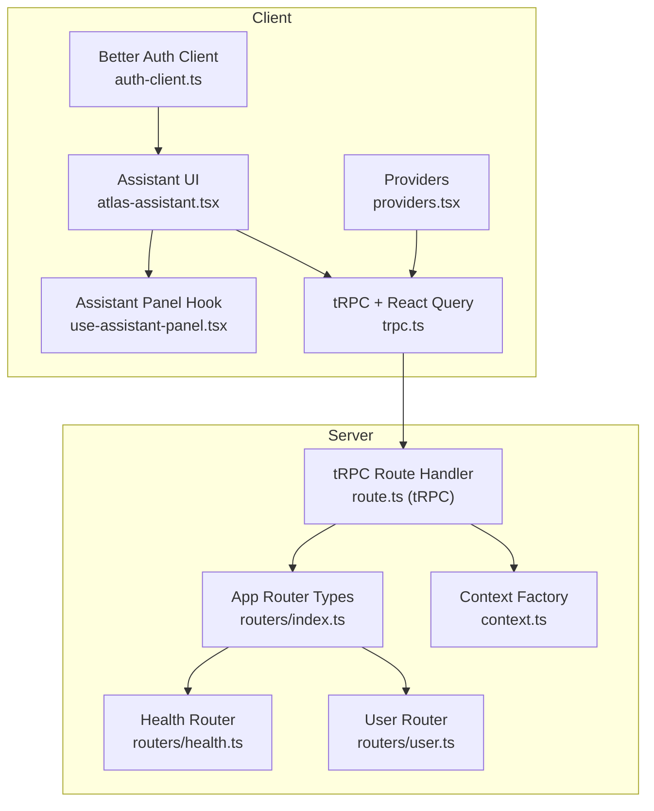
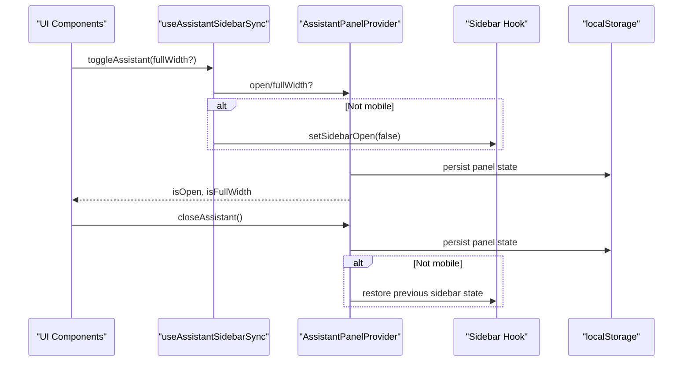
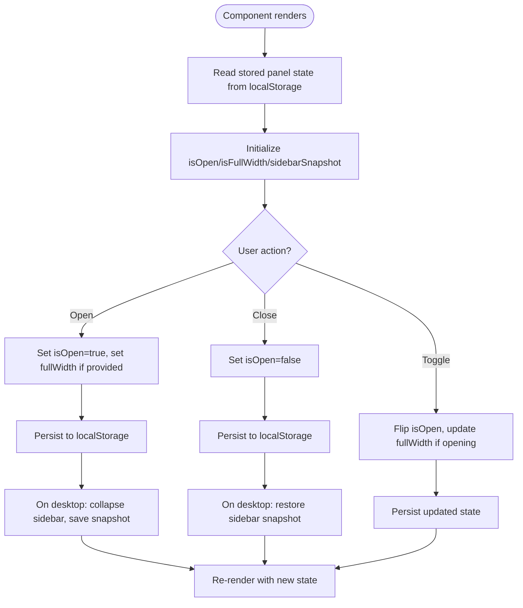
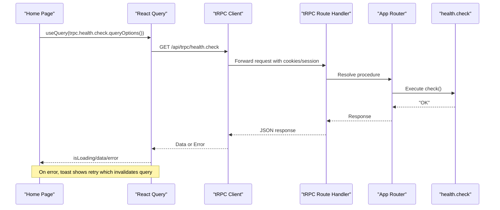
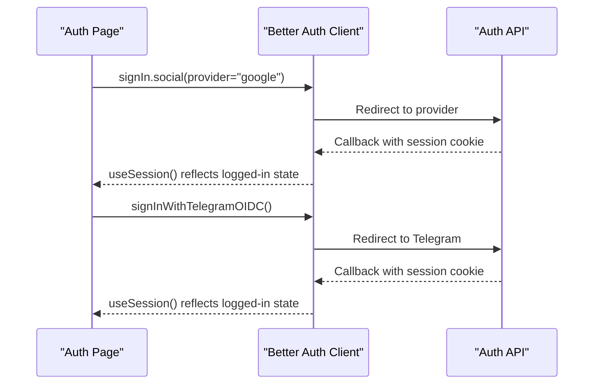
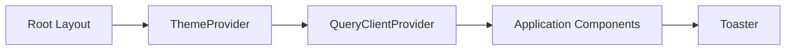
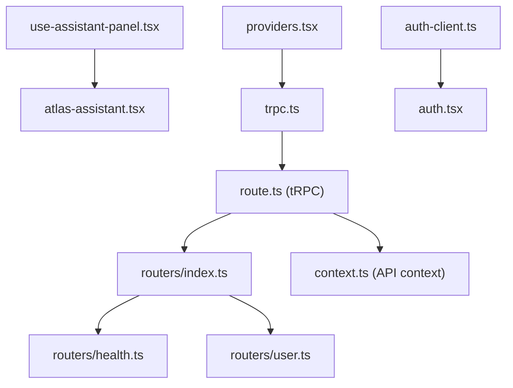

# State Management

<cite>
**Referenced Files in This Document**
- [use-assistant-panel.tsx](file://apps/web/src/hooks/use-assistant-panel.tsx)
- [atlas-assistant.tsx](file://apps/web/src/components/atlas-assistant.tsx)
- [providers.tsx](file://apps/web/src/components/providers.tsx)
- [trpc.ts](file://apps/web/src/utils/trpc.ts)
- [auth-client.ts](file://apps/web/src/lib/auth-client.ts)
- [auth.tsx](file://apps/web/src/components/auth.tsx)
- [route.ts (tRPC)](file://apps/web/src/app/api/trpc/[trpc]/route.ts)
- [index.ts (AppRouter)](file://packages/api/src/routers/index.ts)
- [health.ts (router)](file://packages/api/src/routers/health.ts)
- [user.ts (router)](file://packages/api/src/routers/user.ts)
- [context.ts (API context)](file://packages/api/src/context.ts)
</cite>

## Table of Contents

1. Introduction
2. Project Structure
3. Core Components
4. Architecture Overview
5. Detailed Component Analysis
6. Dependency Analysis
7. Performance Considerations
8. Troubleshooting Guide
9. Conclusion

## Introduction

This document explains the state management approach used in the application with a focus on:

- Client-side UI state for local component concerns (assistant panel)
- Server state synchronization using React Query and tRPC
- Global session management via Better Auth client
- Type-safe API communication and error handling
- Patterns for persistence, optimistic updates, and real-time-like synchronization

The goal is to help developers understand how local state, server cache, and authentication state interact to deliver a responsive and consistent user experience.

## Project Structure

State-related code is organized into clear layers:

- Local UI state: custom hooks and providers under apps/web/src/hooks and apps/web/src/components
- Server state: tRPC client and React Query configuration under apps/web/src/utils and apps/web/src/components
- Authentication: Better Auth client setup and usage under apps/web/src/lib and apps/web/src/components
- Server types and routers: packages/api/src/routers define the type contract consumed by the client

**Diagram sources**

- [use-assistant-panel.tsx:1-235](file://apps/web/src/hooks/use-assistant-panel.tsx#L1-L235)
- [atlas-assistant.tsx:1-175](file://apps/web/src/components/atlas-assistant.tsx#L1-L175)
- [providers.tsx:1-27](file://apps/web/src/components/providers.tsx#L1-L27)
- [trpc.ts:1-40](file://apps/web/src/utils/trpc.ts#L1-L40)
- [auth-client.ts:1-8](file://apps/web/src/lib/auth-client.ts#L1-L8)
- [route.ts (tRPC):1-200](file://apps/web/src/app/api/trpc/[trpc]/route.ts#L1-L200)
- [index.ts (AppRouter):1-11](file://packages/api/src/routers/index.ts#L1-L11)
- [health.ts (router):1-6](file://packages/api/src/routers/health.ts#L1-L6)
- [user.ts (router):1-9](file://packages/api/src/routers/user.ts#L1-L9)
- [context.ts (API context):1-15](file://packages/api/src/context.ts#L1-L15)

**Section sources**

- [use-assistant-panel.tsx:1-235](file://apps/web/src/hooks/use-assistant-panel.tsx#L1-L235)
- [atlas-assistant.tsx:1-175](file://apps/web/src/components/atlas-assistant.tsx#L1-L175)
- [providers.tsx:1-27](file://apps/web/src/components/providers.tsx#L1-L27)
- [trpc.ts:1-40](file://apps/web/src/utils/trpc.ts#L1-L40)
- [auth-client.ts:1-8](file://apps/web/src/lib/auth-client.ts#L1-L8)
- [index.ts (AppRouter):1-11](file://packages/api/src/routers/index.ts#L1-L11)
- [health.ts (router):1-6](file://packages/api/src/routers/health.ts#L1-L6)
- [user.ts (router):1-9](file://packages/api/src/routers/user.ts#L1-L9)
- [context.ts (API context):1-15](file://packages/api/src/context.ts#L1-L15)

## Core Components

- Assistant panel state: Custom hook and provider manage open/close/full-width state, persist it to localStorage, and coordinate with the app sidebar.
- Server state caching: React Query client configured with a global error handler that offers retry actions; tRPC client uses httpBatchLink with credentials included.
- Session management: Better Auth client created with plugins; components consume session state and trigger sign-in flows.
- Providers: Application wraps content with theme provider, React Query provider, and toast container.

Key responsibilities:

- Local UI state: isolated in hooks and providers to avoid prop drilling
- Server state: centralized in tRPC client and React Query configuration
- Auth state: encapsulated in auth client and consumed via hooks

**Section sources**

- [use-assistant-panel.tsx:14-161](file://apps/web/src/hooks/use-assistant-panel.tsx#L14-L161)
- [providers.tsx:11-26](file://apps/web/src/components/providers.tsx#L11-L26)
- [trpc.ts:7-39](file://apps/web/src/utils/trpc.ts#L7-L39)
- [auth-client.ts:1-8](file://apps/web/src/lib/auth-client.ts#L1-L8)

## Architecture Overview

The system separates concerns across three layers:

- UI layer: Renders assistant panel and other features, driven by local state hooks
- Cache layer: React Query manages server data lifecycle, invalidation, and retries
- Transport layer: tRPC provides type-safe calls over HTTP batch links; Better Auth handles sessions

**Diagram sources**

- [use-assistant-panel.tsx:169-235](file://apps/web/src/hooks/use-assistant-panel.tsx#L169-L235)
- [use-assistant-panel.tsx:67-151](file://apps/web/src/hooks/use-assistant-panel.tsx#L67-L151)

**Section sources**

- [use-assistant-panel.tsx:67-235](file://apps/web/src/hooks/use-assistant-panel.tsx#L67-L235)

## Detailed Component Analysis

### Assistant Panel State (Local UI State)

- Context-based state: The provider holds open/full-width flags and exposes methods to open, close, and toggle the panel.
- Persistence: Panel state and sidebar snapshot are persisted to localStorage with versioned keys and safe read/write helpers.
- Sidebar coordination: Opening the assistant collapses the desktop sidebar and restores its prior state when closed; mobile behavior leaves the overlay untouched.
- Keyboard shortcut: A keydown listener toggles the panel via Cmd/Ctrl+I.

**Diagram sources**

- [use-assistant-panel.tsx:34-61](file://apps/web/src/hooks/use-assistant-panel.tsx#L34-L61)
- [use-assistant-panel.tsx:78-125](file://apps/web/src/hooks/use-assistant-panel.tsx#L78-L125)
- [use-assistant-panel.tsx:169-235](file://apps/web/src/hooks/use-assistant-panel.tsx#L169-L235)

**Section sources**

- [use-assistant-panel.tsx:14-161](file://apps/web/src/hooks/use-assistant-panel.tsx#L14-L161)
- [use-assistant-panel.tsx:169-235](file://apps/web/src/hooks/use-assistant-panel.tsx#L169-L235)
- [atlas-assistant.tsx:122-136](file://apps/web/src/components/atlas-assistant.tsx#L122-L136)

### Server State with tRPC and React Query

- Query client: Centralized QueryClient with a global error handler that shows a toast with a retry action to invalidate the query.
- tRPC client: Uses httpBatchLink to /api/trpc with credentials included for authenticated requests.
- Type safety: AppRouter type exported from server routers ensures compile-time checks for queries/mutations.
- Usage example: Home page queries health endpoint and displays connection status based on loading/data/error states.

**Diagram sources**

- [trpc.ts:7-39](file://apps/web/src/utils/trpc.ts#L7-L39)
- [index.ts (AppRouter):1-11](file://packages/api/src/routers/index.ts#L1-L11)
- [health.ts (router):1-6](file://packages/api/src/routers/health.ts#L1-L6)

**Section sources**

- [trpc.ts:1-40](file://apps/web/src/utils/trpc.ts#L1-L40)
- [index.ts (AppRouter):1-11](file://packages/api/src/routers/index.ts#L1-L11)
- [health.ts (router):1-6](file://packages/api/src/routers/health.ts#L1-L6)

### Session Management with Better Auth

- Client creation: Auth client initialized with Telegram plugin and last login method plugin.
- Sign-in flows: Buttons trigger Google and Telegram OIDC sign-ins with callback URLs.
- Session consumption: Components use useSession to detect pending state and display appropriate UI.

**Diagram sources**

- [auth-client.ts:1-8](file://apps/web/src/lib/auth-client.ts#L1-L8)
- [auth.tsx:9-24](file://apps/web/src/components/auth.tsx#L9-L24)

**Section sources**

- [auth-client.ts:1-8](file://apps/web/src/lib/auth-client.ts#L1-L8)
- [auth.tsx:1-69](file://apps/web/src/components/auth.tsx#L1-L69)

### Providers and Global Setup

- Theme provider: Wraps app with theme context.
- React Query provider: Injects QueryClient instance globally for all components.
- Toast container: Provides global notifications for errors and actions.

**Diagram sources**

- [providers.tsx:11-26](file://apps/web/src/components/providers.tsx#L11-L26)

**Section sources**

- [providers.tsx:1-27](file://apps/web/src/components/providers.tsx#L1-L27)

## Dependency Analysis

- Local state depends on React Context and localStorage; it coordinates with the sidebar hook to maintain layout consistency.
- Server state depends on tRPC client and React Query; errors bubble up to a global handler for user feedback.
- Auth state depends on Better Auth client; session changes propagate through React hooks.
- Server routers define the type contract; any change to router shape is reflected at compile time in the client.

**Diagram sources**

- [use-assistant-panel.tsx:1-235](file://apps/web/src/hooks/use-assistant-panel.tsx#L1-L235)
- [atlas-assistant.tsx:1-175](file://apps/web/src/components/atlas-assistant.tsx#L1-L175)
- [providers.tsx:1-27](file://apps/web/src/components/providers.tsx#L1-L27)
- [trpc.ts:1-40](file://apps/web/src/utils/trpc.ts#L1-L40)
- [auth-client.ts:1-8](file://apps/web/src/lib/auth-client.ts#L1-L8)
- [auth.tsx:1-69](file://apps/web/src/components/auth.tsx#L1-L69)
- [index.ts (AppRouter):1-11](file://packages/api/src/routers/index.ts#L1-L11)
- [health.ts (router):1-6](file://packages/api/src/routers/health.ts#L1-L6)
- [user.ts (router):1-9](file://packages/api/src/routers/user.ts#L1-L9)
- [context.ts (API context):1-15](file://packages/api/src/context.ts#L1-L15)

**Section sources**

- [use-assistant-panel.tsx:1-235](file://apps/web/src/hooks/use-assistant-panel.tsx#L1-L235)
- [trpc.ts:1-40](file://apps/web/src/utils/trpc.ts#L1-L40)
- [auth-client.ts:1-8](file://apps/web/src/lib/auth-client.ts#L1-L8)
- [index.ts (AppRouter):1-11](file://packages/api/src/routers/index.ts#L1-L11)

## Performance Considerations

- Local storage reads/writes are wrapped in try-catch to avoid crashes in private browsing or quota-exceeded scenarios.
- Initial state reads from localStorage are deferred to animation frames to minimize blocking during mount.
- React Query’s global error handler centralizes user feedback and enables one-click retry without extra boilerplate.
- Batched tRPC requests reduce network overhead by grouping multiple calls.

[No sources needed since this section provides general guidance]

## Troubleshooting Guide

- Assistant panel not persisting: Ensure localStorage is available; the implementation gracefully falls back to in-memory state when storage throws.
- Sidebar not restoring: Verify sidebar snapshot is saved before opening and restored on close; confirm mobile mode does not attempt to modify sidebar.
- tRPC errors: Check the global error handler in React Query; use the toast “retry” action to re-fetch failed queries.
- Auth redirects: Confirm callback URLs are correct and cookies are enabled; verify session state via useSession.

**Section sources**

- [use-assistant-panel.tsx:34-61](file://apps/web/src/hooks/use-assistant-panel.tsx#L34-L61)
- [use-assistant-panel.tsx:78-125](file://apps/web/src/hooks/use-assistant-panel.tsx#L78-L125)
- [trpc.ts:7-19](file://apps/web/src/utils/trpc.ts#L7-L19)
- [auth.tsx:22-28](file://apps/web/src/components/auth.tsx#L22-L28)

## Conclusion

The application adopts a layered state strategy:

- Local UI state is managed via custom hooks and context, with robust persistence and sidebar coordination.
- Server state is handled by React Query and tRPC, providing type safety, caching, and centralized error handling.
- Sessions are managed with Better Auth, enabling seamless sign-in flows and reactive UI updates.

This separation yields a responsive UI, reliable data synchronization, and maintainable code paths for future enhancements such as optimistic updates and real-time synchronization patterns.

[No sources needed since this section summarizes without analyzing specific files]
