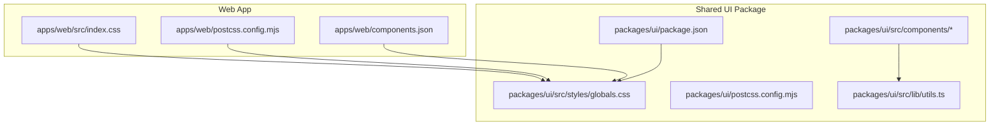
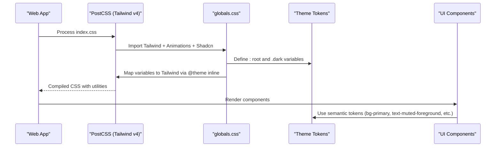
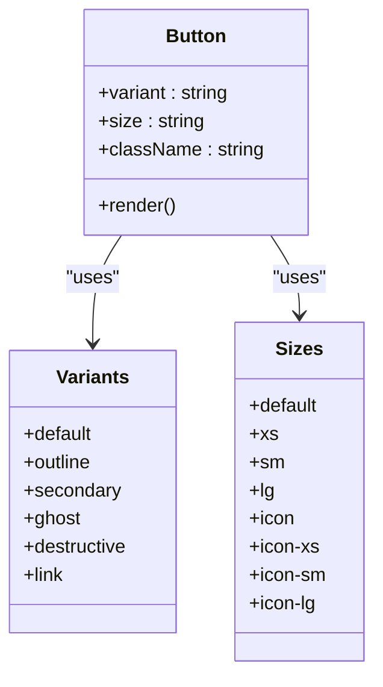
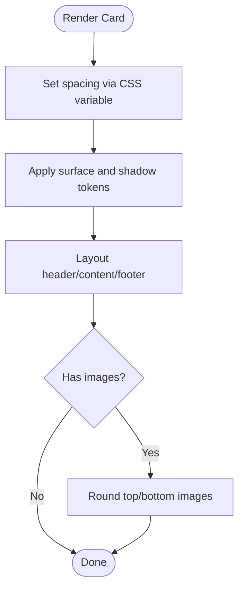
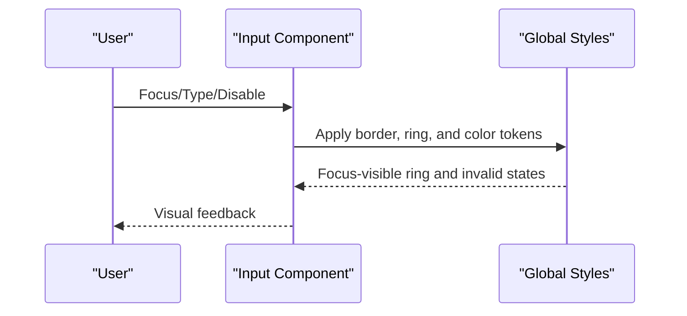
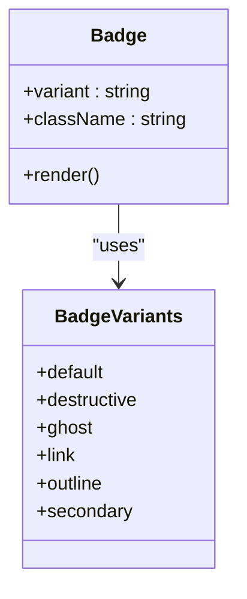
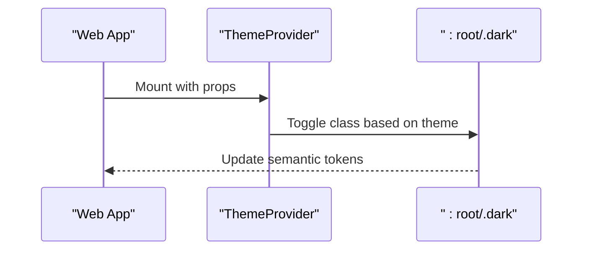
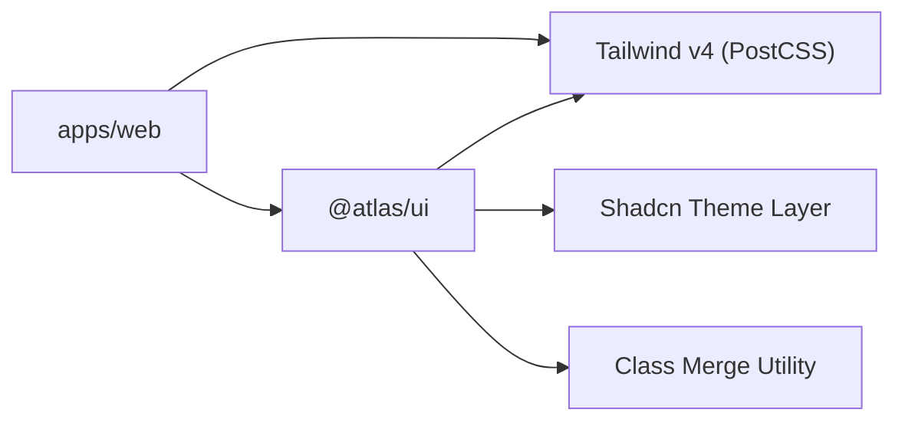

# Styling System

<cite>
**Referenced Files in This Document**
- [globals.css](file://packages/ui/src/styles/globals.css)
- [postcss.config.mjs (web)](file://apps/web/postcss.config.mjs)
- [postcss.config.mjs (ui)](file://packages/ui/postcss.config.mjs)
- [package.json (@atlas/ui)](file://packages/ui/package.json)
- [package.json (web)](file://apps/web/package.json)
- [components.json](file://apps/web/components.json)
- [index.css](file://apps/web/src/index.css)
- [theme-provider.tsx](file://apps/web/src/components/theme-provider.tsx)
- [utils.ts](file://packages/ui/src/lib/utils.ts)
- [button.tsx](file://packages/ui/src/components/button.tsx)
- [card.tsx](file://packages/ui/src/components/card.tsx)
- [input.tsx](file://packages/ui/src/components/input.tsx)
- [badge.tsx](file://packages/ui/src/components/badge.tsx)
</cite>

## Table of Contents

1. Introduction
2. Project Structure
3. Core Components
4. Architecture Overview
5. Detailed Component Analysis
6. Dependency Analysis
7. Performance Considerations
8. Troubleshooting Guide
9. Conclusion
10. Appendices

## Introduction

This document explains the styling system built on Tailwind CSS v4 with a shared UI component library and theme tokens. It covers global styles, theme configuration via CSS variables, responsive design utilities, integration with the shared UI package, custom theme providers, and accessibility considerations. It also provides best practices for utility-first styling, custom component themes, and cross-browser compatibility strategies.

## Project Structure

The styling system is centered around a shared UI package that defines global styles, theme tokens, and reusable components. The web application imports these styles and configures Tailwind v4 through PostCSS. Shadcn-based theming is used to map semantic CSS variables to Tailwind utilities, enabling consistent light/dark modes and accessible focus states.

**Diagram sources**

- [index.css:1-2](file://apps/web/src/index.css#L1-L2)
- [postcss.config.mjs (web):1-6](file://apps/web/postcss.config.mjs#L1-L6)
- [components.json:1-26](file://apps/web/components.json#L1-L26)
- [globals.css:1-140](file://packages/ui/src/styles/globals.css#L1-L140)
- [postcss.config.mjs (ui):1-6](file://packages/ui/postcss.config.mjs#L1-L6)
- [package.json (@atlas/ui):1-48](file://packages/ui/package.json#L1-L48)
- [utils.ts:1-6](file://packages/ui/src/lib/utils.ts#L1-L6)

**Section sources**

- [index.css:1-2](file://apps/web/src/index.css#L1-L2)
- [postcss.config.mjs (web):1-6](file://apps/web/postcss.config.mjs#L1-L6)
- [components.json:1-26](file://apps/web/components.json#L1-L26)
- [globals.css:1-140](file://packages/ui/src/styles/globals.css#L1-L140)
- [postcss.config.mjs (ui):1-6](file://packages/ui/postcss.config.mjs#L1-L6)
- [package.json (@atlas/ui):1-48](file://packages/ui/package.json#L1-L48)
- [utils.ts:1-6](file://packages/ui/src/lib/utils.ts#L1-L6)

## Core Components

- Global styles and theme tokens are defined in the shared UI package’s globals file. It imports Tailwind v4, animations, and Shadcn’s Tailwind layer, then declares CSS variables for light and dark modes and maps them into Tailwind theme tokens using an inline theme block.
- The web app imports the shared globals and uses PostCSS with the Tailwind v4 plugin to process styles.
- Shadcn configuration points to the shared globals as the CSS entry and enables CSS variables for theming.
- Utility composition helper merges class names safely to avoid conflicts and enable conditional styling.
- Reusable components use semantic tokens (e.g., primary, background, border) and state-aware variants for consistent behavior across the app.

Key responsibilities:

- Theme token definitions and mapping to Tailwind utilities
- Dark mode support via a custom variant and CSS classes
- Base resets and typography defaults
- Shared utilities for class merging
- Accessible focus rings and invalid states

**Section sources**

- [globals.css:1-140](file://packages/ui/src/styles/globals.css#L1-L140)
- [postcss.config.mjs (web):1-6](file://apps/web/postcss.config.mjs#L1-L6)
- [components.json:1-26](file://apps/web/components.json#L1-L26)
- [utils.ts:1-6](file://packages/ui/src/lib/utils.ts#L1-L6)

## Architecture Overview

The styling architecture follows a layered approach:

- Application layer: Web app imports shared globals and configures PostCSS for Tailwind v4.
- Shared UI layer: Centralized theme tokens, base styles, and component primitives.
- Theming layer: CSS variables define colors, radii, and spacing; mapped into Tailwind via an inline theme block.
- Component layer: Components compose utilities and tokens, exposing variants and sizes while maintaining accessibility.

**Diagram sources**

- [index.css:1-2](file://apps/web/src/index.css#L1-L2)
- [postcss.config.mjs (web):1-6](file://apps/web/postcss.config.mjs#L1-L6)
- [globals.css:1-140](file://packages/ui/src/styles/globals.css#L1-L140)

## Detailed Component Analysis

### Button Component

- Uses a variant system to define multiple visual styles (default, outline, secondary, ghost, destructive, link) and sizes (default, xs, sm, lg, icon variants).
- Applies semantic tokens for backgrounds, borders, and text colors, ensuring consistency across themes.
- Implements accessible focus rings and invalid states using semantic tokens and state attributes.
- Composes classes via the shared utility helper to merge user-provided classes without conflicts.

**Diagram sources**

- [button.tsx:1-58](file://packages/ui/src/components/button.tsx#L1-L58)

**Section sources**

- [button.tsx:1-58](file://packages/ui/src/components/button.tsx#L1-L58)

### Card Component

- Provides a compound component structure (Card, CardHeader, CardTitle, CardDescription, CardAction, CardContent, CardFooter) with consistent spacing and layout.
- Uses semantic tokens for surfaces, text, and shadows, and supports size variants via CSS variables for spacing.
- Ensures image corners align with card radius and maintains accessible contrast.

**Diagram sources**

- [card.tsx:1-92](file://packages/ui/src/components/card.tsx#L1-L92)

**Section sources**

- [card.tsx:1-92](file://packages/ui/src/components/card.tsx#L1-L92)

### Input Component

- Wraps a primitive input with consistent sizing, borders, and focus rings using semantic tokens.
- Handles placeholder and disabled states with appropriate opacity and cursor changes.
- Integrates invalid state styling via semantic destructive tokens and accessible ring focus.

**Diagram sources**

- [input.tsx:1-20](file://packages/ui/src/components/input.tsx#L1-L20)
- [globals.css:121-139](file://packages/ui/src/styles/globals.css#L121-L139)

**Section sources**

- [input.tsx:1-20](file://packages/ui/src/components/input.tsx#L1-L20)
- [globals.css:121-139](file://packages/ui/src/styles/globals.css#L121-L139)

### Badge Component

- Offers multiple variants (default, destructive, ghost, link, outline, secondary) with consistent typography and spacing.
- Uses semantic tokens for backgrounds and text, and includes hover and focus states for accessibility.
- Supports icons with proper sizing and pointer events handling.

**Diagram sources**

- [badge.tsx:1-52](file://packages/ui/src/components/badge.tsx#L1-L52)

**Section sources**

- [badge.tsx:1-52](file://packages/ui/src/components/badge.tsx#L1-L52)

### Theme Provider

- Wraps the application with a client-side theme provider to toggle between light and dark modes.
- Works with CSS variables and the custom dark variant to switch themes at runtime.

**Diagram sources**

- [theme-provider.tsx:1-12](file://apps/web/src/components/theme-provider.tsx#L1-L12)
- [globals.css:9-76](file://packages/ui/src/styles/globals.css#L9-L76)

**Section sources**

- [theme-provider.tsx:1-12](file://apps/web/src/components/theme-provider.tsx#L1-L12)
- [globals.css:9-76](file://packages/ui/src/styles/globals.css#L9-L76)

## Dependency Analysis

- The web app depends on the shared UI package for styles and components.
- Tailwind v4 is processed via PostCSS in both the web app and the UI package.
- Shadcn theming integrates with CSS variables and maps them to Tailwind utilities.
- Utilities for class merging ensure predictable composition across components.

**Diagram sources**

- [package.json (web):1-47](file://apps/web/package.json#L1-L47)
- [package.json (@atlas/ui):1-48](file://packages/ui/package.json#L1-L48)
- [postcss.config.mjs (web):1-6](file://apps/web/postcss.config.mjs#L1-L6)
- [postcss.config.mjs (ui):1-6](file://packages/ui/postcss.config.mjs#L1-L6)
- [utils.ts:1-6](file://packages/ui/src/lib/utils.ts#L1-L6)

**Section sources**

- [package.json (web):1-47](file://apps/web/package.json#L1-L47)
- [package.json (@atlas/ui):1-48](file://packages/ui/package.json#L1-L48)
- [postcss.config.mjs (web):1-6](file://apps/web/postcss.config.mjs#L1-L6)
- [postcss.config.mjs (ui):1-6](file://packages/ui/postcss.config.mjs#L1-L6)
- [utils.ts:1-6](file://packages/ui/src/lib/utils.ts#L1-L6)

## Performance Considerations

- Use semantic tokens and built-in variants to minimize custom CSS and reduce bundle size.
- Prefer utility-first patterns and avoid deep nesting to keep selectors efficient.
- Leverage the shared class merge utility to prevent duplicate or conflicting classes.
- Keep component styles scoped and rely on tokens for consistent theming across the app.

[No sources needed since this section provides general guidance]

## Troubleshooting Guide

- If dark mode does not apply, ensure the root element has the correct class and that the custom dark variant is active.
- If focus rings are missing, verify that base styles include outline-ring and that components apply focus-visible states.
- If colors appear incorrect, confirm that CSS variables are defined in both light and dark contexts and that the inline theme mapping is present.
- For class conflicts, always pass user classes through the shared utility to merge and deduplicate.

**Section sources**

- [globals.css:7-76](file://packages/ui/src/styles/globals.css#L7-L76)
- [globals.css:121-139](file://packages/ui/src/styles/globals.css#L121-L139)
- [utils.ts:1-6](file://packages/ui/src/lib/utils.ts#L1-L6)

## Conclusion

The styling system combines Tailwind CSS v4 with a robust theme layer based on CSS variables and Shadcn mappings. The shared UI package centralizes global styles, tokens, and components, while the web app consumes these resources through PostCSS and a theme provider. This approach ensures consistent theming, accessibility, and maintainability across the application.

[No sources needed since this section summarizes without analyzing specific files]

## Appendices

### Best Practices

- Use semantic tokens for all colors and surfaces; avoid hard-coded values.
- Prefer component variants over ad-hoc className overrides.
- Always merge user classes via the shared utility to prevent conflicts.
- Maintain accessible focus indicators and invalid states using semantic tokens.

[No sources needed since this section provides general guidance]

### Cross-Browser Compatibility Strategies

- Rely on modern color spaces supported by Tailwind and browsers; test fallbacks where necessary.
- Use standard focus-visible for focus rings to ensure consistent behavior across browsers.
- Avoid vendor-specific hacks; prefer standardized properties and utilities.

[No sources needed since this section provides general guidance]
