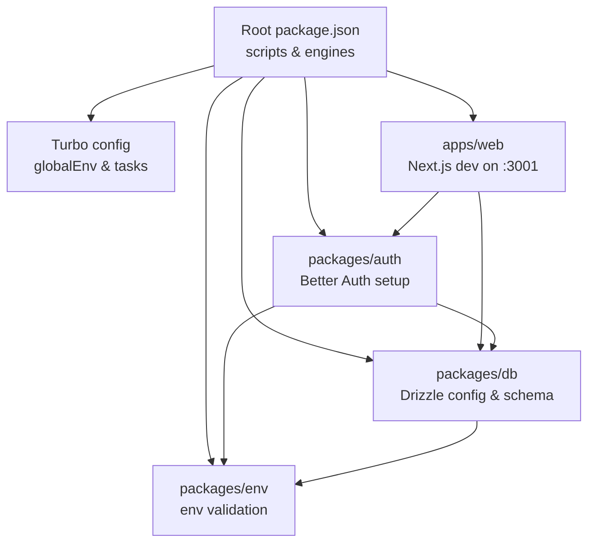
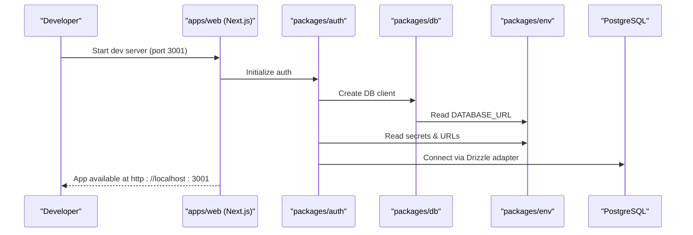
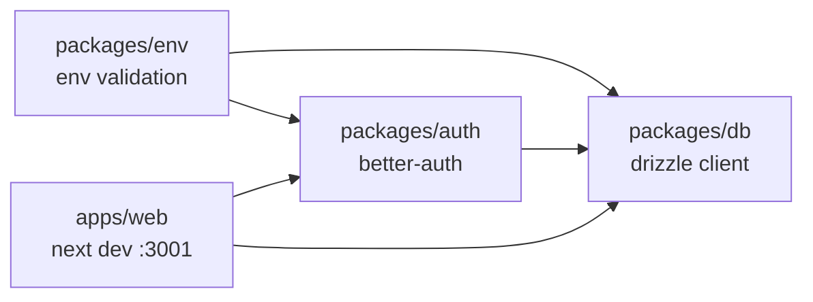

# Getting Started

<cite>
**Referenced Files in This Document**
- [package.json](file://package.json)
- [turbo.json](file://turbo.json)
- [README.md](file://README.md)
- [apps/web/package.json](file://apps/web/package.json)
- [packages/db/drizzle.config.ts](file://packages/db/drizzle.config.ts)
- [packages/db/src/index.ts](file://packages/db/src/index.ts)
- [packages/auth/src/index.ts](file://packages/auth/src/index.ts)
- [packages/env/src/server.ts](file://packages/env/src/server.ts)
</cite>

## Table of Contents

1. [Introduction](#introduction)
2. [Project Structure](#project-structure)
3. [Core Components](#core-components)
4. [Architecture Overview](#architecture-overview)
5. [Detailed Component Analysis](#detailed-component-analysis)
6. [Dependency Analysis](#dependency-analysis)
7. [Performance Considerations](#performance-considerations)
8. [Troubleshooting Guide](#troubleshooting-guide)
9. [Conclusion](#conclusion)

## Introduction

This guide helps you set up and run the Atlas application locally. You will install dependencies, configure environment variables for PostgreSQL and authentication providers, apply database migrations, and start the development server. The web application runs on localhost:3001 by default.

## Project Structure

Atlas is a Turborepo monorepo with:

- apps/web: Next.js web application (development server on port 3001)
- packages/db: Database schema, migrations, and Drizzle configuration
- packages/auth: Better Auth configuration and provider setup
- packages/env: Environment variable validation and loading
- Root scripts orchestrate tasks across apps and packages via Turbo

**Diagram sources**

- [package.json:29-40](file://package.json#L29-L40)
- [turbo.json:4-19](file://turbo.json#L4-L19)
- [apps/web/package.json:5-9](file://apps/web/package.json#L5-L9)
- [packages/db/drizzle.config.ts:1-15](file://packages/db/drizzle.config.ts#L1-L15)
- [packages/auth/src/index.ts:1-42](file://packages/auth/src/index.ts#L1-L42)
- [packages/env/src/server.ts:1-29](file://packages/env/src/server.ts#L1-L29)

**Section sources**

- [package.json:1-66](file://package.json#L1-L66)
- [turbo.json:1-52](file://turbo.json#L1-L52)
- [README.md:19-46](file://README.md#L19-L46)
- [apps/web/package.json:1-47](file://apps/web/package.json#L1-L47)

## Core Components

- Web app: Next.js app configured to run on port 3001 in development.
- Database: PostgreSQL with Drizzle ORM; schema and migrations live under packages/db.
- Authentication: Better Auth with Drizzle adapter, email/password, Google OAuth, and Telegram plugin.
- Environment: Centralized env validation ensures required keys are present at runtime.

Key responsibilities:

- apps/web: UI, routes, API handlers, and client-side integrations.
- packages/db: DB connection creation, schema exports, and migration tooling.
- packages/auth: Auth initialization, provider configuration, and DB adapter wiring.
- packages/env: Strict validation of all required environment variables.

**Section sources**

- [apps/web/package.json:5-9](file://apps/web/package.json#L5-L9)
- [packages/db/src/index.ts:1-12](file://packages/db/src/index.ts#L1-L12)
- [packages/auth/src/index.ts:1-42](file://packages/auth/src/index.ts#L1-L42)
- [packages/env/src/server.ts:1-29](file://packages/env/src/server.ts#L1-L29)

## Architecture Overview

The web app depends on the auth package and database package. Auth uses the database package and reads environment variables from the env package. Drizzle config points to the web app’s .env file for database credentials during migrations.

**Diagram sources**

- [apps/web/package.json:5-9](file://apps/web/package.json#L5-L9)
- [packages/auth/src/index.ts:1-42](file://packages/auth/src/index.ts#L1-L42)
- [packages/db/src/index.ts:1-12](file://packages/db/src/index.ts#L1-L12)
- [packages/env/src/server.ts:1-29](file://packages/env/src/server.ts#L1-L29)

## Detailed Component Analysis

### Prerequisites

- Node.js 24.x or Bun (the project specifies Node 24.x engine and uses Bun as package manager).
- A running PostgreSQL instance accessible via a connection string.
- Optional but recommended: an account on Neon or any PostgreSQL provider that supports a standard connection URL.

Notes:

- The root package declares engines and packageManager, ensuring consistent tooling.
- The README confirms using Bun for installation and development commands.

**Section sources**

- [package.json:61-65](file://package.json#L61-L65)
- [README.md:19-46](file://README.md#L19-L46)

### Install Dependencies

Run the workspace installer to fetch all packages across apps and packages.

Commands:

- bun install

Verification:

- Ensure node_modules exists in the root and sub-packages after install.

**Section sources**

- [README.md:19-46](file://README.md#L19-L46)
- [package.json:29-40](file://package.json#L29-L40)

### Configure Environment Variables

Create a file named .env in apps/web/ and add the following keys. These are validated by the env package and consumed by auth and db packages.

Required keys:

- DATABASE_URL: PostgreSQL connection string
- BETTER_AUTH_SECRET: Minimum 32 characters
- BETTER_AUTH_URL: Base URL for auth (e.g., http://localhost:3001)
- CORS_ORIGIN: Origin allowed for cross-origin requests (e.g., http://localhost:3001)
- GOOGLE_CLIENT_ID and GOOGLE_CLIENT_SECRET: For Google OAuth (optional if not using Google)
- TELEGRAM_BOT_TOKEN and TELEGRAM_BOT_USERNAME: For Telegram login plugin (optional if not using Telegram)
- ATLAS_API_URL, ATLAS_CLIENT_ID, ATLAS_CLIENT_SECRET: For Atlas API integration (if used)
- AI_GATEWAY_API_KEY, COMPOSIO_API_KEY, RUNTIME_URL: For optional AI/runtime features (if used)

Important:

- Drizzle config reads DATABASE_URL from apps/web/.env during migrations.
- Turbo passes globalEnv variables to tasks.

**Section sources**

- [packages/env/src/server.ts:8-26](file://packages/env/src/server.ts#L8-L26)
- [packages/auth/src/index.ts:13-39](file://packages/auth/src/index.ts#L13-L39)
- [packages/db/drizzle.config.ts:4-11](file://packages/db/drizzle.config.ts#L4-L11)
- [turbo.json:4-19](file://turbo.json#L4-L19)

### Set Up PostgreSQL and Apply Schema

You need a PostgreSQL database and a valid DATABASE_URL pointing to it.

Steps:

1. Ensure your PostgreSQL server is running and reachable.
2. Confirm DATABASE_URL in apps/web/.env is correct.
3. Push schema to the database:
   - bun run db:push
4. Alternatively, generate and run migrations:
   - bun run db:generate
   - bun run db:migrate

Notes:

- Drizzle config targets PostgreSQL dialect and reads credentials from apps/web/.env.
- The DB package creates a Neon HTTP client using DATABASE_URL.

**Section sources**

- [README.md:27-44](file://README.md#L27-L44)
- [packages/db/drizzle.config.ts:1-15](file://packages/db/drizzle.config.ts#L1-L15)
- [packages/db/src/index.ts:1-12](file://packages/db/src/index.ts#L1-L12)

### Start Development Servers

Start the full stack or only the web app:

- Start everything:
  - bun run dev
- Start only the web app:
  - bun run dev:web

The web app serves on http://localhost:3001.

**Section sources**

- [apps/web/package.json:5-9](file://apps/web/package.json#L5-L9)
- [README.md:40-46](file://README.md#L40-L46)
- [package.json:29-40](file://package.json#L29-L40)

### Verify Setup

- Open http://localhost:3001 in your browser to confirm the app loads.
- If using Google OAuth, ensure GOOGLE_CLIENT_ID and GOOGLE_CLIENT_SECRET are set and the callback URLs match your local domain.
- If using Telegram login, ensure TELEGRAM_BOT_TOKEN and TELEGRAM_BOT_USERNAME are set.
- Check that DATABASE_URL is valid and the schema was pushed/migrated successfully.

**Section sources**

- [README.md:40-46](file://README.md#L40-L46)
- [packages/auth/src/index.ts:23-39](file://packages/auth/src/index.ts#L23-L39)
- [packages/env/src/server.ts:8-26](file://packages/env/src/server.ts#L8-L26)

## Dependency Analysis

High-level dependency flow between core setup components:

**Diagram sources**

- [packages/env/src/server.ts:1-29](file://packages/env/src/server.ts#L1-L29)
- [packages/auth/src/index.ts:1-42](file://packages/auth/src/index.ts#L1-L42)
- [packages/db/src/index.ts:1-12](file://packages/db/src/index.ts#L1-L12)
- [apps/web/package.json:5-9](file://apps/web/package.json#L5-L9)

**Section sources**

- [packages/env/src/server.ts:1-29](file://packages/env/src/server.ts#L1-L29)
- [packages/auth/src/index.ts:1-42](file://packages/auth/src/index.ts#L1-L42)
- [packages/db/src/index.ts:1-12](file://packages/db/src/index.ts#L1-L12)
- [apps/web/package.json:1-47](file://apps/web/package.json#L1-L47)

## Performance Considerations

- Use a pooled connection string for production workloads when supported by your PostgreSQL provider.
- Keep DATABASE_URL accurate to avoid connection retries and timeouts.
- Avoid unnecessary re-runs of migrations; prefer db:generate + db:migrate in CI/CD pipelines.

[No sources needed since this section provides general guidance]

## Troubleshooting Guide

Common issues and resolutions:

- Missing or invalid DATABASE_URL
  - Symptom: DB connection errors or failed migrations.
  - Fix: Ensure apps/web/.env has a valid PostgreSQL connection string and that the server is reachable.

- Invalid BETTER_AUTH_SECRET or BETTER_AUTH_URL
  - Symptom: Auth initialization fails or cookies do not work.
  - Fix: Provide a secret with at least 32 characters and a valid base URL matching your dev server.

- CORS or trusted origins errors
  - Symptom: Cross-origin requests blocked.
  - Fix: Set CORS_ORIGIN to your frontend origin (e.g., http://localhost:3001).

- Google OAuth not working
  - Symptom: OAuth callbacks fail.
  - Fix: Set GOOGLE_CLIENT_ID and GOOGLE_CLIENT_SECRET; ensure redirect URIs match your local domain.

- Telegram login not working
  - Symptom: Telegram plugin fails to initialize.
  - Fix: Set TELEGRAM_BOT_TOKEN and TELEGRAM_BOT_USERNAME.

- Drizzle commands cannot read .env
  - Symptom: drizzle-kit fails to connect.
  - Fix: Confirm DATABASE_URL is present in apps/web/.env as referenced by Drizzle config.

- Environment validation errors
  - Symptom: Startup fails due to missing env vars.
  - Fix: Add all required keys listed in the environment section above.

**Section sources**

- [packages/env/src/server.ts:8-26](file://packages/env/src/server.ts#L8-L26)
- [packages/auth/src/index.ts:13-39](file://packages/auth/src/index.ts#L13-L39)
- [packages/db/drizzle.config.ts:4-11](file://packages/db/drizzle.config.ts#L4-L11)

## Conclusion

You now have the essentials to set up Atlas locally: install dependencies, configure environment variables for PostgreSQL and authentication, apply the database schema, and start the development server on localhost:3001. Refer to the troubleshooting section if you encounter common setup issues.

[No sources needed since this section summarizes without analyzing specific files]
