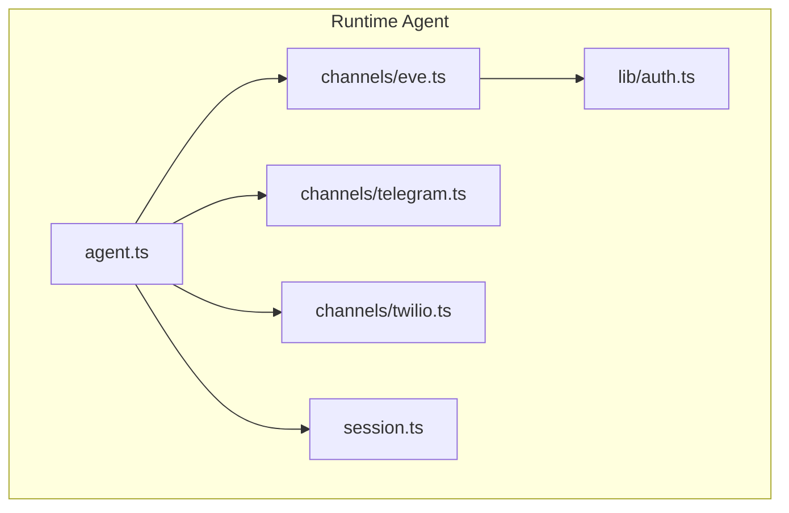
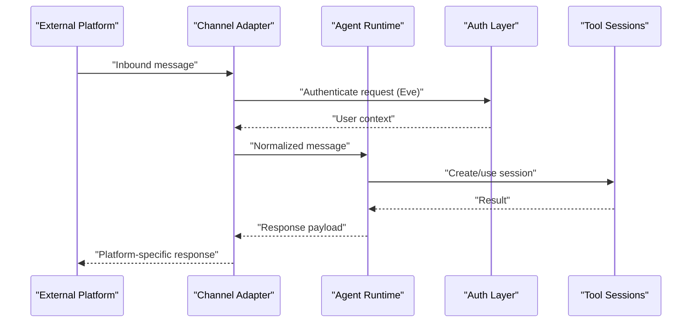
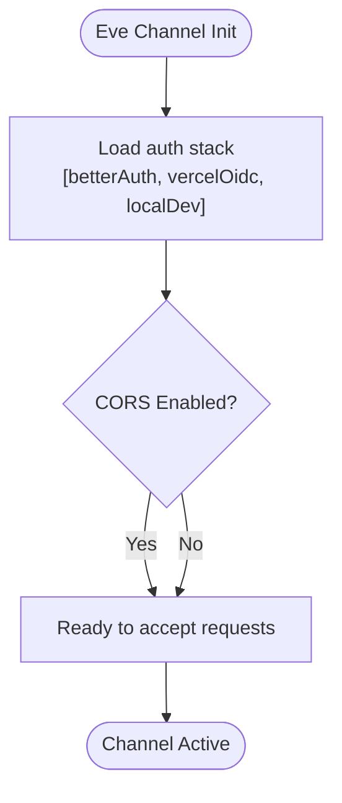
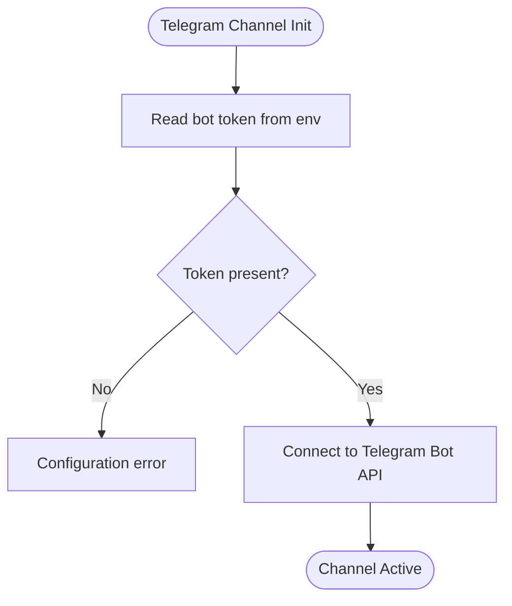
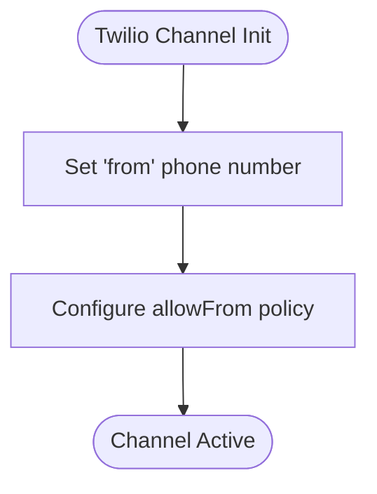
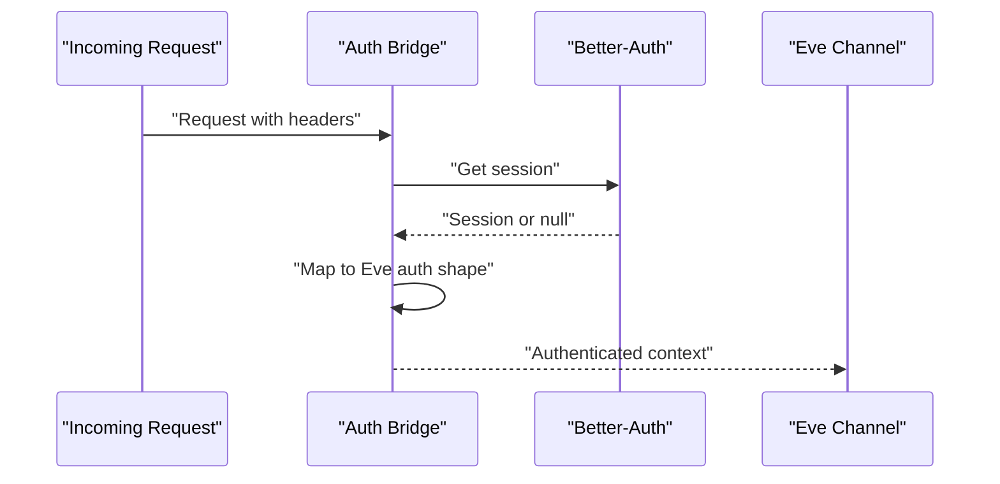
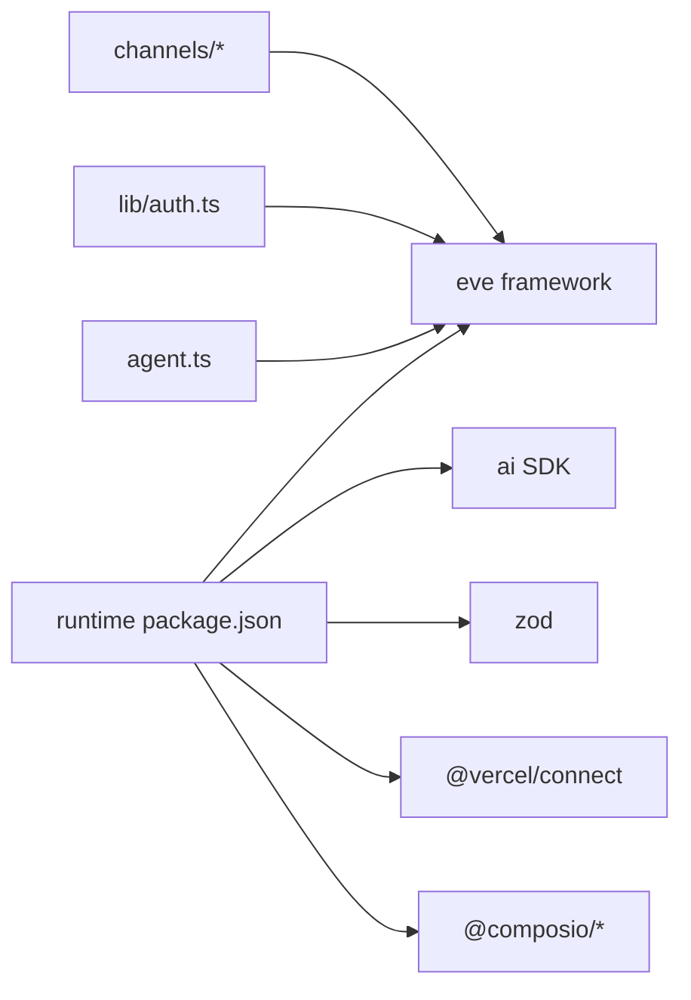

# Channel Architecture

<cite>
**Referenced Files in This Document**
- [eve.ts](file://apps/runtime/agent/channels/eve.ts)
- [telegram.ts](file://apps/runtime/agent/channels/telegram.ts)
- [twilio.ts](file://apps/runtime/agent/channels/twilio.ts)
- [auth.ts](file://apps/runtime/agent/lib/auth.ts)
- [agent.ts](file://apps/runtime/agent/agent.ts)
- [session.ts](file://apps/runtime/agent/session.ts)
- [AGENTS.md](file://apps/runtime/AGENTS.md)
- [package.json](file://apps/runtime/package.json)
- [README.md](file://README.md)
</cite>

## Table of Contents

1. Introduction
2. Project Structure
3. Core Components
4. Architecture Overview
5. Detailed Component Analysis
6. Dependency Analysis
7. Performance Considerations
8. Troubleshooting Guide
9. Conclusion

## Introduction

This document explains the channel architecture pattern used to unify message handling across different communication platforms. The runtime exposes a consistent interface for sending and receiving messages regardless of the underlying platform (Eve, Telegram, Twilio). Channels encapsulate platform-specific details such as credentials, connection management, and protocol nuances behind a common abstraction. The agent is configured once and can receive or send messages through any enabled channel.

The project uses the eve framework to define an agent and channels. Channels are declared per platform and configured via environment variables and channel-specific options. Authentication is integrated with Better-Auth and optional OIDC providers for Eve, while other channels rely on their own credential mechanisms.

**Section sources**

- [README.md:1-107](file://README.md#L1-L107)
- [AGENTS.md:1-35](file://apps/runtime/AGENTS.md#L1-L35)

## Project Structure

The channel-related code resides under apps/runtime/agent. Each channel is defined in its own file and exports a configured instance. The agent definition lives alongside channels and ties everything together.

**Diagram sources**

- [agent.ts:1-8](file://apps/runtime/agent/agent.ts#L1-L8)
- [eve.ts:1-9](file://apps/runtime/agent/channels/eve.ts#L1-L9)
- [telegram.ts:1-6](file://apps/runtime/agent/channels/telegram.ts#L1-L6)
- [twilio.ts:1-7](file://apps/runtime/agent/channels/twilio.ts#L1-L7)
- [auth.ts:1-26](file://apps/runtime/agent/lib/auth.ts#L1-L26)
- [session.ts:1-19](file://apps/runtime/agent/session.ts#L1-L19)

**Section sources**

- [package.json:1-30](file://apps/runtime/package.json#L1-L30)
- [README.md:79-107](file://README.md#L79-L107)

## Core Components

- Channel definitions: One file per platform that configures and exports a channel instance.
- Agent definition: Declares the AI model and serves as the central entry point for message processing.
- Authentication integration: Bridges Better-Auth into Eve’s channel auth pipeline.
- Session management: Creates and manages tool sessions for integrations via Composio.

Key responsibilities:

- Provide a unified interface for inbound/outbound messaging across platforms.
- Isolate platform-specific configuration and credentials.
- Centralize authentication where applicable.
- Enable session-scoped tool access for multi-tool workflows.

**Section sources**

- [eve.ts:1-9](file://apps/runtime/agent/channels/eve.ts#L1-L9)
- [telegram.ts:1-6](file://apps/runtime/agent/channels/telegram.ts#L1-L6)
- [twilio.ts:1-7](file://apps/runtime/agent/channels/twilio.ts#L1-L7)
- [agent.ts:1-8](file://apps/runtime/agent/agent.ts#L1-L8)
- [auth.ts:1-26](file://apps/runtime/agent/lib/auth.ts#L1-L26)
- [session.ts:1-19](file://apps/runtime/agent/session.ts#L1-L19)

## Architecture Overview

At runtime, each channel registers itself with the agent. Incoming messages from any channel are normalized by the framework and routed to the agent. Outgoing messages are sent via the appropriate channel implementation based on context.

**Diagram sources**

- [eve.ts:1-9](file://apps/runtime/agent/channels/eve.ts#L1-L9)
- [auth.ts:1-26](file://apps/runtime/agent/lib/auth.ts#L1-L26)
- [session.ts:1-19](file://apps/runtime/agent/session.ts#L1-L19)
- [agent.ts:1-8](file://apps/runtime/agent/agent.ts#L1-L8)

## Detailed Component Analysis

### Eve Channel

- Purpose: Provides a web-based channel with flexible authentication and CORS support.
- Configuration: Enables multiple auth strategies and toggles CORS.
- Integration: Uses a custom auth function to bridge Better-Auth into Eve’s auth pipeline.

**Diagram sources**

- [eve.ts:1-9](file://apps/runtime/agent/channels/eve.ts#L1-L9)
- [auth.ts:1-26](file://apps/runtime/agent/lib/auth.ts#L1-L26)

**Section sources**

- [eve.ts:1-9](file://apps/runtime/agent/channels/eve.ts#L1-L9)
- [auth.ts:1-26](file://apps/runtime/agent/lib/auth.ts#L1-L26)

### Telegram Channel

- Purpose: Connects the agent to Telegram bots.
- Configuration: Supplies bot token via environment variable using a resolver function.
- Behavior: Handles Telegram-specific message formats and delivery semantics.

**Diagram sources**

- [telegram.ts:1-6](file://apps/runtime/agent/channels/telegram.ts#L1-L6)

**Section sources**

- [telegram.ts:1-6](file://apps/runtime/agent/channels/telegram.ts#L1-L6)

### Twilio Channel

- Purpose: Integrates SMS/MMS via Twilio.
- Configuration: Sets allowed sender patterns and the messaging “from” number from environment.
- Behavior: Normalizes incoming SMS payloads and sends replies through Twilio.

**Diagram sources**

- [twilio.ts:1-7](file://apps/runtime/agent/channels/twilio.ts#L1-L7)

**Section sources**

- [twilio.ts:1-7](file://apps/runtime/agent/channels/twilio.ts#L1-L7)

### Authentication Bridge

- Purpose: Extracts user session from Better-Auth and maps it to Eve’s expected auth shape.
- Inputs: HTTP request headers containing session cookies/tokens.
- Outputs: User attributes, principal identifiers, issuer, and authenticator name.

**Diagram sources**

- [auth.ts:1-26](file://apps/runtime/agent/lib/auth.ts#L1-L26)
- [eve.ts:1-9](file://apps/runtime/agent/channels/eve.ts#L1-L9)

**Section sources**

- [auth.ts:1-26](file://apps/runtime/agent/lib/auth.ts#L1-L26)

### Agent Definition

- Purpose: Declares the AI model used for processing messages.
- Role: Central entry point; channels route messages here for orchestration and tool usage.

**Section sources**

- [agent.ts:1-8](file://apps/runtime/agent/agent.ts#L1-L8)

### Session Management

- Purpose: Creates tool sessions scoped to a user, enabling access to external services (e.g., calendar, email, maps).
- Usage: Invoked when tools require authenticated sessions within the agent workflow.

**Section sources**

- [session.ts:1-19](file://apps/runtime/agent/session.ts#L1-L19)

## Dependency Analysis

Channels depend on the eve framework and may depend on third-party SDKs. The runtime declares dependencies and scripts to build, develop, and start the agent.

**Diagram sources**

- [package.json:1-30](file://apps/runtime/package.json#L1-L30)
- [agent.ts:1-8](file://apps/runtime/agent/agent.ts#L1-L8)
- [eve.ts:1-9](file://apps/runtime/agent/channels/eve.ts#L1-L9)
- [telegram.ts:1-6](file://apps/runtime/agent/channels/telegram.ts#L1-L6)
- [twilio.ts:1-7](file://apps/runtime/agent/channels/twilio.ts#L1-L7)
- [auth.ts:1-26](file://apps/runtime/agent/lib/auth.ts#L1-L26)

**Section sources**

- [package.json:1-30](file://apps/runtime/package.json#L1-L30)

## Performance Considerations

- Rate limiting: Respect platform-specific rate limits (e.g., Telegram Bot API, Twilio SMS quotas). Implement backoff and retry policies at the channel layer to avoid throttling.
- Connection reuse: Maintain persistent connections where supported (e.g., long-polling or WebSocket for Eve) to reduce handshake overhead.
- Message normalization: Normalize payloads early to minimize branching logic downstream and reduce CPU usage.
- Concurrency control: Limit concurrent outbound calls to external APIs to prevent resource exhaustion.
- Caching: Cache static configuration and frequently accessed metadata to reduce latency.

[No sources needed since this section provides general guidance]

## Troubleshooting Guide

Common issues and resolutions:

- Missing credentials: Ensure environment variables are set for each channel (e.g., Telegram bot token, Twilio phone number).
- Authentication failures: Verify Better-Auth session extraction and that headers are forwarded correctly in Eve requests.
- CORS errors: Confirm CORS is enabled for the Eve channel when accessing from browsers.
- Tool sessions: If tools fail due to missing accounts, ensure sessions are created with required toolkits.

Operational tips:

- Use the registry to discover and add new channels non-interactively.
- Validate environment variables before starting the runtime.
- Inspect logs around channel initialization and auth middleware for errors.

**Section sources**

- [AGENTS.md:1-35](file://apps/runtime/AGENTS.md#L1-L35)
- [eve.ts:1-9](file://apps/runtime/agent/channels/eve.ts#L1-L9)
- [telegram.ts:1-6](file://apps/runtime/agent/channels/telegram.ts#L1-L6)
- [twilio.ts:1-7](file://apps/runtime/agent/channels/twilio.ts#L1-L7)
- [auth.ts:1-26](file://apps/runtime/agent/lib/auth.ts#L1-L26)
- [session.ts:1-19](file://apps/runtime/agent/session.ts#L1-L19)

## Conclusion

The channel architecture abstracts platform differences behind a consistent interface, enabling the agent to handle messages uniformly across Eve, Telegram, and Twilio. Channels encapsulate credentials, connection behavior, and platform specifics, while authentication and sessions provide secure, user-scoped access to tools. Following the guidelines above ensures reliable operation, scalability, and ease of extending the system with new channels.

[No sources needed since this section summarizes without analyzing specific files]
