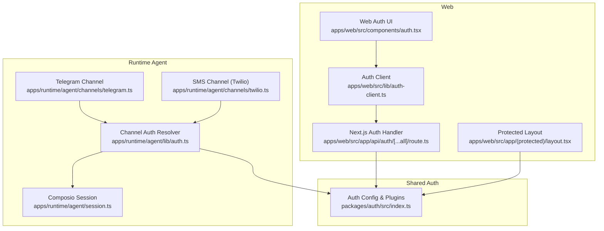
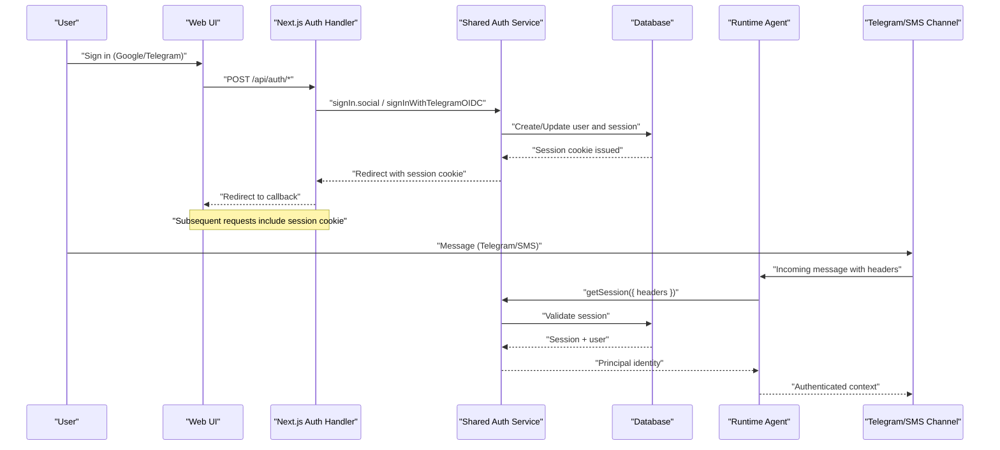
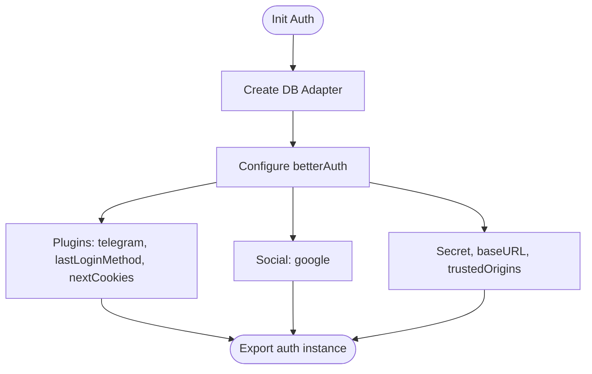
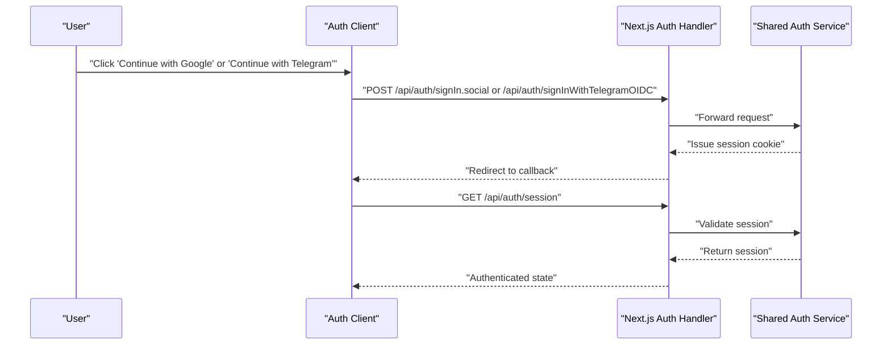
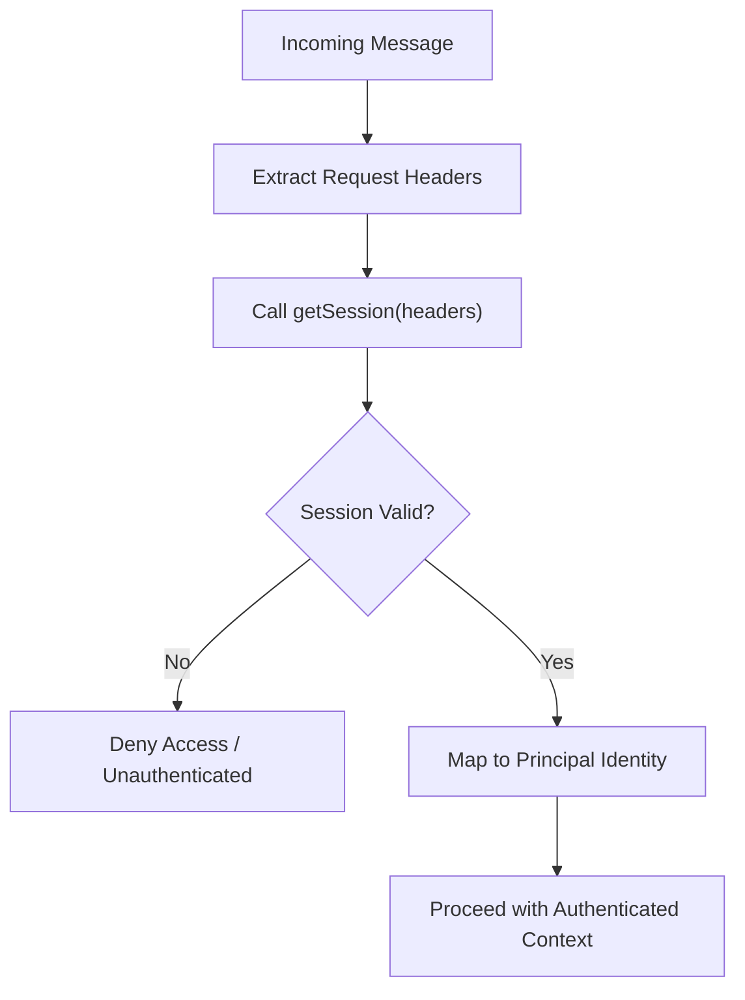
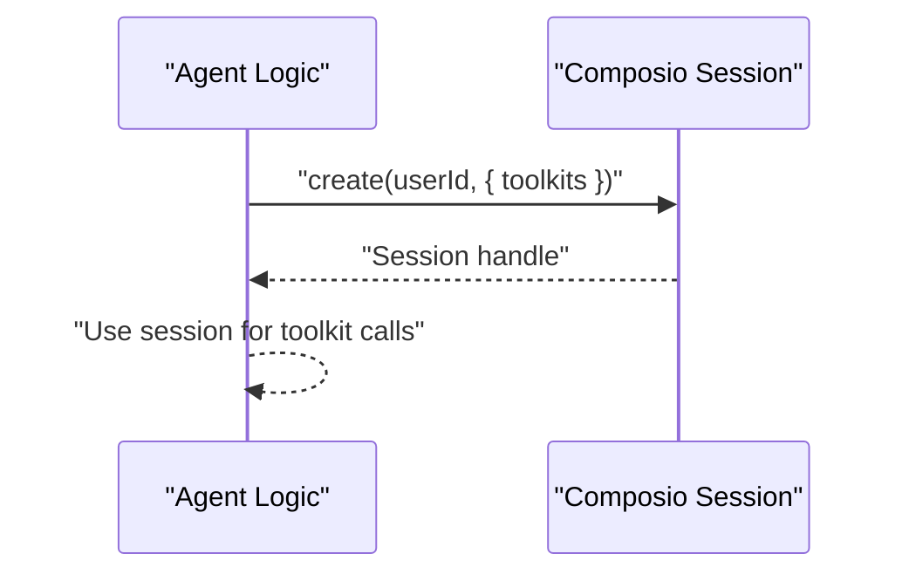
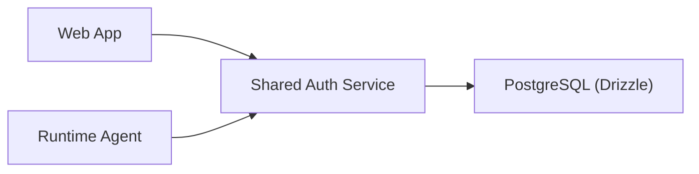

# Cross-Channel Authentication

<cite>
**Referenced Files in This Document**
- [packages/auth/src/index.ts](file://packages/auth/src/index.ts)
- [apps/web/src/app/api/auth/[...all]/route.ts](file://apps/web/src/app/api/auth/[...all]/route.ts)
- [apps/web/src/lib/auth-client.ts](file://apps/web/src/lib/auth-client.ts)
- [apps/web/src/components/auth.tsx](file://apps/web/src/components/auth.tsx)
- [apps/web/src/app/(protected)/layout.tsx](file://apps/web/src/app/(protected)/layout.tsx)
- [apps/runtime/agent/lib/auth.ts](file://apps/runtime/agent/lib/auth.ts)
- [apps/runtime/agent/channels/telegram.ts](file://apps/runtime/agent/channels/telegram.ts)
- [apps/runtime/agent/channels/twilio.ts](file://apps/runtime/agent/channels/twilio.ts)
- [apps/runtime/agent/session.ts](file://apps/runtime/agent/session.ts)
</cite>

## Table of Contents

1. [Introduction](#introduction)
2. [Project Structure](#project-structure)
3. [Core Components](#core-components)
4. [Architecture Overview](#architecture-overview)
5. [Detailed Component Analysis](#detailed-component-analysis)
6. [Dependency Analysis](#dependency-analysis)
7. [Performance Considerations](#performance-considerations)
8. [Troubleshooting Guide](#troubleshooting-guide)
9. [Conclusion](#conclusion)
10. [Appendices](#appendices)

## Introduction

This document explains how user identity is established and maintained consistently across all communication channels: web, Telegram, and SMS (Twilio). It covers session management, token validation, permission checks, channel-specific flows, unified sessions, role-based access control patterns, security best practices, session expiration, and cross-channel synchronization.

The system uses a shared authentication service that issues and validates sessions via cookies and headers. The web app authenticates users through social providers and Telegram OIDC, while the runtime agent resolves sessions from incoming requests to identify users for both Telegram and SMS channels.

## Project Structure

Authentication spans three layers:

- Shared auth configuration and API endpoints
- Web client and protected routes
- Runtime agent channels with unified session resolution

**Diagram sources**

- [packages/auth/src/index.ts:10-40](file://packages/auth/src/index.ts#L10-L40)
- [apps/web/src/app/api/auth/[...all]/route.ts:1-5](file://apps/web/src/app/api/auth/[...all]/route.ts#L1-L5)
- [apps/web/src/lib/auth-client.ts:1-8](file://apps/web/src/lib/auth-client.ts#L1-L8)
- [apps/web/src/components/auth.tsx:9-20](file://apps/web/src/components/auth.tsx#L9-L20)
- [apps/web/src/app/(protected)/layout.tsx:22-33](<file://apps/web/src/app/(protected)/layout.tsx#L22-L33>)
- [apps/runtime/agent/lib/auth.ts:4-25](file://apps/runtime/agent/lib/auth.ts#L4-L25)
- [apps/runtime/agent/channels/telegram.ts:1-6](file://apps/runtime/agent/channels/telegram.ts#L1-L6)
- [apps/runtime/agent/channels/twilio.ts:1-7](file://apps/runtime/agent/channels/twilio.ts#L1-L7)
- [apps/runtime/agent/session.ts:1-19](file://apps/runtime/agent/session.ts#L1-L19)

**Section sources**

- [packages/auth/src/index.ts:10-40](file://packages/auth/src/index.ts#L10-L40)
- [apps/web/src/app/api/auth/[...all]/route.ts:1-5](file://apps/web/src/app/api/auth/[...all]/route.ts#L1-L5)
- [apps/web/src/lib/auth-client.ts:1-8](file://apps/web/src/lib/auth-client.ts#L1-L8)
- [apps/web/src/components/auth.tsx:9-20](file://apps/web/src/components/auth.tsx#L9-L20)
- [apps/web/src/app/(protected)/layout.tsx:22-33](<file://apps/web/src/app/(protected)/layout.tsx#L22-L33>)
- [apps/runtime/agent/lib/auth.ts:4-25](file://apps/runtime/agent/lib/auth.ts#L4-L25)
- [apps/runtime/agent/channels/telegram.ts:1-6](file://apps/runtime/agent/channels/telegram.ts#L1-L6)
- [apps/runtime/agent/channels/twilio.ts:1-7](file://apps/runtime/agent/channels/twilio.ts#L1-L7)
- [apps/runtime/agent/session.ts:1-19](file://apps/runtime/agent/session.ts#L1-L19)

## Core Components

- Shared Auth Service: Centralized configuration for database adapter, plugins (Telegram, last login method, Next.js cookies), social providers, base URL, secret, and trusted origins.
- Web Auth Flow: Client-side SDK with Telegram plugin and last-login-method plugin; server-side handler that proxies to the shared auth service; protected layout that enforces session presence.
- Runtime Channel Auth: A channel-level resolver that extracts the session from request headers using the shared auth service and maps it to a principal identity used by the agent.
- Channel Definitions: Telegram and Twilio channels are configured with minimal credentials; they rely on the shared session resolution to identify users.
- Agent Session: Per-user toolkits session created via an external provider to manage integrations like calendar, email, and messaging.

Key responsibilities:

- Establish identity once (web or Telegram OIDC) and reuse it across channels.
- Validate sessions on every request (web pages and runtime messages).
- Provide consistent user attributes to downstream logic.

**Section sources**

- [packages/auth/src/index.ts:10-40](file://packages/auth/src/index.ts#L10-L40)
- [apps/web/src/lib/auth-client.ts:1-8](file://apps/web/src/lib/auth-client.ts#L1-L8)
- [apps/web/src/components/auth.tsx:9-20](file://apps/web/src/components/auth.tsx#L9-L20)
- [apps/web/src/app/(protected)/layout.tsx:22-33](<file://apps/web/src/app/(protected)/layout.tsx#L22-L33>)
- [apps/runtime/agent/lib/auth.ts:4-25](file://apps/runtime/agent/lib/auth.ts#L4-L25)
- [apps/runtime/agent/channels/telegram.ts:1-6](file://apps/runtime/agent/channels/telegram.ts#L1-L6)
- [apps/runtime/agent/channels/twilio.ts:1-7](file://apps/runtime/agent/channels/twilio.ts#L1-L7)
- [apps/runtime/agent/session.ts:1-19](file://apps/runtime/agent/session.ts#L1-L19)

## Architecture Overview

The architecture ensures a single source of truth for user identity. The web app authenticates via social providers or Telegram OIDC and stores sessions as cookies. Protected routes validate sessions server-side. The runtime agent receives messages from Telegram or SMS and resolves the same session using request headers, enabling unified identity across channels.

**Diagram sources**

- [apps/web/src/components/auth.tsx:9-20](file://apps/web/src/components/auth.tsx#L9-L20)
- [apps/web/src/app/api/auth/[...all]/route.ts:1-5](file://apps/web/src/app/api/auth/[...all]/route.ts#L1-L5)
- [packages/auth/src/index.ts:10-40](file://packages/auth/src/index.ts#L10-L40)
- [apps/runtime/agent/lib/auth.ts:4-25](file://apps/runtime/agent/lib/auth.ts#L4-L25)
- [apps/runtime/agent/channels/telegram.ts:1-6](file://apps/runtime/agent/channels/telegram.ts#L1-L6)
- [apps/runtime/agent/channels/twilio.ts:1-7](file://apps/runtime/agent/channels/twilio.ts#L1-L7)

## Detailed Component Analysis

### Shared Authentication Service

- Purpose: Defines the canonical auth configuration, including database adapter, plugins, social providers, and security settings.
- Key behaviors:
  - Uses Drizzle adapter with PostgreSQL schema for users and sessions.
  - Enables email/password and Telegram integration.
  - Integrates Next.js cookies for browser sessions.
  - Configures Google OAuth and trusted origins.

**Diagram sources**

- [packages/auth/src/index.ts:10-40](file://packages/auth/src/index.ts#L10-L40)

**Section sources**

- [packages/auth/src/index.ts:10-40](file://packages/auth/src/index.ts#L10-L40)

### Web Authentication Flow

- Client SDK: Initializes auth client with Telegram plugin and last-login-method plugin to track the most recent sign-in method.
- Sign-in methods:
  - Google OAuth via social sign-in.
  - Telegram OIDC via dedicated client method.
- Server handler: Proxies all auth routes to the shared auth service.
- Protected routes: Enforce authenticated state by fetching session from request headers and redirecting unauthenticated users.

**Diagram sources**

- [apps/web/src/lib/auth-client.ts:1-8](file://apps/web/src/lib/auth-client.ts#L1-L8)
- [apps/web/src/components/auth.tsx:9-20](file://apps/web/src/components/auth.tsx#L9-L20)
- [apps/web/src/app/api/auth/[...all]/route.ts:1-5](file://apps/web/src/app/api/auth/[...all]/route.ts#L1-L5)

**Section sources**

- [apps/web/src/lib/auth-client.ts:1-8](file://apps/web/src/lib/auth-client.ts#L1-L8)
- [apps/web/src/components/auth.tsx:9-20](file://apps/web/src/components/auth.tsx#L9-L20)
- [apps/web/src/app/api/auth/[...all]/route.ts:1-5](file://apps/web/src/app/api/auth/[...all]/route.ts#L1-L5)
- [apps/web/src/app/(protected)/layout.tsx:22-33](<file://apps/web/src/app/(protected)/layout.tsx#L22-L33>)

### Runtime Channel Authentication

- Channel auth resolver: Extracts session from request headers using the shared auth service and returns a principal identity with attributes (email, name, picture) and metadata (authenticator, issuer, principalId, principalType).
- Channels:
  - Telegram: Uses built-in channel with bot credentials.
  - SMS (Twilio): Uses built-in channel with phone number configuration.
- Both channels rely on the same session resolution, ensuring unified identity.

**Diagram sources**

- [apps/runtime/agent/lib/auth.ts:4-25](file://apps/runtime/agent/lib/auth.ts#L4-L25)
- [apps/runtime/agent/channels/telegram.ts:1-6](file://apps/runtime/agent/channels/telegram.ts#L1-L6)
- [apps/runtime/agent/channels/twilio.ts:1-7](file://apps/runtime/agent/channels/twilio.ts#L1-L7)

**Section sources**

- [apps/runtime/agent/lib/auth.ts:4-25](file://apps/runtime/agent/lib/auth.ts#L4-L25)
- [apps/runtime/agent/channels/telegram.ts:1-6](file://apps/runtime/agent/channels/telegram.ts#L1-L6)
- [apps/runtime/agent/channels/twilio.ts:1-7](file://apps/runtime/agent/channels/twilio.ts#L1-L7)

### Agent Session Management

- Purpose: Creates a per-user session for toolkits and integrations (e.g., calendar, email, messaging).
- Behavior: On demand, creates a session bound to the current user’s ID with a predefined set of toolkits.

**Diagram sources**

- [apps/runtime/agent/session.ts:1-19](file://apps/runtime/agent/session.ts#L1-L19)

**Section sources**

- [apps/runtime/agent/session.ts:1-19](file://apps/runtime/agent/session.ts#L1-L19)

## Dependency Analysis

- Web depends on the shared auth service for both client-side interactions and server-side handlers.
- Runtime channels depend on the shared auth service to resolve sessions from headers.
- Database dependency is abstracted via the shared auth service’s Drizzle adapter.

**Diagram sources**

- [packages/auth/src/index.ts:10-40](file://packages/auth/src/index.ts#L10-L40)
- [apps/web/src/app/api/auth/[...all]/route.ts:1-5](file://apps/web/src/app/api/auth/[...all]/route.ts#L1-L5)
- [apps/runtime/agent/lib/auth.ts:4-25](file://apps/runtime/agent/lib/auth.ts#L4-L25)

**Section sources**

- [packages/auth/src/index.ts:10-40](file://packages/auth/src/index.ts#L10-L40)
- [apps/web/src/app/api/auth/[...all]/route.ts:1-5](file://apps/web/src/app/api/auth/[...all]/route.ts#L1-L5)
- [apps/runtime/agent/lib/auth.ts:4-25](file://apps/runtime/agent/lib/auth.ts#L4-L25)

## Performance Considerations

- Session validation cost: Each request performs a session lookup against the database. Ensure efficient indexing on session keys and consider caching strategies if needed.
- Cookie size: Prefer compact cookie mode to minimize payload size.
- Parallelism: Use parallel session creation for toolkits where appropriate to reduce latency.
- Rate limiting: Apply rate limits at the auth endpoint to mitigate brute-force attempts.

[No sources needed since this section provides general guidance]

## Troubleshooting Guide

Common issues and resolutions:

- Unauthenticated access on protected routes:
  - Verify that the request includes valid session cookies or headers.
  - Confirm that the protected route fetches the session from headers and redirects when missing.
- Channel messages not identifying users:
  - Ensure the channel passes request headers containing the session cookie.
  - Confirm the channel auth resolver successfully retrieves a session and maps it to a principal identity.
- Session not persisting across channels:
  - Check that the base URL and trusted origins are correctly configured.
  - Ensure cookies are enabled and compatible across domains/subdomains.
- Social or Telegram sign-in failures:
  - Validate environment variables for client IDs, secrets, and bot tokens.
  - Inspect redirect URIs and callback URLs.

**Section sources**

- [apps/web/src/app/(protected)/layout.tsx:22-33](<file://apps/web/src/app/(protected)/layout.tsx#L22-L33>)
- [apps/runtime/agent/lib/auth.ts:4-25](file://apps/runtime/agent/lib/auth.ts#L4-L25)
- [packages/auth/src/index.ts:10-40](file://packages/auth/src/index.ts#L10-L40)

## Conclusion

This system establishes a unified identity across web, Telegram, and SMS by centralizing session management in a shared authentication service. The web app handles user sign-in and protects routes server-side, while the runtime agent resolves sessions from request headers to authenticate channel messages. With consistent session validation, clear mapping to principal identities, and robust configuration, the platform supports secure, scalable, cross-channel experiences.

[No sources needed since this section summarizes without analyzing specific files]

## Appendices

### Implementing Role-Based Access Control (RBAC)

- Add role fields to the user model and ensure they are included in the session payload.
- In protected routes and runtime handlers, check the user’s role before allowing access to sensitive resources.
- For channel handlers, derive permissions from the resolved principal identity and enforce them before executing actions.

[No sources needed since this section provides general guidance]

### Security Best Practices

- Enforce HTTPS and secure cookies in production.
- Configure trusted origins to prevent CSRF and origin attacks.
- Rotate secrets regularly and store them securely.
- Enable rate limiting on authentication endpoints.
- Minimize data exposure in session payloads; only include necessary attributes.

[No sources needed since this section provides general guidance]

### Session Expiration and Cross-Channel Synchronization

- Sessions are managed centrally; expiration policies apply uniformly across channels.
- When a session expires, clients must re-authenticate; subsequent channel requests will fail until a new session is established.
- To synchronize sessions across channels, ensure cookies are accessible to both web and runtime services and that headers propagate session cookies into channel requests.

[No sources needed since this section provides general guidance]
