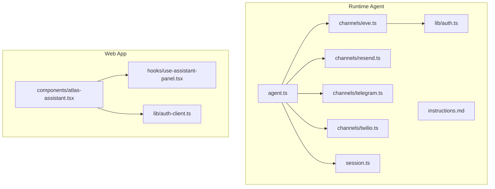
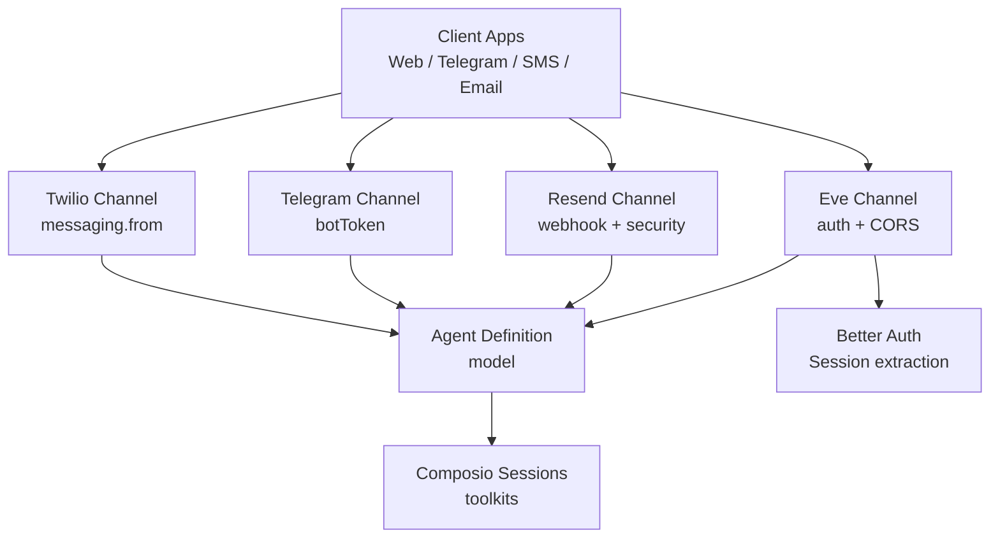
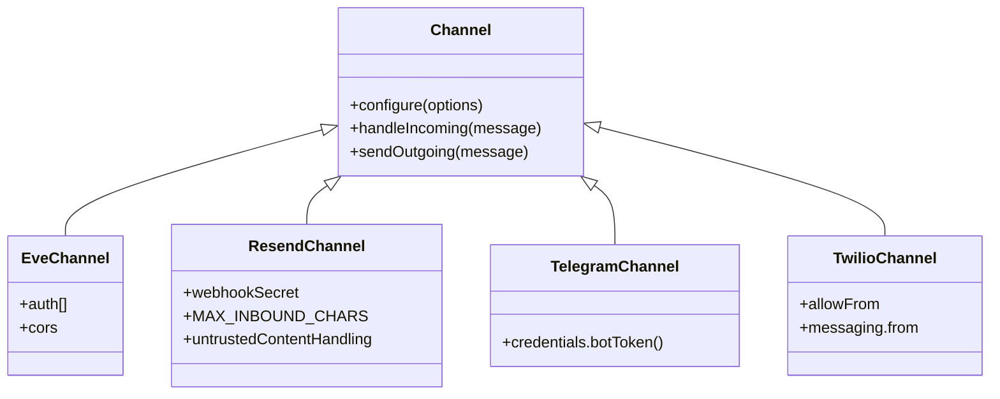
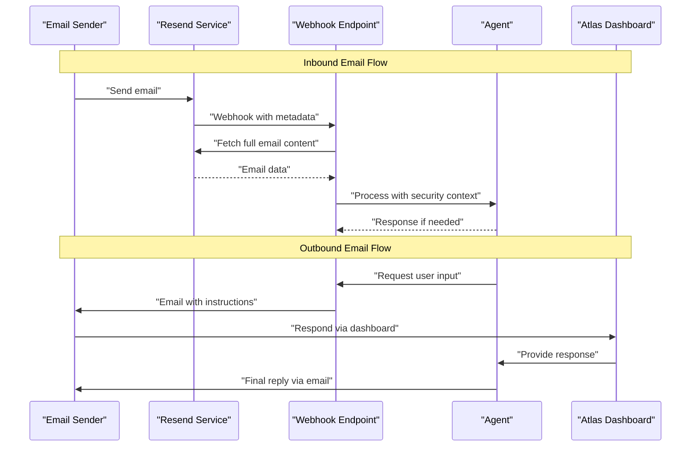
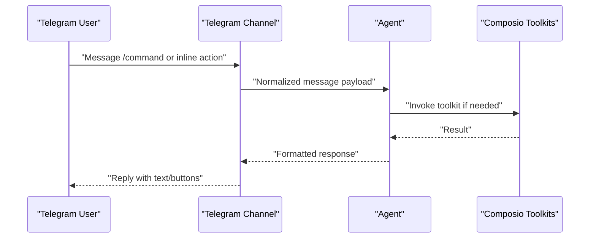
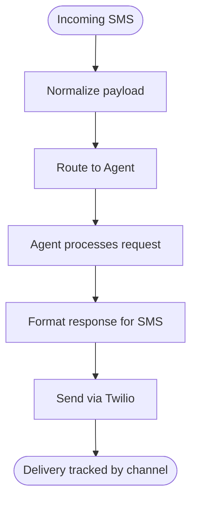
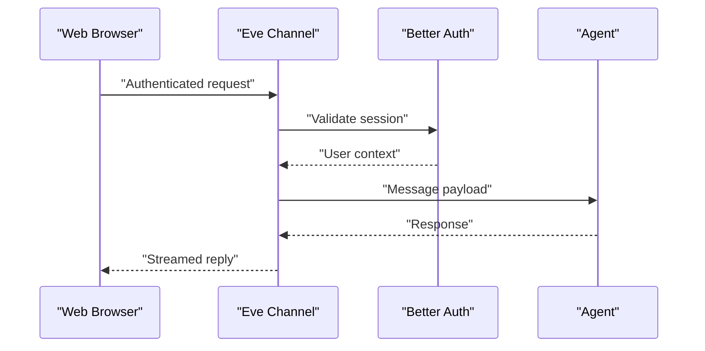
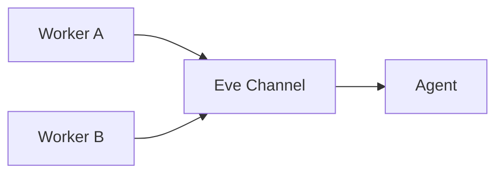
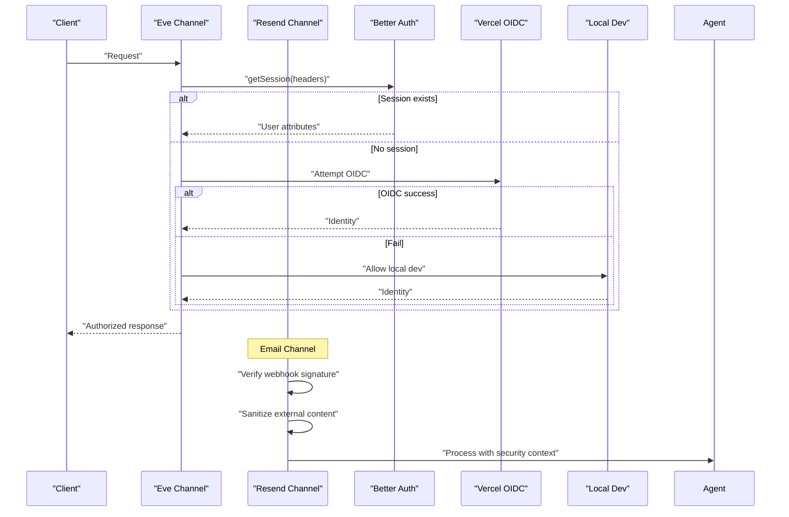
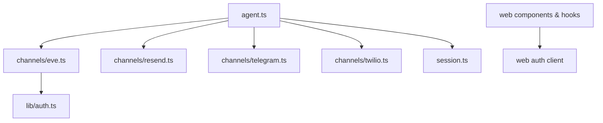

# Multi-Channel Communication

<cite>
**Referenced Files in This Document**
- [eve.ts](file://apps/runtime/agent/channels/eve.ts)
- [resend.ts](file://apps/runtime/agent/channels/resend.ts)
- [telegram.ts](file://apps/runtime/agent/channels/telegram.ts)
- [twilio.ts](file://apps/runtime/agent/channels/twilio.ts)
- [auth.ts](file://apps/runtime/agent/lib/auth.ts)
- [agent.ts](file://apps/runtime/agent/agent.ts)
- [session.ts](file://apps/runtime/agent/session.ts)
- [instructions.md](file://apps/runtime/agent/instructions.md)
- [atlas-assistant.tsx](file://apps/web/src/components/atlas-assistant.tsx)
- [use-assistant-panel.tsx](file://apps/web/src/hooks/use-assistant-panel.tsx)
- [auth-client.ts](file://apps/web/src/lib/auth-client.ts)
</cite>

## Update Summary

**Changes Made**

- Added new Resend email channel integration for bidirectional email communication
- Updated architecture diagrams to include email channel
- Added security measures and webhook handling documentation
- Enhanced authentication section to cover unauthenticated email users
- Updated project structure to reflect the new email channel

## Table of Contents

1. Introduction
2. Project Structure
3. Core Components
4. Architecture Overview
5. Detailed Component Analysis
6. Dependency Analysis
7. Performance Considerations
8. Troubleshooting Guide
9. Conclusion

## Introduction

This document explains the multi-channel communication system that unifies web, Telegram bot, SMS, and email interfaces through a consistent channel abstraction. The runtime agent is built on the eve framework and exposes multiple channels:

- Web channel via Eve's native channel with custom authentication
- Telegram bot channel for interactive messaging
- Twilio SMS channel for text-based interactions
- Resend email channel for bidirectional email communication with unauthenticated users
- Internal Eve channel for inter-process messaging

The design emphasizes a unified message handling model across platforms, secure authentication per channel, and clear separation between transport-specific details and core agent logic.

## Project Structure

At a high level, the project organizes channel implementations under apps/runtime/agent/channels, with shared agent configuration and session management nearby. The web application lives under apps/web and provides an assistant UI that can be wired to the backend channels.

**Diagram sources**

- [agent.ts:1-35](file://apps/runtime/agent/agent.ts#L1-L35)
- [eve.ts:1-10](file://apps/runtime/agent/channels/eve.ts#L1-L10)
- [resend.ts:1-166](file://apps/runtime/agent/channels/resend.ts#L1-L166)
- [telegram.ts:1-6](file://apps/runtime/agent/channels/telegram.ts#L1-L6)
- [twilio.ts:1-7](file://apps/runtime/agent/channels/twilio.ts#L1-L7)
- [auth.ts:1-26](file://apps/runtime/agent/lib/auth.ts#L1-L26)
- [session.ts:1-19](file://apps/runtime/agent/session.ts#L1-L19)
- [instructions.md:1-4](file://apps/runtime/agent/instructions.md#L1-L4)
- [atlas-assistant.tsx:1-175](file://apps/web/src/components/atlas-assistant.tsx#L1-L175)
- [use-assistant-panel.tsx:1-235](file://apps/web/src/hooks/use-assistant-panel.tsx#L1-L235)
- [auth-client.ts:1-7](file://apps/web/src/lib/auth-client.ts#L1-L7)

**Section sources**

- [agent.ts:1-35](file://apps/runtime/agent/agent.ts#L1-L35)
- [eve.ts:1-10](file://apps/runtime/agent/channels/eve.ts#L1-L10)
- [resend.ts:1-166](file://apps/runtime/agent/channels/resend.ts#L1-L166)
- [telegram.ts:1-6](file://apps/runtime/agent/channels/telegram.ts#L1-L6)
- [twilio.ts:1-7](file://apps/runtime/agent/channels/twilio.ts#L1-L7)
- [auth.ts:1-26](file://apps/runtime/agent/lib/auth.ts#L1-L26)
- [session.ts:1-19](file://apps/runtime/agent/session.ts#L1-L19)
- [instructions.md:1-4](file://apps/runtime/agent/instructions.md#L1-L4)
- [atlas-assistant.tsx:1-175](file://apps/web/src/components/atlas-assistant.tsx#L1-L175)
- [use-assistant-panel.tsx:1-235](file://apps/web/src/hooks/use-assistant-panel.tsx#L1-L235)
- [auth-client.ts:1-7](file://apps/web/src/lib/auth-client.ts#L1-L7)

## Core Components

- Channel abstractions:
  - Eve channel: configured with multiple auth strategies and CORS enabled
  - Resend email channel: configured with webhook endpoints and security measures for unauthenticated users
  - Telegram channel: configured with a bot token provider
  - Twilio channel: configured with allowed senders and outbound phone number
- Authentication:
  - Custom Better Auth integration for the Eve channel
  - Unauthenticated email support for Resend channel with security constraints
  - Vercel OIDC and local dev auth helpers from the framework
- Agent definition:
  - Model selection for the AI agent
- Session management:
  - Composio sessions with toolkits for integrations (calendar, email, Slack, etc.)
- Web assistant UI:
  - Panel state management and keyboard shortcuts
  - Placeholder composer awaiting backend wiring

Key responsibilities:

- Channels encapsulate transport-specific setup while exposing a common interface to the agent
- Authentication is pluggable per channel where applicable
- Email channel handles untrusted external content with security measures
- The agent remains decoupled from transport details

**Section sources**

- [eve.ts:1-10](file://apps/runtime/agent/channels/eve.ts#L1-L10)
- [resend.ts:1-166](file://apps/runtime/agent/channels/resend.ts#L1-L166)
- [telegram.ts:1-6](file://apps/runtime/agent/channels/telegram.ts#L1-L6)
- [twilio.ts:1-7](file://apps/runtime/agent/channels/twilio.ts#L1-L7)
- [auth.ts:1-26](file://apps/runtime/agent/lib/auth.ts#L1-L26)
- [agent.ts:1-35](file://apps/runtime/agent/agent.ts#L1-L35)
- [session.ts:1-19](file://apps/runtime/agent/session.ts#L1-L19)
- [atlas-assistant.tsx:1-175](file://apps/web/src/components/atlas-assistant.tsx#L1-L175)
- [use-assistant-panel.tsx:1-235](file://apps/web/src/hooks/use-assistant-panel.tsx#L1-L235)
- [auth-client.ts:1-7](file://apps/web/src/lib/auth-client.ts#L1-L7)

## Architecture Overview

The system uses a channel abstraction pattern provided by the eve framework. Each channel wires up its specific transport and credentials, then delegates message routing and lifecycle to the central agent.

**Diagram sources**

- [eve.ts:1-10](file://apps/runtime/agent/channels/eve.ts#L1-L10)
- [resend.ts:1-166](file://apps/runtime/agent/channels/resend.ts#L1-L166)
- [telegram.ts:1-6](file://apps/runtime/agent/channels/telegram.ts#L1-L6)
- [twilio.ts:1-7](file://apps/runtime/agent/channels/twilio.ts#L1-L7)
- [auth.ts:1-26](file://apps/runtime/agent/lib/auth.ts#L1-L26)
- [agent.ts:1-35](file://apps/runtime/agent/agent.ts#L1-L35)
- [session.ts:1-19](file://apps/runtime/agent/session.ts#L1-L19)

## Detailed Component Analysis

### Channel Abstraction Pattern

- Purpose: Provide a uniform interface for sending and receiving messages across different transports while isolating platform-specific concerns.
- Implementation highlights:
  - Eve channel configures auth stack and CORS
  - Resend channel implements webhook endpoints with signature verification and content sanitization
  - Telegram channel sets credentials via a function returning environment variables
  - Twilio channel sets allowed origins and outbound sender identity
- Benefits:
  - Consistent message handling in the agent
  - Easy addition of new channels without changing core logic
  - Centralized configuration and credential management
  - Security measures for untrusted external input

**Diagram sources**

- [eve.ts:1-10](file://apps/runtime/agent/channels/eve.ts#L1-L10)
- [resend.ts:1-166](file://apps/runtime/agent/channels/resend.ts#L1-L166)
- [telegram.ts:1-6](file://apps/runtime/agent/channels/telegram.ts#L1-L6)
- [twilio.ts:1-7](file://apps/runtime/agent/channels/twilio.ts#L1-L7)

**Section sources**

- [eve.ts:1-10](file://apps/runtime/agent/channels/eve.ts#L1-L10)
- [resend.ts:1-166](file://apps/runtime/agent/channels/resend.ts#L1-L166)
- [telegram.ts:1-6](file://apps/runtime/agent/channels/telegram.ts#L1-L6)
- [twilio.ts:1-7](file://apps/runtime/agent/channels/twilio.ts#L1-L7)

### Resend Email Channel Integration

**Updated** Added comprehensive email channel support for bidirectional communication with unauthenticated users.

- Configuration:
  - Resend API key and from address required for outbound emails
  - Webhook secret for signature verification of incoming emails
  - Content size limits (8000 characters) to prevent context window flooding
- Security Measures:
  - SVIX signature verification for webhook authenticity
  - Untrusted content labeling to prevent prompt injection attacks
  - Per-sender session isolation to prevent cross-contamination
- Bidirectional Communication:
  - Inbound emails processed through webhook endpoint at `/inbound`
  - Outbound emails sent via Resend SDK with idempotency keys
  - Email requests routed back to dashboard for responses
- Event Handling:
  - `input.requested`: Sends approval or response request emails
  - `message.completed`: Delivers completed assistant messages to sender
  - Webhook processing: Validates and processes incoming email metadata

**Diagram sources**

- [resend.ts:55-166](file://apps/runtime/agent/channels/resend.ts#L55-L166)

**Section sources**

- [resend.ts:1-166](file://apps/runtime/agent/channels/resend.ts#L1-L166)

### Telegram Bot Implementation

- Configuration:
  - Bot token is provided via a function reading environment variables
- Expected capabilities (based on typical channel behavior):
  - Command parsing and routing
  - Inline keyboards and callback handling
  - Conversation flows maintained per user or chat
- Integration notes:
  - Messages are normalized into a common format before reaching the agent
  - Responses are formatted according to Telegram's constraints

[No diagram sources since this sequence illustrates conceptual flow; actual command handlers are not present in the repository]

**Section sources**

- [telegram.ts:1-6](file://apps/runtime/agent/channels/telegram.ts#L1-L6)
- [session.ts:1-19](file://apps/runtime/agent/session.ts#L1-L19)

### Twilio SMS Integration

- Configuration:
  - Outbound sender phone number set from environment
  - Allowed senders configured (currently open)
- Expected capabilities:
  - Text-based conversations
  - Message formatting compatible with SMS constraints
  - Delivery status tracking handled by the underlying channel implementation
- Notes:
  - Incoming messages are normalized and routed to the agent
  - Outgoing messages are sent via Twilio with the configured sender

[No diagram sources since this flow describes conceptual processing; concrete handlers are not present in the repository]

**Section sources**

- [twilio.ts:1-7](file://apps/runtime/agent/channels/twilio.ts#L1-L7)

### Web Channel and Real-Time Communication

- Configuration:
  - Eve channel with multiple auth strategies and CORS enabled
- Web UI:
  - Assistant panel with keyboard shortcut toggle and persistent state
  - Placeholder composer awaiting backend integration
- Authentication:
  - Better Auth session extraction for authenticated requests
  - Vercel OIDC and local dev helpers available
- Real-time considerations:
  - Use SSE/WebSocket patterns supported by the framework to stream responses
  - Maintain conversation context per session

**Diagram sources**

- [eve.ts:1-10](file://apps/runtime/agent/channels/eve.ts#L1-L10)
- [auth.ts:1-26](file://apps/runtime/agent/lib/auth.ts#L1-L26)
- [atlas-assistant.tsx:1-175](file://apps/web/src/components/atlas-assistant.tsx#L1-L175)
- [use-assistant-panel.tsx:1-235](file://apps/web/src/hooks/use-assistant-panel.tsx#L1-L235)

**Section sources**

- [eve.ts:1-10](file://apps/runtime/agent/channels/eve.ts#L1-L10)
- [auth.ts:1-26](file://apps/runtime/agent/lib/auth.ts#L1-L26)
- [atlas-assistant.tsx:1-175](file://apps/web/src/components/atlas-assistant.tsx#L1-L175)
- [use-assistant-panel.tsx:1-235](file://apps/web/src/hooks/use-assistant-panel.tsx#L1-L235)
- [auth-client.ts:1-7](file://apps/web/src/lib/auth-client.ts#L1-L7)

### Internal Eve Channel for Inter-Process Messaging

- Purpose: Enable internal service-to-service communication within the runtime
- Configuration:
  - Auth stack includes custom Better Auth, Vercel OIDC, and local dev modes
  - CORS enabled for cross-origin internal calls
- Usage:
  - Other services or workers can call the Eve channel endpoints securely
  - Useful for orchestrating tasks, invoking tools, or sharing state

**Diagram sources**

- [eve.ts:1-10](file://apps/runtime/agent/channels/eve.ts#L1-L10)

**Section sources**

- [eve.ts:1-10](file://apps/runtime/agent/channels/eve.ts#L1-L10)

### Authentication Mechanisms

**Updated** Enhanced to include unauthenticated email user support with security constraints.

- Eve channel:
  - Better Auth integration extracts session attributes and principal info
  - Vercel OIDC and local dev auth helpers provide flexible environments
- Resend email channel:
  - Unauthenticated users supported with security constraints
  - Per-sender session isolation prevents cross-contamination
  - External content treated as untrusted data with size limits
- Web client:
  - Better Auth client with Telegram plugin for login method tracking
- Per-channel notes:
  - Telegram and Twilio rely on channel-level configuration; additional auth may be enforced at the platform level
  - Email channel uses webhook signatures for inbound authenticity

**Diagram sources**

- [auth.ts:1-26](file://apps/runtime/agent/lib/auth.ts#L1-L26)
- [eve.ts:1-10](file://apps/runtime/agent/channels/eve.ts#L1-L10)
- [resend.ts:100-166](file://apps/runtime/agent/channels/resend.ts#L100-L166)

**Section sources**

- [auth.ts:1-26](file://apps/runtime/agent/lib/auth.ts#L1-L26)
- [eve.ts:1-10](file://apps/runtime/agent/channels/eve.ts#L1-L10)
- [resend.ts:1-166](file://apps/runtime/agent/channels/resend.ts#L1-L166)
- [auth-client.ts:1-7](file://apps/web/src/lib/auth-client.ts#L1-L7)

### Rate Limiting Strategies

- Current state:
  - No explicit rate limiting code found in the repository
- Recommendations:
  - Apply per-channel limits using framework middleware or gateway policies
  - Enforce quotas per user or IP for Telegram, Twilio, and email
  - Use Redis-backed counters for distributed rate limiting
  - Expose metrics for throttling decisions
  - Implement email-specific limits to prevent abuse

### Error Handling Patterns

- Current state:
  - No explicit error handling code found in the repository except for Resend channel
- Resend channel error handling:
  - Webhook signature validation with proper HTTP status codes
  - Email lookup failures return appropriate error responses
  - Missing configuration returns actionable error messages
- Recommendations:
  - Wrap channel handlers with try/catch and return structured errors
  - Log failures with correlation IDs for tracing
  - Implement retries with backoff for external APIs (e.g., Twilio, Resend)
  - Surface user-friendly messages for transient failures

### Examples

#### Sending Messages Through Different Channels

- Web:
  - Authenticate via Better Auth and send messages to the Eve channel
  - Stream responses to the UI for real-time experience
- Telegram:
  - Configure bot token and handle incoming commands/messages
  - Respond with text or inline keyboards based on context
- Twilio:
  - Set outbound sender and normalize incoming SMS payloads
  - Format responses to fit SMS constraints
- Resend Email:
  - Configure API key and from address for outbound emails
  - Handle webhook signatures for inbound email processing
  - Sanitize external content to prevent prompt injection

#### Handling Incoming Messages

- Normalize payloads to a common schema
- Route to the agent with channel metadata (user, chat, source)
- Maintain conversation context per user or session
- Apply security measures for untrusted external content (email)

#### Maintaining Conversation State Across Platforms

- Use session identifiers to correlate messages
- Persist conversation history in a store accessible by the agent
- Ensure privacy and security when syncing state across channels
- Isolate email sessions by sender address to prevent cross-contamination

## Dependency Analysis

The runtime agent depends on the eve framework and integrates with external services through channels. The web app depends on UI components and authentication clients.

**Diagram sources**

- [agent.ts:1-35](file://apps/runtime/agent/agent.ts#L1-L35)
- [eve.ts:1-10](file://apps/runtime/agent/channels/eve.ts#L1-L10)
- [resend.ts:1-166](file://apps/runtime/agent/channels/resend.ts#L1-L166)
- [telegram.ts:1-6](file://apps/runtime/agent/channels/telegram.ts#L1-L6)
- [twilio.ts:1-7](file://apps/runtime/agent/channels/twilio.ts#L1-L7)
- [auth.ts:1-26](file://apps/runtime/agent/lib/auth.ts#L1-L26)
- [session.ts:1-19](file://apps/runtime/agent/session.ts#L1-L19)
- [atlas-assistant.tsx:1-175](file://apps/web/src/components/atlas-assistant.tsx#L1-L175)
- [use-assistant-panel.tsx:1-235](file://apps/web/src/hooks/use-assistant-panel.tsx#L1-L235)
- [auth-client.ts:1-7](file://apps/web/src/lib/auth-client.ts#L1-L7)

**Section sources**

- [agent.ts:1-35](file://apps/runtime/agent/agent.ts#L1-L35)
- [eve.ts:1-10](file://apps/runtime/agent/channels/eve.ts#L1-L10)
- [resend.ts:1-166](file://apps/runtime/agent/channels/resend.ts#L1-L166)
- [telegram.ts:1-6](file://apps/runtime/agent/channels/telegram.ts#L1-L6)
- [twilio.ts:1-7](file://apps/runtime/agent/channels/twilio.ts#L1-L7)
- [auth.ts:1-26](file://apps/runtime/agent/lib/auth.ts#L1-L26)
- [session.ts:1-19](file://apps/runtime/agent/session.ts#L1-L19)
- [atlas-assistant.tsx:1-175](file://apps/web/src/components/atlas-assistant.tsx#L1-L175)
- [use-assistant-panel.tsx:1-235](file://apps/web/src/hooks/use-assistant-panel.tsx#L1-L235)
- [auth-client.ts:1-7](file://apps/web/src/lib/auth-client.ts#L1-L7)

## Performance Considerations

- Channel throughput:
  - Use async handlers to avoid blocking
  - Batch outgoing messages where possible
  - Implement webhook processing efficiency for email channel
- Concurrency:
  - Leverage framework concurrency features for parallel tool invocations
  - Handle concurrent email webhooks safely with idempotency keys
- Caching:
  - Cache frequent lookups (e.g., user preferences) to reduce latency
  - Cache Resend client instances to avoid repeated initialization
- Scaling:
  - Horizontal scaling behind a load balancer
  - Stateless channels facilitate easy replication
  - Email webhook endpoints should be designed for high availability
- Monitoring:
  - Instrument key metrics: request rates, error rates, latency percentiles
  - Track delivery statuses for SMS, Telegram, and email callbacks
  - Monitor webhook signature validation failures

## Troubleshooting Guide

- Authentication issues:
  - Verify session headers and OIDC configuration
  - Check local dev mode settings for development workflows
  - Validate Resend webhook secret configuration
- Channel connectivity:
  - Ensure environment variables are set for bot tokens, phone numbers, and email API keys
  - Validate CORS settings for web channel
  - Test Resend webhook endpoint accessibility
- Message delivery:
  - Inspect logs for failed sends or timeouts
  - Confirm recipient addresses and permissions
  - Verify Resend domain verification for email sending
- Email-specific issues:
  - Check webhook signature validation errors
  - Monitor email content size limits (8000 characters)
  - Validate sender email format and domain

## Conclusion

The multi-channel communication system leverages a channel abstraction to unify web, Telegram, SMS, and email interactions through a single agent. Authentication is pluggable per channel, with the Resend email channel providing secure bidirectional communication for unauthenticated users. The architecture supports adding new channels with minimal changes while maintaining robust security measures for external content handling. While explicit command handlers and detailed error/rate-limiting logic are not present in the repository, the structure provides a solid foundation for implementing robust, scalable, and observable multi-platform messaging with comprehensive email support.
