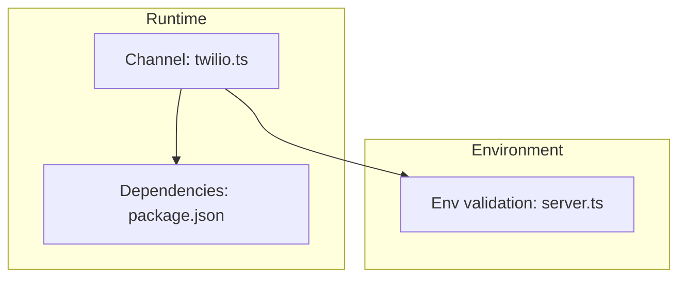
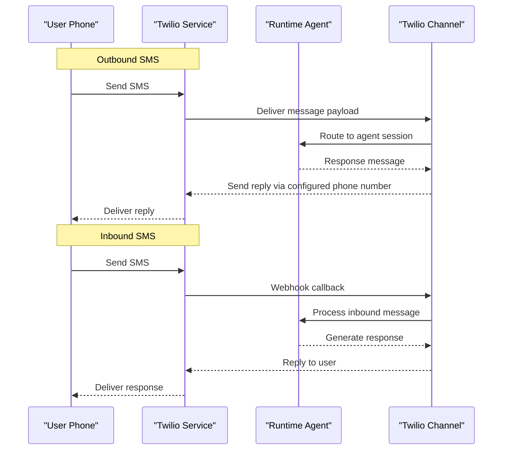
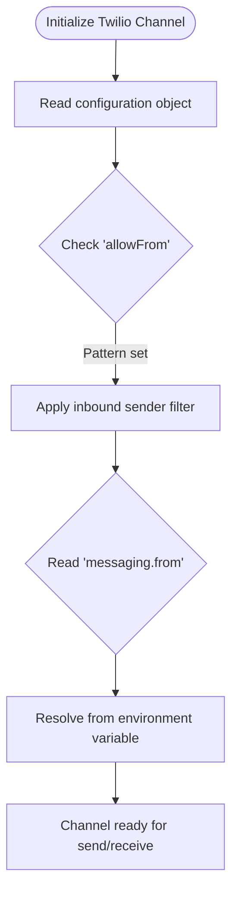
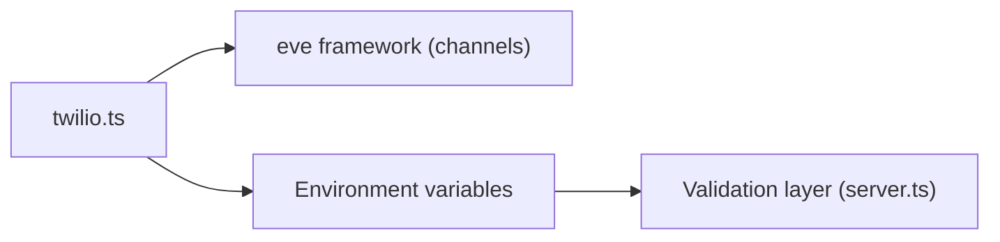

# SMS Integration (Twilio)

<cite>
**Referenced Files in This Document**
- [twilio.ts](file://apps/runtime/agent/channels/twilio.ts)
- [package.json](file://apps/runtime/package.json)
- [server.ts](file://packages/env/src/server.ts)
- [README.md](file://README.md)
</cite>

## Table of Contents

1. [Introduction](#introduction)
2. [Project Structure](#project-structure)
3. [Core Components](#core-components)
4. [Architecture Overview](#architecture-overview)
5. [Detailed Component Analysis](#detailed-component-analysis)
6. [Dependency Analysis](#dependency-analysis)
7. [Performance Considerations](#performance-considerations)
8. [Troubleshooting Guide](#troubleshooting-guide)
9. [Conclusion](#conclusion)
10. [Appendices](#appendices)

## Introduction

This document explains how the project integrates SMS via Twilio using the runtime’s channel abstraction. It covers account and phone number setup, webhook configuration for incoming messages, message formatting and limits, international messaging considerations, delivery status handling, retries, conversation context over SMS, cost optimization, compliance requirements, and monitoring delivery metrics. The implementation leverages a Twilio channel provided by the runtime framework to send and receive text messages through a configured phone number.

## Project Structure

The SMS integration is implemented within the runtime application as a channel that wires Twilio into the agent runtime. Key locations:

- Channel definition for Twilio under the runtime agent channels directory.
- Runtime dependencies include the framework that provides the Twilio channel.
- Environment variables are validated centrally and used by services at runtime.

**Diagram sources**

- [twilio.ts:1-6](file://apps/runtime/agent/channels/twilio.ts#L1-L6)
- [package.json:15-23](file://apps/runtime/package.json#L15-L23)
- [server.ts:5-27](file://packages/env/src/server.ts#L5-L27)

**Section sources**

- [twilio.ts:1-6](file://apps/runtime/agent/channels/twilio.ts#L1-L6)
- [package.json:15-23](file://apps/runtime/package.json#L15-L23)
- [server.ts:5-27](file://packages/env/src/server.ts#L5-L27)
- [README.md:79-94](file://README.md#L79-L94)

## Core Components

- Twilio Channel: A small module that configures the Twilio channel with allowed sender origins and the outbound phone number sourced from environment variables.
- Environment Configuration: Centralized environment validation ensures required variables are present and typed at runtime.

Key responsibilities:

- Configure the messaging sender identity (phone number).
- Restrict or allow inbound senders via an allowlist pattern.
- Provide a consistent interface for sending and receiving SMS through the runtime.

**Section sources**

- [twilio.ts:1-6](file://apps/runtime/agent/channels/twilio.ts#L1-L6)
- [server.ts:5-27](file://packages/env/src/server.ts#L5-L27)

## Architecture Overview

At runtime, the Twilio channel acts as the bridge between Twilio’s messaging API and the agent system. Outbound messages are sent from the agent through the channel using the configured phone number. Inbound messages trigger webhooks to the runtime, which then route them into the agent workflow.

[No sources needed since this diagram shows conceptual workflow, not actual code structure]

## Detailed Component Analysis

### Twilio Channel Configuration

The channel module configures:

- Allowed inbound senders via a permissive pattern.
- Outbound sender phone number from environment.

This minimal configuration centralizes channel behavior and keeps secrets out of source code.

**Diagram sources**

- [twilio.ts:3-6](file://apps/runtime/agent/channels/twilio.ts#L3-L6)

**Section sources**

- [twilio.ts:1-6](file://apps/runtime/agent/channels/twilio.ts#L1-L6)

### Environment Variables and Validation

Environment variables are validated at startup to ensure required keys exist and conform to expected types. While the Twilio-specific key is referenced in the channel, it must be provided in the runtime environment for successful operation.

Best practices:

- Store sensitive values (e.g., phone number) in secure environment management.
- Validate all required variables before starting the service.
- Use distinct values per environment (development, staging, production).

**Section sources**

- [server.ts:5-27](file://packages/env/src/server.ts#L5-L27)
- [twilio.ts:5](file://apps/runtime/agent/channels/twilio.ts#L5)

### Sending SMS Messages

To send an SMS:

- Ensure the runtime has a valid phone number configured.
- Use the channel’s send method (provided by the framework) with recipient number and message content.
- Handle responses and errors returned by the channel.

Operational notes:

- Keep messages concise to avoid concatenation fees.
- For long messages, consider splitting or using MMS where appropriate.
- Log message IDs for traceability and support.

[No sources needed since this section provides general guidance]

### Processing Incoming Texts

When Twilio receives an inbound message, it calls your webhook endpoint. The runtime’s channel will receive the payload and forward it to the agent for processing.

Implementation checklist:

- Expose a webhook endpoint compatible with Twilio’s request format.
- Parse the incoming message body, sender, and metadata.
- Route to the appropriate agent session based on sender or conversation context.
- Return a proper HTTP response to acknowledge receipt.

[No sources needed since this section provides general guidance]

### Managing Conversation Context Over SMS

Maintain state per sender to enable multi-turn conversations:

- Associate each inbound message with a session identifier (e.g., phone number).
- Persist conversation history and context in a store accessible by the agent.
- On each inbound message, load the session context, process the message, update context, and persist changes.
- Implement timeouts to expire inactive sessions and free resources.

[No sources needed since this section provides general guidance]

### Delivery Status Updates, Failures, and Retries

Track delivery lifecycle:

- Subscribe to Twilio’s delivery status callbacks to record final states (delivered, failed, etc.).
- On failure, implement retry logic with exponential backoff and maximum attempts.
- Distinguish transient failures (network issues) from permanent ones (invalid numbers).
- Surface actionable errors to users when appropriate.

Monitoring:

- Emit metrics for success/failure rates and latency.
- Alert on sustained failure spikes.

[No sources needed since this section provides general guidance]

### Message Formatting, Character Limits, and International Messaging

Formatting:

- Prefer plain text for broad compatibility.
- Avoid special characters that may cause encoding issues; use Unicode carefully.
- For rich media, use MMS if supported by destination carriers.

Limits:

- Standard SMS segments are up to 160 characters (UCS-2). Longer messages are segmented and billed per segment.
- Concatenated messages incur additional costs and can affect deliverability.

International:

- Include country codes for recipients.
- Be aware of carrier restrictions and character set limitations in certain regions.
- Test thoroughly across target countries.

[No sources needed since this section provides general guidance]

### Cost Optimization

- Minimize message length to reduce segmentation.
- Batch notifications where possible.
- Use templates and shortcodes sparingly due to potential extra charges.
- Monitor usage and set budget alerts in Twilio.

[No sources needed since this section provides general guidance]

### Compliance Requirements

- Obtain explicit consent for marketing or frequent messaging.
- Provide opt-out mechanisms and honor STOP requests.
- Comply with local regulations (e.g., TCPA, GDPR) regarding consent and data retention.
- Securely handle personal data and limit retention to necessary periods.

[No sources needed since this section provides general guidance]

### Monitoring SMS Delivery Metrics

- Track key metrics: send volume, delivery rate, failure rate, average latency.
- Instrument logs with message IDs and timestamps.
- Integrate with observability tools to visualize trends and alert on anomalies.
- Review Twilio console reports for carrier-level insights.

[No sources needed since this section provides general guidance]

## Dependency Analysis

The runtime depends on the framework package that exposes the Twilio channel. Environment validation ensures required variables are available at runtime.

**Diagram sources**

- [twilio.ts:1-6](file://apps/runtime/agent/channels/twilio.ts#L1-L6)
- [package.json:15-23](file://apps/runtime/package.json#L15-L23)
- [server.ts:5-27](file://packages/env/src/server.ts#L5-L27)

**Section sources**

- [twilio.ts:1-6](file://apps/runtime/agent/channels/twilio.ts#L1-L6)
- [package.json:15-23](file://apps/runtime/package.json#L15-L23)
- [server.ts:5-27](file://packages/env/src/server.ts#L5-L27)

## Performance Considerations

- Keep message payloads small to reduce processing time.
- Avoid synchronous blocking operations during webhook handling; queue work asynchronously when possible.
- Cache frequently accessed data (e.g., templates) to minimize overhead.
- Scale horizontally if message volume increases significantly.

[No sources needed since this section provides general guidance]

## Troubleshooting Guide

Common issues and resolutions:

- Missing phone number: Ensure the environment variable is set and the value matches a Twilio-owned number.
- Inbound not received: Verify webhook URL is publicly reachable and correctly configured in Twilio.
- Delivery failures: Check recipient number formatting and carrier restrictions; review delivery status callbacks.
- High error rates: Inspect logs for malformed payloads or invalid inputs; validate environment and permissions.

Operational checks:

- Confirm runtime starts without environment validation errors.
- Validate that the channel is initialized with correct settings.
- Review Twilio dashboard for error codes and diagnostics.

**Section sources**

- [server.ts:5-27](file://packages/env/src/server.ts#L5-L27)
- [twilio.ts:3-6](file://apps/runtime/agent/channels/twilio.ts#L3-L6)

## Conclusion

The SMS integration uses a compact Twilio channel configuration to send and receive messages through a configured phone number. By centralizing configuration, validating environment variables, and implementing robust handling for inbound messages, delivery statuses, and conversation context, the system supports reliable, compliant, and cost-effective SMS communications. Monitoring and troubleshooting practices ensure operational visibility and quick resolution of issues.

## Appendices

### Quick Setup Checklist

- Set the phone number environment variable in your runtime environment.
- Ensure the runtime dependency includes the framework providing the Twilio channel.
- Configure Twilio webhook to point to your runtime endpoint for inbound messages.
- Test outbound and inbound flows with a real phone number.

**Section sources**

- [twilio.ts:3-6](file://apps/runtime/agent/channels/twilio.ts#L3-L6)
- [package.json:15-23](file://apps/runtime/package.json#L15-L23)
- [server.ts:5-27](file://packages/env/src/server.ts#L5-L27)
- [README.md:79-94](file://README.md#L79-L94)
