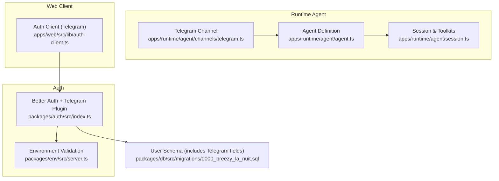
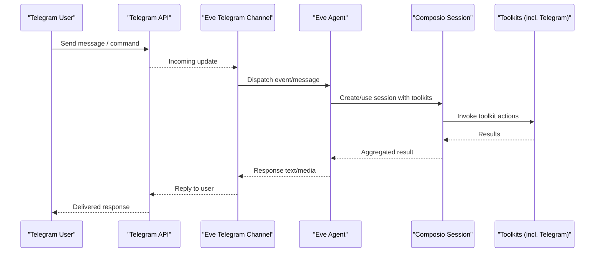
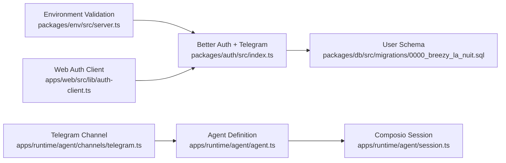

# Telegram Bot Integration

<cite>
**Referenced Files in This Document**
- [telegram.ts](file://apps/runtime/agent/channels/telegram.ts)
- [agent.ts](file://apps/runtime/agent/agent.ts)
- [session.ts](file://apps/runtime/agent/session.ts)
- [index.ts](file://packages/auth/src/index.ts)
- [server.ts](file://packages/env/src/server.ts)
- [package.json](file://apps/runtime/package.json)
- [auth-client.ts](file://apps/web/src/lib/auth-client.ts)
- [0000_breezy_la_nuit.sql](file://packages/db/src/migrations/0000_breezy_la_nuit.sql)
- [SKILL.md](file://.agents/skills/eve/SKILL.md)
</cite>

## Table of Contents

1. [Introduction](#introduction)
2. [Project Structure](#project-structure)
3. [Core Components](#core-components)
4. [Architecture Overview](#architecture-overview)
5. [Detailed Component Analysis](#detailed-component-analysis)
6. [Dependency Analysis](#dependency-analysis)
7. [Performance Considerations](#performance-considerations)
8. [Troubleshooting Guide](#troubleshooting-guide)
9. [Conclusion](#conclusion)

## Introduction

This document explains how the Telegram bot is integrated into the runtime agent using the Eve framework, how credentials are configured, and how sessions and tools are set up for interacting with external services. It also outlines where to find the official Eve documentation for advanced features such as command parsing, conversation flows, inline keyboards, rate limiting, error handling, and debugging.

## Project Structure

The Telegram integration lives primarily in the runtime application under the agent channels directory. The channel configuration wires the Telegram bot token from environment variables and delegates message handling to the Eve framework. Authentication and user identity can be linked via Better Auth’s Telegram plugin, while session toolkits are managed through Composio.

**Diagram sources**

- [telegram.ts:1-5](file://apps/runtime/agent/channels/telegram.ts#L1-L5)
- [agent.ts:1-8](file://apps/runtime/agent/agent.ts#L1-L8)
- [session.ts:1-19](file://apps/runtime/agent/session.ts#L1-L19)
- [index.ts:1-42](file://packages/auth/src/index.ts#L1-L42)
- [server.ts:1-28](file://packages/env/src/server.ts#L1-L28)
- [auth-client.ts:1-7](file://apps/web/src/lib/auth-client.ts#L1-L7)
- [0000_breezy_la_nuit.sql:29-41](file://packages/db/src/migrations/0000_breezy_la_nuit.sql#L29-L41)

**Section sources**

- [telegram.ts:1-5](file://apps/runtime/agent/channels/telegram.ts#L1-L5)
- [agent.ts:1-8](file://apps/runtime/agent/agent.ts#L1-L8)
- [session.ts:1-19](file://apps/runtime/agent/session.ts#L1-L19)
- [index.ts:1-42](file://packages/auth/src/index.ts#L1-L42)
- [server.ts:1-28](file://packages/env/src/server.ts#L1-L28)
- [auth-client.ts:1-7](file://apps/web/src/lib/auth-client.ts#L1-L7)
- [0000_breezy_la_nuit.sql:29-41](file://packages/db/src/migrations/0000_breezy_la_nuit.sql#L29-L41)

## Core Components

- Telegram Channel: Initializes a Telegram channel with the bot token sourced from environment variables.
- Agent Definition: Declares the AI model used by the agent.
- Session & Toolkits: Creates a Composio session with a predefined list of toolkits, including Telegram.
- Auth Integration: Configures Better Auth with the Telegram plugin and validates required environment variables.
- Web Auth Client: Enables Telegram login on the web client side.

Key responsibilities:

- Provide a secure way to supply the Telegram bot token at runtime.
- Connect the agent to external toolkits via a session.
- Support user authentication via Telegram on both server and client.

**Section sources**

- [telegram.ts:1-5](file://apps/runtime/agent/channels/telegram.ts#L1-L5)
- [agent.ts:1-8](file://apps/runtime/agent/agent.ts#L1-L8)
- [session.ts:1-19](file://apps/runtime/agent/session.ts#L1-L19)
- [index.ts:1-42](file://packages/auth/src/index.ts#L1-L42)
- [server.ts:1-28](file://packages/env/src/server.ts#L1-L28)
- [auth-client.ts:1-7](file://apps/web/src/lib/auth-client.ts#L1-L7)

## Architecture Overview

At runtime, the Telegram channel receives messages and routes them to the Eve agent. The agent uses the configured model and interacts with tools via a Composio session. Authentication integrates with Better Auth, which stores Telegram-related user identifiers in the database schema.

**Diagram sources**

- [telegram.ts:1-5](file://apps/runtime/agent/channels/telegram.ts#L1-L5)
- [agent.ts:1-8](file://apps/runtime/agent/agent.ts#L1-L8)
- [session.ts:1-19](file://apps/runtime/agent/session.ts#L1-L19)

## Detailed Component Analysis

### Telegram Channel Configuration

- Purpose: Initialize the Telegram channel with credentials.
- Behavior: Reads the bot token from environment variables and passes it to the Eve Telegram channel factory.
- Implications: All inbound updates are handled by the Eve framework; this file focuses on credential wiring.

Configuration highlights:

- Credentials object supplies the bot token via a function that reads from process environment.

Operational notes:

- Ensure TELEGRAM_BOT_TOKEN is present before starting the runtime.
- For webhook-based delivery, configure the endpoint in your hosting environment or via Telegram Bot API methods outside this repository.

**Section sources**

- [telegram.ts:1-5](file://apps/runtime/agent/channels/telegram.ts#L1-L5)

### Agent Definition

- Purpose: Define the AI model used by the agent.
- Behavior: Exports an agent definition with a specified model identifier.

Operational notes:

- Model selection affects capabilities and costs; ensure the chosen provider is accessible from your runtime.

**Section sources**

- [agent.ts:1-8](file://apps/runtime/agent/agent.ts#L1-L8)

### Session and Toolkits

- Purpose: Create a Composio session with a set of toolkits for the agent to use.
- Behavior: Instantiates a session per user ID with toolkits including Google Calendar, Gmail, Slack, Firecrawl, Notion, Google Sheets, Google Maps, and Telegram.

Operational notes:

- Use the provided getSession helper to obtain a session for a given user.
- Toolkit availability depends on connected accounts and permissions.

**Section sources**

- [session.ts:1-19](file://apps/runtime/agent/session.ts#L1-L19)

### Authentication with Telegram

- Server-side:
  - Better Auth is configured with the Telegram plugin using bot token and username from environment variables.
  - Database schema includes fields for Telegram identifiers to link users.
- Client-side:
  - The web auth client enables Telegram login via a Telegram client plugin.

Operational notes:

- Validate all required environment variables at startup.
- Store and reference Telegram identifiers in user records for cross-channel continuity.

**Section sources**

- [index.ts:1-42](file://packages/auth/src/index.ts#L1-L42)
- [server.ts:1-28](file://packages/env/src/server.ts#L1-L28)
- [auth-client.ts:1-7](file://apps/web/src/lib/auth-client.ts#L1-L7)
- [0000_breezy_la_nuit.sql:29-41](file://packages/db/src/migrations/0000_breezy_la_nuit.sql#L29-L41)

### Environment Variables

- Required variables include TELEGRAM_BOT_TOKEN and TELEGRAM_BOT_USERNAME.
- These are validated at runtime to prevent misconfiguration.

Operational notes:

- Keep secrets out of version control.
- Use a secrets manager or platform-specific secret storage.

**Section sources**

- [server.ts:1-28](file://packages/env/src/server.ts#L1-L28)

### Runtime Scripts and Dependencies

- Scripts: build, dev, start, typecheck.
- Dependencies: Includes the eve package and other runtime libraries.

Operational notes:

- Use the provided scripts to run the agent locally or in production.
- Ensure dependencies are installed before running.

**Section sources**

- [package.json:1-30](file://apps/runtime/package.json#L1-L30)

## Dependency Analysis

The Telegram integration depends on:

- Eve framework for channel and agent orchestration.
- Better Auth for Telegram-based authentication.
- Composio for toolkit management and session handling.
- Environment validation to enforce required configuration.

**Diagram sources**

- [server.ts:1-28](file://packages/env/src/server.ts#L1-L28)
- [index.ts:1-42](file://packages/auth/src/index.ts#L1-L42)
- [0000_breezy_la_nuit.sql:29-41](file://packages/db/src/migrations/0000_breezy_la_nuit.sql#L29-L41)
- [telegram.ts:1-5](file://apps/runtime/agent/channels/telegram.ts#L1-L5)
- [agent.ts:1-8](file://apps/runtime/agent/agent.ts#L1-L8)
- [session.ts:1-19](file://apps/runtime/agent/session.ts#L1-L19)
- [auth-client.ts:1-7](file://apps/web/src/lib/auth-client.ts#L1-L7)

**Section sources**

- [server.ts:1-28](file://packages/env/src/server.ts#L1-L28)
- [index.ts:1-42](file://packages/auth/src/index.ts#L1-L42)
- [telegram.ts:1-5](file://apps/runtime/agent/channels/telegram.ts#L1-L5)
- [agent.ts:1-8](file://apps/runtime/agent/agent.ts#L1-L8)
- [session.ts:1-19](file://apps/runtime/agent/session.ts#L1-L19)
- [auth-client.ts:1-7](file://apps/web/src/lib/auth-client.ts#L1-L7)

## Performance Considerations

- Rate Limiting: Telegram enforces global and per-chat limits. Implement backoff and retry logic in higher-level handlers if you extend beyond the current channel setup.
- Concurrency: Avoid long-running synchronous operations in message handlers; prefer asynchronous processing and queueing.
- Caching: Cache frequent read-only data when possible to reduce external API calls.
- Model Selection: Choose models that balance latency and capability for your use case.

[No sources needed since this section provides general guidance]

## Troubleshooting Guide

Common issues and checks:

- Missing or invalid TELEGRAM_BOT_TOKEN:
  - Verify environment variable presence and correctness.
  - Confirm the runtime reads the variable during startup.
- Authentication failures:
  - Ensure TELEGRAM_BOT_USERNAME is set and matches the bot’s username.
  - Check that the Telegram plugin is enabled in the auth configuration.
- Session/toolkit errors:
  - Validate that the user has active connections for required toolkits.
  - Inspect toolkit status and permissions.
- Debugging techniques:
  - Consult the Eve framework documentation for detailed guides on channels, commands, and conversation flows.
  - Enable verbose logging in development to trace message flow and errors.

Where to look:

- Eve skill documentation for comprehensive guidance on building agents and channels.
- Environment validation to catch missing configuration early.

**Section sources**

- [SKILL.md:1-21](file://.agents/skills/eve/SKILL.md#L1-L21)
- [server.ts:1-28](file://packages/env/src/server.ts#L1-L28)
- [index.ts:1-42](file://packages/auth/src/index.ts#L1-L42)

## Conclusion

The Telegram bot integration is implemented by configuring a Telegram channel with the bot token, defining an agent with a selected model, and managing toolkits via a Composio session. Authentication integrates with Better Auth to support Telegram logins and persist user identifiers. For advanced features like command parsing, conversation state, inline keyboards, and interactive elements, refer to the Eve framework documentation referenced in the project.

[No sources needed since this section summarizes without analyzing specific files]
