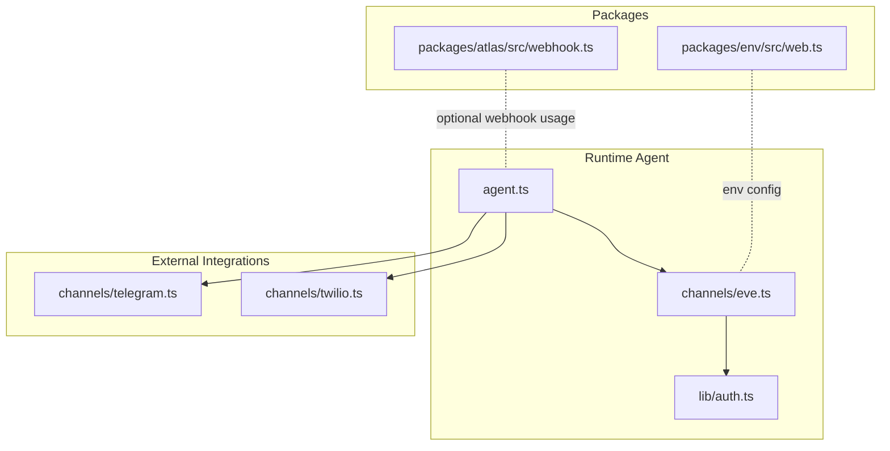
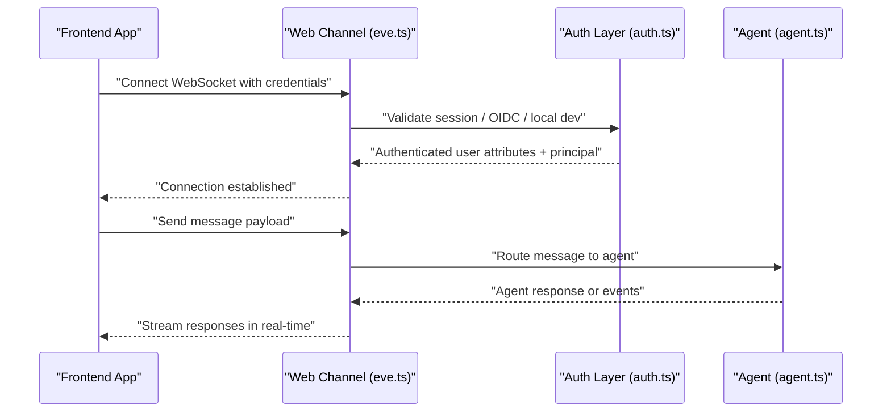
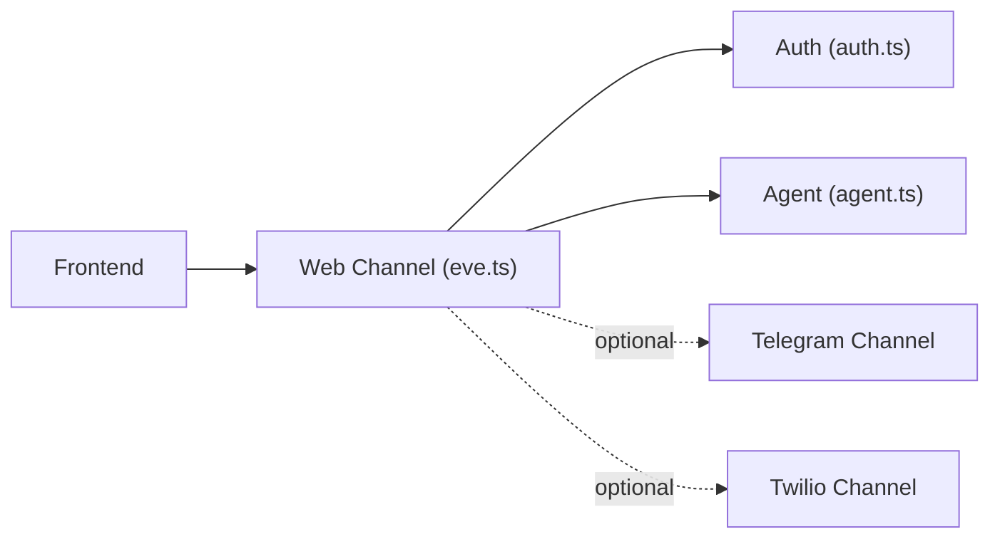

# Web Channel

<cite>
**Referenced Files in This Document**
- [eve.ts](file://apps/runtime/agent/channels/eve.ts)
- [auth.ts](file://apps/runtime/agent/lib/auth.ts)
- [agent.ts](file://apps/runtime/agent/agent.ts)
- [telegram.ts](file://apps/runtime/agent/channels/telegram.ts)
- [twilio.ts](file://apps/runtime/agent/channels/twilio.ts)
- [webhook.ts](file://packages/atlas/src/webhook.ts)
- [web.ts](file://packages/env/src/web.ts)
</cite>

## Table of Contents

1. [Introduction](#introduction)
2. [Project Structure](#project-structure)
3. [Core Components](#core-components)
4. [Architecture Overview](#architecture-overview)
5. [Detailed Component Analysis](#detailed-component-analysis)
6. [Dependency Analysis](#dependency-analysis)
7. [Performance Considerations](#performance-considerations)
8. [Troubleshooting Guide](#troubleshooting-guide)
9. [Conclusion](#conclusion)
10. [Appendices](#appendices)

## Introduction

This document explains the web channel implementation that enables real-time communication between the AI agent and web clients. It covers how the web channel is configured, how authentication is performed for WebSocket connections, the message protocol expectations, connection lifecycle management, and strategies for scaling to high traffic. It also provides guidance on integrating with a frontend application and handling multiple concurrent connections securely and efficiently.

## Project Structure

The runtime exposes multiple channels for different transport protocols. The web channel is defined under the agent’s channels directory and integrates with an authentication layer to secure connections. Other channels (Telegram, Twilio) are present but not part of the web client flow.

**Diagram sources**

- [agent.ts:1-8](file://apps/runtime/agent/agent.ts#L1-L8)
- [eve.ts:1-9](file://apps/runtime/agent/channels/eve.ts#L1-L9)
- [auth.ts:1-26](file://apps/runtime/agent/lib/auth.ts#L1-L26)
- [telegram.ts:1-5](file://apps/runtime/agent/channels/telegram.ts#L1-L5)
- [twilio.ts:1-6](file://apps/runtime/agent/channels/twilio.ts#L1-L6)
- [webhook.ts:1-66](file://packages/atlas/src/webhook.ts#L1-L66)
- [web.ts:1-14](file://packages/env/src/web.ts#L1-L14)

**Section sources**

- [agent.ts:1-8](file://apps/runtime/agent/agent.ts#L1-L8)
- [eve.ts:1-9](file://apps/runtime/agent/channels/eve.ts#L1-L9)
- [auth.ts:1-26](file://apps/runtime/agent/lib/auth.ts#L1-L26)
- [telegram.ts:1-5](file://apps/runtime/agent/channels/telegram.ts#L1-L5)
- [twilio.ts:1-6](file://apps/runtime/agent/channels/twilio.ts#L1-L6)
- [webhook.ts:1-66](file://packages/atlas/src/webhook.ts#L1-L66)
- [web.ts:1-14](file://packages/env/src/web.ts#L1-L14)

## Core Components

- Web channel configuration: The web channel is created via a channel factory and configured with authentication providers and CORS settings.
- Authentication: A custom auth function validates incoming requests by retrieving the session and mapping it to channel attributes and principal identity.
- Agent definition: The agent is defined with a model selection; this is where the runtime binds channels to the agent’s execution context.
- Environment configuration: Client-side environment variables expose the application URL for frontend integration.

Key responsibilities:

- Establish and secure WebSocket connections using the configured auth pipeline.
- Route messages between web clients and the AI agent.
- Provide CORS support for cross-origin browser access.

**Section sources**

- [eve.ts:1-9](file://apps/runtime/agent/channels/eve.ts#L1-L9)
- [auth.ts:1-26](file://apps/runtime/agent/lib/auth.ts#L1-L26)
- [agent.ts:1-8](file://apps/runtime/agent/agent.ts#L1-L8)
- [web.ts:1-14](file://packages/env/src/web.ts#L1-L14)

## Architecture Overview

The web channel uses a channel factory to create a WebSocket endpoint secured by multiple authentication strategies. The agent orchestrates message processing and can integrate with external services as needed.

**Diagram sources**

- [eve.ts:1-9](file://apps/runtime/agent/channels/eve.ts#L1-L9)
- [auth.ts:1-26](file://apps/runtime/agent/lib/auth.ts#L1-L26)
- [agent.ts:1-8](file://apps/runtime/agent/agent.ts#L1-L8)

## Detailed Component Analysis

### Web Channel Configuration

- Purpose: Exposes a WebSocket endpoint for web clients with CORS enabled and a chain of authentication providers.
- Behavior: Accepts connections only after successful authentication through Better Auth, Vercel OIDC, and a local development mode.

Integration notes:

- Ensure CORS is appropriate for your deployment domain.
- Use the local dev provider during development to bypass strict OIDC flows when necessary.

**Section sources**

- [eve.ts:1-9](file://apps/runtime/agent/channels/eve.ts#L1-L9)

### Authentication Flow

- Purpose: Validates the identity of connecting clients and attaches user attributes to the session context.
- Flow:
  - On connection, the channel invokes the auth function with the request.
  - The auth function retrieves the session from the shared auth API.
  - If no session exists, the connection is rejected.
  - On success, user attributes (email, name, picture) and principal identity are returned to the channel.

Security considerations:

- Always validate sessions on every connection attempt.
- Restrict issuers and verify tokens if using OIDC.
- Avoid exposing sensitive data in attributes unless required.

**Section sources**

- [auth.ts:1-26](file://apps/runtime/agent/lib/auth.ts#L1-L26)

### Agent Definition

- Purpose: Defines the AI model used by the agent and serves as the central entry point for channel bindings.
- Behavior: Channels connect to the agent to process messages and emit responses.

Operational note:

- Model selection impacts performance and cost; choose based on latency and capability requirements.

**Section sources**

- [agent.ts:1-8](file://apps/runtime/agent/agent.ts#L1-L8)

### Frontend Integration and Environment

- Purpose: Provides the application URL for the frontend to construct WebSocket endpoints and handle redirects or callbacks.
- Usage:
  - Read the public app URL from environment configuration.
  - Use it to build the WebSocket URL and manage reconnection logic.

Best practices:

- Validate URLs at runtime.
- Handle network errors and implement exponential backoff for reconnects.

**Section sources**

- [web.ts:1-14](file://packages/env/src/web.ts#L1-L14)

### Message Protocol and Lifecycle

- Connection establishment:
  - Frontend opens a WebSocket connection to the web channel endpoint.
  - The channel authenticates the connection using the configured auth pipeline.
  - Upon success, the client receives a stable connection for bidirectional messaging.
- Sending messages:
  - Clients send JSON payloads representing intents or commands.
  - The channel routes these to the agent for processing.
- Receiving messages:
  - The agent streams responses or events back to the client over the same connection.
- Lifecycle events:
  - Handle open, message, error, and close events on the client side.
  - Implement reconnection with jitter and retry limits.

Note: Specific message schemas are defined by the channel library; ensure your client adheres to expected structures.

[No sources needed since this section describes general protocol behavior without quoting specific code]

### External Channels (Telegram, Twilio)

- Purpose: Demonstrate additional channel integrations beyond the web channel.
- Behavior: Each channel is configured with its own credentials and options.

Operational note:

- These channels do not affect the web client flow but illustrate the multi-channel architecture.

**Section sources**

- [telegram.ts:1-5](file://apps/runtime/agent/channels/telegram.ts#L1-L5)
- [twilio.ts:1-6](file://apps/runtime/agent/channels/twilio.ts#L1-L6)

### Webhook Integration (Optional)

- Purpose: Register or query webhooks for asynchronous event delivery.
- Usage:
  - Use the provided client methods to register webhook URLs and list incidents.
  - Integrate with backend services to receive and process webhook payloads.

**Section sources**

- [webhook.ts:1-66](file://packages/atlas/src/webhook.ts#L1-L66)

## Dependency Analysis

The web channel depends on the authentication layer and the agent definition. Additional channels are independent modules that share the agent runtime.

**Diagram sources**

- [eve.ts:1-9](file://apps/runtime/agent/channels/eve.ts#L1-L9)
- [auth.ts:1-26](file://apps/runtime/agent/lib/auth.ts#L1-L26)
- [agent.ts:1-8](file://apps/runtime/agent/agent.ts#L1-L8)
- [telegram.ts:1-5](file://apps/runtime/agent/channels/telegram.ts#L1-L5)
- [twilio.ts:1-6](file://apps/runtime/agent/channels/twilio.ts#L1-L6)

**Section sources**

- [eve.ts:1-9](file://apps/runtime/agent/channels/eve.ts#L1-L9)
- [auth.ts:1-26](file://apps/runtime/agent/lib/auth.ts#L1-L26)
- [agent.ts:1-8](file://apps/runtime/agent/agent.ts#L1-L8)

## Performance Considerations

- Connection pooling:
  - Reuse WebSocket connections per user session to reduce handshake overhead.
  - Implement connection managers that track active sockets and recycle them when possible.
- Scaling:
  - Deploy behind a reverse proxy that supports WebSocket upgrades and sticky sessions if stateful components exist.
  - Use horizontal scaling with a shared session store to distribute connections across instances.
- Backpressure:
  - Apply rate limiting and message batching to prevent overwhelming the agent or downstream services.
- Resource usage:
  - Monitor memory and CPU usage per connection; set timeouts and idle disconnect policies.
- Security:
  - Enforce TLS termination at the edge.
  - Validate origins and implement CSRF protections for browser-based clients.

[No sources needed since this section provides general guidance]

## Troubleshooting Guide

Common issues and resolutions:

- Authentication failures:
  - Verify session retrieval succeeds and that headers are forwarded correctly.
  - Check OIDC configuration and issuer validation.
- CORS errors:
  - Ensure CORS is enabled and configured for the correct origin.
- Connection drops:
  - Implement robust reconnection logic with exponential backoff and jitter.
  - Log error events and monitor server-side connection metrics.
- High latency:
  - Profile agent processing time and optimize model calls or caching strategies.
  - Reduce payload sizes and avoid unnecessary serialization.

**Section sources**

- [auth.ts:1-26](file://apps/runtime/agent/lib/auth.ts#L1-L26)
- [eve.ts:1-9](file://apps/runtime/agent/channels/eve.ts#L1-L9)

## Conclusion

The web channel provides a secure, configurable WebSocket interface for real-time communication between web clients and the AI agent. By leveraging a modular authentication pipeline and a well-defined agent runtime, the system supports scalable, high-performance interactions. Proper frontend integration, careful connection management, and attention to security and performance will ensure reliable operation under load.

[No sources needed since this section summarizes without analyzing specific files]

## Appendices

### Frontend Integration Checklist

- Obtain the public app URL from environment configuration.
- Open a WebSocket connection to the web channel endpoint.
- Authenticate using the configured strategy (session/OIDC/local dev).
- Send messages according to the channel’s expected schema.
- Handle real-time responses and lifecycle events (open, message, error, close).
- Implement reconnection with backoff and retry limits.

[No sources needed since this section provides general guidance]
