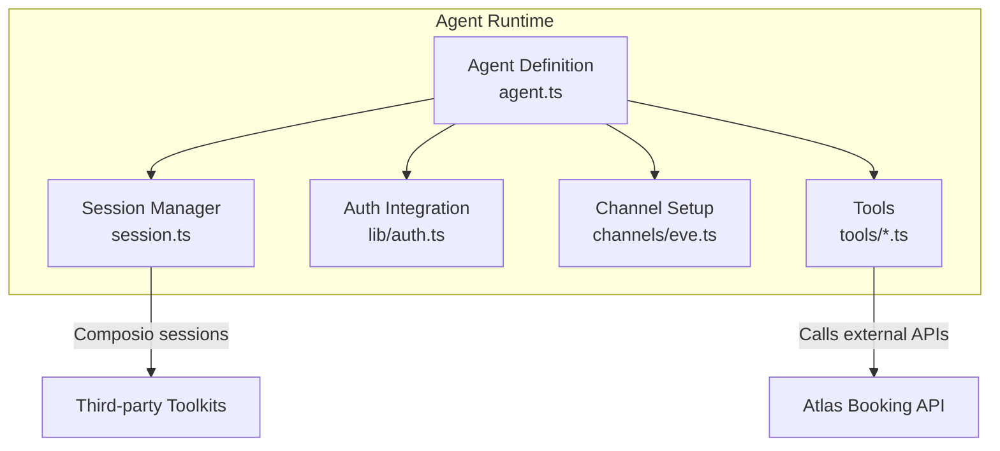
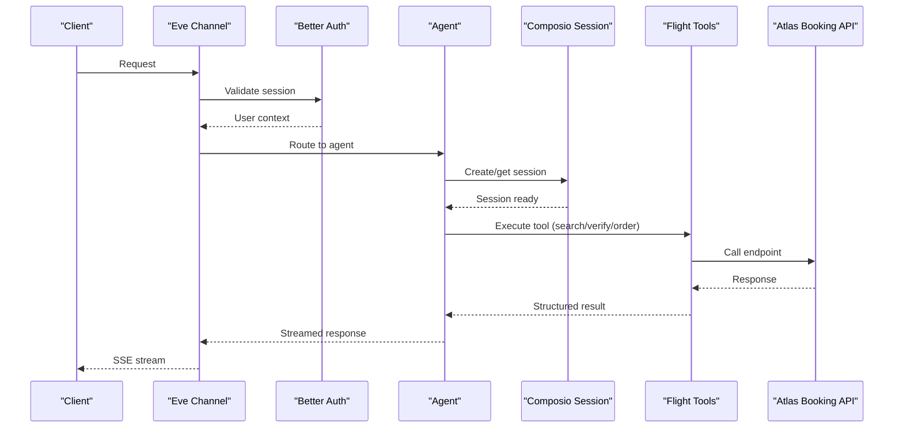

# AI Agent Performance Optimization

<cite>
**Referenced Files in This Document**
- [agent.ts](file://apps/runtime/agent/agent.ts)
- [session.ts](file://apps/runtime/agent/session.ts)
- [auth.ts](file://apps/runtime/agent/lib/auth.ts)
- [eve-channel.ts](file://apps/runtime/agent/channels/eve.ts)
- [composio-tools.ts](file://apps/runtime/agent/tools/composio.ts)
- [flight-search.ts](file://apps/runtime/agent/tools/flight-search.ts)
- [flight-verify.ts](file://apps/runtime/agent/tools/flight-verify.ts)
- [create-order.ts](file://apps/runtime/agent/tools/create-order.ts)
- [package.json](file://apps/runtime/package.json)
- [SKILL.md](file://.agents/skills/eve/SKILL.md)
</cite>

## Table of Contents

1. Introduction
2. Project Structure
3. Core Components
4. Architecture Overview
5. Detailed Component Analysis
6. Dependency Analysis
7. Performance Considerations
8. Troubleshooting Guide
9. Conclusion

## Introduction

This document provides performance optimization guidance for the Eve framework-based agent system in Atlas. It focuses on model selection strategies, prompt and token efficiency, conversation state management, streaming responses, parallel processing, rate limiting, intelligent caching, tool execution optimization, concurrency control, scalability, load balancing across models, and monitoring. The goal is to help you build a high-throughput, cost-efficient, and reliable AI agent runtime that scales under load while maintaining responsiveness and accuracy.

## Project Structure

The runtime agent is defined as an Eve agent with tools, channels, sessions, and authentication. Key areas:

- Agent definition and model configuration
- Session management via Composio
- Authentication integration with Better Auth
- Tools for flight search, verification, ordering, and third-party integrations
- Channel setup for local and production environments



**Diagram sources**

- [agent.ts:1-7](file://apps/runtime/agent/agent.ts#L1-L7)
- [session.ts:1-19](file://apps/runtime/agent/session.ts#L1-L19)
- [auth.ts:1-26](file://apps/runtime/agent/lib/auth.ts#L1-L26)
- [eve-channel.ts:1-10](file://apps/runtime/agent/channels/eve.ts#L1-L10)
- [flight-search.ts:1-62](file://apps/runtime/agent/tools/flight-search.ts#L1-L62)
- [flight-verify.ts:1-21](file://apps/runtime/agent/tools/flight-verify.ts#L1-L21)
- [create-order.ts:1-66](file://apps/runtime/agent/tools/create-order.ts#L1-L66)

**Section sources**

- [agent.ts:1-7](file://apps/runtime/agent/agent.ts#L1-L7)
- [session.ts:1-19](file://apps/runtime/agent/session.ts#L1-L19)
- [auth.ts:1-26](file://apps/runtime/agent/lib/auth.ts#L1-L26)
- [eve-channel.ts:1-10](file://apps/runtime/agent/channels/eve.ts#L1-L10)
- [package.json:1-30](file://apps/runtime/package.json#L1-L30)
- [SKILL.md:1-21](file://.agents/skills/eve/SKILL.md#L1-L21)

## Core Components

- Agent definition: Declares the active model and core agent behavior.
- Session manager: Creates and configures Composio sessions with toolkits for integrations.
- Authentication: Bridges Better Auth into Eve’s channel auth pipeline.
- Tools: Encapsulate business operations (flight search, verify, order) and third-party toolkits.
- Channel: Configures Eve channel with auth providers and CORS.

Key responsibilities:

- Model routing and fallbacks at the agent level
- Secure session creation per user
- Tool input validation and safe execution
- Channel-level request handling and cross-origin policies

**Section sources**

- [agent.ts:1-7](file://apps/runtime/agent/agent.ts#L1-L7)
- [session.ts:1-19](file://apps/runtime/agent/session.ts#L1-L19)
- [auth.ts:1-26](file://apps/runtime/agent/lib/auth.ts#L1-L26)
- [composio-tools.ts:1-12](file://apps/runtime/agent/tools/composio.ts#L1-L12)
- [eve-channel.ts:1-10](file://apps/runtime/agent/channels/eve.ts#L1-L10)

## Architecture Overview

The agent receives requests through the Eve channel, authenticates the user, resolves or creates a session, selects a model, and executes tools. Tools call external services (e.g., Atlas booking API) and return structured results.



**Diagram sources**

- [eve-channel.ts:1-10](file://apps/runtime/agent/channels/eve.ts#L1-L10)
- [auth.ts:1-26](file://apps/runtime/agent/lib/auth.ts#L1-L26)
- [session.ts:1-19](file://apps/runtime/agent/session.ts#L1-L19)
- [flight-search.ts:1-62](file://apps/runtime/agent/tools/flight-search.ts#L1-L62)
- [flight-verify.ts:1-21](file://apps/runtime/agent/tools/flight-verify.ts#L1-L21)
- [create-order.ts:1-66](file://apps/runtime/agent/tools/create-order.ts#L1-L66)

## Detailed Component Analysis

### Model Selection Strategy

- Choose models by task complexity and latency requirements:
  - Fast, low-cost tasks: lightweight models for simple queries or formatting.
  - Complex reasoning: stronger models for multi-step planning or nuanced decisions.
- Implement fallback mechanisms:
  - Primary model configured in agent definition.
  - On failure or rate limit, retry with alternate provider/model.
  - Track error rates and switch dynamically based on health metrics.
- Cost-performance trade-offs:
  - Prefer smaller models for high-volume, low-complexity prompts.
  - Use larger models selectively for critical steps (e.g., final decision-making).
- Token budgeting:
  - Estimate tokens per step; cap context windows to avoid overflow.
  - Summarize or truncate long histories before sending to model.

Implementation anchors:

- Agent model configuration is centralized in the agent definition file.
- Fallback logic can be added around tool calls and model invocations.

**Section sources**

- [agent.ts:1-7](file://apps/runtime/agent/agent.ts#L1-L7)

### Prompt Optimization Techniques

- Context window management:
  - Keep only necessary conversation history; summarize older turns.
  - Use system prompts to constrain output format and reduce retries.
- Token usage optimization:
  - Minimize redundant instructions; prefer concise, explicit prompts.
  - Batch similar operations when possible to reduce repeated context.
- Response formatting:
  - Enforce structured outputs (e.g., JSON schemas) to reduce parsing overhead.
  - Use tool descriptions and input schemas to guide the model toward correct actions.

Practical tips:

- Define clear tool descriptions and schemas to improve tool selection accuracy.
- Pre-validate inputs using Zod schemas to fail fast and reduce wasted tokens.

**Section sources**

- [flight-search.ts:1-62](file://apps/runtime/agent/tools/flight-search.ts#L1-L62)
- [flight-verify.ts:1-21](file://apps/runtime/agent/tools/flight-verify.ts#L1-L21)
- [create-order.ts:1-66](file://apps/runtime/agent/tools/create-order.ts#L1-L66)

### Conversation State Management

- Session persistence:
  - Use Composio sessions to maintain toolkit connections and state per user.
  - Persist minimal metadata (e.g., last action, timestamps) if needed.
- Memory optimization:
  - Prune old messages; keep only recent context plus summaries.
  - Avoid storing large payloads in memory; reference IDs instead.
- Context retention strategies:
  - Maintain a rolling window of recent interactions.
  - Store long-term facts separately and inject them on demand.

**Section sources**

- [session.ts:1-19](file://apps/runtime/agent/session.ts#L1-L19)

### Streaming Responses

- Use server-sent events (SSE) to stream partial results from tools and model responses.
- Emit incremental updates for each step (e.g., search results, verification status).
- Ensure backpressure handling to prevent overwhelming clients.

Operational notes:

- Configure channel to support streaming and handle client disconnects gracefully.
- Wrap tool calls with timeouts and cancellation support.

**Section sources**

- [eve-channel.ts:1-10](file://apps/runtime/agent/channels/eve.ts#L1-L10)

### Parallel Processing and Concurrency Control

- Parallelize independent tool calls:
  - Run non-dependent searches or lookups concurrently where safe.
  - Use promise-based patterns to aggregate results efficiently.
- Rate limiting:
  - Apply per-model and per-tool rate limits to avoid throttling.
  - Implement exponential backoff and circuit breakers for failing services.
- Concurrency limits:
  - Cap concurrent requests per tenant/user to protect downstream services.
  - Queue excess requests with priority handling for critical paths.

Best practices:

- Deduplicate identical requests within a short time window.
- Monitor queue lengths and adjust concurrency thresholds dynamically.

[No sources needed since this section provides general guidance]

### Intelligent Caching

- Cache frequent queries:
  - Cache flight search results keyed by route, dates, and passenger counts.
  - Use TTL-based caches to balance freshness and performance.
- Cache invalidation:
  - Invalidate on price changes or schedule updates.
  - Use versioned keys to simplify cache busting.
- Storage options:
  - In-memory LRU for single-process instances.
  - Distributed cache (e.g., Redis) for multi-instance deployments.

Implementation hints:

- Place caching near tool boundaries to minimize repeated work.
- Measure hit rates and tune TTLs based on data volatility.

[No sources needed since this section provides general guidance]

### Optimizing Tool Execution

- Input validation:
  - Use strict schemas to catch errors early and reduce retries.
- Idempotency:
  - Make read operations idempotent; guard write operations with confirmation.
- Error handling:
  - Normalize errors and provide actionable messages.
  - Log detailed diagnostics without exposing sensitive data.

Examples in codebase:

- Flight search, verification, and ordering tools demonstrate schema-driven execution and clear descriptions.

**Section sources**

- [flight-search.ts:1-62](file://apps/runtime/agent/tools/flight-search.ts#L1-L62)
- [flight-verify.ts:1-21](file://apps/runtime/agent/tools/flight-verify.ts#L1-L21)
- [create-order.ts:1-66](file://apps/runtime/agent/tools/create-order.ts#L1-L66)

### Scalability and Load Balancing

- Horizontal scaling:
  - Deploy multiple agent instances behind a load balancer.
  - Use shared sessions and caches for consistency.
- Model load balancing:
  - Distribute requests across models based on capacity and cost targets.
  - Route complex queries to stronger models; simple ones to faster, cheaper models.
- Monitoring:
  - Track latency, throughput, error rates, and token usage per model/tool.
  - Alert on anomalies and automate scaling decisions.

[No sources needed since this section provides general guidance]

## Dependency Analysis

The runtime depends on Eve, Composio, and internal packages. Dependencies enable agent lifecycle, session management, and tool execution.

```mermaid
graph LR
Pkg["runtime package.json"]
Eve["eve"]
Composio["@composio/core", "@composio/experimental"]
Auth["@atlas/auth"]
Client["@atlas/atlas-client"]
Pkg --> Eve
Pkg --> Composio
Pkg --> Auth
Pkg --> Client
```

**Diagram sources**

- [package.json:1-30](file://apps/runtime/package.json#L1-L30)

**Section sources**

- [package.json:1-30](file://apps/runtime/package.json#L1-L30)

## Performance Considerations

- Model selection:
  - Match model capability to task complexity; use fallbacks for resilience.
- Prompt design:
  - Keep prompts concise; enforce structured outputs; manage context windows.
- State management:
  - Persist minimal session state; summarize long histories.
- Streaming:
  - Stream incremental updates; handle backpressure and cancellations.
- Concurrency:
  - Parallelize independent work; apply rate limits and quotas.
- Caching:
  - Cache stable data with appropriate TTLs; invalidate on changes.
- Monitoring:
  - Instrument key metrics; set alerts for SLO breaches.

[No sources needed since this section provides general guidance]

## Troubleshooting Guide

Common issues and resolutions:

- Authentication failures:
  - Verify session retrieval and attribute mapping in auth integration.
- Missing user context:
  - Ensure session contains principalId; guard tool execution accordingly.
- Tool execution errors:
  - Validate inputs against schemas; log detailed errors; implement retries with backoff.
- Rate limiting:
  - Detect 429 responses; pause and resume with exponential backoff.
- Session issues:
  - Recreate sessions on expiration; persist minimal identifiers for recovery.

Operational checks:

- Confirm CORS settings in channel configuration.
- Validate environment variables for API credentials and endpoints.

**Section sources**

- [auth.ts:1-26](file://apps/runtime/agent/lib/auth.ts#L1-L26)
- [composio-tools.ts:1-12](file://apps/runtime/agent/tools/composio.ts#L1-L12)
- [eve-channel.ts:1-10](file://apps/runtime/agent/channels/eve.ts#L1-L10)

## Conclusion

By centralizing model configuration, optimizing prompts and context, managing sessions efficiently, streaming responses, applying robust concurrency controls, and implementing intelligent caching and monitoring, the Eve-based agent system in Atlas can achieve high performance, cost efficiency, and reliability at scale. Adopt fallback strategies and continuous observability to maintain service quality under varying loads and external service conditions.

[No sources needed since this section summarizes without analyzing specific files]
