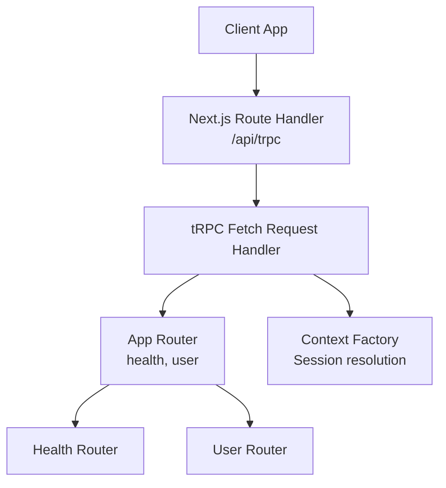
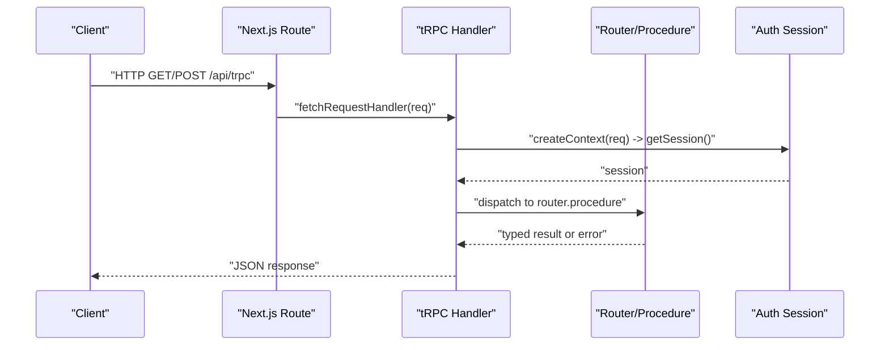
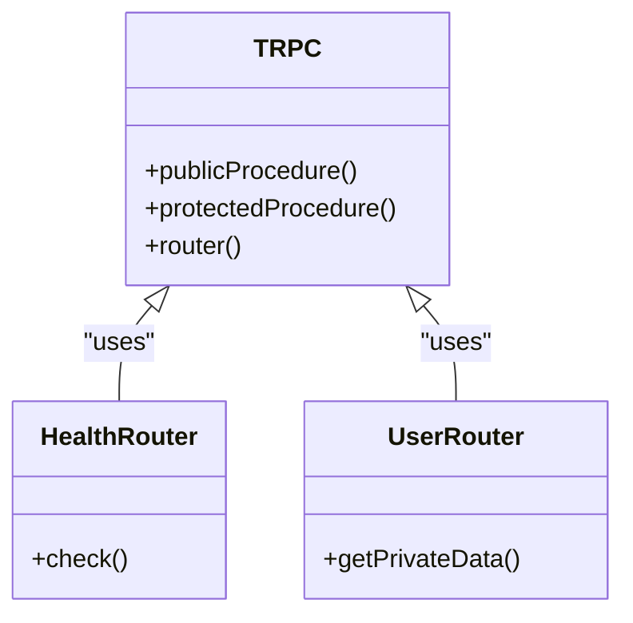
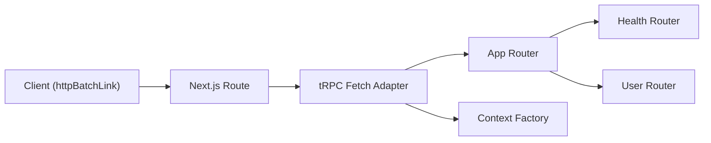

# API Performance Optimization

<cite>
**Referenced Files in This Document**
- [route.ts](file://apps/web/src/app/api/trpc/[trpc]/route.ts)
- [trpc.ts](file://apps/web/src/utils/trpc.ts)
- [index.ts](file://packages/api/src/index.ts)
- [context.ts](file://packages/api/src/context.ts)
- [routers/index.ts](file://packages/api/src/routers/index.ts)
- [health.ts](file://packages/api/src/routers/health.ts)
- [user.ts](file://packages/api/src/routers/user.ts)
</cite>

## Table of Contents

1. Introduction
2. Project Structure
3. Core Components
4. Architecture Overview
5. Detailed Component Analysis
6. Dependency Analysis
7. Performance Considerations
8. Troubleshooting Guide
9. Conclusion

## Introduction

This document provides a comprehensive guide to optimizing tRPC procedures and server-side performance in the Atlas application. It focuses on request handling, context creation, middleware patterns, batching, caching, error handling, rate limiting, background jobs, load testing, profiling, monitoring, and horizontal scaling strategies. The guidance is grounded in the current codebase structure and best practices for Next.js and tRPC.

## Project Structure

Atlas exposes a single tRPC endpoint via a Next.js route handler that wires up the app router and per-request context. The client uses httpBatchLink to batch requests efficiently. Routers are modularized under packages/api with public and protected procedures.

**Diagram sources**

- [route.ts:1-13](file://apps/web/src/app/api/trpc/[trpc]/route.ts#L1-L13)
- [routers/index.ts:1-10](file://packages/api/src/routers/index.ts#L1-L10)
- [health.ts:1-6](file://packages/api/src/routers/health.ts#L1-L6)
- [user.ts:1-9](file://packages/api/src/routers/user.ts#L1-L9)
- [context.ts:1-14](file://packages/api/src/context.ts#L1-L14)

**Section sources**

- [route.ts:1-13](file://apps/web/src/app/api/trpc/[trpc]/route.ts#L1-L13)
- [routers/index.ts:1-10](file://packages/api/src/routers/index.ts#L1-L10)

## Core Components

- tRPC initialization and procedure factories:
  - Public and protected procedures are defined centrally, enabling consistent middleware composition and error handling across all endpoints.
- Context factory:
  - Resolves session per request using the auth library and attaches it to the tRPC context for downstream use.
- Route handler:
  - Wires the fetch-based tRPC handler to the Next.js route, providing the endpoint path, router, and context factory.
- Client configuration:
  - Uses httpBatchLink to bundle multiple tRPC calls into a single HTTP request, reducing latency and overhead.

Key implementation references:

- Procedure definitions and protected middleware: [index.ts:1-26](file://packages/api/src/index.ts#L1-L26)
- Context creation and session resolution: [context.ts:1-14](file://packages/api/src/context.ts#L1-L14)
- Route handler wiring: [route.ts:1-13](file://apps/web/src/app/api/trpc/[trpc]/route.ts#L1-L13)
- Client batching setup: [trpc.ts:1-40](file://apps/web/src/utils/trpc.ts#L1-L40)

**Section sources**

- [index.ts:1-26](file://packages/api/src/index.ts#L1-L26)
- [context.ts:1-14](file://packages/api/src/context.ts#L1-L14)
- [route.ts:1-13](file://apps/web/src/app/api/trpc/[trpc]/route.ts#L1-L13)
- [trpc.ts:1-40](file://apps/web/src/utils/trpc.ts#L1-L40)

## Architecture Overview

The request flow starts at the Next.js route, which delegates to tRPC’s fetch adapter. The adapter constructs a per-request context (including session), routes the call to the appropriate router/procedure, executes business logic, and returns a typed response. On the client, httpBatchLink aggregates multiple calls to reduce network round-trips.

**Diagram sources**

- [route.ts:1-13](file://apps/web/src/app/api/trpc/[trpc]/route.ts#L1-L13)
- [context.ts:1-14](file://packages/api/src/context.ts#L1-L14)
- [routers/index.ts:1-10](file://packages/api/src/routers/index.ts#L1-L10)

## Detailed Component Analysis

### tRPC Initialization and Middleware

- Centralized tRPC instance with typed context ensures type safety across routers.
- Protected procedure middleware validates session presence and throws standardized errors when unauthorized.
- Benefits:
  - Consistent authorization checks across all protected endpoints.
  - Predictable error codes and messages for clients.

Optimization opportunities:

- Add global metrics/logging around middleware for observability.
- Introduce request-scoped caches (e.g., React.cache-like deduplication within a request) for repeated operations like session validation or user lookups.

**Section sources**

- [index.ts:1-26](file://packages/api/src/index.ts#L1-L26)

### Context Factory and Session Resolution

- Per-request context resolves the session from headers using the auth API.
- Ensures each tRPC procedure has access to authenticated user data.

Optimization opportunities:

- Cache session resolution within a single request to avoid redundant auth calls.
- Use connection pooling for any database-backed session stores if applicable.

**Section sources**

- [context.ts:1-14](file://packages/api/src/context.ts#L1-L14)

### Route Handler and Endpoint Wiring

- Single route handles both GET and POST for tRPC.
- Delegates to fetchRequestHandler with endpoint path, router, and context factory.

Optimization opportunities:

- Enable compression at the platform level (e.g., gzip/br) for responses.
- Ensure proper cache-control headers for idempotent queries where appropriate.

**Section sources**

- [route.ts:1-13](file://apps/web/src/app/api/trpc/[trpc]/route.ts#L1-L13)

### Client Configuration and Batching

- httpBatchLink bundles multiple tRPC calls into one HTTP request, improving throughput and reducing latency.
- Credentials are included for cookie-based sessions.

Optimization opportunities:

- Tune batch size and max time window for optimal batching behavior.
- Implement retry and backoff on transient failures at the client link layer.

**Section sources**

- [trpc.ts:1-40](file://apps/web/src/utils/trpc.ts#L1-L40)

### Routers: Health and User

- Health router exposes a simple public check for readiness/liveness probes.
- User router demonstrates a protected query accessing session data.

Optimization opportunities:

- Keep health checks lightweight; avoid heavy I/O.
- For user data, consider per-request deduplication and caching for frequently accessed fields.

**Section sources**

- [health.ts:1-6](file://packages/api/src/routers/health.ts#L1-L6)
- [user.ts:1-9](file://packages/api/src/routers/user.ts#L1-L9)

#### Class Diagram: Procedures and Routers

**Diagram sources**

- [index.ts:1-26](file://packages/api/src/index.ts#L1-L26)
- [health.ts:1-6](file://packages/api/src/routers/health.ts#L1-L6)
- [user.ts:1-9](file://packages/api/src/routers/user.ts#L1-L9)

## Dependency Analysis

The tRPC stack composes several layers:

- Next.js route handler depends on tRPC fetch adapter and app router.
- App router composes feature routers (health, user).
- Feature routers depend on procedure factories and context.
- Client depends on tRPC client with httpBatchLink.

**Diagram sources**

- [route.ts:1-13](file://apps/web/src/app/api/trpc/[trpc]/route.ts#L1-L13)
- [routers/index.ts:1-10](file://packages/api/src/routers/index.ts#L1-L10)
- [health.ts:1-6](file://packages/api/src/routers/health.ts#L1-L6)
- [user.ts:1-9](file://packages/api/src/routers/user.ts#L1-L9)
- [context.ts:1-14](file://packages/api/src/context.ts#L1-L14)
- [trpc.ts:1-40](file://apps/web/src/utils/trpc.ts#L1-L40)

**Section sources**

- [route.ts:1-13](file://apps/web/src/app/api/trpc/[trpc]/route.ts#L1-L13)
- [routers/index.ts:1-10](file://packages/api/src/routers/index.ts#L1-L10)
- [trpc.ts:1-40](file://apps/web/src/utils/trpc.ts#L1-L40)

## Performance Considerations

### Query Batching

- The client already uses httpBatchLink to aggregate multiple tRPC calls into a single HTTP request, reducing overhead and improving throughput.
- Recommendations:
  - Configure batch size and maximum delay to balance latency vs. bundling efficiency.
  - Avoid large payloads in batches; split heavy mutations if needed.

**Section sources**

- [trpc.ts:1-40](file://apps/web/src/utils/trpc.ts#L1-L40)

### Response Compression

- While not configured in code, enable compression at the hosting/platform layer (e.g., gzip/br) to reduce payload sizes for JSON responses.
- Validate content negotiation and ensure static assets are also compressed.

[No sources needed since this section provides general guidance]

### Efficient Error Handling

- Protected procedures throw standardized errors when unauthorized, ensuring consistent client handling.
- Recommendations:
  - Use structured error codes and messages.
  - Log errors server-side with correlation IDs for tracing.
  - Surface actionable errors to clients without leaking sensitive details.

**Section sources**

- [index.ts:1-26](file://packages/api/src/index.ts#L1-L26)

### Middleware Optimization and Context Sharing

- Centralized middleware enforces authentication and can be extended for logging, metrics, and rate limiting.
- Context is created per request; reuse expensive computations within the same request by caching results in-memory during the request lifecycle.

**Section sources**

- [context.ts:1-14](file://packages/api/src/context.ts#L1-L14)
- [index.ts:1-26](file://packages/api/src/index.ts#L1-L26)

### Request/Response Transformation Efficiency

- Keep transformations minimal and close to data boundaries.
- Prefer streaming or pagination for large datasets.
- Avoid unnecessary serialization/deserialization steps.

[No sources needed since this section provides general guidance]

### Rate Limiting Implementation

- Integrate rate limiting at the route or middleware layer to protect endpoints from abuse.
- Use IP/session-based limits and consider distributed storage for multi-instance deployments.

[No sources needed since this section provides general guidance]

### Request Queuing Strategies

- For CPU-bound or I/O-heavy operations, queue work to background workers to keep API responses fast.
- Use message queues (e.g., Redis, SQS) to decouple long-running tasks from request paths.

[No sources needed since this section provides general guidance]

### Background Job Processing

- Offload long-running tasks (e.g., report generation, external integrations) to background jobs.
- Provide status endpoints to poll job progress and webhooks for completion notifications.

[No sources needed since this section provides general guidance]

### Load Testing Methodologies

- Simulate realistic traffic patterns using tools like k6 or Artillery.
- Measure p50/p95/p99 latencies, error rates, and resource utilization.
- Gradually increase load to identify saturation points and bottlenecks.

[No sources needed since this section provides general guidance]

### Performance Profiling Tools

- Use APM and tracing to profile tRPC handlers, database queries, and external calls.
- Capture flame graphs and slow query logs to pinpoint hotspots.

[No sources needed since this section provides general guidance]

### Monitoring Setup

- Instrument key metrics: request count, latency percentiles, error rates, and throughput.
- Set alerts for anomalies and capacity thresholds.

[No sources needed since this section provides general guidance]

### Circuit Breakers, Retry Mechanisms, and Graceful Degradation

- Wrap external dependencies with circuit breakers to fail fast and recover gracefully.
- Implement retries with exponential backoff for transient failures.
- Provide fallback responses or degraded modes when upstream services are unavailable.

[No sources needed since this section provides general guidance]

### Horizontal Scaling and Stateless API Design

- Ensure statelessness by storing session/state externally (e.g., cookies with signed tokens, external store).
- Scale horizontally by running multiple instances behind a load balancer.
- Use shared caches and databases optimized for concurrent access.

[No sources needed since this section provides general guidance]

### Microservice Communication Optimization

- Prefer async messaging for non-critical paths to reduce coupling and improve resilience.
- Use efficient serialization formats and minimize payload sizes.
- Implement timeouts and retries with idempotency keys for safe retries.

[No sources needed since this section provides general guidance]

## Troubleshooting Guide

Common issues and resolutions:

- Unauthorized access:
  - Protected procedures enforce session checks; verify session resolution in context and ensure credentials are sent with requests.
- High latency:
  - Check for waterfall chains; parallelize independent operations where possible.
  - Inspect database queries and add indexes or caching as needed.
- Excessive memory usage:
  - Avoid retaining large objects in context beyond request scope.
  - Stream large responses and paginate where feasible.

Operational tips:

- Add structured logging with request IDs to correlate traces across components.
- Use health checks to detect unhealthy instances quickly.

**Section sources**

- [index.ts:1-26](file://packages/api/src/index.ts#L1-L26)
- [context.ts:1-14](file://packages/api/src/context.ts#L1-L14)

## Conclusion

Atlas’s tRPC setup provides a solid foundation for high-performance APIs through centralized procedures, per-request context, and client-side batching. By applying middleware enhancements, caching strategies, rate limiting, background processing, and robust monitoring, you can further optimize throughput, latency, and reliability while supporting horizontal scaling and resilient microservice communication.
