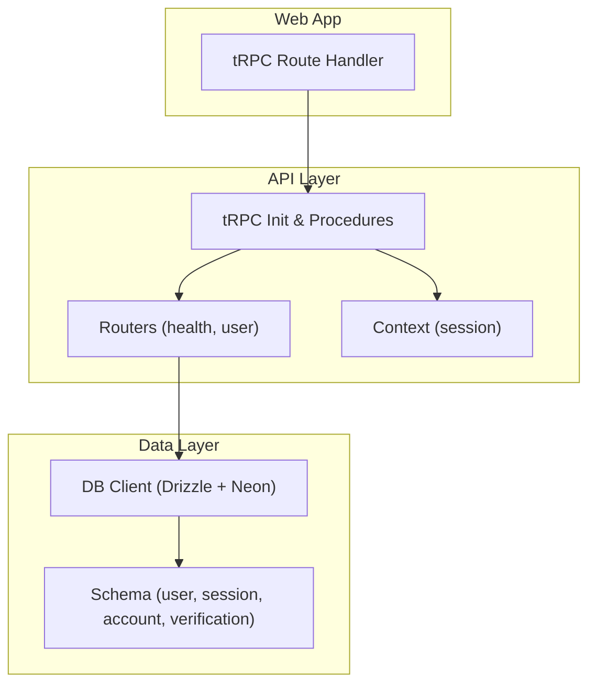
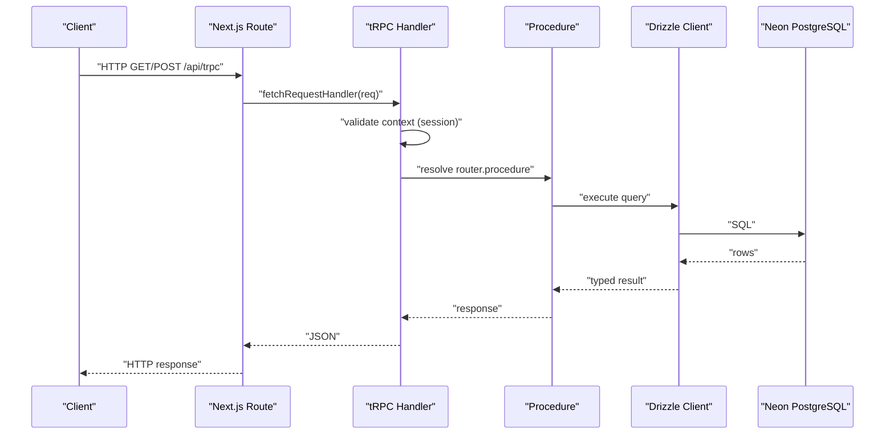
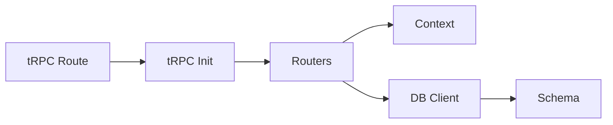
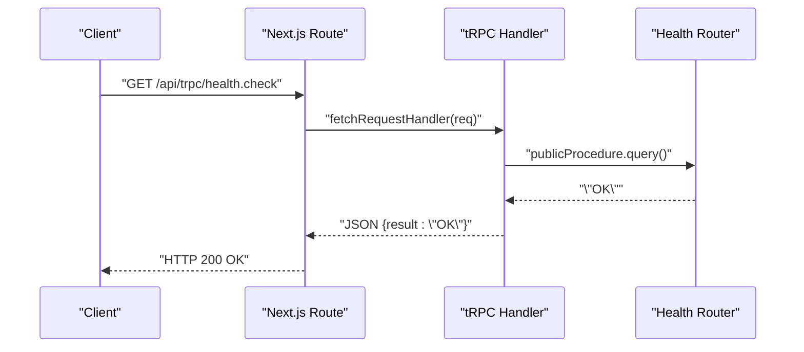

# Backend Performance Optimization

<cite>
**Referenced Files in This Document**
- [README.md](file://README.md)
- [apps/web/src/app/api/trpc/[trpc]/route.ts](file://apps/web/src/app/api/trpc/[trpc]/route.ts)
- [packages/api/src/index.ts](file://packages/api/src/index.ts)
- [packages/api/src/context.ts](file://packages/api/src/context.ts)
- [packages/api/src/routers/index.ts](file://packages/api/src/routers/index.ts)
- [packages/api/src/routers/health.ts](file://packages/api/src/routers/health.ts)
- [packages/api/src/routers/user.ts](file://packages/api/src/routers/user.ts)
- [packages/db/src/index.ts](file://packages/db/src/index.ts)
- [packages/db/drizzle.config.ts](file://packages/db/drizzle.config.ts)
- [packages/db/src/schema/auth.ts](file://packages/db/src/schema/auth.ts)
- [packages/env/src/server.ts](file://packages/env/src/server.ts)
- [.agents/skills/neon-postgres/SKILL.md](file://.agents/skills/neon-postgres/SKILL.md)
</cite>

## Table of Contents

1. [Introduction](#introduction)
2. [Project Structure](#project-structure)
3. [Core Components](#core-components)
4. [Architecture Overview](#architecture-overview)
5. [Detailed Component Analysis](#detailed-component-analysis)
6. [Dependency Analysis](#dependency-analysis)
7. [Performance Considerations](#performance-considerations)
8. [Troubleshooting Guide](#troubleshooting-guide)
9. [Conclusion](#conclusion)
10. [Appendices](#appendices)

## Introduction

This document provides backend performance optimization guidance for the Atlas application, focusing on API and database performance. It covers tRPC procedure optimization (query batching, response compression, error handling efficiency), database tuning with Drizzle ORM (query optimization, connection pooling, indexing strategies, N+1 prevention), caching patterns (Redis or in-memory caches, API response caching, query result caching), load testing and profiling, monitoring, rate limiting, request queuing, background jobs, horizontal scaling, database sharding, and microservice communication optimization.

The project uses Next.js for the web app, tRPC for type-safe APIs, Drizzle ORM with Neon PostgreSQL, and Better-Auth for authentication. The runtime environment is validated via a centralized env module.

**Section sources**

- [README.md:1-107](file://README.md#L1-L107)

## Project Structure

Atlas is a monorepo with clear separation between apps and packages:

- apps/web: Next.js frontend and API routes including tRPC endpoint
- packages/api: tRPC router, procedures, context, and shared API utilities
- packages/db: Drizzle schema, migrations, and database client
- packages/env: Environment variable validation and schemas
- packages/auth: Authentication configuration used by tRPC context
- packages/ui: Shared UI components

**Diagram sources**

- [apps/web/src/app/api/trpc/[trpc]/route.ts:1-13](file://apps/web/src/app/api/trpc/[trpc]/route.ts#L1-L13)
- [packages/api/src/index.ts:1-25](file://packages/api/src/index.ts#L1-L25)
- [packages/api/src/context.ts:1-15](file://packages/api/src/context.ts#L1-L15)
- [packages/api/src/routers/index.ts:1-11](file://packages/api/src/routers/index.ts#L1-L11)
- [packages/db/src/index.ts:1-12](file://packages/db/src/index.ts#L1-L12)
- [packages/db/src/schema/auth.ts:1-101](file://packages/db/src/schema/auth.ts#L1-L101)

**Section sources**

- [README.md:79-107](file://README.md#L79-L107)
- [apps/web/src/app/api/trpc/[trpc]/route.ts:1-13](file://apps/web/src/app/api/trpc/[trpc]/route.ts#L1-L13)
- [packages/api/src/routers/index.ts:1-11](file://packages/api/src/routers/index.ts#L1-L11)
- [packages/db/src/index.ts:1-12](file://packages/db/src/index.ts#L1-L12)

## Core Components

- tRPC setup and procedures: Centralized initialization with public and protected procedures; protected procedures enforce session presence and return standardized errors.
- tRPC route handler: Next.js route that wires requests to the tRPC router using fetchRequestHandler.
- Context: Extracts session from incoming requests using Better-Auth.
- Database client: Creates a Drizzle instance over Neon HTTP with typed schema.
- Schema: Defines tables and relations for user, session, account, and verification with indexes where appropriate.

Key responsibilities:

- Request routing and lifecycle management at the tRPC layer
- Authentication and authorization via context
- Data access abstraction through Drizzle
- Type safety across the stack

**Section sources**

- [packages/api/src/index.ts:1-25](file://packages/api/src/index.ts#L1-L25)
- [apps/web/src/app/api/trpc/[trpc]/route.ts:1-13](file://apps/web/src/app/api/trpc/[trpc]/route.ts#L1-L13)
- [packages/api/src/context.ts:1-15](file://packages/api/src/context.ts#L1-L15)
- [packages/db/src/index.ts:1-12](file://packages/db/src/index.ts#L1-L12)
- [packages/db/src/schema/auth.ts:1-101](file://packages/db/src/schema/auth.ts#L1-L101)

## Architecture Overview

End-to-end flow for a tRPC request:

- Client sends HTTP request to /api/trpc
- Next.js route invokes tRPC fetchRequestHandler
- tRPC middleware validates context (session)
- Router resolves procedure and executes business logic
- Procedure queries database via Drizzle
- Response serialized and returned

**Diagram sources**

- [apps/web/src/app/api/trpc/[trpc]/route.ts:1-13](file://apps/web/src/app/api/trpc/[trpc]/route.ts#L1-L13)
- [packages/api/src/index.ts:1-25](file://packages/api/src/index.ts#L1-L25)
- [packages/api/src/context.ts:1-15](file://packages/api/src/context.ts#L1-L15)
- [packages/db/src/index.ts:1-12](file://packages/db/src/index.ts#L1-L12)

## Detailed Component Analysis

### tRPC Procedures and Middleware

- Public vs protected procedures: Protected procedures ensure a valid session exists before proceeding, throwing a standardized TRPCError when unauthorized.
- Error handling efficiency: Use consistent error codes and messages to simplify client-side handling and reduce payload size.
- Batching and compression: Enable tRPC batching at the client level to combine multiple calls into one request. For serverless deployments, leverage platform-level compression and consider edge caching headers where applicable.

Optimization tips:

- Group related reads into single procedures to minimize round trips
- Validate inputs early to fail fast and avoid unnecessary DB work
- Return only necessary fields to reduce payload size

**Section sources**

- [packages/api/src/index.ts:1-25](file://packages/api/src/index.ts#L1-L25)
- [packages/api/src/routers/health.ts:1-6](file://packages/api/src/routers/health.ts#L1-L6)
- [packages/api/src/routers/user.ts:1-8](file://packages/api/src/routers/user.ts#L1-L8)

### tRPC Route Handler

- Next.js route delegates to tRPC fetchRequestHandler with a context factory that extracts the session from the request headers.
- Ensure minimal overhead in the route handler; keep it stateless and fast.

Optimization tips:

- Keep route handlers thin; move logic to procedures
- Use platform features like Vercel’s compression and caching headers if available
- Avoid heavy computation in the route layer

**Section sources**

- [apps/web/src/app/api/trpc/[trpc]/route.ts:1-13](file://apps/web/src/app/api/trpc/[trpc]/route.ts#L1-L13)
- [packages/api/src/context.ts:1-15](file://packages/api/src/context.ts#L1-L15)

### Database Client and Connection Pooling

- Drizzle client is created using Neon HTTP driver with typed schema.
- Connection pooling strategy depends on deployment:
  - Serverless: Prefer pooled connections for web apps and serverless functions
  - Migrations/admin tasks: Use direct connections

Optimization tips:

- Use pooled DATABASE_URL for application runtime
- Reserve direct URL for migrations and admin operations
- Monitor connection usage and adjust pool sizes based on concurrency

**Section sources**

- [packages/db/src/index.ts:1-12](file://packages/db/src/index.ts#L1-L12)
- [.agents/skills/neon-postgres/SKILL.md:29-55](file://.agents/skills/neon-postgres/SKILL.md#L29-L55)
- [.agents/skills/neon-postgres/SKILL.md:167-168](file://.agents/skills/neon-postgres/SKILL.md#L167-L168)

### Schema and Indexing Strategy

- Tables include user, session, account, and verification with relationships defined via Drizzle relations.
- Existing indexes:
  - session_userId_idx on session.userId
  - account_userId_idx on account.userId
  - verification_identifier_idx on verification.identifier

Optimization tips:

- Add indexes on frequently filtered columns (e.g., email, identifiers)
- Use composite indexes for common multi-column filters
- Periodically analyze query plans to validate index effectiveness

**Section sources**

- [packages/db/src/schema/auth.ts:1-101](file://packages/db/src/schema/auth.ts#L1-L101)

### Environment Configuration

- Centralized env module validates required variables such as DATABASE_URL and service URLs.
- Ensures type-safe configuration across services and reduces runtime errors.

Optimization tips:

- Fail fast on missing or invalid env vars during startup
- Separate dev/prod configs and use secure secret management

**Section sources**

- [packages/env/src/server.ts:1-28](file://packages/env/src/server.ts#L1-L28)

## Dependency Analysis

High-level dependencies among core components:

- tRPC route depends on tRPC init and routers
- Routers depend on procedures and context
- Procedures depend on DB client
- DB client depends on Neon driver and schema

**Diagram sources**

- [apps/web/src/app/api/trpc/[trpc]/route.ts:1-13](file://apps/web/src/app/api/trpc/[trpc]/route.ts#L1-L13)
- [packages/api/src/index.ts:1-25](file://packages/api/src/index.ts#L1-L25)
- [packages/api/src/context.ts:1-15](file://packages/api/src/context.ts#L1-L15)
- [packages/db/src/index.ts:1-12](file://packages/db/src/index.ts#L1-L12)
- [packages/db/src/schema/auth.ts:1-101](file://packages/db/src/schema/auth.ts#L1-L101)

**Section sources**

- [packages/api/src/routers/index.ts:1-11](file://packages/api/src/routers/index.ts#L1-L11)
- [packages/db/src/index.ts:1-12](file://packages/db/src/index.ts#L1-L12)

## Performance Considerations

### tRPC Procedure Optimization

- Query batching: Configure client-side batching to group multiple tRPC calls into a single HTTP request, reducing latency and overhead.
- Response compression: Leverage platform compression (e.g., gzip/brotli) and minimize payload by selecting only needed fields.
- Error handling efficiency: Use standardized error codes and concise messages; avoid large error payloads.

Implementation notes:

- Batch multiple read-heavy procedures together
- Deduplicate identical calls within a request using per-request memoization patterns where applicable
- Validate inputs early to prevent unnecessary DB work

[No sources needed since this section provides general guidance]

### Database Performance Tuning with Drizzle

- Query optimization:
  - Select only required columns
  - Use efficient filters and joins
  - Avoid SELECT * in hot paths
- Connection pooling:
  - Use pooled connections for serverless/web apps
  - Use direct connections for migrations/admin tasks
- Indexing strategies:
  - Index foreign keys and frequently filtered columns
  - Add composite indexes for common query patterns
  - Review slow queries and add targeted indexes
- N+1 query prevention:
  - Fetch related data in bulk using batched queries
  - Use relations and joins carefully to avoid repeated lookups

[No sources needed since this section provides general guidance]

### Caching Implementation Patterns

- In-memory cache (per-process):
  - Use LRU caches for cross-request deduplication within a process
  - Suitable for short-lived, high-frequency reads
- Redis cache:
  - Global cache for distributed environments
  - Cache API responses and expensive query results
  - Set TTLs and invalidation strategies
- API response caching:
  - Cache stable endpoints with appropriate cache-control headers
  - Invalidate on writes or via tags
- Database query result caching:
  - Cache computed aggregates and reference data
  - Combine with versioning or timestamps for invalidation

[No sources needed since this section provides general guidance]

### Load Testing, Profiling, and Monitoring

- Load testing:
  - Use tools like k6 or Artillery to simulate realistic traffic patterns
  - Measure p95/p99 latencies and error rates
- Profiling:
  - Profile CPU and memory usage in procedures
  - Identify slow DB queries and optimize them
- Monitoring:
  - Instrument tRPC procedures with metrics (latency, throughput, errors)
  - Track DB metrics (connections, query times, lock waits)
  - Set alerts for SLO breaches

[No sources needed since this section provides general guidance]

### Rate Limiting, Request Queuing, and Background Jobs

- Rate limiting:
  - Apply per-user and global rate limits at the API gateway or middleware
  - Use token bucket or sliding window algorithms
- Request queuing:
  - Offload long-running tasks to queues (e.g., BullMQ, Redis Streams)
  - Implement retries and dead-letter queues
- Background job processing:
  - Process emails, analytics, and exports asynchronously
  - Scale workers independently from API servers

[No sources needed since this section provides general guidance]

### Horizontal Scaling, Sharding, and Microservices

- Horizontal scaling:
  - Stateless API instances behind a load balancer
  - Externalize sessions and caches to Redis
- Database sharding:
  - Shard by tenant or region for multi-tenant scenarios
  - Use consistent hashing and rebalancing strategies
- Microservice communication:
  - Prefer async messaging for decoupled workflows
  - Use idempotent operations and circuit breakers

[No sources needed since this section provides general guidance]

## Troubleshooting Guide

Common issues and resolutions:

- Unauthorized errors:
  - Ensure session extraction in context works correctly
  - Verify headers are forwarded properly to auth service
- Slow queries:
  - Check execution plans and add indexes
  - Reduce payload size and select only needed fields
- Connection exhaustion:
  - Tune pool sizes and monitor connection usage
  - Switch to pooled connections for serverless workloads

Actionable checks:

- Validate environment variables and secrets
- Inspect tRPC logs for error codes and messages
- Monitor DB metrics for locks and slow queries

**Section sources**

- [packages/api/src/index.ts:11-25](file://packages/api/src/index.ts#L11-L25)
- [packages/api/src/context.ts:1-15](file://packages/api/src/context.ts#L1-L15)
- [packages/db/src/index.ts:1-12](file://packages/db/src/index.ts#L1-L12)

## Conclusion

Atlas’s backend leverages tRPC for type-safe APIs, Drizzle ORM for robust database interactions, and Neon PostgreSQL for scalable data storage. By optimizing tRPC procedures, tuning database queries and connections, implementing effective caching, and adopting robust monitoring and scaling practices, the system can achieve high performance and reliability under load. Focus on batching, compression, indexing, and N+1 prevention as primary levers for improvement.

[No sources needed since this section summarizes without analyzing specific files]

## Appendices

### Example: Health Check Flow

**Diagram sources**

- [apps/web/src/app/api/trpc/[trpc]/route.ts:1-13](file://apps/web/src/app/api/trpc/[trpc]/route.ts#L1-L13)
- [packages/api/src/routers/health.ts:1-6](file://packages/api/src/routers/health.ts#L1-L6)
