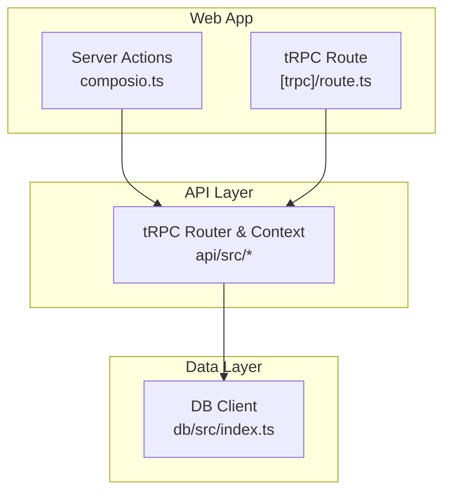
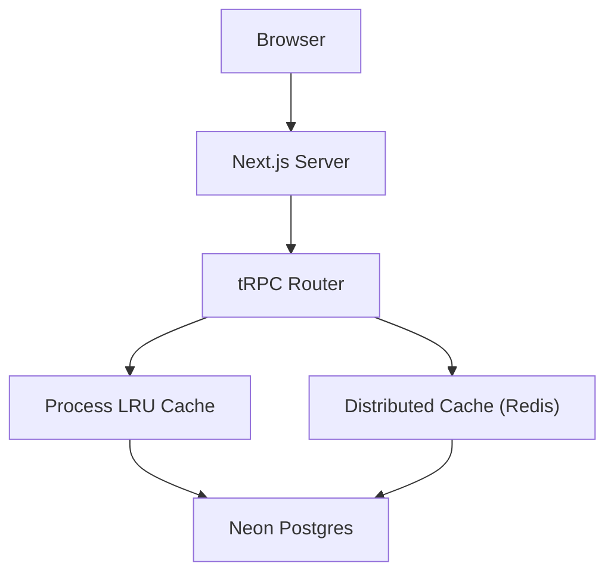
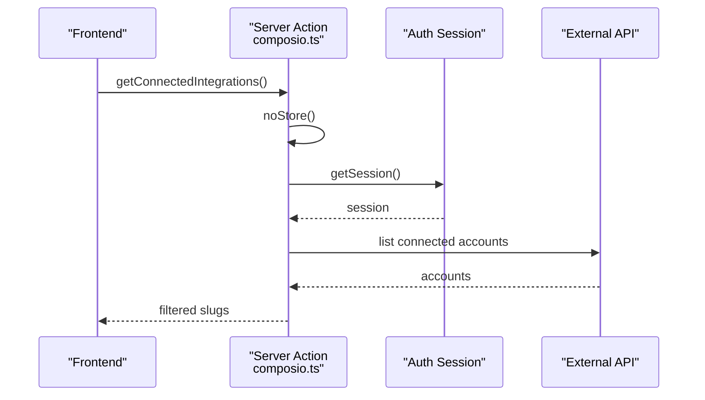
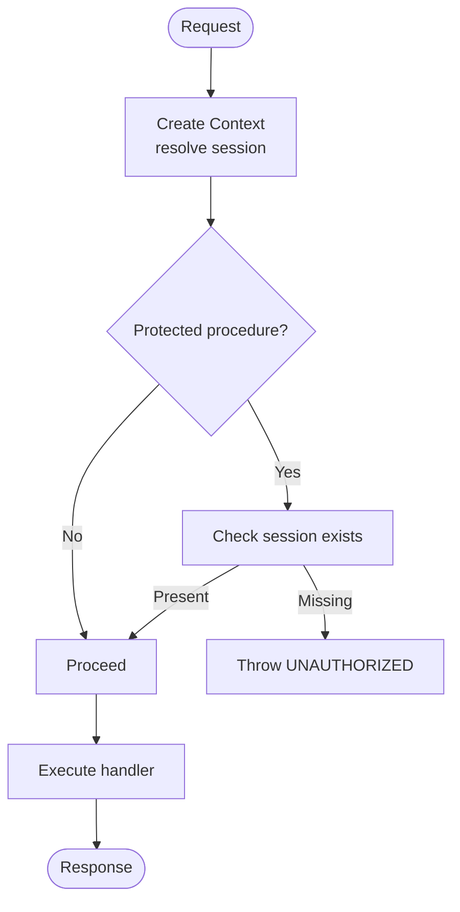
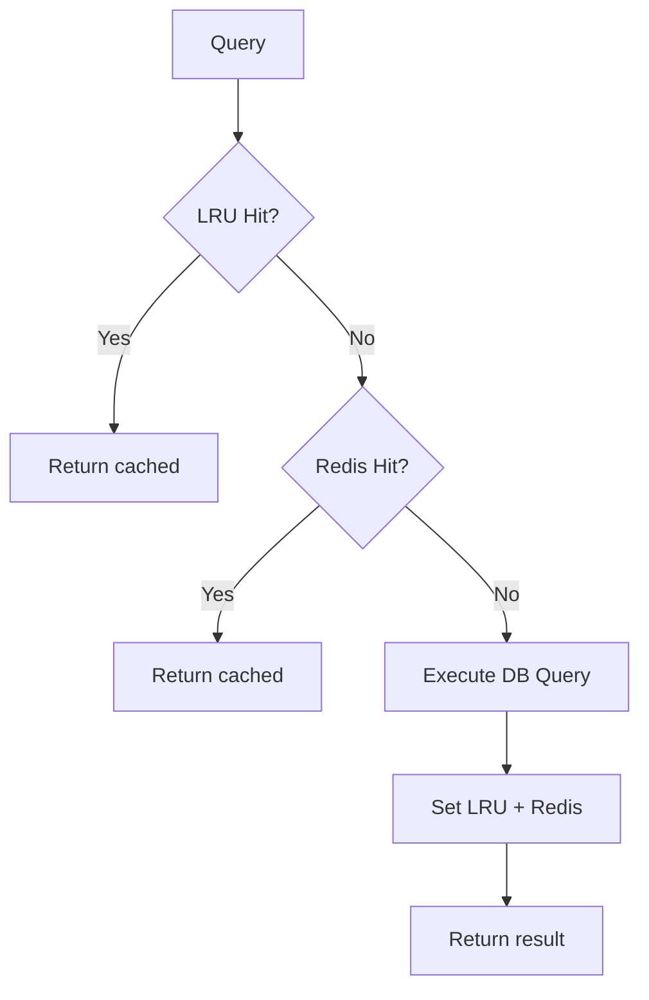
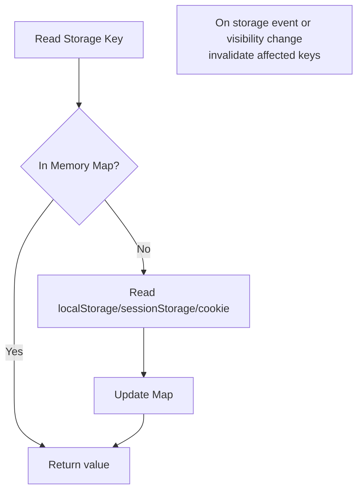
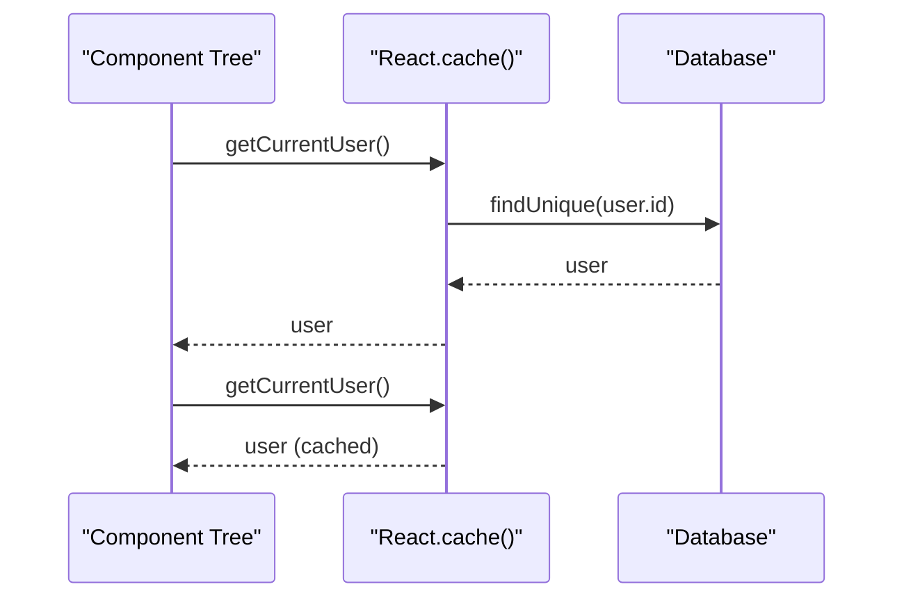
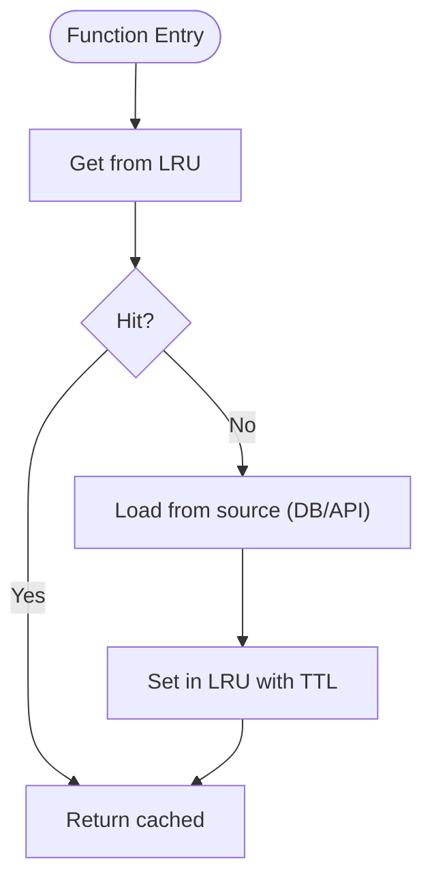
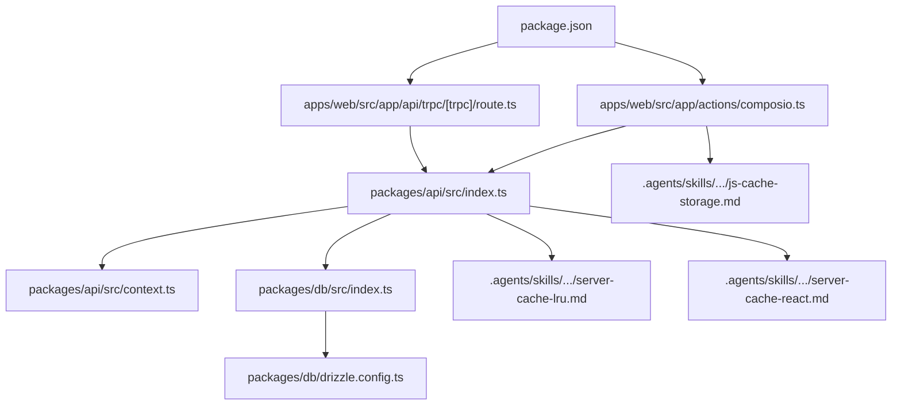

# Caching Strategies and Implementation

<cite>
**Referenced Files in This Document**
- [package.json](file://package.json)
- [apps/web/src/app/actions/composio.ts](file://apps/web/src/app/actions/composio.ts)
- [packages/api/src/index.ts](file://packages/api/src/index.ts)
- [packages/api/src/context.ts](file://packages/api/src/context.ts)
- [apps/web/src/app/api/trpc/[trpc]/route.ts](file://apps/web/src/app/api/trpc/[trpc]/route.ts)
- [packages/db/src/index.ts](file://packages/db/src/index.ts)
- [packages/db/drizzle.config.ts](file://packages/db/drizzle.config.ts)
- [.agents/skills/vercel-react-best-practices/rules/server-cache-lru.md](file://.agents/skills/vercel-react-best-practices/rules/server-cache-lru.md)
- [.agents/skills/vercel-react-best-practices/rules/server-cache-react.md](file://.agents/skills/vercel-react-best-practices/rules/server-cache-react.md)
- [.agents/skills/vercel-react-best-practices/rules/js-cache-storage.md](file://.agents/skills/vercel-react-best-practices/rules/js-cache-storage.md)
- [.agents/skills/next-cache-components-adoption/references/per-page-decisions.md](file://.agents/skills/next-cache-components-adoption/references/per-page-decisions.md)
</cite>

## Table of Contents

1. Introduction
2. Project Structure
3. Core Components
4. Architecture Overview
5. Detailed Component Analysis
6. Dependency Analysis
7. Performance Considerations
8. Troubleshooting Guide
9. Conclusion

## Introduction

This document defines a comprehensive caching strategy for the Atlas application across multiple layers:

- In-memory caching for frequently accessed data within a process or request
- Distributed caching (e.g., Redis) for cross-process scenarios
- Browser-level caching strategies for client-side performance It also covers cache invalidation, warming, coherency, API response caching, database query result caching, computed data caching, key design, TTL management, size optimization, cache-aside and write-through patterns, cache penetration prevention, monitoring, hit ratio optimization, and troubleshooting.

## Project Structure

Atlas is a monorepo with an app layer (Next.js web), shared packages (API, DB, Auth, Env, UI), and reusable skills/guides that inform best practices for caching. The current codebase includes:

- Next.js server actions using Next.js cache control
- tRPC endpoints with context-based session handling
- Database access via Drizzle ORM over Neon HTTP
- Skills and references that prescribe per-request deduplication, cross-request LRU caching, and browser storage caching

**Diagram sources**

- [apps/web/src/app/actions/composio.ts:1-85](file://apps/web/src/app/actions/composio.ts#L1-L85)
- [apps/web/src/app/api/trpc/[trpc]/route.ts:1-13](file://apps/web/src/app/api/trpc/[trpc]/route.ts#L1-L13)
- [packages/api/src/index.ts:1-25](file://packages/api/src/index.ts#L1-L25)
- [packages/api/src/context.ts:1-15](file://packages/api/src/context.ts#L1-L15)
- [packages/db/src/index.ts:1-12](file://packages/db/src/index.ts#L1-L12)

**Section sources**

- [package.json:1-66](file://package.json#L1-L66)
- [apps/web/src/app/actions/composio.ts:1-85](file://apps/web/src/app/actions/composio.ts#L1-L85)
- [apps/web/src/app/api/trpc/[trpc]/route.ts:1-13](file://apps/web/src/app/api/trpc/[trpc]/route.ts#L1-L13)
- [packages/api/src/index.ts:1-25](file://packages/api/src/index.ts#L1-L25)
- [packages/api/src/context.ts:1-15](file://packages/api/src/context.ts#L1-L15)
- [packages/db/src/index.ts:1-12](file://packages/db/src/index.ts#L1-L12)

## Core Components

- Server actions use Next.js cache directives to opt out of caching when data must be fresh (e.g., listing connected integrations).
- tRPC context resolves sessions per request; this is a natural place to add per-request caches for auth-related lookups.
- DB client uses Neon HTTP via Drizzle; suitable for adding per-request and cross-request caches around queries.
- Skills and references provide recommended patterns: React.cache() for per-request deduplication, LRUCache for cross-request caching, and Map-based caches for browser storage reads.

Key implementation anchors:

- Per-request cache boundaries and cache control in server actions
- tRPC router and protected procedures as integration points for caching middleware
- DB client factory for wrapping queries with caching layers

**Section sources**

- [apps/web/src/app/actions/composio.ts:1-85](file://apps/web/src/app/actions/composio.ts#L1-L85)
- [packages/api/src/index.ts:1-25](file://packages/api/src/index.ts#L1-L25)
- [packages/api/src/context.ts:1-15](file://packages/api/src/context.ts#L1-L15)
- [packages/db/src/index.ts:1-12](file://packages/db/src/index.ts#L1-L12)

## Architecture Overview

The caching architecture spans four layers:

- Browser: Map-based caches for localStorage/sessionStorage/cookies to reduce synchronous I/O; optional service worker or HTTP cache headers for static assets and API responses.
- Request-scoped: React.cache() and module-level caches to deduplicate work within a single request.
- Process-scoped: In-memory LRU caches (e.g., lru-cache) to share results across requests within the same process or function instance.
- Distributed: Redis-backed cache for multi-instance deployments, ensuring coherency and high availability.

**Diagram sources**

- [apps/web/src/app/api/trpc/[trpc]/route.ts:1-13](file://apps/web/src/app/api/trpc/[trpc]/route.ts#L1-L13)
- [packages/api/src/index.ts:1-25](file://packages/api/src/index.ts#L1-L25)
- [packages/db/src/index.ts:1-12](file://packages/db/src/index.ts#L1-L12)
- [.agents/skills/vercel-react-best-practices/rules/server-cache-lru.md:1-42](file://.agents/skills/vercel-react-best-practices/rules/server-cache-lru.md#L1-L42)

## Detailed Component Analysis

### Server Action Caching and Cache Control

- The server action for listing connected integrations explicitly opts out of Next.js caching to ensure fresh data per request.
- This pattern is essential for user-specific or rapidly changing data where stale responses are unacceptable.

**Diagram sources**

- [apps/web/src/app/actions/composio.ts:1-85](file://apps/web/src/app/actions/composio.ts#L1-L85)

**Section sources**

- [apps/web/src/app/actions/composio.ts:1-85](file://apps/web/src/app/actions/composio.ts#L1-L85)

### tRPC Context and Protected Procedures

- tRPC context resolves session per request; protected procedures enforce authentication before proceeding.
- This is an ideal place to attach per-request caches for session-derived data and to integrate cache-aware procedures.

**Diagram sources**

- [packages/api/src/context.ts:1-15](file://packages/api/src/context.ts#L1-L15)
- [packages/api/src/index.ts:1-25](file://packages/api/src/index.ts#L1-L25)

**Section sources**

- [packages/api/src/context.ts:1-15](file://packages/api/src/context.ts#L1-L15)
- [packages/api/src/index.ts:1-25](file://packages/api/src/index.ts#L1-L25)

### Database Access and Query Caching

- The DB client creates a Neon HTTP connection wrapped by Drizzle.
- Recommended approach: wrap read-heavy queries with a cache layer (process LRU first, then distributed Redis) using cache-aside pattern.

**Diagram sources**

- [packages/db/src/index.ts:1-12](file://packages/db/src/index.ts#L1-L12)
- [.agents/skills/vercel-react-best-practices/rules/server-cache-lru.md:1-42](file://.agents/skills/vercel-react-best-practices/rules/server-cache-lru.md#L1-L42)

**Section sources**

- [packages/db/src/index.ts:1-12](file://packages/db/src/index.ts#L1-L12)
- [.agents/skills/vercel-react-best-practices/rules/server-cache-lru.md:1-42](file://.agents/skills/vercel-react-best-practices/rules/server-cache-lru.md#L1-L42)

### Browser-Level Caching Patterns

- Use Map-based caches to avoid repeated synchronous reads from localStorage/sessionStorage/cookies.
- Invalidate on external changes (storage events, visibility changes) to keep client state coherent.

**Diagram sources**

- [.agents/skills/vercel-react-best-practices/rules/js-cache-storage.md:1-71](file://.agents/skills/vercel-react-best-practices/rules/js-cache-storage.md#L1-L71)

**Section sources**

- [.agents/skills/vercel-react-best-practices/rules/js-cache-storage.md:1-71](file://.agents/skills/vercel-react-best-practices/rules/js-cache-storage.md#L1-L71)

### Per-Request Deduplication with React.cache()

- Use React.cache() to deduplicate expensive operations within a single request (e.g., fetching current user).
- Avoid passing inline objects as arguments to prevent cache misses due to reference inequality.

**Diagram sources**

- [.agents/skills/vercel-react-best-practices/rules/server-cache-react.md:1-77](file://.agents/skills/vercel-react-best-practices/rules/server-cache-react.md#L1-L77)

**Section sources**

- [.agents/skills/vercel-react-best-practices/rules/server-cache-react.md:1-77](file://.agents/skills/vercel-react-best-practices/rules/server-cache-react.md#L1-L77)

### Cross-Request LRU Caching

- For data shared across sequential requests within the same process or function instance, use an LRU cache with TTL and max size.
- Effective with environments that reuse instances (e.g., Fluid Compute); otherwise, prefer Redis for cross-process sharing.

**Diagram sources**

- [.agents/skills/vercel-react-best-practices/rules/server-cache-lru.md:1-42](file://.agents/skills/vercel-react-best-practices/rules/server-cache-lru.md#L1-L42)

**Section sources**

- [.agents/skills/vercel-react-best-practices/rules/server-cache-lru.md:1-42](file://.agents/skills/vercel-react-best-practices/rules/server-cache-lru.md#L1-L42)

### Next.js Cache Components Guidance

- When adopting Cache Components, understand blocking vs cacheable segments and how to mark routes appropriately.
- Reads wrapped in "use cache" count as cache boundaries and do not block prerendering.

**Section sources**

- [.agents/skills/next-cache-components-adoption/references/per-page-decisions.md:19-28](file://.agents/skills/next-cache-components-adoption/references/per-page-decisions.md#L19-L28)

## Dependency Analysis

Caching touches several layers and dependencies:

- Next.js server actions rely on Next.js cache directives for per-request behavior.
- tRPC router and context provide hooks for session resolution and potential caching middleware.
- DB client depends on Neon HTTP; caching should sit above this layer to reduce load.
- Skills and references guide implementation choices for per-request and cross-request caching.

**Diagram sources**

- [package.json:1-66](file://package.json#L1-L66)
- [apps/web/src/app/actions/composio.ts:1-85](file://apps/web/src/app/actions/composio.ts#L1-L85)
- [apps/web/src/app/api/trpc/[trpc]/route.ts:1-13](file://apps/web/src/app/api/trpc/[trpc]/route.ts#L1-L13)
- [packages/api/src/index.ts:1-25](file://packages/api/src/index.ts#L1-L25)
- [packages/api/src/context.ts:1-15](file://packages/api/src/context.ts#L1-L15)
- [packages/db/src/index.ts:1-12](file://packages/db/src/index.ts#L1-L12)
- [packages/db/drizzle.config.ts:1-15](file://packages/db/drizzle.config.ts#L1-L15)
- [.agents/skills/vercel-react-best-practices/rules/server-cache-lru.md:1-42](file://.agents/skills/vercel-react-best-practices/rules/server-cache-lru.md#L1-L42)
- [.agents/skills/vercel-react-best-practices/rules/server-cache-react.md:1-77](file://.agents/skills/vercel-react-best-practices/rules/server-cache-react.md#L1-L77)
- [.agents/skills/vercel-react-best-practices/rules/js-cache-storage.md:1-71](file://.agents/skills/vercel-react-best-practices/rules/js-cache-storage.md#L1-L71)

**Section sources**

- [package.json:1-66](file://package.json#L1-L66)
- [apps/web/src/app/actions/composio.ts:1-85](file://apps/web/src/app/actions/composio.ts#L1-L85)
- [apps/web/src/app/api/trpc/[trpc]/route.ts:1-13](file://apps/web/src/app/api/trpc/[trpc]/route.ts#L1-L13)
- [packages/api/src/index.ts:1-25](file://packages/api/src/index.ts#L1-L25)
- [packages/api/src/context.ts:1-15](file://packages/api/src/context.ts#L1-L15)
- [packages/db/src/index.ts:1-12](file://packages/db/src/index.ts#L1-L12)
- [packages/db/drizzle.config.ts:1-15](file://packages/db/drizzle.config.ts#L1-L15)
- [.agents/skills/vercel-react-best-practices/rules/server-cache-lru.md:1-42](file://.agents/skills/vercel-react-best-practices/rules/server-cache-lru.md#L1-L42)
- [.agents/skills/vercel-react-best-practices/rules/server-cache-react.md:1-77](file://.agents/skills/vercel-react-best-practices/rules/server-cache-react.md#L1-L77)
- [.agents/skills/vercel-react-best-practices/rules/js-cache-storage.md:1-71](file://.agents/skills/vercel-react-best-practices/rules/js-cache-storage.md#L1-L71)

## Performance Considerations

- Prefer per-request deduplication with React.cache() to avoid redundant work within a single request.
- Use process-scoped LRU caches for hot paths that benefit from short-lived sharing across sequential requests.
- Introduce distributed caching (Redis) when running multiple processes or instances to maintain consistent hits.
- Keep browser storage reads in memory via Map caches to minimize synchronous I/O overhead.
- Tune TTLs based on data volatility; set max sizes to bound memory usage; evict least recently used entries.
- Avoid cache stampedes by implementing lock-on-miss or background refresh for popular keys.

[No sources needed since this section provides general guidance]

## Troubleshooting Guide

Common issues and remedies:

- Stale data in server actions: Ensure appropriate use of Next.js cache directives (e.g., opting out when necessary).
- Cache misses due to object arguments: Pass primitive values or stable references to cached functions.
- High memory usage: Configure LRU max size and TTL; monitor eviction rates.
- Inconsistent state across tabs: Invalidate browser caches on storage events and visibility changes.
- Cold start penalties: Implement cache warming for critical keys after deployment or restart.

**Section sources**

- [apps/web/src/app/actions/composio.ts:1-85](file://apps/web/src/app/actions/composio.ts#L1-L85)
- [.agents/skills/vercel-react-best-practices/rules/server-cache-react.md:1-77](file://.agents/skills/vercel-react-best-practices/rules/server-cache-react.md#L1-L77)
- [.agents/skills/vercel-react-best-practices/rules/js-cache-storage.md:1-71](file://.agents/skills/vercel-react-best-practices/rules/js-cache-storage.md#L1-L71)

## Conclusion

Atlas’s caching strategy should combine:

- Per-request deduplication (React.cache())
- Process-scoped LRU caches for hot data
- Distributed caching (Redis) for multi-instance consistency
- Browser-level Map caches for storage efficiency Adopt cache-aside for reads, consider write-through for writes, implement robust invalidation and warming, and continuously monitor hit ratios and latency to optimize performance.

[No sources needed since this section summarizes without analyzing specific files]
