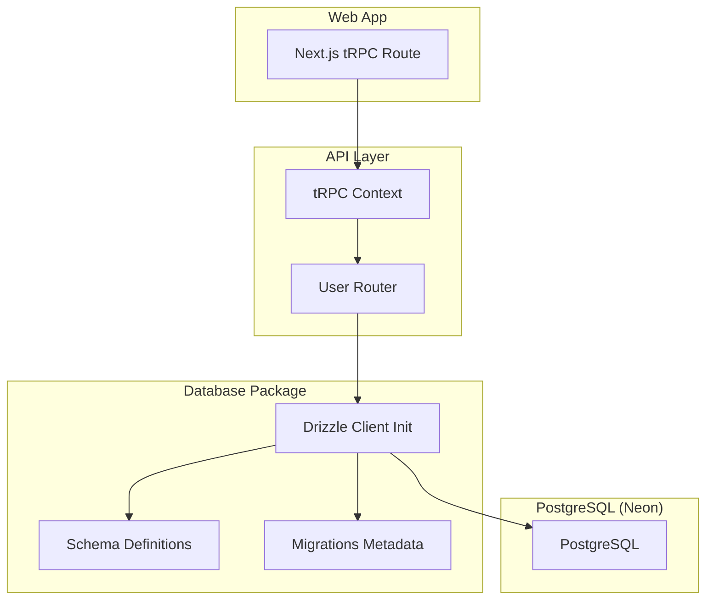
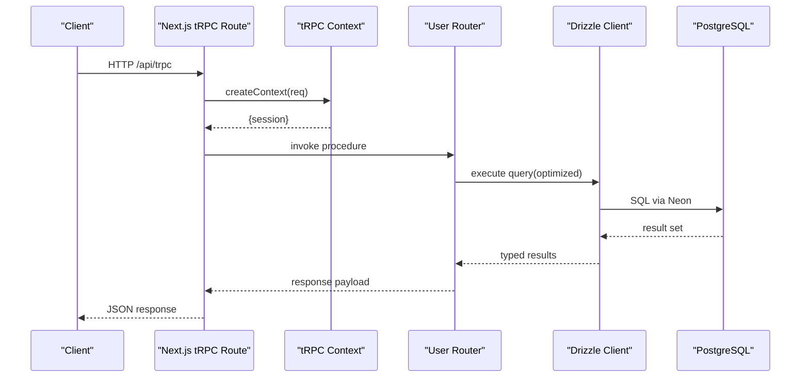
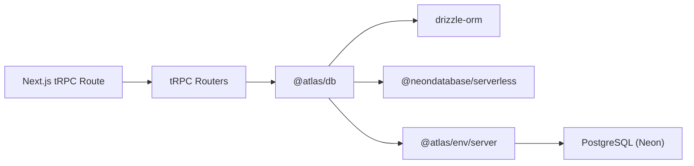
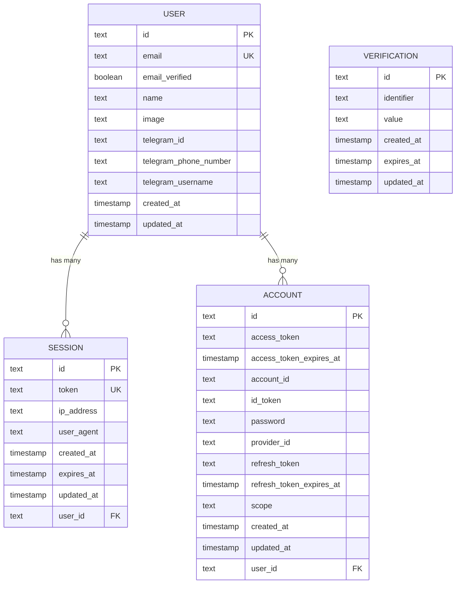

# Database Performance Optimization

<cite>
**Referenced Files in This Document**
- [packages/db/src/index.ts](file://packages/db/src/index.ts)
- [packages/db/drizzle.config.ts](file://packages/db/drizzle.config.ts)
- [packages/db/package.json](file://packages/db/package.json)
- [packages/db/src/schema/auth.ts](file://packages/db/src/schema/auth.ts)
- [packages/db/src/migrations/meta/0000_snapshot.json](file://packages/db/src/migrations/meta/0000_snapshot.json)
- [packages/env/src/server.ts](file://packages/env/src/server.ts)
- [apps/web/src/app/api/trpc/[trpc]/route.ts](file://apps/web/src/app/api/trpc/[trpc]/route.ts)
- [packages/api/src/context.ts](file://packages/api/src/context.ts)
- [packages/api/src/routers/user.ts](file://packages/api/src/routers/user.ts)
- [.agents/skills/neon-postgres/SKILL.md](file://.agents/skills/neon-postgres/SKILL.md)
</cite>

## Table of Contents

1. Introduction
2. Project Structure
3. Core Components
4. Architecture Overview
5. Detailed Component Analysis
6. Dependency Analysis
7. Performance Considerations
8. Troubleshooting Guide
9. Conclusion
10. Appendices

## Introduction

This document provides comprehensive database performance optimization guidance for the Atlas application using Drizzle ORM and PostgreSQL (via Neon). It covers query optimization, indexing strategies, connection pooling, transaction management, batch operations, N+1 prevention, schema design, monitoring slow queries, read replicas, caching strategies, materialized views, and Redis integration patterns. The recommendations are grounded in the current codebase structure and environment configuration.

## Project Structure

Atlas uses a monorepo layout with a dedicated database package that defines the schema, migrations, and a typed Drizzle client. The API layer is built with tRPC over Next.js, which orchestrates requests to data access logic. Environment variables define the database URL and other runtime settings.

**Diagram sources**

- [apps/web/src/app/api/trpc/[trpc]/route.ts:1-14](file://apps/web/src/app/api/trpc/[trpc]/route.ts#L1-L14)
- [packages/api/src/context.ts:1-15](file://packages/api/src/context.ts#L1-L15)
- [packages/api/src/routers/user.ts:1-9](file://packages/api/src/routers/user.ts#L1-L9)
- [packages/db/src/index.ts:1-13](file://packages/db/src/index.ts#L1-L13)
- [packages/db/src/schema/auth.ts:1-101](file://packages/db/src/schema/auth.ts#L1-L101)
- [packages/db/src/migrations/meta/0000_snapshot.json:1-380](file://packages/db/src/migrations/meta/0000_snapshot.json#L1-L380)

**Section sources**

- [packages/db/src/index.ts:1-13](file://packages/db/src/index.ts#L1-L13)
- [packages/db/drizzle.config.ts:1-15](file://packages/db/drizzle.config.ts#L1-L15)
- [packages/db/package.json:1-30](file://packages/db/package.json#L1-L30)
- [packages/env/src/server.ts:1-28](file://packages/env/src/server.ts#L1-L28)
- [apps/web/src/app/api/trpc/[trpc]/route.ts:1-14](file://apps/web/src/app/api/trpc/[trpc]/route.ts#L1-L14)
- [packages/api/src/context.ts:1-15](file://packages/api/src/context.ts#L1-L15)
- [packages/api/src/routers/user.ts:1-9](file://packages/api/src/routers/user.ts#L1-L9)

## Core Components

- Database client initialization: A singleton Drizzle client is created using Neon’s serverless driver and typed schema.
- Schema definitions: Auth-related tables (user, session, account, verification) with relations and indexes.
- tRPC route handler: Entry point for API requests that can call data access routines.
- Environment configuration: DATABASE_URL and other secrets validated at runtime.

Key implementation references:

- Database client creation and export: [packages/db/src/index.ts:1-13](file://packages/db/src/index.ts#L1-L13)
- Schema and relations: [packages/db/src/schema/auth.ts:1-101](file://packages/db/src/schema/auth.ts#L1-L101)
- tRPC route handler: [apps/web/src/app/api/trpc/[trpc]/route.ts:1-14](file://apps/web/src/app/api/trpc/[trpc]/route.ts#L1-L14)
- Environment validation: [packages/env/src/server.ts:1-28](file://packages/env/src/server.ts#L1-L28)

**Section sources**

- [packages/db/src/index.ts:1-13](file://packages/db/src/index.ts#L1-L13)
- [packages/db/src/schema/auth.ts:1-101](file://packages/db/src/schema/auth.ts#L1-L101)
- [apps/web/src/app/api/trpc/[trpc]/route.ts:1-14](file://apps/web/src/app/api/trpc/[trpc]/route.ts#L1-L14)
- [packages/env/src/server.ts:1-28](file://packages/env/src/server.ts#L1-L28)

## Architecture Overview

The request flow starts at the Next.js tRPC route, passes through context resolution, and invokes router procedures. Data access should use the exported Drizzle client from the database package to interact with PostgreSQL.

**Diagram sources**

- [apps/web/src/app/api/trpc/[trpc]/route.ts:1-14](file://apps/web/src/app/api/trpc/[trpc]/route.ts#L1-L14)
- [packages/api/src/context.ts:1-15](file://packages/api/src/context.ts#L1-L15)
- [packages/api/src/routers/user.ts:1-9](file://packages/api/src/routers/user.ts#L1-L9)
- [packages/db/src/index.ts:1-13](file://packages/db/src/index.ts#L1-L13)

## Detailed Component Analysis

### Database Client and Connection Strategy

- Uses Neon serverless driver with Drizzle ORM for type-safe queries.
- Single client instance is exported for reuse across the application.
- Environment variable DATABASE_URL is required and validated.

Optimization notes:

- Prefer pooled connections for web/serverless workloads; direct connections for migrations or long-running tasks.
- Ensure DATABASE_URL points to the appropriate endpoint per environment.

References:

- Client initialization: [packages/db/src/index.ts:1-13](file://packages/db/src/index.ts#L1-L13)
- Env validation: [packages/env/src/server.ts:1-28](file://packages/env/src/server.ts#L1-L28)
- Pooling guidance: [.agents/skills/neon-postgres/SKILL.md:29-54](file://.agents/skills/neon-postgres/SKILL.md#L29-L54), [.agents/skills/neon-postgres/SKILL.md:167-168](file://.agents/skills/neon-postgres/SKILL.md#L167-L168)

**Section sources**

- [packages/db/src/index.ts:1-13](file://packages/db/src/index.ts#L1-L13)
- [packages/env/src/server.ts:1-28](file://packages/env/src/server.ts#L1-L28)
- [.agents/skills/neon-postgres/SKILL.md:29-54](file://.agents/skills/neon-postgres/SKILL.md#L29-L54)
- [.agents/skills/neon-postgres/SKILL.md:167-168](file://.agents/skills/neon-postgres/SKILL.md#L167-L168)

### Schema Design and Indexing

Current schema includes user, session, account, and verification tables with relations and indexes on frequently queried columns.

Key observations:

- Primary keys on id fields ensure fast lookups by identity.
- Unique constraints on email and token prevent duplicates and enable indexed uniqueness checks.
- Explicit indexes on userId and identifier improve join and filter performance.

Recommendations:

- Add composite indexes where multi-column filters are common (e.g., user + status if applicable).
- Use appropriate data types (e.g., timestamps with defaults) and keep text sizes minimal.
- Consider partitioning large append-only tables (e.g., logs, events) by time ranges when scale requires it.

References:

- Schema definitions and indexes: [packages/db/src/schema/auth.ts:1-101](file://packages/db/src/schema/auth.ts#L1-L101)
- Migration snapshot (indexes and constraints): [packages/db/src/migrations/meta/0000_snapshot.json:1-380](file://packages/db/src/migrations/meta/0000_snapshot.json#L1-L380)

**Section sources**

- [packages/db/src/schema/auth.ts:1-101](file://packages/db/src/schema/auth.ts#L1-L101)
- [packages/db/src/migrations/meta/0000_snapshot.json:1-380](file://packages/db/src/migrations/meta/0000_snapshot.json#L1-L380)

### Query Patterns and N+1 Prevention

- Use eager loading via Drizzle relations to avoid N+1 queries when fetching related entities.
- Select only needed fields to reduce payload size and network overhead.
- Batch reads/writes where possible to minimize round trips.

Practical patterns:

- Fetch user with accounts and sessions in one query using relations.
- For list endpoints, apply pagination and selective field projection.
- Avoid nested loops that trigger per-item queries; precompute IDs and fetch in bulk.

References:

- Relations defined: [packages/db/src/schema/auth.ts:83-101](file://packages/db/src/schema/auth.ts#L83-L101)

**Section sources**

- [packages/db/src/schema/auth.ts:83-101](file://packages/db/src/schema/auth.ts#L83-L101)

### Transactions and Batch Operations

- Wrap multiple writes in a single transaction to ensure consistency and reduce lock contention.
- Use batch inserts/updates to amortize overhead across many rows.
- Keep transactions short-lived to minimize blocking and deadlocks.

Implementation guidance:

- Group related mutations into a transactional block.
- Use upserts to handle conflicts efficiently.
- Monitor transaction duration and roll back on errors early.

[No sources needed since this section provides general guidance]

### Read Replicas and Routing

- Route read-heavy queries to read replicas to offload primary write traffic.
- Maintain separate connection strings for read vs write when supported by your provider.
- Ensure routing respects tenant isolation and data locality.

[No sources needed since this section provides general guidance]

### Monitoring Slow Queries

- Enable query logging and analyze execution plans for slow queries.
- Use EXPLAIN ANALYZE to identify bottlenecks and validate index usage.
- Set thresholds for alerting on slow queries and track trends over time.

[No sources needed since this section provides general guidance]

### Caching Strategies

- Cache frequent reads at the database level using materialized views for expensive aggregations.
- Implement query result caching with Redis to reduce load on PostgreSQL.
- Invalidate caches on writes or schedule periodic refreshes for near-real-time needs.

[No sources needed since this section provides general guidance]

## Dependency Analysis

Atlas’s database dependencies include Drizzle ORM, Neon serverless driver, and environment configuration. The API layer depends on the database package for typed queries.

**Diagram sources**

- [packages/db/package.json:1-30](file://packages/db/package.json#L1-L30)
- [packages/db/src/index.ts:1-13](file://packages/db/src/index.ts#L1-L13)
- [packages/env/src/server.ts:1-28](file://packages/env/src/server.ts#L1-L28)
- [apps/web/src/app/api/trpc/[trpc]/route.ts:1-14](file://apps/web/src/app/api/trpc/[trpc]/route.ts#L1-L14)

**Section sources**

- [packages/db/package.json:1-30](file://packages/db/package.json#L1-L30)
- [packages/db/src/index.ts:1-13](file://packages/db/src/index.ts#L1-L13)
- [packages/env/src/server.ts:1-28](file://packages/env/src/server.ts#L1-L28)
- [apps/web/src/app/api/trpc/[trpc]/route.ts:1-14](file://apps/web/src/app/api/trpc/[trpc]/route.ts#L1-L14)

## Performance Considerations

- Connection pooling: Use pooled connections for web/serverless workloads; direct connections for migrations and admin tasks. See guidance on when to choose pooled vs direct connections.
- Indexing strategy: Ensure indexes align with WHERE, JOIN, and ORDER BY clauses; add composite indexes for common filter combinations.
- Query plan analysis: Regularly review EXPLAIN output; prefer index scans over sequential scans; avoid functions on indexed columns in predicates.
- Eager loading: Leverage relations to fetch related data in fewer queries; project only necessary fields.
- Transactions: Keep them short; group related writes; handle errors promptly.
- Batch operations: Use bulk inserts/updates to reduce overhead.
- Read replicas: Offload reads to replicas to increase throughput.
- Caching: Apply materialized views for heavy analytics; cache hot reads with Redis; implement invalidation policies.

[No sources needed since this section provides general guidance]

## Troubleshooting Guide

Common issues and mitigations:

- Prepared statement conflicts or session state drift when using pooled connections for migrations or admin tasks. Use direct connections for such operations.
- Read-only transaction errors when accidentally hitting a pooled backend configured for reads during writes. Ensure correct endpoint selection.
- Missing indexes causing full table scans. Validate query plans and add targeted indexes.
- N+1 queries leading to high latency. Refactor to eager loading and batched queries.

References:

- Pooling pitfalls and migration guidance: [.agents/skills/neon-postgres/SKILL.md:167-168](file://.agents/skills/neon-postgres/SKILL.md#L167-L168)

**Section sources**

- [.agents/skills/neon-postgres/SKILL.md:167-168](file://.agents/skills/neon-postgres/SKILL.md#L167-L168)

## Conclusion

Atlas’s database layer is well-structured with Drizzle ORM and Neon, providing a solid foundation for performance optimization. By applying proper indexing, efficient query patterns, transaction best practices, and caching strategies, you can significantly improve throughput and responsiveness. Continuously monitor query performance and refine schemas and indexes as data grows.

[No sources needed since this section summarizes without analyzing specific files]

## Appendices

### Schema ER Diagram

**Diagram sources**

- [packages/db/src/schema/auth.ts:1-101](file://packages/db/src/schema/auth.ts#L1-L101)
- [packages/db/src/migrations/meta/0000_snapshot.json:1-380](file://packages/db/src/migrations/meta/0000_snapshot.json#L1-L380)

### Request Flow Sequence

**Diagram sources**

- [apps/web/src/app/api/trpc/[trpc]/route.ts:1-14](file://apps/web/src/app/api/trpc/[trpc]/route.ts#L1-L14)
- [packages/api/src/context.ts:1-15](file://packages/api/src/context.ts#L1-L15)
- [packages/api/src/routers/user.ts:1-9](file://packages/api/src/routers/user.ts#L1-L9)
- [packages/db/src/index.ts:1-13](file://packages/db/src/index.ts#L1-L13)
