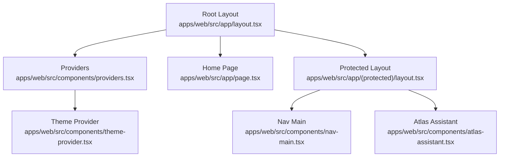
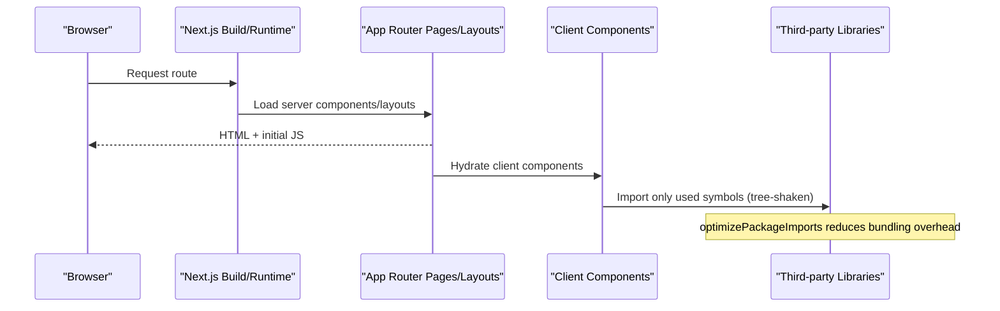
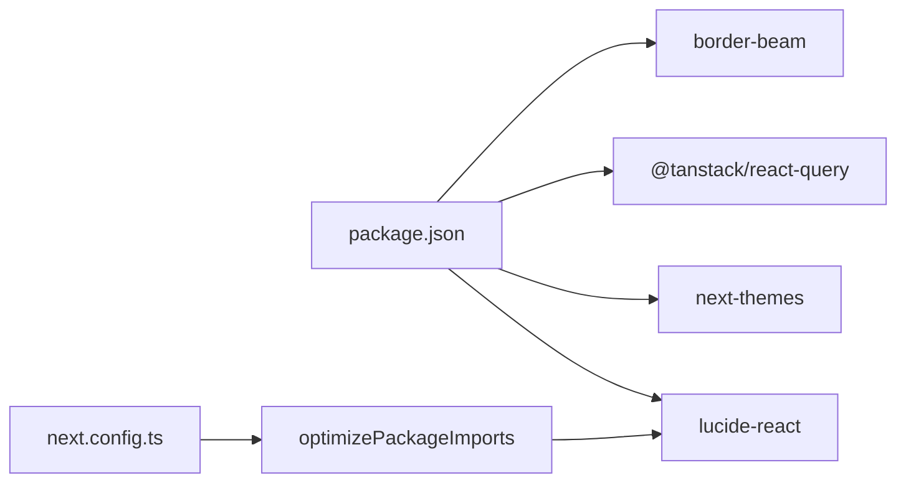

# Bundle Size Optimization

<cite>
**Referenced Files in This Document**
- [next.config.ts](file://apps/web/next.config.ts)
- [package.json](file://apps/web/package.json)
- [postcss.config.mjs](file://apps/web/postcss.config.mjs)
- [layout.tsx](file://apps/web/src/app/layout.tsx)
- [providers.tsx](file://apps/web/src/components/providers.tsx)
- [theme-provider.tsx](file://apps/web/src/components/theme-provider.tsx)
- [page.tsx](file://apps/web/src/app/page.tsx)
- [protected-layout.tsx](file://apps/web/src/app/(protected)/layout.tsx)
- [atlas-assistant.tsx](file://apps/web/src/components/atlas-assistant.tsx)
- [nav-main.tsx](file://apps/web/src/components/nav-main.tsx)
</cite>

## Table of Contents

1. Introduction
2. Project Structure
3. Core Components
4. Architecture Overview
5. Detailed Component Analysis
6. Dependency Analysis
7. Performance Considerations
8. Troubleshooting Guide
9. Conclusion

## Introduction

This document provides a comprehensive guide to optimizing bundle size for the Atlas Next.js application. It covers automatic route-based code splitting, manual dynamic imports for heavy dependencies, tree shaking configuration, package import optimization (including optimizePackageImports), lazy loading patterns, conditional imports based on roles or features, third-party library optimization, unused React component removal, and CSS bundle size reduction via Tailwind CSS purging. The guidance is grounded in the current project configuration and source files.

## Project Structure

The web application uses Next.js App Router with client components marked by "use client" directives. Key areas impacting bundle size include:

- Global layout and providers that wrap the app
- Protected routes that gate access and compose UI
- Client-side components that may be heavy or conditionally used
- Configuration for Next.js optimizations and PostCSS/Tailwind processing

**Diagram sources**

- [layout.tsx:1-47](file://apps/web/src/app/layout.tsx#L1-L47)
- [providers.tsx:1-27](file://apps/web/src/components/providers.tsx#L1-L27)
- [theme-provider.tsx:1-12](file://apps/web/src/components/theme-provider.tsx#L1-L12)
- [page.tsx:1-39](file://apps/web/src/app/page.tsx#L1-L39)
- [protected-layout.tsx:1-66](<file://apps/web/src/app/(protected)/layout.tsx#L1-L66>)
- [nav-main.tsx:1-64](file://apps/web/src/components/nav-main.tsx#L1-L64)
- [atlas-assistant.tsx:1-175](file://apps/web/src/components/atlas-assistant.tsx#L1-L175)

**Section sources**

- [layout.tsx:1-47](file://apps/web/src/app/layout.tsx#L1-L47)
- [providers.tsx:1-27](file://apps/web/src/components/providers.tsx#L1-L27)
- [theme-provider.tsx:1-12](file://apps/web/src/components/theme-provider.tsx#L1-L12)
- [page.tsx:1-39](file://apps/web/src/app/page.tsx#L1-L39)
- [protected-layout.tsx:1-66](<file://apps/web/src/app/(protected)/layout.tsx#L1-L66>)
- [nav-main.tsx:1-64](file://apps/web/src/components/nav-main.tsx#L1-L64)
- [atlas-assistant.tsx:1-175](file://apps/web/src/components/atlas-assistant.tsx#L1-L175)

## Core Components

- Root layout sets up fonts and global providers; it is a good place to ensure minimal client-side overhead.
- Providers wraps theme and query client; keep it lean and avoid importing heavy dev-only tools in production.
- Theme provider delegates to next-themes; consider lazy initialization if theme toggling is not critical on first paint.
- Home page demonstrates a simple client component using data fetching hooks.
- Protected layout gates access and composes sidebar, header, and assistant panel.
- Nav main and atlas-assistant are client components that can benefit from lazy loading and selective icon imports.

**Section sources**

- [layout.tsx:1-47](file://apps/web/src/app/layout.tsx#L1-L47)
- [providers.tsx:1-27](file://apps/web/src/components/providers.tsx#L1-L27)
- [theme-provider.tsx:1-12](file://apps/web/src/components/theme-provider.tsx#L1-L12)
- [page.tsx:1-39](file://apps/web/src/app/page.tsx#L1-L39)
- [protected-layout.tsx:1-66](<file://apps/web/src/app/(protected)/layout.tsx#L1-L66>)
- [nav-main.tsx:1-64](file://apps/web/src/components/nav-main.tsx#L1-L64)
- [atlas-assistant.tsx:1-175](file://apps/web/src/components/atlas-assistant.tsx#L1-L175)

## Architecture Overview

Next.js automatically splits code per route and per component boundary. In this project:

- Route-based splitting occurs naturally due to App Router pages and layouts.
- Client components ("use client") are isolated into client bundles.
- Third-party libraries like lucide-react are optimized via Next.js experimental optimizePackageImports.
- Tailwind CSS is processed through PostCSS; ensure purging removes unused styles.

**Diagram sources**

- [next.config.ts:4-10](file://apps/web/next.config.ts#L4-L10)
- [layout.tsx:1-47](file://apps/web/src/app/layout.tsx#L1-L47)
- [providers.tsx:1-27](file://apps/web/src/components/providers.tsx#L1-L27)
- [nav-main.tsx:1-64](file://apps/web/src/components/nav-main.tsx#L1-L64)
- [atlas-assistant.tsx:1-175](file://apps/web/src/components/atlas-assistant.tsx#L1-L175)

## Detailed Component Analysis

### Automatic Route-Based Code Splitting

- Each route under apps/web/src/app/* is split into its own chunk by Next.js.
- Protected routes are grouped under (protected), enabling shared layout chunks while keeping page-specific code separate.
- Ensure heavy logic stays within page-level components to maximize splitting benefits.

Recommendations:

- Keep server components on the server side; move only necessary interactivity to client components.
- Avoid importing large libraries at the root layout unless they are needed everywhere.

**Section sources**

- [protected-layout.tsx:1-66](<file://apps/web/src/app/(protected)/layout.tsx#L1-L66>)
- [page.tsx:1-39](file://apps/web/src/app/page.tsx#L1-L39)

### Manual Dynamic Imports for Heavy Dependencies

Use dynamic imports to defer loading non-critical or heavy modules until they are needed:

- Defer analytics, heavy charts, or AI integrations behind user interactions.
- Use dynamic() with options to control loading behavior and error handling.

Example pattern (conceptual):

- Lazy-load a charting library when a chart tab is opened.
- Lazy-load an AI chat module when the assistant panel opens.

Benefits:

- Reduces initial bundle size.
- Improves Time to Interactive (TTI).

[No sources needed since this section provides conceptual guidance]

### Tree Shaking Configuration

- Next.js leverages SWC and modern bundlers to tree shake unused exports.
- Ensure you import only what you use from libraries (e.g., named imports from lucide-react).
- Avoid barrel re-exports that can obscure dead code elimination.

Current setup highlights:

- optimizePackageImports is enabled for lucide-react to reduce import overhead.
- React Compiler is enabled for additional runtime optimizations.

**Section sources**

- [next.config.ts:4-10](file://apps/web/next.config.ts#L4-L10)
- [package.json:11-35](file://apps/web/package.json#L11-L35)

### Package Import Optimization with optimizePackageImports

- lucide-react is listed in optimizePackageImports to minimize bundle impact when importing individual icons.
- This ensures only requested icons are included and avoids bundling the entire icon set.

Action items:

- Continue using named imports for icons.
- Audit other large libraries and add them to optimizePackageImports where applicable.

**Section sources**

- [next.config.ts:4-10](file://apps/web/next.config.ts#L4-L10)
- [package.json:11-35](file://apps/web/package.json#L11-L35)

### Lazy Loading Heavy Components

- Defer non-critical UI such as the assistant panel or complex dashboards until needed.
- Implement lazy loading around components that are conditionally rendered or opened by users.

Patterns:

- Lazy-load the assistant panel when the user triggers it.
- Lazy-load heavy dashboard widgets when tabs are activated.

**Section sources**

- [atlas-assistant.tsx:1-175](file://apps/web/src/components/atlas-assistant.tsx#L1-L175)
- [protected-layout.tsx:1-66](<file://apps/web/src/app/(protected)/layout.tsx#L1-L66>)

### Conditional Imports Based on Roles or Features

- Gate feature-rich components behind role checks or feature flags to avoid shipping unnecessary code.
- Use dynamic imports inside guards to load features only for authorized users.

Example approach:

- If a user lacks admin privileges, skip loading admin-only panels.
- For feature flags, dynamically import modules only when the flag is enabled.

[No sources needed since this section provides conceptual guidance]

### Analyzing Bundle Composition with webpack-bundle-analyzer

- Integrate a bundle analyzer to visualize chunk sizes and identify oversized dependencies.
- Run analysis after builds to track regressions and validate optimizations.

Steps:

- Add a build script that generates an analyzer report.
- Review top contributors and target them for optimization.

[No sources needed since this section provides conceptual guidance]

### Third-Party Library Optimization

- Prefer libraries that support tree shaking and modular imports.
- Remove unused dev dependencies from production builds.
- Replace heavy packages with lighter alternatives when possible.

Current observations:

- lucide-react usage is optimized via configure imports.
- Ensure dev-only tools (like React Query Devtools) are excluded from production bundles.

**Section sources**

- [next.config.ts:4-10](file://apps/web/next.config.ts#L4-L10)
- [package.json:36-45](file://apps/web/package.json#L36-L45)
- [providers.tsx:1-27](file://apps/web/src/components/providers.tsx#L1-L27)

### Removing Unused React Components

- Audit components that are no longer referenced and remove them.
- Avoid importing unused components in layouts or providers.
- Use linters and static analysis to detect dead code.

**Section sources**

- [layout.tsx:1-47](file://apps/web/src/app/layout.tsx#L1-L47)
- [providers.tsx:1-27](file://apps/web/src/components/providers.tsx#L1-L27)

### Optimizing CSS Bundle Size with Tailwind CSS Purging

- Tailwind processes CSS via PostCSS; ensure purging removes unused classes.
- Configure content paths to include all templates and components so Tailwind knows which classes to keep.
- Verify that index.css does not import unused utilities.

Current setup:

- PostCSS uses @tailwindcss/postcss plugin.
- Confirm purge/content settings in Tailwind config (if present) cover all source files.

**Section sources**

- [postcss.config.mjs:1-6](file://apps/web/postcss.config.mjs#L1-L6)
- [layout.tsx:1-47](file://apps/web/src/app/layout.tsx#L1-L47)

## Dependency Analysis

Key dependencies influencing bundle size:

- lucide-react: Optimized via optimizePackageImports; use named imports.
- next-themes: Used for theme management; ensure minimal runtime overhead.
- @tanstack/react-query: Data fetching; keep devtools out of production.
- border-beam: Visual effect; consider lazy-loading if not critical.

**Diagram sources**

- [package.json:11-35](file://apps/web/package.json#L11-L35)
- [next.config.ts:4-10](file://apps/web/next.config.ts#L4-L10)

**Section sources**

- [package.json:11-35](file://apps/web/package.json#L11-L35)
- [next.config.ts:4-10](file://apps/web/next.config.ts#L4-L10)

## Performance Considerations

- Leverage Next.js automatic code splitting and partialPrefetching to improve perceived performance.
- Enable React Compiler for faster renders and reduced overhead.
- Minimize client components in root layout; prefer server components for static content.
- Use image optimization and limit remote patterns to trusted domains.

**Section sources**

- [next.config.ts:4-19](file://apps/web/next.config.ts#L4-L19)
- [layout.tsx:1-47](file://apps/web/src/app/layout.tsx#L1-L47)

## Troubleshooting Guide

Common issues and resolutions:

- Large icon bundles: Ensure named imports from lucide-react and verify optimizePackageImports is active.
- Dev tools in production: Confirm dev-only packages are not imported in production builds.
- CSS bloat: Validate Tailwind purge/content includes all source paths; remove unused classes.
- Slow hydration: Reduce "use client" scope; move logic to server components where possible.

Actions:

- Run bundle analysis to pinpoint large chunks.
- Audit imports across components to eliminate unused dependencies.
- Test builds in production mode to catch development-only leaks.

**Section sources**

- [next.config.ts:4-10](file://apps/web/next.config.ts#L4-L10)
- [providers.tsx:1-27](file://apps/web/src/components/providers.tsx#L1-L27)
- [postcss.config.mjs:1-6](file://apps/web/postcss.config.mjs#L1-L6)

## Conclusion

By combining Next.js route-based code splitting, targeted dynamic imports, tree shaking, and package import optimization, the Atlas application can significantly reduce its bundle size. Focus on minimizing client-side overhead, removing unused code, and optimizing third-party libraries. Regularly analyze bundle composition and refine configurations to maintain optimal performance as the application grows.
