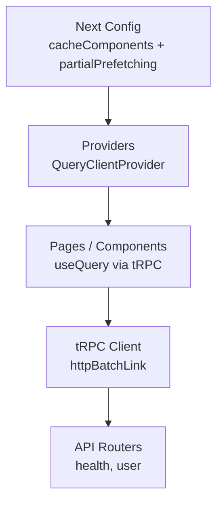
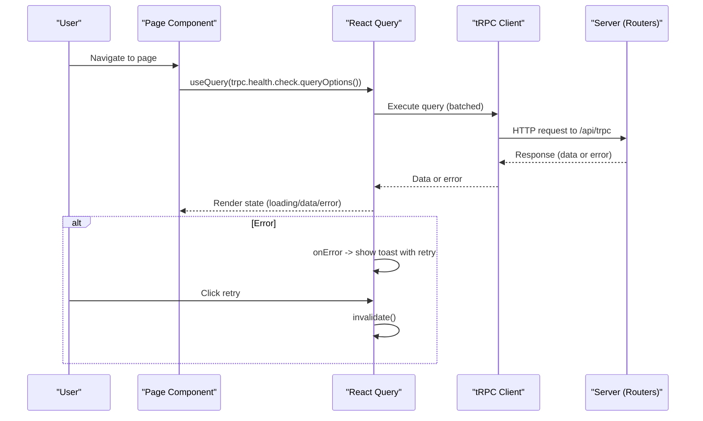
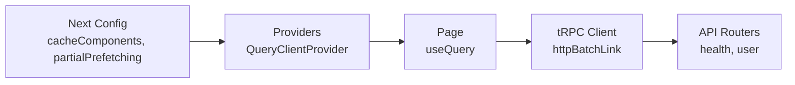

# Caching and Prefetching Strategies

<cite>
**Referenced Files in This Document**
- [next.config.ts](file://apps/web/next.config.ts)
- [package.json](file://apps/web/package.json)
- [providers.tsx](file://apps/web/src/components/providers.tsx)
- [trpc.ts](file://apps/web/src/utils/trpc.ts)
- [page.tsx](file://apps/web/src/app/page.tsx)
- [health.ts](file://packages/api/src/routers/health.ts)
- [user.ts](file://packages/api/src/routers/user.ts)
- [server-cache-react.md](file://.agents/skills/vercel-react-best-practices/rules/server-cache-react.md)
- [js-cache-storage.md](file://.agents/skills/vercel-react-best-practices/rules/js-cache-storage.md)
- [rendering-hydration-no-flicker.md](file://.agents/skills/vercel-react-best-practices/rules/rendering-hydration-no-flicker.md)
- [per-page-decisions.md](file://.agents/skills/next-cache-components-adoption/references/per-page-decisions.md)
</cite>

## Table of Contents

1. [Introduction](#introduction)
2. [Project Structure](#project-structure)
3. [Core Components](#core-components)
4. [Architecture Overview](#architecture-overview)
5. [Detailed Component Analysis](#detailed-component-analysis)
6. [Dependency Analysis](#dependency-analysis)
7. [Performance Considerations](#performance-considerations)
8. [Troubleshooting Guide](#troubleshooting-guide)
9. [Conclusion](#conclusion)
10. [Appendices](#appendices)

## Introduction

This document explains caching and prefetching strategies for the Atlas frontend application, focusing on:

- Next.js component caching via cacheComponents configuration
- Partial prefetching behavior and when to use it
- Client-side caching patterns (function result caching, property access caching, storage-based caching)
- Intelligent data fetching with TanStack Query and cache invalidation strategies
- Browser caching headers and service worker considerations for offline support
- Monitoring cache effectiveness

The goal is to provide actionable guidance grounded in the repository’s configuration and code while aligning with best practices from the included skills.

## Project Structure

Atlas’s web app is a Next.js application that integrates TanStack Query for client-side data management and tRPC for type-safe API calls. The root configuration enables key performance features such as component caching and partial prefetching. Providers wrap the app with React Query, and pages consume data through tRPC hooks.

**Diagram sources**

- [next.config.ts:4-19](file://apps/web/next.config.ts#L4-L19)
- [providers.tsx:11-24](file://apps/web/src/components/providers.tsx#L11-L24)
- [trpc.ts:22-39](file://apps/web/src/utils/trpc.ts#L22-L39)
- [health.ts:3-5](file://packages/api/src/routers/health.ts#L3-L5)
- [user.ts:3-8](file://packages/api/src/routers/user.ts#L3-L8)

**Section sources**

- [next.config.ts:4-19](file://apps/web/next.config.ts#L4-L19)
- [package.json:18-22](file://apps/web/package.json#L18-L22)
- [providers.tsx:11-24](file://apps/web/src/components/providers.tsx#L11-L24)
- [trpc.ts:22-39](file://apps/web/src/utils/trpc.ts#L22-L39)
- [health.ts:3-5](file://packages/api/src/routers/health.ts#L3-L5)
- [user.ts:3-8](file://packages/api/src/routers/user.ts#L3-L8)

## Core Components

- Next.js configuration enables:
  - cacheComponents: true for server-rendered component caching
  - partialPrefetching: true for optimized data streaming and prefetch behavior
- React Query provider wraps the app to enable global query caching and revalidation
- tRPC client configured with httpBatchLink and credentials handling
- Pages use tRPC hooks to fetch data; errors are surfaced via toast with retry actions

Key implementation references:

- Next.js config enabling cacheComponents and partialPrefetching
- Providers wiring QueryClientProvider
- tRPC client setup with error handling and batch link
- Example page using useQuery to call health endpoint

**Section sources**

- [next.config.ts:4-19](file://apps/web/next.config.ts#L4-L19)
- [providers.tsx:11-24](file://apps/web/src/components/providers.tsx#L11-L24)
- [trpc.ts:7-39](file://apps/web/src/utils/trpc.ts#L7-L39)
- [page.tsx:8-37](file://apps/web/src/app/page.tsx#L8-L37)

## Architecture Overview

The data flow combines server-side optimizations (component caching, partial prefetching) with client-side caching (React Query). Requests are batched via tRPC and cached per query key. Errors trigger user feedback and allow retry by invalidating queries.

**Diagram sources**

- [page.tsx:8-37](file://apps/web/src/app/page.tsx#L8-L37)
- [trpc.ts:7-39](file://apps/web/src/utils/trpc.ts#L7-L39)
- [health.ts:3-5](file://packages/api/src/routers/health.ts#L3-L5)

## Detailed Component Analysis

### Next.js Component Caching (cacheComponents)

- Enabling cacheComponents allows Next.js to cache server-rendered components, reducing repeated rendering work across requests and improving Time to Interactive.
- When combined with partialPrefetching, this can significantly reduce perceived latency by streaming only necessary parts of the UI and data.

Guidance:

- Use cacheComponents for routes where static shells and reusable components benefit from caching.
- For truly per-request content, consider blocking patterns documented in the skills.

**Section sources**

- [next.config.ts:4-19](file://apps/web/next.config.ts#L4-L19)
- [per-page-decisions.md:23-28](file://.agents/skills/next-cache-components-adoption/references/per-page-decisions.md#L23-L28)

### Partial Prefetching

- partialPrefetching is enabled to optimize how Next.js streams and preloads data during navigation and rendering.
- Use cases:
  - Fast initial paint with deferred non-critical sections
  - Improved interactivity by prioritizing critical UI and data

When to use:

- Pages with mixed critical and non-critical content
- Routes where you want to minimize blocking while still delivering essential data quickly

**Section sources**

- [next.config.ts:4-19](file://apps/web/next.config.ts#L4-L19)

### Client-Side Caching Patterns

#### Function Result Caching (Server-Side Deduplication)

- Use React.cache() to deduplicate expensive operations within a single request (e.g., DB queries, auth checks).
- Avoid passing inline objects as arguments to prevent cache misses due to reference changes.

Best practices:

- Prefer primitive arguments or stable object references
- Reserve React.cache() for non-fetch async work like database queries and heavy computations

**Section sources**

- [server-cache-react.md:1-77](file://.agents/skills/vercel-react-best-practices/rules/server-cache-react.md#L1-L77)

#### Property Access Caching

- Defer reading dynamic properties (like searchParams) until usage points to avoid unnecessary subscriptions and rerenders.
- Read directly inside event handlers when not needed for render.

**Section sources**

- [rerender-defer-reads.md:1-40](file://.agents/skills/vercel-react-best-practices/rules/rerender-defer-reads.md#L1-L40)

#### Storage-Based Caching

- Cache reads from localStorage/sessionStorage/cookies in memory to reduce synchronous I/O overhead.
- Invalidate caches on external changes (storage events, visibility changes).

Implementation tips:

- Use Map for in-memory caching
- Keep cache in sync on writes
- Listen for cross-tab storage updates and clear on visibility change

**Section sources**

- [js-cache-storage.md:1-71](file://.agents/skills/vercel-react-best-practices/rules/js-cache-storage.md#L1-L71)

### Intelligent Data Fetching with TanStack Query

- The app uses QueryClientProvider to enable global caching and revalidation.
- tRPC integration batches requests and handles credentials.
- Error handling shows a toast with a retry action that invalidates the query.

Recommendations:

- Configure staleTime and gcTime based on data volatility
- Use invalidateQueries after mutations to keep UI consistent
- Leverage query keys to scope cache entries precisely

**Section sources**

- [providers.tsx:11-24](file://apps/web/src/components/providers.tsx#L11-L24)
- [trpc.ts:7-39](file://apps/web/src/utils/trpc.ts#L7-L39)
- [page.tsx:8-37](file://apps/web/src/app/page.tsx#L8-L37)

### Cache Invalidation Strategies

- On error, the current setup surfaces a toast with a retry action that triggers query invalidation.
- After successful mutations, invalidate related queries to refresh UI state.
- Scope invalidation by query key to avoid over-invalidation.

Operational notes:

- Ensure query keys reflect data dependencies (e.g., user id, filters)
- Combine with optimistic updates where appropriate to improve UX

**Section sources**

- [trpc.ts:7-19](file://apps/web/src/utils/trpc.ts#L7-L19)

### Optimizing API Response Caching

- Batch links reduce network overhead by grouping multiple tRPC calls.
- Credentials are included to maintain session consistency.
- Consider adding response-level caching headers on the server side for repeatable endpoints to leverage browser and CDN caches.

**Section sources**

- [trpc.ts:22-39](file://apps/web/src/utils/trpc.ts#L22-L39)

### Browser Caching Headers

- While not explicitly set in the provided files, configure server responses with appropriate Cache-Control headers for static assets and repeatable API responses.
- Use immutable for assets with content hashes and short-lived caching for volatile data.

[No sources needed since this section provides general guidance]

### Service Worker Implementation for Offline Support

- Introduce a service worker to cache critical shell resources and implement background sync for offline resilience.
- Define cache strategies per resource type (stale-while-revalidate for API, cache-first for static assets).
- Coordinate with React Query to handle offline states and retries.

[No sources needed since this section provides general guidance]

### Monitoring Cache Effectiveness

- Enable React Query DevTools in development to inspect cache entries, hits, and invalidations.
- Track metrics such as cache hit ratios, network requests avoided, and time-to-interactive improvements.
- Instrument custom telemetry around query execution and cache misses.

**Section sources**

- [package.json:39-39](file://apps/web/package.json#L39-L39)

## Dependency Analysis

The following diagram maps core dependencies involved in caching and data fetching:

**Diagram sources**

- [next.config.ts:4-19](file://apps/web/next.config.ts#L4-L19)
- [providers.tsx:11-24](file://apps/web/src/components/providers.tsx#L11-L24)
- [page.tsx:8-37](file://apps/web/src/app/page.tsx#L8-L37)
- [trpc.ts:22-39](file://apps/web/src/utils/trpc.ts#L22-L39)
- [health.ts:3-5](file://packages/api/src/routers/health.ts#L3-L5)
- [user.ts:3-8](file://packages/api/src/routers/user.ts#L3-L8)

**Section sources**

- [next.config.ts:4-19](file://apps/web/next.config.ts#L4-L19)
- [providers.tsx:11-24](file://apps/web/src/components/providers.tsx#L11-L24)
- [page.tsx:8-37](file://apps/web/src/app/page.tsx#L8-L37)
- [trpc.ts:22-39](file://apps/web/src/utils/trpc.ts#L22-L39)
- [health.ts:3-5](file://packages/api/src/routers/health.ts#L3-L5)
- [user.ts:3-8](file://packages/api/src/routers/user.ts#L3-L8)

## Performance Considerations

- Prefer parallel nested data fetching on the server to eliminate waterfalls.
- Use React.cache() for expensive server-side operations beyond fetch.
- Minimize synchronous storage reads by caching in memory and invalidating appropriately.
- Prevent hydration mismatches to avoid visual flicker and extra renders.

**Section sources**

- [server-parallel-nested-fetching.md:1-33](file://.agents/skills/vercel-react-best-practices/rules/server-parallel-nested-fetching.md#L1-L33)
- [server-cache-react.md:1-77](file://.agents/skills/vercel-react-best-practices/rules/server-cache-react.md#L1-L77)
- [js-cache-storage.md:1-71](file://.agents/skills/vercel-react-best-practices/rules/js-cache-storage.md#L1-L71)
- [rendering-hydration-no-flicker.md:1-68](file://.agents/skills/vercel-react-best-practices/rules/rendering-hydration-no-flicker.md#L1-L68)

## Troubleshooting Guide

Common issues and resolutions:

- Hydration mismatch causing flicker: Inject a synchronous script to apply theme before React hydrates.
- Excessive storage reads: Cache localStorage/sessionStorage/cookie reads in memory and invalidate on external changes.
- Unnecessary rerenders: Defer reading dynamic state until usage point.
- Query errors: Use built-in error handling to notify users and offer retry via invalidation.

**Section sources**

- [rendering-hydration-no-flicker.md:1-68](file://.agents/skills/vercel-react-best-practices/rules/rendering-hydration-no-flicker.md#L1-L68)
- [js-cache-storage.md:1-71](file://.agents/skills/vercel-react-best-practices/rules/js-cache-storage.md#L1-L71)
- [trpc.ts:7-19](file://apps/web/src/utils/trpc.ts#L7-L19)

## Conclusion

Atlas’s frontend leverages Next.js component caching and partial prefetching alongside React Query for robust client-side caching. By combining these with intelligent data fetching, proper invalidation, and storage caching patterns, the application achieves fast, responsive experiences. Monitor cache effectiveness and refine strategies based on real-world metrics to continuously improve performance.

## Appendices

### Configuration Summary

- Next.js: cacheComponents and partialPrefetching enabled
- React Query: Provider configured globally
- tRPC: Batched HTTP link with credentials
- API: Health and user routers available for querying

**Section sources**

- [next.config.ts:4-19](file://apps/web/next.config.ts#L4-L19)
- [providers.tsx:11-24](file://apps/web/src/components/providers.tsx#L11-L24)
- [trpc.ts:22-39](file://apps/web/src/utils/trpc.ts#L22-L39)
- [health.ts:3-5](file://packages/api/src/routers/health.ts#L3-L5)
- [user.ts:3-8](file://packages/api/src/routers/user.ts#L3-L8)
