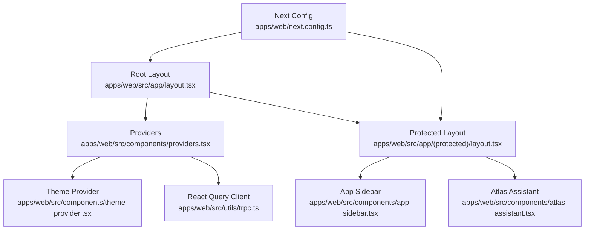
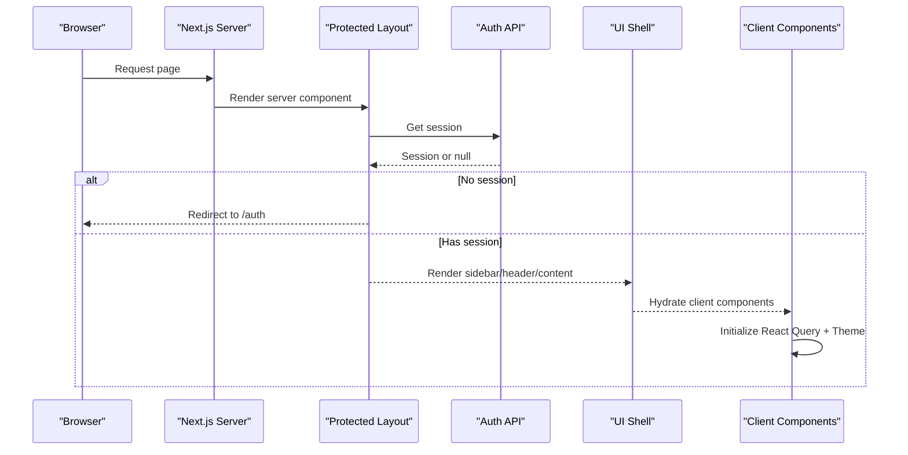
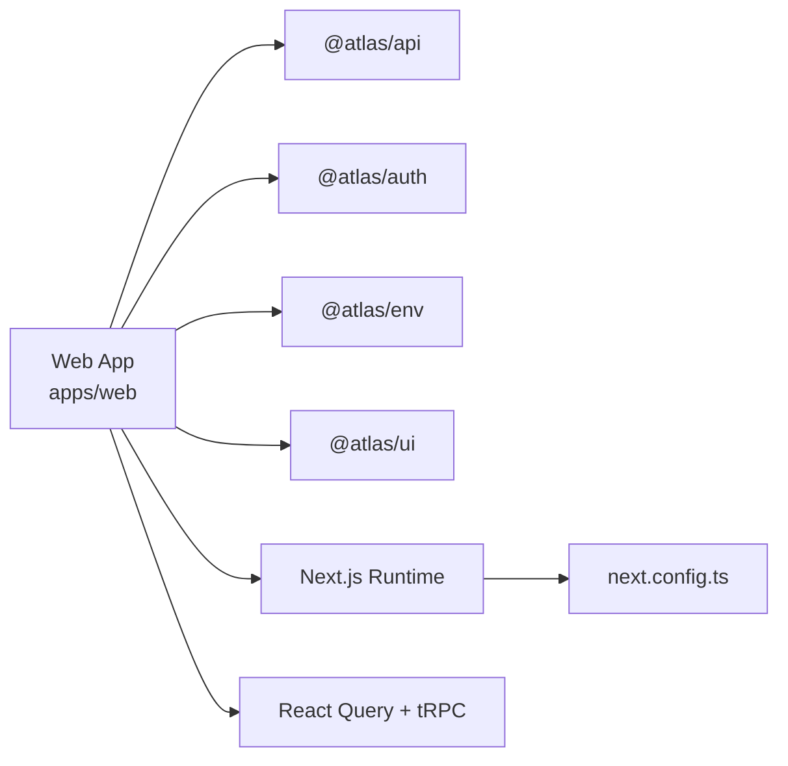
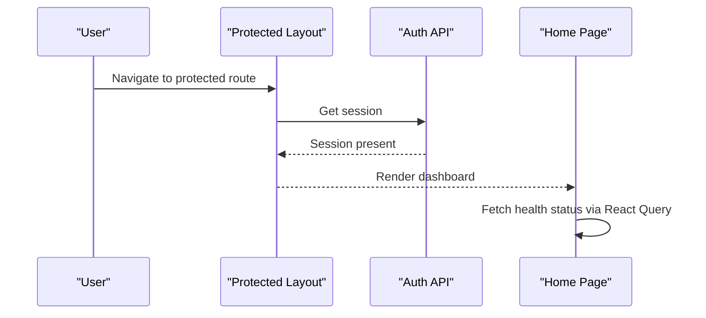
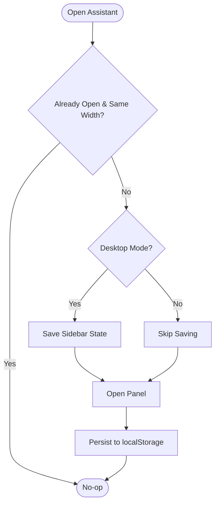

# Frontend Performance Optimization

<cite>
**Referenced Files in This Document**
- [next.config.ts](file://apps/web/next.config.ts)
- [package.json](file://apps/web/package.json)
- [layout.tsx](file://apps/web/src/app/layout.tsx)
- [page.tsx](file://apps/web/src/app/page.tsx)
- [providers.tsx](file://apps/web/src/components/providers.tsx)
- [trpc.ts](file://apps/web/src/utils/trpc.ts)
- [theme-provider.tsx](file://apps/web/src/components/theme-provider.tsx)
- [protected layout.tsx](file://apps/web/src/app/(protected)/layout.tsx)
- [atlas-assistant.tsx](file://apps/web/src/components/atlas-assistant.tsx)
- [app-sidebar.tsx](file://apps/web/src/components/app-sidebar.tsx)
- [use-assistant-panel.tsx](file://apps/web/src/hooks/use-assistant-panel.tsx)
</cite>

## Table of Contents

1. Introduction
2. Project Structure
3. Core Components
4. Architecture Overview
5. Detailed Component Analysis
6. Dependency Analysis
7. Performance Considerations
8. Troubleshooting Guide
9. Conclusion
10. Appendices

## Introduction

This document provides a comprehensive guide to optimizing the frontend performance of the Atlas application built with Next.js and React. It focuses on bundle size reduction, image optimization, lazy loading, font optimization, React performance best practices (memoization, composition, state management), server-side rendering and hydration optimizations, caching strategies, monitoring, mobile considerations, progressive web app features, and browser caching. The guidance references the current codebase configuration and components to ensure actionable recommendations aligned with the project’s setup.

## Project Structure

The web application is organized under apps/web using Next.js App Router. Key areas include:

- Root layout and global providers for fonts, theme, and data fetching cache
- Protected routes layout handling authentication and UI shell
- Client components for interactive UI and hooks for shared state
- Configuration for Next.js runtime behavior, images, and compiler options

**Diagram sources**

- [layout.tsx:1-47](file://apps/web/src/app/layout.tsx#L1-L47)
- [providers.tsx:1-27](file://apps/web/src/components/providers.tsx#L1-L27)
- [theme-provider.tsx:1-12](file://apps/web/src/components/theme-provider.tsx#L1-L12)
- [trpc.ts:1-40](file://apps/web/src/utils/trpc.ts#L1-L40)
- [protected layout.tsx:1-66](<file://apps/web/src/app/(protected)/layout.tsx#L1-L66>)
- [app-sidebar.tsx:1-25](file://apps/web/src/components/app-sidebar.tsx#L1-L25)
- [atlas-assistant.tsx:1-175](file://apps/web/src/components/atlas-assistant.tsx#L1-L175)
- [next.config.ts:1-31](file://apps/web/next.config.ts#L1-L31)

**Section sources**

- [next.config.ts:1-31](file://apps/web/next.config.ts#L1-L31)
- [layout.tsx:1-47](file://apps/web/src/app/layout.tsx#L1-L47)
- [providers.tsx:1-27](file://apps/web/src/components/providers.tsx#L1-L27)
- [protected layout.tsx:1-66](<file://apps/web/src/app/(protected)/layout.tsx#L1-L66>)

## Core Components

- Root layout sets up fonts via next/font/google, global CSS, and wraps content with Providers. It uses suppressHydrationWarning to avoid hydration mismatches during SSR.
- Providers configure ThemeProvider and React Query client, centralizing theme and data caching behaviors.
- Protected layout performs server-side session checks and renders the application shell with sidebar and assistant panel.
- Atlas Assistant is a client component that manages its own open/full-width state and integrates with the sidebar via a custom hook.

Key implementation patterns:

- Fonts are preloaded at build time using next/font/google variables for optimal performance and no layout shift.
- Data fetching is centralized through React Query with tRPC integration, including error handling and retry actions.
- State persistence for the assistant panel is handled via localStorage with graceful fallbacks when storage is unavailable.

**Section sources**

- [layout.tsx:1-47](file://apps/web/src/app/layout.tsx#L1-L47)
- [providers.tsx:1-27](file://apps/web/src/components/providers.tsx#L1-L27)
- [protected layout.tsx:1-66](<file://apps/web/src/app/(protected)/layout.tsx#L1-L66>)
- [atlas-assistant.tsx:1-175](file://apps/web/src/components/atlas-assistant.tsx#L1-L175)
- [use-assistant-panel.tsx:1-235](file://apps/web/src/hooks/use-assistant-panel.tsx#L1-L235)
- [trpc.ts:1-40](file://apps/web/src/utils/trpc.ts#L1-L40)

## Architecture Overview

The application leverages Next.js App Router with a mix of server and client components. Server components handle authentication and initial layout rendering, while client components manage interactivity and local state. Data fetching is performed on the client via React Query and tRPC, with caching and retries configured centrally.

**Diagram sources**

- [protected layout.tsx:1-66](<file://apps/web/src/app/(protected)/layout.tsx#L1-L66>)
- [providers.tsx:1-27](file://apps/web/src/components/providers.tsx#L1-L27)
- [trpc.ts:1-40](file://apps/web/src/utils/trpc.ts#L1-L40)

## Detailed Component Analysis

### Next.js Configuration and Build Optimizations

- Compiler and experimental features:
  - React Compiler enabled for automatic memoization and reduced re-renders.
  - Turbopack Rust React Compiler enabled for faster builds and improved performance.
  - Partial prefetching enabled to improve navigation speed by prefetching likely resources.
  - optimizePackageImports configured for specific libraries to reduce bundle size.
- Images:
  - Remote patterns allow optimized delivery from trusted domains.
- Rewrites:
  - Proxies certain API paths to the runtime service.

Recommendations:

- Continue enabling React Compiler and partialPrefetching for consistent performance gains.
- Expand optimizePackageImports to other heavy UI libraries if applicable.
- Validate remotePatterns to ensure only necessary domains are allowed for image optimization.

**Section sources**

- [next.config.ts:1-31](file://apps/web/next.config.ts#L1-L31)

### Font Optimization

- Fonts are loaded via next/font/google with subsets restricted to latin and CSS variables applied to root classes. This minimizes network overhead and avoids layout shifts.

Recommendations:

- Keep subsets minimal to reduce font payload.
- Use variable fonts where possible to reduce file count.
- Ensure font-display strategy is appropriate; next/font handles defaults well.

**Section sources**

- [layout.tsx:1-47](file://apps/web/src/app/layout.tsx#L1-L47)

### Image Optimization Strategy

- The assistant avatar uses next/image with unoptimized flag due to external source constraints. Remote patterns are configured for trusted domains.

Recommendations:

- Prefer Next.js Image optimization for internal assets and supported remote domains.
- For third-party avatars not covered by remotePatterns, consider hosting locally or using an image CDN that supports optimization.
- Avoid unoptimized images unless absolutely necessary; they bypass compression and responsive formats.

**Section sources**

- [atlas-assistant.tsx:1-175](file://apps/web/src/components/atlas-assistant.tsx#L1-L175)
- [next.config.ts:1-31](file://apps/web/next.config.ts#L1-L31)

### Lazy Loading Patterns for Components and Routes

- Current structure uses Next.js App Router pages and client components. To further reduce initial bundle:
  - Dynamically import heavy client-only components (e.g., assistant panel, charts, modals) using dynamic imports with loading states.
  - Split route-level bundles by moving large feature modules into separate files and importing them lazily.
  - Use Suspense boundaries around async components to show loading indicators during hydration.

Implementation pointers:

- Wrap non-critical UI in dynamic imports to defer JavaScript execution until needed.
- Preload critical routes and defer non-essential scripts.

[No sources needed since this section provides general guidance]

### React Performance Best Practices

- Memoization:
  - The assistant panel hook uses useMemo for context value and useCallback for stable function references, reducing unnecessary re-renders.
  - Consider wrapping expensive computations in useMemo and stabilizing event handlers with useCallback.
- Component Composition:
  - Compose UI from small, focused components (header, empty state, composer) to improve readability and enable selective updates.
- State Management:
  - Local state for UI toggles persisted to localStorage for resilience across sessions.
  - Centralized data fetching via React Query with caching and retry logic.

Recommendations:

- Audit components for over-rendering; apply memoization selectively where it matters most.
- Lift state minimally; keep UI state close to where it is used.
- Use React Query for server state to avoid manual caching complexity.

**Section sources**

- [use-assistant-panel.tsx:1-235](file://apps/web/src/hooks/use-assistant-panel.tsx#L1-L235)
- [providers.tsx:1-27](file://apps/web/src/components/providers.tsx#L1-L27)
- [trpc.ts:1-40](file://apps/web/src/utils/trpc.ts#L1-L40)

### Server-Side Rendering and Hydration Performance

- Root layout uses suppressHydrationWarning to prevent hydration mismatch warnings during SSR.
- Protected layout performs server-side session checks and redirects unauthenticated users early, minimizing client work.

Recommendations:

- Avoid client-only APIs during SSR; rely on server components for data fetching and routing decisions.
- Minimize differences between server and client render outputs to reduce hydration cost.
- Use Suspense boundaries to stream content progressively and improve perceived performance.

**Section sources**

- [layout.tsx:1-47](file://apps/web/src/app/layout.tsx#L1-L47)
- [protected layout.tsx:1-66](<file://apps/web/src/app/(protected)/layout.tsx#L1-L66>)

### Caching Strategies

- React Query client is configured with a QueryCache that shows toast notifications on errors and includes a retry action.
- Credentials are included in fetch requests for authenticated endpoints.

Recommendations:

- Tune query staleness and garbage collection settings based on data volatility.
- Implement optimistic updates for better UX where appropriate.
- Consider HTTP caching headers for static assets and API responses.

**Section sources**

- [trpc.ts:1-40](file://apps/web/src/utils/trpc.ts#L1-L40)

### Bundle Size Reduction Techniques

- Dependencies include lucide-react and other UI libraries; optimizePackageImports is configured for lucide-react to tree-shake unused icons.
- Dev tools like React Query devtools are commented out in production builds.

Recommendations:

- Audit dependencies regularly and remove unused packages.
- Use dynamic imports for heavy features to split bundles.
- Leverage Next.js built-in optimizations and keep dependencies minimal.

**Section sources**

- [next.config.ts:1-31](file://apps/web/next.config.ts#L1-L31)
- [package.json:1-47](file://apps/web/package.json#L1-L47)
- [providers.tsx:1-27](file://apps/web/src/components/providers.tsx#L1-L27)

## Dependency Analysis

The web app depends on workspace packages for API, auth, env, and UI. Runtime configuration enables compiler optimizations and partial prefetching. Data layer uses React Query and tRPC for type-safe client-server communication.

**Diagram sources**

- [package.json:1-47](file://apps/web/package.json#L1-L47)
- [next.config.ts:1-31](file://apps/web/next.config.ts#L1-L31)
- [trpc.ts:1-40](file://apps/web/src/utils/trpc.ts#L1-L40)

**Section sources**

- [package.json:1-47](file://apps/web/package.json#L1-L47)
- [next.config.ts:1-31](file://apps/web/next.config.ts#L1-L31)
- [trpc.ts:1-40](file://apps/web/src/utils/trpc.ts#L1-L40)

## Performance Considerations

- Bundle size:
  - Enable React Compiler and partialPrefetching.
  - Configure optimizePackageImports for heavy libraries.
  - Use dynamic imports for non-critical features.
- Images:
  - Prefer Next.js Image optimization; limit unoptimized usage.
  - Add remotePatterns for all trusted image domains.
- Fonts:
  - Restrict subsets and use variable fonts to minimize payload.
- React:
  - Apply useMemo and useCallback judiciously.
  - Compose components to isolate updates.
  - Persist UI state to localStorage with fallbacks.
- SSR/Hydration:
  - Perform server-side checks and redirects early.
  - Avoid client-only APIs in SSR; use Suspense for streaming.
- Caching:
  - Tune React Query settings for your data patterns.
  - Include credentials for authenticated requests.
- Monitoring:
  - Use Next.js metrics and Lighthouse to track performance.
  - Instrument key interactions with analytics and error tracking.
- Mobile:
  - Defer non-essential JS; prefer lightweight components.
  - Optimize images and fonts for smaller screens.
- PWA:
  - Add a manifest and service worker for offline support and installability.
- Browser caching:
  - Set appropriate cache-control headers for static assets.
  - Version assets to bust caches on updates.

[No sources needed since this section provides general guidance]

## Troubleshooting Guide

Common issues and resolutions:

- Hydration mismatches:
  - Review suppressHydrationWarning usage and ensure consistent rendering between server and client.
- Network errors:
  - React Query error handler displays toasts with retry actions; verify endpoint URLs and credentials.
- Storage limitations:
  - Assistant panel state persists to localStorage with try/catch; ensure graceful fallback when unavailable.
- Image loading:
  - External images may require remotePatterns; otherwise, host assets locally or use an optimized CDN.

**Section sources**

- [layout.tsx:1-47](file://apps/web/src/app/layout.tsx#L1-L47)
- [trpc.ts:1-40](file://apps/web/src/utils/trpc.ts#L1-L40)
- [use-assistant-panel.tsx:1-235](file://apps/web/src/hooks/use-assistant-panel.tsx#L1-L235)
- [atlas-assistant.tsx:1-175](file://apps/web/src/components/atlas-assistant.tsx#L1-L175)

## Conclusion

The Atlas application already incorporates several performance-oriented practices, including font optimization, React Compiler, partial prefetching, and robust data caching via React Query. By adopting dynamic imports, expanding image optimization coverage, refining memoization, and implementing monitoring and caching strategies, the app can achieve faster load times, smoother interactions, and better overall user experience across devices.

[No sources needed since this section summarizes without analyzing specific files]

## Appendices

### Example Workflows

#### Route Navigation with Protected Access

**Diagram sources**

- [protected layout.tsx:1-66](<file://apps/web/src/app/(protected)/layout.tsx#L1-L66>)
- [page.tsx:1-39](file://apps/web/src/app/page.tsx#L1-L39)
- [trpc.ts:1-40](file://apps/web/src/utils/trpc.ts#L1-L40)

#### Assistant Panel State Coordination

**Diagram sources**

- [use-assistant-panel.tsx:1-235](file://apps/web/src/hooks/use-assistant-panel.tsx#L1-L235)
