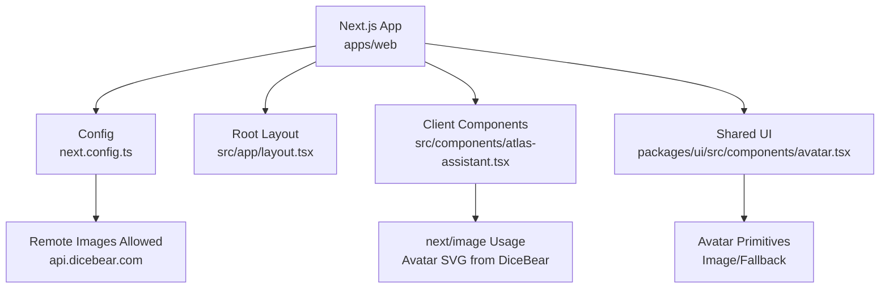
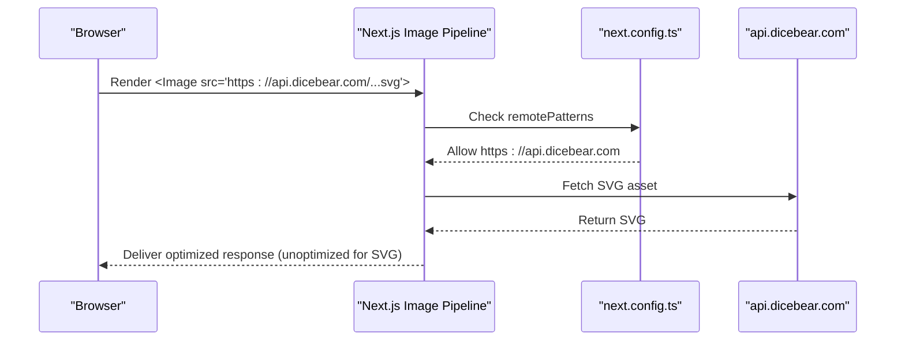
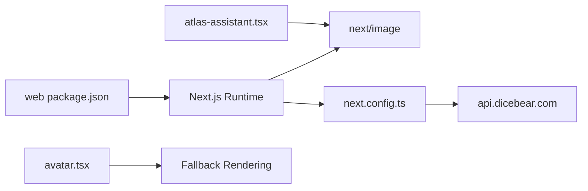

# Image and Media Optimization

<cite>
**Referenced Files in This Document**
- [next.config.ts](file://apps/web/next.config.ts)
- [atlas-assistant.tsx](file://apps/web/src/components/atlas-assistant.tsx)
- [avatar.tsx](file://packages/ui/src/components/avatar.tsx)
- [layout.tsx](file://apps/web/src/app/layout.tsx)
- [package.json](file://apps/web/package.json)
</cite>

## Table of Contents

1. [Introduction](#introduction)
2. [Project Structure](#project-structure)
3. [Core Components](#core-components)
4. [Architecture Overview](#architecture-overview)
5. [Detailed Component Analysis](#detailed-component-analysis)
6. [Dependency Analysis](#dependency-analysis)
7. [Performance Considerations](#performance-considerations)
8. [Troubleshooting Guide](#troubleshooting-guide)
9. [Conclusion](#conclusion)
10. [Appendices](#appendices)

## Introduction

This document provides comprehensive guidance for image and media optimization in the Atlas application using Next.js. It covers:

- Using the Next.js Image component for automatic optimization, format selection (WebP/AVIF), and responsive images
- Configuring remote image sources (e.g., dicebear.com avatars)
- Implementing lazy loading for images and other media to improve initial page load performance
- Proper sizing strategies, fallback handling, and best practices
- Video and audio optimization techniques
- Resource hints to accelerate critical resource delivery
- Monitoring image performance metrics

## Project Structure

Atlas is a Next.js application with a client-side UI layer and shared UI components. The relevant parts for image and media optimization include:

- Next.js configuration for remote image domains
- Client components that render images via next/image
- Shared avatar primitives used across the app
- Root layout where global optimizations can be applied

**Diagram sources**

- [next.config.ts:10-17](file://apps/web/next.config.ts#L10-L17)
- [atlas-assistant.tsx:38-45](file://apps/web/src/components/atlas-assistant.tsx#L38-L45)
- [avatar.tsx:27-53](file://packages/ui/src/components/avatar.tsx#L27-L53)
- [layout.tsx:26-46](file://apps/web/src/app/layout.tsx#L26-L46)

**Section sources**

- [next.config.ts:1-31](file://apps/web/next.config.ts#L1-L31)
- [atlas-assistant.tsx:1-175](file://apps/web/src/components/atlas-assistant.tsx#L1-L175)
- [avatar.tsx:1-109](file://packages/ui/src/components/avatar.tsx#L1-L109)
- [layout.tsx:1-47](file://apps/web/src/app/layout.tsx#L1-L47)

## Core Components

- Next.js Image usage: The assistant header renders an avatar image using next/image with explicit width and height to avoid layout shifts.
- Remote image configuration: The Next.js config allows fetching images from api.dicebear.com over HTTPS.
- Avatar primitives: A reusable avatar component set includes image and fallback slots for robust rendering.

Key implementation references:

- Remote patterns configuration for external image domains
- next/image usage with fixed dimensions and unoptimized flag for SVGs
- Avatar primitives providing consistent sizing and fallback behavior

**Section sources**

- [next.config.ts:10-17](file://apps/web/next.config.ts#L10-L17)
- [atlas-assistant.tsx:38-45](file://apps/web/src/components/atlas-assistant.tsx#L38-L45)
- [avatar.tsx:27-53](file://packages/ui/src/components/avatar.tsx#L27-L53)

## Architecture Overview

The image pipeline in Atlas leverages Next.js built-in capabilities:

- Remote image requests are permitted via configured remotePatterns
- next/image handles on-demand transformation, format negotiation (WebP/AVIF when supported), and responsive sizing based on provided dimensions
- For SVG assets (like DiceBear avatars), optimization is disabled to preserve vector quality
- Global layout sets up fonts and providers; additional resource hints can be added here for preloading critical assets

**Diagram sources**

- [next.config.ts:10-17](file://apps/web/next.config.ts#L10-L17)
- [atlas-assistant.tsx:38-45](file://apps/web/src/components/atlas-assistant.tsx#L38-L45)

## Detailed Component Analysis

### Next.js Image Usage in Assistant Header

- The assistant header uses next/image to display an avatar from DiceBear.
- Explicit width and height are provided to prevent layout shift and enable efficient resizing.
- The unoptimized flag is used because the source is an SVG; rasterization would degrade quality.

Recommendations:

- Keep explicit width/height for known-size icons and avatars
- Prefer vector formats (SVG) for small logos/icons to maintain clarity at any scale
- Use alt text for accessibility and SEO

**Section sources**

- [atlas-assistant.tsx:38-45](file://apps/web/src/components/atlas-assistant.tsx#L38-L45)

### Remote Image Configuration for External Sources

- RemotePattern for api.dicebear.com over HTTPS is configured, enabling secure fetching of avatars.
- This ensures the Next.js Image pipeline can transform or cache remote images when appropriate.

Guidelines:

- Always specify protocol and hostname precisely
- Restrict to trusted domains to prevent open redirect risks
- Combine with caching headers on your CDN if self-hosted

**Section sources**

- [next.config.ts:10-17](file://apps/web/next.config.ts#L10-L17)

### Avatar Primitives and Fallback Handling

- The shared avatar component exposes Image and Fallback slots to ensure graceful degradation when images fail to load or are blocked.
- Consistent sizing classes ensure visual consistency across sizes.

Best practices:

- Always provide a meaningful fallback (initials or placeholder)
- Ensure fallback matches container size and aspect ratio
- Use semantic markup and accessible names

**Section sources**

- [avatar.tsx:27-53](file://packages/ui/src/components/avatar.tsx#L27-L53)

### Root Layout and Global Optimizations

- The root layout initializes fonts and wraps the app with providers.
- This is a good place to add global resource hints (e.g., preconnect to third-party image CDNs) to reduce latency for subsequent image requests.

Suggested enhancements:

- Add DNS prefetch/preconnect for api.dicebear.com
- Preload critical fonts or above-the-fold images if needed

**Section sources**

- [layout.tsx:26-46](file://apps/web/src/app/layout.tsx#L26-L46)

## Dependency Analysis

- The web app depends on Next.js for image optimization and runtime features.
- Remote image fetching is gated by next.config.ts remotePatterns.
- UI components rely on shared avatar primitives for consistent presentation.

**Diagram sources**

- [package.json:29-34](file://apps/web/package.json#L29-L34)
- [next.config.ts:10-17](file://apps/web/next.config.ts#L10-L17)
- [atlas-assistant.tsx:38-45](file://apps/web/src/components/atlas-assistant.tsx#L38-L45)
- [avatar.tsx:27-53](file://packages/ui/src/components/avatar.tsx#L27-L53)

**Section sources**

- [package.json:1-47](file://apps/web/package.json#L1-L47)
- [next.config.ts:1-31](file://apps/web/next.config.ts#L1-L31)

## Performance Considerations

- Automatic optimization: next/image automatically serves modern formats (WebP/AVIF) when supported by the browser and resizes images responsively based on device pixel ratio and viewport.
- Lazy loading: next/image defers offscreen images by default, improving initial load time.
- SVG handling: For SVGs like DiceBear avatars, keep unoptimized to preserve vector quality; they are typically small and fast to fetch.
- Sizing: Always provide width and height to avoid layout shifts and enable efficient decoding.
- Resource hints: Add preconnect to external image domains in the root layout to reduce connection setup time.
- Video/Audio: Use native HTML video/audio elements with preload attributes, poster images, and appropriate codecs (H.264/MP4, WebM/VP9). Consider adaptive streaming for large videos.
- Monitoring: Track Largest Contentful Paint (LCP), Cumulative Layout Shift (CLS), and Time to First Byte (TTFB) to measure impact of image changes. Use browser DevTools and RUM tools.

[No sources needed since this section provides general guidance]

## Troubleshooting Guide

- Images not loading from external domains:
  - Verify remotePatterns include the correct hostname and protocol
  - Ensure CORS is allowed if transforming images server-side
- SVGs appearing blurry:
  - Avoid rasterizing SVGs; keep unoptimized for vector assets
- Layout shifts:
  - Provide explicit width and height or use aspect-ratio utilities
- Fallback not showing:
  - Ensure fallback is wired in avatar components and visible when image fails
- Slow initial load:
  - Add preconnect/prefetch for critical third-party domains
  - Defer non-critical scripts and heavy components

**Section sources**

- [next.config.ts:10-17](file://apps/web/next.config.ts#L10-L17)
- [atlas-assistant.tsx:38-45](file://apps/web/src/components/atlas-assistant.tsx#L38-L45)
- [avatar.tsx:27-53](file://packages/ui/src/components/avatar.tsx#L27-L53)

## Conclusion

Atlas leverages Next.js’s image optimization effectively through configured remote patterns and next/image usage. By maintaining explicit sizing, using appropriate formats, implementing fallbacks, and adding resource hints, the application can deliver fast, responsive visuals. Extending these practices to video and audio assets and monitoring key performance metrics will further enhance user experience.

[No sources needed since this section summarizes without analyzing specific files]

## Appendices

### Implementation Checklist

- Configure remotePatterns for all external image domains
- Use next/image with width/height for predictable layouts
- Prefer vector formats for small icons; disable optimization for SVGs
- Wire fallbacks in avatar components
- Add preconnect/prefetch for critical third-party resources in root layout
- Optimize video/audio with proper codecs, posters, and preload settings
- Monitor LCP, CLS, and TTFB to validate improvements

[No sources needed since this section provides general guidance]
