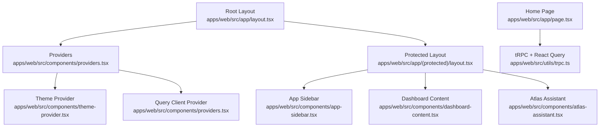
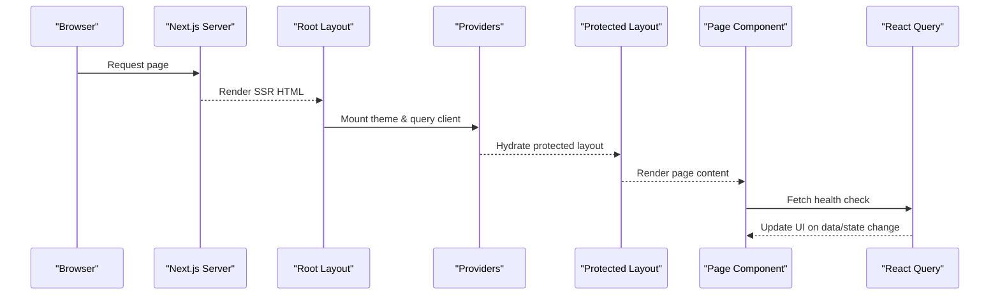
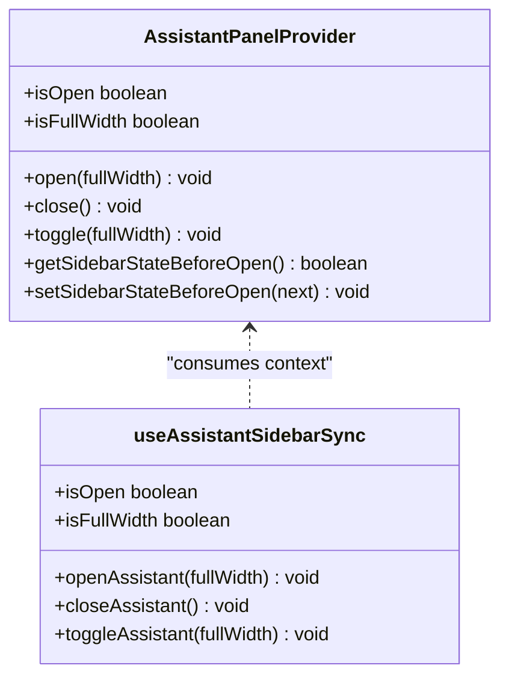
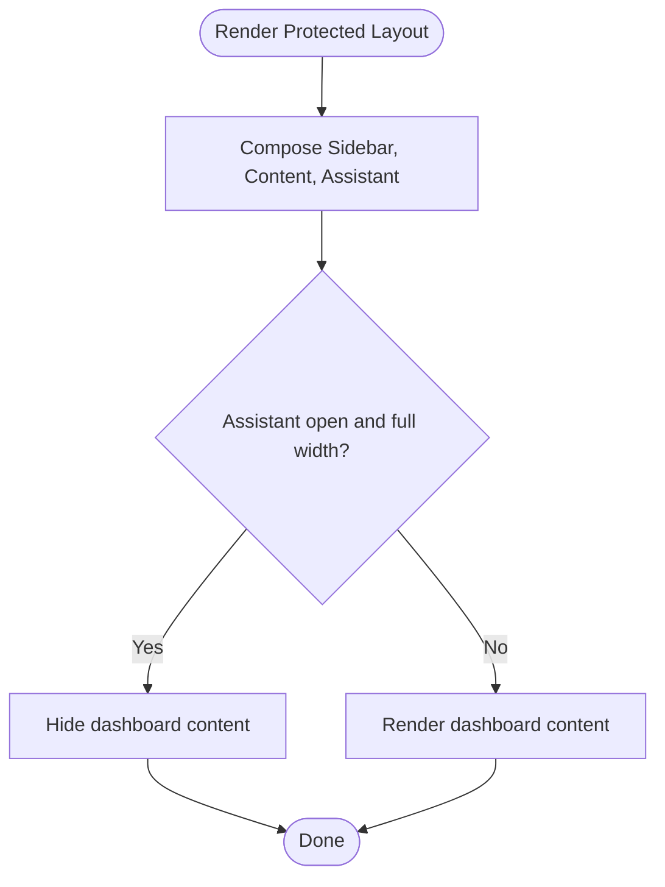
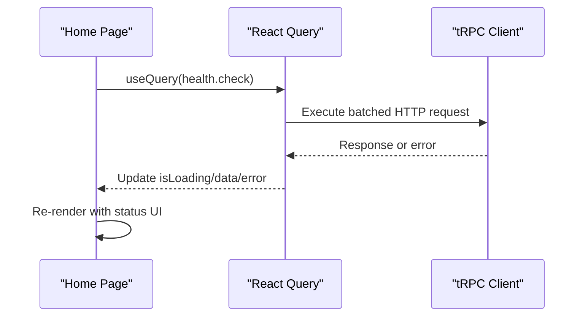
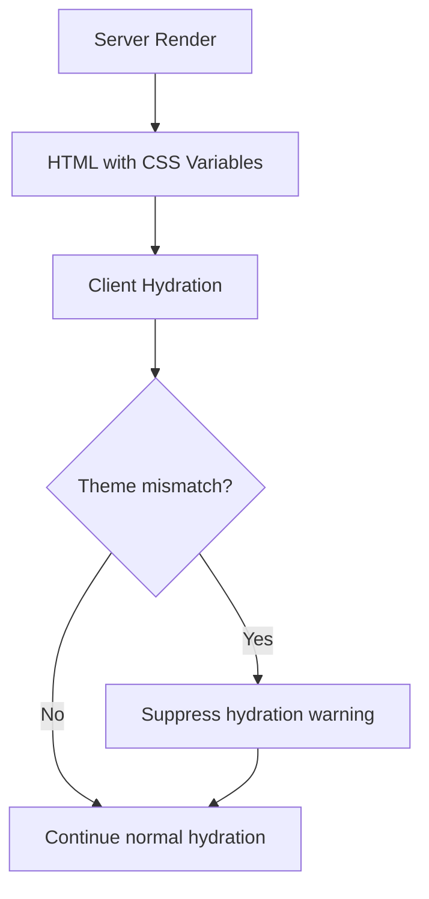
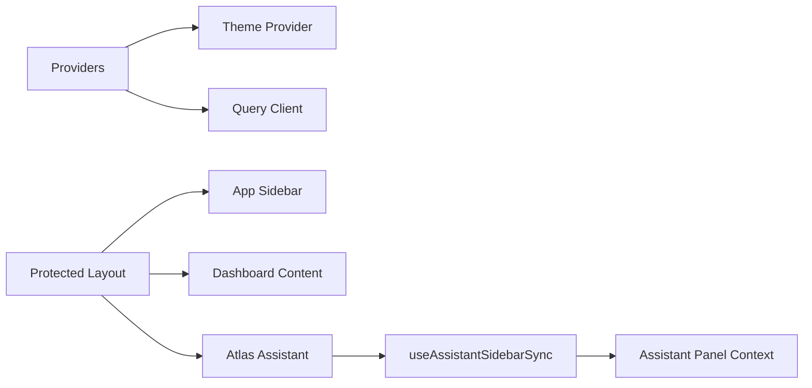

# React Rendering Performance

<cite>
**Referenced Files in This Document**
- [layout.tsx](file://apps/web/src/app/layout.tsx)
- [page.tsx](file://apps/web/src/app/page.tsx)
- [providers.tsx](file://apps/web/src/components/providers.tsx)
- [theme-provider.tsx](file://apps/web/src/components/theme-provider.tsx)
- [next.config.ts](file://apps/web/next.config.ts)
- [dashboard-content.tsx](file://apps/web/src/components/dashboard-content.tsx)
- [header.tsx](file://apps/web/src/components/header.tsx)
- [app-sidebar.tsx](file://apps/web/src/components/app-sidebar.tsx)
- [atlas-assistant.tsx](file://apps/web/src/components/atlas-assistant.tsx)
- [trpc.ts](file://apps/web/src/utils/trpc.ts)
- [use-assistant-panel.tsx](file://apps/web/src/hooks/use-assistant-panel.tsx)
- [protected layout.tsx](file://apps/web/src/app/(protected)/layout.tsx)
</cite>

## Table of Contents

1. [Introduction](#introduction)
2. [Project Structure](#project-structure)
3. [Core Components](#core-components)
4. [Architecture Overview](#architecture-overview)
5. [Detailed Component Analysis](#detailed-component-analysis)
6. [Dependency Analysis](#dependency-analysis)
7. [Performance Considerations](#performance-considerations)
8. [Troubleshooting Guide](#troubleshooting-guide)
9. [Conclusion](#conclusion)

## Introduction

This document provides a comprehensive guide to React rendering performance for the Atlas application. It focuses on memoization with useMemo and useCallback, component composition patterns that minimize render cycles, hydration optimization strategies to reduce initial load time and prevent layout shifts, efficient state management practices, avoiding expensive computations during render, optimizing update patterns, server-side rendering (SSR) considerations, client-side hydration optimization, and debugging rendering issues using React DevTools Profiler.

## Project Structure

Atlas is a Next.js application with a clear separation between app shell, providers, UI components, and shared hooks. The root layout sets up global styles and providers, while protected routes wrap content with sidebar and assistant panels. Data fetching uses TanStack Query via tRPC, and theme switching is handled by next-themes.

**Diagram sources**

- [layout.tsx:26-46](file://apps/web/src/app/layout.tsx#L26-L46)
- [providers.tsx:11-24](file://apps/web/src/components/providers.tsx#L11-L24)
- [theme-provider.tsx:6-11](file://apps/web/src/components/theme-provider.tsx#L6-L11)
- [protected layout.tsx:22-65](<file://apps/web/src/app/(protected)/layout.tsx#L22-L65>)
- [app-sidebar.tsx:13-24](file://apps/web/src/components/app-sidebar.tsx#L13-L24)
- [dashboard-content.tsx:5-17](file://apps/web/src/components/dashboard-content.tsx#L5-L17)
- [atlas-assistant.tsx:122-174](file://apps/web/src/components/atlas-assistant.tsx#L122-L174)
- [page.tsx:8-38](file://apps/web/src/app/page.tsx#L8-L38)
- [trpc.ts:7-39](file://apps/web/src/utils/trpc.ts#L7-L39)

**Section sources**

- [layout.tsx:26-46](file://apps/web/src/app/layout.tsx#L26-L46)
- [providers.tsx:11-24](file://apps/web/src/components/providers.tsx#L11-L24)
- [protected layout.tsx:22-65](<file://apps/web/src/app/(protected)/layout.tsx#L22-L65>)
- [page.tsx:8-38](file://apps/web/src/app/page.tsx#L8-L38)

## Core Components

- Root layout initializes fonts, metadata, and wraps the app with Providers. It also suppresses hydration warnings to avoid mismatches when theme or environment differs between server and client.
- Providers configure theme context and React Query client globally.
- Protected layout orchestrates sidebar, dashboard content, and assistant panel, ensuring consistent layout and state coordination.
- Home page demonstrates data fetching with React Query and conditional rendering based on query state.

Key performance-relevant behaviors:

- Global providers are mounted once at the root, reducing repeated setup overhead.
- Theme provider is configured to disable transitions on theme changes to avoid unnecessary reflows.
- Query client is centralized and reused across the app.

**Section sources**

- [layout.tsx:26-46](file://apps/web/src/app/layout.tsx#L26-L46)
- [providers.tsx:11-24](file://apps/web/src/components/providers.tsx#L11-L24)
- [theme-provider.tsx:6-11](file://apps/web/src/components/theme-provider.tsx#L6-L11)
- [protected layout.tsx:22-65](<file://apps/web/src/app/(protected)/layout.tsx#L22-L65>)
- [page.tsx:8-38](file://apps/web/src/app/page.tsx#L8-L38)

## Architecture Overview

The rendering architecture centers around a stable root layout and providers, with feature-specific layouts and components consuming shared context and data.

**Diagram sources**

- [layout.tsx:26-46](file://apps/web/src/app/layout.tsx#L26-L46)
- [providers.tsx:11-24](file://apps/web/src/components/providers.tsx#L11-L24)
- [protected layout.tsx:22-65](<file://apps/web/src/app/(protected)/layout.tsx#L22-L65>)
- [page.tsx:8-38](file://apps/web/src/app/page.tsx#L8-L38)
- [trpc.ts:7-39](file://apps/web/src/utils/trpc.ts#L7-L39)

## Detailed Component Analysis

### Memoization and Stable References

The assistant panel hook demonstrates strong memoization practices:

- Uses useCallback for event handlers and state setters to stabilize references passed into child components and contexts.
- Uses useMemo to create a stable context value object, preventing unnecessary re-renders of consumers when only unrelated fields change.
- Persists panel state to localStorage safely, reading values within requestAnimationFrame to avoid blocking initial paint.

**Diagram sources**

- [use-assistant-panel.tsx:67-150](file://apps/web/src/hooks/use-assistant-panel.tsx#L67-L150)
- [use-assistant-panel.tsx:169-234](file://apps/web/src/hooks/use-assistant-panel.tsx#L169-L234)

**Section sources**

- [use-assistant-panel.tsx:67-150](file://apps/web/src/hooks/use-assistant-panel.tsx#L67-L150)
- [use-assistant-panel.tsx:169-234](file://apps/web/src/hooks/use-assistant-panel.tsx#L169-L234)

### Component Composition Patterns

- Protected layout composes AppSidebar, DashboardContent, and AtlasAssistant to form a cohesive shell. This reduces prop drilling and keeps concerns separated.
- DashboardContent conditionally renders children based on assistant panel state, enabling full-width modes without re-rendering the entire tree unnecessarily.
- Header and nav components are simple presentational units, minimizing logic and keeping render paths lightweight.

**Diagram sources**

- [protected layout.tsx:35-62](<file://apps/web/src/app/(protected)/layout.tsx#L35-L62>)
- [dashboard-content.tsx:5-17](file://apps/web/src/components/dashboard-content.tsx#L5-L17)

**Section sources**

- [protected layout.tsx:35-62](<file://apps/web/src/app/(protected)/layout.tsx#L35-L62>)
- [dashboard-content.tsx:5-17](file://apps/web/src/components/dashboard-content.tsx#L5-L17)
- [header.tsx:7-31](file://apps/web/src/components/header.tsx#L7-L31)
- [app-sidebar.tsx:13-24](file://apps/web/src/components/app-sidebar.tsx#L13-L24)

### Data Fetching and Update Optimization

- The home page uses React Query to fetch health status and renders UI based on loading and data states.
- Centralized QueryClient configuration includes error handling with retry actions, improving resilience and user experience.
- Using queryOptions ensures type-safe and efficient data fetching patterns.

**Diagram sources**

- [page.tsx:8-38](file://apps/web/src/app/page.tsx#L8-L38)
- [trpc.ts:7-39](file://apps/web/src/utils/trpc.ts#L7-L39)

**Section sources**

- [page.tsx:8-38](file://apps/web/src/app/page.tsx#L8-L38)
- [trpc.ts:7-39](file://apps/web/src/utils/trpc.ts#L7-L39)

### Hydration and SSR Considerations

- Root layout uses a hydration warning suppression flag to avoid mismatches caused by theme or environment differences between server and client.
- Next.js configuration enables component caching and partial prefetching, which can improve perceived performance and reduce redundant work.
- Fonts are loaded via next/font with CSS variables, minimizing layout shifts by preloading and injecting variable names early.

**Diagram sources**

- [layout.tsx:26-46](file://apps/web/src/app/layout.tsx#L26-L46)
- [next.config.ts:4-19](file://apps/web/next.config.ts#L4-L19)

**Section sources**

- [layout.tsx:26-46](file://apps/web/src/app/layout.tsx#L26-L46)
- [next.config.ts:4-19](file://apps/web/next.config.ts#L4-L19)

## Dependency Analysis

Atlas’s rendering dependencies are organized to minimize coupling and maximize reuse:

- Providers depend on theme and query clients, providing stable contexts to all descendants.
- Protected layout depends on UI primitives and shared hooks to compose the shell.
- Components like AtlasAssistant consume context from the assistant panel hook, ensuring coordinated state updates without excessive re-renders.

**Diagram sources**

- [providers.tsx:11-24](file://apps/web/src/components/providers.tsx#L11-L24)
- [protected layout.tsx:35-62](<file://apps/web/src/app/(protected)/layout.tsx#L35-L62>)
- [atlas-assistant.tsx:122-174](file://apps/web/src/components/atlas-assistant.tsx#L122-L174)
- [use-assistant-panel.tsx:169-234](file://apps/web/src/hooks/use-assistant-panel.tsx#L169-L234)

**Section sources**

- [providers.tsx:11-24](file://apps/web/src/components/providers.tsx#L11-L24)
- [protected layout.tsx:35-62](<file://apps/web/src/app/(protected)/layout.tsx#L35-L62>)
- [atlas-assistant.tsx:122-174](file://apps/web/src/components/atlas-assistant.tsx#L122-L174)
- [use-assistant-panel.tsx:169-234](file://apps/web/src/hooks/use-assistant-panel.tsx#L169-L234)

## Performance Considerations

- Memoization:
  - Use useMemo for derived values and context objects to prevent unnecessary re-renders.
  - Use useCallback for event handlers and functions passed to child components to keep references stable.
- Avoid expensive computations during render:
  - Move heavy calculations out of render paths; compute them lazily or cache results.
  - Defer non-critical work using requestAnimationFrame or idle callbacks where appropriate.
- Optimize component updates:
  - Split large components into smaller, focused units to limit re-render scope.
  - Use conditional rendering to hide or show sections based on state rather than recalculating entire trees.
- Hydration and SSR:
  - Minimize differences between server and client outputs to avoid hydration mismatches.
  - Use font loading strategies and CSS variables to prevent layout shifts.
  - Enable Next.js optimizations such as component caching and partial prefetching.
- State management:
  - Keep state close to where it is used; lift state minimally to share across components.
  - Persist critical UI state to storage when needed, but read it efficiently to avoid blocking initial paint.
- Data fetching:
  - Leverage React Query for caching, deduplication, and background updates.
  - Configure error handling and retries to improve resilience and user experience.

[No sources needed since this section provides general guidance]

## Troubleshooting Guide

- Debugging rendering issues:
  - Use React DevTools Profiler to identify unnecessary re-renders and measure component render times.
  - Inspect context value stability; ensure useMemo and useCallback are applied where necessary.
- Hydration mismatches:
  - Check for environment-dependent values rendered differently on server vs client.
  - Use suppression flags judiciously and prefer consistent initialization patterns.
- Data fetching problems:
  - Verify QueryClient configuration and error handling paths.
  - Ensure network requests are correctly routed through tRPC links and credentials are set appropriately.

**Section sources**

- [trpc.ts:7-39](file://apps/web/src/utils/trpc.ts#L7-L39)
- [layout.tsx:26-46](file://apps/web/src/app/layout.tsx#L26-L46)

## Conclusion

Atlas’s rendering architecture leverages stable providers, memoized contexts, and composed layouts to minimize unnecessary re-renders and improve performance. By applying memoization techniques, optimizing hydration, and structuring components thoughtfully, the application achieves efficient updates and a smooth user experience. Continued use of profiling tools and adherence to best practices will further enhance performance as the codebase evolves.

[No sources needed since this section summarizes without analyzing specific files]
