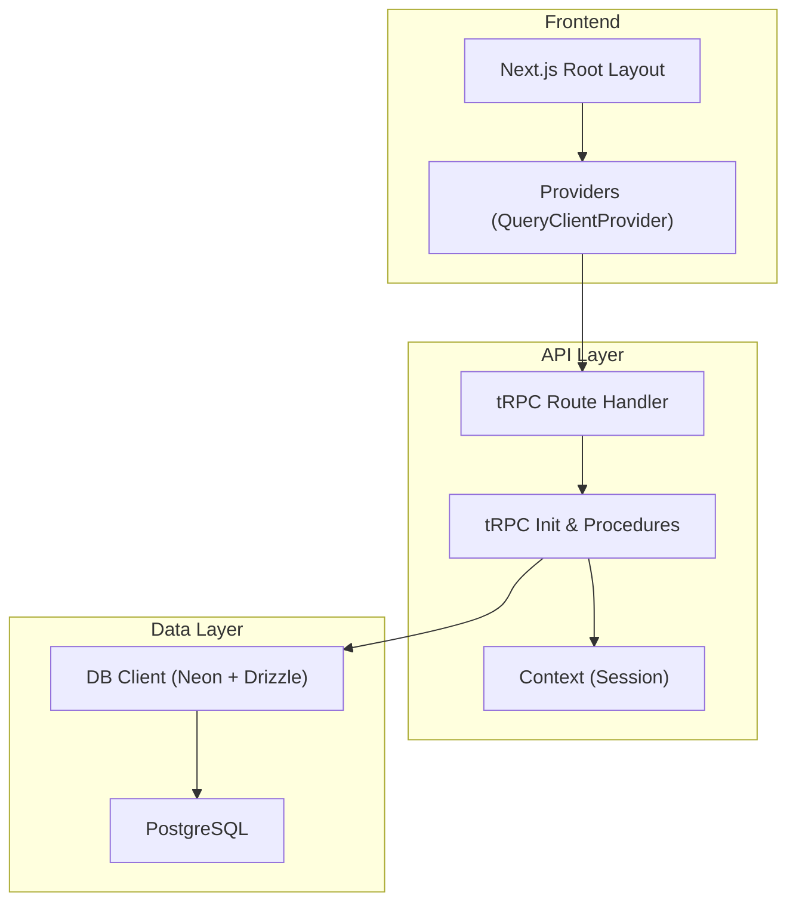
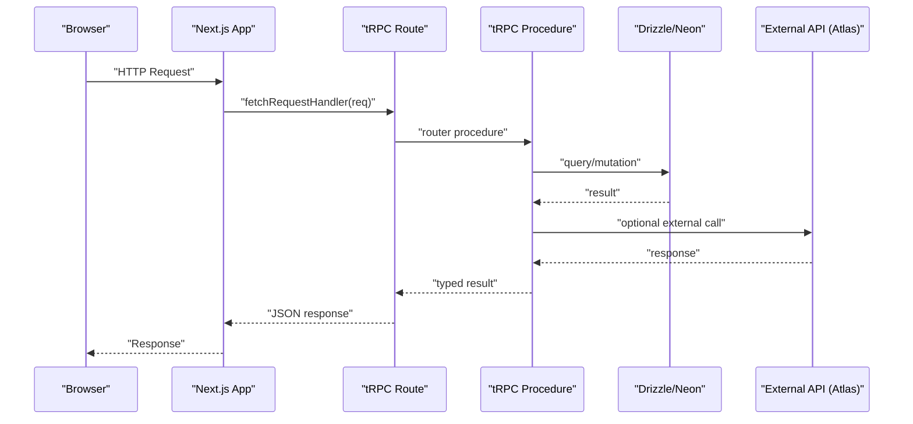
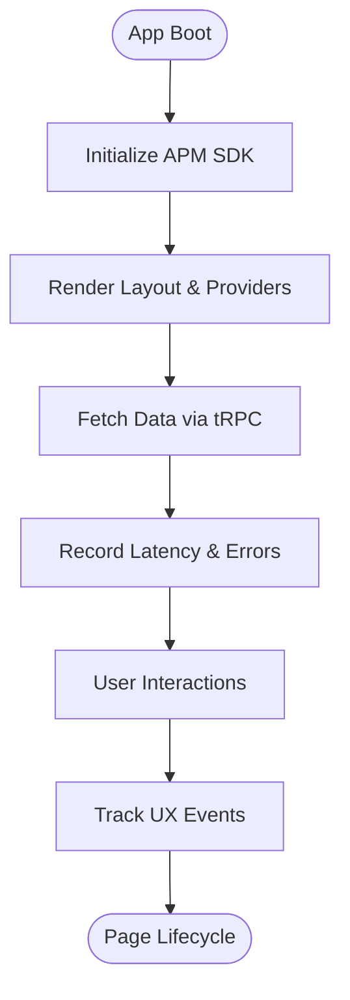
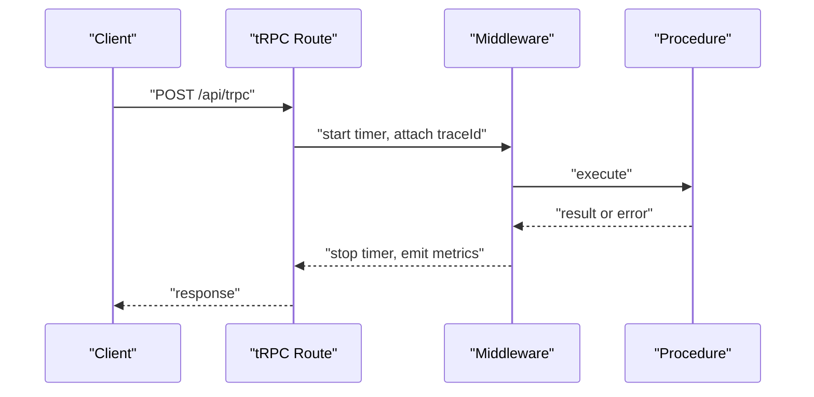
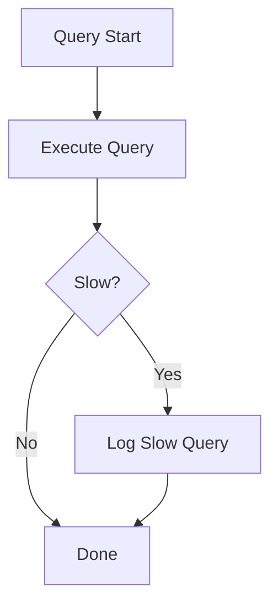
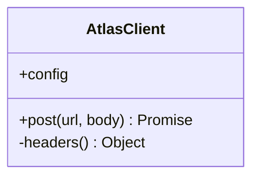
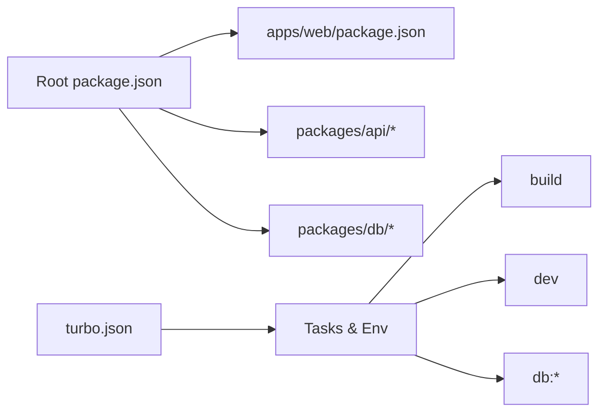

# Performance Monitoring and Profiling

<cite>
**Referenced Files in This Document**
- [README.md](file://README.md)
- [package.json](file://package.json)
- [turbo.json](file://turbo.json)
- [apps/web/package.json](file://apps/web/package.json)
- [apps/web/src/app/layout.tsx](file://apps/web/src/app/layout.tsx)
- [apps/web/src/components/providers.tsx](file://apps/web/src/components/providers.tsx)
- [apps/web/src/app/api/trpc/[trpc]/route.ts](file://apps/web/src/app/api/trpc/[trpc]/route.ts)
- [packages/api/src/index.ts](file://packages/api/src/index.ts)
- [packages/api/src/context.ts](file://packages/api/src/context.ts)
- [packages/db/src/index.ts](file://packages/db/src/index.ts)
- [packages/db/drizzle.config.ts](file://packages/db/drizzle.config.ts)
- [packages/atlas/src/client.ts](file://packages/atlas/src/client.ts)
</cite>

## Table of Contents

1. Introduction
2. Project Structure
3. Core Components
4. Architecture Overview
5. Detailed Component Analysis
6. Dependency Analysis
7. Performance Considerations
8. Troubleshooting Guide
9. Conclusion
10. Appendices

## Introduction

This document provides a comprehensive guide to performance monitoring and profiling for the Atlas application. It covers how to instrument the Next.js frontend, tRPC API layer, and PostgreSQL database; how to collect user experience metrics; how to profile JavaScript and backend bottlenecks; how to run load tests with k6 or Artillery; and how to integrate continuous performance monitoring, alerting, and automated performance testing into CI/CD. It also includes guidance on distributed tracing across microservices, end-to-end measurement, user journey analysis, performance budgets, and regression detection.

## Project Structure

Atlas is a Turborepo monorepo with:

- apps/web: Next.js frontend (React, tRPC client, TanStack Query)
- packages/api: tRPC router and context
- packages/db: Drizzle ORM with Neon serverless Postgres
- packages/atlas: External API client used by features
- Shared configuration via Turborepo tasks and environment variables

**Diagram sources**

- [apps/web/src/app/layout.tsx:26-46](file://apps/web/src/app/layout.tsx#L26-L46)
- [apps/web/src/components/providers.tsx:11-24](file://apps/web/src/components/providers.tsx#L11-L24)
- [apps/web/src/app/api/trpc/[trpc]/route.ts:6-12](file://apps/web/src/app/api/trpc/[trpc]/route.ts#L6-L12)
- [packages/api/src/index.ts:5-25](file://packages/api/src/index.ts#L5-L25)
- [packages/api/src/context.ts:4-11](file://packages/api/src/context.ts#L4-L11)
- [packages/db/src/index.ts:7-10](file://packages/db/src/index.ts#L7-L10)

**Section sources**

- [README.md:79-106](file://README.md#L79-L106)
- [package.json:29-40](file://package.json#L29-L40)
- [turbo.json:1-52](file://turbo.json#L1-L52)

## Core Components

- Next.js app shell and providers initialize UI state and data fetching cache.
- tRPC route handler wires requests to the router and context.
- tRPC procedures enforce auth and expose typed endpoints.
- Database client initializes Neon connection and Drizzle schema.
- External API client encapsulates HTTP calls with headers and error handling.

Key integration points for performance monitoring:

- Frontend: React Query devtools (disabled in production), global layout, and provider setup are ideal places to initialize APM SDKs and user metrics.
- API: tRPC middleware/procedures can wrap request timing, error tracking, and tracing.
- Database: Drizzle queries can be wrapped to capture slow query metrics and SQL-level insights.
- External calls: The Atlas client can be extended to record latency and errors for downstream services.

**Section sources**

- [apps/web/src/app/layout.tsx:26-46](file://apps/web/src/app/layout.tsx#L26-L46)
- [apps/web/src/components/providers.tsx:11-24](file://apps/web/src/components/providers.tsx#L11-L24)
- [apps/web/src/app/api/trpc/[trpc]/route.ts:6-12](file://apps/web/src/app/api/trpc/[trpc]/route.ts#L6-L12)
- [packages/api/src/index.ts:5-25](file://packages/api/src/index.ts#L5-L25)
- [packages/api/src/context.ts:4-11](file://packages/api/src/context.ts#L4-L11)
- [packages/db/src/index.ts:7-10](file://packages/db/src/index.ts#L7-L10)
- [packages/atlas/src/client.ts:7-39](file://packages/atlas/src/client.ts#L7-L39)

## Architecture Overview

The request path flows from the browser through Next.js to tRPC, then to business logic and the database. External integrations may be invoked via the Atlas client.

**Diagram sources**

- [apps/web/src/app/api/trpc/[trpc]/route.ts:6-12](file://apps/web/src/app/api/trpc/[trpc]/route.ts#L6-L12)
- [packages/api/src/index.ts:5-25](file://packages/api/src/index.ts#L5-L25)
- [packages/db/src/index.ts:7-10](file://packages/db/src/index.ts#L7-L10)
- [packages/atlas/src/client.ts:23-39](file://packages/atlas/src/client.ts#L23-L39)

## Detailed Component Analysis

### Frontend Performance Monitoring (Next.js + React)

- Initialize an APM SDK at the root layout or providers to capture page loads, navigation, and interactions.
- Use React Query Devtools in development to inspect cache behavior and network waterfall.
- Instrument non-blocking analytics/logging using Next.js after() patterns to avoid blocking responses.

Recommended instrumentation points:

- Root layout or providers for global metrics initialization.
- Data fetching boundaries around tRPC calls to measure client-side latency and errors.
- User interaction events (clicks, form submissions) for UX metrics.

**Section sources**

- [apps/web/src/app/layout.tsx:26-46](file://apps/web/src/app/layout.tsx#L26-L46)
- [apps/web/src/components/providers.tsx:11-24](file://apps/web/src/components/providers.tsx#L11-L24)
- [apps/web/package.json:11-34](file://apps/web/package.json#L11-L34)

### API Performance Monitoring (tRPC)

- Wrap tRPC procedures to record request duration, status codes, and errors.
- Enforce authentication in context and log unauthorized attempts for security and performance correlation.
- Parallelize independent operations within procedures to reduce latency.

Implementation ideas:

- Add a tRPC middleware that measures start/end timestamps and emits metrics.
- Attach request IDs to correlate logs and traces across layers.
- Use structured logging for consistent parsing in observability platforms.

**Diagram sources**

- [apps/web/src/app/api/trpc/[trpc]/route.ts:6-12](file://apps/web/src/app/api/trpc/[trpc]/route.ts#L6-L12)
- [packages/api/src/index.ts:5-25](file://packages/api/src/index.ts#L5-L25)
- [packages/api/src/context.ts:4-11](file://packages/api/src/context.ts#L4-L11)

**Section sources**

- [packages/api/src/index.ts:5-25](file://packages/api/src/index.ts#L5-L25)
- [packages/api/src/context.ts:4-11](file://packages/api/src/context.ts#L4-L11)

### Database Performance Monitoring (Drizzle + Neon)

- Capture slow queries and aggregate metrics per endpoint.
- Ensure proper indexing and query plans; use database-specific tools for query analysis.
- Prefer pooled connections for web/serverless workloads where applicable.

Instrumentation ideas:

- Wrap Drizzle queries to log execution time and parameters (sanitized).
- Emit metrics for query count, latency percentiles, and error rates.
- Correlate slow queries with tRPC endpoints and user journeys.

**Section sources**

- [packages/db/src/index.ts:7-10](file://packages/db/src/index.ts#L7-L10)
- [packages/db/drizzle.config.ts:1-15](file://packages/db/drizzle.config.ts#L1-L15)

### External API Client Instrumentation (Atlas Client)

- Record outbound request latency, success/failure, and error details.
- Include correlation IDs to tie external calls back to internal traces.
- Implement retries with backoff and circuit breaking if appropriate.

**Diagram sources**

- [packages/atlas/src/client.ts:7-39](file://packages/atlas/src/client.ts#L7-L39)

**Section sources**

- [packages/atlas/src/client.ts:7-39](file://packages/atlas/src/client.ts#L7-L39)

## Dependency Analysis

Atlas uses Turborepo to orchestrate tasks and environment variables across packages. Global environment variables influence builds and runtime behavior.

**Diagram sources**

- [package.json:29-40](file://package.json#L29-L40)
- [turbo.json:1-52](file://turbo.json#L1-L52)

**Section sources**

- [package.json:29-40](file://package.json#L29-L40)
- [turbo.json:1-52](file://turbo.json#L1-L52)

## Performance Considerations

- Frontend
  - Minimize bundle size and code splitting; leverage framework caching and preloading strategies.
  - Defer non-critical scripts and third-party libraries.
  - Use React Query to deduplicate requests and cache aggressively where safe.
- API
  - Parallelize independent I/O; avoid sequential waterfalls.
  - Cache hot reads; invalidate strategically.
  - Profile CPU-bound sections and consider offloading heavy work.
- Database
  - Index frequently filtered/joined columns.
  - Avoid N+1 queries; batch operations when possible.
  - Monitor slow queries and tune connection pools.
- External Services
  - Time out and retry with backoff; implement circuit breakers for resilience.
  - Cache responses when data is not strongly consistent.

[No sources needed since this section provides general guidance]

## Troubleshooting Guide

Common issues and diagnostics:

- High p95 latency spikes: Check tRPC procedure hot paths, database slow queries, and external service timeouts.
- Increased error rates: Inspect tRPC error handling and upstream service health; correlate with user sessions.
- Memory pressure: Profile Node.js heap snapshots during load; identify leaks in long-running processes.
- Cold starts: Measure first-request latency; warm up functions or adjust concurrency settings.

Actionable steps:

- Enable request tracing and add correlation IDs across layers.
- Centralize error reporting with structured payloads.
- Set up alerts on SLO breaches (latency, error rate, throughput).

**Section sources**

- [packages/api/src/index.ts:11-25](file://packages/api/src/index.ts#L11-L25)
- [packages/atlas/src/client.ts:23-39](file://packages/atlas/src/client.ts#L23-L39)

## Conclusion

By instrumenting the frontend, API, database, and external integrations, and integrating continuous monitoring and automated performance testing, Atlas can maintain high reliability and responsiveness under load. Establish clear SLOs, enforce performance budgets, and automate regression detection to prevent degradation over time.

[No sources needed since this section summarizes without analyzing specific files]

## Appendices

### Setup and Configuration of Performance Monitoring Tools

- APM solutions
  - Frontend: Initialize SDK in root layout or providers to capture page metrics, navigation, and interactions.
  - Backend: Add middleware to tRPC procedures to record latency, errors, and traces.
  - Database: Wrap Drizzle queries to capture slow queries and metrics; use Neon dashboard for query insights.
- Error tracking
  - Centralize error reporting from tRPC and client calls; include correlation IDs and context.
- User experience metrics
  - Collect Core Web Vitals and custom UX events; correlate with backend performance.

**Section sources**

- [apps/web/src/app/layout.tsx:26-46](file://apps/web/src/app/layout.tsx#L26-L46)
- [apps/web/src/components/providers.tsx:11-24](file://apps/web/src/components/providers.tsx#L11-L24)
- [packages/api/src/index.ts:5-25](file://packages/api/src/index.ts#L5-L25)
- [packages/db/src/index.ts:7-10](file://packages/db/src/index.ts#L7-L10)

### Profiling Techniques

- Frontend JavaScript
  - Use browser performance panels and React Query Devtools to identify render bottlenecks and network waterfalls.
- Backend APIs
  - Profile Node.js with built-in profilers; measure CPU and memory usage; identify hot paths in tRPC procedures.
- Database Queries
  - Analyze query plans; add indexes; monitor slow queries; batch operations to reduce round trips.

[No sources needed since this section provides general guidance]

### Load Testing Strategies (k6 or Artillery)

- Define realistic scenarios: login, browse, search, checkout-like flows.
- Ramp-up traffic gradually; simulate concurrent users and think times.
- Measure key SLOs: latency percentiles, error rates, throughput.
- Integrate results into dashboards and CI gates.

[No sources needed since this section provides general guidance]

### Continuous Performance Monitoring and CI/CD Integration

- Add performance checks to CI:
  - Run load tests against staging; fail builds on SLO violations.
  - Compare metrics between branches for regressions.
- Alerting:
  - Configure alerts for latency spikes, error rate increases, and resource saturation.
- Automated performance testing:
  - Schedule periodic tests; publish reports; track trends over time.

**Section sources**

- [turbo.json:20-49](file://turbo.json#L20-L49)

### Custom Performance Metrics and Dashboards

- Define KPIs:
  - Page load time, API latency percentiles, error rates, database slow query counts.
- Create dashboards:
  - Aggregate metrics by endpoint, region, and user segment.
  - Visualize trends and anomalies.

[No sources needed since this section provides general guidance]

### Distributed Tracing and End-to-End Measurement

- Propagate correlation IDs across services and external APIs.
- Use OpenTelemetry-compatible instrumentation to span requests end-to-end.
- Map user journeys from UI interactions to backend operations and database calls.

[No sources needed since this section provides general guidance]

### Performance Budget Enforcement and Regression Detection

- Set budgets for bundle size, initial load time, and API latency.
- Enforce budgets in CI; block merges that exceed thresholds.
- Detect regressions by comparing new runs against baselines; alert on deviations.

[No sources needed since this section provides general guidance]
