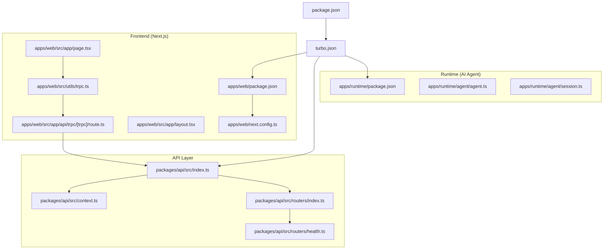
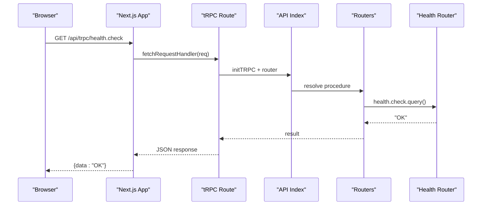
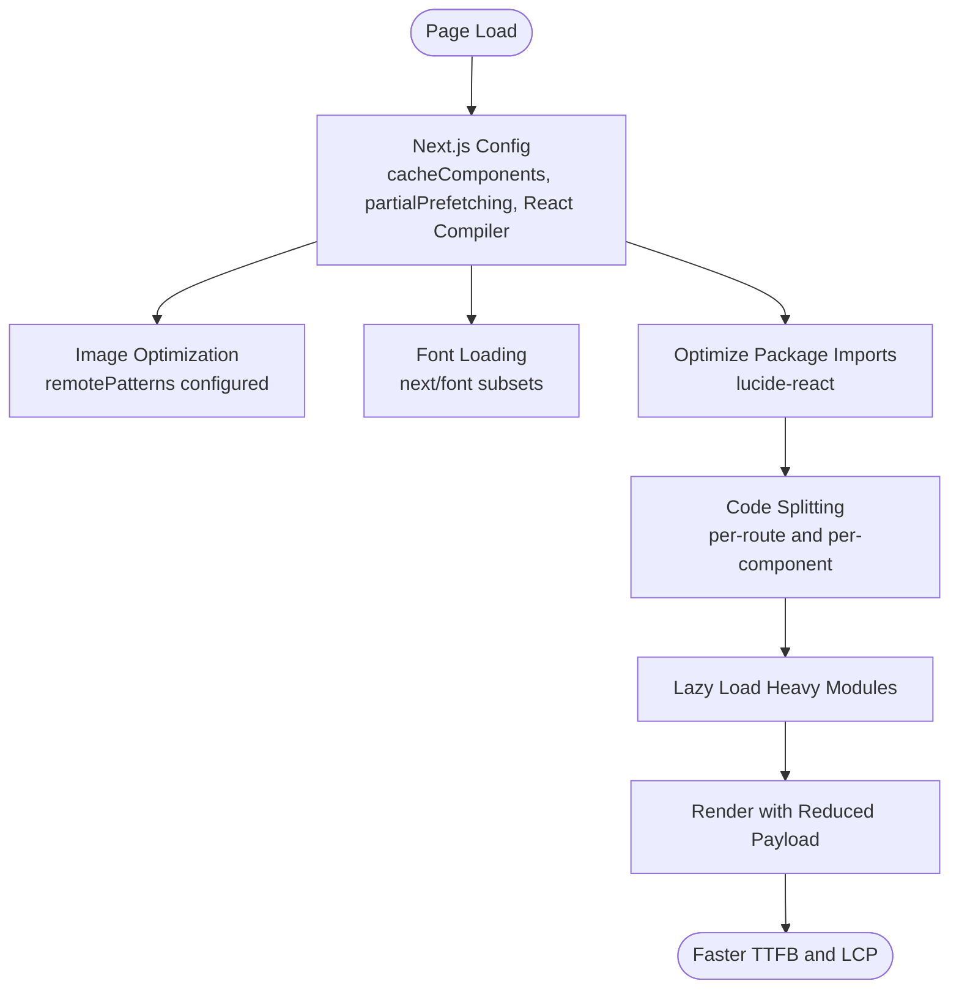
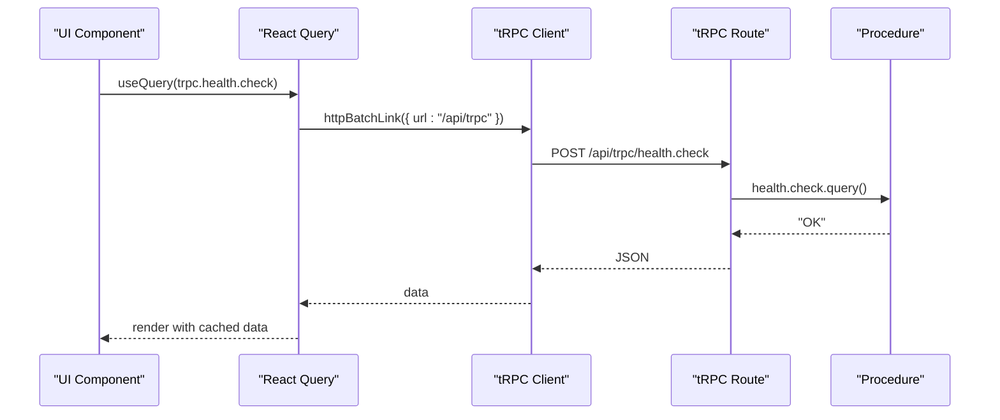
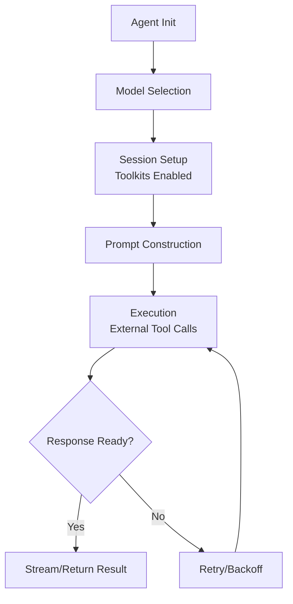
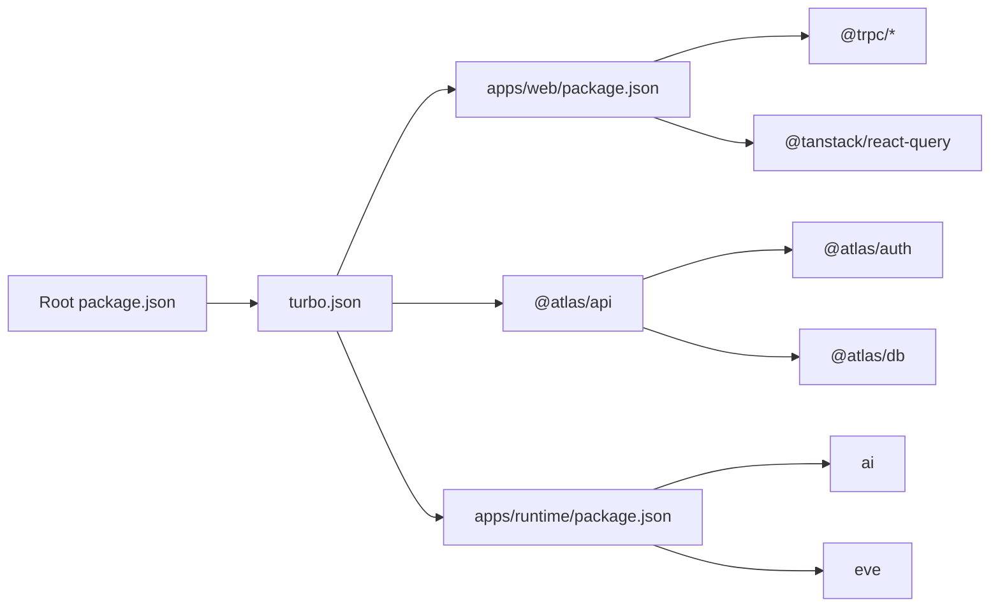

# Performance Optimization

<cite>
**Referenced Files in This Document**
- [package.json](file://package.json)
- [turbo.json](file://turbo.json)
- [apps/web/package.json](file://apps/web/package.json)
- [apps/web/next.config.ts](file://apps/web/next.config.ts)
- [apps/web/src/app/layout.tsx](file://apps/web/src/app/layout.tsx)
- [apps/web/src/app/page.tsx](file://apps/web/src/app/page.tsx)
- [apps/web/src/utils/trpc.ts](file://apps/web/src/utils/trpc.ts)
- [apps/web/src/app/api/trpc/[trpc]/route.ts](file://apps/web/src/app/api/trpc/[trpc]/route.ts)
- [packages/api/src/index.ts](file://packages/api/src/index.ts)
- [packages/api/src/context.ts](file://packages/api/src/context.ts)
- [packages/api/src/routers/index.ts](file://packages/api/src/routers/index.ts)
- [packages/api/src/routers/health.ts](file://packages/api/src/routers/health.ts)
- [apps/runtime/package.json](file://apps/runtime/package.json)
- [apps/runtime/agent/agent.ts](file://apps/runtime/agent/agent.ts)
- [apps/runtime/agent/session.ts](file://apps/runtime/agent/session.ts)
- [.agents/skills/vercel-react-best-practices/rules/server-cache-lru.md](file://.agents/skills/vercel-react-best-practices/rules/server-cache-lru.md)
- [.agents/skills/vercel-react-best-practices/rules/server-cache-react.md](file://.agents/skills/vercel-react-best-practices/rules/server-cache-react.md)
</cite>

## Table of Contents

1. Introduction
2. Project Structure
3. Core Components
4. Architecture Overview
5. Detailed Component Analysis
6. Dependency Analysis
7. Performance Considerations
8. Troubleshooting Guide
9. Conclusion
10. Appendices

## Introduction

This document provides a comprehensive performance optimization guide for the Atlas application, covering frontend (Next.js), backend (tRPC API and runtime), AI agent considerations, caching strategies, monitoring and profiling, load testing, scalability planning, CDN and browser caching, and mobile performance techniques. It is grounded in the current codebase configuration and best practices documented in the repository’s skills.

## Project Structure

Atlas is a monorepo with:

- apps/web: Next.js frontend using tRPC client and React Query
- packages/api: tRPC server setup, context, and routers
- apps/runtime: AI agent runtime using Eve and external toolkits
- Shared packages: auth, db, env, ui

Key performance-related configurations:

- Turborepo tasks define build caching and outputs
- Next.js config enables component caching, partial prefetching, React Compiler, and image remote patterns
- tRPC routes are exposed via a Next.js API route
- Runtime agent defines model selection and session/toolkit configuration



**Diagram sources**

- [turbo.json:20-49](file://turbo.json#L20-L49)
- [apps/web/next.config.ts:4-28](file://apps/web/next.config.ts#L4-L28)
- [apps/web/src/app/page.tsx:1-39](file://apps/web/src/app/page.tsx#L1-L39)
- [apps/web/src/utils/trpc.ts:1-40](file://apps/web/src/utils/trpc.ts#L1-L40)
- [apps/web/src/app/api/trpc/[trpc]/route.ts:1-13](file://apps/web/src/app/api/trpc/[trpc]/route.ts#L1-L13)
- [packages/api/src/index.ts:1-25](file://packages/api/src/index.ts#L1-L25)
- [packages/api/src/context.ts:1-15](file://packages/api/src/context.ts#L1-L15)
- [packages/api/src/routers/index.ts:1-11](file://packages/api/src/routers/index.ts#L1-L11)
- [packages/api/src/routers/health.ts:1-6](file://packages/api/src/routers/health.ts#L1-L6)
- [apps/runtime/package.json:1-30](file://apps/runtime/package.json#L1-L30)
- [apps/runtime/agent/agent.ts:1-8](file://apps/runtime/agent/agent.ts#L1-L8)
- [apps/runtime/agent/session.ts:1-19](file://apps/runtime/agent/session.ts#L1-L19)

**Section sources**

- [turbo.json:20-49](file://turbo.json#L20-L49)
- [apps/web/next.config.ts:4-28](file://apps/web/next.config.ts#L4-L28)
- [apps/web/src/app/page.tsx:1-39](file://apps/web/src/app/page.tsx#L1-L39)
- [apps/web/src/utils/trpc.ts:1-40](file://apps/web/src/utils/trpc.ts#L1-L40)
- [apps/web/src/app/api/trpc/[trpc]/route.ts:1-13](file://apps/web/src/app/api/trpc/[trpc]/route.ts#L1-L13)
- [packages/api/src/index.ts:1-25](file://packages/api/src/index.ts#L1-L25)
- [packages/api/src/context.ts:1-15](file://packages/api/src/context.ts#L1-L15)
- [packages/api/src/routers/index.ts:1-11](file://packages/api/src/routers/index.ts#L1-L11)
- [packages/api/src/routers/health.ts:1-6](file://packages/api/src/routers/health.ts#L1-L6)
- [apps/runtime/package.json:1-30](file://apps/runtime/package.json#L1-L30)
- [apps/runtime/agent/agent.ts:1-8](file://apps/runtime/agent/agent.ts#L1-L8)
- [apps/runtime/agent/session.ts:1-19](file://apps/runtime/agent/session.ts#L1-L19)

## Core Components

- Frontend (Next.js): Uses React Query for data fetching, tRPC client for type-safe calls, and Next.js optimizations like component caching and partial prefetching. Fonts are loaded via next/font to avoid layout shifts.
- API (tRPC): Centralized router composition, protected procedures with session validation, and a health check endpoint.
- Runtime (AI Agent): Model selection and toolkit provisioning via Eve and Composio sessions.

Performance highlights:

- Next.js component caching and React Compiler reduce render overhead
- Partial prefetching improves perceived performance
- tRPC batching reduces network round-trips
- Runtime model and session configuration impact AI response latency

**Section sources**

- [apps/web/next.config.ts:4-28](file://apps/web/next.config.ts#L4-L28)
- [apps/web/src/app/layout.tsx:1-47](file://apps/web/src/app/layout.tsx#L1-L47)
- [apps/web/src/utils/trpc.ts:1-40](file://apps/web/src/utils/trpc.ts#L1-L40)
- [packages/api/src/index.ts:1-25](file://packages/api/src/index.ts#L1-L25)
- [packages/api/src/routers/index.ts:1-11](file://packages/api/src/routers/index.ts#L1-L11)
- [packages/api/src/routers/health.ts:1-6](file://packages/api/src/routers/health.ts#L1-L6)
- [apps/runtime/agent/agent.ts:1-8](file://apps/runtime/agent/agent.ts#L1-L8)
- [apps/runtime/agent/session.ts:1-19](file://apps/runtime/agent/session.ts#L1-L19)

## Architecture Overview

The request flow from the Next.js frontend to the tRPC API and beyond:



**Diagram sources**

- [apps/web/src/app/api/trpc/[trpc]/route.ts:1-13](file://apps/web/src/app/api/trpc/[trpc]/route.ts#L1-L13)
- [packages/api/src/index.ts:1-25](file://packages/api/src/index.ts#L1-L25)
- [packages/api/src/routers/index.ts:1-11](file://packages/api/src/routers/index.ts#L1-L11)
- [packages/api/src/routers/health.ts:1-6](file://packages/api/src/routers/health.ts#L1-L6)

## Detailed Component Analysis

### Frontend Optimization (Next.js)

- Bundle size reduction:
  - Use Next.js experimental optimizePackageImports for icon libraries to tree-shake unused icons
  - Prefer dynamic imports for heavy components or third-party libraries not needed on initial load
  - Avoid unnecessary dependencies; keep only required features
- Code splitting and lazy loading:
  - Leverage Next.js automatic code splitting per route and per component
  - Use dynamic imports for non-critical UI or analytics
- Image optimization:
  - Configure remotePatterns to allow optimized delivery of avatars or images from trusted hosts
  - Use Next/Image for local images to get automatic resizing and modern formats
- Rendering and hydration:
  - Enable cacheComponents and reactCompiler to improve rendering performance
  - Use partialPrefetching to start fetching data earlier
  - Load fonts via next/font to prevent layout shift and enable font subsetting



**Diagram sources**

- [apps/web/next.config.ts:4-28](file://apps/web/next.config.ts#L4-L28)
- [apps/web/src/app/layout.tsx:1-47](file://apps/web/src/app/layout.tsx#L1-L47)

**Section sources**

- [apps/web/next.config.ts:4-28](file://apps/web/next.config.ts#L4-L28)
- [apps/web/src/app/layout.tsx:1-47](file://apps/web/src/app/layout.tsx#L1-L47)

### Data Fetching and Caching (React Query + tRPC)

- Client-side caching:
  - React Query manages cached queries with retry actions on errors
  - tRPC httpBatchLink batches multiple requests to reduce network overhead
- Server-side deduplication:
  - Use React.cache() for per-request deduplication of expensive operations (e.g., DB queries, auth checks)
  - For cross-request caching, consider an LRU cache (in-memory or Redis) depending on deployment model



**Diagram sources**

- [apps/web/src/app/page.tsx:1-39](file://apps/web/src/app/page.tsx#L1-L39)
- [apps/web/src/utils/trpc.ts:1-40](file://apps/web/src/utils/trpc.ts#L1-L40)
- [apps/web/src/app/api/trpc/[trpc]/route.ts:1-13](file://apps/web/src/app/api/trpc/[trpc]/route.ts#L1-L13)
- [packages/api/src/routers/health.ts:1-6](file://packages/api/src/routers/health.ts#L1-L6)

**Section sources**

- [apps/web/src/utils/trpc.ts:1-40](file://apps/web/src/utils/trpc.ts#L1-L40)
- [.agents/skills/vercel-react-best-practices/rules/server-cache-react.md:1-77](file://.agents/skills/vercel-react-best-practices/rules/server-cache-react.md#L1-L77)
- [.agents/skills/vercel-react-best-practices/rules/server-cache-lru.md:1-42](file://.agents/skills/vercel-react-best-practices/rules/server-cache-lru.md#L1-L42)

### Backend Performance Tuning (tRPC API)

- Context and authentication:
  - Extract session in context to avoid repeated auth calls within a request
  - Use protected procedures to enforce authorization early
- Router composition:
  - Keep routers small and focused; compose them at the root to maintain clarity and testability
- Response optimization:
  - Return minimal payloads; avoid over-fetching
  - Use tRPC batching to reduce round trips

```mermaid
classDiagram
class Context {
+session
}
class APIIndex {
+initTRPC()
+publicProcedure()
+protectedProcedure()
}
class Routers {
+router({...})
}
class HealthRouter {
+check()
}
APIIndex --> Context : "uses"
APIIndex --> Routers : "composes"
Routers --> HealthRouter : "includes"
```

**Diagram sources**

- [packages/api/src/context.ts:1-15](file://packages/api/src/context.ts#L1-L15)
- [packages/api/src/index.ts:1-25](file://packages/api/src/index.ts#L1-L25)
- [packages/api/src/routers/index.ts:1-11](file://packages/api/src/routers/index.ts#L1-L11)
- [packages/api/src/routers/health.ts:1-6](file://packages/api/src/routers/health.ts#L1-L6)

**Section sources**

- [packages/api/src/context.ts:1-15](file://packages/api/src/context.ts#L1-L15)
- [packages/api/src/index.ts:1-25](file://packages/api/src/index.ts#L1-L25)
- [packages/api/src/routers/index.ts:1-11](file://packages/api/src/routers/index.ts#L1-L11)
- [packages/api/src/routers/health.ts:1-6](file://packages/api/src/routers/health.ts#L1-L6)

### AI Agent Performance Considerations

- Model selection:
  - Choose models that balance latency and quality for your use case; the runtime currently defines a specific model
- Prompt optimization:
  - Keep prompts concise and structured; precompute static parts where possible
- Conversation state management:
  - Use session toolkits to manage integrations efficiently; ensure only necessary tools are enabled per session
- Latency mitigation:
  - Stream responses when possible
  - Cache frequent tool results if applicable



**Diagram sources**

- [apps/runtime/agent/agent.ts:1-8](file://apps/runtime/agent/agent.ts#L1-L8)
- [apps/runtime/agent/session.ts:1-19](file://apps/runtime/agent/session.ts#L1-L19)

**Section sources**

- [apps/runtime/agent/agent.ts:1-8](file://apps/runtime/agent/agent.ts#L1-L8)
- [apps/runtime/agent/session.ts:1-19](file://apps/runtime/agent/session.ts#L1-L19)

## Dependency Analysis

Monorepo orchestration and workspace dependencies influence build times and runtime performance:

- Turborepo caches builds and enforces task dependencies
- Workspace packages share dependencies to avoid duplication
- Root package defines catalog versions for consistency



**Diagram sources**

- [package.json:1-66](file://package.json#L1-L66)
- [turbo.json:20-49](file://turbo.json#L20-L49)
- [apps/web/package.json:1-47](file://apps/web/package.json#L1-L47)
- [apps/runtime/package.json:1-30](file://apps/runtime/package.json#L1-L30)

**Section sources**

- [package.json:1-66](file://package.json#L1-L66)
- [turbo.json:20-49](file://turbo.json#L20-L49)
- [apps/web/package.json:1-47](file://apps/web/package.json#L1-L47)
- [apps/runtime/package.json:1-30](file://apps/runtime/package.json#L1-L30)

## Performance Considerations

- Frontend bundle size:
  - Tree-shake unused icons via optimizePackageImports
  - Defer non-critical scripts and libraries
  - Use dynamic imports for heavy components
- Code splitting and lazy loading:
  - Route-based splitting is automatic; further split large modules
  - Lazy-load charts, maps, or rich editors
- Image optimization:
  - Configure remotePatterns for trusted CDNs
  - Use Next/Image for local assets to leverage compression and responsive formats
- Database query optimization:
  - Select only needed fields
  - Add indexes for frequently queried columns
  - Use pagination and cursor-based navigation for large datasets
- Caching strategies:
  - Per-request deduplication with React.cache() for server functions
  - Cross-request LRU caching for hot data; choose in-memory (serverless-friendly) or Redis for distributed environments
- API response optimization:
  - Batch requests via tRPC httpBatchLink
  - Minimize payload sizes; return only what the UI needs
- CDN usage:
  - Serve static assets through a CDN
  - Enable immutable caching for versioned assets
- Browser caching:
  - Set appropriate cache headers for static assets
  - Use service workers for offline capabilities and faster repeat visits
- Mobile performance:
  - Reduce main thread work; prefer web workers for heavy computations
  - Optimize images for smaller screens; use responsive images
  - Minimize reflows and repaints; batch DOM updates

[No sources needed since this section provides general guidance]

## Troubleshooting Guide

- Identify bottlenecks:
  - Use Next.js built-in metrics and performance insights
  - Monitor tRPC request durations and error rates
  - Profile React renders with DevTools to detect excessive re-renders
- Common issues:
  - Large bundles causing slow TTFB: audit dependencies and enable tree-shaking
  - Slow API responses: add caching layers and optimize queries
  - High memory usage: review streaming and large object handling in AI agent flows
- Mitigation steps:
  - Implement retries and backoff for flaky external calls
  - Add timeouts and circuit breakers for downstream services
  - Log key performance indicators (latency, throughput, error rate)

**Section sources**

- [apps/web/src/utils/trpc.ts:1-40](file://apps/web/src/utils/trpc.ts#L1-L40)
- [packages/api/src/index.ts:1-25](file://packages/api/src/index.ts#L1-L25)

## Conclusion

Atlas benefits from modern Next.js optimizations, efficient tRPC routing, and a flexible AI runtime. By applying bundle reduction, code splitting, caching strategies, and careful model and session configuration, you can significantly improve speed and efficiency. Continuous monitoring, profiling, and load testing will help sustain performance as the application scales.

[No sources needed since this section summarizes without analyzing specific files]

## Appendices

### Example: Measuring Application Performance

- Frontend:
  - Use Next.js performance metrics and browser DevTools to measure TTFB, LCP, and CLS
  - Track React Query cache hit ratios and tRPC batch efficiency
- Backend:
  - Instrument tRPC endpoints to log latency and error rates
  - Monitor database query execution plans and slow queries
- AI Agent:
  - Measure model response times and token throughput
  - Track session creation and toolkit call latencies

[No sources needed since this section provides general guidance]

### Example: Optimizing Critical User Journeys

- Home page health check:
  - Ensure tRPC batching is active and React Query caches results appropriately
  - Validate that Next.js component caching reduces redundant renders
- Authentication flows:
  - Deduplicate session checks using per-request caching
  - Minimize payload sizes in auth responses

**Section sources**

- [apps/web/src/app/page.tsx:1-39](file://apps/web/src/app/page.tsx#L1-L39)
- [apps/web/src/utils/trpc.ts:1-40](file://apps/web/src/utils/trpc.ts#L1-L40)
- [packages/api/src/context.ts:1-15](file://packages/api/src/context.ts#L1-L15)

### Example: Implementing Best Practices

- Per-request deduplication:
  - Wrap expensive server functions with React.cache() to avoid duplicate work within a single request
- Cross-request caching:
  - Introduce an LRU cache for frequently accessed data; select in-memory or Redis based on deployment constraints

**Section sources**

- [.agents/skills/vercel-react-best-practices/rules/server-cache-react.md:1-77](file://.agents/skills/vercel-react-best-practices/rules/server-cache-react.md#L1-L77)
- [.agents/skills/vercel-react-best-practices/rules/server-cache-lru.md:1-42](file://.agents/skills/vercel-react-best-practices/rules/server-cache-lru.md#L1-L42)
