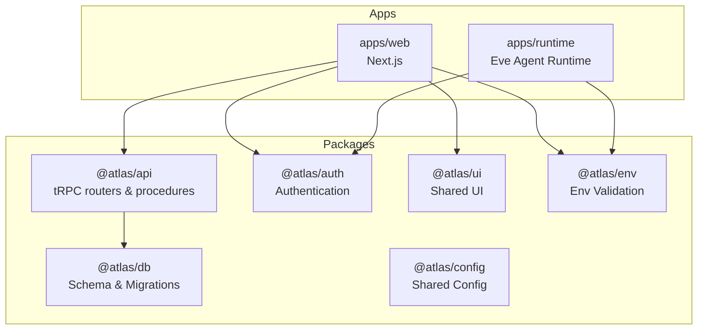
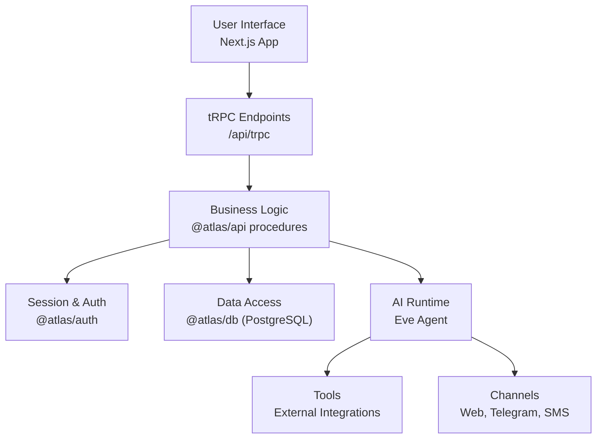
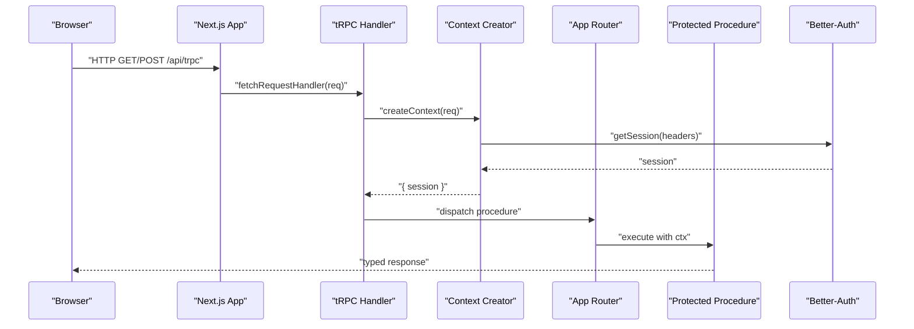
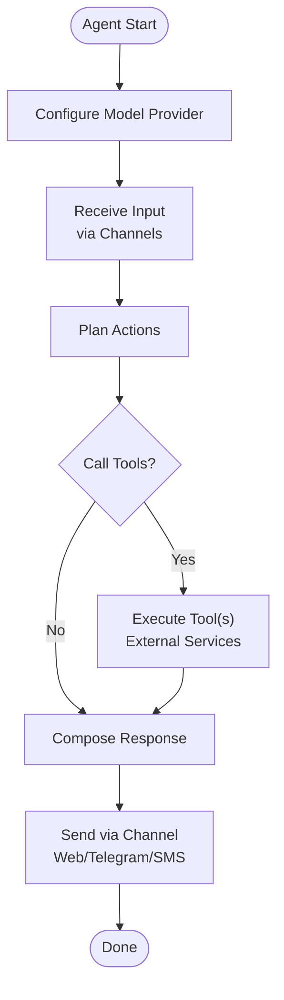
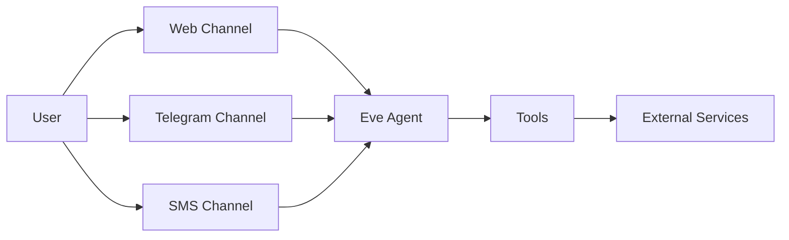
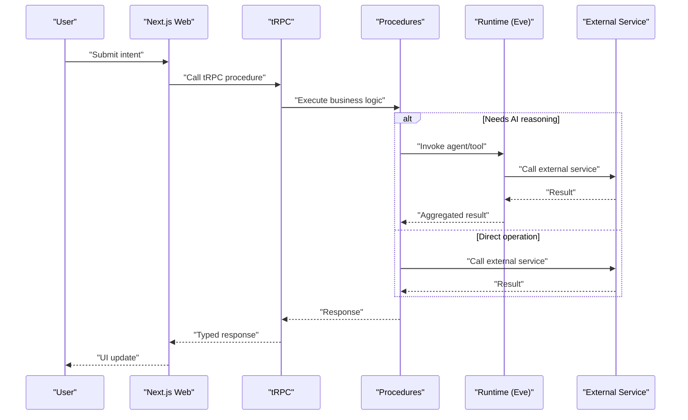
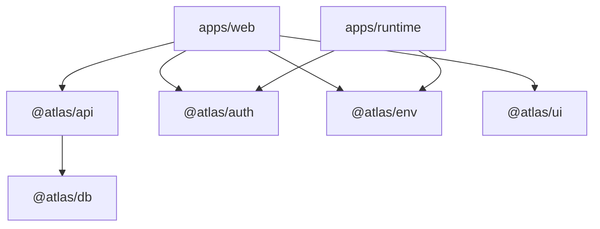

# Architecture Overview

<cite>
**Referenced Files in This Document**
- [README.md](file://README.md)
- [package.json](file://package.json)
- [turbo.json](file://turbo.json)
- [apps/web/package.json](file://apps/web/package.json)
- [apps/runtime/package.json](file://apps/runtime/package.json)
- [apps/web/src/app/api/trpc/[trpc]/route.ts](file://apps/web/src/app/api/trpc/[trpc]/route.ts)
- [packages/api/src/index.ts](file://packages/api/src/index.ts)
- [packages/api/src/context.ts](file://packages/api/src/context.ts)
- [packages/api/src/routers/index.ts](file://packages/api/src/routers/index.ts)
- [apps/runtime/agent/agent.ts](file://apps/runtime/agent/agent.ts)
</cite>

## Table of Contents

1. [Introduction](#introduction)
2. [Project Structure](#project-structure)
3. [Core Components](#core-components)
4. [Architecture Overview](#architecture-overview)
5. [Detailed Component Analysis](#detailed-component-analysis)
6. [Dependency Analysis](#dependency-analysis)
7. [Performance Considerations](#performance-considerations)
8. [Troubleshooting Guide](#troubleshooting-guide)
9. [Conclusion](#conclusion)

## Introduction

This document explains Atlas’s high-level system design and component relationships across a monorepo that combines a Next.js web application, an AI runtime powered by the Eve framework, and shared packages for API, authentication, database, UI, configuration, and environment validation. It describes the layered architecture (presentation, business logic, data access), the AI agent orchestration model, multi-channel communication (web, Telegram, SMS), data flows from user input through AI processing to external services, and considerations for scalability, security boundaries, and deployment topology.

## Project Structure

Atlas is organized as a Turborepo monorepo with two primary applications and several shared packages:

- apps/web: Next.js full-stack application serving the presentation layer and tRPC endpoints.
- apps/runtime: AI agent runtime built on the Eve framework, orchestrating tools and channels.
- packages/*: Shared libraries including API (tRPC routers and procedures), auth (Better-Auth integration), db (Drizzle schema and migrations), ui (shared components), config (shared tooling), and env (environment validation).

**Diagram sources**

- [README.md:79-94](file://README.md#L79-L94)
- [package.json:4-26](file://package.json#L4-L26)

**Section sources**

- [README.md:79-94](file://README.md#L79-L94)
- [package.json:4-26](file://package.json#L4-L26)

## Core Components

- Presentation Layer (Web): The Next.js app renders pages and exposes tRPC endpoints under /api/trpc. It composes UI from @atlas/ui and uses @atlas/auth for session handling.
- Business Logic Layer (API): The @atlas/api package defines tRPC routers and procedures, including protected procedures that enforce authentication via Better-Auth sessions.
- Data Access Layer (Database): The @atlas/db package manages schema definitions and migrations using Drizzle ORM against PostgreSQL.
- AI Runtime (Eve): The runtime app runs an Eve agent configured with a model provider and integrates tools and channels for external interactions.

Key responsibilities:

- Web app: routes, UI composition, client-side state, and tRPC client usage.
- API package: request context creation, procedure authorization, router composition.
- Database package: schema, migrations, and type-safe queries.
- Runtime: agent lifecycle, tool execution, and channel messaging.

**Section sources**

- [apps/web/src/app/api/trpc/[trpc]/route.ts:1-14](file://apps/web/src/app/api/trpc/[trpc]/route.ts#L1-L14)
- [packages/api/src/index.ts:1-26](file://packages/api/src/index.ts#L1-L26)
- [packages/api/src/context.ts:1-15](file://packages/api/src/context.ts#L1-L15)
- [apps/runtime/agent/agent.ts:1-8](file://apps/runtime/agent/agent.ts#L1-L8)

## Architecture Overview

Atlas follows a layered architecture pattern:

- Presentation Layer: Next.js serves UI and handles HTTP requests, delegating business logic to tRPC endpoints.
- Business Logic Layer: tRPC procedures encapsulate domain operations, enforce authorization, and coordinate with data access and external services.
- Data Access Layer: Drizzle-managed PostgreSQL provides persistent storage; external integrations are invoked via tools within the AI runtime or API procedures.

The AI agent architecture centers around the Eve framework:

- The agent is defined with a model provider and can call tools (e.g., flight search, order creation) and communicate over multiple channels (web, Telegram, SMS).
- Channels abstract platform-specific protocols while the agent coordinates workflows and tool invocations.

**Diagram sources**

- [apps/web/src/app/api/trpc/[trpc]/route.ts:1-14](file://apps/web/src/app/api/trpc/[trpc]/route.ts#L1-L14)
- [packages/api/src/index.ts:1-26](file://packages/api/src/index.ts#L1-L26)
- [packages/api/src/context.ts:1-15](file://packages/api/src/context.ts#L1-L15)
- [apps/runtime/agent/agent.ts:1-8](file://apps/runtime/agent/agent.ts#L1-L8)

## Detailed Component Analysis

### tRPC Endpoint and Context Flow

The Next.js app exposes tRPC endpoints that create a context with session information and route requests to the composed app router. Protected procedures ensure authentication before executing business logic.

**Diagram sources**

- [apps/web/src/app/api/trpc/[trpc]/route.ts:1-14](file://apps/web/src/app/api/trpc/[trpc]/route.ts#L1-L14)
- [packages/api/src/context.ts:1-15](file://packages/api/src/context.ts#L1-L15)
- [packages/api/src/index.ts:1-26](file://packages/api/src/index.ts#L1-L26)
- [packages/api/src/routers/index.ts:1-11](file://packages/api/src/routers/index.ts#L1-L11)

**Section sources**

- [apps/web/src/app/api/trpc/[trpc]/route.ts:1-14](file://apps/web/src/app/api/trpc/[trpc]/route.ts#L1-L14)
- [packages/api/src/index.ts:1-26](file://packages/api/src/index.ts#L1-L26)
- [packages/api/src/context.ts:1-15](file://packages/api/src/context.ts#L1-L15)
- [packages/api/src/routers/index.ts:1-11](file://packages/api/src/routers/index.ts#L1-L11)

### AI Agent Orchestration (Eve Framework)

The runtime defines an agent with a model provider. The agent coordinates tools and channels to process user intents and interact with external services.

**Diagram sources**

- [apps/runtime/agent/agent.ts:1-8](file://apps/runtime/agent/agent.ts#L1-L8)

**Section sources**

- [apps/runtime/agent/agent.ts:1-8](file://apps/runtime/agent/agent.ts#L1-L8)

### Multi-Channel Communication Pattern

Atlas supports multiple channels for interacting with users:

- Web: Directly integrated via the Next.js app and tRPC endpoints.
- Telegram: Channel implementation for bot-based messaging.
- SMS: Channel implementation for telephony-based messaging.

[No sources needed since this diagram shows conceptual workflow, not actual code structure]

### Data Flow: From User Input to External Service Integration

A typical request flow involves the web interface invoking tRPC, which executes business logic, optionally delegates to the AI runtime for complex tasks, and interacts with external services via tools.

[No sources needed since this diagram shows conceptual workflow, not actual code structure]

## Dependency Analysis

At the monorepo level:

- apps/web depends on @atlas/api, @atlas/auth, @atlas/env, and @atlas/ui.
- apps/runtime depends on @atlas/atlas-client, @atlas/auth, and the Eve framework.
- @atlas/api composes routers and relies on @atlas/auth for session context.
- @atlas/db provides schema and migrations used by both API and runtime where applicable.

**Diagram sources**

- [apps/web/package.json:11-34](file://apps/web/package.json#L11-L34)
- [apps/runtime/package.json:15-23](file://apps/runtime/package.json#L15-L23)
- [packages/api/src/context.ts:1-15](file://packages/api/src/context.ts#L1-L15)

**Section sources**

- [apps/web/package.json:11-34](file://apps/web/package.json#L11-L34)
- [apps/runtime/package.json:15-23](file://apps/runtime/package.json#L15-L23)
- [packages/api/src/context.ts:1-15](file://packages/api/src/context.ts#L1-L15)

## Performance Considerations

- Build and Dev Optimization: Turborepo caches builds and enables incremental compilation across workspaces. Global environment variables are declared to avoid rebuilds when only non-env files change.
- Request Handling: tRPC endpoints are lightweight and delegate heavy processing to procedures or the AI runtime to keep the web app responsive.
- Database Operations: Use Drizzle-generated types and migrations to minimize query overhead and ensure schema consistency.
- AI Processing: Offload complex reasoning and tool orchestration to the runtime to prevent blocking the web server.

**Section sources**

- [turbo.json:4-19](file://turbo.json#L4-L19)
- [turbo.json:20-49](file://turbo.json#L20-L49)

## Troubleshooting Guide

- Authentication Errors: If a protected procedure fails due to missing session, verify that the context creator retrieves a valid session and that headers are passed correctly from the Next.js request.
- Environment Variables: Ensure required global environment variables (e.g., DATABASE_URL, BETTER_AUTH_SECRET, TELEGRAM_BOT_TOKEN) are set in the runtime environment to avoid initialization failures.
- AI Runtime Issues: Confirm the agent model configuration and that tools/channels are properly initialized before invoking external services.

**Section sources**

- [packages/api/src/index.ts:11-25](file://packages/api/src/index.ts#L11-L25)
- [packages/api/src/context.ts:4-11](file://packages/api/src/context.ts#L4-L11)
- [turbo.json:4-19](file://turbo.json#L4-L19)
- [apps/runtime/agent/agent.ts:1-8](file://apps/runtime/agent/agent.ts#L1-L8)

## Conclusion

Atlas’s architecture separates concerns across a clear layered design: a Next.js presentation layer, a tRPC-driven business logic layer, and a robust data access layer backed by Drizzle and PostgreSQL. The AI runtime leverages the Eve framework to orchestrate tools and channels, enabling multi-channel communication (web, Telegram, SMS) and seamless integration with external services. Turborepo ensures efficient development and builds, while shared packages promote reuse and consistency. This design supports scalability, maintainability, and secure boundary enforcement between layers and environments.
