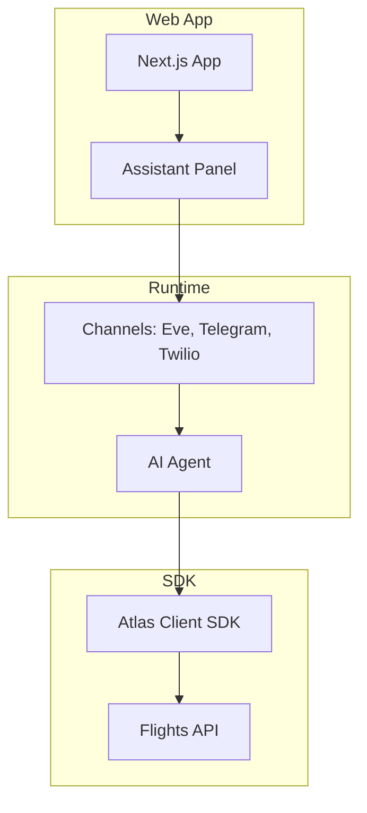
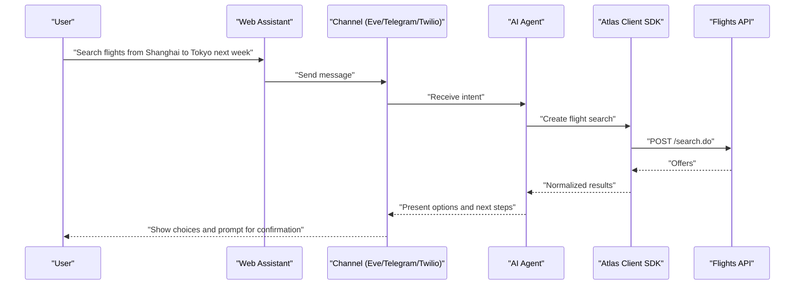
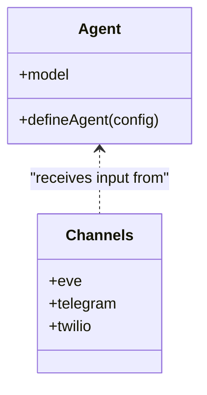
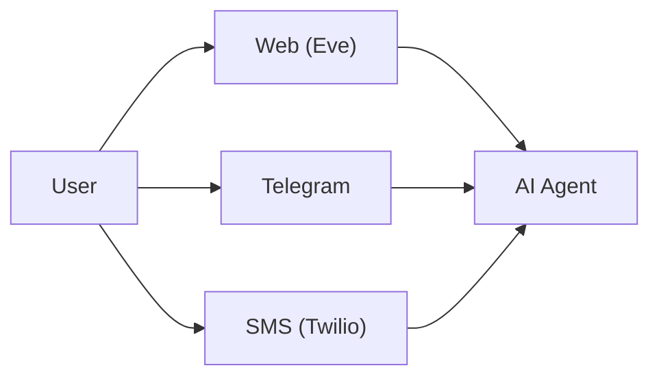
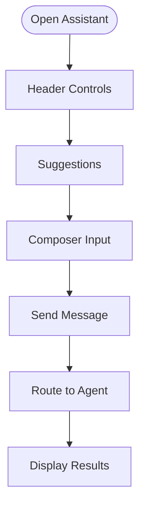
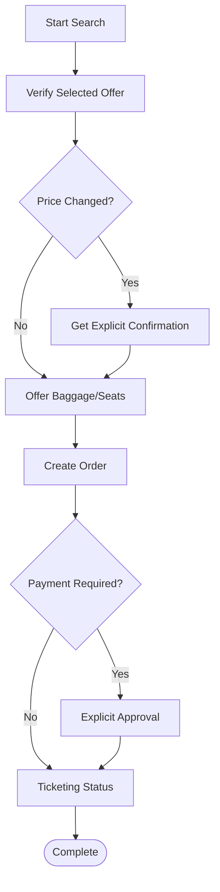
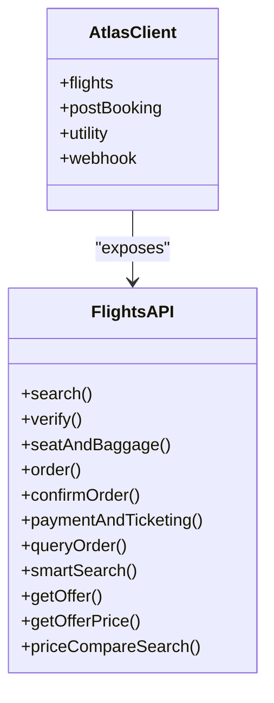
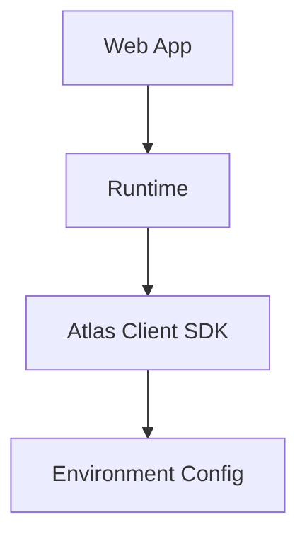

# Introduction and Goals

<cite>
**Referenced Files in This Document**
- [README.md](file://README.md)
- [SKILL.md](file://.agents/skills/atlas-flight-booking/SKILL.md)
- [booking-workflow.md](file://.agents/skills/atlas-flight-booking/references/booking-workflow.md)
- [agent.ts](file://apps/runtime/agent/agent.ts)
- [eve.ts](file://apps/runtime/agent/channels/eve.ts)
- [telegram.ts](file://apps/runtime/agent/channels/telegram.ts)
- [twilio.ts](file://apps/runtime/agent/channels/twilio.ts)
- [atlas-assistant.tsx](file://apps/web/src/components/atlas-assistant.tsx)
- [index.ts](file://packages/atlas/src/index.ts)
- [search.ts](file://packages/atlas/src/flights/search.ts)
</cite>

## Table of Contents

1. [Introduction](#introduction)
2. [Project Structure](#project-structure)
3. [Core Components](#core-components)
4. [Architecture Overview](#architecture-overview)
5. [Detailed Component Analysis](#detailed-component-analysis)
6. [Dependency Analysis](#dependency-analysis)
7. [Performance Considerations](#performance-considerations)
8. [Troubleshooting Guide](#troubleshooting-guide)
9. [Conclusion](#conclusion)
10. [Appendices](#appendices)

## Introduction

Atlas is an AI-powered automation platform for flight bookings that brings together modern web technologies with intelligent agent capabilities to simplify travel planning across multiple channels. Its core mission is to automate the end-to-end flight booking process through natural language interactions, enabling users to search, compare, verify fares, select services, create orders, and manage ticketing without navigating complex forms or juggling disparate tools.

Atlas was built to solve three key problems:

- Simplifying complex flight booking processes by turning multi-step workflows into conversational tasks.
- Providing multi-channel access to travel services so users can interact via a web assistant, Telegram, or SMS.
- Leveraging AI for intelligent travel planning that understands flexible dates, preferences, and constraints while ensuring safe, auditable booking flows.

Target audience includes individual travelers who want a fast, friendly way to plan and book flights, as well as enterprise teams that need automated travel management at scale. The system supports both exact-date searches and flexible date ranges, integrates with external booking systems, and enforces safety checks such as price-change confirmations and explicit payment approvals before proceeding.

Examples of how users can interact with Atlas:

- Web: Open the in-app assistant panel and type natural-language requests like “Show me flights from Shanghai to Tokyo next week” or “Compare prices for September 1–7.”
- Telegram: Message the bot with the same prompts; the agent interprets intent, runs searches, and guides you through verification and booking.
- SMS: Send text messages to initiate or continue a booking flow, receive status updates, and confirm payments.

These interactions are powered by an AI agent runtime that coordinates channel inputs, orchestrates tool calls (search, verify, order creation, payment), and presents normalized results back to the user in their preferred channel.

**Section sources**

- [README.md:1-107](file://README.md#L1-L107)
- [SKILL.md:1-47](file://.agents/skills/atlas-flight-booking/SKILL.md#L1-L47)
- [booking-workflow.md:1-63](file://.agents/skills/atlas-flight-booking/references/booking-workflow.md#L1-L63)

## Project Structure

Atlas is organized as a monorepo with clear separation between the web application, the AI agent runtime, and shared packages:

- apps/web: Next.js-based web interface with an integrated assistant panel for natural-language interactions.
- apps/runtime: AI agent runtime that exposes channels for web (Eve), Telegram, and SMS (Twilio), and configures the AI model used for reasoning.
- packages/atlas: Client SDK exposing typed APIs for flight search, verification, seat/baggage selection, order creation, payment and ticketing, post-booking operations, and utilities.

This structure enables modular development, shared UI components, and consistent API contracts across channels.

**Diagram sources**

- [README.md:79-94](file://README.md#L79-L94)
- [agent.ts:1-8](file://apps/runtime/agent/agent.ts#L1-L8)
- [eve.ts:1-10](file://apps/runtime/agent/channels/eve.ts#L1-L10)
- [telegram.ts:1-6](file://apps/runtime/agent/channels/telegram.ts#L1-L6)
- [twilio.ts:1-7](file://apps/runtime/agent/channels/twilio.ts#L1-L7)
- [index.ts:36-77](file://packages/atlas/src/index.ts#L36-L77)

**Section sources**

- [README.md:79-107](file://README.md#L79-L107)

## Core Components

- AI Agent Runtime: Configured with an AI model and exposed through multiple channels to accept natural-language input and orchestrate tool calls.
- Multi-Channel Communication: Channels include a web channel (Eve), Telegram, and SMS (Twilio), allowing users to interact via their preferred medium.
- Web Assistant: A React-based assistant panel embedded in the Next.js app, providing a conversational UI for flight queries and guidance.
- Atlas Client SDK: A typed client that wraps flight search, verification, seat/baggage selection, order creation, payment and ticketing, post-booking operations, and utility functions.

These components work together to deliver AI-powered automation across channels, ensuring consistent behavior and safe execution of booking workflows.

**Section sources**

- [agent.ts:1-8](file://apps/runtime/agent/agent.ts#L1-L8)
- [eve.ts:1-10](file://apps/runtime/agent/channels/eve.ts#L1-L10)
- [telegram.ts:1-6](file://apps/runtime/agent/channels/telegram.ts#L1-L6)
- [twilio.ts:1-7](file://apps/runtime/agent/channels/twilio.ts#L1-L7)
- [atlas-assistant.tsx:1-175](file://apps/web/src/components/atlas-assistant.tsx#L1-L175)
- [index.ts:36-77](file://packages/atlas/src/index.ts#L36-L77)

## Architecture Overview

The architecture centers on an AI agent that receives user intents from any supported channel, interprets them using natural language understanding, and executes a sequence of tool calls to fulfill the request. The web assistant provides an in-app conversational surface, while Telegram and SMS extend reach beyond the browser. The Atlas Client SDK standardizes communication with downstream booking systems and ensures type-safe interactions.

**Diagram sources**

- [atlas-assistant.tsx:122-175](file://apps/web/src/components/atlas-assistant.tsx#L122-L175)
- [eve.ts:1-10](file://apps/runtime/agent/channels/eve.ts#L1-L10)
- [telegram.ts:1-6](file://apps/runtime/agent/channels/telegram.ts#L1-L6)
- [twilio.ts:1-7](file://apps/runtime/agent/channels/twilio.ts#L1-L7)
- [agent.ts:1-8](file://apps/runtime/agent/agent.ts#L1-L8)
- [index.ts:36-77](file://packages/atlas/src/index.ts#L36-L77)
- [search.ts:1-40](file://packages/atlas/src/flights/search.ts#L1-L40)

## Detailed Component Analysis

### AI Agent and Model Configuration

The agent is defined with a specific model configuration and serves as the central reasoning engine for interpreting user intents and coordinating tool usage. It abstracts the underlying model choice while keeping the runtime minimal and focused on orchestration.

**Diagram sources**

- [agent.ts:1-8](file://apps/runtime/agent/agent.ts#L1-L8)
- [eve.ts:1-10](file://apps/runtime/agent/channels/eve.ts#L1-L10)
- [telegram.ts:1-6](file://apps/runtime/agent/channels/telegram.ts#L1-L6)
- [twilio.ts:1-7](file://apps/runtime/agent/channels/twilio.ts#L1-L7)

**Section sources**

- [agent.ts:1-8](file://apps/runtime/agent/agent.ts#L1-L8)

### Multi-Channel Communication

Atlas exposes multiple channels to support diverse user preferences:

- Web (Eve): Integrated authentication and CORS for seamless in-app experiences.
- Telegram: Bot integration for messaging-based interactions.
- SMS (Twilio): Text-based communication for accessibility and broad reach.

Each channel is configured with credentials and policies appropriate to its medium, enabling consistent agent behavior regardless of entry point.

**Diagram sources**

- [eve.ts:1-10](file://apps/runtime/agent/channels/eve.ts#L1-L10)
- [telegram.ts:1-6](file://apps/runtime/agent/channels/telegram.ts#L1-L6)
- [twilio.ts:1-7](file://apps/runtime/agent/channels/twilio.ts#L1-L7)

**Section sources**

- [eve.ts:1-10](file://apps/runtime/agent/channels/eve.ts#L1-L10)
- [telegram.ts:1-6](file://apps/runtime/agent/channels/telegram.ts#L1-L6)
- [twilio.ts:1-7](file://apps/runtime/agent/channels/twilio.ts#L1-L7)

### Web Assistant Interface

The web assistant provides a conversational panel within the Next.js application. It includes header controls, suggestion prompts, and a composer area for natural-language input. While the current implementation is a placeholder awaiting full AI backend integration, it establishes the UX patterns and layout for future enhancements.

**Diagram sources**

- [atlas-assistant.tsx:122-175](file://apps/web/src/components/atlas-assistant.tsx#L122-L175)

**Section sources**

- [atlas-assistant.tsx:1-175](file://apps/web/src/components/atlas-assistant.tsx#L1-L175)

### Flight Booking Workflow and Safety

Atlas implements a safe, auditable booking workflow guided by natural language:

- Search and verify: Perform searches, present normalized offers, and verify selected offers. If price status indicates reference-only, stop at comparison mode.
- Optional services: Offer baggage and seats when supported; handle unavailability gracefully.
- Passenger input and order creation: Collect required fields once and create orders deterministically.
- Payment confirmation: Require explicit approval after presenting masked details and totals.
- Payment and ticketing: Branch on terminal codes; avoid retries on uncertain states; query status when needed.

This workflow ensures transparency, prevents accidental charges, and maintains consistency across channels.

**Diagram sources**

- [booking-workflow.md:1-63](file://.agents/skills/atlas-flight-booking/references/booking-workflow.md#L1-L63)

**Section sources**

- [booking-workflow.md:1-63](file://.agents/skills/atlas-flight-booking/references/booking-workflow.md#L1-L63)

### Atlas Client SDK and Flight APIs

The Atlas Client SDK exposes a structured API surface for flight-related operations:

- Search: Create flight searches with trip type, passengers, routes, dates, and preferences.
- Verify: Confirm current fare and availability for selected offers.
- Seat and Baggage: Select optional services based on availability.
- Order Creation and Confirmation: Generate orders and confirm details.
- Payment and Ticketing: Execute payments and monitor ticket issuance.
- Post-Booking: Manage PNRs, refunds, voids, and ancillaries.
- Utilities: Balance checks, email queries, route exports, and webhooks.

This SDK standardizes interactions with downstream systems and ensures type safety across the stack.

**Diagram sources**

- [index.ts:36-77](file://packages/atlas/src/index.ts#L36-L77)
- [search.ts:1-40](file://packages/atlas/src/flights/search.ts#L1-L40)

**Section sources**

- [index.ts:36-77](file://packages/atlas/src/index.ts#L36-L77)
- [search.ts:1-40](file://packages/atlas/src/flights/search.ts#L1-L40)

## Dependency Analysis

Atlas’s dependencies are layered to separate concerns:

- Web app depends on shared UI components and integrates the assistant panel.
- Runtime depends on channels and agent configuration to handle multi-channel input.
- SDK depends on environment configuration and encapsulates all flight-related operations.

This separation improves maintainability and allows independent evolution of each layer.

**Diagram sources**

- [README.md:79-94](file://README.md#L79-L94)
- [index.ts:1-17](file://packages/atlas/src/index.ts#L1-L17)

**Section sources**

- [README.md:79-107](file://README.md#L79-L107)
- [index.ts:1-17](file://packages/atlas/src/index.ts#L1-L17)

## Performance Considerations

- Use efficient search strategies: For flexible date ranges, run per-calendar-date searches and merge normalized results only after all attempts complete. Avoid sampling or inventing ranges.
- Compare total prices consistently: Ensure comparisons use total_price for the complete passenger request and group results by currency.
- Minimize redundant calls: Preserve offer IDs and reuse verified data where possible; re-search only when necessary (e.g., expired offers or unavailable flights).
- Handle pending states carefully: Avoid automatic retries on uncertain outcomes; query status instead to reduce load and prevent side effects.

[No sources needed since this section provides general guidance]

## Troubleshooting Guide

Common issues and resolutions:

- Price changes during verification: If the verified price increases, obtain explicit user confirmation before proceeding; do not treat earlier statements as approval.
- Service unavailability: If baggage or seats are unavailable, continue with the main booking flow without blocking.
- Payment uncertainty: On unknown payment results, query order status rather than retrying payment; never reuse confirmation IDs.
- Ticketing blockers: When account top-up is required, guide users to activation and re-check authorization after updates.

**Section sources**

- [booking-workflow.md:1-63](file://.agents/skills/atlas-flight-booking/references/booking-workflow.md#L1-L63)

## Conclusion

Atlas combines AI-powered automation with multi-channel communication to transform flight booking from a complex, manual process into a conversational experience. By focusing on intelligent travel planning, safe workflows, and accessible interfaces across web, Telegram, and SMS, Atlas serves both individual travelers and enterprise teams seeking streamlined travel management. The modular architecture and typed SDK ensure scalability and reliability as the platform evolves.

[No sources needed since this section summarizes without analyzing specific files]

## Appendices

- Example interactions:
  - Web: “Find morning direct flights from Tokyo to Osaka in the next two weeks.”
  - Telegram: “Compare prices for September 1–7, Shanghai to Tokyo.”
  - SMS: “Book the cheapest available option for tomorrow, adult only.”

[No sources needed since this section provides conceptual examples]
