# Key Features Summary

<cite>
**Referenced Files in This Document**
- [README.md](file://README.md)
- [agent.ts](file://apps/runtime/agent/agent.ts)
- [instructions.md](file://apps/runtime/agent/instructions.md)
- [session.ts](file://apps/runtime/agent/session.ts)
- [composio.ts](file://apps/runtime/agent/tools/composio.ts)
- [telegram.ts](file://apps/runtime/agent/channels/telegram.ts)
- [twilio.ts](file://apps/runtime/agent/channels/twilio.ts)
- [eve.ts](file://apps/runtime/agent/channels/eve.ts)
- [route.ts](file://apps/web/src/app/api/auth/[...all]/route.ts)
- [auth.tsx](file://apps/web/src/components/auth.tsx)
- [integrations/page.tsx](file://apps/web/src/app/(protected)/integrations/page.tsx)
- [trips/page.tsx](file://apps/web/src/app/(protected)/trips/page.tsx)
- [bookings/page.tsx](file://apps/web/src/app/(protected)/bookings/page.tsx)
- [activity/page.tsx](file://apps/web/src/app/(protected)/activity/page.tsx)
- [atlas-assistant.tsx](file://apps/web/src/components/atlas-assistant.tsx)
</cite>

## Table of Contents

1. [Introduction](#introduction)
2. [Project Structure](#project-structure)
3. [Core Components](#core-components)
4. [Architecture Overview](#architecture-overview)
5. [Detailed Component Analysis](#detailed-component-analysis)
6. [Dependency Analysis](#dependency-analysis)
7. [Performance Considerations](#performance-considerations)
8. [Troubleshooting Guide](#troubleshooting-guide)
9. [Conclusion](#conclusion)
10. [Appendices](#appendices)

## Introduction

Atlas is a modern, multi-channel AI assistant platform that enables users to automate flight booking and trip management through natural language conversations. It combines a Next.js web dashboard with an AI agent runtime that supports multiple communication channels (web, Telegram, SMS), secure authentication (Google and Telegram), activity tracking, and rich integrations via Composio (Google Calendar, Gmail, Slack, Notion, Google Maps, and more). The system is designed for extensibility, allowing new channels, tools, and integrations to be added easily.

## Project Structure

Atlas follows a monorepo layout:

- apps/web: Next.js frontend with protected routes for trips, bookings, activity, and integrations; auth endpoints; shared UI components.
- apps/runtime: AI agent runtime using Eve, with channels (Telegram, SMS/Twilio, Eve web channel), session/tooling setup via Composio, and agent configuration.
- packages: Shared libraries for API, auth, config, database, environment validation, and UI primitives.

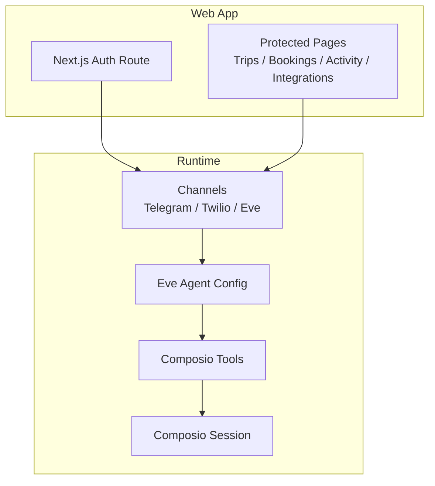

**Diagram sources**

- [route.ts:1-5](file://apps/web/src/app/api/auth/[...all]/route.ts#L1-L5)
- [eve.ts:1-10](file://apps/runtime/agent/channels/eve.ts#L1-L10)
- [telegram.ts:1-6](file://apps/runtime/agent/channels/telegram.ts#L1-L6)
- [twilio.ts:1-7](file://apps/runtime/agent/channels/twilio.ts#L1-L7)
- [agent.ts:1-8](file://apps/runtime/agent/agent.ts#L1-L8)
- [session.ts:1-19](file://apps/runtime/agent/session.ts#L1-L19)
- [composio.ts:1-12](file://apps/runtime/agent/tools/composio.ts#L1-L12)

**Section sources**

- [README.md:1-107](file://README.md#L1-L107)

## Core Components

- AI-powered flight booking automation: An Eve-based agent processes natural language requests to search, compare, and book flights. The agent model is configured centrally and can be swapped as needed.
- Multi-channel communication: Web dashboard, Telegram bot, and SMS notifications are supported via dedicated channels.
- Authentication: Secure sessions via Better-Auth with Google and Telegram providers; Next.js route handler exposes auth endpoints.
- Activity tracking and trip management: Protected pages for trips, bookings, and activity history provide real-time status and collaboration-ready views.
- External service integrations: Composio toolkits enable connections to Google Calendar, Gmail, Slack, Notion, Google Maps, Google Sheets, Firecrawl, and Telegram.
- Extensible plugin architecture: Channels, tools, and integrations are modular and can be extended by adding new channel configs, tool definitions, or Composio toolkits.

**Section sources**

- [agent.ts:1-8](file://apps/runtime/agent/agent.ts#L1-L8)
- [instructions.md:1-4](file://apps/runtime/agent/instructions.md#L1-L4)
- [telegram.ts:1-6](file://apps/runtime/agent/channels/telegram.ts#L1-L6)
- [twilio.ts:1-7](file://apps/runtime/agent/channels/twilio.ts#L1-L7)
- [eve.ts:1-10](file://apps/runtime/agent/channels/eve.ts#L1-L10)
- [route.ts:1-5](file://apps/web/src/app/api/auth/[...all]/route.ts#L1-L5)
- [auth.tsx:1-69](file://apps/web/src/components/auth.tsx#L1-L69)
- [session.ts:1-19](file://apps/runtime/agent/session.ts#L1-L19)
- [composio.ts:1-12](file://apps/runtime/agent/tools/composio.ts#L1-L12)
- [integrations/page.tsx:1-151](<file://apps/web/src/app/(protected)/integrations/page.tsx#L1-L151>)
- [trips/page.tsx:1-30](<file://apps/web/src/app/(protected)/trips/page.tsx#L1-L30>)
- [bookings/page.tsx:1-30](<file://apps/web/src/app/(protected)/bookings/page.tsx#L1-L30>)
- [activity/page.tsx:1-30](<file://apps/web/src/app/(protected)/activity/page.tsx#L1-L30>)

## Architecture Overview

The system orchestrates user interactions across channels into a unified AI agent workflow. The web app handles authentication and presents dashboards; the runtime executes agent logic and calls external services via Composio toolkits.

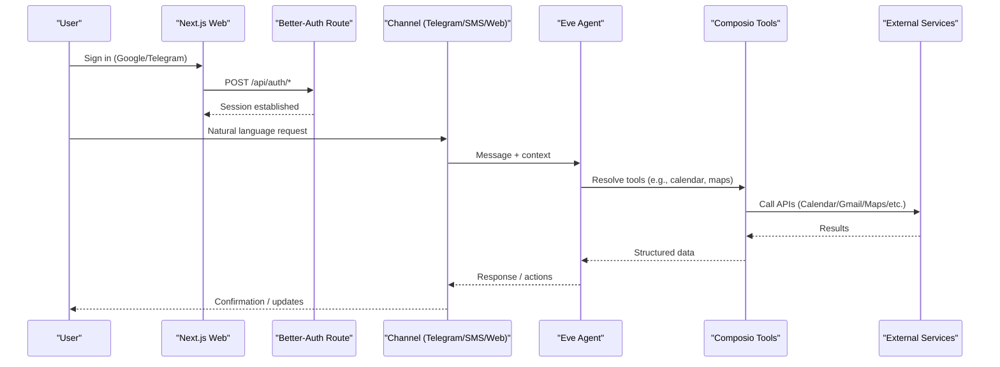

**Diagram sources**

- [route.ts:1-5](file://apps/web/src/app/api/auth/[...all]/route.ts#L1-L5)
- [auth.tsx:1-69](file://apps/web/src/components/auth.tsx#L1-L69)
- [telegram.ts:1-6](file://apps/runtime/agent/channels/telegram.ts#L1-L6)
- [twilio.ts:1-7](file://apps/runtime/agent/channels/twilio.ts#L1-L7)
- [eve.ts:1-10](file://apps/runtime/agent/channels/eve.ts#L1-L10)
- [agent.ts:1-8](file://apps/runtime/agent/agent.ts#L1-L8)
- [session.ts:1-19](file://apps/runtime/agent/session.ts#L1-L19)
- [composio.ts:1-12](file://apps/runtime/agent/tools/composio.ts#L1-L12)

## Detailed Component Analysis

### AI-Powered Flight Booking Automation

- Agent configuration centralizes the model selection and identity instructions.
- The agent receives messages from any channel and uses Composio tools to perform tasks such as searching flights, checking calendars, and sending confirmations.
- Practical example: A user sends “Book me a flight from NYC to LAX next Friday” via Telegram; the agent resolves intent, queries available options, checks availability against calendar events, and returns a summary for confirmation.

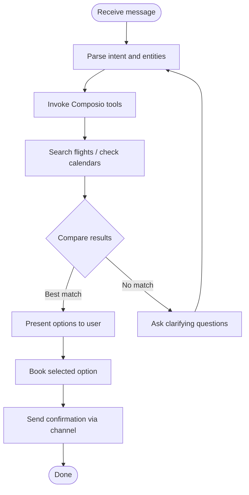

**Diagram sources**

- [agent.ts:1-8](file://apps/runtime/agent/agent.ts#L1-L8)
- [instructions.md:1-4](file://apps/runtime/agent/instructions.md#L1-L4)
- [session.ts:1-19](file://apps/runtime/agent/session.ts#L1-L19)
- [composio.ts:1-12](file://apps/runtime/agent/tools/composio.ts#L1-L12)

**Section sources**

- [agent.ts:1-8](file://apps/runtime/agent/agent.ts#L1-L8)
- [instructions.md:1-4](file://apps/runtime/agent/instructions.md#L1-L4)
- [session.ts:1-19](file://apps/runtime/agent/session.ts#L1-L19)
- [composio.ts:1-12](file://apps/runtime/agent/tools/composio.ts#L1-L12)

### Multi-Channel Communication System

- Web channel: Secured via Better-Auth and exposed through Next.js handlers; integrates with the assistant panel for in-app messaging.
- Telegram channel: Bot token configured at runtime to receive and respond to messages.
- SMS channel: Twilio integration allows sending and receiving SMS notifications.

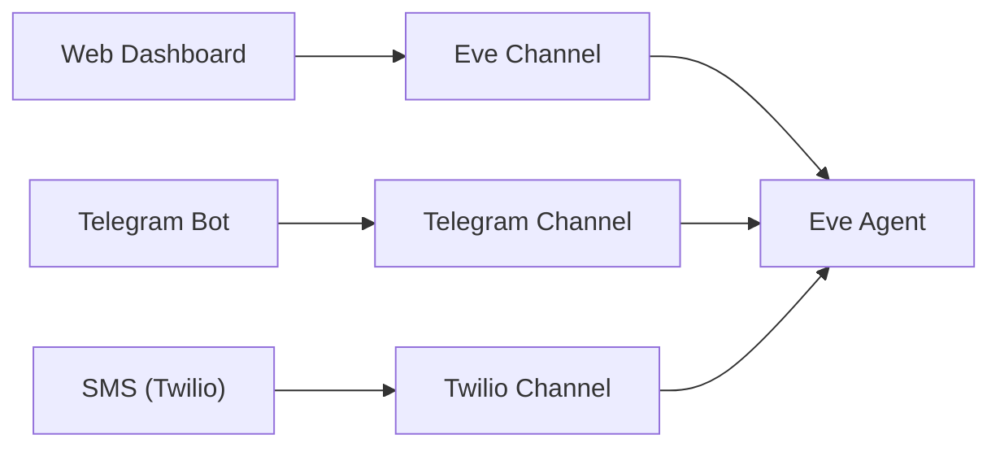

**Diagram sources**

- [eve.ts:1-10](file://apps/runtime/agent/channels/eve.ts#L1-L10)
- [telegram.ts:1-6](file://apps/runtime/agent/channels/telegram.ts#L1-L6)
- [twilio.ts:1-7](file://apps/runtime/agent/channels/twilio.ts#L1-L7)
- [atlas-assistant.tsx:1-175](file://apps/web/src/components/atlas-assistant.tsx#L1-L175)

**Section sources**

- [eve.ts:1-10](file://apps/runtime/agent/channels/eve.ts#L1-L10)
- [telegram.ts:1-6](file://apps/runtime/agent/channels/telegram.ts#L1-L6)
- [twilio.ts:1-7](file://apps/runtime/agent/channels/twilio.ts#L1-L7)
- [atlas-assistant.tsx:1-175](file://apps/web/src/components/atlas-assistant.tsx#L1-L175)

### Authentication System

- Providers: Google and Telegram OIDC flows are surfaced in the web UI and routed through Better-Auth.
- Next.js handler: Exposes standard auth endpoints for sign-in and session management.
- User experience: Last-used provider badge helps streamline re-authentication.

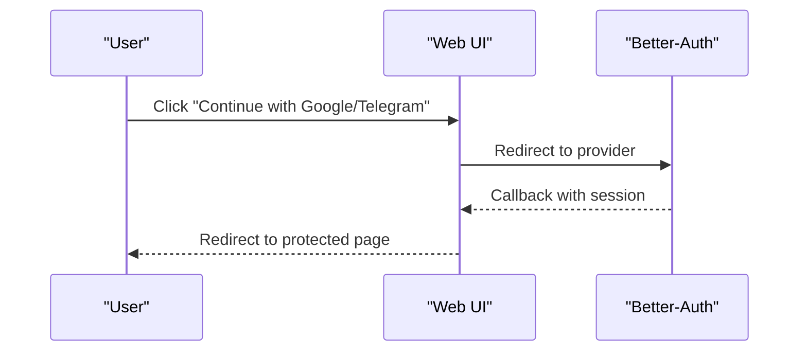

**Diagram sources**

- [auth.tsx:1-69](file://apps/web/src/components/auth.tsx#L1-L69)
- [route.ts:1-5](file://apps/web/src/app/api/auth/[...all]/route.ts#L1-L5)

**Section sources**

- [auth.tsx:1-69](file://apps/web/src/components/auth.tsx#L1-L69)
- [route.ts:1-5](file://apps/web/src/app/api/auth/[...all]/route.ts#L1-L5)

### Activity Tracking and Trip Management

- Trips page: Entry point for planning and viewing upcoming trips.
- Bookings page: Displays confirmed bookings and history.
- Activity page: Shows recent actions and system updates.
- These pages provide a collaborative view of user state and progress.

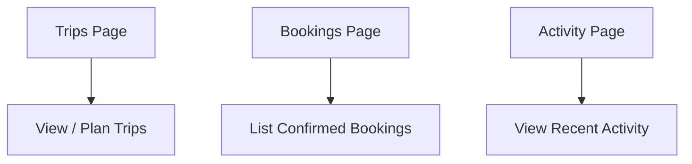

**Diagram sources**

- [trips/page.tsx:1-30](<file://apps/web/src/app/(protected)/trips/page.tsx#L1-L30>)
- [bookings/page.tsx:1-30](<file://apps/web/src/app/(protected)/bookings/page.tsx#L1-L30>)
- [activity/page.tsx:1-30](<file://apps/web/src/app/(protected)/activity/page.tsx#L1-L30>)

**Section sources**

- [trips/page.tsx:1-30](<file://apps/web/src/app/(protected)/trips/page.tsx#L1-L30>)
- [bookings/page.tsx:1-30](<file://apps/web/src/app/(protected)/bookings/page.tsx#L1-L30>)
- [activity/page.tsx:1-30](<file://apps/web/src/app/(protected)/activity/page.tsx#L1-L30>)

### External Service Integrations via Composio

- Supported toolkits include Google Calendar, Gmail, Slack, Notion, Google Maps, Google Sheets, Firecrawl, and Telegram.
- Users connect/disconnect integrations directly from the web dashboard; the runtime creates a session scoped to the active user and loads the requested toolkits.

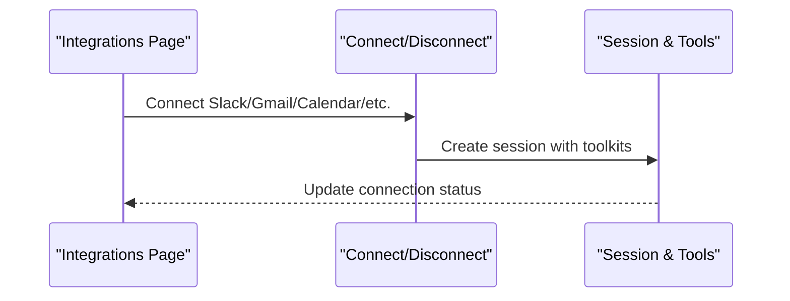

**Diagram sources**

- [integrations/page.tsx:1-151](<file://apps/web/src/app/(protected)/integrations/page.tsx#L1-L151>)
- [session.ts:1-19](file://apps/runtime/agent/session.ts#L1-L19)
- [composio.ts:1-12](file://apps/runtime/agent/tools/composio.ts#L1-L12)

**Section sources**

- [integrations/page.tsx:1-151](<file://apps/web/src/app/(protected)/integrations/page.tsx#L1-L151>)
- [session.ts:1-19](file://apps/runtime/agent/session.ts#L1-L19)
- [composio.ts:1-12](file://apps/runtime/agent/tools/composio.ts#L1-L12)

### Extensible Plugin Architecture

- Channels: Add new channels by implementing a channel factory similar to existing ones (Telegram, Twilio, Eve).
- Tools: Extend capabilities by defining new Composio tools or integrating additional toolkits into the session.
- Integrations: New services can be added to the integrations UI and mapped to toolkits in the session configuration.

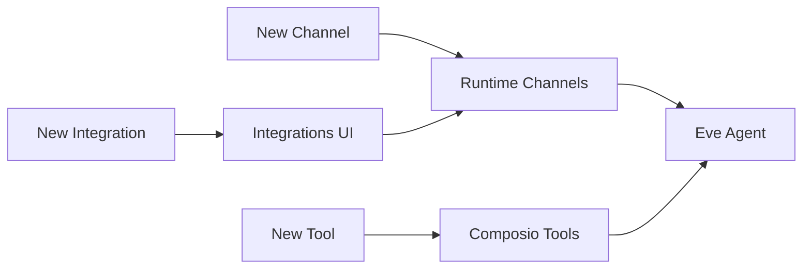

**Diagram sources**

- [telegram.ts:1-6](file://apps/runtime/agent/channels/telegram.ts#L1-L6)
- [twilio.ts:1-7](file://apps/runtime/agent/channels/twilio.ts#L1-L7)
- [eve.ts:1-10](file://apps/runtime/agent/channels/eve.ts#L1-L10)
- [session.ts:1-19](file://apps/runtime/agent/session.ts#L1-L19)
- [composio.ts:1-12](file://apps/runtime/agent/tools/composio.ts#L1-L12)
- [integrations/page.tsx:1-151](<file://apps/web/src/app/(protected)/integrations/page.tsx#L1-L151>)

**Section sources**

- [telegram.ts:1-6](file://apps/runtime/agent/channels/telegram.ts#L1-L6)
- [twilio.ts:1-7](file://apps/runtime/agent/channels/twilio.ts#L1-L7)
- [eve.ts:1-10](file://apps/runtime/agent/channels/eve.ts#L1-L10)
- [session.ts:1-19](file://apps/runtime/agent/session.ts#L1-L19)
- [composio.ts:1-12](file://apps/runtime/agent/tools/composio.ts#L1-L12)
- [integrations/page.tsx:1-151](<file://apps/web/src/app/(protected)/integrations/page.tsx#L1-L151>)

## Dependency Analysis

- Web depends on auth endpoints and renders protected pages that rely on session state.
- Runtime channels depend on environment credentials and forward messages to the agent.
- Agent depends on tool definitions which wrap a Composio session configured per user.
- Integrations UI drives runtime session creation with specific toolkits.

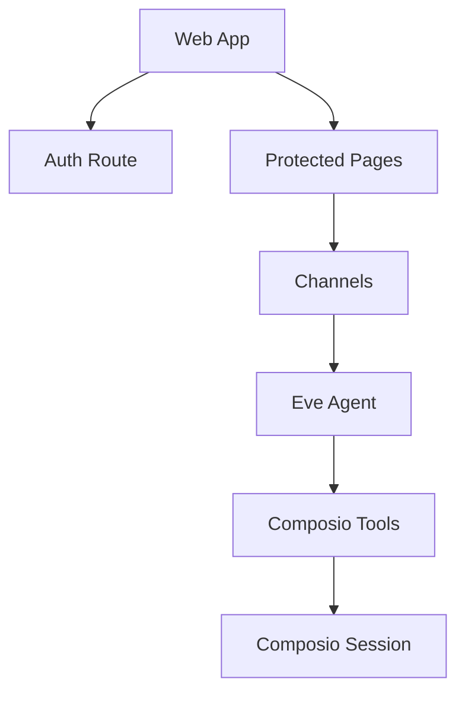

**Diagram sources**

- [route.ts:1-5](file://apps/web/src/app/api/auth/[...all]/route.ts#L1-L5)
- [eve.ts:1-10](file://apps/runtime/agent/channels/eve.ts#L1-L10)
- [agent.ts:1-8](file://apps/runtime/agent/agent.ts#L1-L8)
- [session.ts:1-19](file://apps/runtime/agent/session.ts#L1-L19)
- [composio.ts:1-12](file://apps/runtime/agent/tools/composio.ts#L1-L12)

**Section sources**

- [route.ts:1-5](file://apps/web/src/app/api/auth/[...all]/route.ts#L1-L5)
- [eve.ts:1-10](file://apps/runtime/agent/channels/eve.ts#L1-L10)
- [agent.ts:1-8](file://apps/runtime/agent/agent.ts#L1-L8)
- [session.ts:1-19](file://apps/runtime/agent/session.ts#L1-L19)
- [composio.ts:1-12](file://apps/runtime/agent/tools/composio.ts#L1-L12)

## Performance Considerations

- Keep tool calls efficient by batching requests where possible and caching frequent lookups (e.g., calendar events).
- Use lightweight models for simple intents and reserve larger models for complex reasoning tasks.
- Defer heavy operations (e.g., large file processing) to background jobs and notify users via channels.
- Minimize payload sizes in channel responses to improve responsiveness on mobile networks.

[No sources needed since this section provides general guidance]

## Troubleshooting Guide

- Authentication issues: Verify provider credentials and ensure the Next.js auth route is correctly mounted. Check last-used login method feedback in the UI.
- Channel connectivity: Ensure environment variables for Telegram bot token and Twilio phone number are set. Validate CORS settings for the Eve channel if used locally.
- Tool errors: If a toolkit fails, inspect the session configuration to confirm the toolkit is included and authenticated. Reconnect the integration from the web dashboard if necessary.
- Unexpected behavior: Review agent instructions and model selection; adjust prompts or switch models if responses are inconsistent.

**Section sources**

- [auth.tsx:1-69](file://apps/web/src/components/auth.tsx#L1-L69)
- [route.ts:1-5](file://apps/web/src/app/api/auth/[...all]/route.ts#L1-L5)
- [telegram.ts:1-6](file://apps/runtime/agent/channels/telegram.ts#L1-L6)
- [twilio.ts:1-7](file://apps/runtime/agent/channels/twilio.ts#L1-L7)
- [eve.ts:1-10](file://apps/runtime/agent/channels/eve.ts#L1-L10)
- [session.ts:1-19](file://apps/runtime/agent/session.ts#L1-L19)
- [composio.ts:1-12](file://apps/runtime/agent/tools/composio.ts#L1-L12)
- [instructions.md:1-4](file://apps/runtime/agent/instructions.md#L1-L4)

## Conclusion

Atlas delivers a cohesive, multi-channel AI assistant for flight booking and trip management. With robust authentication, real-time activity tracking, and powerful external integrations via Composio, it provides a seamless experience across web, Telegram, and SMS. Its modular design makes it straightforward to extend with new channels, tools, and services, ensuring long-term adaptability and productivity gains.

[No sources needed since this section summarizes without analyzing specific files]

## Appendices

### Practical Workflows

#### Book a Flight via Telegram

- User sends a natural language request to the Telegram bot.
- The Telegram channel forwards the message to the Eve agent.
- The agent uses Composio tools to search flights, check calendar conflicts, and present options.
- Upon confirmation, the agent books the flight and replies with details and next steps.

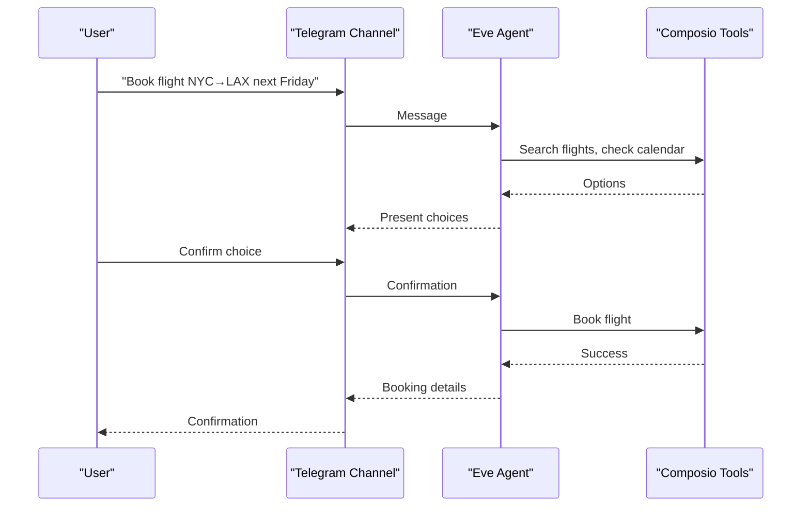

**Diagram sources**

- [telegram.ts:1-6](file://apps/runtime/agent/channels/telegram.ts#L1-L6)
- [agent.ts:1-8](file://apps/runtime/agent/agent.ts#L1-L8)
- [session.ts:1-19](file://apps/runtime/agent/session.ts#L1-L19)
- [composio.ts:1-12](file://apps/runtime/agent/tools/composio.ts#L1-L12)

#### Manage Trips from the Web Interface

- Sign in using Google or Telegram.
- Navigate to Trips to plan or view upcoming travel.
- Use Integrations to connect services like Calendar or Maps for richer context.
- Monitor Activity for recent changes and confirmations.

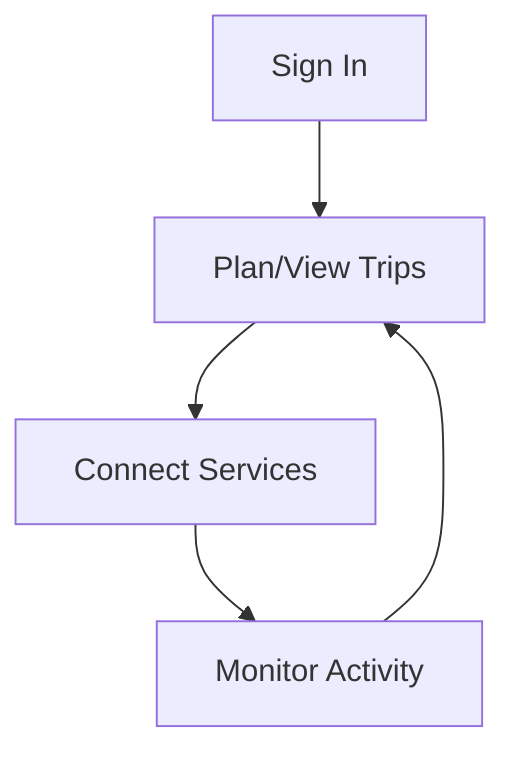

**Diagram sources**

- [auth.tsx:1-69](file://apps/web/src/components/auth.tsx#L1-L69)
- [route.ts:1-5](file://apps/web/src/app/api/auth/[...all]/route.ts#L1-L5)
- [trips/page.tsx:1-30](<file://apps/web/src/app/(protected)/trips/page.tsx#L1-L30>)
- [integrations/page.tsx:1-151](<file://apps/web/src/app/(protected)/integrations/page.tsx#L1-L151>)
- [activity/page.tsx:1-30](<file://apps/web/src/app/(protected)/activity/page.tsx#L1-L30>)
