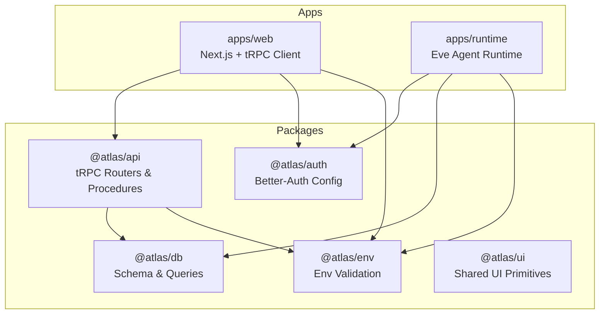
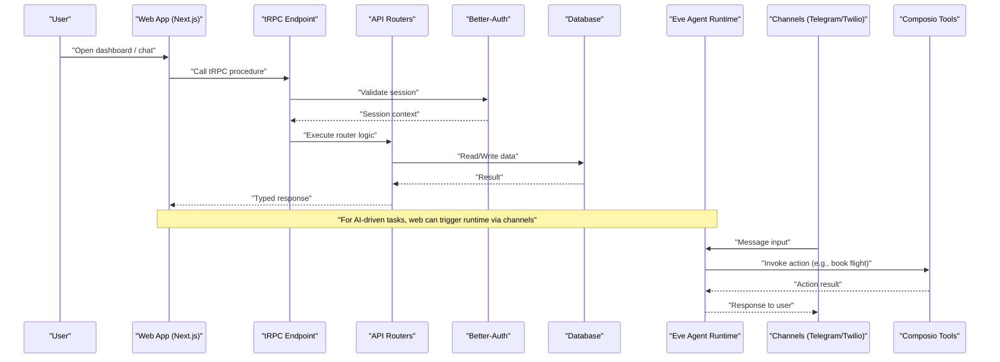
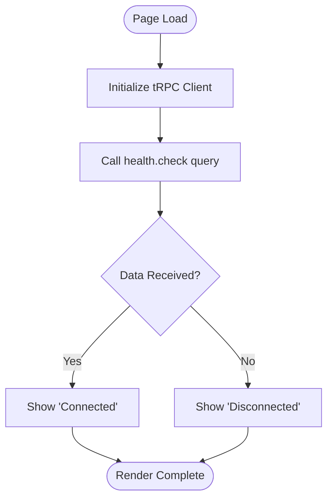
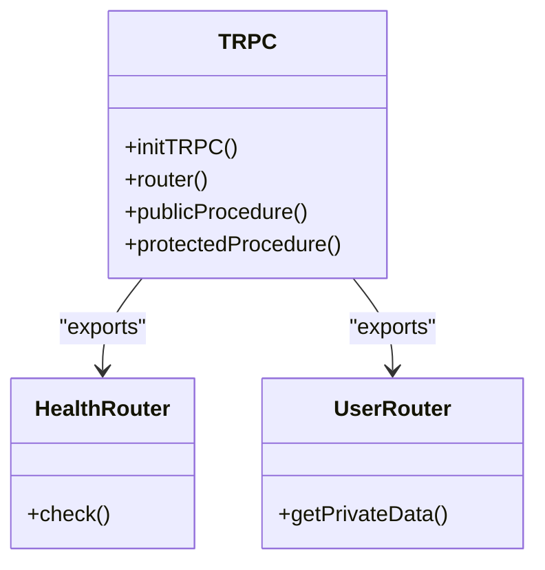
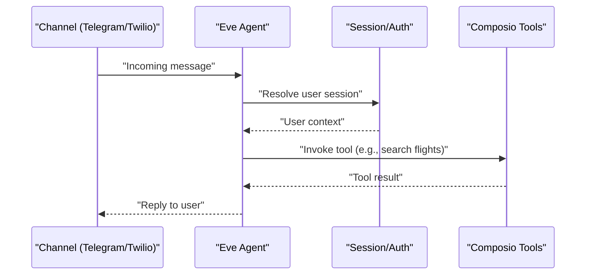
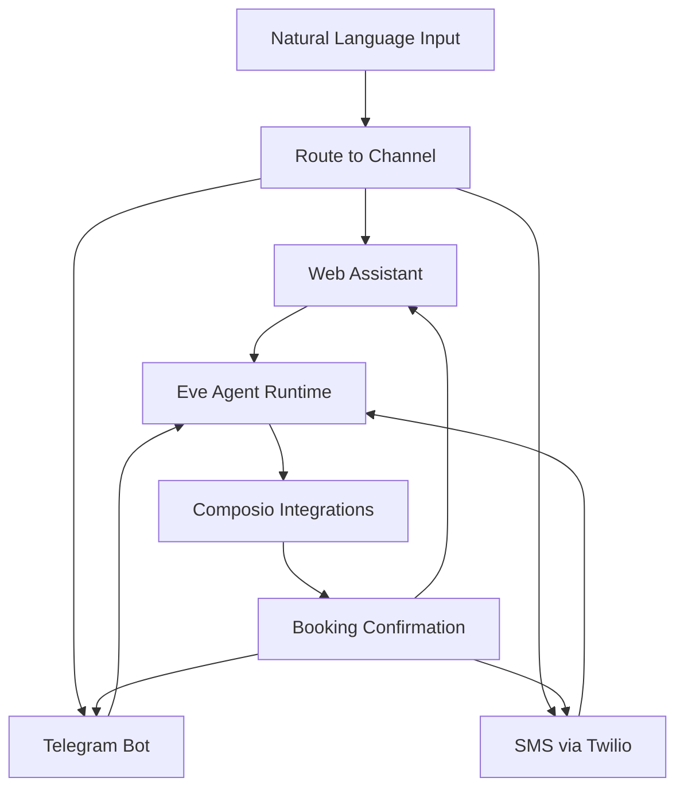
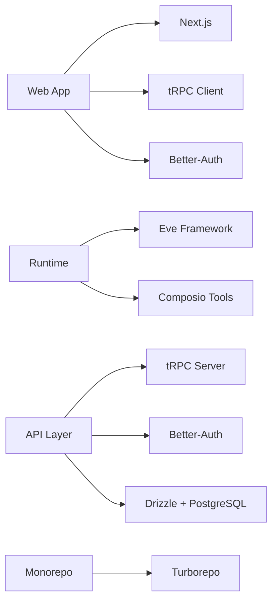

# Project Overview

<cite>
**Referenced Files in This Document**
- [README.md](file://README.md)
- [package.json](file://package.json)
- [turbo.json](file://turbo.json)
- [apps/web/package.json](file://apps/web/package.json)
- [apps/runtime/package.json](file://apps/runtime/package.json)
- [apps/web/src/app/page.tsx](file://apps/web/src/app/page.tsx)
- [apps/web/src/utils/trpc.ts](file://apps/web/src/utils/trpc.ts)
- [apps/web/src/app/api/trpc/[trpc]/route.ts](file://apps/web/src/app/api/trpc/[trpc]/route.ts)
- [packages/api/src/index.ts](file://packages/api/src/index.ts)
- [packages/api/src/routers/index.ts](file://packages/api/src/routers/index.ts)
- [packages/api/src/routers/user.ts](file://packages/api/src/routers/user.ts)
- [apps/runtime/agent/agent.ts](file://apps/runtime/agent/agent.ts)
- [apps/runtime/agent/instructions.md](file://apps/runtime/agent/instructions.md)
- [apps/runtime/agent/channels/eve.ts](file://apps/runtime/agent/channels/eve.ts)
- [apps/runtime/agent/channels/telegram.ts](file://apps/runtime/agent/channels/telegram.ts)
- [apps/runtime/agent/channels/twilio.ts](file://apps/runtime/agent/channels/twilio.ts)
- [apps/runtime/agent/tools/composio.ts](file://apps/runtime/agent/tools/composio.ts)
</cite>

## Table of Contents

1. Introduction
2. Project Structure
3. Core Components
4. Architecture Overview
5. Detailed Component Analysis
6. Dependency Analysis
7. Performance Considerations
8. Troubleshooting Guide
9. Conclusion

## Introduction

Atlas is an AI-powered flight booking automation platform built with a modern TypeScript stack that combines Next.js, tRPC, and an AI agent runtime powered by the Eve framework. It provides a unified experience across multiple communication channels—web, Telegram, and SMS—allowing users to book flights through natural language while maintaining a secure, type-safe backend and shared UI components.

At a high level:

- Web application (Next.js) serves the user interface and communicates with the backend via tRPC procedures.
- AI runtime (Eve) orchestrates agents, tools, and external integrations to automate flight bookings.
- Shared packages encapsulate authentication, database schema, environment validation, API layer, and UI primitives for reuse across apps.

Key capabilities include:

- Multi-channel communication: web dashboard, Telegram bot, and SMS via Twilio.
- AI-powered flight booking automation using Composio integrations.
- Secure authentication with Better-Auth and session-aware tRPC procedures.
- End-to-end type safety from client to server using tRPC.

Practical examples:

- Book a flight by typing a message in the web assistant or sending a Telegram/SMS message like “Book me a flight from New York to London next Friday.”
- Manage trips and view activity history from the web dashboard, with updates pushed back to messaging channels.

**Section sources**

- [README.md:1-107](file://README.md#L1-L107)
- [package.json:1-66](file://package.json#L1-L66)

## Project Structure

Atlas uses a Turborepo monorepo with two main applications and several shared packages:

- apps/web: Next.js frontend with tRPC client integration and protected routes.
- apps/runtime: Eve-based AI agent runtime exposing channels for web, Telegram, and SMS.
- packages/*: Shared modules for API, auth, db, env, ui, and configuration.

**Diagram sources**

- [README.md:79-94](file://README.md#L79-L94)
- [turbo.json:4-19](file://turbo.json#L4-L19)

**Section sources**

- [README.md:79-94](file://README.md#L79-L94)
- [turbo.json:1-52](file://turbo.json#L1-L52)

## Core Components

- Web Application (Next.js): Provides the user interface, integrates with tRPC for data fetching, and renders protected pages. Health checks are exposed via tRPC endpoints.
- AI Runtime (Eve): Defines the agent model, instructions, and channels for multi-channel communication. Integrates with Composio tools to perform actions on behalf of authenticated users.
- API Layer (tRPC): Exposes typed procedures for health checks and user operations, with middleware enforcing authentication for protected routes.
- Authentication (Better-Auth): Centralized auth configuration used by both web and runtime, enabling session-aware flows across channels.
- Database (Drizzle + PostgreSQL): Schema and queries managed in a shared package, ensuring consistent data access patterns.
- Environment Validation: Typed environment variables enforced at runtime to prevent misconfiguration.

Examples of usage:

- The web app calls tRPC procedures to check system health and render protected content.
- The runtime’s Eve agent processes messages from Telegram/Twilio and executes tasks using Composio tools.

**Section sources**

- [apps/web/src/app/page.tsx:1-39](file://apps/web/src/app/page.tsx#L1-L39)
- [apps/web/src/utils/trpc.ts:1-40](file://apps/web/src/utils/trpc.ts#L1-L40)
- [apps/web/src/app/api/trpc/[trpc]/route.ts:1-13](file://apps/web/src/app/api/trpc/[trpc]/route.ts#L1-L13)
- [packages/api/src/index.ts:1-25](file://packages/api/src/index.ts#L1-L25)
- [packages/api/src/routers/index.ts:1-11](file://packages/api/src/routers/index.ts#L1-L11)
- [packages/api/src/routers/user.ts:1-8](file://packages/api/src/routers/user.ts#L1-L8)
- [apps/runtime/agent/agent.ts:1-8](file://apps/runtime/agent/agent.ts#L1-L8)
- [apps/runtime/agent/instructions.md:1-4](file://apps/runtime/agent/instructions.md#L1-L4)
- [apps/runtime/agent/tools/composio.ts:1-12](file://apps/runtime/agent/tools/composio.ts#L1-L12)

## Architecture Overview

The system connects the web frontend to a type-safe API layer and an AI runtime that orchestrates external services. tRPC ensures end-to-end types between client and server, while the Eve agent handles multi-channel inputs and executes tasks via Composio integrations.

**Diagram sources**

- [apps/web/src/utils/trpc.ts:1-40](file://apps/web/src/utils/trpc.ts#L1-L40)
- [apps/web/src/app/api/trpc/[trpc]/route.ts:1-13](file://apps/web/src/app/api/trpc/[trpc]/route.ts#L1-L13)
- [packages/api/src/index.ts:1-25](file://packages/api/src/index.ts#L1-L25)
- [packages/api/src/routers/index.ts:1-11](file://packages/api/src/routers/index.ts#L1-L11)
- [apps/runtime/agent/channels/telegram.ts:1-6](file://apps/runtime/agent/channels/telegram.ts#L1-L6)
- [apps/runtime/agent/channels/twilio.ts:1-6](file://apps/runtime/agent/channels/twilio.ts#L1-L6)
- [apps/runtime/agent/tools/composio.ts:1-12](file://apps/runtime/agent/tools/composio.ts#L1-L12)

## Detailed Component Analysis

### Web Application (Next.js + tRPC)

- Uses TanStack Query for data fetching and caching.
- Calls tRPC procedures through a configured client with batched HTTP links.
- Displays health status and protected content based on session state.

**Diagram sources**

- [apps/web/src/app/page.tsx:1-39](file://apps/web/src/app/page.tsx#L1-L39)
- [apps/web/src/utils/trpc.ts:1-40](file://apps/web/src/utils/trpc.ts#L1-L40)

**Section sources**

- [apps/web/src/app/page.tsx:1-39](file://apps/web/src/app/page.tsx#L1-L39)
- [apps/web/src/utils/trpc.ts:1-40](file://apps/web/src/utils/trpc.ts#L1-L40)

### API Layer (tRPC Routers & Procedures)

- Initializes tRPC context and exposes public and protected procedures.
- Aggregates routers for health checks and user operations.
- Enforces authentication via middleware for protected routes.

**Diagram sources**

- [packages/api/src/index.ts:1-25](file://packages/api/src/index.ts#L1-L25)
- [packages/api/src/routers/index.ts:1-11](file://packages/api/src/routers/index.ts#L1-L11)
- [packages/api/src/routers/user.ts:1-8](file://packages/api/src/routers/user.ts#L1-L8)

**Section sources**

- [packages/api/src/index.ts:1-25](file://packages/api/src/index.ts#L1-L25)
- [packages/api/src/routers/index.ts:1-11](file://packages/api/src/routers/index.ts#L1-L11)
- [packages/api/src/routers/user.ts:1-8](file://packages/api/src/routers/user.ts#L1-L8)

### AI Runtime (Eve Agent)

- Defines the agent model and instructions.
- Exposes channels for web (Eve), Telegram, and SMS (Twilio).
- Integrates with Composio tools to execute actions on behalf of authenticated users.

**Diagram sources**

- [apps/runtime/agent/agent.ts:1-8](file://apps/runtime/agent/agent.ts#L1-L8)
- [apps/runtime/agent/instructions.md:1-4](file://apps/runtime/agent/instructions.md#L1-L4)
- [apps/runtime/agent/channels/telegram.ts:1-6](file://apps/runtime/agent/channels/telegram.ts#L1-L6)
- [apps/runtime/agent/channels/twilio.ts:1-6](file://apps/runtime/agent/channels/twilio.ts#L1-L6)
- [apps/runtime/agent/tools/composio.ts:1-12](file://apps/runtime/agent/tools/composio.ts#L1-L12)

**Section sources**

- [apps/runtime/agent/agent.ts:1-8](file://apps/runtime/agent/agent.ts#L1-L8)
- [apps/runtime/agent/instructions.md:1-4](file://apps/runtime/agent/instructions.md#L1-L4)
- [apps/runtime/agent/channels/eve.ts:1-10](file://apps/runtime/agent/channels/eve.ts#L1-L10)
- [apps/runtime/agent/channels/telegram.ts:1-6](file://apps/runtime/agent/channels/telegram.ts#L1-L6)
- [apps/runtime/agent/channels/twilio.ts:1-6](file://apps/runtime/agent/channels/twilio.ts#L1-L6)
- [apps/runtime/agent/tools/composio.ts:1-12](file://apps/runtime/agent/tools/composio.ts#L1-L12)

### Conceptual Overview

Atlas enables users to interact with a flight booking assistant across multiple channels. A user might:

- Open the web dashboard to initiate a conversation with the assistant.
- Send a Telegram message like “Find me the cheapest flight to Tokyo next week.”
- Receive an SMS confirmation once a booking is completed.

[No sources needed since this diagram shows conceptual workflow, not actual code structure]

## Dependency Analysis

Atlas leverages a curated set of dependencies across the monorepo:

- Next.js for the web application.
- tRPC for type-safe APIs.
- Better-Auth for authentication.
- Eve for the AI agent runtime.
- Composio for external integrations.
- Drizzle and PostgreSQL for database management.
- Turborepo for build orchestration and task definitions.

**Diagram sources**

- [package.json:1-66](file://package.json#L1-L66)
- [apps/web/package.json:1-47](file://apps/web/package.json#L1-L47)
- [apps/runtime/package.json:1-29](file://apps/runtime/package.json#L1-L29)
- [turbo.json:1-52](file://turbo.json#L1-L52)

**Section sources**

- [package.json:1-66](file://package.json#L1-L66)
- [apps/web/package.json:1-47](file://apps/web/package.json#L1-L47)
- [apps/runtime/package.json:1-29](file://apps/runtime/package.json#L1-L29)
- [turbo.json:1-52](file://turbo.json#L1-L52)

## Performance Considerations

- Use tRPC batching to reduce network overhead when making multiple requests from the client.
- Leverage TanStack Query caching to minimize redundant data fetches and improve perceived performance.
- Configure CORS and authentication properly in the runtime channels to avoid unnecessary retries.
- Keep environment variables centralized and validated to prevent runtime errors that could degrade performance.

[No sources needed since this section provides general guidance]

## Troubleshooting Guide

Common issues and resolutions:

- Authentication failures: Ensure sessions are present before calling protected tRPC procedures; verify Better-Auth configuration in both web and runtime.
- Channel connectivity: Validate environment variables for Telegram bot token and Twilio phone number; confirm channel credentials are correctly resolved at runtime.
- Tool execution errors: When using Composio tools, ensure user sessions are valid and required permissions are granted; handle missing user IDs gracefully.

**Section sources**

- [packages/api/src/index.ts:11-25](file://packages/api/src/index.ts#L11-L25)
- [apps/runtime/agent/channels/telegram.ts:1-6](file://apps/runtime/agent/channels/telegram.ts#L1-L6)
- [apps/runtime/agent/channels/twilio.ts:1-6](file://apps/runtime/agent/channels/twilio.ts#L1-L6)
- [apps/runtime/agent/tools/composio.ts:1-12](file://apps/runtime/agent/tools/composio.ts#L1-L12)

## Conclusion

Atlas combines a modern TypeScript stack with AI-powered automation to deliver a seamless flight booking experience across web, Telegram, and SMS. Its monorepo architecture promotes code reuse, type safety, and scalable development practices. By leveraging Eve, tRPC, and Composio integrations, Atlas provides a robust foundation for building intelligent, multi-channel applications that simplify complex workflows like travel planning.

[No sources needed since this section summarizes without analyzing specific files]
