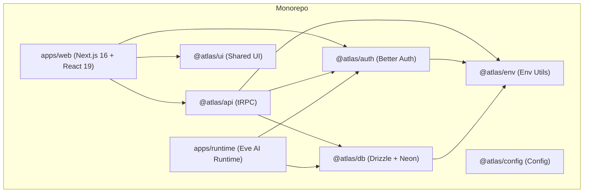
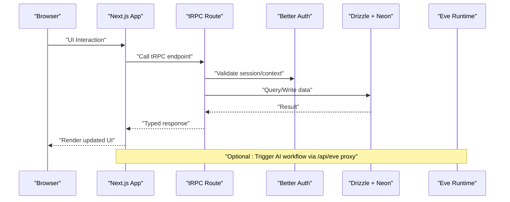
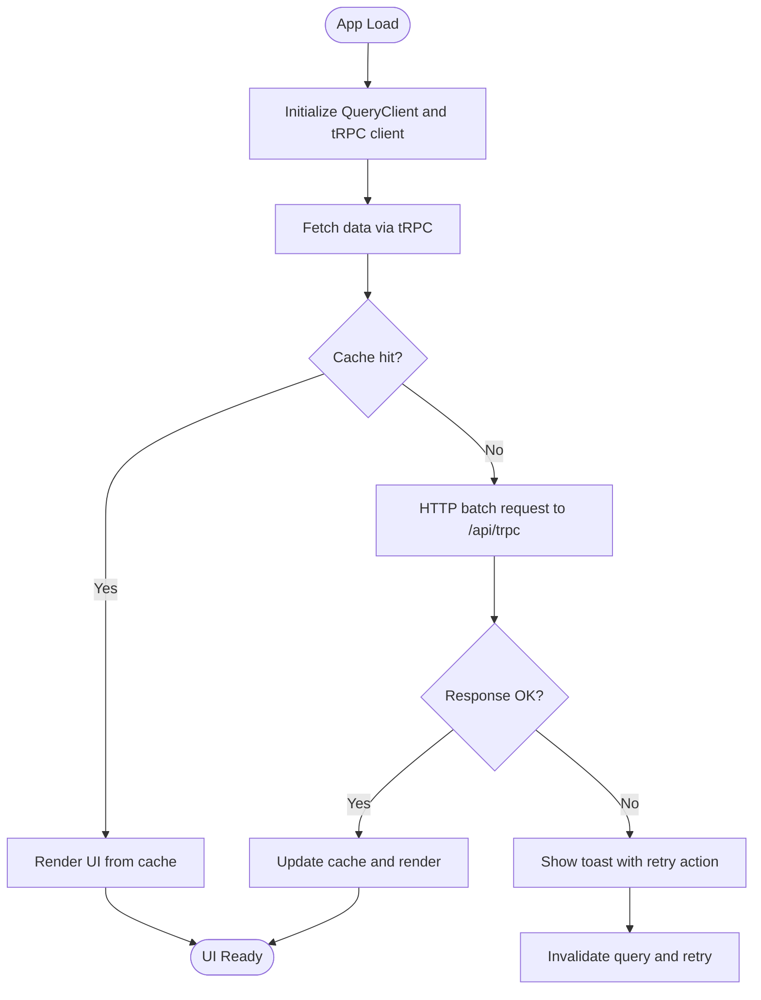
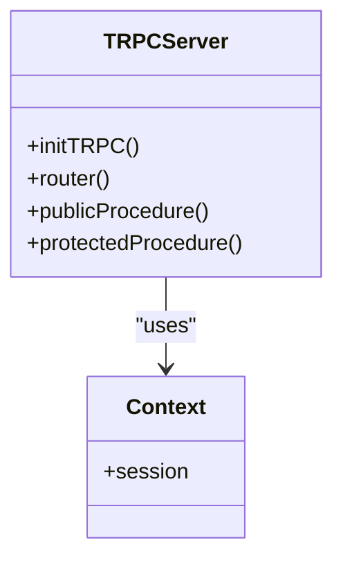
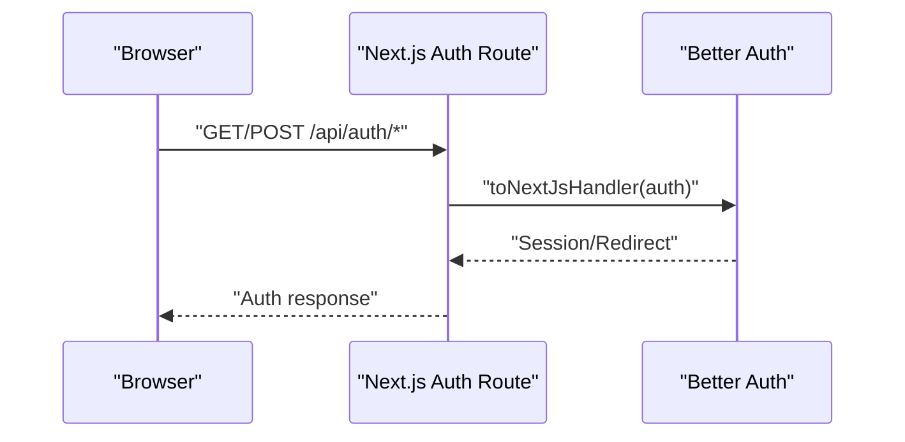
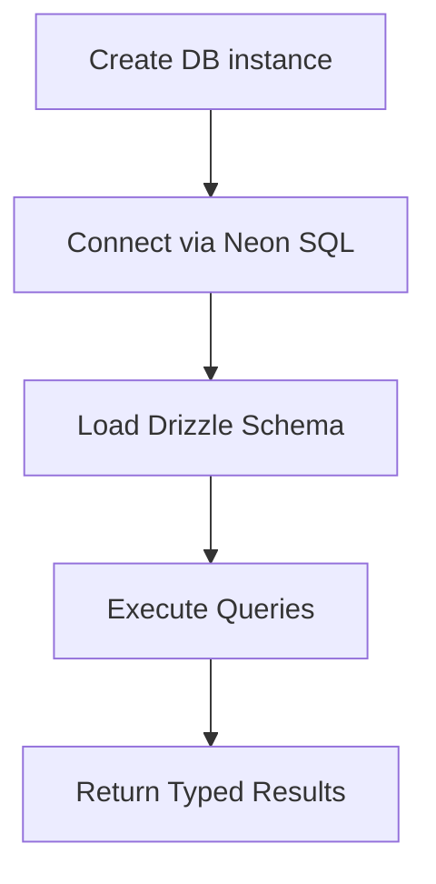
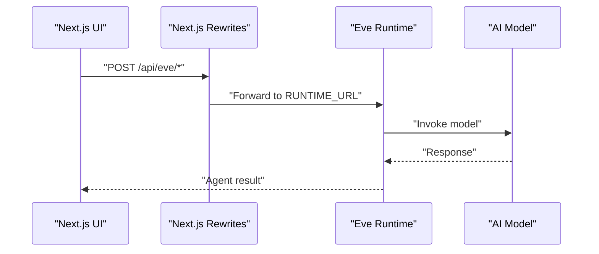
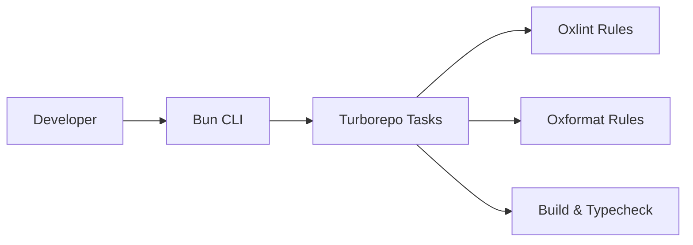
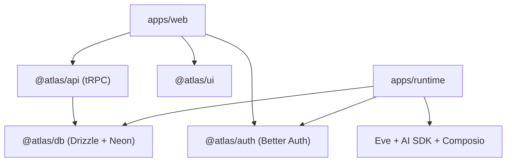

# Technology Stack Overview

<cite>
**Referenced Files in This Document**
- [package.json](file://package.json)
- [turbo.json](file://turbo.json)
- [apps/web/package.json](file://apps/web/package.json)
- [apps/runtime/package.json](file://apps/runtime/package.json)
- [packages/db/package.json](file://packages/db/package.json)
- [packages/auth/package.json](file://packages/auth/package.json)
- [packages/api/package.json](file://packages/api/package.json)
- [packages/ui/package.json](file://packages/ui/package.json)
- [apps/web/next.config.ts](file://apps/web/next.config.ts)
- [apps/web/src/app/api/trpc/[trpc]/route.ts](file://apps/web/src/app/api/trpc/[trpc]/route.ts)
- [apps/web/src/app/api/auth/[...all]/route.ts](file://apps/web/src/app/api/auth/[...all]/route.ts)
- [packages/db/src/index.ts](file://packages/db/src/index.ts)
- [packages/api/src/index.ts](file://packages/api/src/index.ts)
- [apps/web/src/utils/trpc.ts](file://apps/web/src/utils/trpc.ts)
- [apps/runtime/agent/agent.ts](file://apps/runtime/agent/agent.ts)
- [oxlint.config.ts](file://oxlint.config.ts)
- [oxfmt.config.ts](file://oxfmt.config.ts)
</cite>

## Table of Contents

1. [Introduction](#introduction)
2. [Project Structure](#project-structure)
3. [Core Components](#core-components)
4. [Architecture Overview](#architecture-overview)
5. [Detailed Component Analysis](#detailed-component-analysis)
6. [Dependency Analysis](#dependency-analysis)
7. [Performance Considerations](#performance-considerations)
8. [Troubleshooting Guide](#troubleshooting-guide)
9. [Conclusion](#conclusion)

## Introduction

This document provides a comprehensive overview of Atlas’s modern TypeScript-based architecture and technology stack. It explains how the monorepo is organized with Turborepo, details the frontend stack (Next.js 16 with React 19, Tailwind CSS v4, TanStack Query), documents the backend technologies (tRPC for type-safe APIs, Better Auth for authentication, Drizzle ORM with PostgreSQL via Neon), outlines the AI infrastructure built on the Eve framework with Composio integrations, and covers development tooling including Bun, ESLint configuration, and testing approaches. The rationale behind each choice and how these pieces integrate into a cohesive full-stack application are also explained.

## Project Structure

Atlas is a TypeScript monorepo managed by Turborepo with two primary applications and several shared packages:

- Apps:
  - apps/web: Next.js 16 frontend using React 19, Tailwind CSS v4, and TanStack Query.
  - apps/runtime: AI runtime powered by the Eve framework with Composio integrations.
- Packages:
  - @atlas/api: tRPC server setup and routers.
  - @atlas/auth: Authentication module using Better Auth.
  - @atlas/db: Database layer with Drizzle ORM and Neon serverless PostgreSQL.
  - @atlas/ui: Shared UI components and styles.
  - @atlas/env: Environment configuration utilities.
  - @atlas/config: Shared configuration package.

Turborepo orchestrates tasks such as build, lint, check-types, and database operations across workspaces, enabling efficient caching and parallel execution.

**Diagram sources**

- [turbo.json:1-52](file://turbo.json#L1-L52)
- [apps/web/package.json:1-47](file://apps/web/package.json#L1-L47)
- [apps/runtime/package.json:1-30](file://apps/runtime/package.json#L1-L30)
- [packages/api/package.json:1-28](file://packages/api/package.json#L1-L28)
- [packages/auth/package.json:1-26](file://packages/auth/package.json#L1-L26)
- [packages/db/package.json:1-31](file://packages/db/package.json#L1-L31)
- [packages/ui/package.json:1-48](file://packages/ui/package.json#L1-L48)

**Section sources**

- [turbo.json:1-52](file://turbo.json#L1-L52)
- [package.json:1-66](file://package.json#L1-L66)

## Core Components

- Frontend: Next.js 16 with React 19, Tailwind CSS v4, and TanStack Query for data fetching and caching.
- Backend API: tRPC endpoints exposed via Next.js API routes, providing type-safe client-server contracts.
- Authentication: Better Auth integrated with Next.js handlers and Telegram extension.
- Database: Drizzle ORM configured to connect to Neon serverless PostgreSQL.
- AI Runtime: Eve framework agent with model selection and Composio tools for external integrations.
- Development Tools: Bun as package manager, Oxlint/Oxformat for linting/formatting, Turborepo for task orchestration.

Rationale:

- Next.js 16 and React 19 provide modern rendering, compiler optimizations, and performance improvements.
- Tailwind CSS v4 offers fast, utility-first styling with PostCSS integration.
- tRPC ensures end-to-end type safety between client and server, reducing bugs and improving DX.
- Better Auth simplifies authentication flows and integrates well with Next.js.
- Drizzle ORM with Neon enables scalable, serverless database access with strong typing.
- Eve framework centralizes AI agent logic and supports multiple models; Composio adds powerful integrations.
- Turborepo and Bun accelerate builds and installs across the monorepo.

**Section sources**

- [apps/web/package.json:1-47](file://apps/web/package.json#L1-L47)
- [apps/web/next.config.ts:1-31](file://apps/web/next.config.ts#L1-L31)
- [apps/web/src/app/api/trpc/[trpc]/route.ts:1-14](file://apps/web/src/app/api/trpc/[trpc]/route.ts#L1-L14)
- [apps/web/src/app/api/auth/[...all]/route.ts:1-5](file://apps/web/src/app/api/auth/[...all]/route.ts#L1-L5)
- [packages/db/src/index.ts:1-13](file://packages/db/src/index.ts#L1-L13)
- [apps/runtime/agent/agent.ts:1-8](file://apps/runtime/agent/agent.ts#L1-L8)
- [package.json:1-66](file://package.json#L1-L66)

## Architecture Overview

The system follows a layered architecture:

- Presentation Layer: Next.js app renders UI and handles user interactions.
- API Layer: tRPC routes expose typed endpoints backed by business logic.
- Data Layer: Drizzle ORM queries Neon PostgreSQL.
- Auth Layer: Better Auth manages sessions and providers.
- AI Layer: Eve runtime runs agents and tools, integrating with external services via Composio.

**Diagram sources**

- [apps/web/src/app/api/trpc/[trpc]/route.ts:1-14](file://apps/web/src/app/api/trpc/[trpc]/route.ts#L1-L14)
- [apps/web/src/app/api/auth/[...all]/route.ts:1-5](file://apps/web/src/app/api/auth/[...all]/route.ts#L1-L5)
- [packages/db/src/index.ts:1-13](file://packages/db/src/index.ts#L1-L13)
- [apps/web/next.config.ts:1-31](file://apps/web/next.config.ts#L1-L31)

## Detailed Component Analysis

### Frontend Stack: Next.js 16, React 19, Tailwind CSS v4, TanStack Query

- Next.js 16 config includes component caching, experimental optimizations, image remote patterns, partial prefetching, and React Compiler enablement.
- React 19 leverages compiler features for improved performance and reduced boilerplate.
- Tailwind CSS v4 is integrated via PostCSS for modern styling workflows.
- TanStack Query provides robust data fetching, caching, and error handling with retry actions.

**Diagram sources**

- [apps/web/src/utils/trpc.ts:1-40](file://apps/web/src/utils/trpc.ts#L1-L40)
- [apps/web/next.config.ts:1-31](file://apps/web/next.config.ts#L1-L31)

**Section sources**

- [apps/web/package.json:1-47](file://apps/web/package.json#L1-L47)
- [apps/web/next.config.ts:1-31](file://apps/web/next.config.ts#L1-L31)
- [apps/web/src/utils/trpc.ts:1-40](file://apps/web/src/utils/trpc.ts#L1-L40)

### Backend API: tRPC with Type Safety

- tRPC server initialized with context and procedures, including protected procedures that enforce authentication.
- Next.js API route exposes tRPC endpoints for GET/POST, bridging client calls to server logic.

**Diagram sources**

- [packages/api/src/index.ts:1-26](file://packages/api/src/index.ts#L1-L26)
- [apps/web/src/app/api/trpc/[trpc]/route.ts:1-14](file://apps/web/src/app/api/trpc/[trpc]/route.ts#L1-L14)

**Section sources**

- [packages/api/src/index.ts:1-26](file://packages/api/src/index.ts#L1-L26)
- [apps/web/src/app/api/trpc/[trpc]/route.ts:1-14](file://apps/web/src/app/api/trpc/[trpc]/route.ts#L1-L14)

### Authentication: Better Auth Integration

- Better Auth handler is mounted at Next.js API route to manage authentication requests.
- Auth package depends on database and environment modules for configuration and persistence.

**Diagram sources**

- [apps/web/src/app/api/auth/[...all]/route.ts:1-5](file://apps/web/src/app/api/auth/[...all]/route.ts#L1-L5)
- [packages/auth/package.json:1-26](file://packages/auth/package.json#L1-L26)

**Section sources**

- [apps/web/src/app/api/auth/[...all]/route.ts:1-5](file://apps/web/src/app/api/auth/[...all]/route.ts#L1-L5)
- [packages/auth/package.json:1-26](file://packages/auth/package.json#L1-L26)

### Database Layer: Drizzle ORM with Neon Serverless PostgreSQL

- Database connection created using Neon serverless driver and Drizzle ORM with schema exports.
- Package scripts support push, generate, migrate, and studio commands for lifecycle management.

**Diagram sources**

- [packages/db/src/index.ts:1-13](file://packages/db/src/index.ts#L1-L13)
- [packages/db/package.json:1-31](file://packages/db/package.json#L1-L31)

**Section sources**

- [packages/db/src/index.ts:1-13](file://packages/db/src/index.ts#L1-L13)
- [packages/db/package.json:1-31](file://packages/db/package.json#L1-L31)

### AI Infrastructure: Eve Framework with Composio Integrations

- Agent defined with model selection; supports switching models for different use cases.
- Dependencies include AI SDK and Composio packages for tooling and integrations.
- Web app proxies /api/eve to the runtime URL, enabling seamless invocation from the frontend.

**Diagram sources**

- [apps/runtime/agent/agent.ts:1-8](file://apps/runtime/agent/agent.ts#L1-L8)
- [apps/runtime/package.json:1-30](file://apps/runtime/package.json#L1-L30)
- [apps/web/next.config.ts:1-31](file://apps/web/next.config.ts#L1-L31)

**Section sources**

- [apps/runtime/agent/agent.ts:1-8](file://apps/runtime/agent/agent.ts#L1-L8)
- [apps/runtime/package.json:1-30](file://apps/runtime/package.json#L1-L30)
- [apps/web/next.config.ts:1-31](file://apps/web/next.config.ts#L1-L31)

### Development Tools: Bun, Oxlint, Oxformat, Turborepo

- Bun is the specified package manager for fast installs and script execution.
- Oxlint and Oxformat provide consistent linting and formatting rules via Ultracite presets.
- Turborepo defines global environment variables and task pipelines for build, lint, type-checking, and database operations.

**Diagram sources**

- [package.json:1-66](file://package.json#L1-L66)
- [turbo.json:1-52](file://turbo.json#L1-L52)
- [oxlint.config.ts:1-10](file://oxlint.config.ts#L1-L10)
- [oxfmt.config.ts:1-7](file://oxfmt.config.ts#L1-L7)

**Section sources**

- [package.json:1-66](file://package.json#L1-L66)
- [turbo.json:1-52](file://turbo.json#L1-L52)
- [oxlint.config.ts:1-10](file://oxlint.config.ts#L1-L10)
- [oxfmt.config.ts:1-7](file://oxfmt.config.ts#L1-L7)

## Dependency Analysis

Key dependencies and their roles:

- Next.js and React: Modern frontend framework and library with compiler optimizations.
- tRPC: End-to-end type safety for API communication.
- Better Auth: Authentication provider with Next.js integration.
- Drizzle ORM + Neon: Type-safe database access to serverless PostgreSQL.
- Eve + AI SDK + Composio: AI agent runtime with model abstraction and external tool integrations.
- Turborepo + Bun: Monorepo task orchestration and fast package management.

**Diagram sources**

- [apps/web/package.json:1-47](file://apps/web/package.json#L1-L47)
- [packages/api/package.json:1-28](file://packages/api/package.json#L1-L28)
- [packages/auth/package.json:1-26](file://packages/auth/package.json#L1-L26)
- [packages/db/package.json:1-31](file://packages/db/package.json#L1-L31)
- [apps/runtime/package.json:1-30](file://apps/runtime/package.json#L1-L30)

**Section sources**

- [apps/web/package.json:1-47](file://apps/web/package.json#L1-L47)
- [packages/api/package.json:1-28](file://packages/api/package.json#L1-L28)
- [packages/auth/package.json:1-26](file://packages/auth/package.json#L1-L26)
- [packages/db/package.json:1-31](file://packages/db/package.json#L1-L31)
- [apps/runtime/package.json:1-30](file://apps/runtime/package.json#L1-L30)

## Performance Considerations

- Enable React Compiler and component caching in Next.js for faster rendering and reduced re-renders.
- Use TanStack Query batching and caching to minimize network requests and improve perceived performance.
- Leverage Turborepo caching for builds and type checks to speed up CI and local development.
- Prefer serverless database connections (Neon) for scalability and reduced cold starts.
- Optimize imports and bundle size via Next.js optimizePackageImports and tree-shaking.

[No sources needed since this section provides general guidance]

## Troubleshooting Guide

- Authentication errors: Ensure Better Auth handler is correctly mounted and environment variables are set. Check session context in tRPC protected procedures.
- tRPC errors: Validate router definitions and ensure context includes session when required. Inspect client-side error handling and retry behavior.
- Database connectivity: Verify DATABASE_URL and Neon credentials; confirm Drizzle schema matches migrations.
- AI runtime issues: Confirm RUNTIME_URL rewrite configuration and model availability; check Composio API keys and permissions.

**Section sources**

- [apps/web/src/app/api/auth/[...all]/route.ts:1-5](file://apps/web/src/app/api/auth/[...all]/route.ts#L1-L5)
- [packages/api/src/index.ts:1-26](file://packages/api/src/index.ts#L1-L26)
- [packages/db/src/index.ts:1-13](file://packages/db/src/index.ts#L1-L13)
- [apps/web/next.config.ts:1-31](file://apps/web/next.config.ts#L1-L31)

## Conclusion

Atlas’s technology stack combines modern frontend capabilities with a robust backend and AI infrastructure, all orchestrated within a high-performance monorepo. Next.js 16 and React 19 deliver a responsive UI, while tRPC ensures type-safe communication. Better Auth streamlines authentication, and Drizzle ORM with Neon provides scalable data access. The Eve framework powers AI agents with flexible model support and Composio integrations. Turborepo and Bun enhance developer productivity and deployment efficiency, creating a cohesive, maintainable, and scalable full-stack application.

[No sources needed since this section summarizes without analyzing specific files]
