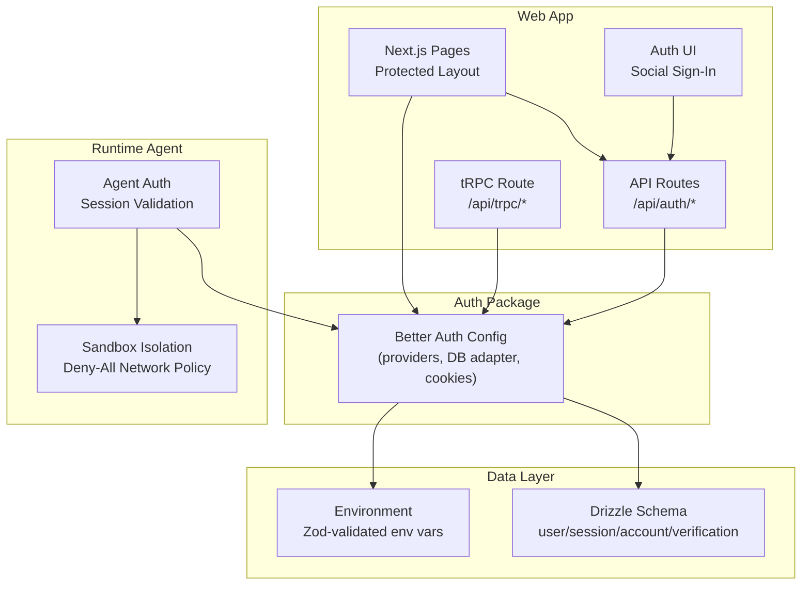
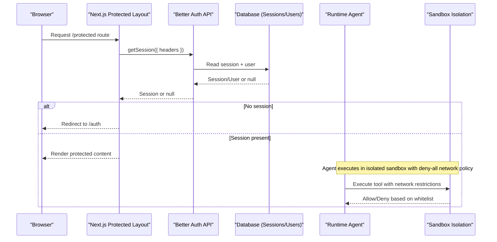
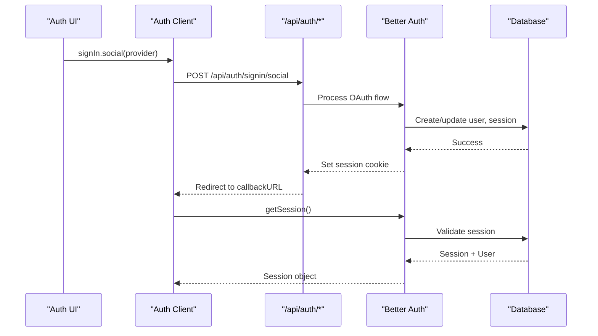
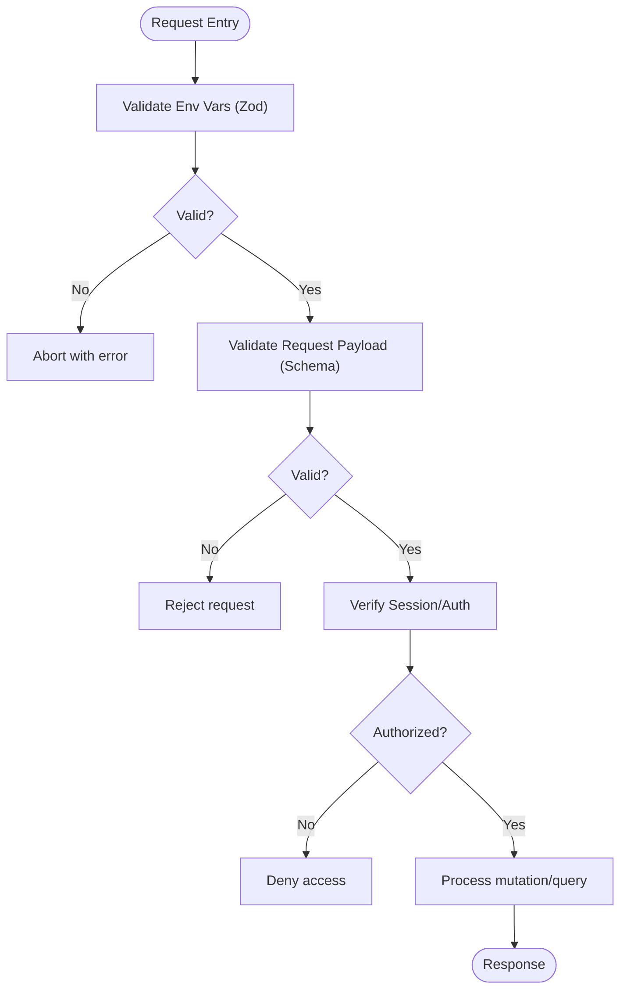
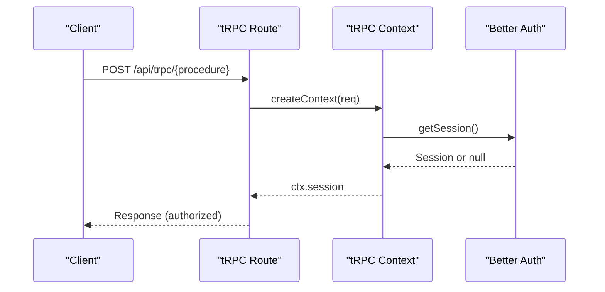
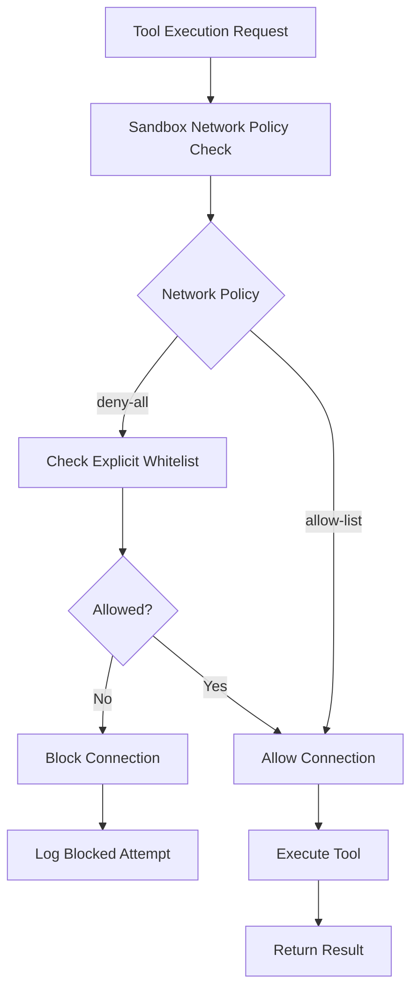
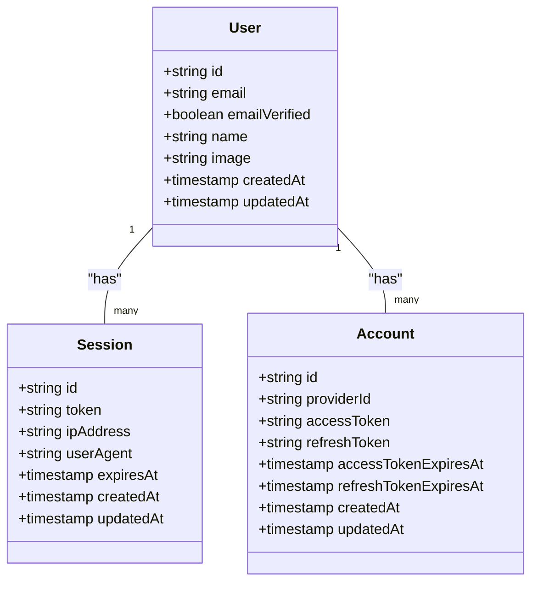
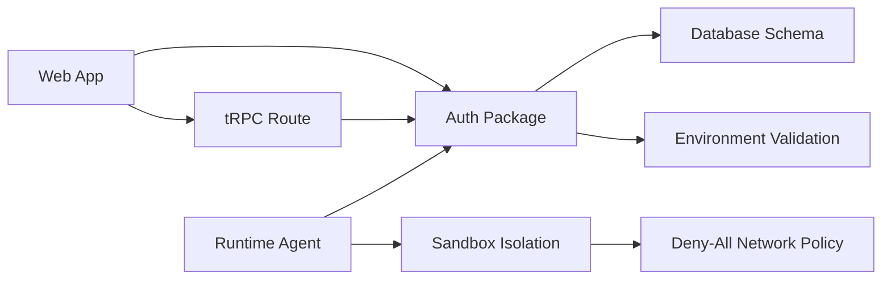

# Security Considerations

<cite>
**Referenced Files in This Document**
- [packages/auth/src/index.ts](file://packages/auth/src/index.ts)
- [apps/web/src/app/api/auth/[...all]/route.ts](file://apps/web/src/app/api/auth/[...all]/route.ts)
- [apps/web/src/lib/auth-client.ts](file://apps/web/src/lib/auth-client.ts)
- [apps/web/src/components/auth.tsx](file://apps/web/src/components/auth.tsx)
- [apps/web/src/app/(protected)/layout.tsx](file://apps/web/src/app/(protected)/layout.tsx)
- [apps/runtime/agent/lib/auth.ts](file://apps/runtime/agent/lib/auth.ts)
- [packages/db/src/schema/auth.ts](file://packages/db/src/schema/auth.ts)
- [packages/env/src/server.ts](file://packages/env/src/server.ts)
- [apps/web/src/app/api/trpc/[trpc]/route.ts](file://apps/web/src/app/api/trpc/[trpc]/route.ts)
- [.agents/skills/better-auth-best-practices/SKILL.md](file://.agents/skills/better-auth-best-practices/SKILL.md)
- [apps/runtime/agent/sandbox.ts](file://apps/runtime/agent/sandbox.ts)
</cite>

## Update Summary

**Changes Made**

- Added comprehensive sandbox security configuration section documenting strict network policies
- Updated runtime agent security posture with deny-all network policy implementation
- Enhanced third-party integration security with explicit whitelisting requirements
- Added new diagrams illustrating sandbox network isolation architecture

## Table of Contents

1. Introduction
2. Project Structure
3. Core Components
4. Architecture Overview
5. Detailed Component Analysis
6. Dependency Analysis
7. Performance Considerations
8. Troubleshooting Guide
9. Conclusion
10. Appendices

## Introduction

This document provides comprehensive security guidance for the Atlas application, focusing on authentication and authorization, secure session management, input validation, API hardening, data protection, third-party integrations, deployment security, auditing, incident response, and sandbox isolation. It is grounded in the repository's actual implementation and best practices documented within the project's skills.

## Project Structure

Atlas uses a Next.js frontend with a dedicated auth package, a shared environment configuration, and a Drizzle-based database schema. Authentication flows are handled via Better Auth, with Telegram and Google social providers configured. Protected routes validate sessions server-side, and the runtime agent also validates sessions to access protected resources. The runtime agent includes strict sandbox isolation with deny-all network policies.

**Diagram sources**

- [apps/web/src/app/(protected)/layout.tsx:22-33](<file://apps/web/src/app/(protected)/layout.tsx#L22-L33>)
- [apps/web/src/components/auth.tsx:9-20](file://apps/web/src/components/auth.tsx#L9-L20)
- [apps/web/src/app/api/auth/[...all]/route.ts:1-5](file://apps/web/src/app/api/auth/[...all]/route.ts#L1-L5)
- [apps/web/src/app/api/trpc/[trpc]/route.ts:1-14](file://apps/web/src/app/api/trpc/[trpc]/route.ts#L1-L14)
- [packages/auth/src/index.ts:10-40](file://packages/auth/src/index.ts#L10-L40)
- [packages/db/src/schema/auth.ts:4-81](file://packages/db/src/schema/auth.ts#L4-L81)
- [packages/env/src/server.ts:5-27](file://packages/env/src/server.ts#L5-L27)
- [apps/runtime/agent/lib/auth.ts:4-25](file://apps/runtime/agent/lib/auth.ts#L4-L25)
- [apps/runtime/agent/sandbox.ts:9-13](file://apps/runtime/agent/sandbox.ts#L9-L13)

**Section sources**

- [apps/web/src/app/(protected)/layout.tsx:22-33](<file://apps/web/src/app/(protected)/layout.tsx#L22-L33>)
- [apps/web/src/components/auth.tsx:9-20](file://apps/web/src/components/auth.tsx#L9-L20)
- [apps/web/src/app/api/auth/[...all]/route.ts:1-5](file://apps/web/src/app/api/auth/[...all]/route.ts#L1-L5)
- [apps/web/src/app/api/trpc/[trpc]/route.ts:1-14](file://apps/web/src/app/api/trpc/[trpc]/route.ts#L1-L14)
- [packages/auth/src/index.ts:10-40](file://packages/auth/src/index.ts#L10-L40)
- [packages/db/src/schema/auth.ts:4-81](file://packages/db/src/schema/auth.ts#L4-L81)
- [packages/env/src/server.ts:5-27](file://packages/env/src/server.ts#L5-L27)
- [apps/runtime/agent/lib/auth.ts:4-25](file://apps/runtime/agent/lib/auth.ts#L4-L25)
- [apps/runtime/agent/sandbox.ts:9-13](file://apps/runtime/agent/sandbox.ts#L9-L13)

## Core Components

- Authentication and Authorization:
  - Better Auth centralizes identity and session handling with Drizzle adapter and Next.js cookie integration. Social providers (Google, Telegram) are enabled via environment variables.
  - Protected layout enforces authenticated access by checking the session and redirecting unauthenticated users.
  - Runtime agent validates sessions using the same auth instance to ensure cross-service consistency.
- Sandbox Isolation:
  - **Updated** The runtime agent implements strict sandbox isolation with deny-all network policies across all backends (Docker, microsandbox, Vercel). This ensures that only explicitly whitelisted tools can make outbound connections.
- Environment and Secrets:
  - Server environment variables are validated at startup using Zod, ensuring required secrets like database URL, auth secret, and provider credentials exist and conform to expected formats.
- Data Model:
  - Drizzle schema defines user, session, account, and verification tables with appropriate constraints and indexes.

Security implications:

- Centralized auth reduces duplication and minimizes risk of inconsistent checks.
- Strict environment validation prevents misconfiguration and missing secrets from reaching runtime.
- Session table includes IP and user-agent fields, enabling auditability and anomaly detection.
- **New** Deny-all network policies prevent unauthorized outbound connections from sandboxed environments, reducing attack surface for code execution vulnerabilities.

**Section sources**

- [packages/auth/src/index.ts:10-40](file://packages/auth/src/index.ts#L10-L40)
- [apps/web/src/app/(protected)/layout.tsx:22-33](<file://apps/web/src/app/(protected)/layout.tsx#L22-L33>)
- [apps/runtime/agent/lib/auth.ts:4-25](file://apps/runtime/agent/lib/auth.ts#L4-L25)
- [apps/runtime/agent/sandbox.ts:9-13](file://apps/runtime/agent/sandbox.ts#L9-L13)
- [packages/env/src/server.ts:5-27](file://packages/env/src/server.ts#L5-L27)
- [packages/db/src/schema/auth.ts:4-81](file://packages/db/src/schema/auth.ts#L4-L81)

## Architecture Overview

The following sequence shows how a protected page request is secured and how sessions are verified across components, including sandbox isolation for runtime operations.

**Diagram sources**

- [apps/web/src/app/(protected)/layout.tsx:22-33](<file://apps/web/src/app/(protected)/layout.tsx#L22-L33>)
- [packages/auth/src/index.ts:10-40](file://packages/auth/src/index.ts#L10-L40)
- [packages/db/src/schema/auth.ts:21-39](file://packages/db/src/schema/auth.ts#L21-L39)
- [apps/runtime/agent/lib/auth.ts:4-25](file://apps/runtime/agent/lib/auth.ts#L4-L25)
- [apps/runtime/agent/sandbox.ts:9-13](file://apps/runtime/agent/sandbox.ts#L9-L13)

## Detailed Component Analysis

### Authentication Flow and Session Management

- The web app exposes a catch-all auth route that proxies requests to Better Auth.
- The client initializes the auth client with plugins for Telegram and last login method tracking.
- Protected layouts verify sessions server-side before rendering sensitive content.
- The runtime agent validates sessions per request to protect agent endpoints.

**Diagram sources**

- [apps/web/src/components/auth.tsx:9-20](file://apps/web/src/components/auth.tsx#L9-L20)
- [apps/web/src/lib/auth-client.ts:1-8](file://apps/web/src/lib/auth-client.ts#L1-L8)
- [apps/web/src/app/api/auth/[...all]/route.ts:1-5](file://apps/web/src/app/api/auth/[...all]/route.ts#L1-L5)
- [packages/auth/src/index.ts:10-40](file://packages/auth/src/index.ts#L10-L40)
- [packages/db/src/schema/auth.ts:4-81](file://packages/db/src/schema/auth.ts#L4-L81)

**Section sources**

- [apps/web/src/app/api/auth/[...all]/route.ts:1-5](file://apps/web/src/app/api/auth/[...all]/route.ts#L1-L5)
- [apps/web/src/lib/auth-client.ts:1-8](file://apps/web/src/lib/auth-client.ts#L1-L8)
- [apps/web/src/components/auth.tsx:9-20](file://apps/web/src/components/auth.tsx#L9-L20)
- [packages/auth/src/index.ts:10-40](file://packages/auth/src/index.ts#L10-L40)
- [packages/db/src/schema/auth.ts:4-81](file://packages/db/src/schema/auth.ts#L4-L81)

### Input Validation and Sanitization

- Environment variables are validated at startup with strict schemas, preventing invalid or missing secrets from being used.
- For server actions and API inputs, use schema validation libraries (e.g., Zod) to validate payloads before processing. Follow the project's best practices to authenticate and authorize inside server actions and mutate only after validation.

**Diagram sources**

- [packages/env/src/server.ts:5-27](file://packages/env/src/server.ts#L5-L27)
- [.agents/skills/better-auth-best-practices/SKILL.md:114-126](file://.agents/skills/better-auth-best-practices/SKILL.md#L114-L126)

**Section sources**

- [packages/env/src/server.ts:5-27](file://packages/env/src/server.ts#L5-L27)
- [.agents/skills/better-auth-best-practices/SKILL.md:114-126](file://.agents/skills/better-auth-best-practices/SKILL.md#L114-L126)

### API Security Measures

- tRPC endpoint is mounted under a single route and relies on context creation per request. Ensure your tRPC context performs session verification and authorization checks for every procedure.
- Rate limiting can be enabled in Better Auth configuration; configure window, max, and storage appropriately for your deployment.
- Secure headers should be enforced at the platform level (e.g., HTTPS-only cookies, CORS origins).

**Diagram sources**

- [apps/web/src/app/api/trpc/[trpc]/route.ts:1-14](file://apps/web/src/app/api/trpc/[trpc]/route.ts#L1-L14)
- [packages/auth/src/index.ts:10-40](file://packages/auth/src/index.ts#L10-L40)

**Section sources**

- [apps/web/src/app/api/trpc/[trpc]/route.ts:1-14](file://apps/web/src/app/api/trpc/[trpc]/route.ts#L1-L14)
- [packages/auth/src/index.ts:10-40](file://packages/auth/src/index.ts#L10-L40)

### Sandbox Isolation and Network Security

- **New** The runtime agent implements strict sandbox isolation with deny-all network policies across all supported backends (Docker, microsandbox, Vercel).
- Built-in tools requiring network access must be explicitly whitelisted to maintain security posture.
- The sandbox configuration applies factory-level options before bootstrap, ensuring consistent policy enforcement across sessions.
- Memory limits are set to 2048 MiB for microsandbox deployments to prevent resource exhaustion attacks.

**Diagram sources**

- [apps/runtime/agent/sandbox.ts:9-13](file://apps/runtime/agent/sandbox.ts#L9-L13)

**Section sources**

- [apps/runtime/agent/sandbox.ts:9-13](file://apps/runtime/agent/sandbox.ts#L9-L13)

### Data Protection Strategies

- Database schema stores sessions with token, IP address, and user agent, aiding in audit and revocation.
- Sensitive credentials (database URL, auth secret, provider tokens) are loaded via environment variables validated at startup.
- Use HTTPS-only cookies and trusted origins to restrict where cookies are sent.

**Diagram sources**

- [packages/db/src/schema/auth.ts:4-81](file://packages/db/src/schema/auth.ts#L4-L81)

**Section sources**

- [packages/db/src/schema/auth.ts:4-81](file://packages/db/src/schema/auth.ts#L4-L81)
- [packages/env/src/server.ts:5-27](file://packages/env/src/server.ts#L5-L27)
- [packages/auth/src/index.ts:10-40](file://packages/auth/src/index.ts#L10-L40)

### Third-Party Integrations and Credential Management

- Social providers (Google, Telegram) are configured via environment variables. Ensure these values are stored securely in your deployment platform's secret store.
- Use separate scopes and minimal permissions for each provider.
- Rotate provider credentials regularly and monitor for unauthorized usage.
- **Updated** All third-party integrations now operate within sandboxed environments with deny-all network policies, requiring explicit whitelisting for any outbound connections.

**Section sources**

- [packages/auth/src/index.ts:23-37](file://packages/auth/src/index.ts#L23-L37)
- [packages/env/src/server.ts:9-25](file://packages/env/src/server.ts#L9-L25)
- [apps/runtime/agent/sandbox.ts:9-13](file://apps/runtime/agent/sandbox.ts#L9-L13)

### Secure Deployment Practices

- Enforce HTTPS and set secure cookies. Configure trusted origins to limit where cookies are accepted.
- Keep dependencies updated and avoid disabling CSRF or origin checks unless absolutely necessary.
- Use environment variable validation to fail fast on misconfiguration.
- **New** Deploy with sandbox isolation enabled to prevent unauthorized network access from executed code.

**Section sources**

- [packages/auth/src/index.ts:10-40](file://packages/auth/src/index.ts#L10-L40)
- [packages/env/src/server.ts:5-27](file://packages/env/src/server.ts#L5-L27)
- [.agents/skills/better-auth-best-practices/SKILL.md:114-126](file://.agents/skills/better-auth-best-practices/SKILL.md#L114-L126)
- [apps/runtime/agent/sandbox.ts:9-13](file://apps/runtime/agent/sandbox.ts#L9-L13)

## Dependency Analysis

Atlas's security depends on the interaction between the web app, auth package, environment validation, database schema, and sandbox isolation. Misconfiguration in any layer can weaken overall security posture.

**Diagram sources**

- [apps/web/src/app/(protected)/layout.tsx:22-33](<file://apps/web/src/app/(protected)/layout.tsx#L22-L33>)
- [apps/web/src/app/api/trpc/[trpc]/route.ts:1-14](file://apps/web/src/app/api/trpc/[trpc]/route.ts#L1-L14)
- [packages/auth/src/index.ts:10-40](file://packages/auth/src/index.ts#L10-L40)
- [packages/db/src/schema/auth.ts:4-81](file://packages/db/src/schema/auth.ts#L4-L81)
- [packages/env/src/server.ts:5-27](file://packages/env/src/server.ts#L5-L27)
- [apps/runtime/agent/lib/auth.ts:4-25](file://apps/runtime/agent/lib/auth.ts#L4-L25)
- [apps/runtime/agent/sandbox.ts:9-13](file://apps/runtime/agent/sandbox.ts#L9-L13)

**Section sources**

- [apps/web/src/app/(protected)/layout.tsx:22-33](<file://apps/web/src/app/(protected)/layout.tsx#L22-L33>)
- [apps/web/src/app/api/trpc/[trpc]/route.ts:1-14](file://apps/web/src/app/api/trpc/[trpc]/route.ts#L1-L14)
- [packages/auth/src/index.ts:10-40](file://packages/auth/src/index.ts#L10-L40)
- [packages/db/src/schema/auth.ts:4-81](file://packages/db/src/schema/auth.ts#L4-L81)
- [packages/env/src/server.ts:5-27](file://packages/env/src/server.ts#L5-L27)
- [apps/runtime/agent/lib/auth.ts:4-25](file://apps/runtime/agent/lib/auth.ts#L4-L25)
- [apps/runtime/agent/sandbox.ts:9-13](file://apps/runtime/agent/sandbox.ts#L9-L13)

## Performance Considerations

- Prefer stateless sessions when possible to reduce server load; if using database-backed sessions, ensure proper indexing and connection pooling.
- Enable rate limiting to mitigate brute-force and abuse while balancing user experience.
- Minimize payload sizes and avoid unnecessary data exposure in responses.
- **New** Sandbox isolation adds minimal overhead but significantly improves security posture by preventing unauthorized network access.

## Troubleshooting Guide

Common issues and mitigations:

- Missing or invalid environment variables: Fail fast during startup due to Zod validation; review required keys and their formats.
- Unauthorized access to protected routes: Verify session retrieval logic and redirects; ensure headers are passed correctly when calling getSession.
- Cross-origin cookie failures: Confirm trusted origins and HTTPS settings; ensure cookies are marked secure and same-site appropriately.
- Excessive failed logins: Enable and tune rate limiting; consider CAPTCHA or progressive delays.
- **New** Sandbox connection failures: Verify that tools requiring network access are properly whitelisted; check sandbox logs for blocked connection attempts.

**Section sources**

- [packages/env/src/server.ts:5-27](file://packages/env/src/server.ts#L5-L27)
- [apps/web/src/app/(protected)/layout.tsx:22-33](<file://apps/web/src/app/(protected)/layout.tsx#L22-L33>)
- [packages/auth/src/index.ts:10-40](file://packages/auth/src/index.ts#L10-L40)
- [apps/runtime/agent/sandbox.ts:9-13](file://apps/runtime/agent/sandbox.ts#L9-L13)

## Conclusion

Atlas implements a robust foundation for authentication and authorization using Better Auth, with centralized configuration, strict environment validation, clear session handling, and enhanced sandbox isolation. To maintain strong security:

- Always validate inputs and enforce authorization at the boundary of mutations.
- Keep secrets isolated and rotate them regularly.
- Enable rate limiting and secure headers.
- Audit logs and sessions for anomalies.
- Continuously scan dependencies and review third-party integrations.
- **New** Leverage sandbox isolation to prevent unauthorized network access from executed code.

## Appendices

### Secure Coding Patterns and Anti-Patterns

- Pattern: Validate inputs before authentication and authorization; perform both checks inside server actions and API handlers.
- Anti-pattern: Relying solely on UI-level guards or middleware without verifying auth in server actions.
- Pattern: Use least privilege for third-party integrations and scope-limited tokens.
- Anti-pattern: Disabling CSRF or origin checks globally.
- **New** Pattern: Implement sandbox isolation with deny-all policies and explicit whitelisting for network access.
- **New** Anti-pattern: Allowing unrestricted network access from sandboxed code execution environments.

**Section sources**

- [.agents/skills/better-auth-best-practices/SKILL.md:114-126](file://.agents/skills/better-auth-best-practices/SKILL.md#L114-L126)
- [apps/runtime/agent/sandbox.ts:9-13](file://apps/runtime/agent/sandbox.ts#L9-L13)

### Sandbox Configuration Reference

The sandbox configuration implements strict network policies across multiple backends:

- **Docker Backend**: `networkPolicy: "deny-all"` - Blocks all outbound network connections
- **Microsandbox Backend**: `networkPolicy: "deny-all"` with `memoryMiB: 2048` - Isolated execution with memory limits
- **Vercel Backend**: `networkPolicy: "deny-all"` - Platform-specific network isolation

This configuration ensures that only explicitly whitelisted tools can make outbound connections, significantly reducing the attack surface for code execution vulnerabilities.

**Section sources**

- [apps/runtime/agent/sandbox.ts:9-13](file://apps/runtime/agent/sandbox.ts#L9-L13)
