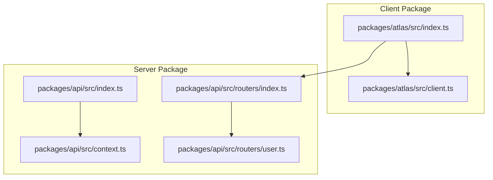
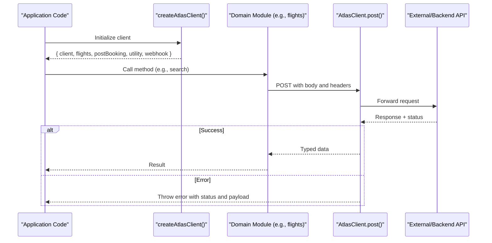
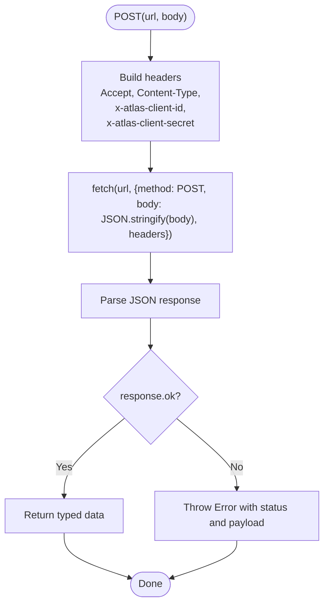
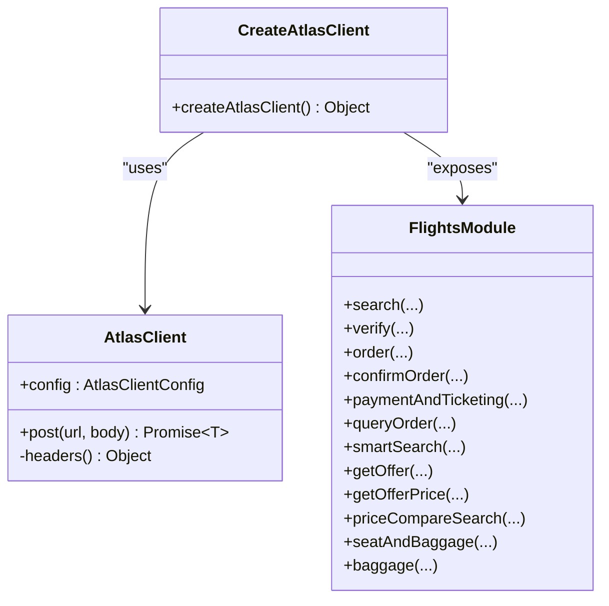
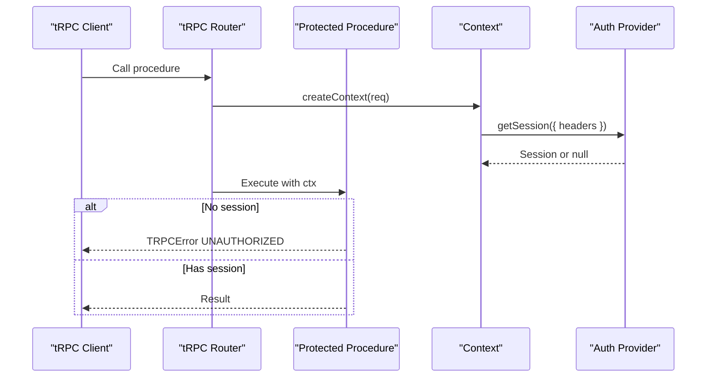
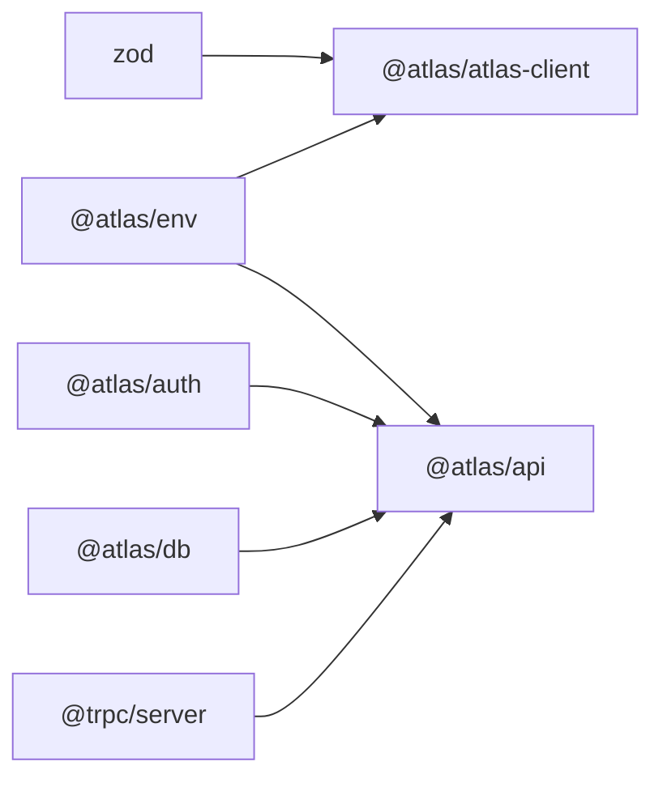

# API Client

<cite>
**Referenced Files in This Document**
- [README.md](file://README.md)
- [index.ts](file://packages/atlas/src/index.ts)
- [client.ts](file://packages/atlas/src/client.ts)
- [package.json](file://packages/atlas/package.json)
- [api_index.ts](file://packages/api/src/index.ts)
- [context.ts](file://packages/api/src/context.ts)
- [routers_index.ts](file://packages/api/src/routers/index.ts)
- [user_router.ts](file://packages/api/src/routers/user.ts)
</cite>

## Table of Contents

1. [Introduction](#introduction)
2. [Project Structure](#project-structure)
3. [Core Components](#core-components)
4. [Architecture Overview](#architecture-overview)
5. [Detailed Component Analysis](#detailed-component-analysis)
6. [Dependency Analysis](#dependency-analysis)
7. [Performance Considerations](#performance-considerations)
8. [Troubleshooting Guide](#troubleshooting-guide)
9. [Conclusion](#conclusion)
10. [Appendices](#appendices)

## Introduction

This document explains the Atlas API client package that provides a typed, ergonomic interface for communicating with backend services. It covers client initialization, configuration, request handling, error management, and how to integrate with React Query for data fetching, caching, and optimistic updates. It also includes guidelines for adding new endpoints, consistent error handling, and optimizing network requests.

The project is a modern TypeScript stack using Next.js, tRPC, Drizzle, PostgreSQL, and authentication via Better-Auth. The Atlas client package exposes a factory function that returns a strongly-typed client object organized by feature domains (flights, post-booking, utility, webhook).

**Section sources**

- [README.md:1-107](file://README.md#L1-L107)

## Project Structure

At a high level:

- packages/atlas: The Atlas API client library used by applications to call external or internal APIs with type safety.
- packages/api: The server-side tRPC layer exposing procedures, context, and routers.
- apps/web: The Next.js application that consumes both the API client and tRPC endpoints.

**Diagram sources**

- [index.ts:1-78](file://packages/atlas/src/index.ts#L1-L78)
- [client.ts:1-41](file://packages/atlas/src/client.ts#L1-L41)
- [api_index.ts:1-26](file://packages/api/src/index.ts#L1-L26)
- [context.ts:1-15](file://packages/api/src/context.ts#L1-L15)
- [routers_index.ts:1-11](file://packages/api/src/routers/index.ts#L1-L11)
- [user_router.ts:1-9](file://packages/api/src/routers/user.ts#L1-L9)

**Section sources**

- [README.md:79-107](file://README.md#L79-L107)

## Core Components

- AtlasClientConfig: Configuration shape containing apiUrl, clientId, and clientSecret.
- AtlasClient: HTTP client wrapper that sets required headers and performs POST requests with JSON payloads and error handling.
- createAtlasClient: Factory that reads environment variables and returns a namespaced client surface (flights, postBooking, utility, webhook).

Key behaviors:

- Automatic header injection for client identification and secret.
- Centralized error handling for non-OK responses.
- Environment-driven configuration for multi-environment deployments.

**Section sources**

- [client.ts:1-41](file://packages/atlas/src/client.ts#L1-L41)
- [index.ts:1-78](file://packages/atlas/src/index.ts#L1-L78)

## Architecture Overview

The Atlas client is designed for typed, domain-scoped calls. Each domain module exports a factory that takes an AtlasClient instance and returns a set of methods. The top-level createAtlasClient wires these modules together and exposes them under clear namespaces.

**Diagram sources**

- [index.ts:36-77](file://packages/atlas/src/index.ts#L36-L77)
- [client.ts:23-39](file://packages/atlas/src/client.ts#L23-L39)

## Detailed Component Analysis

### AtlasClient

Responsibilities:

- Enforce content negotiation and authentication headers.
- Serialize request bodies to JSON.
- Parse JSON responses into typed results.
- Throw descriptive errors on non-OK responses.

Complexity:

- Time complexity per request: O(1) plus serialization/deserialization cost proportional to payload size.
- Space complexity: O(n) for payload and response buffers.

Error handling:

- Non-OK responses throw an Error including HTTP status and parsed response body.

Optimization opportunities:

- Add retry logic with exponential backoff for transient failures.
- Add request deduplication and caching at the client layer if needed.
- Support configurable timeouts and abort controllers.

**Diagram sources**

- [client.ts:14-39](file://packages/atlas/src/client.ts#L14-L39)

**Section sources**

- [client.ts:1-41](file://packages/atlas/src/client.ts#L1-L41)

### createAtlasClient and Domain Modules

Responsibilities:

- Read environment variables for API base URL and credentials.
- Instantiate AtlasClient once and reuse across domains.
- Expose a clean, namespaced API surface for each domain (flights, postBooking, utility, webhook).

Usage pattern:

- Import createAtlasClient from the package.
- Call it to get a client object with domain methods.
- Invoke domain methods with typed inputs; receive typed outputs.

Extensibility:

- Add a new domain by creating a module that exports a factory taking AtlasClient and returning methods.
- Wire the new domain into createAtlasClient’s return object.

**Diagram sources**

- [index.ts:36-77](file://packages/atlas/src/index.ts#L36-L77)
- [client.ts:1-41](file://packages/atlas/src/client.ts#L1-L41)

**Section sources**

- [index.ts:1-78](file://packages/atlas/src/index.ts#L1-L78)

### Server-Side tRPC Layer (Context and Routers)

Responsibilities:

- Provide a shared tRPC context initialized per request, including session retrieval.
- Define protected procedures that enforce authentication.
- Compose routers to expose typed endpoints.

Authentication flow:

- Context fetches session from auth provider using request headers.
- Protected procedures check for session presence and throw standardized errors when missing.

**Diagram sources**

- [api_index.ts:11-25](file://packages/api/src/index.ts#L11-L25)
- [context.ts:4-12](file://packages/api/src/context.ts#L4-L12)
- [user_router.ts:3-8](file://packages/api/src/routers/user.ts#L3-L8)

**Section sources**

- [api_index.ts:1-26](file://packages/api/src/index.ts#L1-L26)
- [context.ts:1-15](file://packages/api/src/context.ts#L1-L15)
- [routers_index.ts:1-11](file://packages/api/src/routers/index.ts#L1-L11)
- [user_router.ts:1-9](file://packages/api/src/routers/user.ts#L1-L9)

## Dependency Analysis

- packages/atlas depends on @atlas/env for runtime configuration and uses Zod for schema validation within domain modules.
- packages/api depends on @trpc/server, @atlas/auth, @atlas/db, and @atlas/env to build the server-side API.

**Diagram sources**

- [package.json:1-19](file://packages/atlas/package.json#L1-L19)
- [package.json:1-28](file://packages/api/package.json#L1-L28)

**Section sources**

- [package.json:1-19](file://packages/atlas/package.json#L1-L19)
- [package.json:1-28](file://packages/api/package.json#L1-L28)

## Performance Considerations

- Request batching and deduplication: Use React Query’s built-in mechanisms to avoid duplicate in-flight requests and batch related queries.
- Caching strategy: Configure stale times and refetch policies per query based on data volatility.
- Optimistic updates: For mutations, update local cache immediately and roll back on error to improve perceived performance.
- Error retries: Implement retry strategies for transient network issues at the React Query level; consider adding client-side retry in AtlasClient for idempotent operations.
- Payload size: Keep request/response payloads minimal; paginate where possible.
- Timeouts and cancellation: Use AbortController in higher layers to cancel in-flight requests on navigation or unmount.

[No sources needed since this section provides general guidance]

## Troubleshooting Guide

Common issues and resolutions:

- Type inference problems:
  - Ensure domain modules export functions with explicit parameter and return types.
  - Validate schemas with Zod to keep client and server types in sync.
- Authentication flows:
  - Verify that protected procedures require a session and that the client sends necessary headers or cookies as configured by your auth setup.
  - Confirm that context retrieves the session correctly from request headers.
- Network errors:
  - Inspect thrown errors from AtlasClient.post for status codes and response payloads.
  - Add logging around failed requests to capture endpoint, payload, and headers.
- Performance regressions:
  - Monitor React Query cache usage and adjust staleTime/refetchInterval.
  - Profile large payloads and consider pagination or field selection.

**Section sources**

- [client.ts:23-39](file://packages/atlas/src/client.ts#L23-L39)
- [api_index.ts:11-25](file://packages/api/src/index.ts#L11-L25)
- [context.ts:4-12](file://packages/api/src/context.ts#L4-L12)

## Conclusion

The Atlas API client package offers a clean, typed interface for calling backend services with automatic header injection and centralized error handling. Combined with the server-side tRPC layer, it enables end-to-end type safety and robust authentication enforcement. By following the patterns outlined here—domain factories, consistent error handling, and React Query best practices—you can build scalable, maintainable features with strong developer experience.

[No sources needed since this section summarizes without analyzing specific files]

## Appendices

### How to Add a New API Endpoint

Steps:

- Define input and output types using Zod schemas.
- Create a domain module that exports a factory taking AtlasClient and returning typed methods.
- Wire the new module into createAtlasClient’s returned object.
- On the server side, add a router and procedure, ensuring protected procedures use the provided middleware for authentication checks.

Guidelines:

- Keep methods small and focused.
- Use consistent naming conventions.
- Add tests for both client and server sides.

[No sources needed since this section provides general guidance]

### Integrating with React Query

Recommendations:

- Queries: Use useQuery with proper keys and staleTime to leverage caching.
- Mutations: Use useMutation with onSuccess/onError handlers to update cache and handle errors.
- Optimistic updates: Update cache optimistically and revert on error for better UX.
- Refetch strategies: Invalidate or refetch dependent queries after successful mutations.

[No sources needed since this section provides general guidance]
