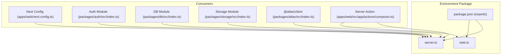
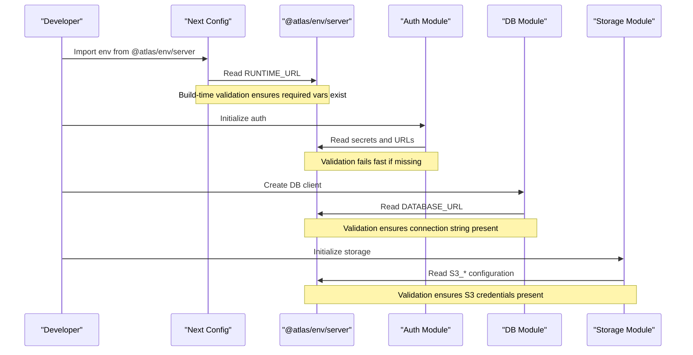
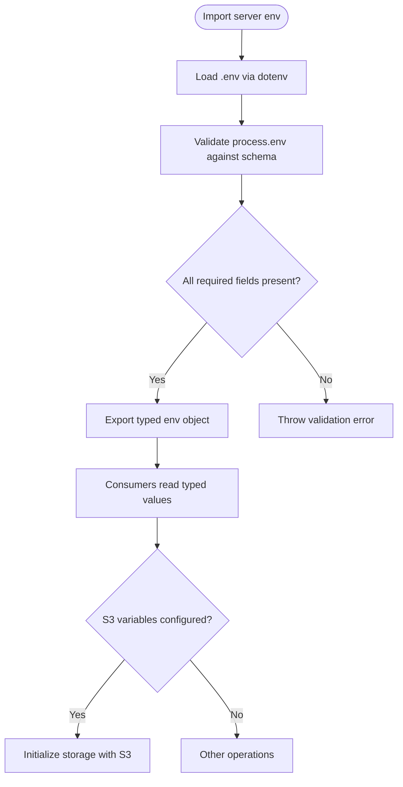
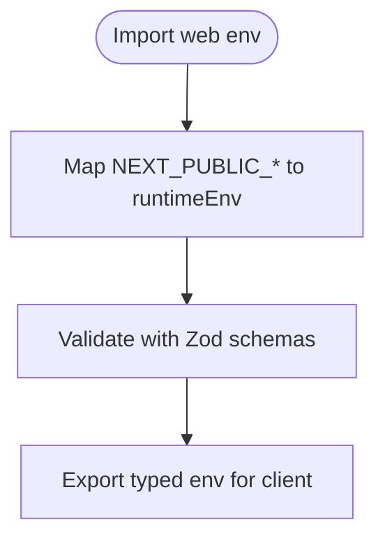
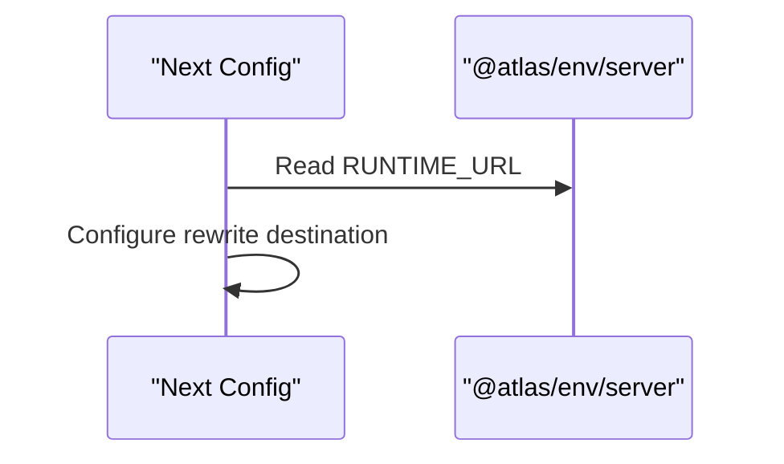
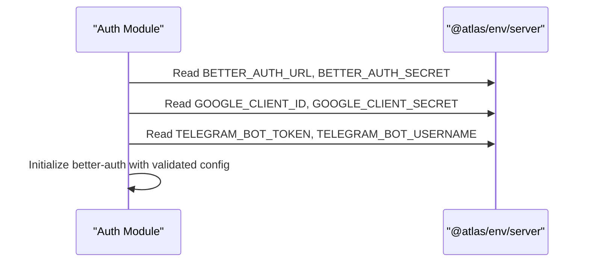
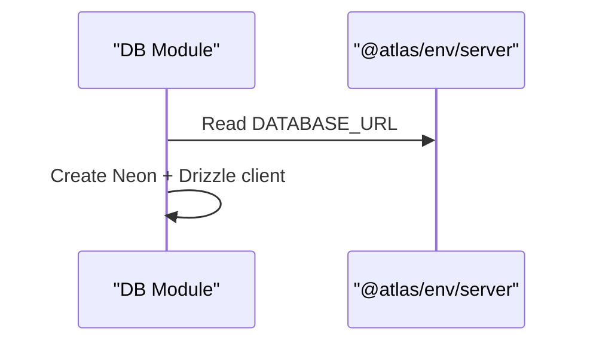
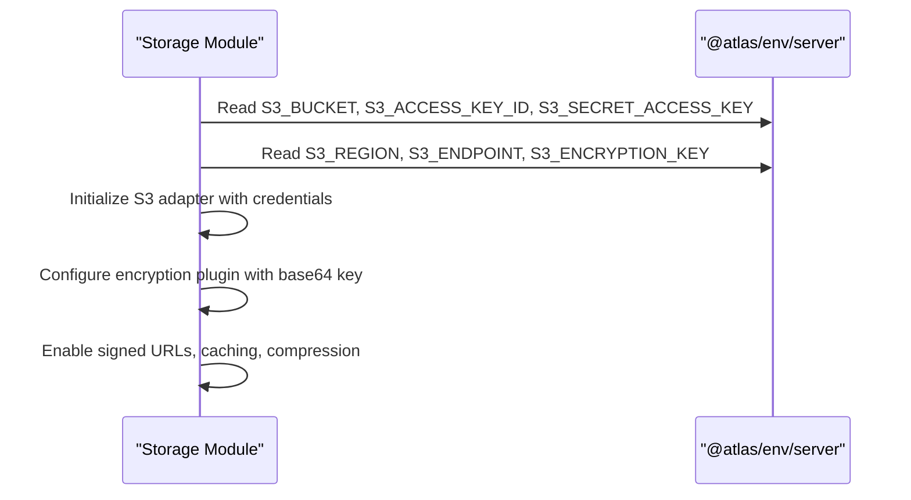
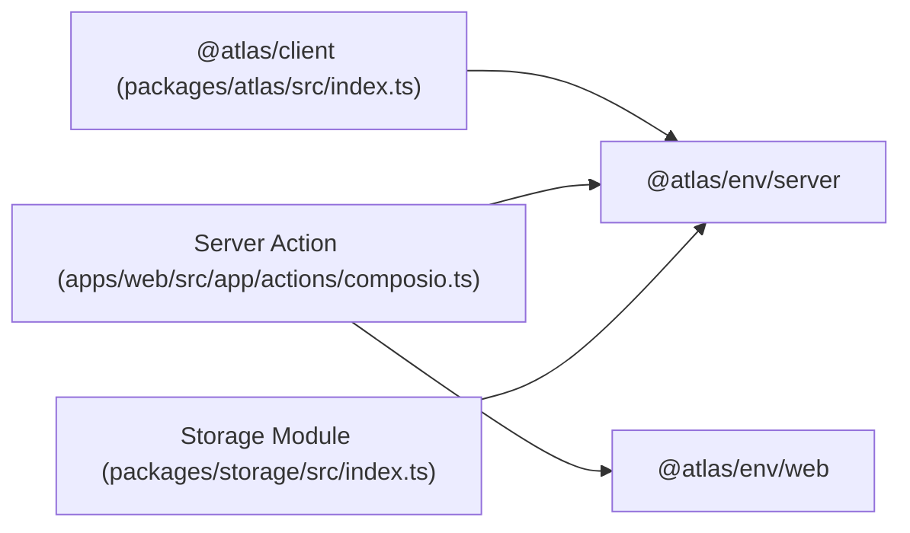
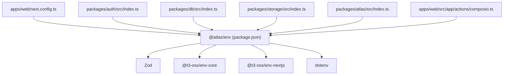

# Environment Configuration

<cite>
**Referenced Files in This Document**
- [packages/env/src/server.ts](file://packages/env/src/server.ts)
- [packages/env/src/web.ts](file://packages/env/src/web.ts)
- [packages/env/package.json](file://packages/env/package.json)
- [apps/web/next.config.ts](file://apps/web/next.config.ts)
- [packages/auth/src/index.ts](file://packages/auth/src/index.ts)
- [packages/db/src/index.ts](file://packages/db/src/index.ts)
- [packages/atlas/src/index.ts](file://packages/atlas/src/index.ts)
- [apps/web/src/app/actions/composio.ts](file://apps/web/src/app/actions/composio.ts)
- [packages/storage/src/index.ts](file://packages/storage/src/index.ts)
- [turbo.json](file://turbo.json)
</cite>

## Update Summary

**Changes Made**

- Added comprehensive documentation for S3 environment variables integration
- Updated server environment schema section with new S3 configuration options
- Added storage module integration section showing S3 usage patterns
- Enhanced troubleshooting guide with S3-specific issues
- Updated dependency analysis to include storage package

## Table of Contents

1. Introduction
2. Project Structure
3. Core Components
4. Architecture Overview
5. Detailed Component Analysis
6. Dependency Analysis
7. Performance Considerations
8. Troubleshooting Guide
9. Conclusion

## Introduction

This document explains the environment configuration package that provides type-safe, validated access to environment variables across the monorepo. It centralizes schema definitions for server and client environments, enforces validation rules using Zod, and exposes typed accessors for Next.js runtime configuration and server-side code. The goal is to prevent missing or invalid configuration at startup, provide clear error messages, and make environment usage consistent across applications and packages.

The environment configuration now includes comprehensive support for AWS S3 integration, enabling secure file storage operations with encryption capabilities across the application stack.

## Project Structure

The environment configuration lives in a dedicated package with two entry points:

- Server entry: validates and exports server-only environment variables including S3 configuration
- Web entry: validates and exports client-safe environment variables for Next.js

**Diagram sources**

- [packages/env/package.json:6-9](file://packages/env/package.json#L6-L9)
- [packages/env/src/server.ts:1-35](file://packages/env/src/server.ts#L1-L35)
- [packages/env/src/web.ts:1-13](file://packages/env/src/web.ts#L1-L13)
- [apps/web/next.config.ts:1-31](file://apps/web/next.config.ts#L1-L31)
- [packages/auth/src/index.ts:1-43](file://packages/auth/src/index.ts#L1-L43)
- [packages/db/src/index.ts:1-13](file://packages/db/src/index.ts#L1-L13)
- [packages/storage/src/index.ts:1-43](file://packages/storage/src/index.ts#L1-L43)
- [packages/atlas/src/index.ts:1-1](file://packages/atlas/src/index.ts#L1-L1)
- [apps/web/src/app/actions/composio.ts:4-5](file://apps/web/src/app/actions/composio.ts#L4-L5)

**Section sources**

- [packages/env/package.json:1-22](file://packages/env/package.json#L1-L22)
- [packages/env/src/server.ts:1-35](file://packages/env/src/server.ts#L1-L35)
- [packages/env/src/web.ts:1-13](file://packages/env/src/web.ts#L1-L13)

## Core Components

- Server environment module:
  - Loads dotenv at import time
  - Uses a core env validator to parse process.env
  - Defines required server-side variables with strict Zod schemas including S3 configuration
  - Exposes a typed env object for safe consumption
- Web environment module:
  - Uses the Next.js-aware env validator
  - Declares only client-safe variables
  - Maps runtimeEnv explicitly for Next.js bundler safety
  - Supports optional client variables and skip flags

Key behaviors:

- emptyStringAsUndefined: treats empty strings as undefined to fail validation early when values are missing
- skipValidation: can be toggled via an environment flag for local development convenience
- Centralized schema: all variables are declared once, ensuring consistency across consumers
- S3 integration: comprehensive AWS S3 configuration with encryption support

**Section sources**

- [packages/env/src/server.ts:1-35](file://packages/env/src/server.ts#L1-L35)
- [packages/env/src/web.ts:1-13](file://packages/env/src/web.ts#L1-L13)

## Architecture Overview

The environment package acts as a single source of truth for configuration. Consumers import either the server or web entry depending on context. Next.js build-time config uses the server entry to configure rewrites and other settings. Runtime modules like authentication, database initialization, and storage operations consume server variables. Client-safe variables are exposed through the web entry for browser contexts.

**Diagram sources**

- [apps/web/next.config.ts:1-31](file://apps/web/next.config.ts#L1-L31)
- [packages/env/src/server.ts:1-35](file://packages/env/src/server.ts#L1-L35)
- [packages/auth/src/index.ts:1-43](file://packages/auth/src/index.ts#L1-L43)
- [packages/db/src/index.ts:1-13](file://packages/db/src/index.ts#L1-L13)
- [packages/storage/src/index.ts:1-43](file://packages/storage/src/index.ts#L1-L43)

## Detailed Component Analysis

### Server Environment Module

Responsibilities:

- Load environment variables via dotenv
- Validate server-only variables with Zod schemas including S3 configuration
- Provide a strongly-typed env object to consumers

Schema highlights:

- Required strings with minimum length for secrets and identifiers
- URL validators for service endpoints and origins
- Enumerated NODE_ENV with a default fallback
- Optional flags to skip validation during local development
- **Updated**: Comprehensive S3 configuration including bucket, credentials, region, endpoint, and encryption key

Usage patterns:

- Imported by Next.js config, authentication setup, database initialization, storage operations, and shared packages
- Ensures all critical configuration is present before application starts

**Diagram sources**

- [packages/env/src/server.ts:1-35](file://packages/env/src/server.ts#L1-L35)

**Section sources**

- [packages/env/src/server.ts:1-35](file://packages/env/src/server.ts#L1-L35)

### Web Environment Module

Responsibilities:

- Define client-safe environment variables
- Map Next.js runtime variables into a typed object
- Support optional client variables and validation skipping

Usage patterns:

- Used in server actions or components where only public variables are needed
- Keeps sensitive data out of the browser bundle

**Diagram sources**

- [packages/env/src/web.ts:1-13](file://packages/env/src/web.ts#L1-L13)

**Section sources**

- [packages/env/src/web.ts:1-13](file://packages/env/src/web.ts#L1-L13)

### Integration with Next.js Runtime Configuration

- The Next.js configuration imports the server environment to configure build-time settings such as rewrites
- Using the server entry ensures required variables are validated during build/startup
- Example usage: configuring API rewrites based on a runtime URL

**Diagram sources**

- [apps/web/next.config.ts:1-31](file://apps/web/next.config.ts#L1-L31)
- [packages/env/src/server.ts:1-35](file://packages/env/src/server.ts#L1-L35)

**Section sources**

- [apps/web/next.config.ts:1-31](file://apps/web/next.config.ts#L1-L31)

### Integration with Authentication Module

- The authentication module reads base URL, secrets, and social provider credentials from the server environment
- Validation guarantees that required secrets and URLs are present before initializing auth

**Diagram sources**

- [packages/auth/src/index.ts:1-43](file://packages/auth/src/index.ts#L1-L43)
- [packages/env/src/server.ts:1-35](file://packages/env/src/server.ts#L1-L35)

**Section sources**

- [packages/auth/src/index.ts:1-43](file://packages/auth/src/index.ts#L1-L43)

### Integration with Database Module

- The database module reads the database connection URL from the server environment
- Validation ensures the connection string is present before creating the client

**Diagram sources**

- [packages/db/src/index.ts:1-13](file://packages/db/src/index.ts#L1-L13)
- [packages/env/src/server.ts:1-35](file://packages/env/src/server.ts#L1-L35)

**Section sources**

- [packages/db/src/index.ts:1-13](file://packages/db/src/index.ts#L1-L13)

### Integration with Storage Module

- The storage module initializes AWS S3 client with comprehensive configuration
- Uses S3 environment variables for bucket, credentials, region, endpoint, and encryption
- Provides file upload/download capabilities with security features

**Diagram sources**

- [packages/storage/src/index.ts:1-43](file://packages/storage/src/index.ts#L1-L43)
- [packages/env/src/server.ts:1-35](file://packages/env/src/server.ts#L1-L35)

**Section sources**

- [packages/storage/src/index.ts:1-43](file://packages/storage/src/index.ts#L1-L43)

### Usage in Shared Packages and Actions

- Shared packages import the server environment to access service URLs and secrets
- Server actions may import both server and web environments to combine private and public configuration safely

**Diagram sources**

- [packages/atlas/src/index.ts:1-1](file://packages/atlas/src/index.ts#L1-L1)
- [apps/web/src/app/actions/composio.ts:4-5](file://apps/web/src/app/actions/composio.ts#L4-L5)
- [packages/env/src/server.ts:1-35](file://packages/env/src/server.ts#L1-L35)
- [packages/env/src/web.ts:1-13](file://packages/env/src/web.ts#L1-L13)
- [packages/storage/src/index.ts:1-43](file://packages/storage/src/index.ts#L1-L43)

**Section sources**

- [packages/atlas/src/index.ts:1-1](file://packages/atlas/src/index.ts#L1-L1)
- [apps/web/src/app/actions/composio.ts:4-5](file://apps/web/src/app/actions/composio.ts#L4-L5)

## Dependency Analysis

The environment package depends on Zod for validation and t3-env libraries for environment parsing. Consumers include Next.js configuration, authentication, database, storage, and shared client packages.

**Diagram sources**

- [packages/env/package.json:10-15](file://packages/env/package.json#L10-L15)
- [apps/web/next.config.ts:1-31](file://apps/web/next.config.ts#L1-L31)
- [packages/auth/src/index.ts:1-43](file://packages/auth/src/index.ts#L1-L43)
- [packages/db/src/index.ts:1-13](file://packages/db/src/index.ts#L1-L13)
- [packages/storage/src/index.ts:1-43](file://packages/storage/src/index.ts#L1-L43)
- [packages/atlas/src/index.ts:1-1](file://packages/atlas/src/index.ts#L1-L1)
- [apps/web/src/app/actions/composio.ts:4-5](file://apps/web/src/app/actions/composio.ts#L4-L5)

**Section sources**

- [packages/env/package.json:1-22](file://packages/env/package.json#L1-L22)

## Performance Considerations

- Validation runs at import time; keep schemas minimal and focused to avoid unnecessary overhead
- Prefer using the correct entry point (server vs web) to avoid loading server-only dependencies in the browser
- Avoid reading large numbers of environment variables in hot paths; cache them in module-level constants if needed
- Use optional client variables judiciously to reduce client bundle size
- **Updated**: S3 encryption key processing occurs at initialization; ensure efficient key handling in storage operations

## Troubleshooting Guide

Common issues and resolutions:

- Missing required variables:
  - Symptom: Startup or build fails with validation errors indicating missing fields
  - Resolution: Ensure all required variables are set in your environment file and loaded by dotenv
- Empty strings treated as undefined:
  - Symptom: Validation fails because empty strings are considered missing
  - Resolution: Provide non-empty values or adjust variable presence accordingly
- Type mismatches:
  - Symptom: Errors due to incorrect types (e.g., URL not valid)
  - Resolution: Correct the value format to match the expected schema (URLs, enums, strings)
- Skipping validation locally:
  - Symptom: You want to bypass validation temporarily
  - Resolution: Set the skip flag used by the environment module to bypass checks during development
- Next.js client variables:
  - Symptom: Variables not available in the browser
  - Resolution: Use the web entry and ensure variables are prefixed appropriately for Next.js client exposure
- **Updated**: S3 configuration issues:
  - Symptom: Storage operations fail with authentication or connection errors
  - Resolution: Verify S3_BUCKET, S3_ACCESS_KEY_ID, S3_SECRET_ACCESS_KEY, S3_REGION are correctly set
  - Symptom: Encryption-related errors occur during file operations
  - Resolution: Ensure S3_ENCRYPTION_KEY is properly formatted as base64 string
  - Symptom: Custom S3 endpoints not working
  - Resolution: Verify S3_ENDPOINT is a valid URL format when using custom S3-compatible services

Debugging tips:

- Inspect which entry point is being imported to confirm the correct environment scope
- Verify that dotenv is loaded before any consumer reads the environment
- Check that environment files are correctly referenced by your runtime or deployment platform
- **Updated**: For S3 issues, verify network connectivity to S3 endpoints and check IAM permissions for the configured access keys

**Section sources**

- [packages/env/src/server.ts:1-35](file://packages/env/src/server.ts#L1-L35)
- [packages/env/src/web.ts:1-13](file://packages/env/src/web.ts#L1-L13)
- [packages/storage/src/index.ts:1-43](file://packages/storage/src/index.ts#L1-L43)

## Conclusion

The environment configuration package centralizes and enforces type-safe access to environment variables across the monorepo. By defining explicit schemas for server and client contexts, it prevents misconfiguration, improves developer experience, and integrates cleanly with Next.js and other packages.

The addition of comprehensive S3 support enables secure file storage operations with encryption capabilities throughout the application stack. The turbo.json configuration ensures proper environment variable passing across the monorepo workspace, maintaining consistency between development, staging, and production environments.

Follow the guidelines for adding new variables, managing secrets, and handling environment-specific configurations to maintain robust and predictable behavior across all environments. The S3 integration provides a solid foundation for scalable file storage needs while maintaining security through proper credential management and encryption.
