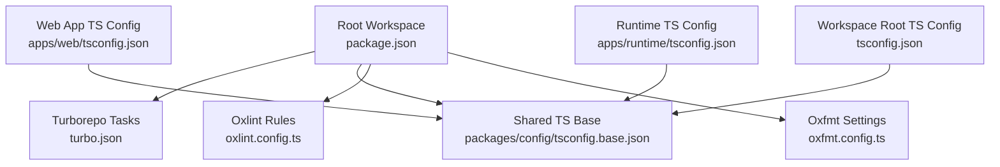
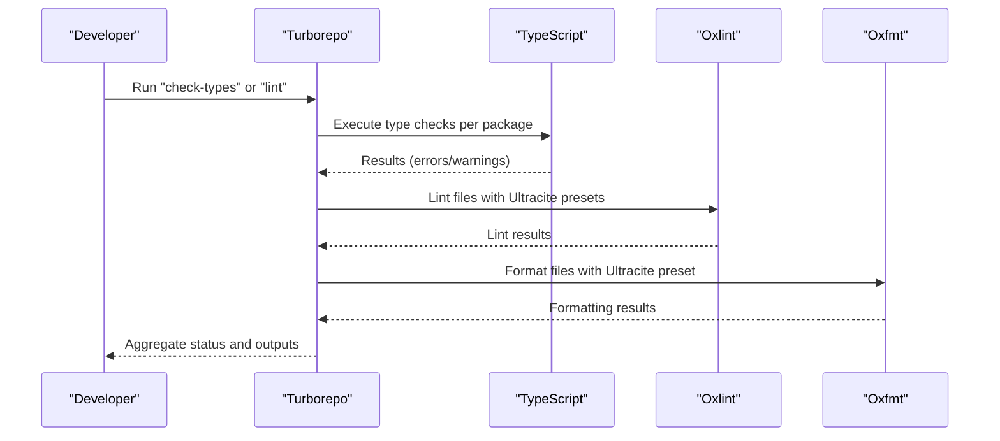
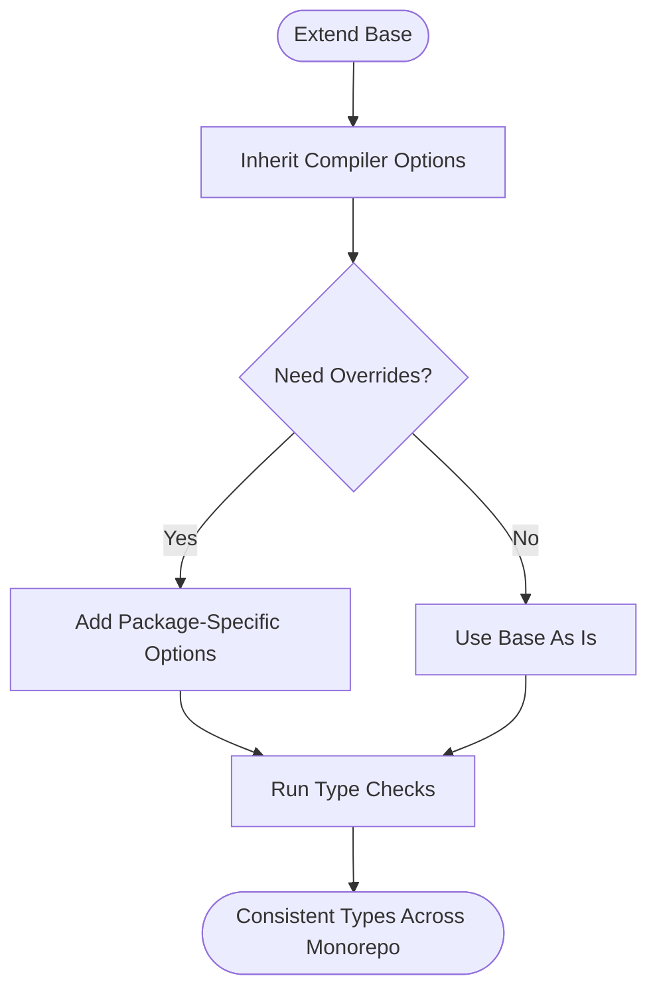
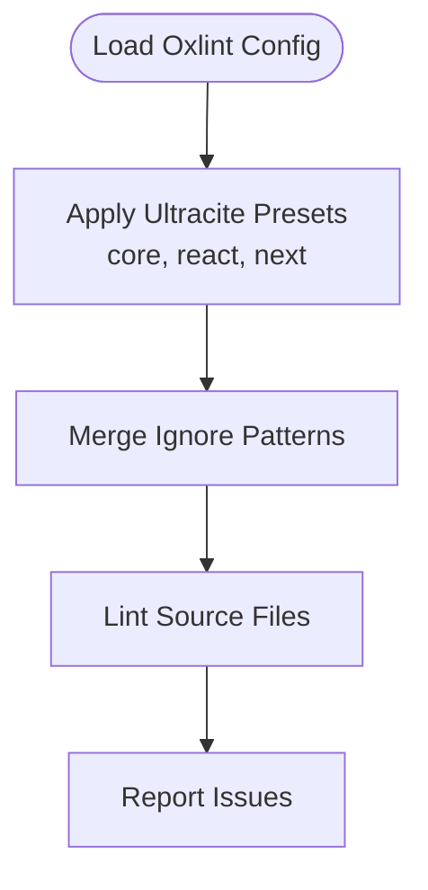
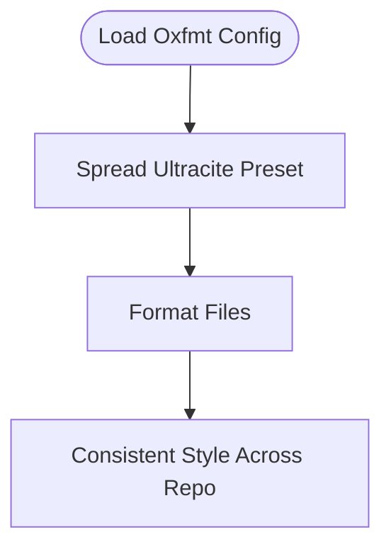
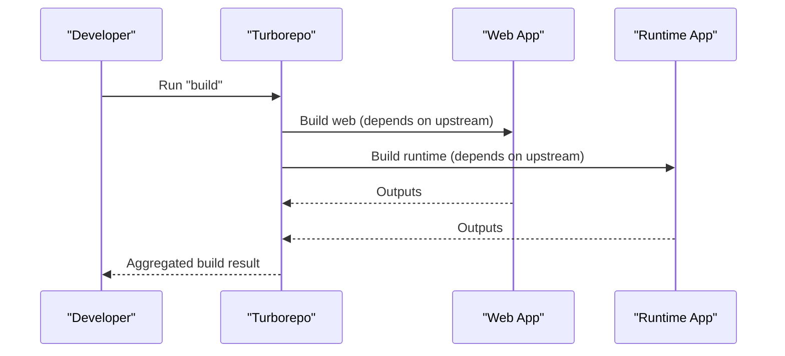
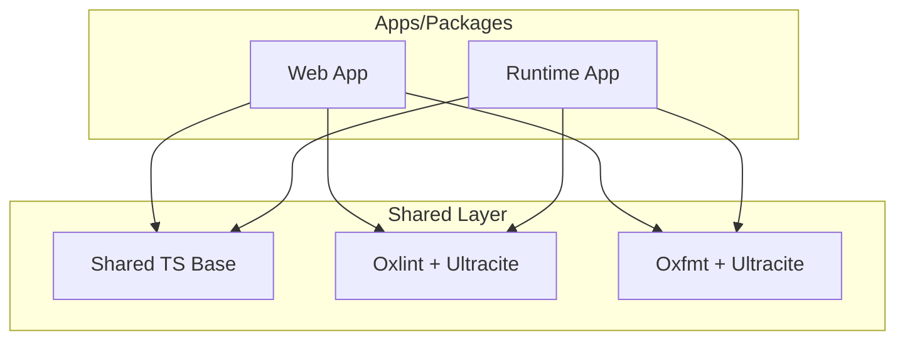
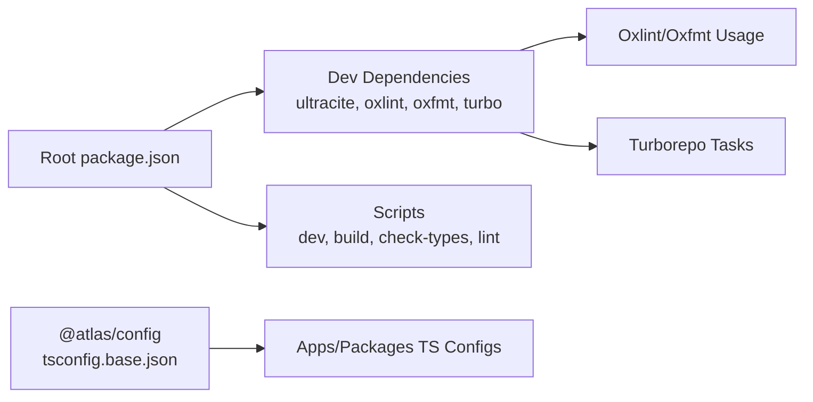

# Shared Configurations

<cite>
**Referenced Files in This Document**
- [package.json](file://package.json)
- [tsconfig.json](file://tsconfig.json)
- [turbo.json](file://turbo.json)
- [oxlint.config.ts](file://oxlint.config.ts)
- [oxfmt.config.ts](file://oxfmt.config.ts)
- [packages/config/package.json](file://packages/config/package.json)
- [packages/config/tsconfig.base.json](file://packages/config/tsconfig.base.json)
- [apps/web/tsconfig.json](file://apps/web/tsconfig.json)
- [apps/runtime/tsconfig.json](file://apps/runtime/tsconfig.json)
</cite>

## Table of Contents

1. [Introduction](#introduction)
2. [Project Structure](#project-structure)
3. [Core Components](#core-components)
4. [Architecture Overview](#architecture-overview)
5. [Detailed Component Analysis](#detailed-component-analysis)
6. [Dependency Analysis](#dependency-analysis)
7. [Performance Considerations](#performance-considerations)
8. [Troubleshooting Guide](#troubleshooting-guide)
9. [Conclusion](#conclusion)
10. [Appendices](#appendices)

## Introduction

This document explains the shared configuration package that centralizes TypeScript settings, linting rules, and development tooling across the monorepo. It describes how the repository standardizes code quality, formatting, and build processes by:

- Publishing a base TypeScript configuration for inheritance
- Centralizing linting and formatting via Oxlint and Oxfmt using Ultracite presets
- Orchestrating tasks with Turborepo to ensure consistent execution across packages
- Enabling IDE integration and CI/CD through predictable scripts and configurations

The goal is to provide a single source of truth for type checking, linting, and formatting so all apps and packages share consistent behavior while allowing controlled overrides where necessary.

## Project Structure

At a high level:

- The root workspace defines scripts and dev tooling dependencies and exposes shared tools like Ultracite, Oxlint, Oxfmt, and Turborepo.
- The shared configuration package publishes a base TypeScript config consumed by other packages.
- Apps and packages extend the base TypeScript configuration and add their own specific options when needed.
- Linting and formatting are configured at the root and applied consistently across the workspace.

**Diagram sources**

- [package.json:29-40](file://package.json#L29-L40)
- [turbo.json:20-35](file://turbo.json#L20-L35)
- [packages/config/tsconfig.base.json:1-22](file://packages/config/tsconfig.base.json#L1-L22)
- [oxlint.config.ts:1-9](file://oxlint.config.ts#L1-L9)
- [oxfmt.config.ts:1-7](file://oxfmt.config.ts#L1-L7)
- [apps/web/tsconfig.json:1-36](file://apps/web/tsconfig.json#L1-L36)
- [apps/runtime/tsconfig.json:1-14](file://apps/runtime/tsconfig.json#L1-L14)
- [tsconfig.json:1-7](file://tsconfig.json#L1-L7)

**Section sources**

- [package.json:29-40](file://package.json#L29-L40)
- [turbo.json:20-35](file://turbo.json#L20-L35)
- [packages/config/tsconfig.base.json:1-22](file://packages/config/tsconfig.base.json#L1-L22)
- [oxlint.config.ts:1-9](file://oxlint.config.ts#L1-L9)
- [oxfmt.config.ts:1-7](file://oxfmt.config.ts#L1-L7)
- [apps/web/tsconfig.json:1-36](file://apps/web/tsconfig.json#L1-L36)
- [apps/runtime/tsconfig.json:1-14](file://apps/runtime/tsconfig.json#L1-L14)
- [tsconfig.json:1-7](file://tsconfig.json#L1-L7)

## Core Components

- Shared TypeScript base configuration: Provides strict, modern compiler options and module resolution suitable for bundlers. Packages inherit from this to ensure consistent type-checking behavior.
- Linting configuration: Uses Oxlint with Ultracite presets for core, React, and Next.js rules. Ignores patterns can be extended per project needs.
- Formatting configuration: Uses Oxfmt with Ultracite preset to enforce consistent formatting across the workspace.
- Task orchestration: Turborepo defines tasks for build, lint, check-types, and development workflows, ensuring consistent execution order and caching.

Key responsibilities:

- Standardize TypeScript compiler behavior across packages
- Centralize linting rules and formatting preferences
- Provide predictable scripts for developers and CI

**Section sources**

- [packages/config/tsconfig.base.json:1-22](file://packages/config/tsconfig.base.json#L1-L22)
- [oxlint.config.ts:1-9](file://oxlint.config.ts#L1-L9)
- [oxfmt.config.ts:1-7](file://oxfmt.config.ts#L1-L7)
- [turbo.json:20-35](file://turbo.json#L20-L35)

## Architecture Overview

The configuration architecture follows an inheritance model for TypeScript and composition for linting/formatting:

- TypeScript: Root and app configs extend the shared base to maintain consistency while allowing targeted overrides.
- Linting: Root-level Oxlint config composes Ultracite presets and adds ignore patterns; individual packages rely on the root config unless they need customizations.
- Formatting: Root-level Oxfmt config applies Ultracite formatting rules uniformly.
- Orchestration: Turborepo coordinates task execution across packages, enabling efficient builds and checks.

**Diagram sources**

- [turbo.json:20-35](file://turbo.json#L20-L35)
- [oxlint.config.ts:1-9](file://oxlint.config.ts#L1-L9)
- [oxfmt.config.ts:1-7](file://oxfmt.config.ts#L1-L7)
- [tsconfig.json:1-7](file://tsconfig.json#L1-L7)
- [packages/config/tsconfig.base.json:1-22](file://packages/config/tsconfig.base.json#L1-L22)

## Detailed Component Analysis

### Shared TypeScript Base Configuration

- Purpose: Define baseline compiler options for strictness, module resolution, and library targets across the monorepo.
- Highlights:
  - Modern target/module settings optimized for bundlers
  - Strict mode enabled with additional safety flags
  - JSON module support and interop options
  - Node types included for runtime environments

Usage:

- Root tsconfig extends the base and may add stricter options.
- Apps and packages extend the base to inherit consistent behavior.

**Diagram sources**

- [packages/config/tsconfig.base.json:1-22](file://packages/config/tsconfig.base.json#L1-L22)
- [tsconfig.json:1-7](file://tsconfig.json#L1-L7)
- [apps/web/tsconfig.json:1-36](file://apps/web/tsconfig.json#L1-L36)
- [apps/runtime/tsconfig.json:1-14](file://apps/runtime/tsconfig.json#L1-L14)

**Section sources**

- [packages/config/tsconfig.base.json:1-22](file://packages/config/tsconfig.base.json#L1-L22)
- [tsconfig.json:1-7](file://tsconfig.json#L1-L7)
- [apps/web/tsconfig.json:1-36](file://apps/web/tsconfig.json#L1-L36)
- [apps/runtime/tsconfig.json:1-14](file://apps/runtime/tsconfig.json#L1-L14)

### Oxlint Configuration

- Purpose: Centralize linting rules using Ultracite presets for core, React, and Next.js.
- Behavior:
  - Extends multiple presets to cover general JS/TS, React, and Next-specific rules
  - Adds ignore patterns to exclude certain directories from linting

Extending or customizing:

- Add new presets or override rules in the root config if needed
- Keep package-specific exceptions minimal to preserve consistency

**Diagram sources**

- [oxlint.config.ts:1-9](file://oxlint.config.ts#L1-L9)

**Section sources**

- [oxlint.config.ts:1-9](file://oxlint.config.ts#L1-L9)

### Oxfmt Configuration

- Purpose: Apply consistent formatting using Ultracite’s formatter preset.
- Behavior:
  - Spreads Ultracite formatting defaults into the root config
  - Ensures uniform style across the workspace without per-package duplication

**Diagram sources**

- [oxfmt.config.ts:1-7](file://oxfmt.config.ts#L1-L7)

**Section sources**

- [oxfmt.config.ts:1-7](file://oxfmt.config.ts#L1-L7)

### Turborepo Task Orchestration

- Purpose: Coordinate build, lint, and type-check tasks across packages with caching and dependency ordering.
- Key tasks:
  - build: depends on upstream builds, includes environment variables and outputs
  - lint: runs after upstream lints
  - check-types: runs after upstream type checks
  - dev: persistent and uncached for live development

**Diagram sources**

- [turbo.json:20-35](file://turbo.json#L20-L35)

**Section sources**

- [turbo.json:20-35](file://turbo.json#L20-L35)

### Conceptual Overview

This setup promotes consistency by:

- Centralizing shared TypeScript settings to avoid drift between packages
- Using Ultracite presets to keep linting and formatting aligned with best practices
- Leveraging Turborepo to ensure predictable and fast task execution

[No sources needed since this diagram shows conceptual workflow, not actual code structure]

## Dependency Analysis

- Root workspace declares devDependencies for tooling (Ultracite, Oxlint, Oxfmt, Turborepo) and provides scripts to run them.
- The shared configuration package exposes a base TypeScript config for inheritance.
- Apps and packages depend on the shared base to maintain consistent compiler behavior.

**Diagram sources**

- [package.json:47-56](file://package.json#L47-L56)
- [package.json:29-40](file://package.json#L29-L40)
- [packages/config/package.json:1-6](file://packages/config/package.json#L1-L6)
- [packages/config/tsconfig.base.json:1-22](file://packages/config/tsconfig.base.json#L1-L22)

**Section sources**

- [package.json:47-56](file://package.json#L47-L56)
- [package.json:29-40](file://package.json#L29-L40)
- [packages/config/package.json:1-6](file://packages/config/package.json#L1-L6)
- [packages/config/tsconfig.base.json:1-22](file://packages/config/tsconfig.base.json#L1-L22)

## Performance Considerations

- Leverage Turborepo caching for build and check tasks to speed up repeated runs.
- Use incremental compilation and isolated modules to improve type-check performance.
- Keep linting rules focused and avoid overly broad ignores to reduce false positives and processing overhead.
- Ensure environment variables required by tasks are defined to prevent unnecessary retries or failures.

[No sources needed since this section provides general guidance]

## Troubleshooting Guide

Common issues and resolutions:

- Conflicting TypeScript settings:
  - If a package overrides base options unexpectedly, align it with the shared base or explicitly document the deviation.
  - Verify that each package’s tsconfig extends the base and only adds necessary overrides.
- Lint rule conflicts:
  - Adjust ignore patterns or customize presets in the root Oxlint config if a package requires different behavior.
  - Prefer adding package-specific ignores rather than weakening global rules.
- Formatting inconsistencies:
  - Ensure Oxfmt is configured at the root and used consistently; reformat affected files to match the preset.
- Task execution problems:
  - Check Turborepo task definitions and environment variables; ensure inputs and outputs are correctly specified.
  - Clear caches if stale artifacts cause unexpected behavior.

**Section sources**

- [turbo.json:20-35](file://turbo.json#L20-L35)
- [oxlint.config.ts:1-9](file://oxlint.config.ts#L1-L9)
- [oxfmt.config.ts:1-7](file://oxfmt.config.ts#L1-L7)
- [packages/config/tsconfig.base.json:1-22](file://packages/config/tsconfig.base.json#L1-L22)

## Conclusion

The shared configuration package and root-level tooling establish a unified foundation for TypeScript, linting, formatting, and task orchestration across the monorepo. By extending a centralized base configuration and leveraging Ultracite presets with Turborepo, teams can maintain high code quality and consistency while enabling controlled customization per package. Adopting these practices reduces drift, improves developer experience, and streamlines CI/CD pipelines.

[No sources needed since this section summarizes without analyzing specific files]

## Appendices

### How to Extend Base Configurations

- TypeScript:
  - Create or update a package’s tsconfig to extend the shared base and add only the necessary overrides.
  - Example path reference: [apps/web/tsconfig.json:1-36](file://apps/web/tsconfig.json#L1-L36), [apps/runtime/tsconfig.json:1-14](file://apps/runtime/tsconfig.json#L1-L14)
- Linting:
  - Extend or adjust the root Oxlint config to include additional presets or ignore patterns when needed.
  - Reference: [oxlint.config.ts:1-9](file://oxlint.config.ts#L1-L9)
- Formatting:
  - Rely on the root Oxfmt config; avoid duplicating formatting rules in packages.
  - Reference: [oxfmt.config.ts:1-7](file://oxfmt.config.ts#L1-L7)

**Section sources**

- [apps/web/tsconfig.json:1-36](file://apps/web/tsconfig.json#L1-L36)
- [apps/runtime/tsconfig.json:1-14](file://apps/runtime/tsconfig.json#L1-L14)
- [oxlint.config.ts:1-9](file://oxlint.config.ts#L1-L9)
- [oxfmt.config.ts:1-7](file://oxfmt.config.ts#L1-L7)

### Managing Dependencies and Updates

- Update shared tooling versions in the root package.json and lockfile to propagate changes across the workspace.
- Review Turborepo task definitions when adding new steps or changing caching behavior.
- Reference: [package.json:47-56](file://package.json#L47-L56), [turbo.json:20-35](file://turbo.json#L20-L35)

**Section sources**

- [package.json:47-56](file://package.json#L47-L56)
- [turbo.json:20-35](file://turbo.json#L20-L35)

### IDE Setup and Local Workflow

- Configure your IDE to use the root linting and formatting configurations for consistent behavior.
- Use the provided scripts to run checks locally before committing.
- Reference: [package.json:29-40](file://package.json#L29-L40)

**Section sources**

- [package.json:29-40](file://package.json#L29-L40)

### CI/CD Integration

- Integrate Turborepo tasks into CI to run build, lint, and type checks consistently.
- Ensure environment variables required by tasks are available in CI.
- Reference: [turbo.json:4-19](file://turbo.json#L4-L19), [turbo.json:20-35](file://turbo.json#L20-L35)

**Section sources**

- [turbo.json:4-19](file://turbo.json#L4-L19)
- [turbo.json:20-35](file://turbo.json#L20-L35)
