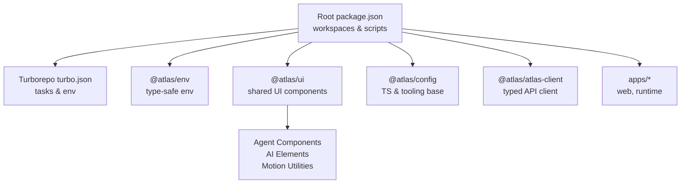
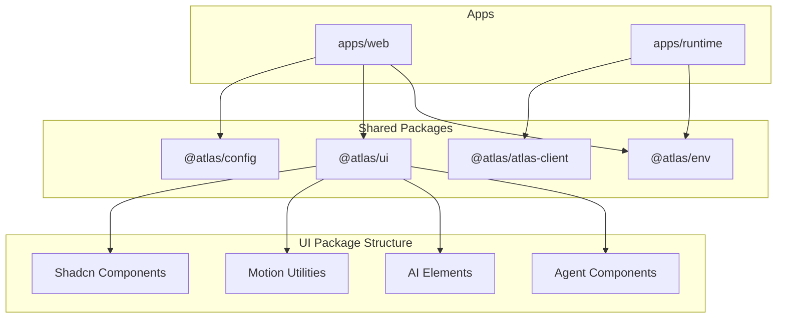
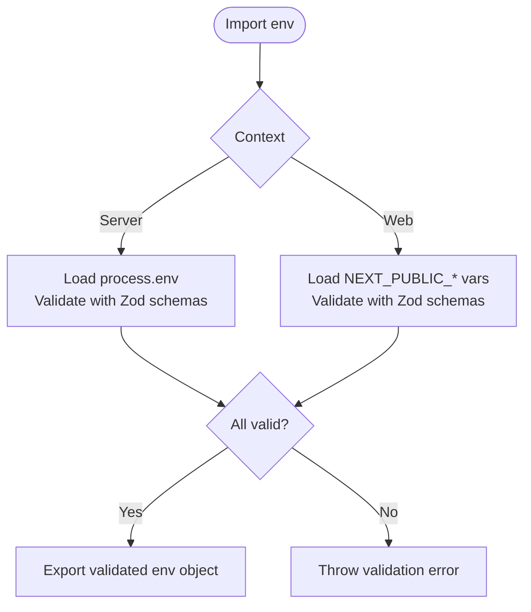
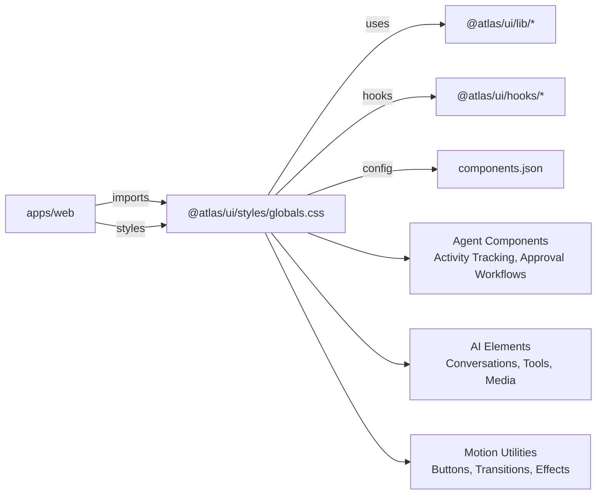
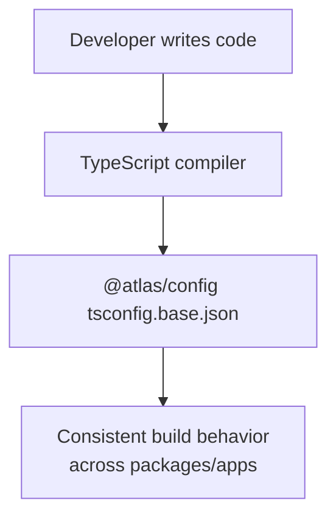
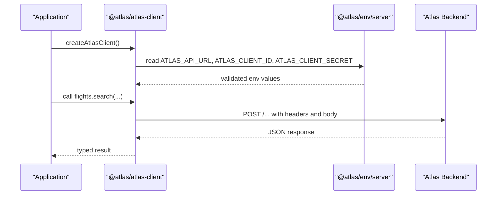
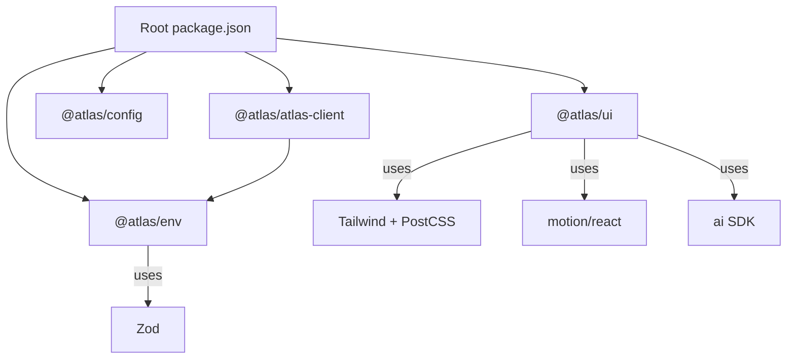

# Shared Packages

<cite>
**Referenced Files in This Document**
- [README.md](file://README.md)
- [package.json](file://package.json)
- [turbo.json](file://turbo.json)
- [packages/env/package.json](file://packages/env/package.json)
- [packages/env/src/server.ts](file://packages/env/src/server.ts)
- [packages/env/src/web.ts](file://packages/env/src/web.ts)
- [packages/ui/package.json](file://packages/ui/package.json)
- [packages/ui/components.json](file://packages/ui/components.json)
- [packages/config/package.json](file://packages/config/package.json)
- [packages/config/tsconfig.base.json](file://packages/config/tsconfig.base.json)
- [packages/atlas/package.json](file://packages/atlas/package.json)
- [packages/atlas/src/index.ts](file://packages/atlas/src/index.ts)
- [packages/atlas/src/client.ts](file://packages/atlas/src/client.ts)
- [packages/ui/src/components/agents/agent-activity/index.tsx](file://packages/ui/src/components/agents/agent-activity/index.tsx)
- [packages/ui/src/components/agents/approval-card/index.tsx](file://packages/ui/src/components/agents/approval-card/index.tsx)
- [packages/ui/src/components/motion/button/index.tsx](file://packages/ui/src/components/motion/button/index.tsx)
- [packages/ui/src/components/ai-elements/agent.tsx](file://packages/ui/src/components/ai-elements/agent.tsx)
</cite>

## Update Summary

**Changes Made**

- Updated UI Component Library section to document new agent components, AI elements, and motion utilities
- Added comprehensive coverage of the expanded @atlas/ui package exports including agent activity tracking, approval workflows, and motion components
- Enhanced component architecture diagrams to reflect the new component hierarchy
- Updated consumption examples to include new agent and AI component usage patterns

## Table of Contents

1. Introduction
2. Project Structure
3. Core Components
4. Architecture Overview
5. Detailed Component Analysis
6. Dependency Analysis
7. Performance Considerations
8. Troubleshooting Guide
9. Conclusion
10. Appendices

## Introduction

This document explains the shared packages within the monorepo that provide reusable libraries and utilities across applications. It focuses on:

- Environment configuration with type-safe validation for server and web contexts
- The UI component library built on shadcn/ui primitives, including extensive agent components, AI elements, and motion utilities
- Centralized TypeScript settings and development tooling via a shared config package
- The Atlas API client package that provides a typed interface to backend services It also includes guidelines for adding new shared packages, maintaining backward compatibility, publishing updates, consuming packages in apps, and best practices for package development.

## Project Structure

The monorepo uses Turborepo workspaces to manage multiple packages and apps. Shared code lives under packages/, while applications live under apps/. The root configuration defines workspace packages, cataloged dependencies, and tasks for building, linting, and type-checking.

**Diagram sources**

- [package.json:1-66](file://package.json#L1-L66)
- [turbo.json:1-52](file://turbo.json#L1-L52)

**Section sources**

- [README.md:79-107](file://README.md#L79-L107)
- [package.json:1-66](file://package.json#L1-L66)
- [turbo.json:1-52](file://turbo.json#L1-L52)

## Core Components

- @atlas/env: Type-safe environment variable validation for server and web runtimes using Zod schemas.
- @atlas/ui: Comprehensive shared UI components based on shadcn/ui with centralized styles, hooks, utility modules, and extensive agent/AI components with motion capabilities.
- @atlas/config: Base TypeScript configuration and shared dev tooling setup for consistent builds.
- @atlas/atlas-client: Typed client for communicating with Atlas backend services, with environment-driven configuration.

**Section sources**

- [packages/env/package.json:1-22](file://packages/env/package.json#L1-L22)
- [packages/ui/package.json:1-68](file://packages/ui/package.json#L1-L68)
- [packages/config/package.json:1-6](file://packages/config/package.json#L1-L6)
- [packages/atlas/package.json:1-11](file://packages/atlas/package.json#L1-L11)

## Architecture Overview

The shared packages are consumed by applications through workspace references. The environment package validates variables at startup, the UI package exposes components and styles with extensive agent/AI capabilities, the config package standardizes TS settings, and the Atlas client encapsulates HTTP calls with typed responses.

**Diagram sources**

- [package.json:1-66](file://package.json#L1-L66)
- [packages/env/package.json:1-22](file://packages/env/package.json#L1-L22)
- [packages/ui/package.json:1-68](file://packages/ui/package.json#L1-L68)
- [packages/config/package.json:1-6](file://packages/config/package.json#L1-L6)
- [packages/atlas/package.json:1-11](file://packages/atlas/package.json#L1-L11)

## Detailed Component Analysis

### Environment Configuration (@atlas/env)

Provides two entry points:

- Server-side validation for process.env using Zod schemas
- Web-side validation for browser-only variables

Key behaviors:

- Enforces required fields and formats (URLs, enums)
- Supports skipping validation when explicitly requested
- Exposes separate exports for server and web contexts

**Diagram sources**

- [packages/env/src/server.ts:1-29](file://packages/env/src/server.ts#L1-L29)
- [packages/env/src/web.ts:1-14](file://packages/env/src/web.ts#L1-L14)

**Section sources**

- [packages/env/package.json:1-22](file://packages/env/package.json#L1-L22)
- [packages/env/src/server.ts:1-29](file://packages/env/src/server.ts#L1-L29)
- [packages/env/src/web.ts:1-14](file://packages/env/src/web.ts#L1-L14)

### UI Component Library (@atlas/ui)

A comprehensive shared UI package built on shadcn/ui primitives with extensive agent components, AI elements, and motion utilities:

**Core Features:**

- Centralized global styles and Tailwind configuration
- Reusable components, hooks, and utilities
- Aliases for clean imports across apps
- Extensive agent interaction components for AI workflows
- Motion-enabled interactive elements with spring animations
- Specialized AI conversation and tool execution components

**New Agent Components:**

- **Agent Activity**: Real-time activity tracking with collapsible sections, status indicators, and animated transitions
- **Approval Cards**: Multi-step approval workflows with questionnaires, progress tracking, and state management
- **Streaming Responses**: Live content streaming with citations, feedback mechanisms, and real-time updates

**AI Elements:**

- Agent orchestration components with tool integration
- Conversation interfaces with message handling
- Code execution environments and terminal interfaces
- File system navigation and preview components
- Media handling (audio, video, images)

**Motion Utilities:**

- Enhanced button components with magnetic effects and state management
- Smooth scrolling and scroll progress indicators
- Animated transitions with spring physics
- Interactive hover effects and micro-interactions

**Diagram sources**

- [packages/ui/package.json:1-68](file://packages/ui/package.json#L1-L68)
- [packages/ui/components.json:1-26](file://packages/ui/components.json#L1-L26)

**Section sources**

- [packages/ui/package.json:1-68](file://packages/ui/package.json#L1-L68)
- [packages/ui/components.json:1-26](file://packages/ui/components.json#L1-L26)
- [README.md:48-73](file://README.md#L48-L73)
- [packages/ui/src/components/agents/agent-activity/index.tsx:1-296](file://packages/ui/src/components/agents/agent-activity/index.tsx#L1-L296)
- [packages/ui/src/components/agents/approval-card/index.tsx:1-474](file://packages/ui/src/components/agents/approval-card/index.tsx#L1-L474)
- [packages/ui/src/components/motion/button/index.tsx:1-12](file://packages/ui/src/components/motion/button/index.tsx#L1-L12)
- [packages/ui/src/components/ai-elements/agent.tsx:1-147](file://packages/ui/src/components/ai-elements/agent.tsx#L1-L147)

### Configuration Package (@atlas/config)

Centralizes TypeScript compiler options and strictness rules to ensure consistency across packages and apps.

Highlights:

- Targets modern JS/TS features
- Enables strict mode and useful checks
- Standardizes module resolution and types

**Diagram sources**

- [packages/config/tsconfig.base.json:1-23](file://packages/config/tsconfig.base.json#L1-L23)

**Section sources**

- [packages/config/package.json:1-6](file://packages/config/package.json#L1-L6)
- [packages/config/tsconfig.base.json:1-23](file://packages/config/tsconfig.base.json#L1-L23)

### Atlas API Client (@atlas/atlas-client)

A typed client that encapsulates communication with Atlas backend services. It reads configuration from the environment package and exposes organized endpoints grouped by domain (flights, post-booking, utility, webhook).

**Diagram sources**

- [packages/atlas/src/index.ts:1-78](file://packages/atlas/src/index.ts#L1-L78)
- [packages/atlas/src/client.ts:1-43](file://packages/atlas/src/client.ts#L1-L43)
- [packages/env/src/server.ts:1-29](file://packages/env/src/server.ts#L1-L29)

**Section sources**

- [packages/atlas/package.json:1-11](file://packages/atlas/package.json#L1-L11)
- [packages/atlas/src/index.ts:1-78](file://packages/atlas/src/index.ts#L1-L78)
- [packages/atlas/src/client.ts:1-43](file://packages/atlas/src/client.ts#L1-L43)

## Dependency Analysis

Workspace relationships and task orchestration:

- Root package.json declares workspaces and catalogs shared dependency versions
- Turbo tasks define build order, caching, and environment variables
- Packages depend on each other via workspace references

**Diagram sources**

- [package.json:1-66](file://package.json#L1-L66)
- [packages/atlas/package.json:1-11](file://packages/atlas/package.json#L1-L11)
- [packages/env/package.json:1-22](file://packages/env/package.json#L1-L22)
- [packages/ui/package.json:1-68](file://packages/ui/package.json#L1-L68)

**Section sources**

- [package.json:1-66](file://package.json#L1-L66)
- [turbo.json:1-52](file://turbo.json#L1-L52)

## Performance Considerations

- Use workspace dependencies to avoid duplicate installs and speed up installs
- Keep environment validation minimal and only validate what is needed per context (server vs web)
- Prefer lazy initialization of heavy clients; initialize the Atlas client once per process
- Leverage Turborepo caching for builds and type checks to reduce rebuild times
- Avoid importing large UI bundles into server-only code paths
- Utilize motion/react's useReducedMotion hook for accessibility and performance optimization
- Implement proper memoization for complex agent components to prevent unnecessary re-renders

[No sources needed since this section provides general guidance]

## Troubleshooting Guide

Common issues and resolutions:

- Missing or invalid environment variables: Ensure all required keys are present and correctly formatted. Validation errors will surface at startup for server-side env.
- Skipping validation: Set SKIP_ENV_VALIDATION to bypass checks during local development if necessary.
- UI import paths: Verify that components are imported via the configured aliases and that global styles are included in the app.
- Client errors: The Atlas client throws descriptive errors when backend responses indicate failure; inspect status codes and payloads.
- Agent component issues: Check that motion/react dependencies are properly installed and that reduced motion preferences are respected.
- AI element rendering: Ensure proper context providers are set up for AI-specific components and that streaming data is handled correctly.

**Section sources**

- [packages/env/src/server.ts:1-29](file://packages/env/src/server.ts#L1-L29)
- [packages/env/src/web.ts:1-14](file://packages/env/src/web.ts#L1-L14)
- [packages/atlas/src/client.ts:1-43](file://packages/atlas/src/client.ts#L1-L43)

## Conclusion

The shared packages provide a robust foundation for type safety, consistent UI, standardized configuration, and reliable API interactions. The expanded @atlas/ui package now offers comprehensive agent components, AI elements, and motion utilities that enable sophisticated AI-powered user interfaces. By following the guidelines in this document, teams can add new shared packages, maintain compatibility, and publish updates efficiently across the monorepo.

[No sources needed since this section summarizes without analyzing specific files]

## Appendices

### Guidelines for Adding New Shared Packages

- Create a new folder under packages/ with a package.json defining name, version, and exports
- Add source files under src/ and configure TypeScript using the shared base config
- Register the package in workspace dependencies where needed
- Define clear public APIs via exports and keep internal modules private
- Add tests and documentation within the package

**Section sources**

- [package.json:1-66](file://package.json#L1-L66)
- [packages/config/tsconfig.base.json:1-23](file://packages/config/tsconfig.base.json#L1-L23)

### Maintaining Backward Compatibility

- Version packages semantically and communicate breaking changes
- Preserve existing export paths and function signatures unless absolutely necessary
- Provide deprecation notices and migration guides for major updates
- Test consumers in apps before publishing to catch regressions early

[No sources needed since this section provides general guidance]

### Publishing Updates Across the Monorepo

- Update package version in the package's package.json
- Run type checks and linting across the workspace
- Build dependent packages to ensure integration
- Publish and update workspace references as needed

**Section sources**

- [turbo.json:1-52](file://turbo.json#L1-L52)
- [package.json:1-66](file://package.json#L1-L66)

### Consuming Shared Packages in Applications

- Import environment variables from @atlas/env/server or @atlas/env/web depending on context
- Use UI components via the configured aliases (e.g., @atlas/ui/components/*)
- Initialize the Atlas client and call domain-specific methods (flights, post-booking, utility, webhook)
- Include global styles from @atlas/ui to ensure consistent theming
- Import agent components for AI workflows: `@atlas/ui/components/agents/agent-activity` and `@atlas/ui/components/agents/approval-card`
- Utilize motion components for enhanced user interactions: `@atlas/ui/components/motion/button`
- Leverage AI elements for conversation interfaces: `@atlas/ui/components/ai-elements/*`

**Section sources**

- [packages/env/package.json:1-22](file://packages/env/package.json#L1-L22)
- [packages/ui/package.json:1-68](file://packages/ui/package.json#L1-L68)
- [packages/atlas/src/index.ts:1-78](file://packages/atlas/src/index.ts#L1-L78)
- [README.md:48-73](file://README.md#L48-L73)

### Best Practices for Package Development

- Keep packages focused and cohesive with single responsibilities
- Use strict TypeScript settings and enable helpful checks
- Minimize external dependencies and prefer cataloged versions
- Document public APIs and usage examples
- Write tests for critical logic and edge cases
- Implement proper accessibility support, especially for motion components
- Follow consistent naming conventions for agent and AI components
- Provide comprehensive prop interfaces with clear documentation
- Test components with various screen sizes and motion preferences

[No sources needed since this section provides general guidance]
