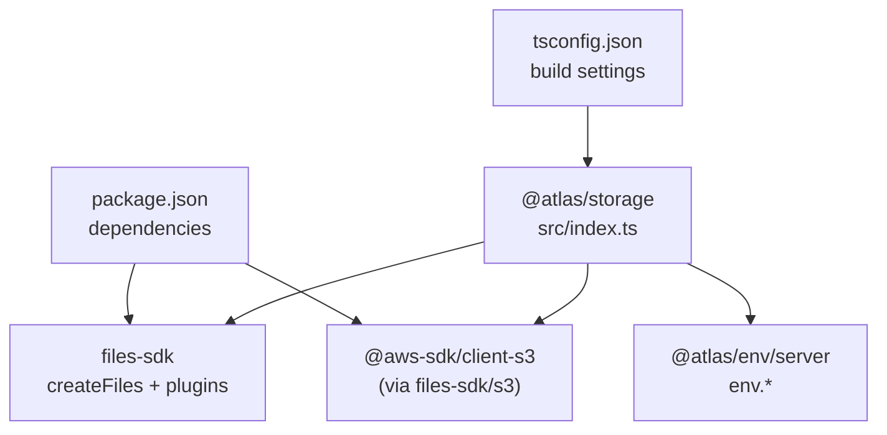
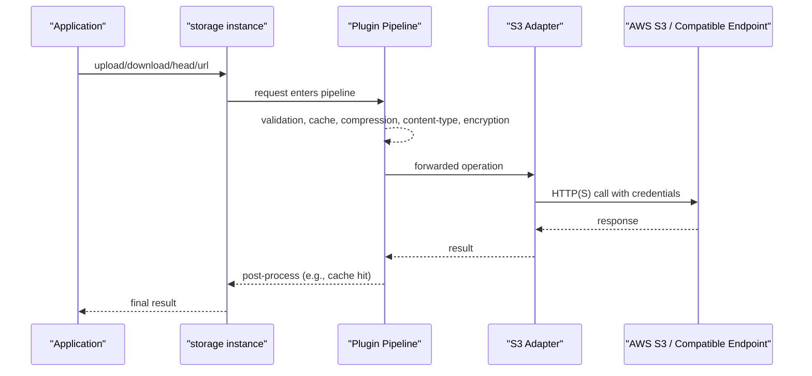
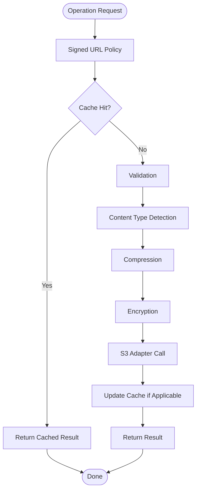
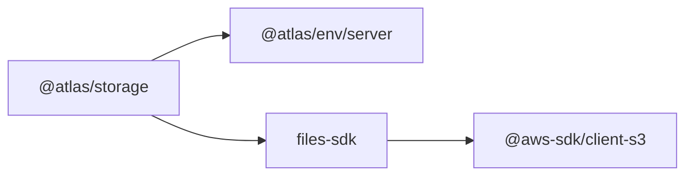

# Storage Package (AWS S3 Integration)

<cite>
**Referenced Files in This Document**
- [index.ts](file://packages/storage/src/index.ts)
- [package.json](file://packages/storage/package.json)
- [tsconfig.json](file://packages/storage/tsconfig.json)
- [server.ts](file://packages/env/src/server.ts)
</cite>

## Table of Contents

1. [Introduction](#introduction)
2. [Project Structure](#project-structure)
3. [Core Components](#core-components)
4. [Architecture Overview](#architecture-overview)
5. [Detailed Component Analysis](#detailed-component-analysis)
6. [Dependency Analysis](#dependency-analysis)
7. [Performance Considerations](#performance-considerations)
8. [Troubleshooting Guide](#troubleshooting-guide)
9. [Conclusion](#conclusion)

## Introduction

This document describes the Storage package that provides a secure, configurable AWS S3 integration for file operations within the project. It exposes a ready-to-use storage instance and a factory to create additional instances with consistent configuration. The package leverages a file SDK with an S3 adapter and a set of plugins for signed URL policies, caching, validation, content type handling, compression, and encryption.

## Project Structure

The storage package is a small, focused module:

- Entry point exports a factory function and a preconfigured singleton instance.
- Configuration is sourced from environment variables validated by the shared env package.
- Dependencies include the AWS SDK for S3 and a file SDK that abstracts storage operations.

**Diagram sources**

- [index.ts:1-42](file://packages/storage/src/index.ts#L1-L42)
- [package.json:15-20](file://packages/storage/package.json#L15-L20)
- [tsconfig.json:1-12](file://packages/storage/tsconfig.json#L1-L12)

**Section sources**

- [index.ts:1-42](file://packages/storage/src/index.ts#L1-L42)
- [package.json:1-26](file://packages/storage/package.json#L1-L26)
- [tsconfig.json:1-12](file://packages/storage/tsconfig.json#L1-L12)

## Core Components

- Factory function: creates a configured storage instance using the S3 adapter and plugin pipeline.
- Singleton instance: a default storage instance exported for immediate use across the application.
- Environment-driven configuration: all S3 credentials and endpoints are read from validated environment variables.

Key responsibilities:

- Configure S3 adapter with bucket, region, endpoint, and credentials.
- Enforce security via signed URL policy and encryption.
- Improve performance via caching and compression.
- Ensure data integrity and safety via validation and content type detection.

**Section sources**

- [index.ts:11-42](file://packages/storage/src/index.ts#L11-L42)
- [server.ts:24-29](file://packages/env/src/server.ts#L24-L29)

## Architecture Overview

The storage package composes a file SDK with an S3 adapter and multiple middleware-like plugins. Requests flow through the plugin chain before reaching the S3 adapter, which performs actual operations against AWS S3 or a compatible endpoint.

**Diagram sources**

- [index.ts:11-40](file://packages/storage/src/index.ts#L11-L40)

## Detailed Component Analysis

### Storage Factory and Instance

- Exports a factory function to create a storage instance with explicit configuration.
- Exports a pre-instantiated singleton for convenience.
- Uses environment variables for S3 connection details and encryption key.

Operational highlights:

- S3 adapter configuration includes bucket, credentials, optional endpoint, and region.
- Plugin order defines behavior precedence: signed URL policy, caching, validation, content type, compression, encryption.

**Section sources**

- [index.ts:11-42](file://packages/storage/src/index.ts#L11-L42)

### Environment Configuration

- All S3-related environment variables are defined and validated centrally.
- Required variables include bucket, access key ID, secret access key, region, and encryption key; endpoint is optional.

Environment variables used by storage:

- Bucket name
- Access key ID
- Secret access key
- Region
- Optional custom endpoint
- Encryption key (base64-encoded)

Security note: ensure these values are managed securely in your deployment environment.

**Section sources**

- [server.ts:24-29](file://packages/env/src/server.ts#L24-L29)

### Plugin Pipeline

The storage instance applies a sequence of plugins to every operation:

- Signed URL Policy
  - Limits maximum expiration time for generated URLs.
  - Caps maximum upload size allowed via signed URLs.

- Cache
  - Caches results for head, url, and download operations.
  - Configurable TTL and max cached bytes.

- Validation
  - Enforces minimum and maximum file sizes.

- Content Type
  - Detects and sets appropriate content types.

- Compression
  - Applies compression where applicable.

- Encryption
  - Encrypts data at rest using a base64-decoded key from environment.

These plugins collectively provide security, performance, and reliability for file operations.

**Diagram sources**

- [index.ts:22-39](file://packages/storage/src/index.ts#L22-L39)

**Section sources**

- [index.ts:22-39](file://packages/storage/src/index.ts#L22-L39)

### Error Handling and Edge Cases

- Validation errors will be raised when file sizes fall outside configured bounds.
- Missing or invalid environment variables will fail at initialization due to strict validation.
- Network or authentication failures will propagate from the S3 adapter layer.

Recommended practices:

- Wrap calls in try/catch blocks in consuming code.
- Log and surface meaningful error messages to users.
- Monitor environment variable availability at startup.

[No sources needed since this section provides general guidance]

## Dependency Analysis

The storage package depends on:

- The AWS SDK for S3 (used indirectly via the file SDK’s S3 adapter).
- The file SDK and its plugins for unified file operations.
- The shared environment package for typed, validated configuration.

**Diagram sources**

- [package.json:15-20](file://packages/storage/package.json#L15-L20)
- [index.ts:1-9](file://packages/storage/src/index.ts#L1-L9)

**Section sources**

- [package.json:15-20](file://packages/storage/package.json#L15-L20)
- [index.ts:1-9](file://packages/storage/src/index.ts#L1-L9)

## Performance Considerations

- Caching: Enabled for head, url, and download operations with a short TTL to reduce repeated network calls.
- Compression: Applied to reduce payload sizes where supported.
- Validation: Prevents unnecessary uploads/downloads by enforcing size limits early.
- Encryption: Adds CPU overhead; consider balancing security needs with performance requirements.

Tuning tips:

- Adjust cache TTL and max bytes based on workload patterns.
- Review compression effectiveness per content type.
- Monitor S3 latency and adjust timeouts/retries at the adapter level if exposed.

[No sources needed since this section provides general guidance]

## Troubleshooting Guide

Common issues and resolutions:

- Missing environment variables: Ensure all required S3 variables are present and valid at runtime.
- Authentication failures: Verify access key ID and secret access key have permissions to the target bucket and region.
- Endpoint misconfiguration: If using a custom endpoint, confirm it is reachable and correctly formatted.
- Upload size exceeded: Check validation limits and signed URL policy caps.
- Decryption errors: Confirm the encryption key is correct and consistently applied.

Steps to diagnose:

- Validate environment variables at startup.
- Inspect logs around plugin stages to identify where failures occur.
- Test connectivity to the S3 endpoint independently.

**Section sources**

- [server.ts:24-29](file://packages/env/src/server.ts#L24-L29)
- [index.ts:22-39](file://packages/storage/src/index.ts#L22-L39)

## Conclusion

The Storage package provides a robust, secure, and performant abstraction over AWS S3. By centralizing configuration, enforcing security policies, and leveraging caching and compression, it simplifies file operations while maintaining high standards for reliability and safety. Use the provided singleton for most cases, or the factory to create isolated instances when needed.

[No sources needed since this section summarizes without analyzing specific files]
