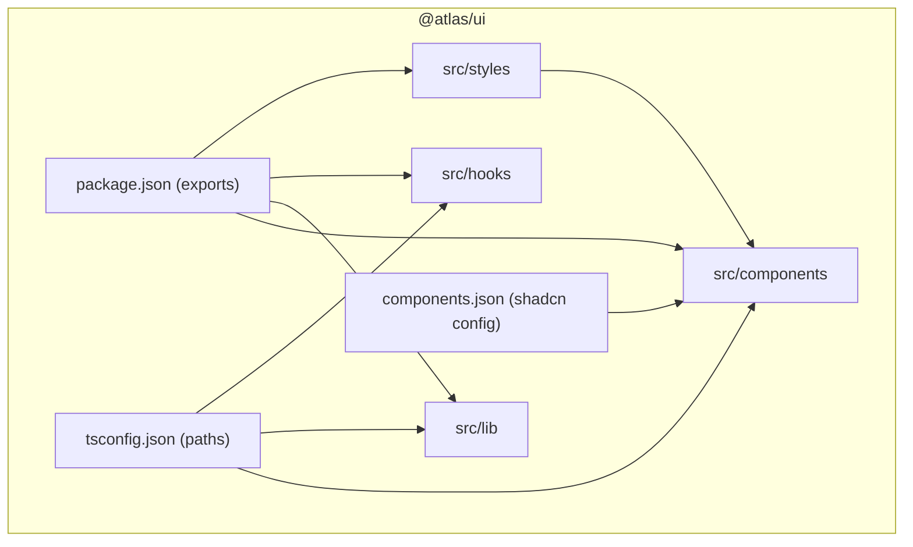
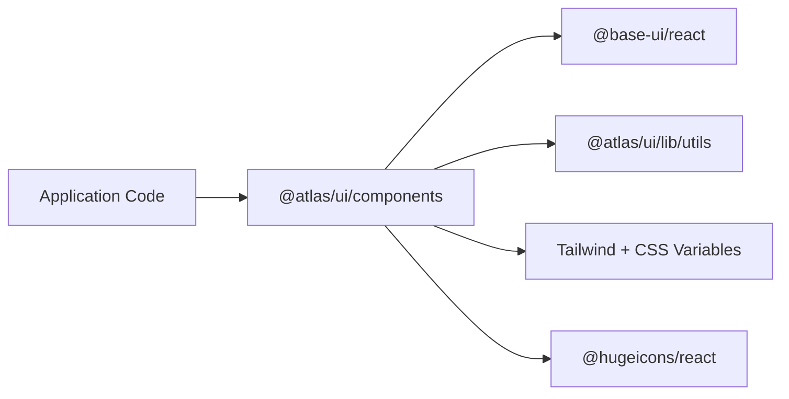
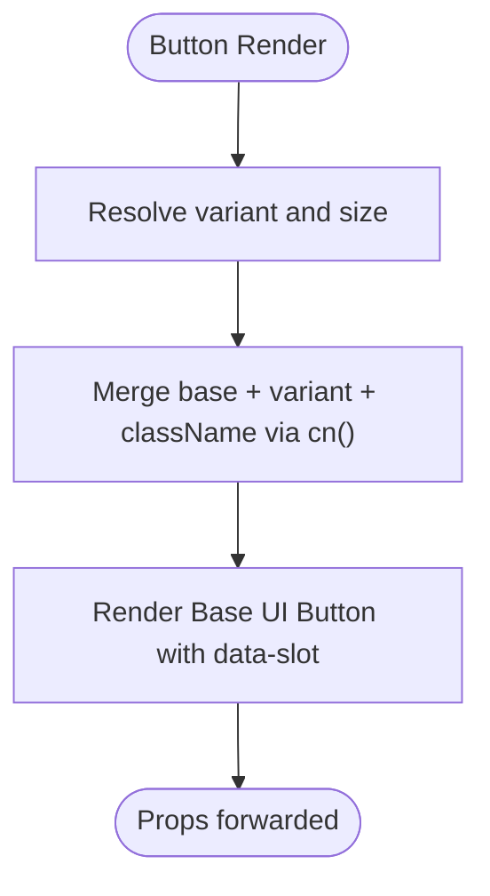
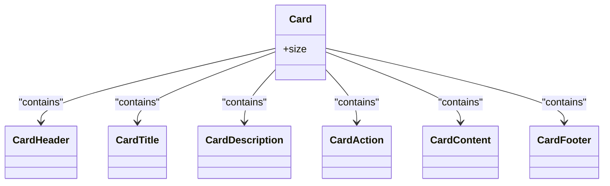
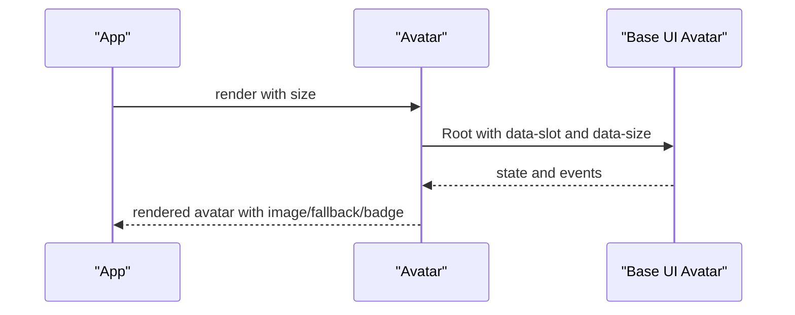
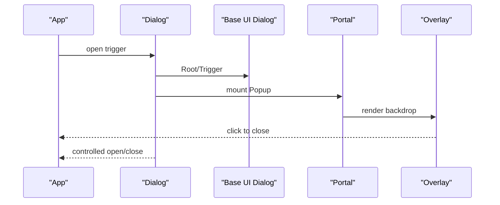
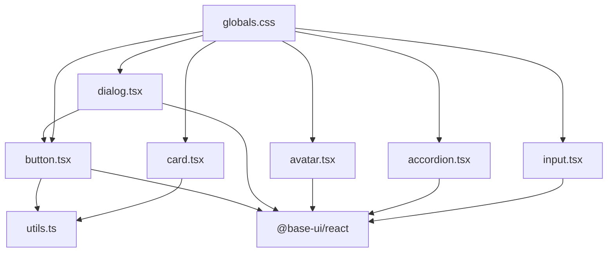

# Component Architecture

<cite>
**Referenced Files in This Document**
- [package.json](file://packages/ui/package.json)
- [components.json](file://packages/ui/components.json)
- [tsconfig.json](file://packages/ui/tsconfig.json)
- [globals.css](file://packages/ui/src/styles/globals.css)
- [utils.ts](file://packages/ui/src/lib/utils.ts)
- [button.tsx](file://packages/ui/src/components/button.tsx)
- [card.tsx](file://packages/ui/src/components/card.tsx)
- [avatar.tsx](file://packages/ui/src/components/avatar.tsx)
- [input.tsx](file://packages/ui/src/components/input.tsx)
- [dialog.tsx](file://packages/ui/src/components/dialog.tsx)
- [accordion.tsx](file://packages/ui/src/components/accordion.tsx)
- [use-mobile.ts](file://packages/ui/src/hooks/use-mobile.ts)
</cite>

## Table of Contents

1. Introduction
2. Project Structure
3. Core Components
4. Architecture Overview
5. Detailed Component Analysis
6. Dependency Analysis
7. Performance Considerations
8. Troubleshooting Guide
9. Conclusion
10. Appendices

## Introduction

This document explains the UI component architecture built on shadcn/ui primitives within the @atlas/ui package. It covers how components are composed from Base UI primitives, styled with class-variance-authority and Tailwind CSS v4, and organized for consistent exports and TypeScript definitions. It also provides guidance for creating new components, extending existing ones, client/server considerations in Next.js, performance optimizations, accessibility standards, testing, documentation, and version management in this monorepo.

## Project Structure

The @atlas/ui package is a standalone library that exposes:

- A set of composable UI components under src/components
- Shared utilities under src/lib
- Reusable hooks under src/hooks
- Global styles and theme tokens under src/styles
- Configuration for shadcn tooling and module aliases

**Diagram sources**

- [package.json:6-12](file://packages/ui/package.json#L6-L12)
- [components.json:14-20](file://packages/ui/components.json#L14-L20)
- [tsconfig.json:7-9](file://packages/ui/tsconfig.json#L7-L9)

Key organization notes:

- Exports are explicitly declared to surface components, lib utilities, hooks, and global CSS.
- shadcn configuration sets RSC mode, TSX, CSS variables, and alias mappings for consistent imports across the app.
- Path aliases enable clean imports like @atlas/ui/components/* and @atlas/ui/lib/utils.

**Section sources**

- [package.json:1-15](file://packages/ui/package.json#L1-L15)
- [components.json:1-25](file://packages/ui/components.json#L1-L25)
- [tsconfig.json:1-15](file://packages/ui/tsconfig.json#L1-L15)

## Core Components

The library follows a consistent pattern:

- Wrap Base UI primitives with a thin layer that adds data-slot attributes and styling via clsx/tailwind-merge or class-variance-authority variants.
- Export both the component and its variant function when applicable to support customization.
- Use shared utility functions for class merging and theme tokens defined in globals.css.

Examples:

- Button uses class-variance-authority to define variant and size scales, then applies them through cn().
- Card composes multiple parts (Header, Title, Description, Content, Footer, Action) using data-slot markers and responsive spacing.
- Avatar wraps Base UI primitives and adds size variants and group composition helpers.
- Input is a minimal wrapper around Base UI input with focus, disabled, and invalid states.
- Dialog composes Portal, Overlay, Popup, Header/Footer, and integrates with Button and icons.
- Accordion composes Root, Item, Trigger, and Panel with accessible animations and icon toggles.

**Section sources**

- [button.tsx:1-58](file://packages/ui/src/components/button.tsx#L1-L58)
- [card.tsx:1-92](file://packages/ui/src/components/card.tsx#L1-L92)
- [avatar.tsx:1-109](file://packages/ui/src/components/avatar.tsx#L1-L109)
- [input.tsx:1-20](file://packages/ui/src/components/input.tsx#L1-L20)
- [dialog.tsx:1-145](file://packages/ui/src/components/dialog.tsx#L1-L145)
- [accordion.tsx:1-78](file://packages/ui/src/components/accordion.tsx#L1-L78)

## Architecture Overview

The architecture centers on Base UI primitives as the source of truth for behavior and accessibility. The @atlas/ui components provide:

- Styling via Tailwind CSS v4 and CSS variables
- Variant systems via class-variance-authority where appropriate
- Composition patterns with data-slot attributes for consistent targeting
- Client-side directives where interactivity requires "use client"

**Diagram sources**

- [button.tsx:1-58](file://packages/ui/src/components/button.tsx#L1-L58)
- [dialog.tsx:1-145](file://packages/ui/src/components/dialog.tsx#L1-L145)
- [utils.ts:1-6](file://packages/ui/src/lib/utils.ts#L1-L6)
- [globals.css:1-140](file://packages/ui/src/styles/globals.css#L1-L140)

## Detailed Component Analysis

### Button

- Purpose: Primary interactive element with variant and size scales.
- Pattern: Uses cva to define variants and sizes; merges classes with cn(); forwards props to Base UI button primitive.
- Accessibility: Inherits Base UI semantics; supports focus-visible, disabled, and aria-invalid states.
- Extensibility: Exported buttonVariants allow downstream overrides or custom themes.

**Diagram sources**

- [button.tsx:5-57](file://packages/ui/src/components/button.tsx#L5-L57)

**Section sources**

- [button.tsx:1-58](file://packages/ui/src/components/button.tsx#L1-L58)

### Card

- Purpose: Container with semantic sections for content layout.
- Pattern: Multiple small components (Card, CardHeader, CardTitle, CardDescription, CardAction, CardContent, CardFooter) each with data-slot and consistent spacing via CSS variables.
- Accessibility: Semantic HTML structure; relies on proper heading hierarchy and content order.

**Diagram sources**

- [card.tsx:4-91](file://packages/ui/src/components/card.tsx#L4-L91)

**Section sources**

- [card.tsx:1-92](file://packages/ui/src/components/card.tsx#L1-L92)

### Avatar

- Purpose: User representation with image, fallback, badge, and grouping.
- Pattern: Wraps Base UI avatar primitives; adds data-size and data-slot; composes group and count elements.
- Client/Server: Marked "use client" due to interactivity/state expectations.

**Diagram sources**

- [avatar.tsx:1-109](file://packages/ui/src/components/avatar.tsx#L1-L109)

**Section sources**

- [avatar.tsx:1-109](file://packages/ui/src/components/avatar.tsx#L1-L109)

### Input

- Purpose: Text input with consistent focus, disabled, and invalid states.
- Pattern: Thin wrapper over Base UI input; uses cn() for class merging; forwards all native input props.

**Section sources**

- [input.tsx:1-20](file://packages/ui/src/components/input.tsx#L1-L20)

### Dialog

- Purpose: Accessible modal with overlay, portal, header/footer, and optional close button.
- Pattern: Composes Base UI dialog primitives; integrates Button and icons; uses data-slot for consistent styling.
- Client/Server: Marked "use client" for portal and overlay interactions.

**Diagram sources**

- [dialog.tsx:10-76](file://packages/ui/src/components/dialog.tsx#L10-L76)

**Section sources**

- [dialog.tsx:1-145](file://packages/ui/src/components/dialog.tsx#L1-L145)

### Accordion

- Purpose: Expandable sections with animated panels and accessible triggers.
- Pattern: Wraps Base UI accordion primitives; includes default icons and animation classes; uses data-slot for targeting.

**Section sources**

- [accordion.tsx:1-78](file://packages/ui/src/components/accordion.tsx#L1-L78)

### Utility: Class Merging

- Provides a stable way to merge Tailwind classes with precedence handling.
- Used by all components to ensure predictable style resolution.

**Section sources**

- [utils.ts:1-6](file://packages/ui/src/lib/utils.ts#L1-L6)

### Hook: useIsMobile

- Provides a boolean indicating whether the viewport is mobile-sized based on a breakpoint constant.
- Useful for responsive behavior in components or application logic.

**Section sources**

- [use-mobile.ts:1-21](file://packages/ui/src/hooks/use-mobile.ts#L1-L21)

## Dependency Analysis

- Internal dependencies:
  - Components depend on @atlas/ui/lib/utils for class merging.
  - Components import Base UI primitives for behavior and accessibility.
  - Some components integrate @hugeicons/react for icons.
- External dependencies:
  - Tailwind CSS v4 via @import in globals.css.
  - class-variance-authority for variant systems.
  - clsx and tailwind-merge for robust class composition.
  - date-fns, recharts, embla-carousel, etc., for specialized features.

**Diagram sources**

- [button.tsx:1-58](file://packages/ui/src/components/button.tsx#L1-L58)
- [dialog.tsx:1-145](file://packages/ui/src/components/dialog.tsx#L1-L145)
- [avatar.tsx:1-109](file://packages/ui/src/components/avatar.tsx#L1-L109)
- [accordion.tsx:1-78](file://packages/ui/src/components/accordion.tsx#L1-L78)
- [card.tsx:1-92](file://packages/ui/src/components/card.tsx#L1-L92)
- [input.tsx:1-20](file://packages/ui/src/components/input.tsx#L1-L20)
- [globals.css:1-140](file://packages/ui/src/styles/globals.css#L1-L140)

**Section sources**

- [package.json:16-38](file://packages/ui/package.json#L16-L38)
- [globals.css:1-140](file://packages/ui/src/styles/globals.css#L1-L140)

## Performance Considerations

- Prefer client-only components only when necessary; mark with "use client" to avoid unnecessary server bundle overhead.
- Use data-slot and CSS variables to minimize runtime class computation; rely on Tailwind’s compile-time optimization.
- Keep variant maps small and focused; prefer composition over deep prop drilling.
- Avoid heavy computations inside render paths; hoist static values and memoize derived data if needed.
- Leverage Base UI’s efficient event handling and focus management to reduce re-renders.
- Use the provided hook for responsive checks instead of inline window listeners in components.

[No sources needed since this section provides general guidance]

## Troubleshooting Guide

Common issues and resolutions:

- Styles not applying: Ensure globals.css is imported and Tailwind v4 is configured; verify @source directives include your app directories.
- Class conflicts: Always pass className through cn() to guarantee correct precedence with tailwind-merge.
- Interactivity errors: Confirm components requiring DOM access are marked "use client".
- Icon rendering: Verify icon libraries are installed and imported correctly; check strokeWidth and sizing classes.
- Focus and accessibility: Validate focus-visible rings and aria states; test keyboard navigation and screen reader announcements.

**Section sources**

- [globals.css:1-140](file://packages/ui/src/styles/globals.css#L1-L140)
- [utils.ts:1-6](file://packages/ui/src/lib/utils.ts#L1-L6)
- [avatar.tsx:1-109](file://packages/ui/src/components/avatar.tsx#L1-L109)
- [dialog.tsx:1-145](file://packages/ui/src/components/dialog.tsx#L1-L145)

## Conclusion

The @atlas/ui package delivers a cohesive, accessible, and extensible design system built on Base UI primitives, styled with Tailwind CSS v4 and enhanced by class-variance-authority. Its clear export map, consistent composition patterns, and strong TypeScript foundations make it straightforward to create, extend, and maintain components across the application. By following the guidelines here, teams can ensure consistency, performance, and accessibility at scale.

[No sources needed since this section summarizes without analyzing specific files]

## Appendices

### Creating a New Component

Steps:

- Create a new file under src/components with a descriptive name.
- Import Base UI primitive and utils; wrap with data-slot and consistent styling.
- Define variants with cva if the component has visual variations; export both component and variants.
- Add TypeScript types by extending primitive props and adding any additional props.
- If interactivity requires DOM access, add "use client" at the top.
- Export the component from the package exports mapping (already handled by wildcard exports).

Guidelines:

- Follow naming conventions used in existing components.
- Use data-slot consistently for styling hooks.
- Keep components small and composable; prefer composition over large prop interfaces.
- Include accessibility attributes and keyboard behaviors inherited from Base UI.

**Section sources**

- [button.tsx:1-58](file://packages/ui/src/components/button.tsx#L1-L58)
- [card.tsx:1-92](file://packages/ui/src/components/card.tsx#L1-L92)
- [avatar.tsx:1-109](file://packages/ui/src/components/avatar.tsx#L1-L109)
- [dialog.tsx:1-145](file://packages/ui/src/components/dialog.tsx#L1-L145)

### Extending Existing Components

Approaches:

- Use exported variant functions (e.g., buttonVariants) to compose new styles.
- Wrap existing components to add behavior while preserving props and slots.
- Introduce compound components (like Card parts) for flexible composition.

Best practices:

- Maintain backward compatibility by keeping default props unchanged.
- Document new props and usage examples.
- Test edge cases such as disabled, loading, and invalid states.

**Section sources**

- [button.tsx:5-57](file://packages/ui/src/components/button.tsx#L5-L57)
- [card.tsx:4-91](file://packages/ui/src/components/card.tsx#L4-L91)

### Client/Server Component Considerations

- Mark components that interact with the DOM or require browser APIs as "use client".
- Keep pure presentational components server-compatible to reduce client bundle size.
- Use hooks like useIsMobile only in client components or conditionally.

**Section sources**

- [avatar.tsx:1-109](file://packages/ui/src/components/avatar.tsx#L1-L109)
- [dialog.tsx:1-145](file://packages/ui/src/components/dialog.tsx#L1-L145)
- [use-mobile.ts:1-21](file://packages/ui/src/hooks/use-mobile.ts#L1-L21)

### Accessibility Standards

- Rely on Base UI for core accessibility (focus management, ARIA attributes, keyboard navigation).
- Ensure visible focus indicators and sufficient color contrast.
- Provide meaningful labels and descriptions; use sr-only text for icon-only buttons.
- Test with screen readers and keyboard-only navigation.

**Section sources**

- [dialog.tsx:59-73](file://packages/ui/src/components/dialog.tsx#L59-L73)
- [accordion.tsx:25-53](file://packages/ui/src/components/accordion.tsx#L25-L53)

### Testing Guidelines

- Unit tests: Verify component rendering, prop handling, and variant application.
- Interaction tests: Assert focus states, keyboard navigation, and open/close behaviors.
- Visual regression: Capture snapshots for key variants and states.
- Accessibility tests: Check ARIA attributes and keyboard flows.

[No sources needed since this section provides general guidance]

### Documentation Practices

- Document props, variants, and usage examples for each component.
- Include accessibility notes and known limitations.
- Provide code snippets demonstrating common compositions.

[No sources needed since this section provides general guidance]

### Version Management in Monorepo

- The package version is managed in package.json; update semantically for changes.
- Use workspace dependencies to keep versions aligned across apps and packages.
- Run type checks before publishing to catch breaking changes early.

**Section sources**

- [package.json:1-15](file://packages/ui/package.json#L1-L15)
