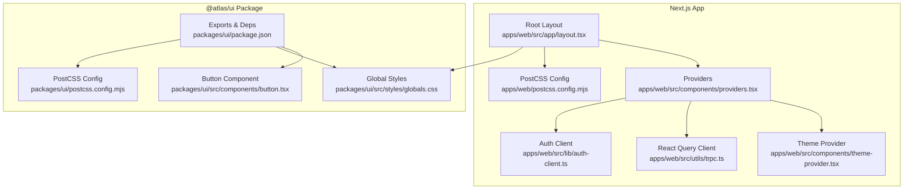
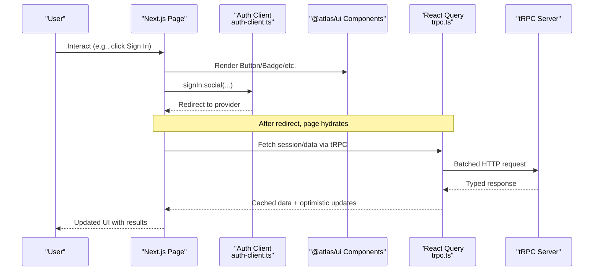
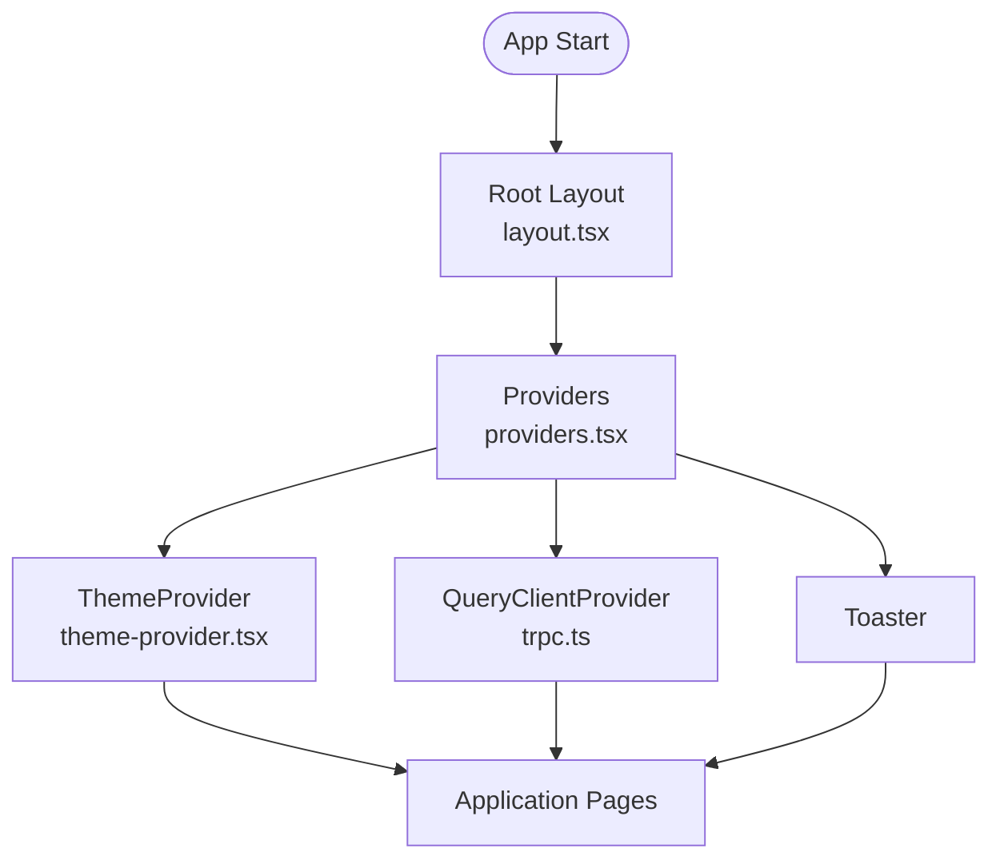
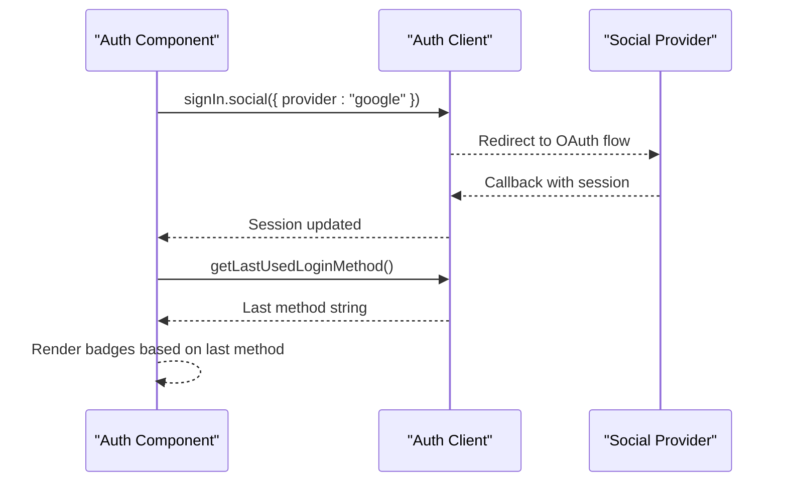
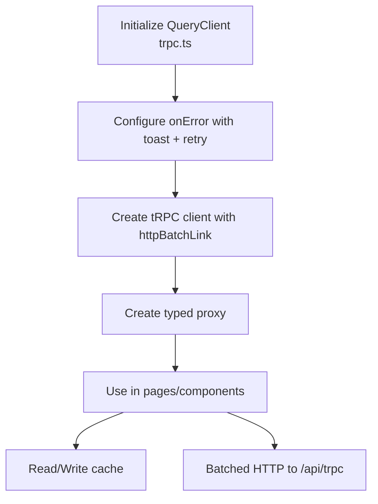
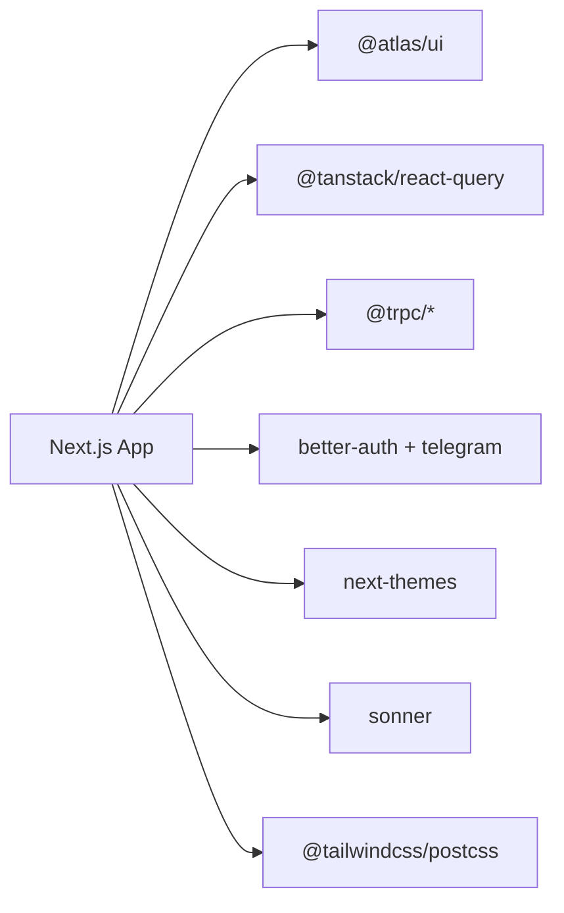

# Integration Patterns

<cite>
**Referenced Files in This Document**
- [apps/web/src/app/layout.tsx](file://apps/web/src/app/layout.tsx)
- [apps/web/src/components/providers.tsx](file://apps/web/src/components/providers.tsx)
- [apps/web/src/components/theme-provider.tsx](file://apps/web/src/components/theme-provider.tsx)
- [apps/web/postcss.config.mjs](file://apps/web/postcss.config.mjs)
- [packages/ui/package.json](file://packages/ui/package.json)
- [packages/ui/src/styles/globals.css](file://packages/ui/src/styles/globals.css)
- [packages/ui/postcss.config.mjs](file://packages/ui/postcss.config.mjs)
- [apps/web/package.json](file://apps/web/package.json)
- [apps/web/src/lib/auth-client.ts](file://apps/web/src/lib/auth-client.ts)
- [apps/web/src/components/auth.tsx](file://apps/web/src/components/auth.tsx)
- [apps/web/src/utils/trpc.ts](file://apps/web/src/utils/trpc.ts)
- [packages/ui/src/components/button.tsx](file://packages/ui/src/components/button.tsx)
</cite>

## Table of Contents

1. Introduction
2. Project Structure
3. Core Components
4. Architecture Overview
5. Detailed Component Analysis
6. Dependency Analysis
7. Performance Considerations
8. Troubleshooting Guide
9. Conclusion

## Introduction

This document explains how to integrate the @atlas/ui component library with the Next.js application and related packages. It covers provider setup, global styles configuration, PostCSS integration, importing and using components from @atlas/ui with tree-shaking, authentication provider integration, state management via React Query and tRPC, form handling patterns, composition and context usage, event handling, performance optimization, lazy loading strategies, troubleshooting, and best practices for clean imports.

## Project Structure

The Next.js app lives under apps/web and consumes a shared UI package at packages/ui. The UI package exposes:

- Global styles via a CSS entry
- Utility functions and hooks
- A rich set of accessible components built on Base UI and styled with Tailwind and shadcn primitives
- A PostCSS configuration that can be reused or extended by consumers

Key integration points:

- Root layout wires up fonts, providers, and global styles
- Providers compose ThemeProvider (next-themes), React Query client, and Toaster
- PostCSS is configured in both the app and the UI package to enable Tailwind v4 processing and source scanning
- Authentication uses better-auth with Telegram plugin; state and data fetching use React Query and tRPC

**Diagram sources**

- [apps/web/src/app/layout.tsx:1-47](file://apps/web/src/app/layout.tsx#L1-L47)
- [apps/web/src/components/providers.tsx:1-27](file://apps/web/src/components/providers.tsx#L1-L27)
- [apps/web/src/components/theme-provider.tsx:1-12](file://apps/web/src/components/theme-provider.tsx#L1-L12)
- [apps/web/postcss.config.mjs:1-6](file://apps/web/postcss.config.mjs#L1-L6)
- [packages/ui/package.json:1-48](file://packages/ui/package.json#L1-L48)
- [packages/ui/src/styles/globals.css:1-140](file://packages/ui/src/styles/globals.css#L1-L140)
- [packages/ui/postcss.config.mjs:1-6](file://packages/ui/postcss.config.mjs#L1-L6)

**Section sources**

- [apps/web/src/app/layout.tsx:1-47](file://apps/web/src/app/layout.tsx#L1-L47)
- [apps/web/src/components/providers.tsx:1-27](file://apps/web/src/components/providers.tsx#L1-L27)
- [apps/web/postcss.config.mjs:1-6](file://apps/web/postcss.config.mjs#L1-L6)
- [packages/ui/package.json:1-48](file://packages/ui/package.json#L1-L48)
- [packages/ui/src/styles/globals.css:1-140](file://packages/ui/src/styles/globals.css#L1-L140)
- [packages/ui/postcss.config.mjs:1-6](file://packages/ui/postcss.config.mjs#L1-L6)

## Core Components

- Providers: Wraps the app with ThemeProvider (class-based theming), React Query client, and Sonner Toaster. This ensures consistent theme behavior, global caching, and toast notifications across the app.
- Theme Provider: A thin wrapper around next-themes to apply class-based theming with system preference support.
- Global Styles: The UI package’s globals.css defines design tokens, dark mode variants, and base layer styles. Consumers import this once to activate Tailwind utilities and theme variables.
- PostCSS: Both the app and the UI package configure Tailwind v4 via @tailwindcss/postcss. The UI package also declares source paths so utilities used in the app are scanned during build.

Importing and using @atlas/ui components:

- Use direct barrel-style paths such as @atlas/ui/components/... to leverage tree-shaking. Avoid importing from a single index that re-exports everything unless necessary.
- Utilities like cn are available via @atlas/ui/lib/utils.
- Social icons and other specialized components live under @atlas/ui/components/socials.

Examples of typical imports:

- Button: @atlas/ui/components/button
- Badge: @atlas/ui/components/badge
- Social icons: @atlas/ui/components/socials

Tree-shaking guidance:

- Prefer specific component imports over wildcard imports
- Keep dependencies minimal in feature modules
- Avoid pulling in heavy libraries into small components

**Section sources**

- [apps/web/src/components/providers.tsx:1-27](file://apps/web/src/components/providers.tsx#L1-L27)
- [apps/web/src/components/theme-provider.tsx:1-12](file://apps/web/src/components/theme-provider.tsx#L1-L12)
- [packages/ui/src/styles/globals.css:1-140](file://packages/ui/src/styles/globals.css#L1-L140)
- [apps/web/postcss.config.mjs:1-6](file://apps/web/postcss.config.mjs#L1-L6)
- [packages/ui/postcss.config.mjs:1-6](file://packages/ui/postcss.config.mjs#L1-L6)
- [packages/ui/package.json:1-48](file://packages/ui/package.json#L1-L48)
- [apps/web/src/components/auth.tsx:1-69](file://apps/web/src/components/auth.tsx#L1-L69)

## Architecture Overview

The runtime architecture composes several layers:

- Presentation: UI components from @atlas/ui provide accessible, themed primitives
- State and Data: React Query manages server state and caching; tRPC provides type-safe client-server contracts
- Theming: next-themes drives light/dark modes via class toggling
- Notifications: Sonner Toaster renders user feedback globally
- Authentication: better-auth client integrates social sign-in flows

**Diagram sources**

- [apps/web/src/components/auth.tsx:1-69](file://apps/web/src/components/auth.tsx#L1-L69)
- [apps/web/src/lib/auth-client.ts:1-8](file://apps/web/src/lib/auth-client.ts#L1-L8)
- [apps/web/src/utils/trpc.ts:1-40](file://apps/web/src/utils/trpc.ts#L1-L40)
- [packages/ui/src/components/button.tsx:1-58](file://packages/ui/src/components/button.tsx#L1-L58)

## Detailed Component Analysis

### Provider Composition and Global Setup

- Root layout imports global styles and sets up font variables. It then wraps children with Providers.
- Providers compose ThemeProvider (class-based), QueryClientProvider (with a shared queryClient), and Toaster.
- ThemeProvider is a thin wrapper around next-themes configured for class attribute toggling and system theme detection.

**Diagram sources**

- [apps/web/src/app/layout.tsx:1-47](file://apps/web/src/app/layout.tsx#L1-L47)
- [apps/web/src/components/providers.tsx:1-27](file://apps/web/src/components/providers.tsx#L1-L27)
- [apps/web/src/components/theme-provider.tsx:1-12](file://apps/web/src/components/theme-provider.tsx#L1-L12)

**Section sources**

- [apps/web/src/app/layout.tsx:1-47](file://apps/web/src/app/layout.tsx#L1-L47)
- [apps/web/src/components/providers.tsx:1-27](file://apps/web/src/components/providers.tsx#L1-L27)
- [apps/web/src/components/theme-provider.tsx:1-12](file://apps/web/src/components/theme-provider.tsx#L1-L12)

### Global Styles and PostCSS Integration

- The UI package’s globals.css imports Tailwind v4, animations, and shadcn styles, defines CSS variables for light/dark themes, and sets base layer defaults.
- The app includes this global stylesheet once in its root layout to activate styles.
- PostCSS in the app enables Tailwind v4 processing. The UI package also ships a PostCSS config for consistency.

Best practices:

- Import the UI package’s globals.css only once at the app level
- Do not duplicate Tailwind directives; rely on the provided global
- Extend or override tokens via CSS variables if needed

**Section sources**

- [packages/ui/src/styles/globals.css:1-140](file://packages/ui/src/styles/globals.css#L1-L140)
- [apps/web/postcss.config.mjs:1-6](file://apps/web/postcss.config.mjs#L1-L6)
- [packages/ui/postcss.config.mjs:1-6](file://packages/ui/postcss.config.mjs#L1-L6)

### Using @atlas/ui Components and Tree-Shaking

- Import components directly from their file paths to maximize tree-shaking. For example, import Button and Badge individually.
- Use utility functions like cn from @atlas/ui/lib/utils for composing className strings.
- Social icons are grouped under @atlas/ui/components/socials and can be imported per need.

Example import patterns:

- Button: @atlas/ui/components/button
- Badge: @atlas/ui/components/badge
- Google icon: @atlas/ui/components/socials/google.tsx

Why this matters:

- Direct imports reduce bundle size by excluding unused components
- Keeps feature modules focused and easier to maintain

**Section sources**

- [packages/ui/package.json:1-48](file://packages/ui/package.json#L1-L48)
- [apps/web/src/components/auth.tsx:1-69](file://apps/web/src/components/auth.tsx#L1-L69)
- [packages/ui/src/components/button.tsx:1-58](file://packages/ui/src/components/button.tsx#L1-L58)

### Authentication Integration

- The auth client is created with better-auth and includes plugins for Telegram and last login method tracking.
- The Auth component uses the client to trigger social sign-ins and displays the last-used method badge.
- Event handlers call the appropriate sign-in methods and specify callback URLs.

**Diagram sources**

- [apps/web/src/lib/auth-client.ts:1-8](file://apps/web/src/lib/auth-client.ts#L1-L8)
- [apps/web/src/components/auth.tsx:1-69](file://apps/web/src/components/auth.tsx#L1-L69)

**Section sources**

- [apps/web/src/lib/auth-client.ts:1-8](file://apps/web/src/lib/auth-client.ts#L1-L8)
- [apps/web/src/components/auth.tsx:1-69](file://apps/web/src/components/auth.tsx#L1-L69)

### State Management and Data Fetching with React Query and tRPC

- A shared QueryClient is configured with error handling that shows a toast with a retry action.
- tRPC client is created with httpBatchLink pointing to /api/trpc, including credentials for cookies.
- The proxy wraps the client and queryClient for type-safe queries/mutations in components.

**Diagram sources**

- [apps/web/src/utils/trpc.ts:1-40](file://apps/web/src/utils/trpc.ts#L1-L40)

**Section sources**

- [apps/web/src/utils/trpc.ts:1-40](file://apps/web/src/utils/trpc.ts#L1-L40)

### Form Handling Patterns

- The project includes TanStack React Form as a dependency, enabling robust form validation and submission patterns.
- Recommended approach:
  - Define schemas with Zod for validation
  - Use TanStack Form hooks to manage fields, errors, and submission
  - Integrate with tRPC mutations for server-side persistence
  - Surface errors via Sonner Toaster for consistent UX

Note: Specific form implementations should follow these patterns while leveraging existing UI components for inputs, labels, and messages.

[No sources needed since this section provides general guidance]

### Context Usage and Event Handling

- Context is commonly used to share theme state via next-themes; the ThemeProvider handles setting and reading theme classes.
- Event handlers in components (e.g., sign-in buttons) call async functions that interact with the auth client and update UI state accordingly.
- Best practices:
  - Keep event handlers small and pure where possible
  - Use async patterns and loading states to prevent race conditions
  - Centralize side effects in providers or hooks when shared across components

**Section sources**

- [apps/web/src/components/theme-provider.tsx:1-12](file://apps/web/src/components/theme-provider.tsx#L1-L12)
- [apps/web/src/components/auth.tsx:1-69](file://apps/web/src/components/auth.tsx#L1-L69)

## Dependency Analysis

The app depends on:

- @atlas/ui for components, styles, and utilities
- @tanstack/react-query for state caching and synchronization
- @trpc/client and @trpc/tanstack-react-query for type-safe data fetching
- better-auth and better-auth-telegram for authentication
- next-themes for theming
- sonner for toasts
- Tailwind v4 via @tailwindcss/postcss

**Diagram sources**

- [apps/web/package.json:1-47](file://apps/web/package.json#L1-L47)
- [packages/ui/package.json:1-48](file://packages/ui/package.json#L1-L48)

**Section sources**

- [apps/web/package.json:1-47](file://apps/web/package.json#L1-L47)
- [packages/ui/package.json:1-48](file://packages/ui/package.json#L1-L48)

## Performance Considerations

- Bundle size:
  - Import components directly from @atlas/ui/components/* to enable tree-shaking
  - Avoid importing entire libraries unnecessarily
- Rendering:
  - Use React Query caching to minimize network requests
  - Debounce or throttle expensive operations where applicable
- Styles:
  - Rely on Tailwind v4’s efficient scanning and avoid duplicating directives
  - Keep global styles centralized in the UI package’s globals.css
- Hydration:
  - Ensure providers are stable and do not cause unnecessary re-renders
  - Use suppressHydrationWarning judiciously and only when required

[No sources needed since this section provides general guidance]

## Troubleshooting Guide

Common issues and resolutions:

- Styles not applied:
  - Ensure the UI package’s globals.css is imported once in the root layout
  - Verify PostCSS is configured with @tailwindcss/postcss in the app
- Theme not switching:
  - Confirm ThemeProvider is wrapping the app and using class-based attributes
  - Check that the html/body classes are set correctly
- Toasts not showing:
  - Ensure Toaster is rendered within Providers
  - Verify Sonner is installed and configured
- Auth redirects failing:
  - Check callbackURL settings and environment configuration for providers
  - Validate cookies and credentials in tRPC fetch options
- Type errors with tRPC:
  - Ensure the client and server routers are aligned and types are regenerated after changes

**Section sources**

- [apps/web/src/app/layout.tsx:1-47](file://apps/web/src/app/layout.tsx#L1-L47)
- [apps/web/postcss.config.mjs:1-6](file://apps/web/postcss.config.mjs#L1-L6)
- [apps/web/src/components/providers.tsx:1-27](file://apps/web/src/components/providers.tsx#L1-L27)
- [apps/web/src/utils/trpc.ts:1-40](file://apps/web/src/utils/trpc.ts#L1-L40)

## Conclusion

By centralizing global styles and theming, composing providers for state and notifications, and importing @atlas/ui components directly, the application achieves a clean, scalable, and performant integration. Authentication, state management, and data fetching are orchestrated through well-defined clients and providers, ensuring type safety and consistent UX. Following the recommended import patterns and PostCSS configuration will keep bundles lean and maintainable.
