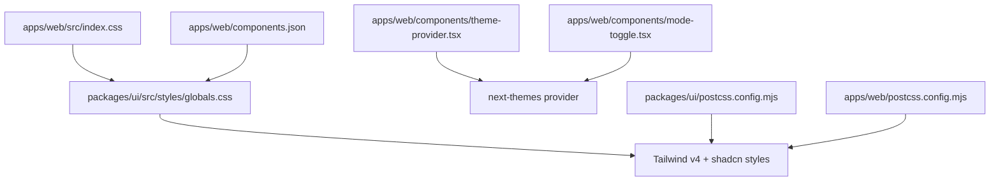
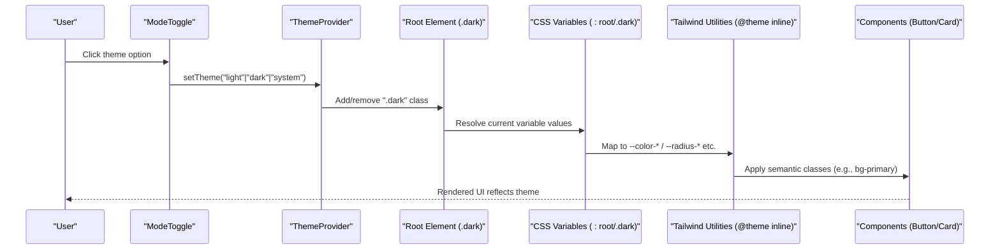
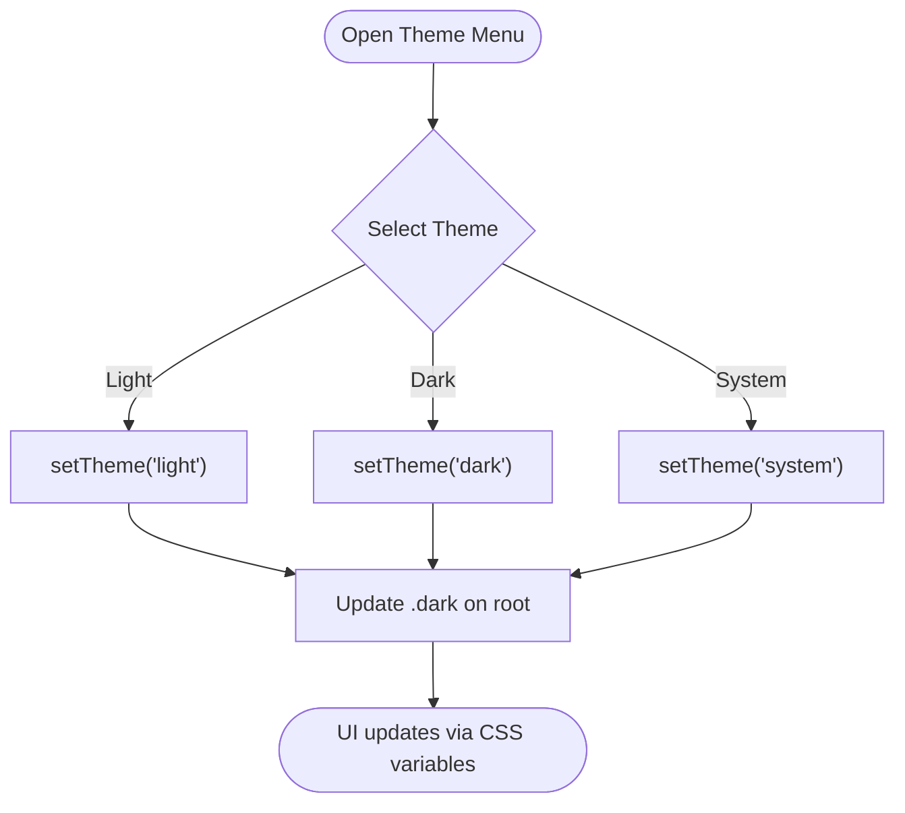
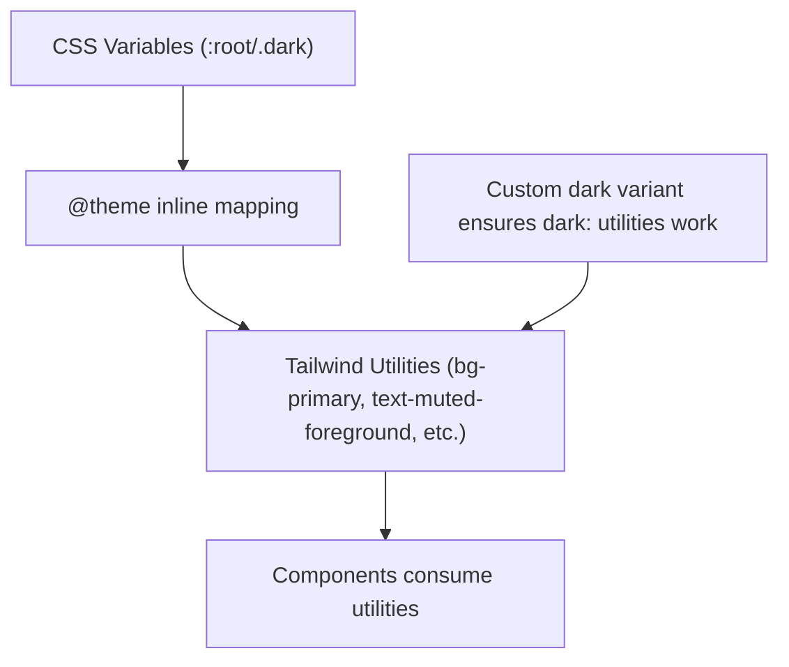
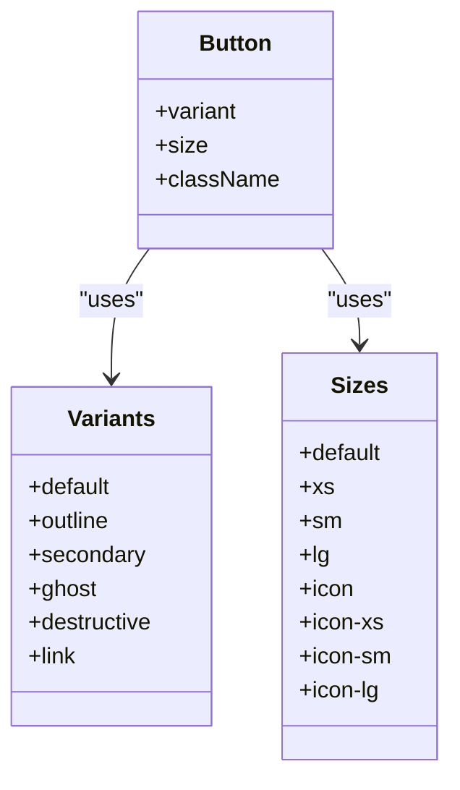
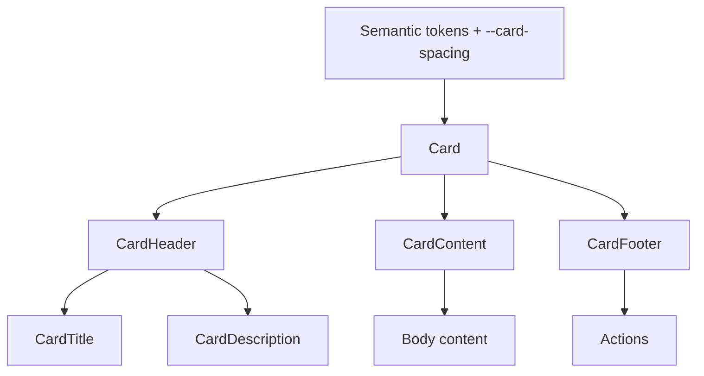
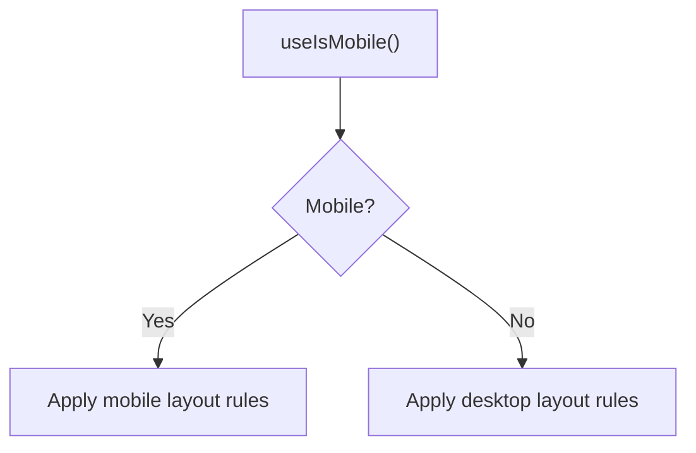
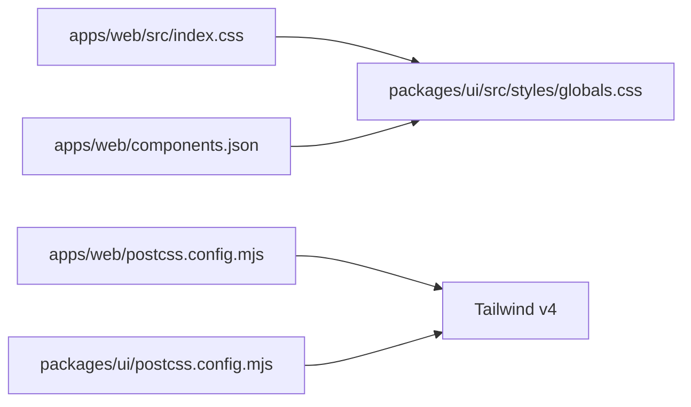

# Theming and Customization

<cite>
**Referenced Files in This Document**
- [globals.css](file://packages/ui/src/styles/globals.css)
- [theme-provider.tsx](file://apps/web/src/components/theme-provider.tsx)
- [mode-toggle.tsx](file://apps/web/src/components/mode-toggle.tsx)
- [index.css](file://apps/web/src/index.css)
- [postcss.config.mjs (UI)](file://packages/ui/postcss.config.mjs)
- [postcss.config.mjs (Web)](file://apps/web/postcss.config.mjs)
- [components.json](file://apps/web/components.json)
- [button.tsx](file://packages/ui/src/components/button.tsx)
- [card.tsx](file://packages/ui/src/components/card.tsx)
- [use-mobile.ts](file://packages/ui/src/hooks/use-mobile.ts)
- [customization.md](file://.agents/skills/shadcn/customization.md)
- [styling.md](file://.agents/skills/shadcn/rules/styling.md)
</cite>

## Table of Contents

1. Introduction
2. Project Structure
3. Core Components
4. Architecture Overview
5. Detailed Component Analysis
6. Dependency Analysis
7. Performance Considerations
8. Troubleshooting Guide
9. Conclusion
10. Appendices

## Introduction

This document explains the theming system and customization capabilities of the UI component library. It covers how themes are configured with Tailwind CSS v4, CSS custom properties, and next-themes integration; how to create custom themes and override defaults; and how dark mode is implemented. It also documents the color palette system, typography scales, spacing utilities, and design tokens, along with practical guidance for responsive design, accessibility, cross-browser compatibility, and maintaining brand consistency while allowing flexible customization.

## Project Structure

The theming system spans a few key layers:

- Global theme tokens and Tailwind mapping live in the UI package’s global stylesheet.
- The web app imports the UI globals and wires up next-themes for runtime theme switching.
- PostCSS configures Tailwind v4 processing for both packages.
- Components consume semantic tokens via Tailwind utilities and class variants.

**Diagram sources**

- [index.css:1-2](file://apps/web/src/index.css#L1-L2)
- [globals.css:1-140](file://packages/ui/src/styles/globals.css#L1-L140)
- [theme-provider.tsx:1-12](file://apps/web/src/components/theme-provider.tsx#L1-L12)
- [mode-toggle.tsx:1-37](file://apps/web/src/components/mode-toggle.tsx#L1-L37)
- [postcss.config.mjs (UI):1-6](file://packages/ui/postcss.config.mjs#L1-L6)
- [postcss.config.mjs (Web):1-6](file://apps/web/postcss.config.mjs#L1-L6)
- [components.json:1-26](file://apps/web/components.json#L1-L26)

**Section sources**

- [index.css:1-2](file://apps/web/src/index.css#L1-L2)
- [globals.css:1-140](file://packages/ui/src/styles/globals.css#L1-L140)
- [postcss.config.mjs (UI):1-6](file://packages/ui/postcss.config.mjs#L1-L6)
- [postcss.config.mjs (Web):1-6](file://apps/web/postcss.config.mjs#L1-L6)
- [components.json:1-26](file://apps/web/components.json#L1-L26)

## Core Components

- Theme provider: A thin wrapper around next-themes that enables class-based theme toggling across the app.
- Mode toggle: A user-facing control to switch between light, dark, and system themes using next-themes hooks.
- Global theme tokens: Centralized CSS variables define light and dark palettes, mapped into Tailwind utilities via @theme inline.
- Components: Built with class-variance-authority and semantic tokens so they adapt automatically to theme changes.

Key responsibilities:

- Provide runtime theme context (next-themes).
- Expose a simple UI to change themes.
- Define and map design tokens to utility classes.
- Compose components that consume tokens consistently.

**Section sources**

- [theme-provider.tsx:1-12](file://apps/web/src/components/theme-provider.tsx#L1-L12)
- [mode-toggle.tsx:1-37](file://apps/web/src/components/mode-toggle.tsx#L1-L37)
- [globals.css:1-140](file://packages/ui/src/styles/globals.css#L1-L140)
- [button.tsx:1-58](file://packages/ui/src/components/button.tsx#L1-L58)
- [card.tsx:1-92](file://packages/ui/src/components/card.tsx#L1-L92)

## Architecture Overview

The theming pipeline connects CSS variables to Tailwind utilities and then to components:

**Diagram sources**

- [mode-toggle.tsx:13-33](file://apps/web/src/components/mode-toggle.tsx#L13-L33)
- [theme-provider.tsx:6-11](file://apps/web/src/components/theme-provider.tsx#L6-L11)
- [globals.css:9-119](file://packages/ui/src/styles/globals.css#L9-L119)
- [button.tsx:5-39](file://packages/ui/src/components/button.tsx#L5-L39)
- [card.tsx:4-17](file://packages/ui/src/components/card.tsx#L4-L17)

## Detailed Component Analysis

### Theme Provider and Mode Toggle

- ThemeProvider wraps the application with next-themes, enabling class-based theme toggling.
- ModeToggle uses useTheme to call setTheme and exposes Light, Dark, System options.
- Accessibility: includes screen-reader-only text for the toggle button.

**Diagram sources**

- [mode-toggle.tsx:13-33](file://apps/web/src/components/mode-toggle.tsx#L13-L33)
- [theme-provider.tsx:6-11](file://apps/web/src/components/theme-provider.tsx#L6-L11)

**Section sources**

- [theme-provider.tsx:1-12](file://apps/web/src/components/theme-provider.tsx#L1-L12)
- [mode-toggle.tsx:1-37](file://apps/web/src/components/mode-toggle.tsx#L1-L37)

### Global Theme Tokens and Tailwind Mapping

- CSS variables define light and dark palettes under :root and .dark.
- @theme inline maps these variables to Tailwind tokens such as colors and radii.
- A custom dark variant is registered for Tailwind v4.
- Base layer sets default font and border behavior.

**Diagram sources**

- [globals.css:7-119](file://packages/ui/src/styles/globals.css#L7-L119)

**Section sources**

- [globals.css:1-140](file://packages/ui/src/styles/globals.css#L1-L140)

### Button Component Variants and Semantic Styling

- Uses class-variance-authority to define variants (default, outline, secondary, ghost, destructive, link) and sizes.
- All visual states rely on semantic tokens (e.g., bg-primary, text-primary-foreground), ensuring automatic theme support.
- Focus and invalid states leverage ring and destructive tokens for consistent accessibility cues.

**Diagram sources**

- [button.tsx:5-39](file://packages/ui/src/components/button.tsx#L5-L39)
- [button.tsx:42-57](file://packages/ui/src/components/button.tsx#L42-L57)

**Section sources**

- [button.tsx:1-58](file://packages/ui/src/components/button.tsx#L1-L58)

### Card Component Spacing and Token Usage

- Uses a CSS custom property for internal spacing (--card-spacing) to keep layout consistent and theme-aware.
- Applies semantic tokens for background and text colors.
- Provides sub-components (Header, Title, Description, Content, Footer) with consistent token usage.

**Diagram sources**

- [card.tsx:4-17](file://packages/ui/src/components/card.tsx#L4-L17)
- [card.tsx:20-81](file://packages/ui/src/components/card.tsx#L20-L81)

**Section sources**

- [card.tsx:1-92](file://packages/ui/src/components/card.tsx#L1-L92)

### Responsive Design Patterns

- A mobile breakpoint hook is available for conditional logic based on viewport width.
- Use Tailwind responsive utilities alongside semantic tokens for consistent behavior across breakpoints.

**Diagram sources**

- [use-mobile.ts:1-20](file://packages/ui/src/hooks/use-mobile.ts#L1-L20)

**Section sources**

- [use-mobile.ts:1-20](file://packages/ui/src/hooks/use-mobile.ts#L1-L20)

## Dependency Analysis

- The web app imports the UI globals to activate the theme tokens and Tailwind setup.
- PostCSS plugins enable Tailwind v4 processing in both the UI package and the web app.
- The components.json points to the shared globals file, ensuring consistent configuration across generated or customized components.

**Diagram sources**

- [index.css:1-2](file://apps/web/src/index.css#L1-L2)
- [postcss.config.mjs (Web):1-6](file://apps/web/postcss.config.mjs#L1-L6)
- [postcss.config.mjs (UI):1-6](file://packages/ui/postcss.config.mjs#L1-L6)
- [components.json:1-26](file://apps/web/components.json#L1-L26)

**Section sources**

- [index.css:1-2](file://apps/web/src/index.css#L1-L2)
- [postcss.config.mjs (Web):1-6](file://apps/web/postcss.config.mjs#L1-L6)
- [postcss.config.mjs (UI):1-6](file://packages/ui/postcss.config.mjs#L1-L6)
- [components.json:1-26](file://apps/web/components.json#L1-L26)

## Performance Considerations

- Prefer semantic tokens over ad-hoc color overrides to minimize style recalculation and ensure consistent rendering across themes.
- Use built-in component variants before applying className overrides to reduce redundant CSS.
- Keep theme variables centralized to avoid duplication and improve maintainability.
- Avoid heavy custom animations; prefer provided utilities for performance and consistency.

[No sources needed since this section provides general guidance]

## Troubleshooting Guide

- Theme not applying: Ensure the root element receives the .dark class when switching themes and that next-themes is properly wrapped around your app.
- Colors not updating: Verify that your components use semantic tokens (e.g., bg-primary) rather than hardcoded colors.
- Dark mode inconsistencies: Confirm that CSS variables are defined for both :root and .dark and that @theme inline maps them correctly.
- Build-time errors: Check PostCSS configuration to ensure Tailwind v4 plugin is active in both packages.

**Section sources**

- [theme-provider.tsx:1-12](file://apps/web/src/components/theme-provider.tsx#L1-L12)
- [mode-toggle.tsx:1-37](file://apps/web/src/components/mode-toggle.tsx#L1-L37)
- [globals.css:7-119](file://packages/ui/src/styles/globals.css#L7-L119)
- [postcss.config.mjs (Web):1-6](file://apps/web/postcss.config.mjs#L1-L6)
- [postcss.config.mjs (UI):1-6](file://packages/ui/postcss.config.mjs#L1-L6)

## Conclusion

The theming system leverages CSS custom properties, Tailwind v4 utilities, and next-themes to deliver a robust, accessible, and brandable design system. By centralizing tokens, using semantic utilities, and relying on component variants, you can maintain consistency while enabling flexible customization. Follow the guidelines below to extend themes safely and effectively.

[No sources needed since this section summarizes without analyzing specific files]

## Appendices

### Color Palette System and Design Tokens

- Semantic color tokens follow a name and name-foreground convention for backgrounds and foregrounds.
- Additional tokens include card, popover, muted, accent, destructive, border, input, ring, chart series, and sidebar-specific tokens.
- Radii tokens derive from a base radius variable to provide consistent rounded corners across components.

Guidance:

- Extend the palette by adding new CSS variables and mapping them via @theme inline.
- Use semantic tokens in components to ensure automatic light/dark support.

**Section sources**

- [globals.css:9-119](file://packages/ui/src/styles/globals.css#L9-L119)
- [customization.md:26-46](file://.agents/skills/shadcn/customization.md#L26-L46)

### Typography Scales

- Headings and body text use font tokens mapped to CSS variables, ensuring consistent type scale across themes.
- Prefer heading tokens for titles and standard tokens for body text to maintain hierarchy.

**Section sources**

- [globals.css:78-119](file://packages/ui/src/styles/globals.css#L78-L119)
- [card.tsx:31-39](file://packages/ui/src/components/card.tsx#L31-L39)

### Spacing Utilities

- Internal spacing uses CSS variables (e.g., --card-spacing) to keep layouts cohesive and theme-aware.
- Prefer gap utilities for flex/grid spacing instead of legacy spacing utilities.

**Section sources**

- [card.tsx:4-17](file://packages/ui/src/components/card.tsx#L4-L17)
- [styling.md:110-120](file://.agents/skills/shadcn/rules/styling.md#L110-L120)

### Creating Custom Themes and Overriding Defaults

- Add new CSS variables under :root and .dark for light and dark modes.
- Register new tokens in @theme inline so Tailwind utilities can consume them.
- For presets or full theme swaps, use the documented CLI commands referenced in the skills documentation.

**Section sources**

- [customization.md:64-109](file://.agents/skills/shadcn/customization.md#L64-L109)
- [globals.css:7-119](file://packages/ui/src/styles/globals.css#L7-L119)

### Implementing Dark Mode Support

- next-themes manages the .dark class on the root element.
- Components should rely on semantic tokens; avoid manual dark: color overrides.
- Use the mode toggle to let users switch themes seamlessly.

**Section sources**

- [theme-provider.tsx:1-12](file://apps/web/src/components/theme-provider.tsx#L1-L12)
- [mode-toggle.tsx:13-33](file://apps/web/src/components/mode-toggle.tsx#L13-L33)
- [styling.md:136-139](file://.agents/skills/shadcn/rules/styling.md#L136-L139)

### Component Customization Best Practices

- Prefer built-in variants (e.g., Button variants) before applying className overrides.
- Use className for layout only; adjust appearance via semantic tokens or component props.
- Merge classes with the project’s cn utility for predictable results.

**Section sources**

- [styling.md:64-107](file://.agents/skills/shadcn/rules/styling.md#L64-L107)
- [styling.md:142-150](file://.agents/skills/shadcn/rules/styling.md#L142-L150)
- [button.tsx:5-39](file://packages/ui/src/components/button.tsx#L5-L39)

### Accessibility Considerations

- Ensure focus rings use semantic ring tokens for visibility across themes.
- Include accessible labels and roles (e.g., sr-only text for icon-only controls).
- Validate contrast ratios when introducing custom tokens.

**Section sources**

- [globals.css:121-139](file://packages/ui/src/styles/globals.css#L121-L139)
- [mode-toggle.tsx:18-22](file://apps/web/src/components/mode-toggle.tsx#L18-L22)

### Cross-Browser Compatibility

- Scrollbar styling is handled globally to ensure consistent behavior across browsers.
- Use modern CSS features supported by target browsers; test theme switching in multiple environments.

**Section sources**

- [globals.css:121-139](file://packages/ui/src/styles/globals.css#L121-L139)
