# UI Component Library

<cite>
**Referenced Files in This Document**
- [README.md](file://README.md)
- [package.json](file://packages/ui/package.json)
- [components.json (UI package)](file://packages/ui/components.json)
- [components.json (web app)](file://apps/web/components.json)
- [globals.css](file://packages/ui/src/styles/globals.css)
- [utils.ts](file://packages/ui/src/lib/utils.ts)
- [theme-provider.tsx](file://apps/web/src/components/theme-provider.tsx)
- [button.tsx](file://packages/ui/src/components/button.tsx)
- [card.tsx](file://packages/ui/src/components/card.tsx)
- [dialog.tsx](file://packages/ui/src/components/dialog.tsx)
- [input.tsx](file://packages/ui/src/components/input.tsx)
- [label.tsx](file://packages/ui/src/components/label.tsx)
- [use-mobile.ts](file://packages/ui/src/hooks/use-mobile.ts)
- [SKILL.md (shadcn)](file://.agents/skills/shadcn/SKILL.md)
- [customization.md (shadcn)](file://.agents/skills/shadcn/customization.md)
- [composition.md (shadcn)](file://.agents/skills/shadcn/rules/composition.md)
- [agent-code.tsx](file://packages/ui/src/components/agents/agent-code.tsx)
- [agent-disclosure.tsx](file://packages/ui/src/components/agents/agent-disclosure.tsx)
- [citations.tsx](file://packages/ui/src/components/agents/citations.tsx)
- [file-diff.tsx](file://packages/ui/src/components/agents/file-diff.tsx)
- [image-generation.tsx](file://packages/ui/src/components/agents/image-generation.tsx)
- [conversation.tsx](file://packages/ui/src/components/ai-elements/conversation.tsx)
- [message.tsx](file://packages/ui/src/components/ai-elements/message.tsx)
- [prompt-input.tsx](file://packages/ui/src/components/ai-elements/prompt-input.tsx)
- [reasoning.tsx](file://packages/ui/src/components/ai-elements/reasoning.tsx)
- [motion-button-index.tsx](file://packages/ui/src/components/motion/button/index.tsx)
</cite>

## Update Summary

**Changes Made**

- Added comprehensive AI agent UI component system documentation covering 98 new files
- Documented agent-specific components (agent-code, agent-disclosure, citations, file-diff, image-generation)
- Documented AI elements framework (conversation, message, prompt-input, reasoning)
- Documented motion/animation utilities and button variants
- Updated architecture diagrams to reflect new component structure
- Enhanced customization guidelines for AI-powered applications

## Table of Contents

1. [Introduction](#introduction)
2. [Project Structure](#project-structure)
3. [Core Components](#core-components)
4. [AI Agent Components](#ai-agent-components)
5. [AI Elements Framework](#ai-elements-framework)
6. [Motion and Animation System](#motion-and-animation-system)
7. [Architecture Overview](#architecture-overview)
8. [Detailed Component Analysis](#detailed-component-analysis)
9. [Dependency Analysis](#dependency-analysis)
10. [Performance Considerations](#performance-considerations)
11. [Troubleshooting Guide](#troubleshooting-guide)
12. [Conclusion](#conclusion)
13. [Appendices](#appendices)

## Introduction

This document describes the shared UI component library built on shadcn/ui primitives and Base UI, published from the packages/ui workspace and consumed by the Next.js application in apps/web. The library has been significantly expanded with a comprehensive AI agent UI component system including agent-specific components, AI elements framework, and motion/animation utilities. It explains the architecture, customization approach, theming with Tailwind CSS v4, integration patterns for client/server components, accessibility, responsive design, performance considerations, testing guidelines, documentation standards, and version management within the monorepo.

The library now provides a consistent design system using CSS variables, utility classes, and compound component patterns, specifically designed for AI-powered applications with advanced features like code highlighting, streaming responses, citation management, and interactive media generation.

**Section sources**

- [README.md:48-68](file://README.md#L48-L68)

## Project Structure

The UI library lives in packages/ui and exposes:

- Components under src/components organized into core, agents, ai-elements, motion, and socials directories
- Hooks under src/hooks
- Utilities under src/lib
- Global styles and theme tokens under src/styles

The Next.js app configures shadcn via apps/web/components.json, pointing to the shared UI package and its styles. The UI package also has its own components.json for adding or updating primitives directly in the shared layer.

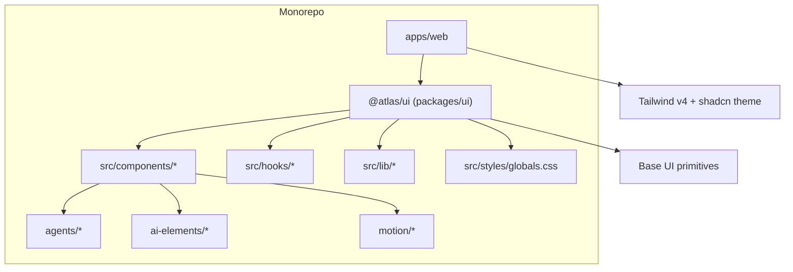

**Diagram sources**

- [components.json (web app):1-26](file://apps/web/components.json#L1-L26)
- [components.json (UI package):1-26](file://packages/ui/components.json#L1-L26)
- [globals.css:1-6](file://packages/ui/src/styles/globals.css#L1-L6)

**Section sources**

- [README.md:79-94](file://README.md#L79-L94)
- [components.json (web app):1-26](file://apps/web/components.json#L1-L26)
- [components.json (UI package):1-26](file://packages/ui/components.json#L1-L26)

## Core Components

Key building blocks include Button, Card, Dialog, Input, Label, and supporting utilities. They follow consistent patterns:

- Use class-variance-authority for variants and sizes
- Merge className with cn utility for predictable styling
- Wrap Base UI primitives with data-slot attributes for stable targeting
- Compose compound components where appropriate (e.g., Card parts)

Examples:

- Button: variant and size variants, focus-visible states, disabled states, icon sizing
- Card: header/content/footer/title/description/action parts with spacing tokens
- Dialog: portal, overlay, content, header/footer, title, description; accessible close button
- Input: focus ring, invalid state, placeholder styling, dark mode support
- Label: accessible label styling with peer-disabled behavior

**Section sources**

- [button.tsx:1-58](file://packages/ui/src/components/button.tsx#L1-L58)
- [card.tsx:1-92](file://packages/ui/src/components/card.tsx#L1-L92)
- [dialog.tsx:1-145](file://packages/ui/src/components/dialog.tsx#L1-L145)
- [input.tsx:1-20](file://packages/ui/src/components/input.tsx#L1-L20)
- [label.tsx:1-19](file://packages/ui/src/components/label.tsx#L1-L19)

## AI Agent Components

The AI agent component system provides specialized components for AI-powered applications with advanced features for code display, file comparisons, citations, and media generation.

### Agent Code Component

The AgentCode component provides syntax-highlighted code display with language support for bash, diff, json, text, tsx, and typescript. It uses Shiki for syntax highlighting with GitHub themes and includes token caching for performance optimization.

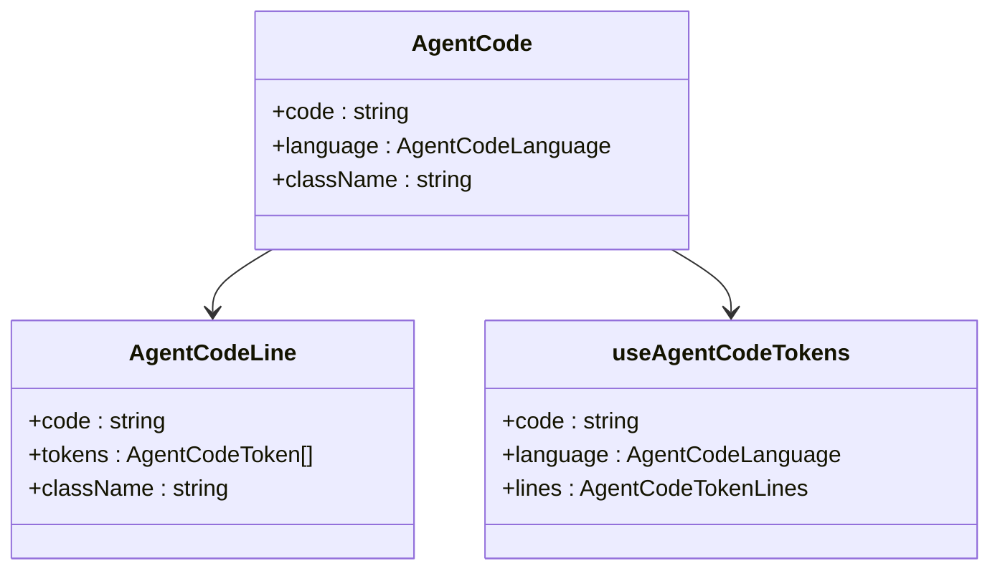

**Diagram sources**

- [agent-code.tsx:24-28](file://packages/ui/src/components/agents/agent-code.tsx#L24-L28)
- [agent-code.tsx:30-34](file://packages/ui/src/components/agents/agent-code.tsx#L30-L34)
- [agent-code.tsx:55-104](file://packages/ui/src/components/agents/agent-code.tsx#L55-L104)

### Agent Disclosure Component

The AgentDisclosure component provides animated disclosure functionality for collapsible agent content with smooth transitions and accessibility support. It respects reduced motion preferences and provides clip-path animations.

### Citations Component

The Citations component manages source citations with favicon display, stack visualization, and expandable lists. It includes automatic favicon fetching, domain display, and external link handling.

### File Diff Component

The FileDiff component displays file changes with syntax highlighting, line-by-line comparison, and status indicators. It supports streaming updates, copy functionality, and auto-collapsing on completion.

### Image Generation Component

The ImageGeneration component handles AI-generated image workflows with status tracking, dither field animations, and interactive previews. It supports multiple statuses (queued, generating, refining, complete, error) with visual feedback.

**Section sources**

- [agent-code.tsx:1-161](file://packages/ui/src/components/agents/agent-code.tsx#L1-L161)
- [agent-disclosure.tsx:1-58](file://packages/ui/src/components/agents/agent-disclosure.tsx#L1-L58)
- [citations.tsx:1-279](file://packages/ui/src/components/agents/citations.tsx#L1-L279)
- [file-diff.tsx:1-292](file://packages/ui/src/components/agents/file-diff.tsx#L1-L292)
- [image-generation.tsx:1-389](file://packages/ui/src/components/agents/image-generation.tsx#L1-L389)

## AI Elements Framework

The AI elements framework provides high-level components for building conversational AI interfaces with advanced features for message handling, conversation management, and user input.

### Conversation Component

The Conversation component provides a scrollable conversation container with stick-to-bottom behavior, empty states, and download functionality. It integrates with the AI SDK's UIMessage type for seamless data flow.

### Message Component

The Message component offers a comprehensive messaging interface with branching conversations, action buttons, and rich content rendering through Streamdown. It supports multiple message branches with navigation controls.

### Prompt Input Component

The PromptInput component is a sophisticated input system with file attachments, screenshot capture, drag-and-drop support, and validation. It includes a provider pattern for global state management and extensive customization options.

### Reasoning Component

The Reasoning component provides collapsible thinking/reasoning sections with streaming support, auto-open/close behavior, and duration tracking. It integrates with Streamdown for rich content rendering.

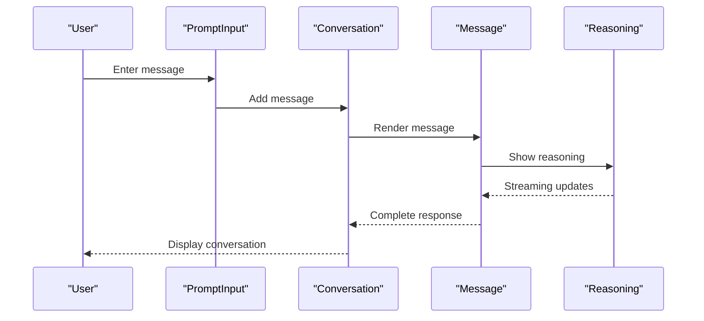

**Diagram sources**

- [conversation.tsx:13-21](file://packages/ui/src/components/ai-elements/conversation.tsx#L13-L21)
- [message.tsx:37-46](file://packages/ui/src/components/ai-elements/message.tsx#L37-L46)
- [reasoning.tsx:58-149](file://packages/ui/src/components/ai-elements/reasoning.tsx#L58-L149)
- [prompt-input.tsx:518-530](file://packages/ui/src/components/ai-elements/prompt-input.tsx#L518-L530)

**Section sources**

- [conversation.tsx:1-169](file://packages/ui/src/components/ai-elements/conversation.tsx#L1-L169)
- [message.tsx:1-367](file://packages/ui/src/components/ai-elements/message.tsx#L1-L367)
- [prompt-input.tsx:1-800](file://packages/ui/src/components/ai-elements/prompt-input.tsx#L1-L800)
- [reasoning.tsx:1-233](file://packages/ui/src/components/ai-elements/reasoning.tsx#L1-L233)

## Motion and Animation System

The motion system provides reusable animation components and utilities built on motion/react for enhanced user interactions and visual feedback.

### Motion Button Components

The motion button system includes base buttons, magnetic effects, and stateful variants with spring animations and hover effects.

### Animation Utilities

The system includes various animation components for checkboxes, inputs, selects, popovers, and progress indicators with consistent easing and timing functions.

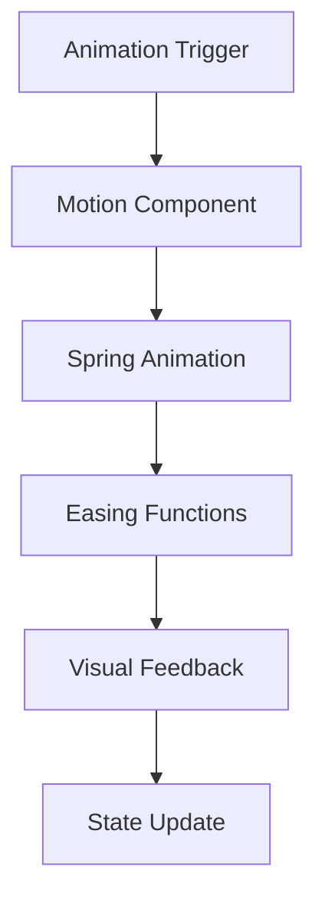

**Diagram sources**

- [motion-button-index.tsx:1-12](file://packages/ui/src/components/motion/button/index.tsx#L1-L12)

**Section sources**

- [motion-button-index.tsx:1-12](file://packages/ui/src/components/motion/button/index.tsx#L1-L12)

## Architecture Overview

The UI library composes Base UI primitives with shadcn-style theming and Tailwind CSS v4. Theme tokens are defined as CSS variables and mapped into Tailwind's theme via @theme inline. Dark mode is handled through a .dark class toggled by next-themes in the web app.

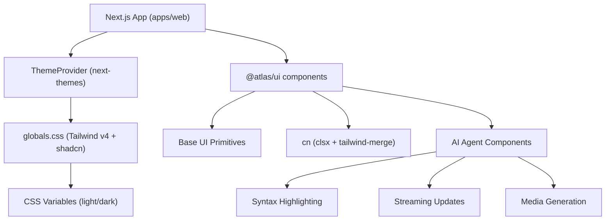

**Diagram sources**

- [theme-provider.tsx:1-12](file://apps/web/src/components/theme-provider.tsx#L1-L12)
- [globals.css:1-119](file://packages/ui/src/styles/globals.css#L1-L119)
- [utils.ts:1-6](file://packages/ui/src/lib/utils.ts#L1-L6)
- [agent-code.tsx:41-49](file://packages/ui/src/components/agents/agent-code.tsx#L41-L49)

**Section sources**

- [globals.css:1-119](file://packages/ui/src/styles/globals.css#L1-L119)
- [theme-provider.tsx:1-12](file://apps/web/src/components/theme-provider.tsx#L1-L12)

## Detailed Component Analysis

### Button

- Purpose: Primary action element with variants and sizes
- Styling: Uses cva for variant/size combinations; merges with cn
- Accessibility: Focus-visible rings, aria-invalid handling, disabled states
- Composition: Works with icons and can be used inside groups

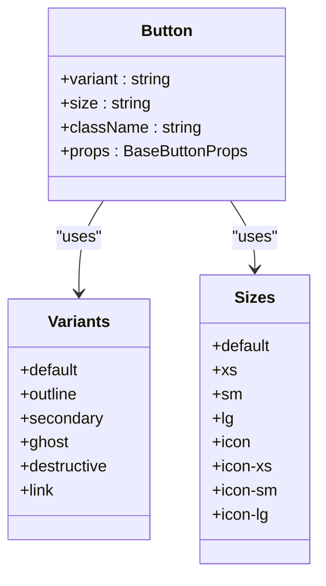

**Diagram sources**

- [button.tsx:5-40](file://packages/ui/src/components/button.tsx#L5-L40)
- [button.tsx:42-57](file://packages/ui/src/components/button.tsx#L42-L57)

**Section sources**

- [button.tsx:1-58](file://packages/ui/src/components/button.tsx#L1-L58)

### Card

- Purpose: Content container with structured parts
- Composition: CardHeader, CardTitle, CardDescription, CardContent, CardAction, CardFooter
- Styling: Spacing via CSS variable token; responsive image border radius; subtle shadow and ring

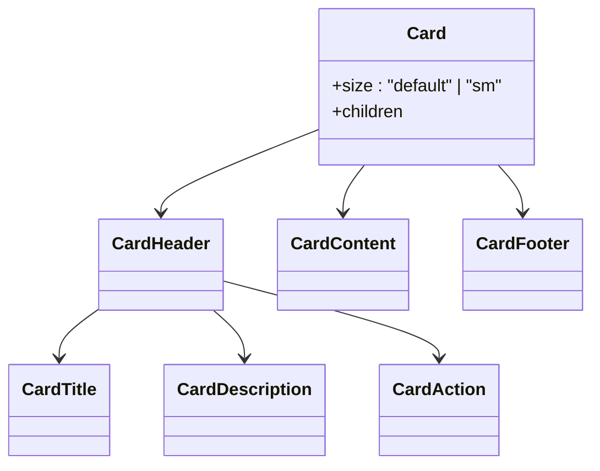

**Diagram sources**

- [card.tsx:4-18](file://packages/ui/src/components/card.tsx#L4-L18)
- [card.tsx:20-81](file://packages/ui/src/components/card.tsx#L20-L81)

**Section sources**

- [card.tsx:1-92](file://packages/ui/src/components/card.tsx#L1-L92)

### Dialog

- Purpose: Accessible modal overlay with portal and optional close button
- Client-side: Marked "use client" due to portal and interactive elements
- Accessibility: Title and description required; keyboard navigation handled by primitive
- Styling: Fade and zoom animations; responsive max-width; backdrop blur support

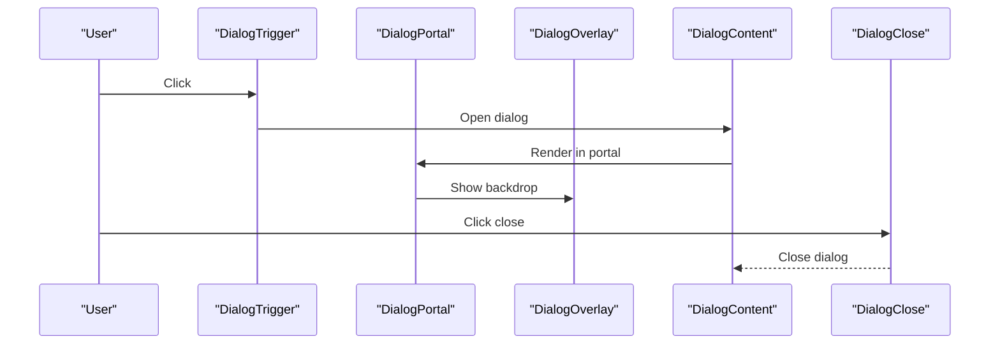

**Diagram sources**

- [dialog.tsx:10-24](file://packages/ui/src/components/dialog.tsx#L10-L24)
- [dialog.tsx:26-76](file://packages/ui/src/components/dialog.tsx#L26-L76)
- [dialog.tsx:78-131](file://packages/ui/src/components/dialog.tsx#L78-L131)

**Section sources**

- [dialog.tsx:1-145](file://packages/ui/src/components/dialog.tsx#L1-L145)

### Input and Label

- Input: Styled text input with focus ring, invalid state, and dark mode support
- Label: Accessible label with disabled and peer behaviors

```mermaid
flowchart TD
Start(["Render Input"]) --> ApplyClasses["Apply base classes + focus/invalid states"]
ApplyClasses --> MergeClass["Merge user className via cn"]
MergeClass --> End(["Render <input>"])
```

**Diagram sources**

- [input.tsx:5-17](file://packages/ui/src/components/input.tsx#L5-L17)
- [utils.ts:1-6](file://packages/ui/src/lib/utils.ts#L1-L6)

**Section sources**

- [input.tsx:1-20](file://packages/ui/src/components/input.tsx#L1-L20)
- [label.tsx:1-19](file://packages/ui/src/components/label.tsx#L1-L19)

### Theming and Customization

- Theme tokens: Defined as CSS variables for light and dark modes
- Tailwind mapping: Mapped via @theme inline to expose semantic color tokens
- Adding colors: Extend variables and register in @theme inline
- Dark mode: Toggle via next-themes with attribute="class"

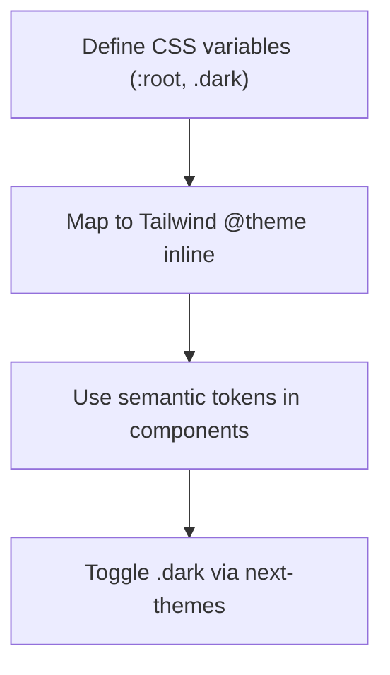

**Diagram sources**

- [globals.css:9-76](file://packages/ui/src/styles/globals.css#L9-L76)
- [globals.css:78-119](file://packages/ui/src/styles/globals.css#L78-L119)
- [theme-provider.tsx:1-12](file://apps/web/src/components/theme-provider.tsx#L1-L12)

**Section sources**

- [globals.css:1-119](file://packages/ui/src/styles/globals.css#L1-L119)
- [customization.md:50-109](file://.agents/skills/shadcn/customization.md#L50-L109)

### Responsive Design Patterns

- Mobile breakpoint hook: useIsMobile uses matchMedia to detect mobile viewport
- Usage: Conditionally render or adjust layout based on screen size

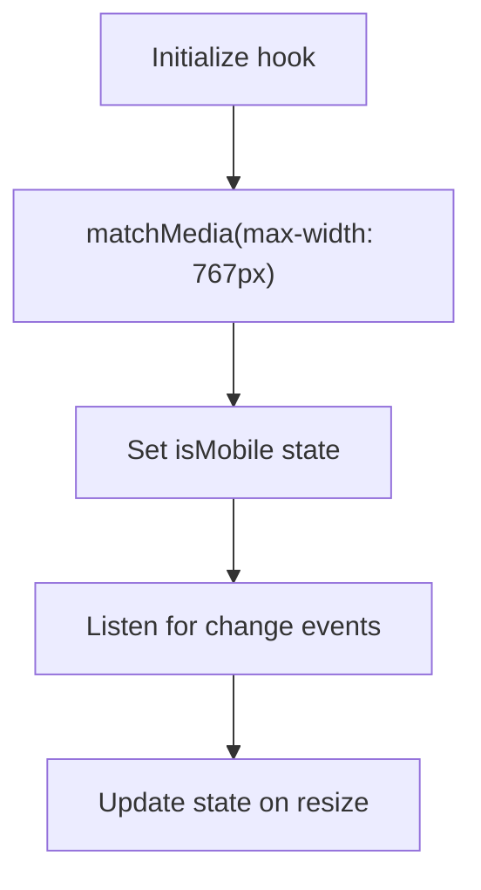

**Diagram sources**

- [use-mobile.ts:1-20](file://packages/ui/src/hooks/use-mobile.ts#L1-L20)

**Section sources**

- [use-mobile.ts:1-20](file://packages/ui/src/hooks/use-mobile.ts#L1-L20)

## Dependency Analysis

The UI package depends on Base UI primitives, animation utilities, and styling helpers. The Next.js app consumes these components via aliases configured in components.json.

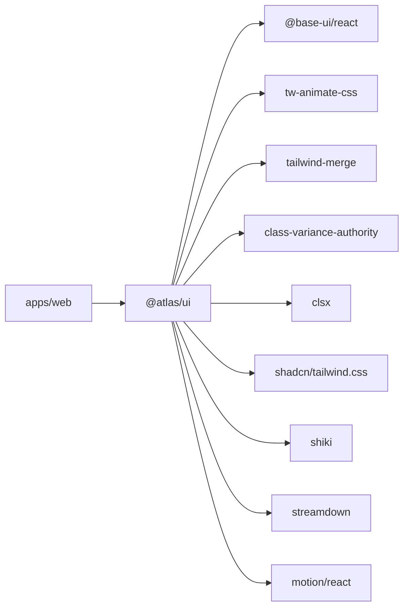

**Diagram sources**

- [package.json:16-38](file://packages/ui/package.json#L16-L38)
- [components.json (web app):14-19](file://apps/web/components.json#L14-L19)
- [agent-code.tsx:5](file://packages/ui/src/components/agents/agent-code.tsx#L5)
- [message.tsx:31](file://packages/ui/src/components/ai-elements/message.tsx#L31)
- [agent-disclosure.tsx:5](file://packages/ui/src/components/agents/agent-disclosure.tsx#L5)

**Section sources**

- [package.json:1-48](file://packages/ui/package.json#L1-L48)
- [components.json (web app):1-26](file://apps/web/components.json#L1-L26)

## Performance Considerations

- Prefer composition over prop drilling to reduce re-renders
- Use memoization for expensive computations when necessary
- Avoid unnecessary client-side code in server components; mark only interactive components as "use client"
- Leverage Tailwind's utility-first approach to minimize custom CSS
- Keep component trees shallow; split large components into focused parts
- Utilize token caching in AgentCode for syntax highlighting performance
- Implement streaming updates efficiently with proper cleanup
- Use reduced motion preferences for accessibility
- Optimize image generation with canvas-based animations

## Troubleshooting Guide

Common issues and resolutions:

- Theme not applying: Ensure next-themes provider wraps the app and sets attribute="class"; verify .dark class exists on root
- Colors not updating: Confirm variables are defined in both :root and .dark and registered in @theme inline
- Variant conflicts: Use cn to merge className; ensure cva variants do not conflict with user overrides
- Accessibility warnings: Provide titles for dialogs, labels for inputs, and fallbacks for avatars
- Mobile detection: Verify media query matches expected breakpoints; ensure hook runs in client context
- Syntax highlighting issues: Ensure Shiki highlighter is properly initialized and languages are configured
- Streaming performance: Monitor memory usage with large code blocks and implement proper cleanup
- File upload errors: Validate file types and sizes before processing
- Citation favicon loading: Handle CORS issues and provide fallback icons

**Section sources**

- [customization.md:50-109](file://.agents/skills/shadcn/customization.md#L50-L109)
- [composition.md:132-163](file://.agents/skills/shadcn/rules/composition.md#L132-L163)

## Conclusion

The UI library provides a robust, themeable, and accessible set of components built on shadcn/ui and Base UI, significantly expanded with comprehensive AI agent capabilities. With clear composition patterns, a centralized theming system, strong integration with Next.js, and specialized components for AI-powered applications, teams can consistently build sophisticated interfaces while maintaining flexibility and performance. The addition of agent-specific components, AI elements framework, and motion utilities enables developers to create modern AI applications with professional-grade user experiences.

## Appendices

### How to Add a New Shared Component

- Create a new file under packages/ui/src/components
- Wrap Base UI primitives with data-slot and styled via cn
- Export the component and any variants
- Import via alias from the web app

**Section sources**

- [README.md:56-68](file://README.md#L56-L68)
- [components.json (UI package):14-19](file://packages/ui/components.json#L14-L19)

### Prop Interfaces and Styling Patterns

- Use TypeScript types from primitives and extend with VariantProps for variants
- Merge className with cn to allow user overrides
- Use cva for consistent variant and size definitions

**Section sources**

- [button.tsx:1-58](file://packages/ui/src/components/button.tsx#L1-L58)
- [utils.ts:1-6](file://packages/ui/src/lib/utils.ts#L1-L6)

### Client vs Server Components

- Components that render portals or interact with DOM should be marked "use client"
- Keep server components pure; move interactivity to client components
- Theme provider must be a client component

**Section sources**

- [dialog.tsx:1-10](file://packages/ui/src/components/dialog.tsx#L1-L10)
- [theme-provider.tsx:1-12](file://apps/web/src/components/theme-provider.tsx#L1-L12)

### Accessibility Guidelines

- Always provide titles for overlays (Dialog, Sheet, Drawer)
- Use proper labels for form controls
- Include fallbacks for images (AvatarFallback)
- Respect focus-visible and keyboard navigation
- Support reduced motion preferences
- Implement proper ARIA attributes for dynamic content

**Section sources**

- [composition.md:132-163](file://.agents/skills/shadcn/rules/composition.md#L132-L163)

### Testing Guidelines

- Test component rendering with different variants and sizes
- Validate accessibility attributes (titles, labels, roles)
- Simulate interactions for client components (open/close dialogs)
- Assert theme application (light/dark) via class toggling
- Test streaming functionality with proper cleanup
- Verify syntax highlighting works across supported languages
- Test file upload and validation scenarios

### Documentation Standards

- Document props, variants, and usage examples
- Include accessibility notes and composition patterns
- Reference relevant rules and best practices
- Provide AI-specific usage examples and integration patterns

**Section sources**

- [SKILL.md:128-145](file://.agents/skills/shadcn/SKILL.md#L128-L145)

### Version Management in Monorepo

- Maintain versions in packages/ui/package.json
- Use Turborepo scripts for type checks and builds
- Coordinate updates across apps consuming the UI package
- Follow semantic versioning for breaking changes in AI components

**Section sources**

- [package.json:1-15](file://packages/ui/package.json#L1-L15)
- [README.md:96-107](file://README.md#L96-L107)

### AI-Specific Integration Patterns

- Use PromptInputProvider for global state management
- Implement proper streaming handlers for real-time updates
- Handle file uploads with validation and cleanup
- Manage citation references with unique IDs
- Implement proper error handling for AI operations
- Use motion components for enhanced user feedback

**Section sources**

- [prompt-input.tsx:248-366](file://packages/ui/src/components/ai-elements/prompt-input.tsx#L248-L366)
- [conversation.tsx:13-21](file://packages/ui/src/components/ai-elements/conversation.tsx#L13-L21)
- [reasoning.tsx:58-149](file://packages/ui/src/components/ai-elements/reasoning.tsx#L58-L149)
