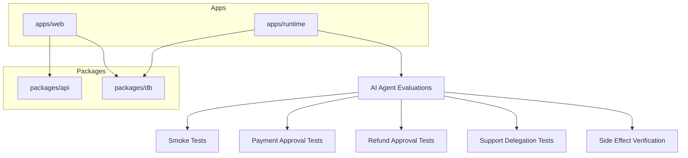
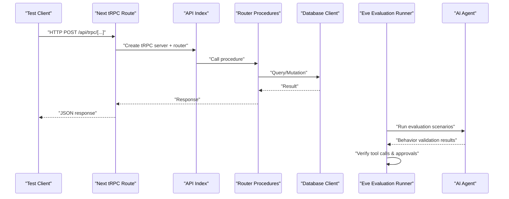
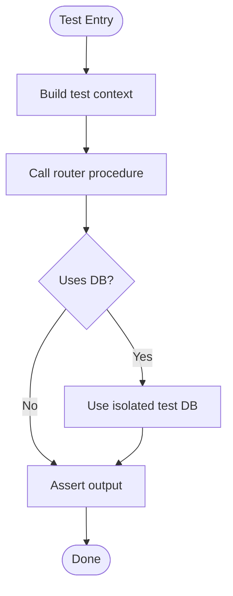
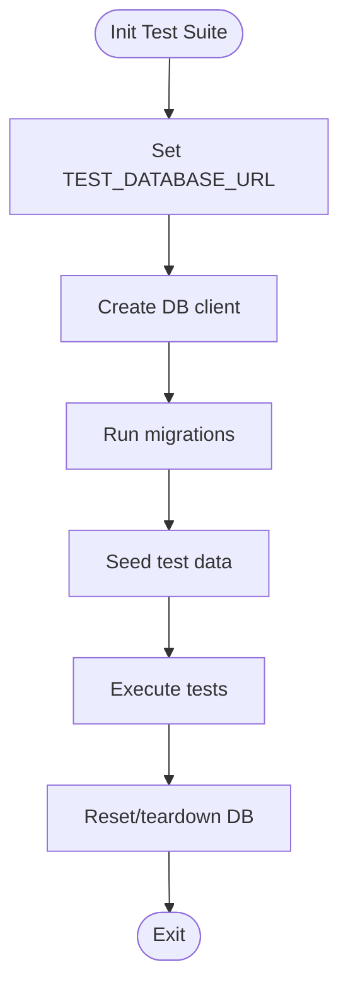
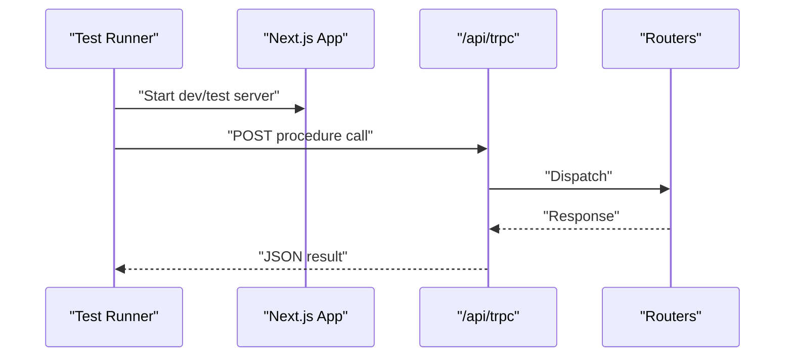
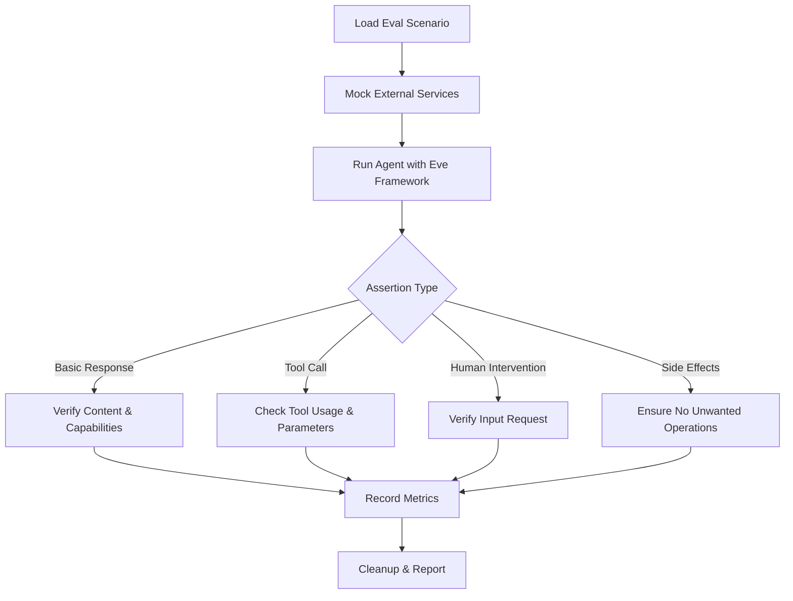
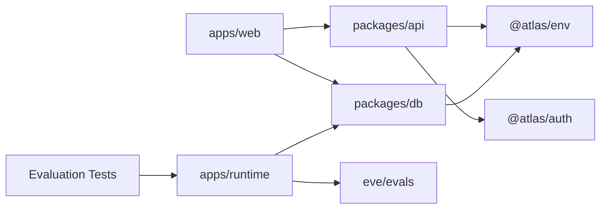

# Testing Strategy

<cite>
**Referenced Files in This Document**
- [package.json](file://package.json)
- [apps/web/package.json](file://apps/web/package.json)
- [packages/api/package.json](file://packages/api/package.json)
- [packages/db/package.json](file://packages/db/package.json)
- [apps/runtime/package.json](file://apps/runtime/package.json)
- [apps/runtime/tsconfig.json](file://apps/runtime/tsconfig.json)
- [apps/runtime/evals/evals.config.ts](file://apps/runtime/evals/evals.config.ts)
- [apps/runtime/evals/atlas/smoke.eval.ts](file://apps/runtime/evals/atlas/smoke.eval.ts)
- [apps/runtime/evals/atlas/payment-requires-approval.eval.ts](file://apps/runtime/evals/atlas/payment-requires-approval.eval.ts)
- [apps/runtime/evals/atlas/refund-requires-approval.eval.ts](file://apps/runtime/evals/atlas/refund-requires-approval.eval.ts)
- [apps/runtime/evals/atlas/support-delegation.eval.ts](file://apps/runtime/evals/atlas/support-delegation.eval.ts)
- [apps/runtime/evals/atlas/no-side-effects-from-greeting.eval.ts](file://apps/runtime/evals/atlas/no-side-effects-from-greeting.eval.ts)
- [apps/runtime/agent/agent.ts](file://apps/runtime/agent/agent.ts)
- [.agents/skills/eve/SKILL.md](file://.agents/skills/eve/SKILL.md)
- [packages/db/src/index.ts](file://packages/db/src/index.ts)
- [packages/db/src/migrations/0000_breezy_la_nuit.sql](file://packages/db/src/migrations/0000_breezy_la_nuit.sql)
- [packages/db/src/migrations/meta/0000_snapshot.json](file://packages/db/src/migrations/meta/0000_snapshot.json)
- [apps/web/src/app/api/trpc/[trpc]/route.ts](file://apps/web/src/app/api/trpc/[trpc]/route.ts)
- [apps/web/src/utils/trpc.ts](file://apps/web/src/utils/trpc.ts)
- [packages/api/src/routers/index.ts](file://packages/api/src/routers/index.ts)
- [packages/api/src/routers/user.ts](file://packages/api/src/routers/user.ts)
- [packages/api/src/routers/health.ts](file://packages/api/src/routers/health.ts)
- [packages/api/src/context.ts](file://packages/api/src/context.ts)
- [packages/api/src/index.ts](file://packages/api/src/index.ts)
- [.agents/skills/turborepo/references/environment/RULE.md](file://.agents/skills/turborepo/references/environment/RULE.md)
</cite>

## Update Summary

**Changes Made**

- Enhanced AI agent evaluation testing section with comprehensive Eve framework integration
- Added detailed coverage of smoke tests, payment approval workflows, refund approval workflows, support delegation, and side-effect verification tests
- Updated testing infrastructure to include structured evaluation scenarios with proper timeouts and assertions
- Expanded AI agent behaviors testing with specific evaluation examples and best practices
- Added new evaluation configuration patterns and test execution strategies for agent runtime
- **Updated**: Enhanced refund approval testing with direct refund demand verification and human approval pause requirements
- **Updated**: Enhanced support delegation testing with post-booking request routing to specialized support subagent

## Table of Contents

1. [Introduction](#introduction)
2. [Project Structure](#project-structure)
3. [Core Components](#core-components)
4. [Architecture Overview](#architecture-overview)
5. [Detailed Component Analysis](#detailed-component-analysis)
6. [Dependency Analysis](#dependency-analysis)
7. [Performance Considerations](#performance-considerations)
8. [Troubleshooting Guide](#troubleshooting-guide)
9. [Conclusion](#conclusion)
10. [Appendices](#appendices)

## Introduction

This document defines the testing strategy for the Atlas application, focusing on a comprehensive testing pyramid that covers unit tests for functions and components, integration tests for API endpoints and database operations, end-to-end tests for critical user workflows, and specialized evaluation tests for AI agent behaviors using the Eve framework. It outlines recommended frameworks (Jest for JavaScript/TypeScript unit and integration tests, Playwright for E2E, and Eve for AI agent evaluations), mocking strategies for external services, test data management, environment setup, and CI practices. Where applicable, it maps recommendations to the current codebase structure and configuration.

## Project Structure

Atlas is a monorepo with apps and shared packages:

- apps/web: Next.js frontend and API routes (including tRPC)
- packages/api: tRPC routers and server utilities
- packages/db: Database schema, migrations, and client initialization
- apps/runtime: Agent runtime with TypeScript config including comprehensive evals directory for AI agent testing



**Diagram sources**

- [apps/web/package.json:1-47](file://apps/web/package.json#L1-L47)
- [packages/api/package.json:1-28](file://packages/api/package.json#L1-L28)
- [packages/db/package.json:1-31](file://packages/db/package.json#L1-L31)
- [apps/runtime/package.json:1-34](file://apps/runtime/package.json#L1-L34)

**Section sources**

- [package.json:1-66](file://package.json#L1-L66)
- [apps/web/package.json:1-47](file://apps/web/package.json#L1-L47)
- [packages/api/package.json:1-28](file://packages/api/package.json#L1-L28)
- [packages/db/package.json:1-31](file://packages/db/package.json#L1-L31)
- [apps/runtime/package.json:1-34](file://apps/runtime/package.json#L1-L34)

## Core Components

- tRPC API layer: Routers define procedures; context provides request-scoped dependencies; index wires the router into the server.
- Database layer: Centralized client creation using Neon HTTP and Drizzle ORM; schema and migrations define the data model.
- Web app: Next.js routes expose tRPC endpoint and UI pages; client utilities configure the tRPC client.
- AI Agent Runtime: Comprehensive evaluation framework with structured test scenarios including smoke tests, payment approval workflows, refund approval workflows, support delegation, and side-effect verification tests.

Testing implications:

- Unit tests should target pure logic in routers and utility modules.
- Integration tests should exercise tRPC endpoints against a test database.
- E2E tests should drive real browser flows through the Next.js app.
- AI agent evaluations should verify agent behavior, tool usage, human intervention requirements, and side effect prevention using the Eve framework.

**Section sources**

- [packages/api/src/routers/index.ts](file://packages/api/src/routers/index.ts)
- [packages/api/src/routers/user.ts](file://packages/api/src/routers/user.ts)
- [packages/api/src/routers/health.ts](file://packages/api/src/routers/health.ts)
- [packages/api/src/context.ts](file://packages/api/src/context.ts)
- [packages/api/src/index.ts](file://packages/api/src/index.ts)
- [packages/db/src/index.ts:1-12](file://packages/db/src/index.ts#L1-L12)
- [apps/web/src/app/api/trpc/[trpc]/route.ts](file://apps/web/src/app/api/trpc/[trpc]/route.ts)
- [apps/web/src/utils/trpc.ts](file://apps/web/src/utils/trpc.ts)
- [apps/runtime/evals/atlas/smoke.eval.ts:1-13](file://apps/runtime/evals/atlas/smoke.eval.ts#L1-L13)
- [apps/runtime/evals/atlas/payment-requires-approval.eval.ts:1-18](file://apps/runtime/evals/atlas/payment-requires-approval.eval.ts#L1-L18)
- [apps/runtime/evals/atlas/refund-requires-approval.eval.ts:1-18](file://apps/runtime/evals/atlas/refund-requires-approval.eval.ts#L1-L18)
- [apps/runtime/evals/atlas/support-delegation.eval.ts:1-17](file://apps/runtime/evals/atlas/support-delegation.eval.ts#L1-L17)
- [apps/runtime/evals/atlas/no-side-effects-from-greeting.eval.ts:1-13](file://apps/runtime/evals/atlas/no-side-effects-from-greeting.eval.ts#L1-L13)

## Architecture Overview

The tRPC flow connects the Next.js API route to the API package routers, which interact with the database layer. The AI agent runtime provides comprehensive evaluation capabilities for testing agent behaviors using the Eve framework. Tests can intercept at multiple levels:

- Unit: Router procedures and helpers without network or DB
- Integration: tRPC route with a test DB instance
- E2E: Full browser automation via Playwright
- AI Agent Evaluations: Specialized tests for agent behavior validation, human intervention verification, and side effect prevention



**Diagram sources**

- [apps/web/src/app/api/trpc/[trpc]/route.ts](file://apps/web/src/app/api/trpc/[trpc]/route.ts)
- [packages/api/src/index.ts](file://packages/api/src/index.ts)
- [packages/api/src/routers/index.ts](file://packages/api/src/routers/index.ts)
- [packages/db/src/index.ts:1-12](file://packages/db/src/index.ts#L1-L12)
- [apps/runtime/evals/evals.config.ts:1-4](file://apps/runtime/evals/evals.config.ts#L1-L4)
- [apps/runtime/agent/agent.ts:1-35](file://apps/runtime/agent/agent.ts#L1-L35)

## Detailed Component Analysis

### tRPC Routers and Procedures

- Purpose: Define typed APIs for users, health checks, and domain features.
- Testing approach:
  - Unit: Call router procedures directly with mocked context and DB.
  - Integration: Spin up a test tRPC server bound to a test DB and call via HTTP or in-process client.
- Mocking:
  - Mock DB calls at the Drizzle layer or provide a test DB instance.
  - Mock external services via environment variables or dependency injection in context.



**Diagram sources**

- [packages/api/src/routers/user.ts](file://packages/api/src/routers/user.ts)
- [packages/api/src/routers/health.ts](file://packages/api/src/routers/health.ts)
- [packages/api/src/context.ts](file://packages/api/src/context.ts)
- [packages/db/src/index.ts:1-12](file://packages/db/src/index.ts#L1-L12)

**Section sources**

- [packages/api/src/routers/index.ts](file://packages/api/src/routers/index.ts)
- [packages/api/src/routers/user.ts](file://packages/api/src/routers/user.ts)
- [packages/api/src/routers/health.ts](file://packages/api/src/routers/health.ts)
- [packages/api/src/context.ts](file://packages/api/src/context.ts)

### Database Layer

- Purpose: Provide a typed DB client via Drizzle and Neon; migrations define schema.
- Testing approach:
  - Use a dedicated test database URL per run.
  - Run migrations before tests; truncate or reset state between tests.
  - For fast unit tests, mock DB calls; for integration tests, use a real DB.



**Diagram sources**

- [packages/db/src/index.ts:1-12](file://packages/db/src/index.ts#L1-L12)
- [packages/db/src/migrations/0000_breezy_la_nuit.sql:44-56](file://packages/db/src/migrations/0000_breezy_la_nuit.sql#L44-L56)
- [packages/db/src/migrations/meta/0000_snapshot.json:248-352](file://packages/db/src/migrations/meta/0000_snapshot.json#L248-L352)

**Section sources**

- [packages/db/src/index.ts:1-12](file://packages/db/src/index.ts#L1-L12)
- [packages/db/src/migrations/0000_breezy_la_nuit.sql:44-56](file://packages/db/src/migrations/0000_breezy_la_nuit.sql#L44-L56)
- [packages/db/src/migrations/meta/0000_snapshot.json:248-352](file://packages/db/src/migrations/meta/0000_snapshot.json#L248-L352)

### Next.js tRPC Endpoint

- Purpose: Expose tRPC over HTTP for the web app.
- Testing approach:
  - Integration: Hit the route with a test harness or in-process fetch.
  - E2E: Use Playwright to navigate UI flows that trigger tRPC calls.



**Diagram sources**

- [apps/web/src/app/api/trpc/[trpc]/route.ts](file://apps/web/src/app/api/trpc/[trpc]/route.ts)
- [packages/api/src/index.ts](file://packages/api/src/index.ts)
- [packages/api/src/routers/index.ts](file://packages/api/src/routers/index.ts)

**Section sources**

- [apps/web/src/app/api/trpc/[trpc]/route.ts](file://apps/web/src/app/api/trpc/[trpc]/route.ts)
- [apps/web/src/utils/trpc.ts](file://apps/web/src/utils/trpc.ts)

### React Components and Hooks

- Purpose: UI components and hooks in apps/web.
- Testing approach:
  - Unit: Render with React Testing Library (via Jest or Vitest) and assert behavior.
  - Mock tRPC client and external services via providers or mocks.
  - Focus on interactions, rendering states, and error boundaries.

[No sources needed since this section doesn't analyze specific source files]

### AI Agent Behaviors and Evaluations

**Updated** Enhanced with comprehensive AI agent evaluation testing infrastructure using the Eve framework, including structured test scenarios for behavior validation, human intervention verification, and side effect prevention.

- Purpose: Validate AI agent behaviors, ensure proper tool usage, enforce human intervention requirements, and prevent unintended side effects using the Eve evaluation framework.
- Testing approach:
  - Use the Eve evaluation framework (`eve/evals`) to define structured test scenarios with proper assertions and timeouts.
  - Implement smoke tests for basic functionality verification and capability validation.
  - Create payment and refund approval workflow tests to ensure proper human intervention is required.
  - Add support delegation tests to verify appropriate task routing to subagents.
  - Implement no-side-effect verification tests to prevent unwanted operations during simple interactions.
- Evaluation types:
  - **Smoke Tests**: Basic functionality validation (e.g., agent introduction, capability mentions)
  - **Payment Approval Workflows**: Verify payment processes require human approval when appropriate
  - **Refund Approval Workflows**: Ensure refund operations require proper authorization and confirmation with human approval pauses
  - **Support Delegation**: Confirm complex post-booking tasks are delegated to appropriate subagents instead of running inline
  - **No-Side-Effect Verification**: Ensure simple interactions don't trigger booking, search, or payment operations



**Diagram sources**

- [apps/runtime/evals/atlas/smoke.eval.ts:1-13](file://apps/runtime/evals/atlas/smoke.eval.ts#L1-L13)
- [apps/runtime/evals/atlas/payment-requires-approval.eval.ts:1-18](file://apps/runtime/evals/atlas/payment-requires-approval.eval.ts#L1-L18)
- [apps/runtime/evals/atlas/refund-requires-approval.eval.ts:1-18](file://apps/runtime/evals/atlas/refund-requires-approval.eval.ts#L1-L18)
- [apps/runtime/evals/atlas/support-delegation.eval.ts:1-17](file://apps/runtime/evals/atlas/support-delegation.eval.ts#L1-L17)
- [apps/runtime/evals/atlas/no-side-effects-from-greeting.eval.ts:1-13](file://apps/runtime/evals/atlas/no-side-effects-from-greeting.eval.ts#L1-L13)

**Section sources**

- [apps/runtime/evals/evals.config.ts:1-4](file://apps/runtime/evals/evals.config.ts#L1-L4)
- [apps/runtime/evals/atlas/smoke.eval.ts:1-13](file://apps/runtime/evals/atlas/smoke.eval.ts#L1-L13)
- [apps/runtime/evals/atlas/payment-requires-approval.eval.ts:1-18](file://apps/runtime/evals/atlas/payment-requires-approval.eval.ts#L1-L18)
- [apps/runtime/evals/atlas/refund-requires-approval.eval.ts:1-18](file://apps/runtime/evals/atlas/refund-requires-approval.eval.ts#L1-L18)
- [apps/runtime/evals/atlas/support-delegation.eval.ts:1-17](file://apps/runtime/evals/atlas/support-delegation.eval.ts#L1-L17)
- [apps/runtime/evals/atlas/no-side-effects-from-greeting.eval.ts:1-13](file://apps/runtime/evals/atlas/no-side-effects-from-greeting.eval.ts#L1-L13)
- [apps/runtime/package.json:1-34](file://apps/runtime/package.json#L1-L34)
- [apps/runtime/agent/agent.ts:1-35](file://apps/runtime/agent/agent.ts#L1-L35)
- [.agents/skills/eve/SKILL.md:1-21](file://.agents/skills/eve/SKILL.md#L1-L21)

## Dependency Analysis

Atlas uses a workspace-based monorepo. Packages depend on each other and share types/config. Tests should respect these boundaries:

- apps/web depends on @atlas/api and @atlas/db
- packages/api depends on @atlas/auth, @atlas/db, @atlas/env
- packages/db depends on @atlas/env and database drivers
- apps/runtime depends on eve framework for AI agent evaluation testing



**Diagram sources**

- [apps/web/package.json:1-47](file://apps/web/package.json#L1-L47)
- [packages/api/package.json:1-28](file://packages/api/package.json#L1-L28)
- [packages/db/package.json:1-31](file://packages/db/package.json#L1-L31)
- [apps/runtime/package.json:1-34](file://apps/runtime/package.json#L1-L34)

**Section sources**

- [apps/web/package.json:1-47](file://apps/web/package.json#L1-L47)
- [packages/api/package.json:1-28](file://packages/api/package.json#L1-L28)
- [packages/db/package.json:1-31](file://packages/db/package.json#L1-L31)
- [apps/runtime/package.json:1-34](file://apps/runtime/package.json#L1-L34)

## Performance Considerations

- Prefer unit tests for speed; keep them isolated and deterministic.
- Use a separate test database and parallelize integration tests where safe.
- Mock slow external services (AI providers, payment gateways) to reduce flakiness.
- Reuse fixtures and factories to avoid expensive setup per test.
- Limit E2E scope to critical paths; run them in CI only for important branches.
- **AI Agent Evaluations**: Keep evaluation tests focused and efficient; use appropriate timeouts (180 seconds for complex workflows); mock external AI service calls to ensure deterministic results; leverage Eve's built-in caching and optimization features.

[No sources needed since this section provides general guidance]

## Troubleshooting Guide

Common issues and remedies:

- Flaky E2E tests: Add explicit waits, stabilize selectors, and isolate network by mocking APIs when possible.
- DB-related failures: Ensure migrations run before tests; reset state between runs; verify TEST_DATABASE_URL is set.
- tRPC integration errors: Validate router inputs/outputs; check context setup; ensure correct environment variables.
- Coverage gaps: Configure coverage thresholds per package; add missing tests for edge cases and error paths.
- CI instability: Pin versions, cache dependencies, and run tests in a clean container; capture logs and artifacts.
- **AI Agent Evaluation Issues**:
  - Timeout errors: Adjust timeoutMs values in evaluation definitions (currently set to 180,000ms for complex workflows)
  - Tool call assertions: Verify tool names and parameters match expected signatures using `calledTool()` and `notCalledTool()` methods
  - Side effect prevention: Ensure proper isolation of test environments and use `requireInputRequest()` for human intervention verification
  - Human intervention: Use `t.cancel()` to properly terminate tests requiring manual approval
  - Evaluation configuration: Ensure proper setup in `evals.config.ts` and correct import paths
  - **Refund Approval Testing**: Verify that direct refund demands pause for human approval using `calledTool("refunds", { status: "pending" })` and `requireInputRequest({ toolName: "refunds" })`
  - **Support Delegation Testing**: Confirm that post-booking requests are correctly delegated to specialized support subagent using `calledTool("support")`

Environment and task configuration tips:

- Use Turbo tasks to pass test-specific env vars like TEST_DATABASE_URL.
- Keep secrets out of caches; use pass-through env for CI tokens.
- Configure evaluation timeouts appropriately for different test scenarios.
- Leverage Eve's development mode for faster iteration during test development.

**Section sources**

- [.agents/skills/turborepo/references/environment/RULE.md:88-124](file://.agents/skills/turborepo/references/environment/RULE.md#L88-L124)
- [apps/runtime/evals/atlas/payment-requires-approval.eval.ts:16-17](file://apps/runtime/evals/atlas/payment-requires-approval.eval.ts#L16-L17)
- [apps/runtime/evals/atlas/refund-requires-approval.eval.ts:16-17](file://apps/runtime/evals/atlas/refund-requires-approval.eval.ts#L16-L17)
- [apps/runtime/evals/atlas/support-delegation.eval.ts:15-16](file://apps/runtime/evals/atlas/support-delegation.eval.ts#L15-L16)

## Conclusion

Adopt a layered testing strategy aligned with the testing pyramid:

- Unit tests for pure logic and components
- Integration tests for tRPC endpoints and DB operations
- E2E tests for critical user journeys
- AI agent evaluations for behavior validation, human intervention verification, and side effect prevention using the Eve framework Leverage Jest for unit/integration, Playwright for E2E, Eve for AI agent evaluations, and a dedicated test database for reliable DB tests. Maintain high coverage on core modules, mock external services, and integrate tests into CI for continuous quality. The enhanced AI agent evaluation framework provides comprehensive testing capabilities for validating agent behaviors, ensuring proper human intervention workflows, and preventing unintended side effects. The updated refund approval and support delegation tests ensure robust verification of critical business workflows.

[No sources needed since this section summarizes without analyzing specific files]

## Appendices

### Recommended Test Setup Summary

- Unit and Integration
  - Framework: Jest (or Vitest if preferred)
  - Targets: Router procedures, utilities, React components
  - DB: In-memory or test DB with migrations applied
- E2E
  - Framework: Playwright
  - Targets: Critical flows across the Next.js app
  - Environment: Start Next.js server in test mode; seed data as needed
- AI Agent Evaluations
  - Framework: Eve (eve/evals)
  - Targets: Agent behavior validation, tool usage verification, human intervention verification, side effect prevention
  - Configuration: Structured evaluation definitions with assertions, timeouts, and proper cleanup
  - Test Types: Smoke tests, approval workflows, delegation tests, side effect verification
- Coverage
  - Enforce minimum thresholds per package
  - Report HTML and CI-friendly formats

### AI Agent Evaluation Examples

**Smoke Test Example**: Basic functionality verification

```typescript
// See: apps/runtime/evals/atlas/smoke.eval.ts
// Tests agent introduction and capability mentions
```

**Payment Approval Workflow Example**: Human intervention verification

```typescript
// See: apps/runtime/evals/atlas/payment-requires-approval.eval.ts
// Verifies payment processes require human approval
```

**Refund Approval Workflow Example**: Authorization verification with human approval pause

```typescript
// See: apps/runtime/evals/atlas/refund-requires-approval.eval.ts
// Ensures refund operations require proper authorization and pause for human approval
```

**Support Delegation Example**: Task routing verification

```typescript
// See: apps/runtime/evals/atlas/support-delegation.eval.ts
// Confirms complex post-booking tasks are delegated to appropriate subagents
```

**No-Side-Effect Verification Example**: Prevent unwanted operations

```typescript
// See: apps/runtime/evals/atlas/no-side-effects-from-greeting.eval.ts
// Ensures simple interactions don't trigger booking or search operations
```

[No sources needed since this section provides general guidance]
