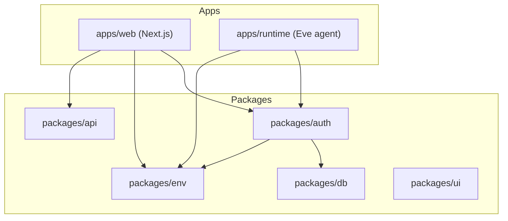
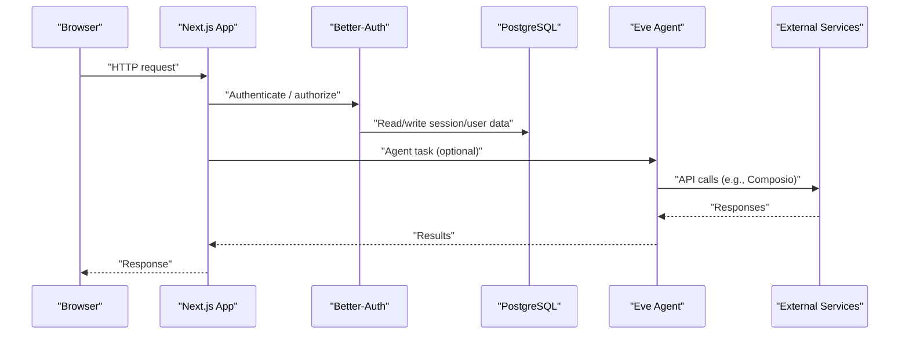
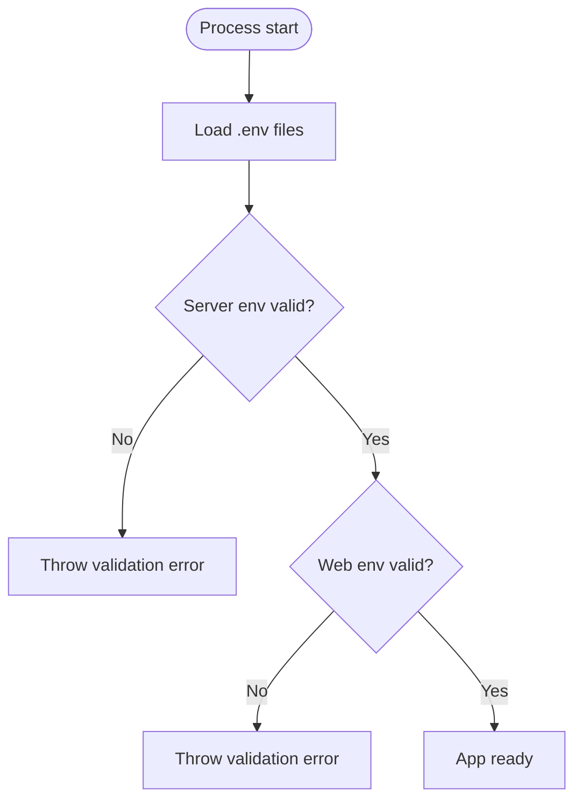
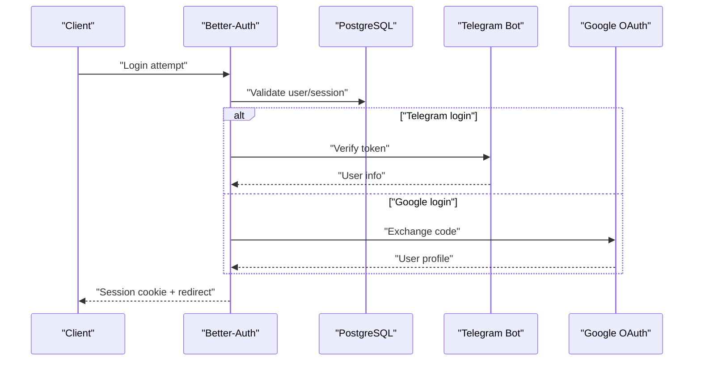
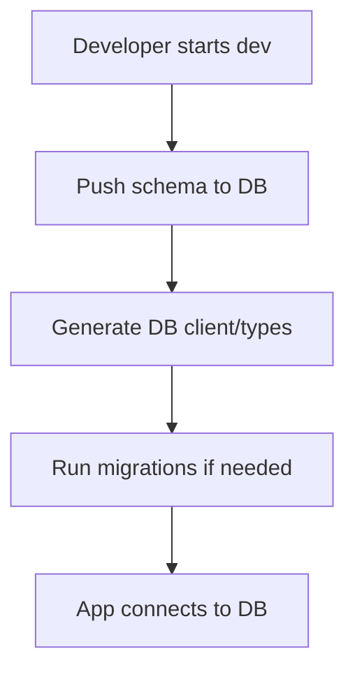
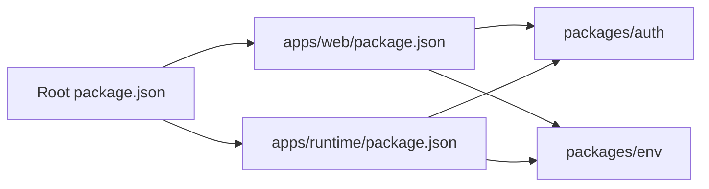

# Troubleshooting and FAQ

<cite>
**Referenced Files in This Document**
- [README.md](file://README.md)
- [package.json](file://package.json)
- [apps/web/package.json](file://apps/web/package.json)
- [apps/runtime/package.json](file://apps/runtime/package.json)
- [apps/web/.env](file://apps/web/.env)
- [packages/env/src/server.ts](file://packages/env/src/server.ts)
- [packages/env/src/web.ts](file://packages/env/src/web.ts)
- [packages/auth/src/index.ts](file://packages/auth/src/index.ts)
- [packages/db/src/schema/index.ts](file://packages/db/src/schema/index.ts)
- [apps/runtime/agent/agent.ts](file://apps/runtime/agent/agent.ts)
</cite>

## Table of Contents

1. Introduction
2. Project Structure
3. Core Components
4. Architecture Overview
5. Detailed Component Analysis
6. Dependency Analysis
7. Performance Considerations
8. Troubleshooting Guide
9. Conclusion
10. Appendices

## Introduction

This document provides comprehensive troubleshooting guidance and frequently asked questions for the Atlas application. It focuses on common setup problems (database connections, authentication configuration, environment variables), debugging techniques across frontend and backend, AI agent debugging, performance troubleshooting, integration-specific issues (Composio, Telegram, SMS), diagnostic commands, log analysis, monitoring approaches, and migration best practices.

## Project Structure

Atlas is a monorepo with:

- apps/web: Next.js frontend and API routes
- apps/runtime: AI agent runtime using Eve
- packages: Shared libraries for auth, db, env validation, UI, and API client

Key scripts are defined at the root to orchestrate development, builds, database operations, and type checks.

**Diagram sources**

- [package.json:29-40](file://package.json#L29-L40)
- [apps/web/package.json:11-34](file://apps/web/package.json#L11-L34)
- [apps/runtime/package.json:15-23](file://apps/runtime/package.json#L15-L23)

**Section sources**

- [README.md:79-107](file://README.md#L79-L107)
- [package.json:29-40](file://package.json#L29-L40)

## Core Components

- Environment validation: Server-side and web-side schemas enforce required variables and types.
- Authentication: Better-Auth configured with Drizzle adapter, Telegram plugin, Google social provider, cookies, and trusted origins.
- Database: PostgreSQL via Drizzle ORM; schema exported from db package.
- Runtime: Eve-based AI agent with model selection.

**Section sources**

- [packages/env/src/server.ts:5-28](file://packages/env/src/server.ts#L5-L28)
- [packages/env/src/web.ts:4-13](file://packages/env/src/web.ts#L4-L13)
- [packages/auth/src/index.ts:10-42](file://packages/auth/src/index.ts#L10-L42)
- [packages/db/src/schema/index.ts:1-3](file://packages/db/src/schema/index.ts#L1-L3)
- [apps/runtime/agent/agent.ts:1-8](file://apps/runtime/agent/agent.ts#L1-L8)

## Architecture Overview

The web app uses tRPC routes and Better-Auth endpoints. The runtime runs an AI agent that can call external tools (e.g., Composio). Environment variables drive configuration for DB, Auth, integrations, and CORS.

**Diagram sources**

- [packages/auth/src/index.ts:10-42](file://packages/auth/src/index.ts#L10-L42)
- [apps/runtime/agent/agent.ts:1-8](file://apps/runtime/agent/agent.ts#L1-L8)
- [apps/web/package.json:11-34](file://apps/web/package.json#L11-L34)

## Detailed Component Analysis

### Environment Variables Validation

- Server env enforces presence and format for critical keys like DATABASE_URL, BETTER_AUTH_* secrets, TELEGRAM_BOT_TOKEN, COMPOSIO_API_KEY, CORS_ORIGIN, and URLs.
- Web env exposes only NEXT_PUBLIC_APP_URL to the browser.

Common pitfalls:

- Missing or empty required server variables cause startup failures.
- Invalid URL formats for BETTER_AUTH_URL, CORS_ORIGIN, RUNTIME_URL, ATLAS_API_URL fail validation.
- Skipping validation intentionally via SKIP_ENV_VALIDATION should be used cautiously.

**Diagram sources**

- [packages/env/src/server.ts:5-28](file://packages/env/src/server.ts#L5-L28)
- [packages/env/src/web.ts:4-13](file://packages/env/src/web.ts#L4-L13)

**Section sources**

- [packages/env/src/server.ts:5-28](file://packages/env/src/server.ts#L5-L28)
- [packages/env/src/web.ts:4-13](file://packages/env/src/web.ts#L4-L13)
- [apps/web/.env:1-28](file://apps/web/.env#L1-L28)

### Authentication Configuration

- Uses Better-Auth with Drizzle adapter for PostgreSQL.
- Enables email/password, Telegram login, Google OAuth, last login method tracking, and Next.js cookies.
- Requires BASE URL, secret, trusted origins, and provider credentials.

Common pitfalls:

- Mismatched BETTER_AUTH_URL vs actual base URL leads to redirect/callback errors.
- Missing or invalid GOOGLE_CLIENT_ID/SECRET disables Google login.
- Incorrect TELEGRAM_BOT_TOKEN or USERNAME breaks Telegram auth.
- CORS_ORIGIN must include your frontend origin to allow cross-origin requests.

**Diagram sources**

- [packages/auth/src/index.ts:10-42](file://packages/auth/src/index.ts#L10-L42)
- [apps/web/.env:10-19](file://apps/web/.env#L10-L19)

**Section sources**

- [packages/auth/src/index.ts:10-42](file://packages/auth/src/index.ts#L10-L42)
- [apps/web/.env:1-28](file://apps/web/.env#L1-L28)

### Database Setup and Schema

- PostgreSQL connection via DATABASE_URL.
- Drizzle ORM used by auth and likely other services.
- Schema is centralized and re-exported.

Common pitfalls:

- Wrong DATABASE_URL or network access issues prevent migrations and queries.
- Schema drift between local and remote requires migrations or push.

**Diagram sources**

- [README.md:27-44](file://README.md#L27-L44)
- [packages/db/src/schema/index.ts:1-3](file://packages/db/src/schema/index.ts#L1-L3)

**Section sources**

- [README.md:27-44](file://README.md#L27-L44)
- [packages/db/src/schema/index.ts:1-3](file://packages/db/src/schema/index.ts#L1-L3)

### AI Agent Runtime (Eve)

- Agent model is configured in the runtime agent definition.
- Integrations (e.g., Composio) are available via dependencies.

Common pitfalls:

- Model name or provider not available causes agent initialization failures.
- Missing API keys for external tools break tool execution.

**Section sources**

- [apps/runtime/agent/agent.ts:1-8](file://apps/runtime/agent/agent.ts#L1-L8)
- [apps/runtime/package.json:15-23](file://apps/runtime/package.json#L15-L23)

## Dependency Analysis

- Root scripts orchestrate Turborepo tasks for dev/build/typecheck and DB operations scoped to @atlas/db.
- Web app depends on tRPC, React Query, Better-Auth, and shared packages.
- Runtime depends on Eve, AI SDK, and Composio packages.

**Diagram sources**

- [package.json:29-40](file://package.json#L29-L40)
- [apps/web/package.json:11-34](file://apps/web/package.json#L11-L34)
- [apps/runtime/package.json:15-23](file://apps/runtime/package.json#L15-L23)

**Section sources**

- [package.json:29-40](file://package.json#L29-L40)
- [apps/web/package.json:11-34](file://apps/web/package.json#L11-L34)
- [apps/runtime/package.json:15-23](file://apps/runtime/package.json#L15-L23)

## Performance Considerations

- Slow queries: Use database query logs and explain plans; ensure indexes exist for frequent filters; avoid N+1 patterns in tRPC resolvers.
- Memory leaks: Profile Node processes; check long-lived closures, event listeners, and unbounded caches.
- Resource bottlenecks: Monitor CPU/memory of both web and runtime processes; scale horizontally if needed; offload heavy work to background jobs.

[No sources needed since this section provides general guidance]

## Troubleshooting Guide

### Common Setup Problems

#### Database Connection Issues

Symptoms:

- Startup fails with connection errors.
- Migrations do not apply.

Checklist:

- Verify DATABASE_URL format and credentials.
- Ensure network access to the database host and port.
- Confirm SSL mode and channel binding settings match provider requirements.
- Re-run schema push and migrations after updating schema.

Commands:

- Apply schema: bun run db:push
- Generate DB client/types: bun run db:generate
- Run migrations: bun run db:migrate
- Open DB studio: bun run db:studio

**Section sources**

- [README.md:27-44](file://README.md#L27-L44)
- [package.json:34-37](file://package.json#L34-L37)
- [apps/web/.env:10](file://apps/web/.env#L10)

#### Authentication Configuration Errors

Symptoms:

- Login redirects loop or callback errors.
- Social login providers fail.
- Telegram login does not work.

Checklist:

- Set BETTER_AUTH_URL to the exact base URL of the running instance.
- Provide a strong BETTER_AUTH_SECRET (minimum length enforced).
- Configure CORS_ORIGIN to include your frontend origin.
- For Google: set GOOGLE_CLIENT_ID and GOOGLE_CLIENT_SECRET.
- For Telegram: set TELEGRAM_BOT_TOKEN and TELEGRAM_BOT_USERNAME.

**Section sources**

- [packages/env/src/server.ts:8-25](file://packages/env/src/server.ts#L8-L25)
- [packages/auth/src/index.ts:13-39](file://packages/auth/src/index.ts#L13-L39)
- [apps/web/.env:1-19](file://apps/web/.env#L1-L19)

#### Environment Variable Misconfigurations

Symptoms:

- Immediate validation errors on startup.
- Features disabled due to missing keys.

Checklist:

- Ensure all server-side required variables are present and correctly typed.
- Only expose NEXT_PUBLIC_APP_URL to the browser.
- Use SKIP_ENV_VALIDATION only for local debugging when necessary.

**Section sources**

- [packages/env/src/server.ts:5-28](file://packages/env/src/server.ts#L5-L28)
- [packages/env/src/web.ts:4-13](file://packages/env/src/web.ts#L4-L13)
- [apps/web/.env:1-28](file://apps/web/.env#L1-L28)

### Debugging Techniques

#### Frontend Debugging (Browser Developer Tools)

- Use Network tab to inspect tRPC calls and auth endpoints.
- Check Console for JavaScript errors and warnings.
- Inspect Cookies and Local Storage for session state.
- Use React DevTools to debug component state and props.

[No sources needed since this section provides general guidance]

#### Backend Logging and Error Tracking

- Enable verbose logging in development to capture request/response cycles.
- Centralize error logging around tRPC handlers and auth flows.
- Correlate logs with request IDs for tracing across services.

[No sources needed since this section provides general guidance]

#### AI Agent Debugging (Eve)

- Verify the selected model is available and correctly specified.
- Log tool invocations and responses from external services (e.g., Composio).
- Test agent capabilities in isolation before integrating into the full flow.

**Section sources**

- [apps/runtime/agent/agent.ts:1-8](file://apps/runtime/agent/agent.ts#L1-L8)
- [apps/runtime/package.json:15-23](file://apps/runtime/package.json#L15-L23)

### Performance Troubleshooting

#### Slow Queries

- Identify slow queries via database logs.
- Add appropriate indexes and rewrite inefficient queries.
- Batch operations and avoid unnecessary joins.

[No sources needed since this section provides general guidance]

#### Memory Leaks

- Capture heap snapshots during load tests.
- Look for growing arrays, unclosed streams, or global caches.
- Review event emitters and timers for proper cleanup.

[No sources needed since this section provides general guidance]

#### Resource Bottlenecks

- Monitor CPU and memory usage of web and runtime processes.
- Scale horizontally behind a reverse proxy if needed.
- Offload heavy processing to background workers.

[No sources needed since this section provides general guidance]

### Integration-Specific Issues

#### Composio Integration

- Ensure COMPOSIO_API_KEY is set and valid.
- Validate tool permissions and scopes in the Composio dashboard.
- Log request payloads and responses to diagnose API errors.

**Section sources**

- [apps/web/.env:27](file://apps/web/.env#L27)
- [apps/runtime/package.json:18-19](file://apps/runtime/package.json#L18-L19)

#### Telegram Bot Problems

- Verify TELEGRAM_BOT_TOKEN and TELEGRAM_BOT_USERNAME.
- Confirm bot is active and reachable.
- Check webhook or polling configuration if applicable.

**Section sources**

- [apps/web/.env:15-16](file://apps/web/.env#L15-L16)
- [packages/auth/src/index.ts:23-27](file://packages/auth/src/index.ts#L23-L27)

#### SMS Delivery Failures

- Ensure SMS provider credentials are configured (if used).
- Validate phone number formatting and carrier restrictions.
- Monitor delivery status and retry policies.

[No sources needed since this section provides general guidance]

### Diagnostic Commands and Log Analysis

Useful commands:

- Start all apps: bun run dev
- Start web only: bun run dev:web
- Type-check all packages: bun run check-types
- Database operations: bun run db:push, bun run db:generate, bun run db:migrate, bun run db:studio

Log analysis tips:

- Filter logs by service (web vs runtime).
- Search for error keywords and stack traces.
- Correlate timestamps across services using request IDs.

**Section sources**

- [package.json:29-40](file://package.json#L29-L40)
- [README.md:96-107](file://README.md#L96-L107)

### Monitoring Approaches

- Implement structured logging with levels (info, warn, error).
- Collect metrics for request latency, error rates, and resource usage.
- Set up alerts for critical thresholds and recurring errors.

[No sources needed since this section provides general guidance]

## Conclusion

This guide covers the most common issues and their resolutions for setting up and operating Atlas. By validating environment variables, ensuring correct authentication configuration, maintaining database connectivity, and applying systematic debugging and performance practices, you can quickly identify and resolve issues. Use the provided commands and strategies to keep the system healthy and performant.

## Appendices

### Frequently Asked Questions

- Why do I get validation errors on startup?
  - Ensure all required server environment variables are present and correctly formatted. See environment validation rules.

- How do I change the base URL for authentication?
  - Update BETTER_AUTH_URL to match your deployment domain and ensure CORS_ORIGIN includes your frontend.

- What if my database migrations fail?
  - Verify DATABASE_URL and network access; then re-run db:push and db:migrate.

- How do I enable or disable social login?
  - Configure or remove corresponding provider credentials in environment variables.

- How do I switch the AI model in the agent?
  - Update the model field in the agent definition file.

- How do I add new shared UI components?
  - Follow the instructions in the README to add shadcn components to the shared UI package.

**Section sources**

- [packages/env/src/server.ts:5-28](file://packages/env/src/server.ts#L5-L28)
- [packages/auth/src/index.ts:13-39](file://packages/auth/src/index.ts#L13-L39)
- [README.md:27-44](file://README.md#L27-L44)
- [apps/runtime/agent/agent.ts:1-8](file://apps/runtime/agent/agent.ts#L1-L8)
- [README.md:48-77](file://README.md#L48-L77)
